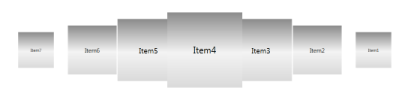

# Data Binding

Carousel is a fully data bound control, supports binding to different data sources such as IList Data Source, XML Data Source, Observable Collection Data Source and WCF Services. 

## Using Data Binding in an Application

To bind a collection to Carousel, use the ItemsSource property. 

You can create Rich Interface Applications by defining DataTemplate to a Carousel control.

The following code tells about Data Binding and DataTemplate.



<table>
<tr>
<td>
[XAML]<syncfusion:Carousel x:Name="carousel" Height="400" Width="450">     <syncfusion:Carousel.Path>         <Path Data="M0,300 L600,300" Stroke="Blue" StrokeThickness="2" HorizontalAlignment="Stretch" VerticalAlignment="Stretch"/>     </syncfusion:Carousel.Path>     <syncfusion:Carousel.OpacityFractions>         <syncfusion:PathFractionCollection>             <syncfusion:FractionValue Fraction="0" Value="1"/>         </syncfusion:PathFractionCollection>     </syncfusion:Carousel.OpacityFractions>     <syncfusion:Carousel.ItemTemplate>         <DataTemplate>             <Border Height="100" Width="100">                 <Border.Background>                     <LinearGradientBrush EndPoint="0.5,1" StartPoint="0.5,0">                         <GradientStop Color="#FF8B8B8B" Offset="0"/>                         <GradientStop Color="#FFDADADA" Offset="1"/>                         <GradientStop Color="#FFF3F3F3" Offset="0.536"/>                     </LinearGradientBrush>                 </Border.Background>                 <ContentControl Content="{Binding}" HorizontalAlignment="Center" VerticalAlignment="Center"/>             </Border>         </DataTemplate>     </syncfusion:Carousel.ItemTemplate> </syncfusion:Carousel></td></tr>
<tr>
<td>
[C#]carousel.ItemsSource = new ObservableCollection<string>() { "Item1", "Item2", "Item3", "Item4", "Item5", "Item6", "Item7", "Item8", "Item9" };</td></tr>
</table>



