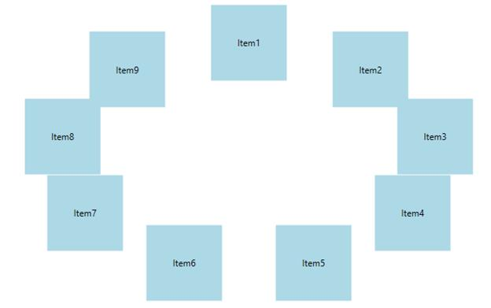

# Data Binding

Carousel is a fully data bound control, supports binding to different data sources such as IList Data Source, XML Data Source, Observable Collection Data Source.

## Using Data Binding in an Application

To bind a collection to Carousel, use the [ItemsSource](https://docs.microsoft.com/en-us/dotnet/api/system.windows.controls.itemscontrol.itemssource?view=netframework-4.7.2) property.

The user can create Rich Interface Applications by defining DataTemplate to a Carousel control.

The following code tells about Data Binding and DataTemplate.
The following section how to add the items programmatically using observable collection.

1.Create a class that act as a model for CarouselItem as follows.





public class Model
{

private string header;
public string Header
{
get { return header; }
set { header = value; }
}

}





Public Class Model

	Private m_header As String
	Public Property Header() As String
		Get
			Return m_header
		End Get
		Set
			m_header = value
		End Set
	End Property

End Class





2.	Create a ViewModel class and initialize the items as follows.





public class ViewModel
{
private ObservableCollection<Model> collection;
public ObservableCollection<Model> HeaderCollection
{
get { return collection; }
set { collection = value; }
}
public ViewModel()
{
HeaderCollection = new ObservableCollection<Model>();
HeaderCollection.Add(new Model() { Header = "Item1" });
HeaderCollection.Add(new Model() { Header = "Item2" });
HeaderCollection.Add(new Model() { Header = "Item3" });
HeaderCollection.Add(new Model() { Header = "Item4" });
HeaderCollection.Add(new Model() { Header = "Item5" });
HeaderCollection.Add(new Model() { Header = "Item6" });
HeaderCollection.Add(new Model() { Header = "Item7" });
HeaderCollection.Add(new Model() { Header = "Item8" });
HeaderCollection.Add(new Model() { Header = "Item9" });
HeaderCollection.Add(new Model() { Header = "Item10" });
}
}





Public Class ViewModel
Private m_collection As ObservableCollection(Of Model)
Public Property HeaderCollection() As ObservableCollection(Of Model)
Get
Return m_collection
End Get
Set
m_collection = value
End Set
End Property
Public Sub New()
HeaderCollection = New ObservableCollection(Of Model)()
HeaderCollection.Add(New Model() With { _
Key .Header = "Item1" _
})
HeaderCollection.Add(New Model() With { _
Key .Header = "Item2" _
})
HeaderCollection.Add(New Model() With { _
Key .Header = "Item3" _
})
HeaderCollection.Add(New Model() With { _
Key .Header = "Item4" _
})
HeaderCollection.Add(New Model() With { _
Key .Header = "Item5" _
})
HeaderCollection.Add(New Model() With { _
Key .Header = "Item6" _
})
HeaderCollection.Add(New Model() With { _
Key .Header = "Item7" _
})
HeaderCollection.Add(New Model() With { _
Key .Header = "Item8" _
})
HeaderCollection.Add(New Model() With { _
Key .Header = "Item9" _
})
HeaderCollection.Add(New Model() With { _
Key .Header = "Item10" _
})
End Sub
End Class





3. Create a ViewModel instance and use it as DataContext for the root window.





<Window.DataContext>
<local:ViewModel/>
</Window.DataContext>





4. Configure the ItemTemplate of carousel control to view business objects.





<syncfusion:Carousel Name="Carousel"
Margin="0,-50,10,0"
ItemsSource="{Binding HeaderCollection}"
VerticalAlignment="Center"
HorizontalAlignment="Center">
<syncfusion:Carousel.ItemTemplate>
<DataTemplate>
<Border Height="50" Width="100" BorderBrush="Purple" BorderThickness="5" Background="LightBlue">
<TextBlock Text="{Binding Header}"/>
</Border>

</DataTemplate>

</syncfusion:Carousel.ItemTemplate>

</syncfusion:Carousel>





