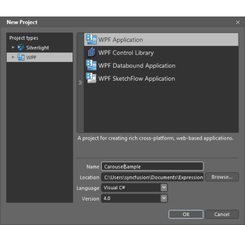
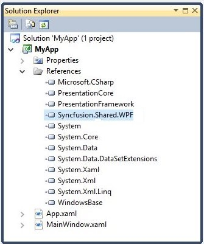
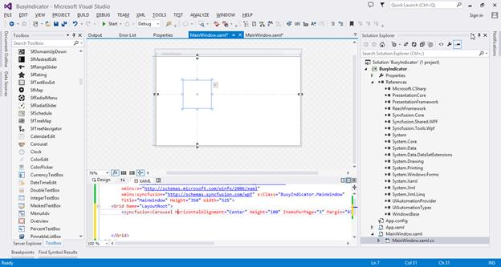

# Getting Started

## Structure of the Carousel Control

##   Adding carousel to an application

The Carousel control can be added to an application by using Visual Studio and Blend.

### Creating a Carousel control in C#

The steps to create a Carousel control by using Visual Studio in C# are as follows:

1.	Open Visual Studio.

2.	On the File menu, select New -> Project. This opens the New Project Dialog box.

   

3.  On the Project Dialog window, select WPF Application, in the name field, type the name of the project, and then click OK.
   
    

4.	Add the following reference with the sample project:
    1.	Syncfusion.Shared.WPF.dll

    

5.	Click the C# file, to open the C# file and add the carousel control to the application. Here is the code to create the carousel control in C#:





Carousel carousel = new Carousel();
carousel.Items.Add(new CarouselItem(){Content="1"});
carousel.Items.Add(new CarouselItem(){Content="2"});
carousel.Items.Add(new CarouselItem(){Content="3"});
carousel.Items.Add(new CarouselItem(){Content="4"});
carousel.Items.Add(new CarouselItem(){Content="5"});
this.LayoutRoot.Children.Add(carousel);





Dim carousel As New Carousel()
carousel.Items.Add(New CarouselItem() With { _
	Key .Content = "1" _
})
carousel.Items.Add(New CarouselItem() With { _
	Key .Content = "2" _
})
carousel.Items.Add(New CarouselItem() With { _
	Key .Content = "3" _
})
carousel.Items.Add(New CarouselItem() With { _
	Key .Content = "4" _
})
carousel.Items.Add(New CarouselItem() With { _
	Key .Content = "5" _
})
Me.LayoutRoot.Children.Add(carousel)





###     Creating Carousel control using XAML

Follow the below steps to add Carousel by using Visual Studio in XAML.

1. Create a new application in Visual Studio.

2. In the Visual Studio Toolbox, click Syncfusion Toolbox tab and select Carousel.

3. Drag and Drop the Carousel to design view, in order to add the Carousel control to your application.

4. In the properties window, customize the properties of the Carousel.

The below code shows how Carousel can be added to an application by using Visual Studio in XAML





<syncfusion:Carousel x:Name="carousel" Height="400" Width="450">        

<syncfusion:CarouselItem>

<syncfusion:CarouselItem.Content>

<Viewbox Height="100" Width="100">

<Image Source="/Images/1.jpg"/>

</Viewbox>

</syncfusion:CarouselItem.Content>

</syncfusion:CarouselItem>

<syncfusion:CarouselItem>

<syncfusion:CarouselItem.Content>

<Viewbox Height="100" Width="100">

<Image Source="/Images/2.jpg"/>

</Viewbox>

</syncfusion:CarouselItem.Content>

</syncfusion:CarouselItem>

<syncfusion:CarouselItem>

<syncfusion:CarouselItem.Content>

<Viewbox Height="100" Width="100">

<Image Source="/Images/3.jpg"/>

</Viewbox>

</syncfusion:CarouselItem.Content>

</syncfusion:CarouselItem>

<syncfusion:CarouselItem>

<syncfusion:CarouselItem.Content>

<Viewbox Height="100" Width="100">

<Image Source="/Images/4.jpg"/>

</Viewbox>

</syncfusion:CarouselItem.Content>

</syncfusion:CarouselItem>

<syncfusion:CarouselItem>

<syncfusion:CarouselItem.Content>

<Viewbox Height="100" Width="100">

<Image Source="/Images/5.jpg"/>

</Viewbox>

</syncfusion:CarouselItem.Content>

</syncfusion:CarouselItem>

<syncfusion:CarouselItem>

<syncfusion:CarouselItem.Content>

<Viewbox Height="100" Width="100">

<Image Source="/Images/6.jpg"/>

</Viewbox>

</syncfusion:CarouselItem.Content>

</syncfusion:CarouselItem>

<syncfusion:CarouselItem>

<syncfusion:CarouselItem.Content>

<Viewbox Height="100" Width="100">

<Image Source="/Images/7.jpg"/>

</Viewbox>

</syncfusion:CarouselItem.Content>

</syncfusion:CarouselItem>

<syncfusion:CarouselItem>

<syncfusion:CarouselItem.Content>

<Viewbox Height="100" Width="100">

<Image Source="/Images/8.jpg"/>

</Viewbox>

</syncfusion:CarouselItem.Content>

</syncfusion:CarouselItem>

</syncfusion:Carousel>









Carousel carousel = new Carousel() { Margin=40, RadiusX = 220, RadiusY = -100, ScaleFraction=0.60 };

Image image = new Image();
Image image1 = new Image();
Image image2 = new Image();
Image image3 = new Image();
Image image4 = new Image();
Image image5 = new Image();
Image image6 = new Image();
Image image7 = new Image();

BitmapImage bitimg = new BitmapImage(new Uri("/Sample;component/Images/1.png", UriKind.RelativeOrAbsolute));
BitmapImage bitimg1 = new BitmapImage(new Uri("/Sample;component/Images/2.png", UriKind.RelativeOrAbsolute));
BitmapImage bitimg2 = new BitmapImage(new Uri("/Sample;component/Images/3.png", UriKind.RelativeOrAbsolute));
BitmapImage bitimg3 = new BitmapImage(new Uri("/Sample;component/Images/4.png", UriKind.RelativeOrAbsolute));
BitmapImage bitimg4 = new BitmapImage(new Uri("/Sample;component/Images/5.png", UriKind.RelativeOrAbsolute));
BitmapImage bitimg5 = new BitmapImage(new Uri("/Sample;component/Images/6.png", UriKind.RelativeOrAbsolute));
BitmapImage bitimg6 = new BitmapImage(new Uri("/Sample;component/Images/7.png", UriKind.RelativeOrAbsolute));
BitmapImage bitimg7 = new BitmapImage(new Uri("/Sample;component/Images/8.png", UriKind.RelativeOrAbsolute));

image.Source = bitimg as ImageSource;
image1.Source = bitimg1 as ImageSource;
image2.Source = bitimg2 as ImageSource;
image3.Source = bitimg3 as ImageSource;
image4.Source = bitimg4 as ImageSource;
image5.Source = bitimg5 as ImageSource;
image6.Source = bitimg6 as ImageSource;
image7.Source = bitimg7 as ImageSource;

Viewbox viewbox1 = new Viewbox();
Viewbox viewbox2 = new Viewbox();
Viewbox viewbox3 = new Viewbox();
Viewbox viewbox4 = new Viewbox();
Viewbox viewbox5 = new Viewbox();
Viewbox viewbox6 = new Viewbox();
Viewbox viewbox7 = new Viewbox();
Viewbox viewbox8 = new Viewbox();

viewbox1.Child = image;
viewbox2.Child = image1;
viewbox3.Child = image2;
viewbox4.Child = image3;
viewbox5.Child = image4;
viewbox6.Child = image5;
viewbox7.Child = image6;
viewbox8.Child = image7;
            
carousel.Items.Add(new CarouselItem() {Content = viewbox1 });
carousel.Items.Add(new CarouselItem() { Content = viewbox2 });
carousel.Items.Add(new CarouselItem() { Content = viewbox3 });
carousel.Items.Add(new CarouselItem() { Content = viewbox4 });
carousel.Items.Add(new CarouselItem() { Content = viewbox5 });
carousel.Items.Add(new CarouselItem() { Content = viewbox6 });
carousel.Items.Add(new CarouselItem() { Content = viewbox7 });
carousel.Items.Add(new CarouselItem() { Content = viewbox6 });





Dim carousel As Carousel = New Carousel

Dim image As Image = New Image
Dim image1 As Image = New Image
Dim image2 As Image = New Image
Dim image3 As Image = New Image
Dim image4 As Image = New Image
Dim image5 As Image = New Image
Dim image6 As Image = New Image
Dim image7 As Image = New Image
Dim bitimg As BitmapImage = New BitmapImage(New Uri("/Sample;component/Images/1.png", UriKind.RelativeOrAbsolute))
Dim bitimg1 As BitmapImage = New BitmapImage(New Uri("/Sample;component/Images/2.png", UriKind.RelativeOrAbsolute))
Dim bitimg2 As BitmapImage = New BitmapImage(New Uri("/Sample;component/Images/3.png", UriKind.RelativeOrAbsolute))
Dim bitimg3 As BitmapImage = New BitmapImage(New Uri("/Sample;component/Images/4.png", UriKind.RelativeOrAbsolute))
Dim bitimg4 As BitmapImage = New BitmapImage(New Uri("/Sample;component/Images/5.png", UriKind.RelativeOrAbsolute))
Dim bitimg5 As BitmapImage = New BitmapImage(New Uri("/Sample;component/Images/6.png", UriKind.RelativeOrAbsolute))
Dim bitimg6 As BitmapImage = New BitmapImage(New Uri("/Sample;component/Images/7.png", UriKind.RelativeOrAbsolute))
Dim bitimg7 As BitmapImage = New BitmapImage(New Uri("/Sample;component/Images/8.png", UriKind.RelativeOrAbsolute))
image.Source = CType(bitimg,ImageSource)
image1.Source = CType(bitimg1,ImageSource)
image2.Source = CType(bitimg2,ImageSource)
image3.Source = CType(bitimg3,ImageSource)
image4.Source = CType(bitimg4,ImageSource)
image5.Source = CType(bitimg5,ImageSource)
image6.Source = CType(bitimg6,ImageSource)
image7.Source = CType(bitimg7,ImageSource)
Dim viewbox1 As Viewbox = New Viewbox
Dim viewbox2 As Viewbox = New Viewbox
Dim viewbox3 As Viewbox = New Viewbox
Dim viewbox4 As Viewbox = New Viewbox
Dim viewbox5 As Viewbox = New Viewbox
Dim viewbox6 As Viewbox = New Viewbox
Dim viewbox7 As Viewbox = New Viewbox
Dim viewbox8 As Viewbox = New Viewbox
viewbox1.Child = image
viewbox2.Child = image1
viewbox3.Child = image2
viewbox4.Child = image3
viewbox5.Child = image4
viewbox6.Child = image5
viewbox7.Child = image6
viewbox8.Child = image7
carousel.Items.Add(New CarouselItem)
carousel.Items.Add(New CarouselItem)
carousel.Items.Add(New CarouselItem)
carousel.Items.Add(New CarouselItem)
carousel.Items.Add(New CarouselItem)
carousel.Items.Add(New CarouselItem)
carousel.Items.Add(New CarouselItem)
carousel.Items.Add(New CarouselItem)





