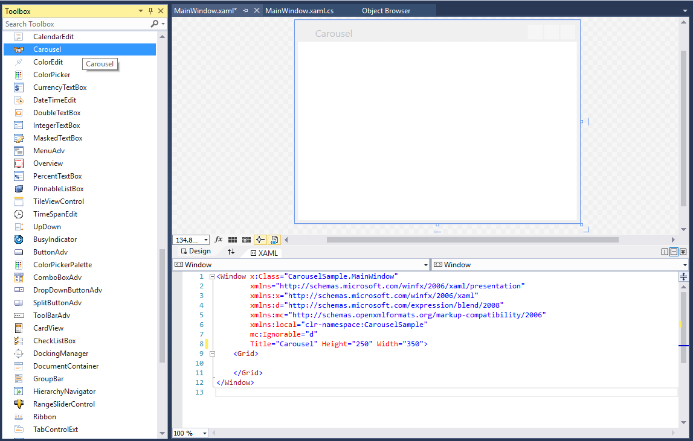
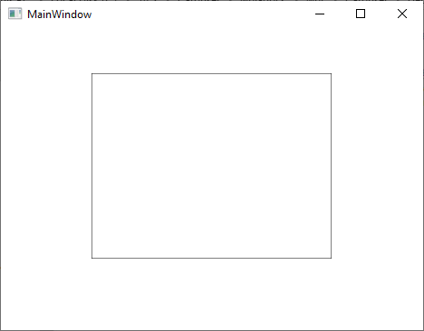

# Getting Started with WPF Carousel

This section explains how to create a WPF [Carousel](https://help.syncfusion.com/cr/wpf/Syncfusion.Windows.Shared.Carousel.html) and explains about its structure.

## Structure of Carousel

## Assembly deployment

Refer to the [Control Dependencies](https://help.syncfusion.com/wpf/control-dependencies#carousel) section to get the list of assemblies or NuGet package that needs to be added as a reference to use the control in any application.

Refer to this [documentation](https://help.syncfusion.com/wpf/visual-studio-integration/nuget-packages) to find more details about installing nuget packages in a WPF application.

## Adding WPF Carousel via designer

1) The `Carousel` can be added to an application by dragging it from the toolbox to a designer view. The following dependent assemblies will be added automatically:

* Syncfusion.Shared.WPF

2) Set the properties for `Carousel` in design mode using the SmartTag feature.

## Adding WPF Carousel via XAML

To add the `Carousel` manually in XAML, follow these steps:

1) Create a new WPF project in Visual Studio.

2) Add the following required assembly references to the project:

* Syncfusion.Shared.WPF

3) Import Syncfusion WPF schema **http://schemas.syncfusion.com/wpf**, and declare the Carousel in XAML page.





<Window x:Class="Carousel_sample.MainWindow"
        xmlns="http://schemas.microsoft.com/winfx/2006/xaml/presentation"
        xmlns:x="http://schemas.microsoft.com/winfx/2006/xaml"
        xmlns:d="http://schemas.microsoft.com/expression/blend/2008"
        xmlns:mc="http://schemas.openxmlformats.org/markup-compatibility/2006"
        xmlns:local="clr-namespace:Carousel_sample"
        xmlns:syncfusion="http://schemas.syncfusion.com/wpf"
        mc:Ignorable="d"
        Title="MainWindow" Height="450" Width="800">

    <Grid Name="grid">
        <syncfusion:Carousel Name="carousel"
                             Height="200"
                             Width="200"/>
    </Grid>
</Window>




## Adding WPF Carousel via C#

To add the `Carousel` manually in C#, follow these steps:

1) Create a new WPF application via Visual Studio.

2) Add the following required assembly references to the project:

* Syncfusion.Shared.WPF

3) Include the required namespace.




using Syncfusion.Windows.Shared;




4) Create an instance of `Carousel`, and add it to the window.




// Creating an instance of the Carousel
Carousel carousel = new Carousel();

// Setting height and width to Carousel
carousel.Height = 200;
carousel.Width = 260;




N> [View Sample in GitHub](https://github.com/SyncfusionExamples/syncfusion-wpf-carousel-examples/tree/master/Samples/CarouselItem-Selection)

## Populating items using CarouselItem

You can add the carousel items inside the control using the [CarouselItem](https://help.syncfusion.com/cr/wpf/Syncfusion.Windows.Shared.CarouselItem.html) property.




<syncfusion:Carousel x:Name="carousel" 
                     Height="700" Width="500">
    <syncfusion:CarouselItem>
        <syncfusion:CarouselItem.Content>
            <Viewbox Height="100" Width="100">
                <Image Source="Images/Buchanan.png"/>
            </Viewbox>
        </syncfusion:CarouselItem.Content>
    </syncfusion:CarouselItem>
    <syncfusion:CarouselItem>
        <syncfusion:CarouselItem.Content>
            <Viewbox Height="100" Width="100">
                <Image Source="Images/Callahan.png"/>
            </Viewbox>
        </syncfusion:CarouselItem.Content>
    </syncfusion:CarouselItem>
    <syncfusion:CarouselItem>
        <syncfusion:CarouselItem.Content>
            <Viewbox Height="100" Width="100">
                <Image Source="Images/Davolio-1.png"/>
            </Viewbox>
        </syncfusion:CarouselItem.Content>
    </syncfusion:CarouselItem>
    <syncfusion:CarouselItem>
        <syncfusion:CarouselItem.Content>
            <Viewbox Height="100" Width="100">
                <Image Source="Images/Callahan.png"/>
            </Viewbox>
        </syncfusion:CarouselItem.Content>
    </syncfusion:CarouselItem>
    <syncfusion:CarouselItem>
        <syncfusion:CarouselItem.Content>
            <Viewbox Height="100" Width="100">
                <Image Source="Images/dodsworth.png"/>
            </Viewbox>
        </syncfusion:CarouselItem.Content>
    </syncfusion:CarouselItem>
    <syncfusion:CarouselItem>
        <syncfusion:CarouselItem.Content>
            <Viewbox Height="100" Width="100">
                <Image Source="Images/Fuller.png"/>
            </Viewbox>
        </syncfusion:CarouselItem.Content>
    </syncfusion:CarouselItem>
    <syncfusion:CarouselItem>
        <syncfusion:CarouselItem.Content>
            <Viewbox Height="100" Width="100">
                <Image Source="Images/King.png"/>
            </Viewbox>
        </syncfusion:CarouselItem.Content>
    </syncfusion:CarouselItem>
    <syncfusion:CarouselItem>
        <syncfusion:CarouselItem.Content>
            <Viewbox Height="100" Width="100">
                <Image Source="Images/Leverling.png"/>
            </Viewbox>
        </syncfusion:CarouselItem.Content>
    </syncfusion:CarouselItem>
</syncfusion:Carousel>




Carousel carousel = new Carousel()
{ 
	Width=700, 
	Height = 500
};

Image image = new Image();
Image image1 = new Image();
Image image2 = new Image();
Image image3 = new Image();
Image image4 = new Image();
Image image5 = new Image();
Image image6 = new Image();
Image image7 = new Image();

BitmapImage bitimg1 = new BitmapImage(new Uri("/Sample;component/Images/1.png", UriKind.RelativeOrAbsolute));
BitmapImage bitimg2 = new BitmapImage(new Uri("/Sample;component/Images/2.png", UriKind.RelativeOrAbsolute));
BitmapImage bitimg3 = new BitmapImage(new Uri("/Sample;component/Images/3.png", UriKind.RelativeOrAbsolute));
BitmapImage bitimg4 = new BitmapImage(new Uri("/Sample;component/Images/4.png", UriKind.RelativeOrAbsolute));
BitmapImage bitimg5 = new BitmapImage(new Uri("/Sample;component/Images/5.png", UriKind.RelativeOrAbsolute));
BitmapImage bitimg6 = new BitmapImage(new Uri("/Sample;component/Images/6.png", UriKind.RelativeOrAbsolute));
BitmapImage bitimg7 = new BitmapImage(new Uri("/Sample;component/Images/7.png", UriKind.RelativeOrAbsolute));
BitmapImage bitimg8 = new BitmapImage(new Uri("/Sample;component/Images/8.png", UriKind.RelativeOrAbsolute));

image.Source = bitimg1 as ImageSource;
image1.Source = bitimg2 as ImageSource;
image2.Source = bitimg3 as ImageSource;
image3.Source = bitimg4 as ImageSource;
image4.Source = bitimg5 as ImageSource;
image5.Source = bitimg6 as ImageSource;
image6.Source = bitimg7 as ImageSource;
image7.Source = bitimg8 as ImageSource;
          
carousel.Items.Add(new CarouselItem() { Content = new Viewbox(){ Child = image }});
carousel.Items.Add(new CarouselItem() { Content = new Viewbox(){ Child = image1 }});
carousel.Items.Add(new CarouselItem() { Content = new Viewbox(){ Child = image2 }});
carousel.Items.Add(new CarouselItem() { Content = new Viewbox(){ Child = image3 }});
carousel.Items.Add(new CarouselItem() { Content = new Viewbox(){ Child = image4 }});
carousel.Items.Add(new CarouselItem() { Content = new Viewbox(){ Child = image5 }});
carousel.Items.Add(new CarouselItem() { Content = new Viewbox(){ Child = image6 }});
carousel.Items.Add(new CarouselItem() { Content = new Viewbox(){ Child = image7 }});




N> [View Sample in GitHub](https://github.com/SyncfusionExamples/syncfusion-wpf-carousel-examples/tree/master/Samples/CarouselItem-Selection)

## Populating items using collection binding

You can populate items to the `Carousel` control by setting the collection value to the `ItemsSource` property. 




//Model.cs
public class CarouselModel {
	public string Header { get; set; }
}

//ViewModel.cs
public class ViewModel {
	private ObservableCollection<CarouselModel> collection;
	public ObservableCollection<CarouselModel> HeaderCollection
	{
		get {
			return collection;
		}
		set {
			collection = value;
		}
	}
	public ViewModel() {
		HeaderCollection = new ObservableCollection<CarouselModel>();
		HeaderCollection.Add(new CarouselModel() { Header = "Buchanan" });
		HeaderCollection.Add(new CarouselModel() { Header = "Callahan" });
		HeaderCollection.Add(new CarouselModel() { Header = "Davolio" });
		HeaderCollection.Add(new CarouselModel() { Header = "Dodsworth" });
		HeaderCollection.Add(new CarouselModel() { Header = "Fuller" });
		HeaderCollection.Add(new CarouselModel() { Header = "King" });
		HeaderCollection.Add(new CarouselModel() { Header = "Leverling" });
		HeaderCollection.Add(new CarouselModel() { Header = "Suyama" });
	}
}







<Window.DataContext>
    <local:ViewModel/>
</Window.DataContext>

<Grid>
    <syncfusion:Carousel Name="Carousel"
                         ItemsSource="{Binding HeaderCollection}">
        <syncfusion:Carousel.ItemTemplate>
            <DataTemplate>
                <Border Height="50" 
                        Width="100" 
                        BorderBrush="Purple" 
                        BorderThickness="5"
                        Background="LightBlue">
                    <TextBlock HorizontalAlignment="Center" 
                               VerticalAlignment="Center" 
                               Text="{Binding Header}"/>
                </Border>
            </DataTemplate>
        </syncfusion:Carousel.ItemTemplate>
    </syncfusion:Carousel>
</Grid>




N> [View Sample in GitHub](https://github.com/SyncfusionExamples/syncfusion-wpf-carousel-examples/tree/master/Samples/Binding)

## Select carousel item

You can select a carousel item by mouse click on the specific item. You can get the selected item and its value by using the [SelectedItem](https://help.syncfusion.com/cr/wpf/Syncfusion.Windows.Shared.Carousel.html#Syncfusion_Windows_Shared_Carousel_SelectedItem) and [SelectedValue](https://help.syncfusion.com/cr/wpf/Syncfusion.Windows.Shared.Carousel.html#Syncfusion_Windows_Shared_Carousel_SelectedValue) properties. You can also get the selected item index by using the [SelectedIndex](https://help.syncfusion.com/cr/wpf/Syncfusion.Windows.Shared.Carousel.html#Syncfusion_Windows_Shared_Carousel_SelectedIndex) property. You can only select a single item at a time.

### Select carousel item programmatically using property

You can select a particular carousel item programmatically by using the [CarouselItem.IsSelected](https://help.syncfusion.com/cr/wpf/Syncfusion.Windows.Shared.CarouselItem.html#Syncfusion_Windows_Shared_CarouselItem_IsSelected) property.




<Window.Resources>
    
</Window.Resources>
<Grid>
    <syncfusion:Carousel ItemContainerStyle="{StaticResource selecteditemStyle}" 
                         x:Name="carousel">
        <syncfusion:CarouselItem Content="Item1"/>
        <syncfusion:CarouselItem Content="Item2"/>
        <syncfusion:CarouselItem Content="Item3" IsSelected="True"/>
        <syncfusion:CarouselItem Content="Item4"/>
        <syncfusion:CarouselItem Content="Item5"/>
    </syncfusion:Carousel>




N> [View Sample in GitHub](https://github.com/SyncfusionExamples/syncfusion-wpf-carousel-examples/tree/master/Samples/CarouselItem-Selection)

### Select carousel item programmatically using command and methods

You can select a previous, next, first or last carousel items programmatically by using the commands and methods.

* [SelectFirstItemCommand](https://help.syncfusion.com/cr/wpf/Syncfusion.Windows.Shared.Carousel.html#Syncfusion_Windows_Shared_Carousel_SelectFirstItemCommand) or [SelectFirstItem()](https://help.syncfusion.com/cr/wpf/Syncfusion.Windows.Shared.Carousel.html#Syncfusion_Windows_Shared_Carousel_SelectFirstItem().html) - To select the first item.

* [SelectLastItemCommand](https://help.syncfusion.com/cr/wpf/Syncfusion.Windows.Shared.Carousel.html#Syncfusion_Windows_Shared_Carousel_SelectLastItemCommand) or [SelectLastItem()](https://help.syncfusion.com/cr/wpf/Syncfusion.Windows.Shared.Carousel.html#Syncfusion_Windows_Shared_Carousel_SelectLastItem().html) - To select the last item.

* [SelectPreviousItemCommand](https://help.syncfusion.com/cr/wpf/Syncfusion.Windows.Shared.Carousel.html#Syncfusion_Windows_Shared_Carousel_SelectPreviousItemCommand) or [SelectPreviousItem](https://help.syncfusion.com/cr/wpf/Syncfusion.Windows.Shared.Carousel.html#Syncfusion_Windows_Shared_Carousel_SelectPreviousItem().html) - To select the previous item from the currently selected item

* [SelectNextItemCommand](https://help.syncfusion.com/cr/wpf/Syncfusion.Windows.Shared.Carousel.html#Syncfusion_Windows_Shared_Carousel_SelectNextItemCommand) or [SelectNextItem()](https://help.syncfusion.com/cr/wpf/Syncfusion.Windows.Shared.Carousel.html#Syncfusion_Windows_Shared_Carousel_SelectNextItem().html) - To select the next item from the currently selected item.

* [SelectPreviousPageCommand](https://help.syncfusion.com/cr/wpf/Syncfusion.Windows.Shared.Carousel.html#Syncfusion_Windows_Shared_Carousel_SelectPreviousPageCommand) or [SelectPreviousPage()](https://help.syncfusion.com/cr/wpf/Syncfusion.Windows.Shared.Carousel.html#Syncfusion_Windows_Shared_Carousel_SelectPreviousPage().html) - To select the previous page item.

* [SelectNextPageCommand](https://help.syncfusion.com/cr/wpf/Syncfusion.Windows.Shared.Carousel.html#Syncfusion_Windows_Shared_Carousel_SelectNextPageCommand) or [SelectNextPage()](https://help.syncfusion.com/cr/wpf/Syncfusion.Windows.Shared.Carousel.html#Syncfusion_Windows_Shared_Carousel_SelectNextPage().html) - To select the next page item.

N> [View Sample in GitHub](https://github.com/SyncfusionExamples/syncfusion-wpf-carousel-examples/tree/master/Samples/Carousel-Scrolling)

## Rotate carousel item

You can place the carousel item with a specific rotation angle by using the [RotationAngle](https://help.syncfusion.com/cr/wpf/Syncfusion.Windows.Shared.Carousel.html#Syncfusion_Windows_Shared_Carousel_RotationAngle) property. You can change the rotation speed of the carousel items by using the [RotationSpeed](https://help.syncfusion.com/cr/wpf/Syncfusion.Windows.Shared.Carousel.html#Syncfusion_Windows_Shared_Carousel_RotationSpeed) property. You can also disable the rotate animation by using the [EnableRotationAnimation](https://help.syncfusion.com/cr/wpf/Syncfusion.Windows.Shared.Carousel.html#Syncfusion_Windows_Shared_Carousel_EnableRotationAnimation) property value as `false`. The default value of `RotationAngle` property is `0` and `RotationSpeed` property is `200` and `EnableRotationAnimation` property is `true`.




<syncfusion:Carousel RotationAngle="180" 
                     RotationSpeed="500" 
                     EnableRotationAnimation="True"
                     ItemsSource="{Binding HeaderCollection}"
                     Name="carousel" />




carousel.RotationAngle = 180;
carousel.RotationSpeed = 500;
carousel.EnableRotationAnimation = true;




N> [View Sample in GitHub](https://github.com/SyncfusionExamples/syncfusion-wpf-carousel-examples/tree/master/Samples/StandardPath)

## Resize the carousel items

If you want to change the size of the carousel items except the selected item, use the [ScaleFraction](https://help.syncfusion.com/cr/wpf/Syncfusion.Windows.Shared.Carousel.html#Syncfusion_Windows_Shared_Carousel_ScaleFraction) property. You can disable it by setting the [ScalingEnabled](https://help.syncfusion.com/cr/wpf/Syncfusion.Windows.Shared.Carousel.html#Syncfusion_Windows_Shared_Carousel_ScalingEnabled) property value as `false`. Value range of `ScaleFraction` property is `0` to `1`. The default value `ScaleFraction` property is `0` and `ScalingEnabled` property is `true`.




<syncfusion:Carousel ScaleFraction="0.50"
                     ItemsSource="{Binding HeaderCollection}"
                     Name="carousel"/>




carousel. ScaleFraction = 0.50;




N> [View Sample in GitHub](https://github.com/SyncfusionExamples/syncfusion-wpf-carousel-examples/tree/master/Samples/StandardPath)

## Change radius of carousel item

You can change the radius of the `Carousel` control by setting the value to the [RadiusX](https://help.syncfusion.com/cr/wpf/Syncfusion.Windows.Shared.Carousel.html#Syncfusion_Windows_Shared_Carousel_RadiusX) and [RadiusY](https://help.syncfusion.com/cr/wpf/Syncfusion.Windows.Shared.Carousel.html#Syncfusion_Windows_Shared_Carousel_RadiusY) properties. Based on the radius points , items are arranged. The default value of `RadiusX` property is `250` and `RadiusY` property is `150`. 




<syncfusion:Carousel RadiusX="100" 
                     RadiusY="100"
                     ItemsSource="{Binding HeaderCollection}"
                     Name="carousel"/>




carousel.RadiusX = 100;
carousel.RadiusY = 100;




N> [View Sample in GitHub](https://github.com/SyncfusionExamples/syncfusion-wpf-carousel-examples/tree/master/Samples/StandardPath)

## Custom UI of carousel item

You can customize the appearance of each carousel item by using the `ItemTemplate` property. If you want to change the appearance of particular carousel item appearance, use `ItemTemplateSelector` property. The `DataContext` of the `ItemTemplate` property is `CarouselItem`.




//Model.cs
public class CarouselModel {
	public string Header { get; set; }
}

//ViewModel.cs
public class ViewModel {
	private ObservableCollection<CarouselModel> collection;
	public ObservableCollection<CarouselModel> HeaderCollection	{
		get {
			return collection;
		}
		set {
			collection = value;
		}
	}
	public ViewModel() {
		HeaderCollection = new ObservableCollection<CarouselModel>();
		HeaderCollection.Add(new CarouselModel() { Header = "Buchanan" });
		HeaderCollection.Add(new CarouselModel() { Header = "Callahan" });
		HeaderCollection.Add(new CarouselModel() { Header = "Davolio" });
		HeaderCollection.Add(new CarouselModel() { Header = "Dodsworth" });
		HeaderCollection.Add(new CarouselModel() { Header = "Fuller" });
		HeaderCollection.Add(new CarouselModel() { Header = "King" });
		HeaderCollection.Add(new CarouselModel() { Header = "Leverling" });
		HeaderCollection.Add(new CarouselModel() { Header = "Suyama" });
	}
}







<Window.DataContext>
    <local:ViewModel/>
</Window.DataContext>

<Grid>
    <syncfusion:Carousel ItemsSource="{Binding HeaderCollection}"
                         ScaleFraction="0.5"
                         Name="carousel" >
        <syncfusion:Carousel.ItemTemplate>
            <DataTemplate>
                <Grid>
                    <Ellipse Width="200" Height="100" 
                             Stroke="Green" 
                             StrokeThickness="4"
                             Fill="Yellow"/>
                    <TextBlock HorizontalAlignment="Center" 
                               VerticalAlignment="Center" 
                               Text="{Binding Header}"/>
                </Grid>
            </DataTemplate>
        </syncfusion:Carousel.ItemTemplate>
    </syncfusion:Carousel>
</Grid>




N> [View Sample in GitHub](https://github.com/SyncfusionExamples/syncfusion-wpf-carousel-examples/tree/master/Samples/ItemTemplate)

## Custom display path for carousel items

You can change the custom display path of the carousel items by using the [Carousel.Path](https://help.syncfusion.com/cr/wpf/Syncfusion.Windows.Shared.Carousel.html#Syncfusion_Windows_Shared_Carousel_Path) property. You can enable it by setting the [VisualMode](https://help.syncfusion.com/cr/wpf/Syncfusion.Windows.Shared.Carousel.html#Syncfusion_Windows_Shared_Carousel_VisualMode) property as `VisualMode.CustomPath`. The default value of `Carousel.Path` property is `null` and `VisualMode` property is `Standard`.




<syncfusion:Carousel VisualMode="CustomPath"
                     ItemsSource="{Binding HeaderCollection}"
                     Name="carousel">
    <syncfusion:Carousel.Path>
        <Path Data="M0,100 L100,20" 
              Stroke="Blue" 
              StrokeThickness="2" 
              HorizontalAlignment="Stretch"
              VerticalAlignment="Stretch"/>
    </syncfusion:Carousel.Path>
</syncfusion:Carousel>




carousel.VisualMode = VisualMode.CustomPath;




N> [View Sample in GitHub](https://github.com/SyncfusionExamples/syncfusion-wpf-carousel-examples/tree/master/Samples/Binding)

## Number of items to be visible in Page

By default, all the items are displayed in the `Carousel` control. If you will be added more items and wants to display less number of items at a time, use the [ItemsPerPage](https://help.syncfusion.com/cr/wpf/Syncfusion.Windows.Shared.Carousel.html#Syncfusion_Windows_Shared_Carousel_ItemsPerPage) property. `ItemsPerPage` is  effective only on `VisualMode.CustomPath` view mode. The default value of `ItemsPerPage` property is `-1`.




<syncfusion:Carousel ItemsPerPage="3"
                     VisualMode="CustomPath"
                     ItemsSource="{Binding HeaderCollection}"
                     Name="carousel"/>




carousel.ItemsPerPage = 3;
carousel.VisualMode = VisualMode.CustomPath;




N> [View Sample in GitHub](https://github.com/SyncfusionExamples/syncfusion-wpf-carousel-examples/tree/master/Samples/CustomPath)

## Selected item changed notification

The selected item changed in `Carousel` can be examined using [SelectionChanged](https://help.syncfusion.com/cr/wpf/Syncfusion.Windows.Shared.Carousel.html) event. The `SelectionChanged` event contains the old and newly selected item in the `OldValue` and `NewValue` properties.




 <syncfusion:Carousel SelectionChanged="Carousel_SelectionChanged"
                      ItemsSource="{Binding HeaderCollection}"
                      Name="carousel"/>




Carousel carousel = new Carousel();
carousel.SelectionChanged += Carousel_SelectionChanged;




You can handle the event as follows,




private void Carousel_SelectionChanged(DependencyObject d, DependencyPropertyChangedEventArgs e) {
    //Get old and new selected carousel item
    var oldValue = e.OldValue;
    var newValue = e.NewValue;
}




## Theme

Carousel supports various built-in themes. Refer to the below links to apply themes for the Carousel,

  * [Apply theme using SfSkinManager](https://help.syncfusion.com/wpf/themes/skin-manager)
	
  * [Create a custom theme using ThemeStudio](https://help.syncfusion.com/wpf/themes/theme-studio#creating-custom-theme)

   
