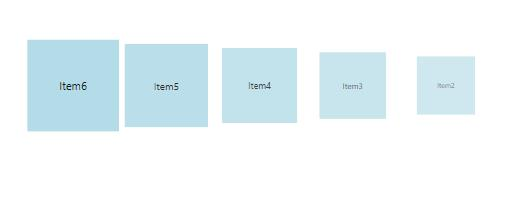

## Change SelectedItem Position

To change the position of SelectedItem in a given path, use **TopItemPosition** property

<table>
<tr>
<td>
Property  </td><td>
Description  </td><td>
Type  </td><td>
Data Type  </td></tr>
<tr>
<td>
TopItemPosition  </td><td>
Sets the SelectedItemPosition in Panel.  </td><td>
DependencyProperty  </td><td>
Double  </td></tr>
</table>
In the below example, TopItemPosition is set to 0.0. So the SelectedItem will be displayed at the beginning of the Path.





<syncfusion:Carousel x:Name="carousel" SelectedIndex="3"  VerticalAlignment="Top" VisualMode="CustomPath" Height="257" Width="558"  ItemsPerPage="5" OpacityEnabled="True" ScalingEnabled="True" SkewAngleXEnabled="False"

TopItemPosition="0" >

<syncfusion:Carousel.Path>

<Path Data="M0,300L600,300" Stroke="Blue" StrokeThickness="2" HorizontalAlignment="Stretch" VerticalAlignment="Stretch"/>

</syncfusion:Carousel.Path>

<syncfusion:Carousel.OpacityFractions>

<syncfusion:PathFractionCollection>

<!--Fraction represents the position in Path-

Value represents the Opacity of Carousel item in a particular point-->

<syncfusion:FractionValue Fraction="0" Value="1"/>

<syncfusion:FractionValue Fraction="1" Value="0.5"/>

</syncfusion:PathFractionCollection>

</syncfusion:Carousel.OpacityFractions>

<syncfusion:Carousel.ScaleFractions>

<syncfusion:PathFractionCollection>

<syncfusion:FractionValue Fraction="0" Value="1"/>

<syncfusion:FractionValue Fraction="1" Value="0.5"/>

</syncfusion:PathFractionCollection>

</syncfusion:Carousel.ScaleFractions>

<syncfusion:Carousel.ItemTemplate>

<DataTemplate>

<Border Height="100" Width="100" Background="LightBlue">

<ContentControl Content="{Binding}" HorizontalAlignment="Center" VerticalAlignment="Center"/>

</Border>

</DataTemplate>

</syncfusion:Carousel.ItemTemplate>

</syncfusion:Carousel>









carousel.ItemsSource = new ObservableCollection<string>() { "Item1", "Item2", "Item3", "Item4", "Item5", "Item6", "Item7", "Item8", "Item9" };





carousel.ItemsSource = New ObservableCollection(Of String)() From { _
	"Item1", _
	"Item2", _
	"Item3", _
	"Item4", _
	"Item5", _
	"Item6", _
	"Item7", _
	"Item8", _
	"Item9" _
}





