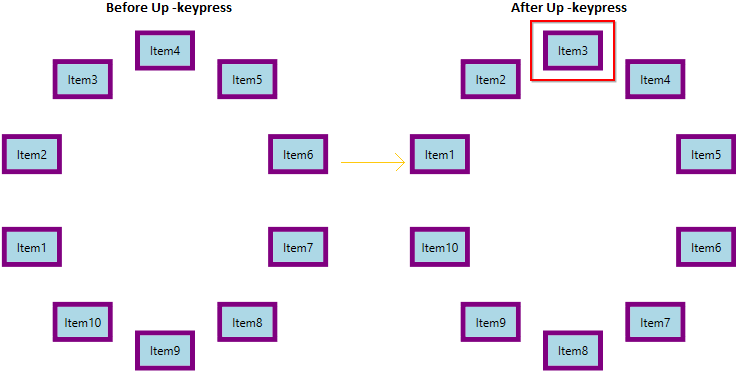
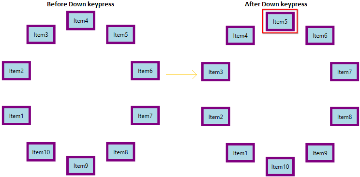
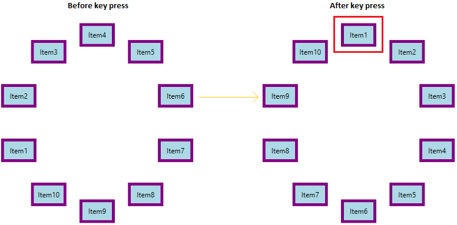
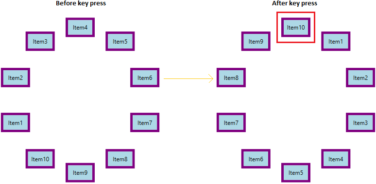
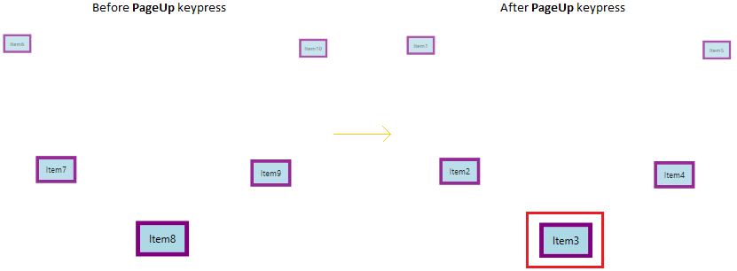
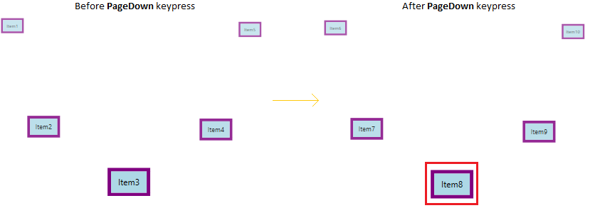
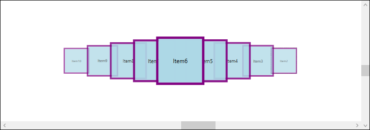
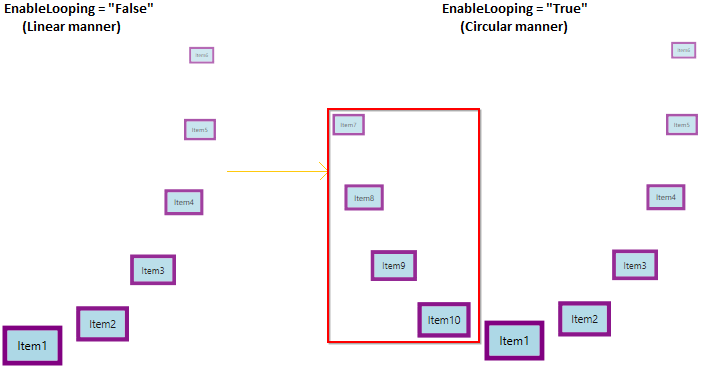

# Items Navigation in WPF Carousel

You can navigate to the carousel items by using the mouse or key navigation in the [Carousel](https://help.syncfusion.com/cr/wpf/Syncfusion.Windows.Shared.Carousel.html) control. 

## Navigate carousel item using keyboard navigation

You can navigate to the previous or next carousel items one by one either backward or forward direction by pressing the keys in the keyboard.




//Model.cs
public class Model {
    private string header;
    public string Header {
        get { return header; }
        set { header = value; }
    }
}

//Viewmodel.cs
public class ViewModel {
    private ObservableCollection<Model> carouselItem;
    public ObservableCollection<Model> CarouselItem {
        get { return carouselItem; }
        set { carouselItem = value; }
    }
    public ViewModel() {
        CarouselItem = new ObservableCollection<Model>();
        CarouselItem.Add(new Model() { Header = "Item1" });
        CarouselItem.Add(new Model() { Header = "Item2" });
        CarouselItem.Add(new Model() { Header = "Item3" });
        CarouselItem.Add(new Model() { Header = "Item4" });
        CarouselItem.Add(new Model() { Header = "Item5" });
        CarouselItem.Add(new Model() { Header = "Item6" });
        CarouselItem.Add(new Model() { Header = "Item7" });
        CarouselItem.Add(new Model() { Header = "Item8" });
        CarouselItem.Add(new Model() { Header = "Item9" });
        CarouselItem.Add(new Model() { Header = "Item10" });
    }
}







<syncfusion:Carousel Name="Carousel"
                     ItemsSource="{Binding CarouselItem}">
    <syncfusion:Carousel.DataContext>
        <local:ViewModel/>
    </syncfusion:Carousel.DataContext>
    <syncfusion:Carousel.ItemTemplate>
        <DataTemplate>
            <Border Height="40"
                    Width="60"
                    BorderBrush="Purple"
                    BorderThickness="5"
                    Background="LightBlue">
                <TextBlock Text="{Binding Header}" 
                           HorizontalAlignment="Center"
                           VerticalAlignment="Center"/>
            </Border>
        </DataTemplate>
    </syncfusion:Carousel.ItemTemplate>
</syncfusion:Carousel>




The following table explains how to navigating the carousel item using keyboard,

<table>
<tr>
<th> S.No </th>
<th> Key </th>
<th> Description </th>
<th> Image </th>
</tr>
<tr>
<td>1</td>
<td>Up, Left</td>
<td>Navigate to the previous item from the currently selected item.</td>
<td>
</td>
</tr>
<tr>
<td>2</td>
<td>Down, Right</td>
<td>Navigate to the next item from the currently selected item.</td>
<td>
</td>
</tr>
<tr>
<td>3</td>
<td>Home, Ctrl+Up, Ctrl+Left</td>
<td>Navigate to the first item from the currently selected item.</td>
<td>
</td>
</tr>
<tr>
<td>4</td>
<td>End, Ctrl+Down, Ctrl+Right</td>
<td>Navigate to the last item from the currently selected item.</td>
<td>
</td>
</tr>
<tr>
<td>5</td>
<td>Page Up</td>
<td>Navigate to the previous page item from the current page item based on the ItemsPerPage property value. Here, ItemsPerPage value is 5.</td>
<td>
</td>
</tr>
<tr>
<td>6</td>
<td>Page Down</td>
<td>Navigate to the next page item from the current page item based on the ItemsPerPage property value. Here, ItemsPerPage value is 5.</td>
<td>
</td>
</tr>
</table>

N> [View Sample in GitHub](https://github.com/SyncfusionExamples/syncfusion-wpf-carousel-examples/tree/master/Samples/Carousel-Scrolling)

## Navigate carousel item using scroll bar

By default, scroll bars are in collapsed state. If you want to navigate to the previous or next item one by one from the currently selected item using scroll bars, you need to enable the visibility of vertical or horizontal scroll bars by setting the `ScrollViewer.VerticalScrollBarVisibility` or `ScrollViewer.HorizontalScrollBarVisibility` properties value as `Visible` or `auto`. 

N> If you set `ScrollViewer.VerticalScrollBarVisibility` or `ScrollViewer.HorizontalScrollBarVisibility` properties value as `Auto`, the scroll bar is automatically visible, based on the items.




<syncfusion:Carousel ScrollViewer.VerticalScrollBarVisibility="Visible" 
                     ScrollViewer.HorizontalScrollBarVisibility="Visible"
                     VisualMode="CustomPath"
                     Name="carousel"
                     ItemsSource="{Binding CarouselItem}">
    <syncfusion:Carousel.Path>
        <Path Data="M0,0 L100,0" />
    </syncfusion:Carousel.Path>

    <syncfusion:Carousel.DataContext>
        <local:ViewModel/>
    </syncfusion:Carousel.DataContext>
    <syncfusion:Carousel.ItemTemplate>
        <DataTemplate>
            <Border Height="100"
                    Width="100"
                    BorderBrush="Purple"
                    BorderThickness="5"
                    Background="LightBlue">
                <TextBlock Text="{Binding Header}" 
                           HorizontalAlignment="Center"
                           VerticalAlignment="Center"/>
            </Border>
        </DataTemplate>
    </syncfusion:Carousel.ItemTemplate>
</syncfusion:Carousel>




ScrollViewer.SetHorizontalScrollBarVisibility(carousel, ScrollBarVisibility.Visible);
ScrollViewer.SetVerticalScrollBarVisibility(carousel, ScrollBarVisibility.Visible);




N> [View Sample in GitHub](https://github.com/SyncfusionExamples/syncfusion-wpf-carousel-examples/tree/master/Samples/Carousel-Scrolling)

## Navigate carousel item using mouse wheel

You can navigate to the previous or next item one by one from the currently selected item by using the mouse wheel on forward and backward direction.

N> [View Sample in GitHub](https://github.com/SyncfusionExamples/syncfusion-wpf-carousel-examples/tree/master/Samples/Carousel-Scrolling)

## Navigate using commands

You can easily navigate to the first, last, previous or next items and also previous page or next pages by using the built-in commands in the `Carousel` control.

<table>
<tr>
<th> S.No </th>
<th> Command </th>
<th> Description </th>
<th> Keyboard shortcut </th>
</tr>
<tr>
<td>1</td>
<td>SelectFirstItemCommand</td>
<td>This command selects the first item in carousel control. It is executed when home key is pressed.</td>
<td>Home</td>
</tr>
<tr>
<td>2</td>
<td>SelectLastItemCommand</td>
<td>This command selects the last item in carousel control. It is executed when end key is pressed.</td>
<td>End</td>
</tr>
<tr>
<td>3</td>
<td>SelectNextItemCommand</td>
<td>This command selects the next item in carousel control. It is executed when right or down arrow key is pressed.</td>
<td>Right and Down arrow</td>
</tr>
<tr>
<td>4</td>
<td>SelectPreviousItemCommand</td>
<td>This command selects the previous item in carousel control. It is executed when left or top arrow key is pressed.</td>
<td>Left and Top arrow</td>
</tr>
<tr>
<td>5</td>
<td>SelectNextPageCommand</td>
<td>This command selects the item in next page of carousel control. It is executed when page down key is pressed.</td>
<td>PageDown</td>
</tr>
<tr>
<td>6</td>
<td>SelectPreviousPageCommand</td>
<td>This command selects the item in previous page of carousel control. It is executed when page up key is pressed.</td>
<td>PageUp</td>
</tr>
</table>

N> [View Sample in GitHub](https://github.com/SyncfusionExamples/syncfusion-wpf-carousel-examples/tree/master/Samples/Carousel-Scrolling)

## Looping items in Custom path view

Carousel has looping functionality, it allows users to loop items after reaching the last item. In the `Standard` visual mode, the carousal items can be scrolled on the circular manner. But, on the `CustomPath` visual mode, the carousal items scrolled in linear manner and first or last item hidden from the view. If you want to bring the first or last item into view in circular manner, use [EnableLooping](https://help.syncfusion.com/cr/wpf/Syncfusion.Windows.Shared.Carousel.html#Syncfusion_Windows_Shared_Carousel_EnableLooping) property value as `true`. The default value of `EnableLooping` property is `false`.




<syncfusion:Carousel EnableLooping="True"
                     VisualMode="CustomPath"
                     Name="Carousel"
                     ItemsSource="{Binding CarouselItem}">
    <syncfusion:Carousel.Path>
        <Path Data="M0,0 L100,0" />
    </syncfusion:Carousel.Path>

    <syncfusion:Carousel.DataContext>
        <local:ViewModel/>
    </syncfusion:Carousel.DataContext>
    <syncfusion:Carousel.ItemTemplate>
        <DataTemplate>
            <Border Height="40"
                    Width="60"
                    BorderBrush="Purple"
                    BorderThickness="5"
                    Background="LightBlue">
                <TextBlock Text="{Binding Header}" 
                           HorizontalAlignment="Center"
                           VerticalAlignment="Center"/>
            </Border>
        </DataTemplate>
    </syncfusion:Carousel.ItemTemplate>
</syncfusion:Carousel>




Carousel.EnableLooping = true;
Carousel.VisualMode = VisualMode.CustomPath;




N> [View Sample in GitHub](https://github.com/SyncfusionExamples/syncfusion-wpf-carousel-examples/tree/master/Samples/Carousel-Scrolling) 

