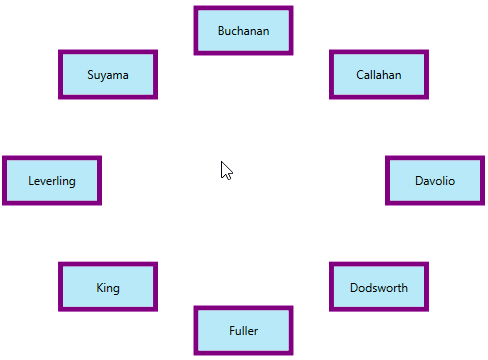
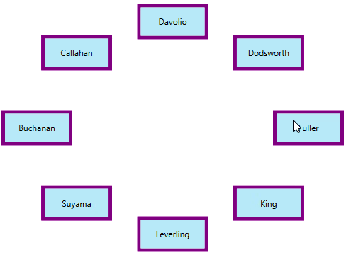

# Rotation and Opacity supports in WPF Carousel

You can rotate and change the opacity of the carousel items in WPF [Carousel](https://help.syncfusion.com/cr/wpf/Syncfusion.Shared.Wpf~Syncfusion.Windows.Shared.Carousel.html) control.

## Rotate carousel item

You can place the carousel items with a specific rotation angle by using the [RotationAngle](https://help.syncfusion.com/cr/wpf/Syncfusion.Shared.Wpf~Syncfusion.Windows.Shared.Carousel~RotationAngle.html) property. The default value of `RotationAngle` property is `0`.




<syncfusion:Carousel RotationAngle="180" 
                     Name="carousel" />




carousel.RotationAngle = 180;




N> [View Sample in GitHub](https://github.com/SyncfusionExamples/syncfusion-wpf-carousel-examples/tree/master/Samples/StandardPath)

## Change rotation speed

If you want to change the rotation speed of the carousel items when selecting or navigating from one item to another item, use the [RotationSpeed](https://help.syncfusion.com/cr/wpf/Syncfusion.Shared.Wpf~Syncfusion.Windows.Shared.Carousel~RotationSpeed.html) property. This will effective only on `Standard` visual mode. The default value of `RotationSpeed` property is `200`.




<syncfusion:Carousel RotationSpeed="150"
                     VisualMode="Standard"
                     Name="carousel" />




carousel.RotationSpeed = 150;
carousel.VisualMode = VisualMode.Standard;




N> [View Sample in GitHub](https://github.com/SyncfusionExamples/syncfusion-wpf-carousel-examples/tree/master/Samples/StandardPath)

## Disable rotation animation

If you want to disable the animated rotation of carousel items when selecting or navigating from one item to another item, use the [EnableRotationAnimation](https://help.syncfusion.com/cr/wpf/Syncfusion.Shared.Wpf~Syncfusion.Windows.Shared.Carousel~EnableRotationAnimation.html) property value as `false`. This will effective only on `Standard` visual mode. The default value of `EnableRotationAnimation` property is `true`.




<syncfusion:Carousel EnableRotationAnimation="False" 
                     VisualMode="Standard"
                     Name="carousel" />




carousel.EnableRotationAnimation = false;
carousel.VisualMode = VisualMode.Standard;




N> [View Sample in GitHub](https://github.com/SyncfusionExamples/syncfusion-wpf-carousel-examples/tree/master/Samples/StandardPath)

## Opacity for carousel item in standard view 

If you want to change the opacity of the carousel items except the selected item in the `VisualMode.Standard` mode, set the fraction value to the [OpacityFraction](https://help.syncfusion.com/cr/wpf/Syncfusion.Shared.Wpf~Syncfusion.Windows.Shared.Carousel~OpacityFraction.html) property. The default value of `OpacityFraction` property is `0`.




<syncfusion:Carousel OpacityFraction="0.8" 
                     VisualMode="Standard"
                     Name="carousel" />




carousel.OpacityFraction = 0.8;
carousel.VisualMode = VisualMode.Standard;




N> [View Sample in GitHub](https://github.com/SyncfusionExamples/syncfusion-wpf-carousel-examples/tree/master/Samples/StandardPath)

## Opacity for carousel item in custom view 

If you want to individually change the opacity of the next, previous items or selected carousel items in the `VisualMode.CustomPath` mode, set the fraction values to the [OpacityFractions](https://help.syncfusion.com/cr/wpf/Syncfusion.Shared.Wpf~Syncfusion.Windows.Shared.Carousel~OpacityFractions.html) collection property. You can disable it by setting the [OpacityEnabled](https://help.syncfusion.com/cr/wpf/Syncfusion.Shared.Wpf~Syncfusion.Windows.Shared.Carousel~OpacityEnabled.html) property value as `false`.  The default value of `OpacityFractions` property is `null` and `OpacityEnabled` property is `true`.




<syncfusion:Carousel OpacityEnabled="True"
                     VisualMode="CustomPath"
                     Name="carousel">
    <syncfusion:Carousel.OpacityFractions>
        <syncfusion:PathFractionCollection>
            
            <!--Opacity for next items from the selected item-->
            <syncfusion:FractionValue Fraction="0" Value="0"/>
            
            <!--Opacity for selected item-->
            <syncfusion:FractionValue Fraction="0.5" Value="0.8"/>
            
            <!--Opacity for previous items from the selected item-->
            <syncfusion:FractionValue Fraction="1" Value="0"/>
        </syncfusion:PathFractionCollection>
    </syncfusion:Carousel.OpacityFractions>
</syncfusion:Carousel>




FractionValue NextItemfraction = new FractionValue() { Fraction = 0, Value = 0 };			
FractionValue selectedItemfraction = new FractionValue() { Fraction = 0.5, Value = 0.8 };
FractionValue PreviousItemfraction = new FractionValue() { Fraction = 1, Value = 0 };

PathFractionCollection pathFraction = new PathFractionCollection();
pathFraction.Add(NextItemfraction);
pathFraction.Add(selectedItemfraction);
pathFraction.Add(PreviousItemfraction);

//Adding opacity fractions to the carousel items
carousel.OpacityFractions = pathFraction;

carousel.OpacityEnabled = true;
carousel.VisualMode = VisualMode.CustomPath;




N> [View Sample in GitHub](https://github.com/SyncfusionExamples/syncfusion-wpf-carousel-examples/tree/master/Samples/CustomPath)