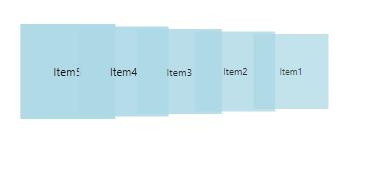

# Scaling Opacity and Skewing Support

User can control Scaling, Opacity and Skewing for CarouselItem’s using [ScaleFractions](https://help.syncfusion.com/cr/wpf/Syncfusion.Shared.Wpf~Syncfusion.Windows.Shared.Carousel~ScaleFractions.html), [OpacityFractions](https://help.syncfusion.com/cr/wpf/Syncfusion.Shared.Wpf~Syncfusion.Windows.Shared.Carousel~OpacityFractions.html) and [SkewAngleXFractions](https://help.syncfusion.com/cr/wpf/Syncfusion.Shared.Wpf~Syncfusion.Windows.Shared.Carousel~SkewAngleXFractions.html), **SkewAngleYFractions** properties. 

Using [TopItemPosition](https://help.syncfusion.com/cr/wpf/Syncfusion.Shared.Wpf~Syncfusion.Windows.Shared.Carousel~TopItemPosition.html) property, they can change the position of SelectedItem in a given path.

## Adding Scaling, Opacity and Skewing Support to an Application

To enable or disable this feature, use [OpacityEnabled](https://help.syncfusion.com/cr/wpf/Syncfusion.Shared.Wpf~Syncfusion.Windows.Shared.Carousel~OpacityEnabled.html), [ScalingEnabled](https://help.syncfusion.com/cr/wpf/Syncfusion.Shared.Wpf~Syncfusion.Windows.Shared.Carousel~ScalingEnabled.html), [SkewAngleXEnabled](https://help.syncfusion.com/cr/wpf/Syncfusion.Shared.Wpf~Syncfusion.Windows.Shared.Carousel~SkewAngleXEnabled.html), [SkewAngleYEnabled](https://help.syncfusion.com/cr/wpf/Syncfusion.Shared.Wpf~Syncfusion.Windows.Shared.Carousel~SkewAngleYEnabled.html) properties.

## Opacity support

In our carousel control, when we set the property [OpacityEnabled](https://help.syncfusion.com/cr/wpf/Syncfusion.Shared.Wpf~Syncfusion.Windows.Shared.Carousel~OpacityEnabled.html) to true, the opacity for the control will set.

Please find the code snippet for the same:





<syncfusion:Carousel x:Name="Carousel" OpacityEnabled="True">
<syncfusion:Carousel.OpacityFractions>

<syncfusion:PathFractionCollection>

<!--Fraction represents the position in Path- Value represents the Opacity of Carousel item in a particular point-->

<syncfusion:FractionValue Fraction="0" Value="1"/>

<syncfusion:FractionValue Fraction="1" Value="0.5"/>

</syncfusion:PathFractionCollection>

</syncfusion:Carousel.OpacityFractions>
</syncfusion:Carousel>









Carousel carousel = new Carousel() { Margin = new Thickness(4,4,4,4), RadiusX = 220, RadiusY = -100, ScaleFraction=0.60 };

PathFractionCollection patch = new PathFractionCollection();

FractionValue fraction = new FractionValue() { Fraction = 0, Value=1 };

patch.Add(fraction);

carousel.OpacityFraction = patch[0].Value;

carousel.ItemsSource = new ObservableCollection<string>() { "Item1", "Item2", "Item3", "Item4", "Item5", "Item6", "Item7", "Item8", "Item9" };





Dim carousel As Carousel = New Carousel
Dim patch As PathFractionCollection = New PathFractionCollection
Dim fraction As FractionValue = New FractionValue
patch.Add(fraction)
carousel.OpacityFraction = patch(0).Value

carousel.ItemsSource = New ObservableCollection(Of String)() From { _
	"Item1", _
	"Item2", _
	"Item3", _
	"Item4", _
	"Item5", _
	"Item6", _
	"Item7", _
	"Item8", _
	"Item9" _
}





## Scaling feature

In our carousel control, the scaling for the carousel item would be set by using [ScalingEnabled](https://help.syncfusion.com/cr/wpf/Syncfusion.Shared.Wpf~Syncfusion.Windows.Shared.Carousel~ScalingEnabled.html) property. By default its property is false.
Please find the code snippet below:





<syncfusion:Carousel x:Name="Carousel" SkewAngleXEnabled="True" SkewAngleYEnabled="False">

<syncfusion:Carousel.SkewAngleXFractions>

<syncfusion:PathFractionCollection>

<syncfusion:FractionValue Fraction="0" Value="1"/>

<syncfusion:FractionValue Fraction="1" Value="0.5"/>

</syncfusion:PathFractionCollection>

</syncfusion:Carousel.SkewAngleXFractions>
</syncfusion:Carousel>









Carousel carousel = new Carousel() { SkewAngleXEnabled = true, SkewAngleYEnabled = true };

PathFractionCollection patch = new PathFractionCollection();

FractionValue fractionvalue1 = new FractionValue() { Fraction = 0, Value=1 };

FractionValue fractionvalue2 = new FractionValue() { Fraction = 1, Value = 0.5 };

patch.Add(fractionvalue1);

patch.Add(fractionvalue2);

carousel.OpacityFractions.Add(patch[0]);

carousel.OpacityFractions.Add(patch[1]);

carousel.ItemsSource = new ObservableCollection<string>() { "Item1", "Item2", "Item3", "Item4", "Item5", "Item6", "Item7", "Item8", "Item9" };





Dim carousel As Carousel = New Carousel

carousel.SkewAngleYEnabled = true

carousel.SkewAngleXEnabled = true

Dim patch As PathFractionCollection = New PathFractionCollection

Dim fractionvalue1 As FractionValue = New FractionValue

Dim fractionvalue2 As FractionValue = New FractionValue

patch.Add(fractionvalue1)

patch.Add(fractionvalue2)

carousel.OpacityFractions.Add(patch(0))

carousel.OpacityFractions.Add(patch(1))

carousel.ItemsSource = New ObservableCollection(Of String)() From { _
	"Item1", _
	"Item2", _
	"Item3", _
	"Item4", _
	"Item5", _
	"Item6", _
	"Item7", _
	"Item8", _
	"Item9" _
}





### Properties

* [OpacityEnabled](https://help.syncfusion.com/cr/wpf/Syncfusion.Shared.Wpf~Syncfusion.Windows.Shared.Carousel~OpacityEnabled.html)
* [ScalingEnabled](https://help.syncfusion.com/cr/wpf/Syncfusion.Shared.Wpf~Syncfusion.Windows.Shared.Carousel~ScalingEnabled.html)
* [SkewAngleXEnabled](https://help.syncfusion.com/cr/wpf/Syncfusion.Shared.Wpf~Syncfusion.Windows.Shared.Carousel~SkewAngleXEnabled.html)
* [SkewAngleYEnabled](https://help.syncfusion.com/cr/wpf/Syncfusion.Shared.Wpf~Syncfusion.Windows.Shared.Carousel~SkewAngleYEnabled.html)
* [OpacityFractions](https://help.syncfusion.com/cr/wpf/Syncfusion.Shared.Wpf~Syncfusion.Windows.Shared.Carousel~OpacityFractions.html)
* [ScalingFractions](https://help.syncfusion.com/cr/wpf/Syncfusion.Shared.Wpf~Syncfusion.Windows.Shared.Carousel~ScaleFractions.html)
* [SkewAngleXFractions](https://help.syncfusion.com/cr/wpf/Syncfusion.Shared.Wpf~Syncfusion.Windows.Shared.Carousel~SkewAngleXFractions.html)
* [SkewAngleYFractions](https://help.syncfusion.com/cr/wpf/Syncfusion.Shared.Wpf~Syncfusion.Windows.Shared.Carousel~SkewAngleYFractions.html)
