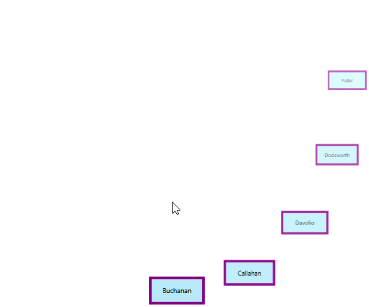

# Resize and skewing supports in WPF Carousel

You can resize and skewing the carousel items in WPF [Carousel](https://help.syncfusion.com/cr/wpf/Syncfusion.Shared.Wpf~Syncfusion.Windows.Shared.Carousel.html) control.

## Resize carousel item in  standard view

If you want to change the size of the carousel items except the selected item in the `VisualMode.Standard` mode, use the [ScaleFraction](https://help.syncfusion.com/cr/wpf/Syncfusion.Shared.Wpf~Syncfusion.Windows.Shared.Carousel~ScaleFraction.html) property. The default value `ScaleFraction` property is `0`.




<syncfusion:Carousel ScaleFraction="0.5" 
                     VisualMode="Standard"
                     Name="carousel" />




carousel.ScaleFraction = 0.5;
carousel.VisualMode = VisualMode.Standard;




N> [View Sample in GitHub](https://github.com/SyncfusionExamples/syncfusion-wpf-carousel-examples/tree/master/Samples/StandardPath)

## Resize carousel item in custom view

If you want to individually change the size of the next, previous item or selected carousel items in the `VisualMode.CustomPath` mode, set the fraction values to the [ScaleFractions](https://help.syncfusion.com/cr/wpf/Syncfusion.Shared.Wpf~Syncfusion.Windows.Shared.Carousel~ScaleFractions.html) collection property. You can disable it by setting the [ScalingEnabled](https://help.syncfusion.com/cr/wpf/Syncfusion.Shared.Wpf~Syncfusion.Windows.Shared.Carousel~ScalingEnabled.html) property value as `false`.  The default value of `ScaleFractions` property is `null` and `ScalingEnabled` property is `true`.




<syncfusion:Carousel ScalingEnabled="True"
                     VisualMode="CustomPath"
                     Name="carousel">
    <syncfusion:Carousel.ScaleFractions>
        <syncfusion:PathFractionCollection>
            
            <!--Resize next items from the selected item-->
            <syncfusion:FractionValue Fraction="0" Value="0.5"/>
            
            <!--Resize selected item-->
            <syncfusion:FractionValue Fraction="0.5" Value="0.8"/>
            
            <!--Resize previous items from the selected item-->
            <syncfusion:FractionValue Fraction="1" Value="0"/>
        </syncfusion:PathFractionCollection>
    </syncfusion:Carousel.ScaleFractions>
</syncfusion:Carousel>




FractionValue NextItemfraction = new FractionValue() { Fraction = 0, Value = 0.5 };			
FractionValue selectedItemfraction = new FractionValue() { Fraction = 0.5, Value = 0.8 };
FractionValue PreviousItemfraction = new FractionValue() { Fraction = 1, Value = 0 };

PathFractionCollection pathFraction = new PathFractionCollection();
pathFraction.Add(NextItemfraction);
pathFraction.Add(selectedItemfraction);
pathFraction.Add(PreviousItemfraction);

//Adding scale fractions to the carousel items
carousel.ScaleFractions = pathFraction;

carousel.ScalingEnabled = true;
carousel.VisualMode = VisualMode.CustomPath;




N> [View Sample in GitHub](https://github.com/SyncfusionExamples/syncfusion-wpf-carousel-examples/tree/master/Samples/CustomPath)

## Skewing the carousel item in standard view

If you want to skewing the carousel items with particular `X-Y` fraction angle, use the `SkewAngleYFraction` and `SkewAngleYFraction` properties. Based on the `SkewAngleYFraction` and `SkewAngleYFraction` values, the carousel items are skewed. The default value `SkewAngleYFraction` and `SkewAngleYFraction` properties is `0`.




<syncfusion:Carousel SkewAngleXFraction="20"
                     SkewAngleYFraction="10"
                     VisualMode="Standard"
                     Name="carousel" />




carousel.SkewAngleXFraction = 20;
carousel.SkewAngleYFraction = 10;
carousel.VisualMode = VisualMode.Standard;




N> [View Sample in GitHub](https://github.com/SyncfusionExamples/syncfusion-wpf-carousel-examples/tree/master/Samples/StandardPath)

## Skewing the carousel item in custom view

If you want to individually skewing the next, previous item or selected carousel items in the `VisualMode.CustomPath` mode, set the `X-Y` fraction angle values to the [SkewAngleXFractions](https://help.syncfusion.com/cr/wpf/Syncfusion.Shared.Wpf~Syncfusion.Windows.Shared.Carousel~SkewAngleXFractions.html) and [SkewAngleYFractions](https://help.syncfusion.com/cr/wpf/Syncfusion.Shared.Wpf~Syncfusion.Windows.Shared.Carousel~SkewAngleYFractions.html) collection property. You can enable it by setting the [SkewAngleXEnabled](https://help.syncfusion.com/cr/wpf/Syncfusion.Shared.Wpf~Syncfusion.Windows.Shared.Carousel~SkewAngleXEnabled.html) and [SkewAngleYEnabled](https://help.syncfusion.com/cr/wpf/Syncfusion.Shared.Wpf~Syncfusion.Windows.Shared.Carousel~SkewAngleYEnabled.html) property value as `true`. The default value of `SkewAngleXFractions` & `SkewAngleYFractions` property is `null` and default value of `SkewAngleXEnabled` & `SkewAngleYEnabled` property is `false`.




<syncfusion:Carousel SkewAngleXEnabled="True"
                     SkewAngleYEnabled="True"
                     VisualMode="CustomPath"
                     Name="carousel">            
    <syncfusion:Carousel.SkewAngleXFractions>
        <syncfusion:PathFractionCollection>
            
            <!--Skewing X angle of next items from the selected item-->
            <syncfusion:FractionValue Fraction="0" Value="10"/>
            
            <!--Skewing X angle of selected item-->
            <syncfusion:FractionValue Fraction="0.5" Value="0"/>
            
            <!--Skewing X angle of previous items from the selected item-->
            <syncfusion:FractionValue Fraction="1" Value="30"/>
        </syncfusion:PathFractionCollection>
    </syncfusion:Carousel.SkewAngleXFractions>

    <syncfusion:Carousel.SkewAngleYFractions>
        <syncfusion:PathFractionCollection>

            <!--Skewing Y angle of next items from the selected item-->
            <syncfusion:FractionValue Fraction="0" Value="30"/>

            <!--Skewing Y angle of selected item-->
            <syncfusion:FractionValue Fraction="0.5" Value="0"/>

            <!--Skewing Y angle of previous items from the selected item-->
            <syncfusion:FractionValue Fraction="1" Value="10"/>
        </syncfusion:PathFractionCollection>
    </syncfusion:Carousel.SkewAngleYFractions>
</syncfusion:Carousel>




carousel.SkewAngleXEnabled = true;
carousel.SkewAngleYEnabled = true;
carousel.VisualMode = VisualMode.CustomPath;




N> [View Sample in GitHub](https://github.com/SyncfusionExamples/syncfusion-wpf-carousel-examples/tree/master/Samples/CustomPath)