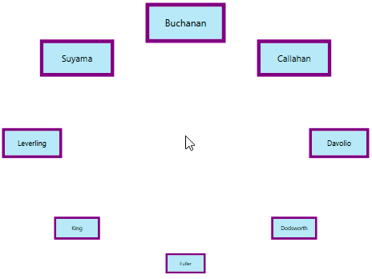
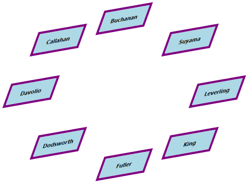

# Standard Path in WPF Carousel

This section explains about resizing, skewing, rotation animation and opacity supports available in WPF [Carousel](https://help.syncfusion.com/cr/wpf/Syncfusion.Windows.Shared.Carousel.html) control's standard path mode.

## Load carousel items in standard path

You can load the carousel items in standard path by using the [VisualMode](https://help.syncfusion.com/cr/wpf/Syncfusion.Windows.Shared.Carousel.html#Syncfusion_Windows_Shared_Carousel_VisualMode) property as `VisualMode.Standard`. The standard path of carousel items is a circular path. The default value of `VisualMode` property is `VisualMode.Standard`.




//Model.cs
public class CarouselModel {
	public string Header { get; set; }
}

//ViewModel.cs
public class ViewModel {
	private ObservableCollection<CarouselModel> collection;
	public ObservableCollection<CarouselModel> HeaderCollection
	{
		get {
			return collection;
		}
		set {
			collection = value;
		}
	}
	public ViewModel() {
		HeaderCollection = new ObservableCollection<CarouselModel>();
		HeaderCollection.Add(new CarouselModel() { Header = "Buchanan" });
		HeaderCollection.Add(new CarouselModel() { Header = "Callahan" });
		HeaderCollection.Add(new CarouselModel() { Header = "Davolio" });
		HeaderCollection.Add(new CarouselModel() { Header = "Dodsworth" });
		HeaderCollection.Add(new CarouselModel() { Header = "Fuller" });
		HeaderCollection.Add(new CarouselModel() { Header = "King" });
		HeaderCollection.Add(new CarouselModel() { Header = "Leverling" });
		HeaderCollection.Add(new CarouselModel() { Header = "Suyama" });
	}
}







<Window.DataContext>
    <local:ViewModel/>
</Window.DataContext>

<Grid>
    <syncfusion:Carousel Name="Carousel" 
                         VisualMode="Standard"
                         ItemsSource="{Binding HeaderCollection}">
        <syncfusion:Carousel.ItemTemplate>
            <DataTemplate>
                <Border Height="50" 
                        Width="100" 
                        BorderBrush="Purple" 
                        BorderThickness="5"
                        Background="LightBlue">
                    <TextBlock HorizontalAlignment="Center" 
                               VerticalAlignment="Center" 
                               Text="{Binding Header}"/>
                </Border>
            </DataTemplate>
        </syncfusion:Carousel.ItemTemplate>
    </syncfusion:Carousel>
</Grid>




carousel.VisualMode = VisualMode.Standard;




N> [View Sample in GitHub](https://github.com/SyncfusionExamples/syncfusion-wpf-carousel-examples/tree/master/Samples/StandardPath)

## Change radius of carousel control

You can change the radius of the `Carousel` control by setting the value to the [RadiusX](https://help.syncfusion.com/cr/wpf/Syncfusion.Windows.Shared.Carousel.html#Syncfusion_Windows_Shared_Carousel_RadiusX) and [RadiusY](https://help.syncfusion.com/cr/wpf/Syncfusion.Windows.Shared.Carousel.html#Syncfusion_Windows_Shared_Carousel_RadiusY) properties. Based on the radius points, items are arranged. The default value of `RadiusX` property is `250` and `RadiusY` property is `150`. 




<syncfusion:Carousel RadiusX="100" 
                     RadiusY="100" 
                     VisualMode="Standard"
                     Name="carousel"/>




carousel.RadiusX = 100;
carousel.RadiusY = 100;
carousel.VisualMode = VisualMode.Standard;




N> [View Sample in GitHub](https://github.com/SyncfusionExamples/syncfusion-wpf-carousel-examples/tree/master/Samples/StandardPath)

## Change rotation speed

If you want to change the rotation speed of the carousel items when selecting or navigating from one item to another item, use the [RotationSpeed](https://help.syncfusion.com/cr/wpf/Syncfusion.Windows.Shared.Carousel.html#Syncfusion_Windows_Shared_Carousel_RotationSpeed) property. The default value of `RotationSpeed` property is `200`.




<syncfusion:Carousel RotationSpeed="150"
                     VisualMode="Standard"
                     Name="carousel" />




carousel.RotationSpeed = 150;
carousel.VisualMode = VisualMode.Standard;




N> [View Sample in GitHub](https://github.com/SyncfusionExamples/syncfusion-wpf-carousel-examples/tree/master/Samples/StandardPath)

## Disable rotation animation

If you want to disable the animated rotation of carousel items when selecting or navigating from one item to another item, use the [EnableRotationAnimation](https://help.syncfusion.com/cr/wpf/Syncfusion.Windows.Shared.Carousel.html#Syncfusion_Windows_Shared_Carousel_EnableRotationAnimation) property value as `false`. The default value of `EnableRotationAnimation` property is `true`.




<syncfusion:Carousel EnableRotationAnimation="False" 
                     VisualMode="Standard"
                     Name="carousel" />




carousel.EnableRotationAnimation = false;
carousel.VisualMode = VisualMode.Standard;




N> [View Sample in GitHub](https://github.com/SyncfusionExamples/syncfusion-wpf-carousel-examples/tree/master/Samples/StandardPath)

## Resize carousel item

If you want to change the size of the carousel items except the selected item in the `VisualMode.Standard` mode, use the [ScaleFraction](https://help.syncfusion.com/cr/wpf/Syncfusion.Windows.Shared.Carousel.html#Syncfusion_Windows_Shared_Carousel_ScaleFraction) property. You can disable it by setting the [ScalingEnabled](https://help.syncfusion.com/cr/wpf/Syncfusion.Windows.Shared.Carousel.html#Syncfusion_Windows_Shared_Carousel_ScalingEnabled) property value as `false`. Value range of `ScaleFraction` property is `0` to `1`. The default value `ScaleFraction` property is `0` and `ScalingEnabled` property is `true`.




<syncfusion:Carousel ScaleFraction="0.5" 
                     ScalingEnabled="True"
                     VisualMode="Standard"
                     Name="carousel" />




carousel.ScaleFraction = 0.5;
carousel.ScalingEnabled = true;
carousel.VisualMode = VisualMode.Standard;




N> [View Sample in GitHub](https://github.com/SyncfusionExamples/syncfusion-wpf-carousel-examples/tree/master/Samples/StandardPath)

## Opacity for carousel item

If you want to change the opacity of the carousel items except the selected item in the `VisualMode.Standard` mode, set the fraction value to the [OpacityFraction](https://help.syncfusion.com/cr/wpf/Syncfusion.Windows.Shared.Carousel.html#Syncfusion_Windows_Shared_Carousel_OpacityFraction) property. You can disable it by setting the [OpacityEnabled](https://help.syncfusion.com/cr/wpf/Syncfusion.Windows.Shared.Carousel.html#Syncfusion_Windows_Shared_Carousel_OpacityEnabled) property value as `false`. Value range of `OpacityFraction` property is `0` to `1`. The default value of `OpacityFraction` property is `0` and `OpacityEnabled` property is `true`.




<syncfusion:Carousel OpacityFraction="0.8"
                     OpacityEnabled="True"
                     VisualMode="Standard"
                     Name="carousel" />




carousel.OpacityFraction = 0.8;
carousel.OpacityEnabled = true;
carousel.VisualMode = VisualMode.Standard;




N> [View Sample in GitHub](https://github.com/SyncfusionExamples/syncfusion-wpf-carousel-examples/tree/master/Samples/StandardPath)

## Skewing the carousel item

If you want to skewing the carousel items with particular `X-Y` fraction angle, use the [SkewAngleXFraction](https://help.syncfusion.com/cr/wpf/Syncfusion.Windows.Shared.Carousel.html#Syncfusion_Windows_Shared_Carousel_SkewAngleXFraction) and [SkewAngleYFraction](https://help.syncfusion.com/cr/wpf/Syncfusion.Windows.Shared.Carousel.html#Syncfusion_Windows_Shared_Carousel_SkewAngleYFraction) properties. You can enable it by setting the [SkewAngleXEnabled](https://help.syncfusion.com/cr/wpf/Syncfusion.Windows.Shared.Carousel.html#Syncfusion_Windows_Shared_Carousel_SkewAngleXEnabled) and [SkewAngleYEnabled](https://help.syncfusion.com/cr/wpf/Syncfusion.Windows.Shared.Carousel.html#Syncfusion_Windows_Shared_Carousel_SkewAngleYEnabled) property value as `true`. The default value `SkewAngleXFraction` and `SkewAngleYFraction` properties is `0` and default value of `SkewAngleXEnabled` & `SkewAngleYEnabled` property is `false`.




<syncfusion:Carousel SkewAngleXFraction="20"
                     SkewAngleYFraction="10" 
                     SkewAngleXEnabled="True"
                     SkewAngleYEnabled="True"
                     VisualMode="Standard"
                     Name="carousel" />




carousel.SkewAngleXFraction = 20;
carousel.SkewAngleYFraction = 10;
carousel.SkewAngleXEnabled = true;
carousel.SkewAngleYEnabled = true;
carousel.VisualMode = VisualMode.Standard;




N> [View Sample in GitHub](https://github.com/SyncfusionExamples/syncfusion-wpf-carousel-examples/tree/master/Samples/StandardPath)
