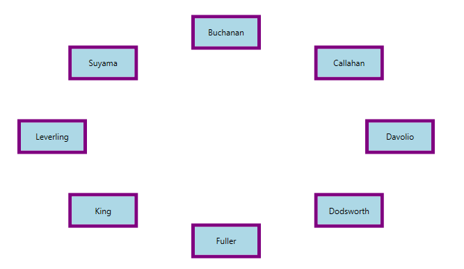
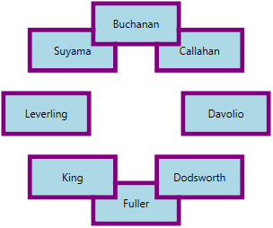
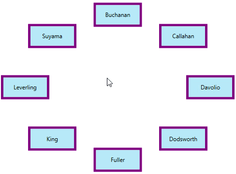
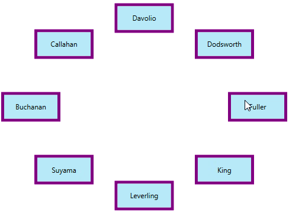
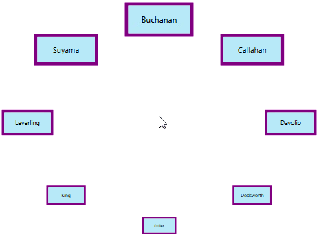
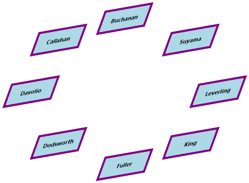

# Standard Path in WPF Carousel

This section explains the resizing, skewing, rotation animation, and opacity support available in the standard path mode of the [WPF Carousel](https://www.syncfusion.com/wpf-controls/carousel) control.

## Load WPF Carousel items in standard path

You can load WPF Carousel items in the standard path by setting the [VisualMode](https://help.syncfusion.com/cr/wpf/Syncfusion.Windows.Shared.Carousel.html#Syncfusion_Windows_Shared_Carousel_VisualMode) property to `VisualMode.Standard`. The standard path of WPF Carousel items is circular. The default value of the `VisualMode` property is `VisualMode.Standard`.




//Model.cs
public class CarouselModel {
	public string Header { get; set; }
}

//ViewModel.cs
public class ViewModel {
	private ObservableCollection<CarouselModel> collection;
	public ObservableCollection<CarouselModel> HeaderCollection
	{
		get {
			return collection;
		}
		set {
			collection = value;
		}
	}
	public ViewModel() {
		HeaderCollection = new ObservableCollection<CarouselModel>();
		HeaderCollection.Add(new CarouselModel() { Header = "Buchanan" });
		HeaderCollection.Add(new CarouselModel() { Header = "Callahan" });
		HeaderCollection.Add(new CarouselModel() { Header = "Davolio" });
		HeaderCollection.Add(new CarouselModel() { Header = "Dodsworth" });
		HeaderCollection.Add(new CarouselModel() { Header = "Fuller" });
		HeaderCollection.Add(new CarouselModel() { Header = "King" });
		HeaderCollection.Add(new CarouselModel() { Header = "Leverling" });
		HeaderCollection.Add(new CarouselModel() { Header = "Suyama" });
	}
}







<Window.DataContext>
    <local:ViewModel/>
</Window.DataContext>

<Grid>
    <syncfusion:Carousel Name="Carousel" 
                         VisualMode="Standard"
                         ItemsSource="{Binding HeaderCollection}">
        <syncfusion:Carousel.ItemTemplate>
            <DataTemplate>
                <Border Height="50" 
                        Width="100" 
                        BorderBrush="Purple" 
                        BorderThickness="5"
                        Background="LightBlue">
                    <TextBlock HorizontalAlignment="Center" 
                               VerticalAlignment="Center" 
                               Text="{Binding Header}"/>
                </Border>
            </DataTemplate>
        </syncfusion:Carousel.ItemTemplate>
    </syncfusion:Carousel>
</Grid>




carousel.VisualMode = VisualMode.Standard;




N> [View Sample in GitHub](https://github.com/SyncfusionExamples/syncfusion-wpf-carousel-examples/tree/master/Samples/StandardPath)

## Change radius of WPF Carousel control

You can change the radius of the `Carousel` control by setting values for the [RadiusX](https://help.syncfusion.com/cr/wpf/Syncfusion.Windows.Shared.Carousel.html#Syncfusion_Windows_Shared_Carousel_RadiusX) and [RadiusY](https://help.syncfusion.com/cr/wpf/Syncfusion.Windows.Shared.Carousel.html#Syncfusion_Windows_Shared_Carousel_RadiusY) properties. Items are arranged based on the radius points. The default value of the `RadiusX` property is `250`, and the default value of the `RadiusY` property is `150`.




<syncfusion:Carousel RadiusX="100" 
                     RadiusY="100" 
                     VisualMode="Standard"
                     Name="carousel"/>




carousel.RadiusX = 100;
carousel.RadiusY = 100;
carousel.VisualMode = VisualMode.Standard;




N> [View Sample in GitHub](https://github.com/SyncfusionExamples/syncfusion-wpf-carousel-examples/tree/master/Samples/StandardPath)

## Change rotation speed

To change the rotation speed of WPF Carousel items when selecting or navigating from one item to another, use the [RotationSpeed](https://help.syncfusion.com/cr/wpf/Syncfusion.Windows.Shared.Carousel.html#Syncfusion_Windows_Shared_Carousel_RotationSpeed) property. The default value of the `RotationSpeed` property is `200`.




<syncfusion:Carousel RotationSpeed="150"
                     VisualMode="Standard"
                     Name="carousel" />




carousel.RotationSpeed = 150;
carousel.VisualMode = VisualMode.Standard;




N> [View Sample in GitHub](https://github.com/SyncfusionExamples/syncfusion-wpf-carousel-examples/tree/master/Samples/StandardPath)

## Disable rotation animation

To disable the animated rotation of WPF Carousel items when selecting or navigating from one item to another, set the [EnableRotationAnimation](https://help.syncfusion.com/cr/wpf/Syncfusion.Windows.Shared.Carousel.html#Syncfusion_Windows_Shared_Carousel_EnableRotationAnimation) property to `false`. The default value of the `EnableRotationAnimation` property is `true`.




<syncfusion:Carousel EnableRotationAnimation="False" 
                     VisualMode="Standard"
                     Name="carousel" />




carousel.EnableRotationAnimation = false;
carousel.VisualMode = VisualMode.Standard;




N> [View Sample in GitHub](https://github.com/SyncfusionExamples/syncfusion-wpf-carousel-examples/tree/master/Samples/StandardPath)

## Resize WPF CarouselItem

To change the size of WPF Carousel items except the selected item in `VisualMode.Standard` mode, use the [ScaleFraction](https://help.syncfusion.com/cr/wpf/Syncfusion.Windows.Shared.Carousel.html#Syncfusion_Windows_Shared_Carousel_ScaleFraction) property. You can disable scaling by setting the [ScalingEnabled](https://help.syncfusion.com/cr/wpf/Syncfusion.Windows.Shared.Carousel.html#Syncfusion_Windows_Shared_Carousel_ScalingEnabled) property to `false`. The value range of the `ScaleFraction` property is `0` to `1`. The default value of the `ScaleFraction` property is `0`, and the default value of the `ScalingEnabled` property is `true`.




<syncfusion:Carousel ScaleFraction="0.5" 
                     ScalingEnabled="True"
                     VisualMode="Standard"
                     Name="carousel" />




carousel.ScaleFraction = 0.5;
carousel.ScalingEnabled = true;
carousel.VisualMode = VisualMode.Standard;




N> [View Sample in GitHub](https://github.com/SyncfusionExamples/syncfusion-wpf-carousel-examples/tree/master/Samples/StandardPath)

## Opacity for WPF CarouselItem

To change the opacity of WPF Carousel items except the selected item in `VisualMode.Standard` mode, set the fraction value for the [OpacityFraction](https://help.syncfusion.com/cr/wpf/Syncfusion.Windows.Shared.Carousel.html#Syncfusion_Windows_Shared_Carousel_OpacityFraction) property. You can disable opacity by setting the [OpacityEnabled](https://help.syncfusion.com/cr/wpf/Syncfusion.Windows.Shared.Carousel.html#Syncfusion_Windows_Shared_Carousel_OpacityEnabled) property to `false`. The value range of the `OpacityFraction` property is `0` to `1`. The default value of the `OpacityFraction` property is `0`, and the default value of the `OpacityEnabled` property is `true`.




<syncfusion:Carousel OpacityFraction="0.8"
                     OpacityEnabled="True"
                     VisualMode="Standard"
                     Name="carousel" />




carousel.OpacityFraction = 0.8;
carousel.OpacityEnabled = true;
carousel.VisualMode = VisualMode.Standard;




N> [View Sample in GitHub](https://github.com/SyncfusionExamples/syncfusion-wpf-carousel-examples/tree/master/Samples/StandardPath)

## Skewing the WPF CarouselItem

To skew WPF Carousel items by a particular `X-Y` fraction angle, use the [SkewAngleXFraction](https://help.syncfusion.com/cr/wpf/Syncfusion.Windows.Shared.Carousel.html#Syncfusion_Windows_Shared_Carousel_SkewAngleXFraction) and [SkewAngleYFraction](https://help.syncfusion.com/cr/wpf/Syncfusion.Windows.Shared.Carousel.html#Syncfusion_Windows_Shared_Carousel_SkewAngleYFraction) properties. You can enable skewing by setting the [SkewAngleXEnabled](https://help.syncfusion.com/cr/wpf/Syncfusion.Windows.Shared.Carousel.html#Syncfusion_Windows_Shared_Carousel_SkewAngleXEnabled) and [SkewAngleYEnabled](https://help.syncfusion.com/cr/wpf/Syncfusion.Windows.Shared.Carousel.html#Syncfusion_Windows_Shared_Carousel_SkewAngleYEnabled) properties to `true`. The default value of the `SkewAngleXFraction` and `SkewAngleYFraction` properties is `0`, and the default value of the `SkewAngleXEnabled` and `SkewAngleYEnabled` properties is `false`.




<syncfusion:Carousel SkewAngleXFraction="20"
                     SkewAngleYFraction="10" 
                     SkewAngleXEnabled="True"
                     SkewAngleYEnabled="True"
                     VisualMode="Standard"
                     Name="carousel" />




carousel.SkewAngleXFraction = 20;
carousel.SkewAngleYFraction = 10;
carousel.SkewAngleXEnabled = true;
carousel.SkewAngleYEnabled = true;
carousel.VisualMode = VisualMode.Standard;




N> [View Sample in GitHub](https://github.com/SyncfusionExamples/syncfusion-wpf-carousel-examples/tree/master/Samples/StandardPath)
