## Chart Controls

### Chart

#### Concepts and Features

##### Data Binding

###### IList Data Source

Simple IList-based instances can be easily bound to the Chart. The following code example illustrates how to bind IList-based instances as the data source to Chart.

[C#]

public IList marks()

{

            List<mark> markList = new List<mark>();

            markList.Add(new mark() { ID = 0, Name = "John", Mark1 = 97, Mark2 = 99, Mark3 = 85, Mark4 = 92 });

            markList.Add(new mark() { ID = 1, Name = "James",Mark1 = 45, Mark2 = 35, Mark3 = 48, Mark4 = 42 });

            markList.Add(new mark() { ID = 2, Name = "Sam",Mark1 = 32, Mark2 = 65,Mark3 = 67,Mark4 = 78});

            markList.Add(new mark() { ID = 3, Name = "Victor",Mark1 = 30, Mark2 = 39,Mark3 = 38,Mark4 = 56});

            markList.Add(new mark() { ID = 4, Name = "Faith", Mark1= 25,Mark2 = 45,Mark3 = 77,Mark4 = 19});

            markList.Add(new mark() { ID = 5, Name ="Joyce", Mark1= 50,Mark2 = 35,Mark3 = 54,Mark4 = 55});

            markList.Add(new mark() { ID = 6, Name = "Silvy",Mark1 = 70, Mark2 = 28, Mark3 = 35, Mark4 = 45 });

            markList.Add(new mark() { ID = 7, Name = "Ian",Mark1 = 45,Mark2 = 85,Mark3 = 77,Mark4 =19});

            markList.Add(new mark() { ID = 8, Name = "Mandy", Mark1 = 90, Mark2 = 45, Mark3 = 54, Mark4 = 55 });

            markList.Add(new mark() { ID = 9, Name = "Alan",  Mark1 = 50, Mark2 = 28, Mark3 = 25, Mark4 = 45 });

            return markList;

}

The following screenshot illustrates how a Chart Series is associated to the Chart by using IList-based instances.

{  | markdownify }
{:.image }

See Also

XML Data Source

ObservableCollection Data Source

CollectionViewSource Data Source

LINQ Data Source

Data Binding for Child Level Properties

###### XML Data Source

Chart provides built-in support to bind XML data created through XmlDataProvider instances. The following code example illustrates this.

[XAML]

&lt;XmlDataProvider x:Key="myXmlData"&gt;

            &lt;x:XData&gt;

                &lt;Travel xmlns=""&gt;

                    &lt;TravelDetails DayCount="1"  Kms="30" Day="Mon"/&gt;

                    &lt;TravelDetails DayCount="2" Kms="45" Day="Tue"/&gt;

                    &lt;TravelDetails DayCount="3" Kms="50" Day="Wed"/&gt;

                    &lt;TravelDetails DayCount="4" Kms="60" Day="Thu"/&gt;

                    &lt;TravelDetails DayCount="5" Kms="55" Day="Fri"/&gt;

                    &lt;TravelDetails DayCount="6" Kms="75" Day="Sat"/&gt;

                    &lt;TravelDetails DayCount="7" Kms="55" Day="Sun"/&gt;

                    &lt;TravelDetails DayCount="8" Kms="40" Day="Mon"/&gt;

                    &lt;TravelDetails DayCount="9" Kms="30" Day="Tue"/&gt;

                   &lt;/Travel&gt;

            &lt;/x:XData&gt;

&lt;/XmlDataProvider&gt;

&lt;syncfusion:ChartSeries DataSource="{Binding Source={StaticResource myXmlData}, XPath=Travel/TravelDetails}" BindingPathX="DayCount" BindingPathsY="Kms" IsIndexed="False"  Name="series1"  Label="Series1" Type="FastStackingColumn" Interior="{StaticResource SeriesAInterior}" /&gt;

[C#]

chart1.Areas[0].Series[0].DataSource = xmlDataProvider1;

chart1.Areas[0].Series[0].BindingPathX = "Month";

chart1.Areas[0].Series[0].BindingPathsY = new string[] { "Sales" };  

{  | markdownify }
{:.image }

See Also

IList Data Source

ObservableCollection Data Source

CollectionViewSource Data Source

LINQ Data Source

Data Binding for Child Level Properties

###### ObservableCollection Data Source

Essential Chart provides support to bind data to an ObservableCollection or INotifyCollectionChanged collection. Also, the chart automatically gets updated when any changes are made to the data source.

The following code illustrates how to bind an ObservableCollection as data source to Chart.

[XAML]

&lt;Window.Resources&gt;

  &lt;local:Sports x:Key="sportinterest"/&gt;

&lt;/Window.Resources&gt;

&lt;sfchart:ChartSeries DataSource="{StaticResource sportinterest}" Type="Column" BindingPathX="SportName" BindingPathsY="Interest"/&gt;

[C#]

// Namespace to be included for INotifyPropertyChanged interface.

using System.ComponentModel;

// Namespace to be included for ObservableCollection.

using System.Collections.ObjectModel;

public class Sport : INotifyPropertyChanged

{

private int sportid;

private string sportname;

private double interest;

public event PropertyChangedEventHandler PropertyChanged;

public Sport()

{

}

public Sport(int sportid, string sportname, double interests)

{

this.sportid = sportid;

this.sportname = sportname;

this.interest = interests;

}

public override string ToString()

{

return sportname.ToString();

}

public int SportID

{

get { return sportid; }

set

{

sportid = value;

OnPropertyChanged("SportID");

}

}

public string SportName

{

get { return sportname; }

set

{

sportname = value;

OnPropertyChanged("SportName");

}

}

public double Interest

{

get { return interest; }

set

{

interest = value;

OnPropertyChanged("Interest");

}

}

protected void OnPropertyChanged(string info)

{

PropertyChangedEventHandler handler = PropertyChanged;

if (handler != null)

{

handler(this, new PropertyChangedEventArgs(info));

}

}

}

public class Sports : ObservableCollection<Sport>

{

public Sports() : base()

{

Add(new Sport(101, "Golf", 9));

Add(new Sport(102, "Soccer", 40));

Add(new Sport(103, "Hockey", 10));

Add(new Sport(104, "Rugby", 7));

Add(new Sport(105, "Shuttle", 3));

Add(new Sport(106, "Cricket", 15));

Add(new Sport(107, "Baseball", 6));

Add(new Sport(108, "Tennis", 10));

}

}  

The following screenshot illustrates how a Chart Series is associated to the Chart by using ObservableCollection data source.

{  | markdownify }
{:.image }

See Also

XML Data Source

IList Data Source

CollectionViewSource Data Source

LINQ Data Source

Data Binding for Child Level Properties

LINQ Data Source

###### CollectionViewSource Data Source

You can bind CollectionViewSource as a Chart Series Data Source to Chart. Chart listens to the changes in the source and gets updated automatically. The following code illustrates how to bind CollectionViewSource as data source to Chart.

[XAML]

&lt;Window.Resources&gt;

&lt;local:SalesinLocation x:Key="saleslocation"/&gt;

&lt;CollectionViewSource Source="{StaticResource saleslocation}" x:Key="cvs"  &gt;

&lt;CollectionViewSource.SortDescriptions&gt;

&lt;scm:SortDescription PropertyName="LocationID" /&gt;

&lt;/CollectionViewSource.SortDescriptions&gt;

&lt;/CollectionViewSource&gt;

&lt;/Window.Resources&gt;

&lt;sfchart:Chart&gt;

&lt;sfchart:ChartArea&gt;

<sfchart:ChartSeries  Name="series1" Label="Sales" Type="Column" DataSource="{Binding Source={StaticResource cvs}}"

BindingPathX="LocationName" BindingPathsY="Sales"/>  

&lt;/sfchart:ChartArea&gt;

&lt;/sfchart:Chart&gt;

[C#]

// Namespace to be included for INotifyPropertyChanged interface.

using System.ComponentModel;

// Namespace to be included for ObservableCollection.

using System.Collections.ObjectModel;

public class Production : INotifyPropertyChanged

{

    private double prodid;

    private string locationname;

    private double sales;

    public event PropertyChangedEventHandler PropertyChanged;

    public Production()

    {

    }

    public Production(double prodid, string locationname, double sales)

    {

        this.prodid = prodid;

        this.locationname = locationname;

        this.sales = sales;

    }

    public override string ToString()

    {

        return locationname.ToString();

    }

    public double LocationID

    {

        get { return prodid; }

        set

        {

            prodid = value;

            OnPropertyChanged("ProdId");

        }

    }

    public string LocationName

    {

        get { return locationname; }

        set

        {

            locationname = value;

            OnPropertyChanged("LocationName");

        }

    }

    public double Sales

    {

        get { return sales; }

        set

        {

            sales = value;

            OnPropertyChanged("Sales");

        }

    }

    protected void OnPropertyChanged(string info)

    {

        PropertyChangedEventHandler handler = PropertyChanged;

        if (handler != null)

        {

            handler(this, new PropertyChangedEventArgs(info));

        }

    }

}

class SalesinLocation : ObservableCollection<Production>

{

    public SalesinLocation() : base()

    {

        Random rand = new Random(DateTime.Now.Millisecond);

        Add(new Production(101, "UK", 9));

        Add(new Production(102, "Germany", 3));

        Add(new Production(103, "USA", 40));

        Add(new Production(104, "Japan", 15));

        Add(new Production(105, "China", 7));            

        Add(new Production(106, "India", 10));            

        Add(new Production(107, "France", 10));

    }

}

The following screenshot illustrates how a Chart Series is associated to the Chart by using CollectionViewSource data source.

{  | markdownify }
{:.image }

See Also

IList Data Source

XML Data Source

ObservableCollection Data Source

IList Data Source

LINQ Data Source

Data Binding for Child Level Properties

###### LINQ Data Source

Chart lets you to directly bind LINQ results as the Data Source for a Chart Series. The following code illustrates how to bind LINQ results as the data source for the Chart Series.

[C#]

// Namespace to be included for XDocument.

using System.Xml.Linq;

public partial class Window1 : Window

{

public Window1()

{

InitializeComponent();

// Create Data to associate with the series.

CreateDataToSeries();

// Add Data Source with the series. Queries Price value more than 30,000.

this.SetDataSource(carlist.Where(s => s.Price > 30000).ToList());           

}

// Add Data Source with the series.

private void SetDataSource(IList source)

{

Chart1.Areas[0].Series.Clear();

ChartSeries series = new ChartSeries();

// Data Source for series 1.

series.DataSource = source;

// Binding X with Name.

series.BindingPathX = "Name";

// Binding Y with Price.

series.BindingPathsY = new string[] {"Price"};

// Add series to Chart.

Chart1.Areas[0].Series.Add(series);

}

// Create Data to associate with the series.

IList<Car> carlist;

private IList<Car> CreateDataToSeries()

{

carlist = new List<Car>();

carlist.Add(new Car("Car A", 36700, 200, 28));

carlist.Add(new Car("Car B", 23970, 170, 23));

carlist.Add(new Car("Car C", 34675, 160, 22));

carlist.Add(new Car("Car D", 44950, 180, 36));

carlist.Add(new Car("Car E", 74950, 150, 18));

carlist.Add(new Car("Car F", 37300, 190, 25));

carlist.Add(new Car("Car G", 40765, 200, 26));

carlist.Add(new Car("Car H", 23799, 150, 22));

carlist.Add(new Car("Car I", 49400, 160, 29));

carlist.Add(new Car("Car J", 25149, 200, 22));

return carlist;

}

switch (queryby)

{

      case "Price":

      this.SetDataSource(carlist.Where(s => s.Price < double.Parse(value)).ToList());

      break;

      case "MaximumSpeed":

      this.SetDataSource(carlist.Where(s => s.MaximumSpeed < double.Parse(value)).ToList());

      break;

      case "Mileage":

      this.SetDataSource(carlist.Where(s => s.Mileage < double.Parse(value)).ToList());

      break;

}

}

// Add class Car.

class Car

{

public string Name { get; set; }

public double Price { get; set; }

public double MaximumSpeed { get; set; }

public double Mileage { get; set; }

public Car(string name, double price, double maxspeed, double mileage)

{

this.Name = name;

this.Price = price;

this.MaximumSpeed = maxspeed;

this.Mileage = mileage;

}

}

The following screenshot illustrates how a Chart Series is associated to the Chart by using LINQ results.

{ 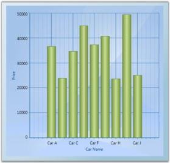 | markdownify }
{:.image }

See Also

IList Data Source

XML Data Source

ObservableCollection Data Source

IList Data Source

Data Binding for Child Level Properties

CollectionViewSource Data Source

###### Data Binding for Child Level Properties

The child level properties can be bound to the chart series using BindingPathX and BindingPathsY values. BindingPathX and BindingPathsY are the properties that belong to chart series which holds the x-axis and y-axis binding path values.

The following code example elaborates on the data binding for the child level properties-End and Start, for the Product class. 

[C#]

public class Product

    {

        public int ID { get; set; }

        public ProductInfo Info { get; set; }

        public TestClass Start

        {

            get

            {

                return Info.Start;

            }

        }

        public int End

        {

            get

            {

                return Info.End;

            }

        }

    }

    public class ProductInfo

    {

        public int Start { get; set; }

        public int End { get; set; }

    }

//series1 is the chart series

  this.series1.BindingPathX = "ID";

  this.series1.BindingPathsY = new string[] { "Info.Start", "Info.End" };

[XAML]

&lt;syncfusion:ChartSeries Name="series1" Type="Gantt"  Interior="{StaticResource SeriesAInterior}" Label="Allotted Days"  StrokeThickness="0.4"  IsIndexed="False"   BindingPathX=”ID” BindingPathY=”Info.Start,Info.End” /&gt;

######  Data Binding Support

The Data Binding feature has generated common DataModel based on the user bind underlying objects. You can use this DataModel to perform sorting and grouping operations. This can be done by using the DataModel.View property of ChartSeries control.  You can also bind ObservableCollection, List, IList, CollectionViewSource, DataTable, LINQresults, ITypedList, IBindingList, BindingList and XML data into the Chart.

The View is internally generated automatically based on the object collection bind on the DataSource property of ChartSeries.  You can also bind the external collection view objects into the Chart. The external collection view, SortDescription and GroupDescription are internally listened by Chart DataModel and the internal View.

This Data Binding engine improves the performance of chart with effectively handling the chart data.  The following are some of the useful tips to improve the chart performance.

* Instead of using built-in IsSortData and IsIndexed feature, you can sort the underlying business object in application level and then initialize it to DataSource property of ChartSeries control.
* Use BeginInit and EndInit method when you add, delete and replace multiple objects at a same time in ChartSeries control.  It helps to improve the performance.
* Disable Auto Range and Interval feature. You can manually initialize the Range and Interval to ChartAxis to get better performance.

Use Case Scenarios

In Stock market, data gets updated in a timely manner.  Initial data can be bind to chart and later you can update the underlying object. Based on that new stock information added in your underlying object, the DataModel and the Chart Visual can refresh automatically.

Adding Data Binding to an Application 

You can bind chart data into the DataSource property of ChartSeries control.  The View is generated internally for the user bound data and the chart can render in visual. The BindingPathX and BindingPathsY properties are used to initialize the property name of the binded data. This property values is used as coordinate values for X and Y direction in the ChartAxis control.

[XAML]

&lt;syncfusion:ChartSeries DataSource="{StaticResource data}" BindingPathX="ProductID" BindingPathsY="Price" /&gt;

.

[C#]

            ProductDetails data = this.Resources["data"] as ProductDetails;

            //Initialize the business object into the ChartSeries.

            series.DataSource = data;

            series.BindingPathX = "ProductID";

            series.BindingPathsY = new string[] { "Price" };

            //To add the SortDescription in DataModel View.

            SortDescription desc = new SortDescription("Price", ListSortDirection.Descending);

            chart.Areas[0].Series[0].DataModel.View.SortDescriptions.Add(desc);

_DataModel Table_

<table>
<tr>
<td>
Property </td><td>
Description </td><td>
Type </td><td>
Data Type </td><td>
Reference links </td></tr>
<tr>
<td>
DataModel </td><td>
This DataModel has internally initialized based on the user bind data on DataSource property of ChartSeries control.  It generates View for user bind DataSource.</td><td>
CLR. </td><td>
ChartDataModel </td><td>
NA </td></tr>
</table>
_ChartDataModel Table_

<table>
<tr>
<td>
Property</td><td>
Description</td><td>
Type</td><td>
Data Type</td><td>
Reference links</td></tr>
<tr>
<td>
View</td><td>
This property helps to add SortDescription and GroupDescription features.  This property initializes the common view for all Collection objects initially.</td><td>
CLR.</td><td>
ICollectionViewAdv</td><td>
NA</td></tr>
</table>
###### IChartDataPoint interface

IChartDataPoint interface is a point that contains the information about the data of the chart series, X and Y coordinates of the point, and the segment. The IChartDataPoint interface objects can be initialized internally based on the ChartPoint and the object input by the user.

Properties

The following table lists the properties of the IChartDataPoint interface.

_Properties____of IchartDataPoint_

<table>
<tr>
<td>
Property name</td><td>
Description</td><td>
Data Type</td></tr>
<tr>
<td>
X</td><td>
Represents the X value of the DataPoint.</td><td>
Double</td></tr>
<tr>
<td>
Y</td><td>
Represents the Y value of the DataPoint.</td><td>
Double</td></tr>
<tr>
<td>
ParentSegment</td><td>
Represents the parent segment of the DataPoint.</td><td>
ChartSegment</td></tr>
<tr>
<td>
Visible</td><td>
Sets the visibility of the DataPoint.</td><td>
Bool</td></tr>
<tr>
<td>
Item</td><td>
Includes X,Y and custom values to represent the point.</td><td>
Object</td></tr>
<tr>
<td>
Label</td><td>
Value represnts the ContentPath.</td><td>
String</td></tr>
<tr>
<td>
IsEmpty</td><td>
Indicates whether the point is empty.</td><td>
Bool</td></tr>
<tr>
<td>
Values</td><td>
Value array should be used to represent the range of Y values that correspond to one X value.</td><td>
Double</td></tr>
<tr>
<td>
EmptyPoint</td><td>
Value indicates the Empty Point.</td><td>
Bool</td></tr>
</table>
Following are the code that describes the IChartDataPoint interfaces.

[C#]

class CustomPoint : IChartDataPoint

    {

        public CustomPoint(double X, double Y)

        {

            this.X = X;

            this.Y = Y;

            this.Values = new double[] { Y };

        }

        public double X { get; set; }

        public double Y { get; set; }

        public double[] Values { get; set; }

        public bool IsEmpty { get; set; }

        public bool EmptyPoint { get; set; }

        public string Label { get; set; }

        public bool Visible { get; set; }

        public object StringItem { get; set; }

        public ChartSegment ParentSegment { get; set; }

        public object Item { get; set; }

        public object Clone()

        {

            CustomPoint customPoint = new CustomPoint(this.X, this.Y);

            //...

            // Filling proper fields.

            //...

            return customPoint;

        }

        public void Dispose()

        {

        }

    }

    // Custom collection strongly typed as CustomPoint that implements IChartData.

    class CustomChartPointsCollection : ObservableCollection<CustomPoint>, IChartData

    {

        public new IChartDataPoint this[int index]

        {

            get { return base[index]; }

        }

        public ChartValueType XValueType { get; set; }

        #region IDisposable Members

        /// &lt;summary&gt;

        /// Clean up any resources being used.

        /// &lt;/summary&gt;

        public void Dispose()

        {

        }

        #endregion

    }}

  //Using classes

            //...

            //Creating a new chart1 with area and series.

            //...

            CustomChartPointsCollection customCollection = new

            CustomChartPointsCollection();

            customCollection.Add(new CustomPoint(1, 3));

            customCollection.Add(new CustomPoint(2, 5));

            customCollection.Add(new CustomPoint(3, 2));

            customCollection.Add(new CustomPoint(4, 8));

            chart1.Areas[0].Series[0].Data = customCollection;

##### Chart Area

###### Adding Chart Area

Once you add the Chart control, the first thing to do is to add a Chart Area and and Chart Series. The following code example illustrates how to do this.

[XAML]

&lt;sfchart:Chart&gt;

&lt;sfchart:ChartArea&gt;

&lt;sfchart:ChartSeries/&gt;

&lt;/sfchart:ChartArea&gt;

&lt;/sfchart:Chart&gt;

[C#]

ChartArea area = new ChartArea();

Chart1.Areas.Add(area);

ChartSeries series = new ChartSeries();

area.Series.Add(series);

{  | markdownify }
{:.image }

See Also

Multiple Areas, Chart Area Layout Customization

###### Multiple Areas

Essential Chart provides support to add multiple Chart Areas to a Chart to visualize related data side by side. The following code example illustrates this.

[XAML]

&lt;sfchart:Chart&gt;

&lt;sfchart:ChartArea Background="LightGray" GridBackground="White"&gt;

&lt;sfchart:ChartSeries/&gt;

&lt;/sfchart:ChartArea&gt;

&lt;sfchart:ChartArea Background="WhiteSmoke" GridBackground="White" &gt;

&lt;sfchart:ChartSeries/&gt;

&lt;/sfchart:ChartArea&gt;

&lt;/sfchart:Chart&gt;

[C#]

ChartArea area = new ChartArea();

area.Background = Brushes.LightGray;

area.GridBackground = Brushes.White;

Chart1.Areas.Add(area);

ChartArea area1 = new ChartArea();

area1.Background = Brushes.WhiteSmoke;

area1.GridBackground = Brushes.White;

Chart1.Areas.Add(area1);

{  | markdownify }
{:.image }

See Also

Adding Chart Area, Chart Area Layout Customization

###### Chart Area Header

Chart enables you to add headers to the Chart Area object. Any element can be added as a Chart Area header by using the Header property of the ChartArea class.

[XAML]

&lt;sfchart:Chart&gt;

&lt;sfchart:ChartArea Background="LightGray" GridBackground="White"&gt;

               &lt;sfchart:ChartArea.Header&gt;

                    &lt;StackPanel Orientation="Horizontal"&gt;

                        &lt;TextBlock Text="Filter By:"&gt;&lt;/TextBlock&gt;

                        &lt;ComboBox Width="100" Margin="10, 0, 0, 0"&gt;

                            <ComboBoxItem>Team 1</ComboBoxItem>

                            <ComboBoxItem>Team 2</ComboBoxItem>

                            <ComboBoxItem>Team 3</ComboBoxItem>

                        &lt;/ComboBox&gt;

                    &lt;/StackPanel&gt;

                &lt;/sfchart:ChartArea.Header&gt;

       &lt;!--Chart Series initialization code is hidden for brevity.--&gt;

&lt;sfchart:ChartSeries/&gt;

&lt;/sfchart:ChartArea&gt;

&lt;/sfchart:Chart&gt;

{  | markdownify }
{:.image }

See Also

Adding Chart Area

###### Chart Header

Essential Chart for WPF enables users to set the title for a chart.

_Property Table_

<table>
<tr>
<td>
Name of Property</td><td>
Description </td><td>
Type of Property</td><td>
Value It Accepts</td><td>
Property Syntax</td><td>
Sub Properties</td></tr>
<tr>
<td>
Header</td><td>
Sets the title of the chart.</td><td>
Dependency  Property</td><td>
Object/ “Chart Header”</td><td>
 &lt;syncfusion:Chart Name="chart1" Header="Chart Header"&gt;</td><td>
Sub Property Name : HeaderAlignment Type: HorizontalAlignment / HorizontalAlignment.Left</td></tr>
</table>
Setting the Title for a Chart

Set the title for a chart by using the following code.

[XAML]

&lt;sfchart:Chart Name="Chart1" Header="Sales and Month"&gt;

&lt;/sfchart:Chart&gt;

[C#]

chart1.Header = " Sales and Month "

{  | markdownify }
{:.image }

Customizing Chart Title

Users can customize the chart header using a text block, text box, rectangle, or border control.

Customize the chart header by using the following code.

[XAML]

&lt;sfchart:Chart Name="Chart1" &gt;

   &lt;sfchart:Chart.Header&gt;

     &lt;TextBlock Text="Sales and Month" FontSize="16" Foreground="Blue" FontStyle="Italic" FontWeight="Bold" Margin="-5"  /&gt;

   &lt;/sfchart:Chart.Header&gt;

&lt;/sfchart:Chart&gt;

{  | markdownify }
{:.image }

###### Chart Area Context Menu

WPF Chart has a built-in context menu which can be enabled by setting the ChartArea.IsContextMenuEnabled property to _true_. This context menu lets you change the Chart Type of a series and Color Palettes, and enable Zooming.

Default Context Menu

The following code example illustrates how to display the built-in context menu of Chart Area.

[XAML]

&lt;syncfusion:Chart &gt;

&lt;syncfusion:ChartArea IsContextMenuEnabled="True" /&gt;                   

&lt;/syncfusion:Chart&gt;

[C#]

area.IsContextMenuEnabled = true;

{  | markdownify }
{:.image }

Custom Context Menu

You can also customize the context menu items to display any desired text. The following code example illustrates this.

[C#]

ContextMenu contextMenu = new ContextMenu();

contextMenu.Items.Add("Rotate Series");

contextMenu.Items.Add("Zoom Series");

Chart1.Areas[0].ContextMenu = contextMenu;

{  | markdownify }
{:.image }

###### Background

You can customize the background of the Chart Area to suit the application by specifying custom brushes for the Background property. The following code example illustrates this.

[XAML]

&lt;sfchart:Chart&gt;

&lt;sfchart:ChartArea Background="LightSkyBlue"&gt;

&lt;sfchart:ChartSeries/&gt;

&lt;/sfchart:ChartArea&gt;

&lt;/sfchart:Chart&gt;

[C#]

ChartArea area = new ChartArea();

area.Background = Brushes.LightSkyBlue;

Chart1.Areas.Add(area);

{  | markdownify }
{:.image }

Grid Background

The GridBackground property of the Chart Area is used to change the color of the inner area of the Chart Area object. The following code example illustrates how to set this property.

[XAML]

&lt;sfchart:Chart&gt;

&lt;sfchart:ChartArea Background="LightSkyBlue" GridBackground="AliceBlue"&gt;

&lt;sfchart:ChartSeries/&gt;

&lt;/sfchart:ChartArea&gt;

&lt;/sfchart:Chart&gt;

[C#]

ChartArea area = new ChartArea();

area.Background = Brushes.LightSkyBlue;

area.GridBackground = Brushes.AliceBlue;

Chart1.Areas.Add(area);

{  | markdownify }
{:.image }

Essential Chart alternatively provides options to apply two backgrounds to a single Chart Area. The following properties of the ChartArea class are used for this purpose.

_Property Table_

<table>
<tr>
<td>
Property</td><td>
Description</td></tr>
<tr>
<td>
AlternatingBackground</td><td>
specifies the alternating background</td></tr>
<tr>
<td>
AlternatingFillMode</td><td>
enum property that specifies whether Even or Odd interval should be filled with the alternating background color</td></tr>
<tr>
<td>
AlternatingFillDirection</td><td>
orientation property that specifies whether the alternating background should be applied horizontally or vertically</td></tr>
</table>

The following code example illustrates how to set the preceding properties.

[XAML]

&lt;sfchart:Chart&gt;

&lt;sfchart:ChartArea Background="LightSkyBlue" GridBackground="AliceBlue" AlternatingGridBackground="LightPink" AlternatingFillMode="Even" AlternatingFillDirection="Horizontal"&gt;

&lt;sfchart:ChartSeries/&gt;

&lt;/sfchart:ChartArea&gt;

&lt;/sfchart:Chart&gt;

[C#]

ChartArea area = new ChartArea();

area.Background = Brushes.LightSkyBlue;

area.GridBackground = Brushes.AliceBlue;

area.AlternatingGridBackground = Brushes.LightPink;

area.AlternatingFillMode = AlternatingFillMode.Even;

area.AlternatingFillDirection = Orientation.Horizontal;

Chart1.Areas.Add(area);

{  | markdownify }
{:.image }

See Also

Adding Chart Area

###### Chart Watermark Support

Essential Chart supports watermarks which can be used to show text or images behind the chart area.

* Watermarks can be rotated by specifying the rotation angle for the text or image watermark.
* The opacity of a watermark can be set as a percentage.
* Watermarks can be aligned horizontally or vertically with respect to the chart area.

Use Case Scenarios 

* Watermarking is used in copyright protection systems. They are intended to prevent or detect illegal copying of charts by unauthorized users. 
* Also, chart watermarks provide indisputable proof of the image origin or its author.
* Owner identification like a username can be added to the chart so it is easy to find the owner.
* A unique and secure digital signature can be added to each chart. This can be used to verify the origin and generation details of a chart.

Properties

_Properties_

<table>
<tr>
<td>
Property</td><td>
Description</td><td>
Type</td><td>
Data Type</td></tr>
<tr>
<td>
 Watermark</td><td>
Sets the text or image watermark behind chart area.</td><td>
 Dependency</td><td>
Brush </td></tr>
</table>
Sample Link

To access the chart watermark demo:

1. Open the Syncfusion Dashboard.
2. Select User Interface.
3. Click the WPF drop-down list and select Explore Samples.
4. Browse to the path Chart.WPF\Samples\3.5\WindowsSamples\Chart Area\Chart Watermark Demo

Adding Watermark to an Application 

Image Watermark 

<table>
<tr>
<td>
[XAML]     &lt;syncfusion:ChartArea.Watermark&gt;        <VisualBrush Stretch="None" Opacity="0.5" AlignmentX="Center"                                                     AlignmentY="Top">            &lt;VisualBrush.Visual&gt;                &lt;Image Name="img" Source="/WatermarkDemo;component/SyncLogo1.png"&gt;                    &lt;Image.LayoutTransform&gt;                        &lt;RotateTransform Angle="-45"/&gt;                    &lt;/Image.LayoutTransform&gt;                &lt;/Image&gt;            &lt;/VisualBrush.Visual&gt;        &lt;/VisualBrush&gt;    &lt;/syncfusion:ChartArea.Watermark&gt;</td></tr>
<tr>
<td>
[C#]            Image image = new Image()            {                Source = new BitmapImage(new Uri(@"D:\WatermarkDemo\SyncLogo1.png")),                LayoutTransform = new RotateTransform() { Angle = -45 }            };                       this.chartArea.Watermark = new VisualBrush()            {                Visual = image,                Stretch = Stretch.None,                AlignmentX = AlignmentX.Center,                AlignmentY = AlignmentY.Top,                Opacity = 0.5                           };</td></tr>
</table>

{  | markdownify }
{:.image }

Text Watermark 

<table>
<tr>
<td>
[XAML]    &lt;syncfusion:ChartArea.Watermark&gt;        <VisualBrush Stretch="None" Opacity="0.8" AlignmentX="Right"                                                     AlignmentY="Bottom">            &lt;VisualBrush.Visual&gt;                <TextBlock Name="txt" Text="Syncfusion" FontSize="64" Foreground="Red"                                      FontFamily="Microsoft Sans Serif">                    &lt;TextBlock.LayoutTransform&gt;                        &lt;RotateTransform Angle="325"/&gt;                    &lt;/TextBlock.LayoutTransform&gt;                &lt;/TextBlock&gt;            &lt;/VisualBrush.Visual&gt;        &lt;/VisualBrush&gt;    &lt;/syncfusion:ChartArea.Watermark&gt;</td></tr>
<tr>
<td>
[C#]            TextBlock text = new TextBlock()            {                Text = "Syncfusion",                FontSize = 64,                Foreground = Brushes.Red,                FontFamily = new FontFamily("Microsoft Sans Serif"),                LayoutTransform = new RotateTransform() { Angle = 325 }            };            this.chartArea.Watermark = new VisualBrush()            {                Visual = text,                Stretch = Stretch.None,                AlignmentX = AlignmentX.Right,                AlignmentY = AlignmentY.Bottom,                Opacity = 0.5                           };</td></tr>
</table>

{  | markdownify }
{:.image }

###### Chart Area Layout Customization

Upon adding multiple Chart Areas to Chart, you may want to customize the layout in which these multiple Chart Areas are rendered. You can do so by specifying a custom container for these Chart Areas through the AreasPanel property of the Chart control. Any container such as Grid, Stack Panel, Dock Panel, Canvas or Wrap Panel can be used.

Built-in Chart Grid

ChartGrid is the container that is used by Chart, by default, to host the Chart Areas. The following screenshot illustrates the default settings of ChartGrid in which all the Chart Areas are arranged one after the other.

{  | markdownify }
{:.image }

However, the default settings of the ChartGrid can be customized to display the Chart Areas side by side. The following code example illustrates how this can be done by using the Orientation and AutoRowsCount properties.

[XAML]

&lt;sfchart:Chart&gt;

   &lt;sfchart:Chart.AreasPanel&gt;

      &lt;ItemsPanelTemplate&gt;

         &lt;sfchart:ChartGrid Orientation="Horizontal" AutoRowsCount="2"&gt;&lt;/sfchart:ChartGrid&gt;

      &lt;/ItemsPanelTemplate&gt;

   &lt;/sfchart:Chart.AreasPanel&gt;

&lt;/sfchart:Chart&gt;

{ 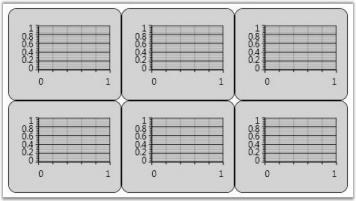 | markdownify }
{:.image }

The ChartGrid also provides options to control the aspect ratio (number of rows / number of columns) of the layout grid. Take a look at the ChartGrid class reference for more information.

Other Panels

Also you can plug-in any kind of Panel as the container for the Chart Area. The following code example illustrates how to use a DockPanel as the Areas Panel of the Chart.

[XAML]

&lt;sfchart:Chart&gt;

&lt;sfchart:Chart.AreasPanel&gt;

&lt;ItemsPanelTemplate&gt;

&lt;DockPanel/&gt;

&lt;/ItemsPanelTemplate&gt;

&lt;/sfchart:Chart.AreasPanel&gt;

&lt;sfchart:ChartArea Background="LightGray" GridBackground="White" DockPanel.Dock="Top" Height="200"&gt;

&lt;sfchart:ChartSeries/&gt;

&lt;/sfchart:ChartArea&gt;

&lt;sfchart:ChartArea Background="WhiteSmoke" GridBackground="White" DockPanel.Dock="Top" Height="200"&gt;

&lt;sfchart:ChartSeries/&gt;

&lt;/sfchart:ChartArea&gt;

&lt;sfchart:ChartArea Background="LightSlateGray" GridBackground="White" &gt;

&lt;sfchart:ChartSeries/&gt;

&lt;/sfchart:ChartArea&gt;

&lt;/sfchart:Chart&gt;

[C#]

ChartArea area = new ChartArea();

area.Background = Brushes.LightGray;

area.GridBackground = Brushes.White;

Chart1.Areas.Add(area);

ChartArea area1 = new ChartArea();

area1.Background = Brushes.WhiteSmoke;

area1.GridBackground = Brushes.White;

Chart1.Areas.Add(area1);

ChartArea area2 = new ChartArea();

area2.Background = Brushes.LightSlateGray;

area2.GridBackground = Brushes.White;

Chart1.Areas.Add(area2);

{  | markdownify }
{:.image }

A sample which demonstrates how to use different containers as the Areas Panel is available in the following sample installation path.

.._My Documents\Syncfusion\EssentialStudio\Version Number\WPF\Chart.WPF\Samples\3.5\WindowsSamples\Chart Area\Custom Panel Demo_

See Also

Adding Chart Area

###### Synchronization of Chart Axis

Essential Chart WPF lets you align multiple chart areas by using a single primary axis. You can synchronize the chart axis by using the following code example.

[XAML]

&lt;sfChart:SyncChartAreas&gt;

    &lt;sfChart:SyncChartAreas.PrimaryAxis&gt;

        <sfChart:ChartAxis Name="year" LabelFontSize="8" ValueType="Double" RangePadding="None"

        RangeCalculationMode="ConsistentAcrossChartTypes" sfChart:ChartArea.ShowGridLines="True" Header="Year">

        &lt;/sfChart:ChartAxis&gt;

    &lt;/sfChart:SyncChartAreas.PrimaryAxis&gt;

    &lt;sfChart:SyncChartAreas.Areas&gt;

        &lt;sfChart:ChartArea Background="Transparent"&gt;

            &lt;sfChart:ChartArea.SecondaryAxis&gt;

                &lt;sfChart:ChartAxis Name="Literacy" IntersectAction="Hide" LabelFontSize="8" ValueType="Double" Header="Literacy Growth"                   RangePadding="None" sfChart:ChartArea.ShowGridLines="False" /&gt;

            &lt;/sfChart:ChartArea.SecondaryAxis&gt;

            &lt;sfChart:ChartSeries Name="series22" Label="Increase In Population" BindingPathX="Year" BindingPathsY="IncreaseInPopulation"              Type="Area" StrokeThickness="2" Interior="Green" &gt;

                &lt;sfChart:ChartSeries.YAxis&gt;

                    &lt;sfChart:ChartAxis sfChart:ChartArea.ShowGridLines="False" Header="Increase In Population" OpposedPosition="True"                         Orientation="Vertical" LabelFontSize="8" ValueType="Double" RangePadding="None" /&gt;

                &lt;/sfChart:ChartSeries.YAxis&gt;

            &lt;/sfChart:ChartSeries&gt;

            &lt;sfChart:ChartSeries Name="series21" Label="Literacy Growth" BindingPathX="Year" BindingPathsY="LiteracyGrowth" Type="Spline"             StrokeThickness="2" Interior="DarkBlue"/&gt;

        &lt;/sfChart:ChartArea&gt;

    &lt;/sfChart:SyncChartAreas.Areas&gt;

&lt;/sfChart:SyncChartAreas&gt;

[C#]

SyncChartAreas syncAreas = new SyncChartAreas();

ChartAxis primaryAxis = new ChartAxis();

syncAreas.PrimaryAxis = primaryAxis;

ChartArea area1 = new ChartArea();

syncAreas.Areas.Add(area1);

ChartArea area2 = new ChartArea();

syncAreas.Areas.Add(area2);

Run the code. The following output is displayed.

{  | markdownify }
{:.image }

Additional Zooming Functionality for SyncChartAreas

Essential chart now supports the concepts of Zoomin, Zoomout and panning in the SyncChartArea.

Adding Additional Zooming Functionality

Add Additional Zooming Functionality, by using the following code.

[Xaml]

&lt;sfChart:SyncChartAreas IsContextMenuEnabled="True"&gt; 

[C#]

syncArea.IsContextMenuEnabled = true;

When the code runs, the following output displays.

{  | markdownify }
{:.image }

###### IDictionary  

IDictionary supports for binding the Dictionary list to the chart series BindingPathX and BindingPathsY Values.

Sample Data Source

IDictionary is useful to bind this kind of data source.

> _Note: In this sample data, 0, 1, 2, 3 …6 are the Keys and the CompanyExpenses are the Values._

> 

SortedList Expenditure = new SortedList();

            expenditure.Add(0, new CompanyExpense() { x = "Production", y = 20d });

            expenditure.Add(1, new CompanyExpense() { x = "Facilities", y = 23d });

            expenditure.Add(2, new CompanyExpense() { x = "Insurance", y = 12d });

            expenditure.Add(3, new CompanyExpense() { x = "Licenses", y = 3d });

            expenditure.Add(4, new CompanyExpense() { x = "Labor", y = 28d });

            expenditure.Add(5, new CompanyExpense() { x = "Legal", y = 2d });

            expenditure.Add(6, new CompanyExpense() { x = "Taxes", y = 10d });

Binding Data Source

Bind the data source, by using the following code. 

> _Note: Set BindingPath to Key to bind the key of the dictionary to BindingPathX or BindingPathsY._

> 

[Xaml]

<syncfusion:ChartSeries BindingPathX="Key" BindingPathsY="y" 

DataSource={StaticResource expenditure}>

[C#]

Series.BindingPathX=”Key”;

Series.BindingPathsY =”y”;

###### Lazy Loading Support for Chart WPF 

Lazy Loading Support reduces the loading time of chart area. This belongs to Chart area class.

Adding Lazy Loading Support

Set EnableLazyLoading property as true to add this feature.

Add Lazy Loading Support, by using the following code.

[Xaml] 

&lt;syncfusion:ChartArea EnableLazyLoading="True" IsContextMenuEnabled="True"&gt;

[C#]

Area1.EnableLAzyLoading = true;

###### Revamping 3D charts in Chart WPF Feature 

Charts are implemented in 3D with customization to improve the look and feel of the chart.

Display 3D Chart, by using the following code:

[Xaml]

//To display the chart type in 3d mode

&lt;syncfusion:ChartArea.Chart3DSettings&gt;

                        <syncfusion:Chart3D BackWallThickness="0" 

ShowBackWall="False" LeftWallBackground="Transparent" LeftWallThickness="0" 

BottomWallBackground="Transparent" BottomWallThickness="0"/>

                    &lt;/syncfusion:ChartArea.Chart3DSettings&gt;

[C#] 

//To set the background

Chart1.Areas[0].Chart3DSettings.BackWallBackground = Brushes.AliceBlue;

// To set the back wall thickness

                Chart1.Areas[0].Chart3DSettings.BackWallThickness = 0.5;

//To set the back ground for the Bottom wall

                Chart1.Areas[0].Chart3DSettings.BottomWallBackground = Brushes.Black;

// To set the thickness for bottom wall

                Chart1.Areas[0].Chart3DSettings.BottomWallThickness = 0.5;

// To set the Camera projection

                Chart1.Areas[0].Chart3DSettings.CameraProjection = 

CameraProjection.Orthographic;

                Light light=new AmbientLight(Color.FromArgb(200, 200, 200, 200));

//To set the chart light

                Chart1.Areas[0].Chart3DSettings.ChartLight = light;

// To set the back ground for left wall

                Chart1.Areas[0].Chart3DSettings.LeftWallBackground = Brushes.Yellow;

// To set the Thickness for Left wall

                Chart1.Areas[0].Chart3DSettings.LeftWallThickness = 0.5;

// TO set the background for right wall

                Chart1.Areas[0].Chart3DSettings.RightWallBackground = Brushes.Green;

// To set the thickness for Rightwall

                Chart1.Areas[0].Chart3DSettings.RightWallThickness = 0.5;

                Chart1.Areas[0].Chart3DSettings.RotateOnMouseDown = true;

                Chart1.Areas[0].Chart3DSettings.ShowBackWall = true;

                Chart1.Areas[0].Chart3DSettings.ShowBottomWall = true;

                Chart1.Areas[0].Chart3DSettings.ShowPrimaryAxis = true;

                Chart1.Areas[0].Chart3DSettings.ShowRightWall = true;

                Chart1.Areas[0].Chart3DSettings.ShowSecondaryAxis = true;

                Chart1.Areas[0].Chart3DSettings.ShowTopWall = true;

                Chart1.Areas[0].Chart3DSettings.TopWallBackground = Brushes.IndianRed;

                Chart1.Areas[0].Chart3DSettings.TopWallThickness = 0.5;

                Chart1.Areas[0].Chart3DSettings.ViewDefaultRotate = 1.5;

                Chart1.Areas[0].Chart3DSettings.ViewDefaultTilt = 2.5;

                Chart1.Areas[0].Chart3DSettings.ViewDefaultTurn = 10; Screen 

When the code runs, the following output displays.

{  | markdownify }
{:.image }

###### Interactive Cursors

The Interactive cursor hints the X value and Y value of a specific data point, as indicated by horizontal and vertical intersecting lines. These lines can be dragged to specific data. 

Property Details

The following table contains the property details of the table.

_Property Table_

<table>
<tr>
<td>
Name of Property</td><td>
Description</td><td>
Type of Property</td><td>
Value It Accepts</td></tr>
<tr>
<td>
IsInversedLabel</td><td>
To inverse the label</td><td>
Dependency Property</td><td>
Bool</td></tr>
<tr>
<td>
EnableVerticalMove</td><td>
To set the vertical movement</td><td>
Dependency Property</td><td>
Bool</td></tr>
<tr>
<td>
EnableHorizontalMove</td><td>
To set the horizontal movement</td><td>
Dependency Property</td><td>
Bool</td></tr>
<tr>
<td>
OffsetX</td><td>
To set the Offset X</td><td>
Dependency Property</td><td>
Double</td></tr>
<tr>
<td>
OffsetY</td><td>
To set the Offset Y</td><td>
Dependency Property</td><td>
Double</td></tr>
<tr>
<td>
HorizontalLabelTemplate</td><td>
To set the Template for Horizontal label</td><td>
Dependency Property</td><td>
DataTemplate</td></tr>
<tr>
<td>
VerticalLabelTemplate</td><td>
To set the Template for vertical label</td><td>
Dependency Property</td><td>
DataTemplate</td></tr>
<tr>
<td>
IsBindWithSegment</td><td>
To set or unset the IsBindWithSegment</td><td>
Dependency Property</td><td>
Bool</td></tr>
<tr>
<td>
CursorVisibility</td><td>
To set the visibility for the cursor</td><td>
Dependency Property</td><td>
Bool</td></tr>
<tr>
<td>
CursorStrokeThickness</td><td>
To set the stroke thickness for Cursor</td><td>
Dependency Property</td><td>
Double</td></tr>
<tr>
<td>
HorizontalCursorStroke</td><td>
To set the stroke for the horizontal cursor</td><td>
Dependency Property</td><td>
Brushes</td></tr>
<tr>
<td>
VerticalCursorStroke</td><td>
To set the stroke for the vertical cursor</td><td>
Dependency Property</td><td>
Brushes</td></tr>
<tr>
<td>
BindWithMoseMoveOnSegment</td><td>
To set or unset the bindwith mousemove on segments</td><td>
Dependency Property</td><td>
Bool</td></tr>
</table>
Adding Interactive Cursors

Add Interactive Cursors, by using the following code.

[XAML]

//sets the interactive cursor

    <Chart:InteractiveCursor 

        IsInversedLabel="True" OffsetX="100" OffsetY="100" 

        CursorStrokeThickness="3" VerticalLabelVisibility="Visible" 

        HorizontalLabelVisibility ="Visible" Cursor="Hand"

        IsBindWithSegment="true" HorizontalCursorStroke="Magenta" 

        VerticalCursorStroke="Magenta">

//sets the vertical template for the Vertical Label

        &lt;Chart:InteractiveCursor.VerticalLabelTemplate&gt;

            &lt;DataTemplate&gt;

                &lt;Grid&gt;

                    &lt;Label Foreground="GreenYellow" Content="{Binding}"/&gt;

                &lt;/Grid&gt;

            &lt;/DataTemplate&gt;

        &lt;/Chart:InteractiveCursor.VerticalLabelTemplate&gt;

//sets the Horizontal template for the horizontal Label

        &lt;Chart:InteractiveCursor.HorizontalLabelTemplate&gt;

            &lt;DataTemplate&gt;

                &lt;Grid&gt;

                    &lt;Label Foreground="GreenYellow" Content="{Binding}"/&gt;

                &lt;/Grid&gt;

            &lt;/DataTemplate&gt;

        &lt;/Chart:InteractiveCursor.HorizontalLabelTemplate&gt;

    &lt;/Chart:InteractiveCursor&gt;

&lt;/Chart:SyncChartAreas.InteractiveCursors&gt;

[C#]

// sets the cursor visibility

this.chart1.Areas[0].InteractiveCursors[0].CursorVisibility = Visibility. Visible;

// sets the label visibility

this.chart1.Areas[0].InteractiveCursors[0].LabelVisibility = Visibility. Visible;

// sets the cursor

this.chart1.Areas[0].InteractiveCursors[0].Cursor = Cursors. Hand;

//Sets the stroke for the Horizontal cursor

this.chart1.Areas[0].InteractiveCursors[0].HorizontalCursorStroke = Brushes. Magenta;

//Sets the stroke for vertical cursor

this.chart1.Areas[0].InteractiveCursors[0].VerticalCursorStroke = Brushes. Magenta;

// sets the is bind with segment

this.chart1.Areas[0].InteractiveCursors[0].IsBindWithSegment = true;

// Sets the BindWithMouseMoveSegment

this.chart1.Areas[0].InteractiveCursors[0].BindWithMoseMoveOnSegment = true;

// sets the label as inversed

this.chart1.Areas[0].InteractiveCursors[0].IsInversedLabel = true;

// To set the OffsetX

this.chart1.Areas[0].InteractiveCursors[0].OffsetX = 100;

//To set the OffsetY

this.chart1.Areas[0].InteractiveCursors[0].OffsetY = 100;

//To set the stroke thickness for the cursor

this.chart1.Areas[0].InteractiveCursors[0].CursorStrokethickness = 3;

###### Splitter for SyncChartArea should be implemented

Essential Chart WPF is now enhanced with Splitter forSyncChartArea. This is usefulto differentiate the implementation of more than one Chart Area.

Property Details

The following table contains the property details.

_Property Table_

<table>
<tr>
<td>
Name of Property</td><td>
Description</td><td>
Type of Property</td><td>
Value It Accepts</td></tr>
<tr>
<td>
SplitterVisibility</td><td>
Sets the visibility for the splitter.</td><td>
Dependency Property</td><td>
Enum of the type SplitterVisibility</td></tr>
<tr>
<td>
SplitterWidth</td><td>
Sets the width for the Splitter.</td><td>
Dependency Property</td><td>
Double</td></tr>
<tr>
<td>
SplitterStroke</td><td>
Sets the stroke for the splitter.</td><td>
Dependency Property</td><td>
Brush</td></tr>
<tr>
<td>
SplitterColor</td><td>
Sets the color for the splitter.</td><td>
Dependency Property</td><td>
Brush</td></tr>
</table>
Adding Splitter for SyncChartArea

Add Splitter for SyncChartArea, by using the following code.

[XAML] 

<sfChart:SyncChartAreas Name="syncChart" SplitterVisiblity="ShowAlways" 

SplitterStroke="Red" SplitterColor="Blue"  SplitterWidth="2" />

[C#] 

this.SyncChart.SplitterVisibility = SplitterVisibility.ShowAlways;

            this.SyncChart.SplitterStroke = Brushes.Red;

            this.SyncChart.SplitterColor = Brushes.Blue;

            this.SyncChart.SplitterWidth = 2;

###### Bind Array kind of Objects in Chart WPF

Essential chart now supports binding of array kind of values in BindingPathX and BindingPathsY.

This feature is useful when we use an array or list as data source.

[XAML] 

    &lt;syncfusion:ChartSeries Name="series1" BindingPathsY="Y" BindingPathX="X[0]"  Type="FastStackingColumn" Stroke="Black" DataSource="{Binding}"/&gt;

We can bind the data values with the index “X[0]“ .

Sample Data Source

[C#]

public class TestClass

    {

        public double Y { get; set; }

        public double[] X { get; set; }

    }

public class TestClassCollection : ObservableCollection<TestClass>

    {

        public TestClassCollection()

        {

            this.Add(new TestClass { Y = 1, X = new double[] {12, 3.9 } });

            this.Add(new TestClass { Y = 2, X = new double[] { 3, 3.9 } });

        }

    }

In the above code: 

TestClassCollection is collection of TestClass which has an array object and a double object.

When we bind this kind of data source to the chart series, we can specify the BindingpathX and BindingPathsY values using this feature.

[C#] 

item.DataContext = new TestClassCollection1 

item.BindingPathX = "X[0]";

item.BindingPathsY = new string[] { "Y" };

###### SmallChange and LargeChange Properties for Chart Area Scrolling Bar

Formerly, the chart area’s scrolling bar value change could not be customized by users. This feature enables the user to specify the large and small change values similar to the Slider control.

Properties

_Property Table_

<table>
<tr>
<td>
Property </td><td>
Description </td><td>
Type </td><td>
Data Type </td></tr>
<tr>
<td>
VerticalBarSmallChange</td><td>
A double property used to specify the small value change of the vertical scrollbar. </td><td>
Attached</td><td>
double </td></tr>
<tr>
<td>
VerticalBarLargeChange</td><td>
A double property used to specify the large value change of the vertical scrollbar.</td><td>
Attached</td><td>
double</td></tr>
<tr>
<td>
HorizontalBarSmallChange</td><td>
A double property used to specify the small value change of the horizontal scrollbar.</td><td>
Attached</td><td>
double</td></tr>
<tr>
<td>
HorizontalBarLargeChange</td><td>
A double property used to specify the large value change of the horizontal scrollbar.</td><td>
Attached</td><td>
double</td></tr>
</table>
###### Adding SmallChange and LargeChange Properties for Chart Area Scrolling Bar to an Application 

[XAML]

<syncfusion:ChartArea Name="area" syncfusion:ChartZoomingScrollBar.VerticalBarSmallChange="{Binding ElementName=ver_sma,Path=Value,Mode=TwoWay}" syncfusion:ChartZoomingScrollBar.VerticalBarLargeChange="{Binding ElementName=ver_lar,Path=Value,Mode=TwoWay}" syncfusion:ChartZoomingScrollBar.HorizontalBarLargeChange="{Binding ElementName=hor_lar,Path=Value,Mode=TwoWay}" syncfusion:ChartZoomingScrollBar.HorizontalBarSmallChange="{Binding

                         ElementName=hor_sma,Path=Value,Mode=TwoWay}"   >

&lt;syncfusion:ChartSeries Type="Area" StrokeThickness="1.0" InactiveSeriesOpacityOnZoom="0.25"  x:Name="ser1" DataSource="{Binding ZoomingModel}" BindingPathX="Id" BindingPathsY="YValue" IsIndexed="False" Label="Anomaly" /&gt;

 &lt;/syncfusion:ChartArea&gt;

[C#]

ChartZoomingScrollBar.SetHorizontalBarLargeChange(area, 0.5);

ChartZoomingScrollBar.SetHorizontalBarSmallChange(area, 0.1);

ChartZoomingScrollBar.SetVerticalBarLargeChange(area, 0.4);

ChartZoomingScrollBar.SetVerticalBarSmallChange(area, 0.1);

###### Additional Zooming Functionality for SyncChartAreas

Essential Chart now supports the concepts of Zoomin, Zoomout, and panning in the SyncChartArea

Adding Additional Zooming Functionality

Add additional zooming functionality by using the following code.

[XAML]

&lt;sfChart:SyncChartAreas IsContextMenuEnabled="True"&gt; 

[C#] 

syncArea.IsContextMenuEnabled = true;

{  | markdownify }
{:.image }

Rectangular Selection Zooming in SyncChartAreas

SyncChartArea also has support for sector zooming as in ordinary chart areas.

* SyncChart can be zoomed in using sector zooming instead of the Zoom In icon from the Zooming toolkit.

{  | markdownify }
{:.image }

Sample Link

Essential Chart WPF > User Interaction > Zooming and Scrolling Demo

[XAML]

&lt;sfChart:SyncChartAreas   Name="syncChart" EnableMouseDragZooming="True"&gt;

&lt;/sfChart:SyncChartAreas&gt;

[C#]

syncChart.EnableMouseDragZooming = true;

##### Chart Series

###### Populating Chart Series

The following are the three steps that should be followed:

* Adding Chart Series
* Data Binding
* Sorting the Series Data

Adding Chart Series

You can add one or more Chart Series to a Chart Area to plot points in the Chart. Note that you can specify one of the several built-in Chart types for rendering the series points.

[XAML]

&lt;sfchart:Chart&gt;

  &lt;sfchart:ChartArea&gt;

    &lt;sfchart:ChartSeries/&gt;

  &lt;/sfchart:ChartArea&gt;

&lt;/sfchart:Chart&gt;

[C#]

ChartSeries series = new ChartSeries();

Chart1.Areas[0].Series.Add(series);

You can then add points to the series using one of the following Data Binding techniques.

Data Binding

The most common and convenient approach to populate a Chart Series is by simply binding the Chart Series to a business object list. The following properties are used for this purpose.

_Property Table_

<table>
<tr>
<td>
Property</td><td>
Description</td></tr>
<tr>
<td>
DataSource</td><td>
takes any IEnumerable instance as the Data Source</td></tr>
<tr>
<td>
BindingPathX</td><td>
specifies the member / field in the specified data source that contains the x values for the series</td></tr>
<tr>
<td>
BindingPathsY</td><td>
specifies the members / fields in the specified data source that contain the y values for the seriesNote that some Chart Types require more than one y value and hence this property is of type String Array.</td></tr>
</table>
All the common data sources are supported by the Chart control. The following are some of the data sources supported.

* IList instances
* ObservableCollection
* XmlDataProvider
* CollectionViewSource
* LINQ results
* Other compatible data sources

Note that the chart plot will automatically update when the bound data sends a change notification.

The following code example illustrates how to bind the Chart control to an XMLDataProvider.

[XAML]

&lt;Window.Resources&gt;

&lt;XmlDataProvider x:Key="myXmlData"&gt;

&lt;x:XData&gt;

&lt;Products xmlns=""&gt;

&lt;Product Sales="20" Projected="30" Month="1"/&gt;

&lt;Product Sales="12" Projected="28" Month="2"/&gt;

&lt;Product Sales="15" Projected="29" Month="3"/&gt;

&lt;Product Sales="28" Projected="33" Month="4"/&gt;

&lt;Product Sales="24" Projected="30" Month="5"/&gt;

&lt;/Products&gt;

&lt;/x:XData&gt;

&lt;/XmlDataProvider&gt;

&lt;/Window.Resources&gt;

&lt;Grid&gt;

    &lt;sfchart:Chart Name="Chart2"&gt;

        &lt;sfchart:ChartArea &gt;

            &lt;sfchart:ChartSeries DataSource="{Binding Source={StaticResource myXmlData}, XPath=Products/Product}" BindingPathX="Month"                BindingPathsY="Sales" Type="Column" Label="Actual Sales"&gt;

            &lt;/sfchart:ChartSeries&gt;

            &lt;sfchart:ChartSeries DataSource="{Binding Source={StaticResource myXmlData}, XPath=Products/Product}" BindingPathX="Month"                BindingPathsY="Projected" Type="Column" Label="Projected Sales"&gt;

            &lt;/sfchart:ChartSeries&gt;

        &lt;/sfchart:ChartArea&gt;

    &lt;/sfchart:Chart&gt;

&lt;/Grid&gt;

{  | markdownify }
{:.image }

Sorting the Series Data

The data can either be sorted or unsorted. If you are sure that the data passed to the collection is sorted, then you can turn off the sorting feature by using the following code.

[C#]

Series.IsSortData = false;

See Also

Creating a Chart, Data Binding, Series Customization

###### Series Customization

Chart Series can be customized with various properties. This section discusses the following topics.

Interior

The interior of the Chart Series can be set by using the Interior property.

[XAML]

&lt;Window.Resources&gt;

&lt;!--To be added in window resources.--&gt;

&lt;LinearGradientBrush x:Key="SeriesAInterior" EndPoint="1,0.5" StartPoint="0,0.5"&gt;

&lt;LinearGradientBrush.GradientStops&gt;

&lt;GradientStop Color="#FFC07E2C" Offset="0"/&gt;

&lt;GradientStop Color="#FFFFDD9E" Offset="0.5"/&gt;

&lt;GradientStop Color="#FFC07E2C" Offset="1"/&gt;

&lt;/LinearGradientBrush.GradientStops&gt;

&lt;/LinearGradientBrush&gt;

&lt;/Window.Resources&gt;

&lt;!--To be added in window resources.--&gt;

&lt;syncfusion:ChartSeries Interior="Red" Data="1 20 2 30 3 55 4 35 5 40" /&gt;

&lt;syncfusion:ChartSeries Interior="{StaticResource SeriesAInterior}" Label="Series 2" Data="1 30 2 40 3 50 4 25 5 45" /&gt;

The following screenshot illustrates Chart Series Interior settings.

{  | markdownify }
{:.image }

See Also

IsVisible, IsRotated, Label

IsVisible

Essential Chart for WPF enables you to show / hide the Chart Series by using the IsVisible boolean property provided by the ChartSeries class.

[XAML]

&lt;syncfusion:Chart &gt;

&lt;syncfusion:ChartArea IsContextMenuEnabled="True" &gt;                   

&lt;syncfusion:ChartSeries Label="Series 1" IsVisible="False" Data=" 1 35 2 45 3 30 4 25 5 40" /&gt;

&lt;syncfusion:ChartSeries Label="Series 2" Data=" 1 30 2 40 3 50 4 20 5 45" /&gt;

&lt;/syncfusion:ChartArea&gt;                    

&lt;/syncfusion:Chart&gt;

[C#]

ChartSeries series = new ChartSeries();

series.IsVisible = false;

The following screenshot illustrates Chart with Series 1 invisible.

{  | markdownify }
{:.image }

See Also

IsRotated, Label

IsRotated

Chart Series can be rotated by using the ChartSeries.IsRotated property.

[XAML]

&lt;syncfusion:Chart &gt;

      &lt;syncfusion:ChartArea &gt;                   

            &lt;syncfusion:ChartSeries Label="Series 1" IsRotated="True" Data=" 1 35 2 45 3 30 4 25 5 40" /&gt;

            &lt;syncfusion:ChartSeries Label="Series 2" Data=" 1 30 2 40 3 50 4 20 5 45" /&gt;

      &lt;/syncfusion:ChartArea&gt;                    

&lt;/syncfusion:Chart&gt;

[C#]

area.Series[0].IsRotated = true;

The following screenshot illustrates Chart with Series 1 rotated.

{  | markdownify }
{:.image }

See Also

IsVisible, Label

Label

The text displayed in the Chart Legends and the Chart Area context menu can be customized by using the ChartSeries.Label property.

[XAML]

&lt;syncfusion:ChartArea&gt;

     &lt;syncfusion:ChartSeries Type="Column" Label="Series 1"/&gt;

     &lt;syncfusion:ChartSeries Type="Column" Label="Series 2"/&gt;

&lt;/syncfusion:ChartArea&gt;

[C#]

area.Series[0].Label = "Series 1";

area.Series[1].Label = "Series 2";

The following screenshot illustrates Chart with customized Series Labels.

{  | markdownify }
{:.image }

See Also

IsVisible, IsRotated

###### Chart Series Types

Chart control supports 34 types of charts, among which 12 types are supported in 3D mode as well. The Type property is used to specify the Chart Type.

[XAML]

&lt;Window.Resources&gt;

  &lt;local:ProductSalesCollection x:Key="SeriesData1"/&gt;

&lt;/Window.Resources&gt;

&lt;sfchart:Chart&gt;

  &lt;sfchart:ChartArea&gt;

    &lt;sfchart:ChartSeries Type="Area" DataSource="{StaticResource SeriesData1}" BindingPathX="Year" BindingPathsY="Sales"/&gt;

  &lt;/sfchart:ChartArea&gt;

&lt;/sfchart:Chart&gt;

[C#]

ChartSeries series = new ChartSeries();

series.DataSource = new ProductSalesCollection();

series.BindingPathX = "Year";

series.BindingPathsY = new string[] { "Sales" };

Chart1.Areas[0].Series.Add(series);

{  | markdownify }
{:.image }

See Also

Populating Chart Series, Chart Types

###### Chart Series Look and Feel

Chart for WPF provides various options to customize the look and feel of the Chart Series. The following are some of the properties that are used for this purpose.

_Property Table_

<table>
<tr>
<td>
Property</td><td>
Description</td></tr>
<tr>
<td>
Interior</td><td>
specifies the fill color of chart series</td></tr>
<tr>
<td>
Stroke</td><td>
specifies the border color of the chart series segment</td></tr>
<tr>
<td>
StrokeThickness</td><td>
specifies the thickness of the chart series segment border</td></tr>
</table>

The following code example illustrates how to set the preceding properties.

[XAML]

&lt;Window.Resources&gt;

  &lt;local:ProductSalesCollection x:Key="SeriesData1"/&gt;

&lt;/Window.Resources&gt;

&lt;sfchart:Chart&gt;

  &lt;sfchart:ChartArea&gt;

    <sfchart:ChartSeries Type="Area" DataSource="{StaticResource SeriesData1}" BindingPathX="Year" BindingPathsY="Sales"

    Interior="LightCoral" Stroke="Black" StrokeThickness="1.5"/>

  &lt;/sfchart:ChartArea&gt;

&lt;/sfchart:Chart&gt;

[C#]

ChartSeries series = new ChartSeries();

series.DataSource = new ProductSalesCollection();

series.BindingPathX = "Year";

series.BindingPathsY = new string[] { "Sales" };

series.Interior = Brushes.LightCoral;

series.Stroke = Brushes.Black;

series.StrokeThickness = 1.5;

Chart1.Areas[0].Series.Add(series);

{  | markdownify }
{:.image }

See Also

Populating Chart Series, Chart Series Template

###### Chart Series Template

Chart for WPF enables you to apply custom Data Templates to the Chart Series. By applying the custom data templates, the Chart Series Segments can be altered. The following code example illustrates how to create a sample data template to draw a Line Chart.

> _Note: Data templates cannot be customized for a single segment in a series. As each series is drawn as a single segment, we cannot customize the individual segments._

[XAML]

&lt;Window.Resources&gt;

&lt;!--Chart Series Data--&gt;

&lt;XmlDataProvider x:Key="myXmlData"&gt;

&lt;x:XData&gt;

&lt;Products xmlns=""&gt;

&lt;Product Sales="20" Projected="30" Month="1"/&gt;

&lt;Product Sales="12" Projected="28" Month="2"/&gt;

&lt;Product Sales="15" Projected="29" Month="3"/&gt;

&lt;Product Sales="28" Projected="33" Month="4"/&gt;

&lt;Product Sales="24" Projected="30" Month="5"/&gt;

&lt;/Products&gt;

&lt;/x:XData&gt;

&lt;/XmlDataProvider&gt;

&lt;!--Line Chart Template--&gt;

&lt;DataTemplate x:Key="Template1"&gt;

&lt;Line X1="{Binding X1}" X2="{Binding X2}" Y1="{Binding Y1}" Y2="{Binding Y2}" StrokeThickness="2" Stroke="{Binding Interior}"       StrokeDashArray="3,2" /&gt;

&lt;/DataTemplate&gt;

&lt;/Window.Resources&gt;

&lt;sfchart:Chart&gt;

   &lt;sfchart:ChartArea Background="LightGray" GridBackground="White"&gt;

     <sfchart:ChartSeries Template="{StaticResource Template1}" DataSource="{Binding Source={StaticResource myXmlData},

     XPath=Products/Product}" BindingPathX="Month" BindingPathsY="Sales" Interior="Red"  Type="Line"/>

   &lt;/sfchart:ChartArea&gt;            

&lt;/sfchart:Chart&gt;

{ 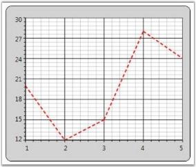 | markdownify }
{:.image }

See Also

Populating Chart Series, Chart Series Look And Feel

###### Chart Series Adornments

Chart Series Adornments are used to display values in a Chart Segment related to it. Values from data points (x value, y value) or other properties from a data source can be displayed. ChartAdornmentsInfo class is used to display Chart Series Adornments. ChartAdornmentsInfo class provides the following properties to customize the chart series adornments.

_Property Table_

<table>
<tr>
<td>
Property</td><td>
Description</td></tr>
<tr>
<td>
LabelContentPath</td><td>
specifies the value to display in the AdornmentsFor example, to display the x value, LabelContentPath will be DataPoint.X.</td></tr>
<tr>
<td>
Symbol</td><td>
allows selecting one symbol among the eleven predefined symbols or custom symbol options</td></tr>
<tr>
<td>
SymbolInterior</td><td>
specifies the interior of the predefined symbols added to the adornments</td></tr>
<tr>
<td>
SymbolHeight</td><td>
specifies the height of the predefined symbols added to the adornments</td></tr>
<tr>
<td>
SymbolWidth</td><td>
specifies the width of the predefined symbols added to the adornments</td></tr>
<tr>
<td>
SymbolTemplate</td><td>
specifies the symbol to be displayed in the adornments when the Symbol property is set to {{ '_Custom_' | markdownify }}</td></tr>
<tr>
<td>
VerticalAlignment</td><td>
specifies the Vertical alignment of the Adornment text</td></tr>
<tr>
<td>
HorizontalAlignment</td><td>
specifies the Horizontal alignment of the adornments</td></tr>
<tr>
<td>
LabelTemplate</td><td>
customizes the look and feel of the adornments being displayed</td></tr>
</table>

The following code example illustrates how to display adornments in a Chart Series.

[XAML]

&lt;Window.Resources&gt;

    &lt;!--Chart Series Data--&gt;

    &lt;XmlDataProvider x:Key="myXmlData"&gt;

        &lt;x:XData&gt;

            &lt;Products xmlns=""&gt;

                &lt;Product Sales="20" Projected="30" Month="1"/&gt;

                &lt;Product Sales="12" Projected="28" Month="2"/&gt;

                &lt;Product Sales="15" Projected="29" Month="3"/&gt;

                &lt;Product Sales="28" Projected="33" Month="4"/&gt;

                &lt;Product Sales="24" Projected="30" Month="5"/&gt;

            &lt;/Products&gt;

        &lt;/x:XData&gt;

    &lt;/XmlDataProvider&gt;

    &lt;!--ChartAdornmentInfo LabelTemplate--&gt;

    &lt;DataTemplate x:Key="Lbltxt1"&gt;

        &lt;TextBlock Name="TB1" Text ="{Binding}" FontSize="13" Foreground="Red" TextAlignment="Justify"  VerticalAlignment="Center" FontWeight="Bold" /&gt;

       &lt;/DataTemplate&gt;

&lt;/Window.Resources&gt;

&lt;!--Chart with Adornments--&gt;

&lt;sfchart:Chart&gt;

    &lt;sfchart:ChartArea  Background="LightGray" GridBackground="White"&gt;

        &lt;sfchart:ChartArea.PrimaryAxis&gt;

            &lt;sfchart:ChartAxis sfchart:ChartArea.ShowGridLines="False" /&gt;

        &lt;/sfchart:ChartArea.PrimaryAxis&gt;

        <sfchart:ChartSeries Type="Column" DataSource="{Binding Source={StaticResource myXmlData}, XPath=Products/Product}"

        BindingPathX="Month" BindingPathsY="Sales"  Interior="LightSkyBlue" Stroke="Black" StrokeThickness="1.5">

            &lt;sfchart:ChartSeries.AdornmentsInfo&gt;

                &lt;sfchart:ChartAdornmentInfo LabelTemplate="{StaticResource Lbltxt1}" LabelContentPath="DataPoint.X" Visible="True"                        VerticalAlignment="Top"  /&gt;

            &lt;/sfchart:ChartSeries.AdornmentsInfo&gt;

        &lt;/sfchart:ChartSeries&gt;

    &lt;/sfchart:ChartArea&gt;

&lt;/sfchart:Chart&gt;

[C#]

ChartSeries series = Chart1.Areas[0].Series[0];           

ChartAdornmentInfo adornments = series.AdornmentsInfo;

adornments.LabelContentPath = "DataPoint.X";

adornments.LabelTemplate = this.Resources["Lbltxt1"] as DataTemplate;

adornments.Visible = true;

adornments.VerticalAlignment = VerticalAlignment.Top;

{ 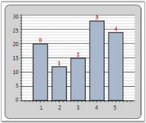 | markdownify }
{:.image }

Symbol Template for Chart Adornment

The following Symbol Templates can be set for ChartAdornmentInfo.

* Predefined Symbol Template (set from one among the twelve predefined symbols)
* Custom Template (custom Data Template set by users)

Predefined Symbol Template

You can set any one of the following predefined symbols for ChartAdornmentInfo. 

* Cross
* Diamond
* Ellipse
* Hexagon
* HorizontalLine
* InvertedTriangle
* Pentagon
* Plus Square
* Triangle
* VerticalLine

The following code example illustrates how to apply predefined symbol templates to chart adornments.

[XAML]

 &lt;Syncfusion:ChartSeries Type="Column"  DataSource="{StaticResource collection1}" BindingPathX="X" BindingPathsY="Y" IsIndexed="True"         Stroke="Black" StrokeThickness="1.5"&gt;

      &lt;Syncfusion:ChartSeries.AdornmentsInfo&gt;

         &lt;Syncfusion:ChartAdornmentInfo Visible="True" Symbol="Pentagon" SymbolInterior="Green" SymbolHeight="25" SymbolWidth="25" /&gt;

         &lt;/Syncfusion:ChartSeries.AdornmentsInfo&gt;

      &lt;/Syncfusion:ChartSeries&gt;

[C#]

series1.AdornmentsInfo.Visible = true;

series1.AdornmentsInfo.Symbol = Symbol.Pentagon;

series1.AdornmentsInfo.SymbolInterior = Brushes.Green;

series1.AdornmentsInfo.SymbolHeight = 25;

series1.AdornmentsInfo.SymbolWidth = 25;

{ 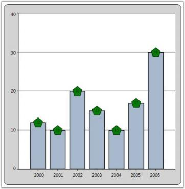 | markdownify }
{:.image }

Custom Symbol Template

The following code example illustrates how to apply custom symbol templates to chart adornments.

[XAML]

&lt;Window.Resources&gt;

    &lt;local:ProductSalesCollection x:Key="SeriesData1"/&gt;

    &lt;DataTemplate x:Key="Lbltxt1"&gt;

        <TextBlock Name="TB1" Text ="{Binding}" FontSize="11" Foreground="Black" TextAlignment="Justify"  VerticalAlignment="Center"

        FontWeight="Bold">

    &lt;/TextBlock&gt;

    &lt;/DataTemplate&gt;

    &lt;DataTemplate x:Key="SymbolTemplate"&gt;

        &lt;Rectangle Stroke="Black" Fill="Red" Width="10" Height="10"/&gt;

    &lt;/DataTemplate&gt;

&lt;/Window.Resources&gt;

&lt;sfchart:Chart&gt;

    &lt;sfchart:ChartArea&gt;

        &lt;sfchart:ChartSeries Type="Area" DataSource="{StaticResource SeriesData1}" BindingPathX="Year" BindingPathsY="Sales"                     Interior="LightCoral" Stroke="Black" StrokeThickness="1.5"&gt;

            &lt;sfchart:ChartSeries.AdornmentsInfo&gt;

                <sfchart:ChartAdornmentInfo SymbolTemplate="{StaticResource SymbolTemplate}" LabelTemplate="{StaticResource Lbltxt1}"

                LabelContentPath="DataPoint.X" Visible="True" VerticalAlignment="Top"/>

            &lt;/sfchart:ChartSeries.AdornmentsInfo&gt;

        &lt;/sfchart:ChartSeries&gt;

    &lt;/sfchart:ChartArea&gt;

&lt;/sfchart:Chart&gt;

[C#]

ChartSeries series = new ChartSeries();

series.DataSource = new ProductSalesCollection();

series.BindingPathX = "Year";

series.BindingPathsY = new string[] { "Sales" };

series.Stroke = Brushes.Black;

series.StrokeThickness = 1d;

Chart1.Areas[0].Series.Add(series);

ChartAdornmentInfo adornments = series.AdornmentsInfo;

adornments.LabelContentPath = "DataPoint.X";

adornments.LabelTemplate = this.Resources["Lbltxt1"] as DataTemplate;

adornments.Visible = true;

adornments.VerticalAlignment = VerticalAlignment.Bottom;

adornments.SymbolTemplate = this.Resources["SymbolTemplate"] as DataTemplate;

{ 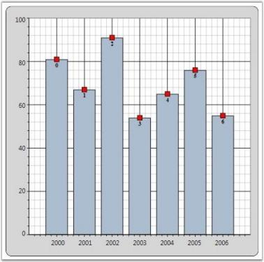 | markdownify }
{:.image }

Adornment Support for Fast Chart Types

This feature helps the user use adornments in fastchart types too. Considering the performance of Fastchart types, only limited adornment support for fastchart types have been provided.

* Limited adornment symbols are supported for Fastchart types. They are
* Ellipse
* Square
* Horizontal line
* Vertical line
* Symbol interior can be changed.
* Symbol height and width can be changed.

Use Case Scenarios

Most fastchart types are used in stock market charts. Users can display the data of the point in the adornment.

{  | markdownify }
{:.image }

{  | markdownify }
{:.image }

{  | markdownify }
{:.image }

{  | markdownify }
{:.image }

Sample Link

Essential Chart WPF > Chart Series > Adornments Configuration Demo

Adding Fastchart Types with Adornments to an Application

[XAML]

  &lt;Syncfusion:ChartSeries.AdornmentsInfo&gt;

         &lt;Syncfusion:ChartAdornmentInfo Visible="True" Symbol="Ellipse" SymbolInterior="Red" SymbolHeight="20" SymbolWidth="20" /&gt;

         &lt;/Syncfusion:ChartSeries.AdornmentsInfo&gt;

      &lt;/Syncfusion:ChartSeries&gt;

[C#]

series1.AdornmentsInfo.Visible = true;

series1.AdornmentsInfo.Symbol = Symbol.Ellipse;

series1.AdornmentsInfo.SymbolInterior = Brushes.Red;

series1.AdornmentsInfo.SymbolHeight = 20;

series1.AdornmentsInfo.SymbolWidth = 20;

See Also

Populating Chart Series

###### Chart Segment Labels

Labels can be displayed in the chart types such as Pie, Doughnut, Pyramid and Funnel. Chart Segment Labels can be used to display information like x value, y value, percentage, y value of total and datetime. This feature has been implemented based on the ChartAdornmentsInfo class. The following code example illustrates how to add Chart Segment Labels.

[XAML]

&lt;sfchart:ChartArea&gt;

    &lt;sfchart:ChartSeries Type="Pie"&gt;

        &lt;sfchart:ChartSeries DataSource="{Binding Source={StaticResource myXmlData}, XPath=Products/Product}" BindingPathX="Month"                 BindingPathsY="Sales" &gt;

            &lt;sfchart:ChartSeries.AdornmentsInfo&gt;

                <sfchart:ChartAdornmentInfo LabelContentPath="SegmentLabel" Visible="True" SegmentShowLine="False"

                SegmentLabelContent="Percentage" SegmentLabelFontSize="12"/>

            &lt;/sfchart:ChartSeries.AdornmentsInfo&gt;

        &lt;/sfchart:ChartSeries&gt;

&lt;/sfchart:ChartArea&gt;

{  | markdownify }
{:.image }

Chart supports applying custom templates to the chart segment labels. The following code example illustrates this.

[XAML]

&lt;Window.Resources&gt;

    &lt;DataTemplate x:Key="labelsTemplate"&gt;

        &lt;Border CornerRadius="1" Margin="0" Padding="2" BorderBrush="Black" Background="MintCream" BorderThickness="1"&gt;

            &lt;ContentPresenter Content="{Binding}"/&gt;

        &lt;/Border&gt;

    &lt;/DataTemplate&gt;

    &lt;DataTemplate x:Key="connectorTemplate"&gt;

        &lt;Line X1="0" X2="10" Y1="0" Y2="0" Stroke="Black"/&gt;

    &lt;/DataTemplate&gt;

&lt;/Window.Resources&gt;

<sfchart:ChartSeries DataSource="{Binding Source={StaticResource myXmlData}, XPath=Products/Product}" BindingPathX="Month"

BindingPathsY="Sales" Type="Pie">

    &lt;sfchart:ChartSeries.AdornmentsInfo&gt;

        <sfchart:ChartAdornmentInfo LabelContentPath="SegmentLabel" SegmentIsOut="False" SegmentLabelContent="Percentage" Visible="True"          SegmentShowLine="True" SegmentLabelFontSize="12" LabelTemplate="{StaticResource labelsTemplate}"

        ConnectorTemplate="{StaticResource connectorTemplate}"/>

    &lt;/sfchart:ChartSeries.AdornmentsInfo&gt;

&lt;/sfchart:ChartSeries&gt;

{ 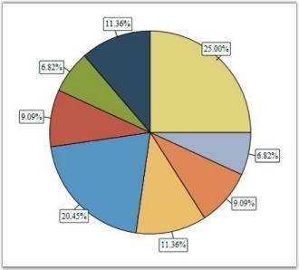 | markdownify }
{:.image }

The following properties are used to customize the look and feel of the Chart Segment Labels.

_Property Table_

<table>
<tr>
<td>
Name</td><td>
Type</td><td>
Description</td><td>
Default Value</td></tr>
<tr>
<td>
SegmentLabelContent</td><td>
Enum</td><td>
specifies value of the labelThe options included are as follows.DateTimePercentageXValueYofTotYValue</td><td>
YValue</td></tr>
<tr>
<td>
SegmentIsOut</td><td>
Bool</td><td>
indicates whether label is inside or outside the segment</td><td>
False</td></tr>
<tr>
<td>
SegmentShowLine</td><td>
Bool</td><td>
indicates whether line is shown from the segment to label</td><td>
False</td></tr>
<tr>
<td>
HorizontalAlignment</td><td>
HorizontalAlignment</td><td>
specifies horizontal label alignment with respect to segment</td><td>
Center</td></tr>
<tr>
<td>
VerticalAlignment</td><td>
VerticalAlignment</td><td>
specifies vertical label alignment with respect to segment</td><td>
Center</td></tr>
<tr>
<td>
SegmentLabelDataTimeFormat</td><td>
String</td><td>
specifies segment label data time format</td><td>
"dd/MM/yyyy"</td></tr>
<tr>
<td>
SegmentLabelFontFamily</td><td>
FontFamily</td><td>
specifies font of the label</td><td>
Times New Roman</td></tr>
<tr>
<td>
SegmentLabelFontSize</td><td>
Int32</td><td>
specifies font size of the label</td><td>
10</td></tr>
<tr>
<td>
SegmentLabelFontWeight</td><td>
FontWeight</td><td>
specifies font weight of the label</td><td>
Normal</td></tr>
<tr>
<td>
SegmentLabelFormat</td><td>
String</td><td>
specifies label format</td><td>
"0.00"</td></tr>
<tr>
<td>
SegmentLabelRotation</td><td>
double</td><td>
specifies rotation angle for the label</td><td>
0d</td></tr>
<tr>
<td>
ConnectorTemplate</td><td>
DataTemplate</td><td>
label's connector template</td><td>
Null</td></tr>
<tr>
<td>
LabelContentPath</td><td>
String</td><td>
label's content path</td><td>
"SegmentLabel"</td></tr>
<tr>
<td>
LabelTemplate</td><td>
DataTemplate</td><td>
label's template</td><td>
Null</td></tr>
<tr>
<td>
SymbolTemplate</td><td>
DataTemplate</td><td>
symbol's template</td><td>
Null</td></tr>
</table>
> 

> _Note: To show the segment lines, the SegmentShowLine property must be set to true and a ConnectorTemplate must be associated._

> 

See Also

Populating Chart Series

###### Chart Series Empty Points

Essential Chart provides support for Empty Points. The data collection that is passed to the chart can have NaN or infinite values that will be considered as Empty Points. You can also hide the empty points by setting the ShowEmptyPoints property to _false_.

[XAML]

&lt;syncfusion:ChartSeries Type="Column" Name="series1" EmptyPointInterior="Red" EmptyPointStyle="SymbolAndInterior" Interior="Green" IsIndexed="False" ShowEmptyPoints="True" Stroke="Black"  StrokeThickness="1"/&gt;

[XAML]

// Display Empty Points.

series1.ShowEmptyPoints = true;

// Set Empty Point style.

series1.EmptyPointStyle = EmptyPointStyle.SymbolAndInterior;

// Set Empty Point symbol color.

series1.EmptyPointInterior = Brushes.Red;

// Collection with Nan values.

public IList products()

{

    Random rand = new Random(DateTime.Now.Millisecond);

    List<product> productList = new List<product>();

    productList.Add(new product() { ProdId = 1, Prodname = "Rice", Price = double.NaN, Stock = 3.5 });

    productList.Add(new product() { ProdId = 2, Prodname = "Wheat", Price = double.NaN, Stock = 5.8 });

    productList.Add(new product() { ProdId = 3, Prodname = "Oil", Price = 30, Stock = 2.1 });

    productList.Add(new product() { ProdId = 4, Prodname = "Corn", Price = 20, Stock = 5.1 });

    productList.Add(new product() { ProdId = 5, Prodname = "Gram", Price = double.NaN, Stock = 2.0 });

    productList.Add(new product() { ProdId = 6, Prodname = "Milk", Price = 30, Stock = 1.5 });

    productList.Add(new product() { ProdId = 7, Prodname = "Oil", Price = 40, Stock = 2.0 });

    productList.Add(new product() { ProdId = 8, Prodname = "Corn", Price = 20, Stock = 2.5 });

    productList.Add(new product() { ProdId = 9, Prodname = "Butter", Price = 30, Stock = 1.5 });

    return productList;

}

{  | markdownify }
{:.image }

Empty Point Symbol customization 

This feature enables you to customize the marker for the empty point. You can differentiate the points using symbol or interior color. This support is available for all chart types except Fast chart type.

Property

_Propert Table_

<table>
<tr>
<td>
Property </td><td>
Description </td><td>
Type </td><td>
Data Type </td><td>
Reference links </td></tr>
<tr>
<td>
EmpyPointSymbolTemplate </td><td>
Used to apply user defined template for the empty point symbol.</td><td>
Dependency Property</td><td>
DataTemplate</td><td>
NA </td></tr>
</table>
Customizing Chart Empty Point Symbol

You can customize the empty point symbol using the _EmpyPointSymbolTemplate_ property. The following code illustrates this:

[XAML]

&lt;!—Data Template for Empty point symbol--&gt;

&lt;DataTemplate x:Key="EmptyTemp"&gt;                &lt;Grid &gt;                    &lt;Rectangle Fill="Green" Margin="0,0,0,10"  Width="10" Height="10" /&gt;                &lt;/Grid&gt;            &lt;/DataTemplate &gt;

&lt;!— Adding Data Template for Chart series--&gt;

&lt;syncfusion:ChartSeries Name="series1" Label="Profit" EmptyPointSymbolTemplate="{StaticResource EmptyTemp}"&gt;

{ 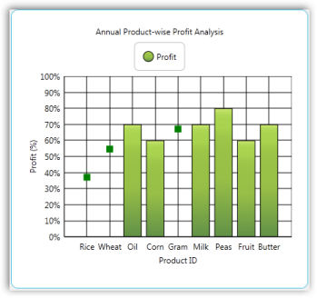 | markdownify }
{:.image }

Sample Link

To view a sample:

1. Open the Syncfusion Dashboard.
2. Select User Interface.
3. Click the WPF drop-down list and select Explore Samples.
4. Navigate to _Chart.WPF\Samples\3.5\WindowsSamples\Chart Customization\_

Empty Point Default Value

This feature enables you to specify the default value of the empty point.  You can either set this as zero or the average of nearest value on the adjacent side. 

Properties

_Property Table_

<table>
<tr>
<td>
Property </td><td>
Description </td><td>
Type </td><td>
Data Type </td><td>
Reference links </td></tr>
<tr>
<td>
EmptyPointValue</td><td>
Specifies whether empty point has to show zero or average value.</td><td>
Dependency Property</td><td>
EmptyPointValue</td><td>
NA</td></tr>
</table>
Customizing the Default Value of the Empty Point

You can customize the default value of the empty point using the _EmptyPointValue_ property. 

Set the EmptyPointValue property to _Zero_, the default empty point value will be zero.

The following code illustrates this:

[XAML]

<syncfusion:ChartSeries Name="series1" EmptyPointValue="Zero"  EmptyPointStyle="Symbol" ShowEmptyPoints="True" EmptyPointSymbolTemplate="{StaticResource EmptyTemp}"

 Stroke="Black"  StrokeThickness="1"/>

[C#]

series1.EmptyPointValue = EmptyPointValue.Zero;

{  | markdownify }
{:.image }

Set the EmptyPointValue property to Average, the default empty point value will be the average of nearest value on the adjacent side.

The following code illustrates this: 

[XAML]

<syncfusion:ChartSeries Name="series1" EmptyPointValue="Average"  EmptyPointStyle="Symbol" ShowEmptyPoints="True" EmptyPointSymbolTemplate="{StaticResource EmptyTemp}"

 Stroke="Black"  StrokeThickness="1"/>

[C#]

series1.EmptyPointValue = EmptyPointValue.Average;

{  | markdownify }
{:.image }

###### Applying Different Colors to Chart Series Segments

Essential Chart allows setting different colors to each data point in a chart series by using built-in color palettes and custom palettes.

* Using the ColorEach property, the segments of a chart series can be applied with various colors.
* Chart series segments are allowed to be set with unique colors without specifying an interior color for individual segments of chart series.

Use Case Scenarios

With the help of this feature, users can differentiate huge numbers of data points with different colors through which chart segments can be easily identified. 

Tables for Properties, Methods, and Events

_Properties Table_

<table>
<tr>
<td>
Property</td><td>
Description</td><td>
Type</td><td>
Data Type</td></tr>
<tr>
<td>
 ColorEach</td><td>
Specifies whether each data point of a series is shown in a different color.</td><td>
 Dependency</td><td>
Bool </td></tr>
<tr>
<td>
Palette</td><td>
To set the color palette for chart series segments.</td><td>
Dependency</td><td>
ChartColorPalette</td></tr>
<tr>
<td>
CustomPalette</td><td>
To set the custom color palette for chart series segments.</td><td>
Dependency</td><td>
Brush[]</td></tr>
</table>
Sample Link

To access the chart series multi-color segments demo:

1. Open the Syncfusion Dashboard.
2. Select User Interface.
3. Click the WPF drop-down list and select Explore Samples.
4. Browse to the path Chart.WPF\Samples\3.5\WindowsSamples\Chart Series\Series Multi-Color Segments Demo.

Adding Colorful Chart Series Segments to an Application

Built-in Palette

<table>
<tr>
<td>
[XAML]   <syncfusion:ChartSeries DataSource="{Binding ProductModel}"            ColorEach="True" Palette="Gradient"                      BindingPathX="Months" BindingPathsY="Sales">     &lt;/syncfusion:ChartSeries&gt;</td></tr>
<tr>
<td>
[C#]     this.Series1.ColorEach = true;     this.Series1.Palette = ChartColorPalette.Gradient;</td></tr>
</table>

{  | markdownify }
{:.image }

Custom Palette

<table>
<tr>
<td>
[XAML]&lt;syncfusion:ChartSeries DataSource="{Binding ProductModel}"ColorEach="True" Palette="Custom" BindingPathX="Months" BindingPathsY="Sales"&gt;    &lt;syncfusion:ChartStyleModel.CustomPalette&gt;        &lt;x:Array Type='Brush'&gt;            &lt;SolidColorBrush Color='Violet"&gt;&lt;/SolidColorBrush&gt;&lt;SolidColorBrush Color='Indigo'&gt;&lt;/SolidColorBrush&gt;&lt;SolidColorBrush Color='Blue'&gt;&lt;/SolidColorBrush&gt;&lt;SolidColorBrush Color='Green'&gt;&lt;/SolidColorBrush&gt;&lt;SolidColorBrush Color='Yellow'&gt;&lt;/SolidColorBrush&gt;&lt;SolidColorBrush Color='Orange'&gt;&lt;/SolidColorBrush&gt;&lt;SolidColorBrush Color='Red'&gt;&lt;/SolidColorBrush&gt;        &lt;/x:Array&gt;    &lt;/syncfusion:ChartStyleModel.CustomPalette&gt;&lt;/syncfusion:ChartSeries&gt;</td></tr>
<tr>
<td>
[C#]this.Series1.ColorEach = true;this.Series1.Palette = ChartColorPalette.Custom;this.Series1.CustomPalette = new Brush[]{Brushes.Violet,Brushes.Indigo,Brushes.Blue,Brushes.Green,Brushes.Yellow,Brushes.Orange,Brushes.Red};</td></tr>
</table>

{ 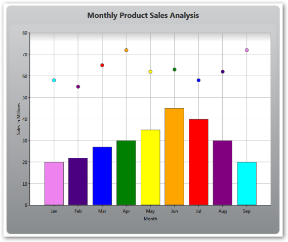 | markdownify }
{:.image }

###### Highlighting Series

Chart for WPF lets you to "highlight" all the data points in a series when you move the mouse over any one of the data points in the series, or over the legend items corresponding to a Chart Series. This is achieved by binding the ChartSeries.Interior to the ChartSeries.Highlighted dependency property, such that all the data point segments in the series will get "highlighted" when this property changes.

The following code example illustrates this.

[XAML]

&lt;!--Include this in the Window's Resources section.--&gt;

&lt;local:HighlightedToOpacityConverter x:Key="myOpcConverter"/&gt;

&lt;sfchart:ChartSeries Name="series1" Label="Series 1" Type="Column" DataSource="{StaticResource SeriesData1}" BindingPathX="Date" BindingPathsY="Y1"&gt;

    &lt;sfchart:ChartSeries.Interior&gt;

        &lt;!--Increasing the Opacity of the Interior when this series is highlighted.--&gt;

        <LinearGradientBrush EndPoint="0,0.5" StartPoint="1,0.5" Opacity="{Binding ElementName=series1, Path=Highlighted,

        Converter={StaticResource myOpcConverter}}">

            &lt;GradientStop Color="#FF434865" Offset="0"/&gt;

            &lt;GradientStop Color="#FF7598BF" Offset="0.947"/&gt;

            &lt;GradientStop Color="#FF496B82" Offset="0.75"/&gt;

            &lt;GradientStop Color="#FF8DA4C7" Offset="0.365"/&gt;

        &lt;/LinearGradientBrush&gt;

    &lt;/sfchart:ChartSeries.Interior&gt;

&lt;/sfchart:ChartSeries&gt;

[C#]

public class HighlightedToOpacityConverter : IValueConverter

{

    #region IValueConverter Members

    public object Convert(object value, Type targetType, object parameter, System.Globalization.CultureInfo culture)

    {

        bool highlighted = (bool)value;

        if (highlighted)

            return 1;

        else

            return 0.65;

    }

    public object ConvertBack(object value, Type targetType, object parameter, System.Globalization.CultureInfo culture)

    {

        throw new NotImplementedException();

    }

    #endregion

}

{  | markdownify }
{:.image }

A sample which demonstrates Series highlighting feature is available in the following sample installation path.

_..My Documents\Syncfusion\EssentialStudio\&lt;Version Number&gt;\WPF\Chart.WPF\Samples\3.5\WindowsSamples\Chart Series\Series Highlight Demo_

See Also

Populating Chart Series, Highlighting Data Points, Selecting Points

###### Highlighting Data Points

Chart for WPF lets you highlight a single data point segment when you move the mouse pointer over the data point segment. The ChartSegment.Highlighted dependency property is used for this purpose. This property is set to _true_ when you move the mouse pointer over a data point segment. Also, you can create custom templates that utilize this dependency property to change the interior of the data point segment when the mouse pointer is moved it.

The following code example illustrates this.

[XAML]

&lt;!--Include this in the Window's Resources section.--&gt;

&lt;!--Define the interior that will be used as the "highlight" color.--&gt;

&lt;LinearGradientBrush x:Key="MouseHoverInterior" StartPoint="0,0.5" EndPoint="1,0.5"&gt;

    &lt;GradientStop Color="#FFFDAE41" Offset="0"/&gt;

    &lt;GradientStop Color="#FFFDC55C" Offset="0.860442"/&gt;

    &lt;GradientStop Color="#FFFDDD77" Offset="0.989014"/&gt;

    &lt;GradientStop Color="#FFFDDD77" Offset="1"/&gt;

&lt;/LinearGradientBrush&gt;

&lt;!--Chart Series Data--&gt;

&lt;XmlDataProvider x:Key="myXmlData"&gt;

    &lt;x:XData&gt;

        &lt;Products xmlns=""&gt;

            &lt;Product Sales="20" Projected="30" Month="1"/&gt;

            &lt;Product Sales="12" Projected="28" Month="2"/&gt;

            &lt;Product Sales="15" Projected="29" Month="3"/&gt;

            &lt;Product Sales="28" Projected="33" Month="4"/&gt;

            &lt;Product Sales="24" Projected="30" Month="5"/&gt;

        &lt;/Products&gt;

    &lt;/x:XData&gt;

&lt;/XmlDataProvider&gt;

&lt;!--Custom column template where the interior color of the data point segment is changed when the mouse pointer is over it. (ChartSegment.Highlighted property change)--&gt;

&lt;DataTemplate x:Key="ColumnTemplate"&gt;

    &lt;Canvas&gt;

        &lt;Grid Canvas.Left="{Binding X}" Canvas.Top="{Binding Y}" Width="{Binding Width}" Height="{Binding Height}"&gt;

            <Border Name="ColumnRect" VerticalAlignment="Bottom" Width="{Binding Width}" Height="{Binding Height}"

                           >

                &lt;Border.Style&gt;

                    &lt;Style TargetType="{x:Type Border}"&gt;

                        &lt;Setter Property="BorderThickness" Value="1"/&gt;

                        &lt;Setter Property="BorderBrush" Value="Black"/&gt;

                        &lt;Setter Property="Background" Value="{Binding Interior}"/&gt;

                        &lt;Style.Triggers&gt;

                            &lt;DataTrigger Value="True"&gt;

                                &lt;DataTrigger.Binding&gt;

                                    &lt;Binding Path="Highlighted"/&gt;

                                &lt;/DataTrigger.Binding&gt;

                                &lt;Setter Property="Background" Value="{StaticResource MouseHoverInterior}"/&gt;

                            &lt;/DataTrigger&gt;

                        &lt;/Style.Triggers&gt;

                    &lt;/Style&gt;

                &lt;/Border.Style&gt;

            &lt;/Border&gt;

        &lt;/Grid&gt;

    &lt;/Canvas&gt;

&lt;/DataTemplate&gt;

&lt;!--Refer to the preceding template while defining a Chart Series.--&gt;

<sfchart:ChartSeries Name="series1"  Template="{StaticResource ColumnTemplate}" Type="Column"

DataSource="{Binding Source={StaticResource myXmlData}, XPath=Products/Product}" BindingPathX="Month" BindingPathsY="Sales"

Stroke="Black" StrokeThickness="1.5" />

{  | markdownify }
{:.image }

A sample which demonstrates Data Point highlighting feature is available in the following sample installation path.

_..My Documents\Syncfusion\EssentialStudio\&lt;Version Number&gt;\WPF\Chart.WPF\Samples\3.5\WindowsSamples\Chart Series\Data Point Highlight Demo_

See Also

Populating Chart Series, Highlighting Data Points, Selecting Points

###### Selecting Points

Chart for WPF lets you implement list box-like selection of data point segments in your chart. The following steps illustrate this.

1. Bind the Chart to a CollectionViewSource

Wrap your data in a CollectionViewSource and bind this to a Chart Series.

[XAML]

&lt;!--Create a CollectionViewSource.--&gt;

&lt;local:MyDataCollection x:Key="SeriesData1"/&gt;

&lt;CollectionViewSource x:Key="cvs" Source="{StaticResource SeriesData1}"  /&gt;

&lt;!--Bind this to a Chart Series.--&gt;

&lt;sfchart:ChartSeries DataSource="{Binding Source={StaticResource cvs}}" Template="{StaticResource SeriesTemplate}" Type="Column" BindingPathX="Date" BindingPathsY="Y2" /&gt;

The CollectionViewSource has a CurrentItem property which tracks the "selected item". The Chart control listens to this property change and updates the corresponding data point's ChartSegment.IsSelected property appropriately.

2. Create a Custom Template

Create a custom template that renders a data-point segment with a "selected" look and feel, when the ChartSegment.IsSelected property changes to _true_.

[XAML]

&lt;!-- This template helps in 2 ways. 1) It enables to bind to IsSelected property to change the selected segment color. 2) It enables to listen to Canvas.MouseDown event to change selection.--&gt;

&lt;DataTemplate x:Key="SeriesTemplate"&gt;

    &lt;!--Change the CollectionView.CurrentItem in the handler.--&gt;

    &lt;Canvas MouseDown="Canvas_MouseDown"&gt;

        &lt;Grid Canvas.Left="{Binding X}" Canvas.Top="{Binding Y}" Width="{Binding Width}" Height="{Binding Height}"&gt;

            &lt;Border Name="ColumnRect" VerticalAlignment="Bottom" Width="{Binding Width}" Height="{Binding Height}"&gt;

                &lt;Border.Style&gt;

                    &lt;Style TargetType="{x:Type Border}"&gt;

                        &lt;Setter Property="BorderThickness" Value="1"/&gt;

                        &lt;Setter Property="BorderBrush" Value="Black"/&gt;

                        &lt;Setter Property="Background" Value="{Binding Interior}"/&gt;

                        &lt;Style.Triggers&gt;

                            &lt;DataTrigger Value="True"&gt;

                                &lt;DataTrigger.Binding&gt;

                                    &lt;!-- By binding to IsSelected you can change the background of "CollectionView.CurrentItem".--&gt;

&lt;Binding Path="IsSelected"/&gt;

                                &lt;/DataTrigger.Binding&gt;

                                &lt;Setter Property="Background" Value="{StaticResource MouseHoverInterior}"/&gt;

                            &lt;/DataTrigger&gt;

                        &lt;/Style.Triggers&gt;

                    &lt;/Style&gt;

                &lt;/Border.Style&gt;

            &lt;/Border&gt;

        &lt;/Grid&gt;

    &lt;/Canvas&gt;

&lt;/DataTemplate&gt;

&lt;!--Defines the interior that will be used as the "highlight" color.--&gt;

&lt;LinearGradientBrush x:Key="MouseHoverInterior" StartPoint="0,0.5" EndPoint="1,0.5"&gt;

    &lt;GradientStop Color="#FFFDAE41" Offset="0"/&gt;

    &lt;GradientStop Color="#FFFDC55C" Offset="0.860442"/&gt;

    &lt;GradientStop Color="#FFFDDD77" Offset="0.989014"/&gt;

    &lt;GradientStop Color="#FFFDDD77" Offset="1"/&gt;

&lt;/LinearGradientBrush&gt;

This will cause the CollectionView.CurrentItem to be rendered distinctly. Note that the CurrentItem can be changed by a different Control bound to the same CollectionView, and this change will be automatically reflected in the Chart.

3. Change CollectionView.CurrentItem 

Change it when any Mouse Button is pressed while the Mouse Pointer is moved over a Data Point Segment.

To change the CurrentItem when any mouse button is pressed while the mouse pointer is moved over a data point segment, listen to the MouseDown event of the top-level Canvas in the template, as illustrated in the following code.

[C#]

private void Canvas_MouseDown(object sender, MouseButtonEventArgs e)

{

    // Get the corresponding Chart Segment.

    ChartSegment seg = ((ChartSeriesPresenter.ChartSegmentPresenter)(((Canvas)sender).TemplatedParent)).Segment;

    // Get the corresponding bound CollectionView.

    CollectionView cv = seg.Series.DataSource as CollectionView;

    // Set the CurrentItem in the CollectionView.

    cv.MoveCurrentToPosition(seg.CorrespondingPoints[0].Index);

}

{ 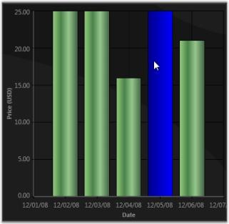 | markdownify }
{:.image }

A sample which demonstrates Data Point highlighting feature is available in the following sample installation path.

_..My Documents\Syncfusion\EssentialStudio\&lt;Version Number&gt;\WPF\Chart.WPF\Samples\3.5\WindowsSamples\Chart Series\Selectable Data Points Demo_

See Also

Highlighting Series,Highlighting Data Points, Populating Chart Series

###### Side-By-Side Series

Series can be placed side by side or overlapped by using the ChartArea.SideBySideSeriesPlacement property. This is especially used when multiple HiLo type series are used in the Chart. HiLo type series that get stacked and plotted can be separated and placed side by side by using this property.

[XAML]

&lt;syncfusion:ChartArea SideBySideSeriesPlacement="True"&gt;

&lt;syncfusion:ChartSeries Type="HiLo" /&gt;

&lt;/syncfusion:ChartArea&gt;

[C#]

area.SideBySideSeriesPlacement = true;

The following screenshot illustrates Chart Series placed side by side.

{  | markdownify }
{:.image }

###### AutoDiscard Property

AutoDiscard can be used to set range for primary axis in a chart. This property belongs to ChartSeries class. It can be set to three enumerations namely:

* None-The user can provide custom range values for primary axis, when the AutoDiscard property is set to _None_.
* ExtendRange-The range values will be automatically extended based on the difference between the start and end range values, when the AutoDiscard property is set to _ExtendRange_.
* ResetRange-The range values will be reset based on the interval, when set to ResetRange,

> _Note: The AutosetRange property of the primary axis needs to be set to False, when the AutoDiscard property is set to ExtendRange or ResetRange._

The following code example illustrates the usage of the AutoDiscard property, when set to various enumerations.

[XAML]

&lt;syncfusion:ChartArea.PrimaryAxis&gt;

                    &lt;syncfusion:ChartAxis Header="Time" LabelForeground="LightGray" ValueType="Double"	  IsAutoSetRange="False"/&gt;         &lt;/syncfusion:ChartArea.PrimaryAxis&gt;

&lt;syncfusion:ChartSeries Label="Measurement 1" Type="FastLine" Interior="Orange" AutoDiscard="None" Range="0,10"/&gt;

or

&lt;syncfusion:ChartSeries Label="Measurement 1" Type="FastLine" Interior="Orange" AutoDiscard="ExtendRange" /&gt;

or

&lt;syncfusion:ChartSeries Label="Measurement 1" Type="FastLine" Interior="Orange" AutoDiscard="ResetRange" /&gt;

###### Controlling the Visibility of Chart Legend Items

Essential Chart WPF now provides support to toggle the visibility of the Chart Legend Items. This is achieved by using the VisibilityOnLegend property.

_Property Table_

<table>
<tr>
<td>
Property</td><td>
Description</td></tr>
<tr>
<td>
VisibilityOnLegend</td><td>
Sets the visibility of Legend Items. It includes the following options.Visible-Items in the Legend will be Visible.Hidden-Items in the Legend will be Hidden.Collapsed-Items in the Legend will be Collapsed.</td></tr>
</table>

The following code example illustrates how to set this property.

[XAML]

<syncfusion:ChartSeries Name="SeriesB" Type="Bar" VisibilityOnLegend="Hidden" BindingPathX="FruitName"

BindingPathsY="FruitID,NumberOfFruits,Price,Year" Label="Series B" Stroke="#FF000000" StrokeThickness="0.5" >

&lt;/syncfusion:ChartSeries&gt;

[C#]

Chart1.Areas[0].Series[0].VisibilityOnLegend = Visibility.Hidden;

{  | markdownify }
{:.image }

Methods

The LegendItemSource method associated with this feature can also be used to control the visibility of the Legend Items. The following code example illustrates how to use this method.

[C#]

public void LegendItemSource(ChartSeries chartSeries)

{

    ChartSeriesCollection collection = new ChartSeriesCollection();

    foreach (ChartSeries item in chartSeries.Area.Series)

    {

        if (item.IsVisibleOnLegend == true && item.VisibilityOnLegend != Visibility.Collapsed)

        {

            collection.Add(item);

        }

    }

    Legend.ItemsSource = collection;

}

Events

The OnVisibilityOnLegend event is triggered when the value of the VisibilityOnLegend property is changed. The following code example illustrates how to handle this event.

[C#]

public static readonly DependencyProperty VisibilityOnLegendProperty =

DependencyProperty.Register("VisibilityOnLegend", typeof(Visibility), typeof(ChartSeries), new PropertyMetadata(Visibility.Visible, new PropertyChangedCallback(OnVisibilityOnLegend)));

public Visibility VisibilityOnLegend

{

    get { return (Visibility)GetValue(VisibilityOnLegendProperty); }

    set { SetValue(VisibilityOnLegendProperty, value); }

}

private static void OnVisibilityOnLegend(DependencyObject d, DependencyPropertyChangedEventArgs args)

{

    ChartSeries type = (ChartSeries)d;

    type.Area.LegendItemSource(type);

}

###### Creating Predefined Shapes for Annotation Objects

Predefined shapes for annotation objects are used to point at specific information about a point in the chart series. For example: Circle, Down arrow, and so on. The following table describes more about the annotation shapes:

_Property Table_

<table>
<tr>
<td>
Name of the Property</td><td>
Description</td><td>
Values it accepts</td></tr>
<tr>
<td>
AnnotationShape</td><td>
Dependency Property</td><td>
Enum of type AnnotationShapes</td></tr>
<tr>
<td>
Fill</td><td>
Dependency Property</td><td>
Colors from Brushes</td></tr>
</table>
> 

> _Note: The AnnotationShape property helps create the required shape for the annotation and the Fill property helps fill the shape selected with required color._

The following code example illustrates creation of a circle with orange fill at points 5 on X series and point 45 on Y series in a Chart.

[XAML]

&lt;syncfusion:ChartSeries DataSource="{Binding Source={StaticResource myXmlData}, XPath=Products/Product}" BindingPathX="Month" BindingPathsY="Sales" IsIndexed="False" Name="series1" Label="Series1" Type="Area" Interior="{StaticResource SeriesAInterior}"&gt;

    &lt;syncfusion:ChartSeries.Annotations&gt;

        &lt;syncfusion:AnnotationsCollection &gt;

            <syncfusion:ChartSeriesAnnotation x:Name="serAnnot" X="5" Y="45" OffsetX="0" OffsetY="0" AnnotationShape="Circle"

            Fill="Orange" Stroke="Black" />

        &lt;/syncfusion:AnnotationsCollection&gt;

    &lt;/syncfusion:ChartSeries.Annotations&gt;

&lt;/syncfusion:ChartSeries&gt;

[C#]

Chart1.Areas[0].Series[0].Annotations.Items[0].AnnotationShape = AnnotationShapes.Circle;

Chart1.Areas[0].Series[0].Annotations.Items[0].X = 5;

Chart1.Areas[0].Series[0].Annotations.Items[0].Y = 45;

Chart1.Areas[0].Series[0].Annotations.Items[0].OffsetX = 0;

Chart1.Areas[0].Series[0].Annotations.Items[0].OffsetY = 0;

Chart1.Areas[0].Series[0].Annotations.Items[0].Fill = Brushes.Orange;

Chart1.Areas[0].Series[0].Annotations.Items[0].Stroke = Brushes.Black;

Run the sample. The following output is provided.

{  | markdownify }
{:.image }

###### Empty point support for FastLine Chart type

Essential chart WPF is now supports Empty point for Fast Line Chart type.

The data collection that is passed to the chart may have NaN values, this is an empty points.

If data points bounded with chart does not give any value then chart renders empty points in chart series.

This feature is useful when you are not able to get exact value for a particular data.

e.g.  In population analysis if you do not get the result for previous years then we can use Empty data value.

Adding Empty Point

Add Empty Point to the Chart, by using the following code.

Set ShowEmptyPoints to True to enable Empty Point.

[Xaml]

  <syncfusion:ChartSeries Name="series1" ShowEmptyPoints="True" 

Type="FastLine" Interior="Red" Stroke="Black" DataSource="{Binding}"/>

[C#] 

Series1.ShowEmptyPoints = true;

{  | markdownify }
{:.image }

###### Customization support for FastChart types

This enables the users to customize the Fast chat types like FastScatter, FastColumn, FastStackingColumn, and FastHiLoOpenClose.  Using this feature, users can customize the Stroke, Stroke thickness, and interior of each chart segment of the series.

Adding Customization Support

Add customization support for FastChart types, by using the following code.

[Xaml] 

  <syncfusion:ChartSeries Name="series1" Type="FastStackingColumn" 

FastSegmentProperties="{Binding Converter={StaticResource interiorConverter} }" 

Stroke="Black" DataSource="{Binding}"/>

[C#] 

FastSegmnetPropertiesCollection list = new FastSegmnetPropertiesCollection();

  FastSegmnetProperties segmentProperty = new FastSegmnetProperties { Stroke=Brushes.Black,

StrokeThickness=1, Interior = brush };

list.Add(segmentProperty);

series1.FastSegmentProperties= list;

{  | markdownify }
{:.image }

###### Smart Labels Support

Essential Chart ships with the enhancement of smart labels support to avoid the overlapping of adornment labels using the enum property AdornmentIntersectAction. The following actions can be taken when labels overlap:

* Hide
* AdjustAroundPoints
* None

Advantage of Using Smart Labels

1. Avoids the overlap of segment labels.
2. To view the label clearly and place the labels around the data points.
3. Additional connector lines are shown between a label and its corresponding chart point.

_Properties_

<table>
<tr>
<td>
Property</td><td>
Description</td><td>
Type</td><td>
Data Type</td></tr>
<tr>
<td>
ShowSmartLabels </td><td>
Sets the smart labels for the series.</td><td>
Dependency Property</td><td>
Boolean</td></tr>
<tr>
<td>
AdornmentIntersectAction</td><td>
Sets the intersect action for the adornments.</td><td>
Dependency Property</td><td>
Enum</td></tr>
</table>
Sample Link

1. Open the WPF sample browser.
2. Select the Chart control from the sample browser.
3. Chart > Smart Labels > Smart Label Demo.

Adding Smart Labels Support to an Application

The following code examples are used to add smart labels to the chart series.

[XAML]

<sync:ChartSeries x:Name="series2"                                  AdornmentIntersectAction="AdjustAcrossPoints" 

ShowSmartLabels="True"                                

>

       &lt;sync:ChartSeries.AdornmentsInfo&gt;

            &lt;sync:ChartAdornmentInfo x:Name="adorn" Visible="True" Symbol="Square" SymbolHeight="20" SymbolWidth="20"                                                SymbolInterior="LightBlue" /&gt;

       &lt;/sync:ChartSeries.AdornmentsInfo&gt;

&lt;/sync:ChartSeries&gt;

[C#]

series.ShowSmartLabels = true;

            series.AdornmentIntersectAction = AdornemntIntersectActions.AdjustAcrossPoints;

{  | markdownify }
{:.image }

The following code examples are used to add smart labels to the chart series with intersect action set to Hide.

[XAML]

<sync:ChartSeries x:Name="series2"                                  AdornmentIntersectAction="Hide" 

ShowSmartLabels="True"                                

>

       &lt;sync:ChartSeries.AdornmentsInfo&gt;

            &lt;sync:ChartAdornmentInfo x:Name="adorn" Visible="True" Symbol="Square" SymbolHeight="20" SymbolWidth="20"                                                SymbolInterior="LightBlue" /&gt;

       &lt;/sync:ChartSeries.AdornmentsInfo&gt;

&lt;/sync:ChartSeries&gt;

[C#]

series.ShowSmartLabels = true;

            series.AdornmentIntersectAction = 

AdornemntIntersectActions.AdjustAcrossPoints;

{  | markdownify }
{:.image }

The following code examples are used to add smart labels to the chart series with intersect action set to Hide.

[XAML]

<sync:ChartSeries x:Name="series2"                                  AdornmentIntersectAction="None" 

ShowSmartLabels="True"                                

>

       &lt;sync:ChartSeries.AdornmentsInfo&gt;

            &lt;sync:ChartAdornmentInfo x:Name="adorn" Visible="True" Symbol="Square" SymbolHeight="20" SymbolWidth="20"                                                SymbolInterior="LightBlue" /&gt;

       &lt;/sync:ChartSeries.AdornmentsInfo&gt;

&lt;/sync:ChartSeries&gt;

[C#]

series.ShowSmartLabels = true;

            series.AdornmentIntersectAction = 

AdornemntIntersectActions.None; 

{  | markdownify }
{:.image }

###### Technical Indicators

Overview

Technical Indicators are used to predict future price levels by analyzing a set of recorded data. They are used to improve the data analysis capabilities of a chart with regard to information on pricing, volume, and other metrics used in business calculations.

Essential Chart supports the following Technical Indicators:

* Accumulation Distribution
* Average True Range
* Bollinger Band
* Exponential Moving Average
* Simple Average
* Triangular Average
* MACD
* Momentum
* Stochastic
* RSI

A technical indicator is a graphic representation of price action. Some technical indicators overlay on the trading chart, and some reside on the bottom of the chart.

Accumulation Distribution

Accumulation Distribution Indicator is a volume indicator which was essentially designed to measure underlying supply and demand. It accomplishes this by trying to determine whether traders are actually accumulating (buying) or distributing (selling).

_Accumulation Distribution Properties_

<table>
<tr>
<td>
Property</td><td>
Description</td></tr>
<tr>
<td>
SignalLineColor</td><td>
Specifies the color for the signal line of the Accumulation Distribution technical indicator.</td></tr>
</table>

[XAML]

&lt;sync:ChartSeries.Indicators&gt;

&lt;sync:IndicatorCollection&gt;

&lt;sync:IndicatorCollection.Items&gt;

&lt;sync:ChartTechnicalIndicator IndicatorType="AccumulationDistribution"          sync:ChartAccumulationDistribution.SignalLineColor="Red"&gt;

&lt;/sync:ChartTechnicalIndicator&gt;

&lt;/sync:IndicatorCollection.Items&gt;

&lt;/sync:IndicatorCollection&gt;

&lt;/sync:ChartSeries.Indicators&gt;

{  | markdownify }
{:.image }

Average True Range

Average True Range (ATR) Indicator is a technical analysis volatility indicator. The indicator does not provide an indication of price trend, simply the degree of price volatility. The average true range is an N-day exponential moving average of the true range values.

[XAML]

&lt;sync:ChartSeries.Indicators&gt;

&lt;sync:IndicatorCollection&gt;

&lt;sync:IndicatorCollection.Items&gt;

&lt;sync:ChartTechnicalIndicator IndicatorType="AverageTrueRange" &gt;

&lt;/sync:IndicatorCollection.Items&gt;

&lt;/sync:IndicatorCollection&gt;

&lt;/sync:ChartSeries.Indicators&gt;

Bollinger Band

Bollinger Bands consist of a band of three lines which are plotted in relation to security prices. The line in the middle is usually a Simple Moving Average (SMA) set to a period of 20 days (The type of trend line and period can be changed by the trader; however a 20 day moving average is by far the most popular). The SMA then serves as a base for the Upper and Lower Bands. The Upper and Lower Bands are used as a way to measure volatility by observing the relationship between the Bands and price. Typically the Upper and Lower Bands are set to two standard deviations away from the SMA (The Middle Line); however the number of standard deviations can also be adjusted by the trader.

_Table_ _24__: Bollinger Band Properties_

<table>
<tr>
<td>
Property</td><td>
Description</td></tr>
<tr>
<td>
SignalLineColor</td><td>
Specifies the color for the signal line of the Bollinger Band technical indicator.</td></tr>
<tr>
<td>
UpperLineColor</td><td>
Specifies the color for the upper line of the Bollinger Band technical indicator.</td></tr>
<tr>
<td>
LowerLineColor</td><td>
Specifies the color for the lower line of the Bollinger Band technical indicator.</td></tr>
<tr>
<td>
BollingerMovingAverage</td><td>
Indicates the identification of a trend.</td></tr>
</table>

[XAML]

&lt;sync:ChartSeries.Indicators&gt;

&lt;sync:IndicatorCollection&gt;

&lt;sync:IndicatorCollection.Items&gt;

&lt;sync:ChartTechnicalIndicator IndicatorType="BollingerBands"  sync:ChartBollingerBand.LowerLineColor ="Blue" sync:ChartBollingerBand.UpperLineColor="Red" sync:ChartBollingerBand.SignalLineColor ="Green" sync:ChartBollingerBand.BollingerMovingAverage="50" &gt;

&lt;/sync:ChartTechnicalIndicator&gt;

&lt;/sync:IndicatorCollection.Items&gt;

&lt;/sync:IndicatorCollection&gt;

&lt;/sync:ChartSeries.Indicators&gt;

{  | markdownify }
{:.image }

Exponential Moving Average

The exponential moving average (EMA) is a weighted average of a price data which put a higher weight on recent data point.

_Exponential Moving Average Properties_

<table>
<tr>
<td>
Property</td><td>
Description</td></tr>
<tr>
<td>
SignalLineInterior</td><td>
Specifies the color for the signal line of the Exponential Moving Average technical indicator. </td></tr>
<tr>
<td>
ExponentialMovingAverage</td><td>
Indicates the identification of a trend.</td></tr>
</table>

[XAML]

&lt;sync:ChartSeries.Indicators&gt;

&lt;sync:IndicatorCollection&gt;

&lt;sync:IndicatorCollection.Items&gt;

&lt;sync:ChartTechnicalIndicator IndicatorType="ExponentialAverage" sync:ChartExponentialAverage.ExponentialAverage="50" sync:ChartExponentialAverage.SignalLineInterior="Red" &gt;

&lt;/sync:ChartTechnicalIndicator&gt;

&lt;/sync:IndicatorCollection.Items&gt;

&lt;/sync:IndicatorCollection&gt;

&lt;/sync:ChartSeries.Indicators&gt;

Simple Average

The simple moving average is an arithmetic mean of price data. It is calculated by summing up each interval's price and dividing the sum by the number of intervals covered by the moving average. For instance, adding the closing prices of an instrument for the most recent 25 days, and then dividing it by 25 will get you the 25 day moving average.

_Simple Average Properties_

<table>
<tr>
<td>
Property</td><td>
Description</td></tr>
<tr>
<td>
SignalLineInterior</td><td>
Specifies the color for the signal line of the Simple Average technical indicator.</td></tr>
<tr>
<td>
MovingAverage</td><td>
Indicates the identification of a trend.</td></tr>
</table>

[XAML]

&lt;sync:ChartSeries.Indicators&gt;

&lt;sync:IndicatorCollection&gt;

&lt;sync:IndicatorCollection.Items&gt;

&lt;sync:ChartTechnicalIndicator IndicatorType="TriangularAverage" sync:ChartSimpleAverage.MovingAverage="20" sync:ChartSimpleAverage.SignalLineInterior="Red" /&gt;      

&lt;/sync:IndicatorCollection.Items&gt;

&lt;/sync:IndicatorCollection&gt;

&lt;/sync:ChartSeries.Indicators&gt;

{  | markdownify }
{:.image }

Triangular Average

The Moving Average Triangular indicator measures a simple arithmetic average of prices, specified by the input Price and creates a simple arithmetic average of this average. The length of every of these averages is one more than half the value specified in the input Length, rounded to a whole number. This uses all the price data from the latest number of bars specified by the input Length, but with the smoothing effect of so-called averaging the average.

_Triangular Average Properties_

<table>
<tr>
<td>
Property</td><td>
Description</td></tr>
<tr>
<td>
SignalLineInterior</td><td>
Specifies the color for the signal line of the Triangular Average technical indicator.</td></tr>
<tr>
<td>
TriangularMovingAverage</td><td>
Indicates the identification of a trend.</td></tr>
</table>

[XAML]

&lt;sync:ChartSeries.Indicators&gt;

&lt;sync:IndicatorCollection&gt;

&lt;sync:IndicatorCollection.Items&gt;

<sync:ChartTechnicalIndicator IndicatorType="TriangularAverage"

sync:ChartTriangularAverage.TriangularAverage="20"

sync:ChartTriangularAverage.SignalLineInterior="Red" />      

&lt;/sync:IndicatorCollection.Items&gt;

&lt;/sync:IndicatorCollection&gt;

&lt;/sync:ChartSeries.Indicators&gt;

MACD

MACD is an extremely popular indicator used in technical analysis. MACD can be used to identify aspects of a security's overall trend. Most notably these aspects are momentum, as well as trend direction and duration.

_MACD Properties_

<table>
<tr>
<td>
Property</td><td>
Description</td></tr>
<tr>
<td>
SignalLineInterior</td><td>
Specifies the color for the signal line of the MACD technical indicator.</td></tr>
<tr>
<td>
ConvergenceLineColor</td><td>
Specifies the color for the convergence line of the MACD technical indicator.</td></tr>
<tr>
<td>
DivergenceLineColor</td><td>
Specifies the color for the divergence line of the MACD technical indicator.</td></tr>
</table>

[XAML]

&lt;sync:ChartSeries.Indicators&gt;

&lt;sync:IndicatorCollection&gt;

&lt;sync:IndicatorCollection.Items&gt;

&lt;sync:ChartTechnicalIndicator IndicatorType="MACD" sync:ChartMACD.SignalLineInterior="Red" sync:ChartMACD.ConvergenceLineColor="Yellow"  sync:ChartMACD.DivergenceLineColor="Blue" /&gt;     

&lt;/sync:IndicatorCollection.Items&gt;

&lt;/sync:IndicatorCollection&gt;

&lt;/sync:ChartSeries.Indicators&gt;

{ 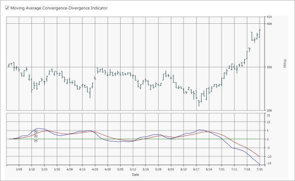 | markdownify }
{:.image }

Momentum

Momentum and rate of change (ROC) are simple technical analysis indicators showing the difference between today's closing price and the close N days ago.

_Momentum Properties_

<table>
<tr>
<td>
Property</td><td>
Description</td></tr>
<tr>
<td>
MomentumTimeSpan</td><td>
Measures the amount that a security's price has changed over a given time span.</td></tr>
</table>

[XAML]

&lt;sync:ChartSeries.Indicators&gt;

&lt;sync:IndicatorCollection&gt;

&lt;sync:IndicatorCollection.Items&gt;

&lt;sync:ChartTechnicalIndicator IndicatorType="Momentum" sync:ChartMomentum.MomentumTimeSpan="10" /&gt;     

&lt;/sync:IndicatorCollection.Items&gt;

&lt;/sync:IndicatorCollection&gt;

&lt;/sync:ChartSeries.Indicators&gt;

{  | markdownify }
{:.image }

Stochastic

The Stochastic Oscillator is a range bound momentum oscillator. The Stochastic indicator is designed to display the location of the close compared to the high or low range over a user-defined number of periods. Typically, the Stochastic Oscillator is used for three things: Identifying overbought and oversold levels, spotting divergences, and also identifying bull and bear set ups or signals.

_Stochastic Properties_

<table>
<tr>
<td>
Property</td><td>
Description</td></tr>
<tr>
<td>
SignalLineColor</td><td>
Specifies the color for the signal line of the Stochastic technical indicator.</td></tr>
<tr>
<td>
UpperLineColor</td><td>
Specifies the color for the upper line of the Stochastic technical indicator.</td></tr>
<tr>
<td>
LowerLineColor</td><td>
Specifies the color for the lower line of the Stochastic technical indicator.</td></tr>
</table>

[XAML]

&lt;sync:ChartSeries.Indicators&gt;

&lt;sync:IndicatorCollection&gt;

&lt;sync:IndicatorCollection.Items&gt;

&lt;sync:ChartTechnicalIndicator IndicatorType="Stochastics"  sync:ChartStochastics.LowerLineColor="Red" sync:ChartStochastics.SignalLineColor="Green" sync:ChartStochastics.UpperLineColor="Blue" /&gt;     

&lt;/sync:IndicatorCollection.Items&gt;

&lt;/sync:IndicatorCollection&gt;

&lt;/sync:ChartSeries.Indicators&gt;

{  | markdownify }
{:.image }

RSI

The Relative Strength Index (RSI) is a well-versed momentum-based oscillator which is used to measure the speed (velocity) as well as the change (magnitude) of directional price movements. Essentially RSI, when graphed, provides a visual mean to monitor both the current, as well as historical, strength and weakness of a particular market.

[XAML]

&lt;sync:ChartSeries.Indicators&gt;

&lt;sync:IndicatorCollection&gt;

&lt;sync:IndicatorCollection.Items&gt;

&lt;sync:ChartTechnicalIndicator IndicatorType="RelativeStrengthIndex" /&gt;     

&lt;/sync:IndicatorCollection.Items&gt;

&lt;/sync:IndicatorCollection&gt;

&lt;/sync:ChartSeries.Indicators&gt;

{  | markdownify }
{:.image }

##### Chart Types

###### Line Charts

Line Chart

Line Charts join points on a plot using straight lines showing trends in data at equal intervals. Line charts treats the input as non-numeric, categorical information, equally spaced along the x-axis. This is appropriate for categorical data, such as text labels, but can produce unexpected results when the x values consist of numbers.

When rendered in 3D the plot looks like a ribbon and hence such types are also referred to as Ribbon or Strip Charts.

The appearance of the lines and the points can be configured with options such as the colors used, thickness of the lines and the symbols displayed. 

{  | markdownify }
{:.image }

Data Requirements

The following are the details about Line Chart:

_Data Requirement_

<table>
<tr>
<td colspan = "2">
Details</td></tr>
<tr>
<td>
Number of y values per point</td><td>
one</td></tr>
<tr>
<td>
Number of points   </td><td>
one or more</td></tr>
<tr>
<td>
Number of series</td><td>
one or more</td></tr>
</table>
Template

While setting template the following parameters can be used.

_Template parameters_

<table>
<tr>
<td>
Name</td><td>
Type</td><td>
Description</td></tr>
<tr>
<td>
X1</td><td>
double</td><td>
x-coordinate of first point</td></tr>
<tr>
<td>
Y1</td><td>
double</td><td>
y-coordinate of first point</td></tr>
<tr>
<td>
X2</td><td>
double</td><td>
x-coordinate of second point</td></tr>
<tr>
<td>
Y2</td><td>
double</td><td>
y-coordinate of second point</td></tr>
<tr>
<td>
Interior</td><td>
Brush</td><td>
column color</td></tr>
<tr>
<td>
Series</td><td>
ChartSeries</td><td>
reference to series-owner</td></tr>
</table>
A sample which demonstrates Line Chart Types is available in the following sample installation path.

_..My Documents\Syncfusion\EssentialStudio\&lt;Version Number&gt;\WPF\Chart.WPF\Samples\3.5\WindowsSamples\Chart Gallery\Line Chart Demo_

See Also

Chart Types

Fast Line Chart

Use a Fast Line chart instead of a Line chart when displaying a large number of data points in the chart. This chart type improves performance by foregoing some features in the Line chart.

{  | markdownify }
{:.image }

Data Requirements

The following are the details about Fast Line Chart:

_Data Requirement_

<table>
<tr>
<td colspan = "2">
Details</td></tr>
<tr>
<td>
Number of y values per point</td><td>
One</td></tr>
<tr>
<td>
Number of points   </td><td>
one or more</td></tr>
<tr>
<td>
Number of series</td><td>
one or more</td></tr>
</table>
Template

While setting template the following parameters can be used:

_Template Parameter_

<table>
<tr>
<td>
Name</td><td>
Type</td><td>
Description</td></tr>
<tr>
<td>
X1</td><td>
Double</td><td>
x-coordinate of first point</td></tr>
<tr>
<td>
Y1</td><td>
Double</td><td>
y-coordinate of first point</td></tr>
<tr>
<td>
X2</td><td>
Double</td><td>
x-coordinate of second point</td></tr>
<tr>
<td>
Y2</td><td>
Double</td><td>
y-coordinate of second point</td></tr>
<tr>
<td>
Interior</td><td>
Brush</td><td>
column color</td></tr>
<tr>
<td>
Series</td><td>
ChartSeries</td><td>
reference to series-owner</td></tr>
</table>

A sample which demonstrates Line Chart Types is available in the following sample installation path.

_..My Documents\Syncfusion\EssentialStudio\&lt;Version Number&gt;\WPF\Chart.WPF\Samples\3.5\WindowsSamples\Chart Gallery\Line Chart Demo_

Customization of FastLine 

Essential Chart enables you to customize the look and feel of the Fastline chart. 

Following types of lines are supported for FastLine chart:

* Dash line
* Dot line
* Dash-dot line
* Dash-dot-dot line

Property

_Property Table_

<table>
<tr>
<td>
Property </td><td>
Description </td><td>
Type </td><td>
Data Type </td><td>
Reference links </td></tr>
<tr>
<td>
Pen</td><td>
Gets and sets various types of pen for drawing fastchat type. </td><td>
Attached property for ChartFastSeriesPresenter </td><td>
System.Drawing.Pen </td><td>
{ [Pen Class](http://msdn.microsoft.com/en-us/library/system.drawing.pen.aspx) | markdownify }</td></tr>
</table>
Customizing Fastline

To customize the FastLine chart, use the Pen property of ChartFastSeriesPresenter.

The following code illustrates this: 

[XAML]

&lt;syncfusion:ChartSeries Name="series" Type="FastLine" IsIndexed="True"  Interior="LightBlue" &gt;

                            &lt;syncfusion:ChartFastSeriesPresenter.Pen&gt;

                                &lt;Pen Brush="Black" DashCap="Round" DashStyle="DashDot" StartLineCap="Round" EndLineCap="Round"/&gt;

                            &lt;/syncfusion:ChartFastSeriesPresenter.Pen&gt;

                        &lt;/syncfusion:ChartSeries&gt;

{  | markdownify }
{:.image }

Sample Link

To view a sample

1. Open the Syncfusion Dashboard.
2. Select User Interface.
3. Click the WPF drop-down list and select Explore Samples.
4. Navigate to _Chart.WPF\Samples\3.5\WindowsSamples\Chart Customization\ FastLine Customization Demo\_

See Also

Chart Types

FastSpline Chart Series

FastSpline is used to render a large number of data points as a smooth line in a fast manner and helps in improving the performance of the chart. Its view is similar to the Line chart, but plots a fitted curve through each data point in series. FastSpline draws a smooth flowing line through all data points in the data set.

The appearance of the FastSpline can be configured with options such as interior, thickness of the Lines

Chart Type Characteristic

The following table lists the main characteristic of the FastSpline chart.

_Characteristics of FastSpline Chart_

<table>
<tr>
<td colspan = "2">
Details</td></tr>
<tr>
<td>
Number of Y values per point </td><td>
One.</td></tr>
<tr>
<td>
Number of Series          </td><td>
One or more.</td></tr>
<tr>
<td>
Cannot be Combined with    </td><td>
Pie, Bar, Stacked Bar, Polar, Radar.</td></tr>
</table>
The following screenshot depicts a FastSpline chart:

{ 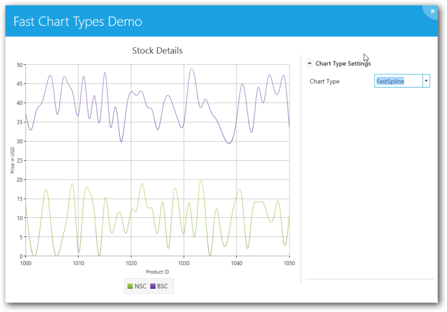 | markdownify }
{:.image }

Use Case Scenarios

FastSpline chart is useful in the following fields where high volume data is used.

* Marketing
* Scientific Research
* Economics

_Properties_

<table>
<tr>
<td>
Property</td><td>
Description</td></tr>
<tr>
<td>
Geometry</td><td>
Draws the spline when set to paths {{ '_Data_' | markdownify }} property.</td></tr>
</table>
Template for FastSpline

The following code example illustrates the template for the FastSpline chart:

[ASPX]

&lt;DataTemplate x:key="{x:Type local:ChartFastSplineSegment}"&gt;

&lt;Grid&gt; 

   &lt;Path Stroke="{Binding Interior}" StrokeThickness="{Binding    StrokeThickness}" Data="{Binding Geometry}" ToolTip="{Binding ToolTip}"/&gt;

&lt;local:FastSplinePresenter Points="{Binding Points}" Series="{Binding Series}" ToolTip="{Binding ToolTip}"&gt;

&lt;/Grid&gt;

&lt;/DataTemplate&gt;

Sample Link

A sample for FastSpline is placed in the following location:

[http://svn.syncfusion.com/svn/studio/Source/releaseprep/11.1.0.1/WPF/Chart.WPF/Samples/3.5/WindowsSamples/Fast Charts/Fast](http://svn.syncfusion.com/svn/studio/Source/releaseprep/11.1.0.1/WPF/Chart.WPF/Samples/3.5/WindowsSamples/Fast) Chart Types Demo

Adding FastSpline Chart to an Application 

To add FastSpline chart to an application do the following:

1. Create a new WPF application in VS2012.
2. Create a chart sample with ChartArea and ChartAxis.
3. To get the FastSpline chart, specify the Type property in ChartSeries as “FastSpline”.

Code Example

The following code example illustrates the usage of FastSpline charts.

[XAML]

&lt;sfchart:Chart&gt;

   &lt;sfchart:ChartArea Background="LightGray" GridBackground="White"&gt;

     &lt;sfchart:ChartSeries Template="{StaticResource Template1}"        DataSource="{Binding Source={StaticResource myXmlData},XPath=Products/Product}" BindingPathX="Month" BindingPathsY="Sales" Interior="Red"  Type="FastSpline"/&gt;

   &lt;/sfchart:ChartArea&gt;    

&lt;/sfchart:Chart&gt;

Spline Chart

Spline Chart is similar to a Line Chart except that it connects the different data points using splines instead of straight lines.

When rendered in 3D the plot looks like a ribbon and hence such types are also referred to as Ribbon or Strip Charts.

The appearance of the lines and the points can be configured with options such as the colors used, thickness of the lines and the symbols displayed. 

{  | markdownify }
{:.image }

Data Requirements

The following are the details about Spline Chart:

_Data Requirement_

<table>
<tr>
<td colspan = "2">
Details</td></tr>
<tr>
<td>
Number of y values per point</td><td>
one</td></tr>
<tr>
<td>
Number of points</td><td>
one or more</td></tr>
<tr>
<td>
Number of series</td><td>
one or more</td></tr>
</table>
Spline Settings

_Spline Setting_

<table>
<tr>
<td>
Name</td><td>
Type</td><td>
Container</td><td>
Description</td></tr>
<tr>
<td>
ChartSplineType.SplineCoefficient</td><td>
double</td><td>
ChartSeries</td><td>
attached property which lets you control the spline curvature</td></tr>
</table>
Template

While setting template the following parameters can be used.

_Template Parameter_

<table>
<tr>
<td>
Name</td><td>
Type</td><td>
Description</td></tr>
<tr>
<td>
X1</td><td>
double</td><td>
x-coordinate of first point</td></tr>
<tr>
<td>
Y1</td><td>
double</td><td>
y-coordinate of first point</td></tr>
<tr>
<td>
X2</td><td>
double</td><td>
x-coordinate of second point</td></tr>
<tr>
<td>
Y2</td><td>
double</td><td>
y-coordinate of second point</td></tr>
<tr>
<td>
Geometry</td><td>
Geometry</td><td>
segment geometry</td></tr>
<tr>
<td>
Interior</td><td>
Brush</td><td>
column color</td></tr>
<tr>
<td>
Series</td><td>
ChartSeries</td><td>
reference to series-owner</td></tr>
</table>
A sample which demonstrates Line Chart Types is available in the following sample installation path.

_..My Documents\Syncfusion\EssentialStudio\&lt;Version Number&gt;\WPF\Chart.WPF\Samples\3.5\WindowsSamples\Chart Gallery\Line Chart Demo_

See Also

Chart Types

Rotated Spline Chart

A Rotated Spline Chart is similar to a Spline Chart. The only difference is that it would be rotated. It plots one or several series of data and joins each series by smooth, rotated spline curves instead of straight lines.

The following image shows a sample Rotated Spline Chart.

{  | markdownify }
{:.image }

Data Requirements

The following are the details about Rotated Spline Chart:

_Data Requirement_

<table>
<tr>
<td colspan = "2">
Details</td></tr>
<tr>
<td>
Number of y values per point</td><td>
one</td></tr>
<tr>
<td>
Number of points</td><td>
one or more</td></tr>
<tr>
<td>
Number of series</td><td>
one or more</td></tr>
</table>
Rotated Spline Settings

_Rotated Spline Settings_

<table>
<tr>
<td>
Name</td><td>
Type</td><td>
Container</td><td>
Description</td></tr>
<tr>
<td>
ChartSplineType.SplineCoefficient</td><td>
double</td><td>
ChartSeries</td><td>
attached property which lets you control the spline curvature</td></tr>
</table>
A sample which demonstrates Line Chart Types is available in the following sample installation path.

_..My Documents\Syncfusion\EssentialStudio\&lt;Version Number&gt;\WPF\Chart.WPF\Samples\3.5\WindowsSamples\Chart Gallery\Line Chart Demo_

See Also

Chart Types

Step Line Chart

Step Line Charts use horizontal and vertical lines to connect data points resulting in a step like progression.

{  | markdownify }
{:.image }

Data Requirements

The following are the details about Step Line Chart:

_Data Requirement_

<table>
<tr>
<td colspan = "2">
Details</td></tr>
<tr>
<td>
Number of y values per point</td><td>
one</td></tr>
<tr>
<td>
Number of points</td><td>
one or more</td></tr>
<tr>
<td>
Number of series</td><td>
one or more</td></tr>
</table>
Template

While setting template the following parameters can be used:

_Template Parameter_

<table>
<tr>
<td>
Name</td><td>
Type</td><td>
Description</td></tr>
<tr>
<td>
X1</td><td>
double</td><td>
x-coordinate of first point</td></tr>
<tr>
<td>
Y1</td><td>
double</td><td>
y-coordinate of first point</td></tr>
<tr>
<td>
X2</td><td>
double</td><td>
x-coordinate of second point</td></tr>
<tr>
<td>
Y2</td><td>
double</td><td>
y-coordinate of second point</td></tr>
<tr>
<td>
StepX</td><td>
double</td><td>
x-coordinate of transient point</td></tr>
<tr>
<td>
StepY</td><td>
double</td><td>
y-coordinate of transient point</td></tr>
<tr>
<td>
Points</td><td>
PointCollection</td><td>
collection of  segment points</td></tr>
<tr>
<td>
Interior</td><td>
Brush</td><td>
column color</td></tr>
<tr>
<td>
Series</td><td>
ChartSeries</td><td>
reference to series-owner</td></tr>
</table>
A sample which demonstrates Line Chart Types is available in the following sample installation path.

_..My Documents\Syncfusion\EssentialStudio\&lt;Version Number&gt;\WPF\Chart.WPF\Samples\3.5\WindowsSamples\Chart Gallery\Line Chart Demo_

See Also

Chart Types

###### Bar Charts

Bar Chart

Bar Chart is the simplest and most versatile of statistical diagrams. It displays horizontal bars for each point in the series and points from adjacent series are drawn as bars next to each other. It is also available with a 3-D visual effect.

Bar Charts can be used to compare values across categories, for showing the variations in the value of an item over time or for showing the values of several items at a single point in time.

Another good reason to use bar charts is when you realize that the number of a data series fits better in a horizontal format. If you have long gaps between different values and you also have many items to compare, the bar chart type is the best one to use.  

The following image shows a multi series Bar Chart.

{  | markdownify }
{:.image }

Data Requirements

The following are the details about Bar Chart:

_Data Requirement_

<table>
<tr>
<td colspan = "2">
Details</td></tr>
<tr>
<td>
Number of y values per point</td><td>
one</td></tr>
<tr>
<td>
Number of points      </td><td>
one or more</td></tr>
<tr>
<td>
Number of series  </td><td>
one or more</td></tr>
</table>
Bar Chart Settings

_Bar Setting_

<table>
<tr>
<td>
Name</td><td>
Type</td><td>
Container</td><td>
Description</td></tr>
<tr>
<td>
ChartType.Spacing</td><td>
double</td><td>
ChartArea</td><td>
Attached property that specifies the space between columnsPossible values lie between 0 and 1. Default value is 0.2.</td></tr>
</table>
Template

While setting template the following parameters can be used.

_Template Parameter_

<table>
<tr>
<td>
Name</td><td>
Type</td><td>
Description</td></tr>
<tr>
<td>
X</td><td>
double</td><td>
x column coordinate</td></tr>
<tr>
<td>
Y</td><td>
double</td><td>
y column coordinate</td></tr>
<tr>
<td>
Width</td><td>
double</td><td>
column width</td></tr>
<tr>
<td>
Height</td><td>
double</td><td>
column height</td></tr>
<tr>
<td>
Interior</td><td>
Brush</td><td>
column color</td></tr>
<tr>
<td>
Series</td><td>
ChartSeries</td><td>
reference to series-owner</td></tr>
</table>
A sample which demonstrates Bar Chart Types is available in the following sample installation path.

_..My Documents\Syncfusion\EssentialStudio\&lt;Version Number&gt;\WPF\Chart.WPF\Samples\3.5\WindowsSamples\Chart Gallery\Bar Chart Demo_

See Also

Chart Types

FastBar ChartType	

FastBar Chart is similar to Bar chart as it uses horizontal bars to display different values of one or more items. It is inherited from FastColumn ChartType with rotated Series, to achieve better performance over Bar ChartType. 

It is used for comparing frequencies, counts, total and average of data in different categories. It is ideal for showing the variations in the value of an item over time.

The following points give the advantages of FastBar over Bar charts:

* They load faster than the Bar charts. 
* They ensure high performance for displaying data. 
* They can be used as real time charts to render a huge number of data points.

Use Case Scenarios

FastBar ChartType can be used in Stock Market where large amounts of data need to be rendered. It allows users to add large numbers of DataPoints thereby delivering a better performance.

Adding FastBar ChartType to an Application 

To add FastBar ChartType to the application:

1. Select FastBar from the enum of type ChartTypes. 
2. Assign it to the Type property in the ChartSeries. This can be added using xaml and also using C# code as given in the following code examples.

Code Table

[XAML]

          &lt;syncfusion:ChartSeries Type="FastBar"/&gt;      

[C#]

           Area1.Series[0].Type = ChartTypes.FastBar;

{  | markdownify }
{:.image }

Sample Link

To run the UI WPF sample

1. Open Essential Studio Dashboard by selecting Start -> Program -> Syncfusion-> Essential Studio &lt;&lt;Version Number&gt;> -> Dashboard.
2. Select Run Locally Installed Samples, from the WPF drop-down list on the User Interface pane.
3. Select Chart in the sample browser.
4. Select ChartPerformance->FastChartTypesDemo on the Essential Chart pane and click the Run Sample button.

To open the sample project

5. Go to the following sample location in your system:  

_“&lt;sample installation location&gt;\Syncfusion\EssentialStudio\Version Number \WPF\Chart.WPF\Samples\3.5\WindowsSamples\ChartPerformance\FastChartTypesDemo”_

6. This location contains two sub folders CS and VB.  You can open the sample projects from the respective folders based on your application development language.
Stacking Bar Chart

Stacking Bar Charts are similar to regular bar charts except that the Y values stack on top of each other in the specified series order. This helps visualize the relationship of parts to the whole.

The following image shows a sample Stacking Bar Chart.

{  | markdownify }
{:.image }

Data Requirements

The following are the details about Stacking Bar Chart:

_Data Requirement_

<table>
<tr>
<td colspan = "2">
Details</td></tr>
<tr>
<td>
Number of y values per point</td><td>
one</td></tr>
<tr>
<td>
Number of points      </td><td>
one or more</td></tr>
<tr>
<td>
Number of series   </td><td>
one or more</td></tr>
</table>
Stacking Bar Chart Properties

_Stacking Bar Chart_

<table>
<tr>
<td>
Name</td><td>
Type</td><td>
Container</td><td>
Description</td></tr>
<tr>
<td>
ChartType.Spacing</td><td>
double</td><td>
ChartArea</td><td>
Attached property that specifies the space between columnsPossible values lie between 0 and 1. Default value is 0.2.</td></tr>
</table>
Template

While setting template the following parameters can be used:

_Template Parameter_

<table>
<tr>
<td>
Name</td><td>
Type</td><td>
Description</td></tr>
<tr>
<td>
X</td><td>
double</td><td>
x column coordinate</td></tr>
<tr>
<td>
Y</td><td>
double</td><td>
y column coordinate</td></tr>
<tr>
<td>
Width</td><td>
double</td><td>
column width</td></tr>
<tr>
<td>
Height</td><td>
double</td><td>
column height</td></tr>
<tr>
<td>
Interior</td><td>
Brush</td><td>
column color</td></tr>
<tr>
<td>
IsUpper</td><td>
bool</td><td>
true – if this is upper column</td></tr>
<tr>
<td>
IsLower</td><td>
bool</td><td>
true – if this is lower column</td></tr>
<tr>
<td>
Series</td><td>
ChartSeries</td><td>
reference to series-owner</td></tr>
</table>
A sample which demonstrates Bar Chart Types is available in the following sample installation path.

_..My Documents\Syncfusion\EssentialStudio\&lt;Version Number&gt;\WPF\Chart.WPF\Samples\3.5\WindowsSamples\Chart Gallery\Bar Chart Demo_

See Also

Chart Types

Gantt Chart

Frequently used in project management, a Gantt chart provides a graphical illustration of a schedule to help plan, coordinate, and track specific tasks in a project.

{  | markdownify }
{:.image }

Data Requirements

The following are the details about Gantt Chart:

_Data Requirement_

<table>
<tr>
<td colspan = "2">
Details</td></tr>
<tr>
<td>
Number of y values per point</td><td>
two</td></tr>
<tr>
<td>
Number of points      </td><td>
one or more</td></tr>
<tr>
<td>
Number of series   </td><td>
one or more</td></tr>
</table>
Gantt Chart Settings

_Gantt Chart Setting_

<table>
<tr>
<td>
Name</td><td>
Type</td><td>
Container</td><td>
Description</td></tr>
<tr>
<td>
ChartType.Spacing</td><td>
double</td><td>
ChartArea</td><td>
attached property that specifies the space between columnsPossible values lie between 0 an 1. Default value is 0.2.</td></tr>
</table>
Template

While setting template the following parameters can be used.

_Template Parameter_

<table>
<tr>
<td>
Name</td><td>
Type</td><td>
Description</td></tr>
<tr>
<td>
X</td><td>
double</td><td>
x column coordinate</td></tr>
<tr>
<td>
Y</td><td>
double</td><td>
y column coordinate</td></tr>
<tr>
<td>
Width</td><td>
double</td><td>
column width</td></tr>
<tr>
<td>
Height</td><td>
double</td><td>
column height</td></tr>
<tr>
<td>
Interior</td><td>
Brush</td><td>
column color</td></tr>
<tr>
<td>
Series</td><td>
ChartSeries</td><td>
reference to series-owner</td></tr>
</table>
A sample which demonstrates Gantt Chart Type is available in the following sample installation path.

_..My Documents\Syncfusion\EssentialStudio\&lt;Version Number&gt;\WPF\Chart.WPF\Samples\3.5\WindowsSamples\Chart Gallery\Gantt Chart Demo_

See Also

Chart Types

Tornado Chart

The Tornado chart is a bar chart which shows the variability of an output to several different inputs. Variability is displayed using relative lengths of bars across a range. It is mainly used in sensitivity analysis. It shows how different random factors can influence the prognostic outcome.

{  | markdownify }
{:.image }

Data Requirements

The following are the details about Tornado Chart:

_Data Requirement_

<table>
<tr>
<td colspan = "2">
Details</td></tr>
<tr>
<td>
Number of y values per point</td><td>
two</td></tr>
<tr>
<td>
Number of points   </td><td>
one or more</td></tr>
<tr>
<td>
Number of series</td><td>
one or more</td></tr>
</table>
Tornado Settings

_Table_ _55__: Tornado Setting_

<table>
<tr>
<td>
Name</td><td>
Type</td><td>
Container</td><td>
Description</td></tr>
<tr>
<td>
ChartType.Spacing</td><td>
double</td><td>
ChartArea</td><td>
attached property that specifies the space between columnsPossible values lie between 0 and 1. Default value is 0.2.</td></tr>
</table>
Template

While setting template the following parameters can be used:

_Template Parameter_

<table>
<tr>
<td>
Name</td><td>
Type</td><td>
Description</td></tr>
<tr>
<td>
X</td><td>
double</td><td>
x column coordinate</td></tr>
<tr>
<td>
Y</td><td>
double</td><td>
y column coordinate</td></tr>
<tr>
<td>
Width</td><td>
double</td><td>
column width</td></tr>
<tr>
<td>
Height</td><td>
double</td><td>
column height</td></tr>
<tr>
<td>
Interior</td><td>
Brush</td><td>
column color</td></tr>
<tr>
<td>
Series</td><td>
ChartSeries</td><td>
reference to series-owner</td></tr>
</table>
A sample which demonstrates Tornado Chart Type is available in the following sample installation path.

_..My Documents\Syncfusion\EssentialStudio\&lt;Version Number&gt;\WPF\Chart.WPF\Samples\3.5\WindowsSamples\Chart Gallery\Tornado Chart Demo_

See Also

Chart Types

Stacked Bar 100 Chart

In the 100 percent Stacked Bar Chart, the cumulative proportion of each stacked element always totals 100 percent. This type of chart is great to visualize the relative contribution of each series values to the whole.

The following image shows a sample Stacking Bar 100 Chart.

{ 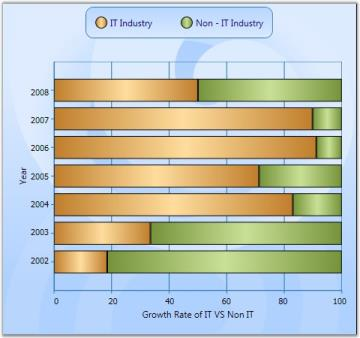 | markdownify }
{:.image }

Data Requirements

The following are the details about Stacking Bar 100 Chart:

_Data Requirement_

<table>
<tr>
<td colspan = "2">
Details</td></tr>
<tr>
<td>
Number of y values per point</td><td>
one</td></tr>
<tr>
<td>
Number of points   </td><td>
one or more</td></tr>
<tr>
<td>
Number of series</td><td>
one or more</td></tr>
</table>
A sample which demonstrates Bar Chart Types is available in the following sample installation path.

_..My Documents\Syncfusion\EssentialStudio\&lt;Version Number&gt;\WPF\Chart.WPF\Samples\3.5\WindowsSamples\Chart Gallery\Bar Chart Demo_

See Also

Chart Types

###### Column Charts

Column Chart

Column Charts are among the most common chart types that are being used. It uses vertical bars (called columns) to display different values of one or more items. It is similar to a bar chart except that here the bars are vertical and not horizontal. Points from adjacent series are drawn as bars next to each other.  

It is used for comparing the frequency, count, total or average of data in different categories. It is ideal for showing the variations in the value of an item over time.

The following image shows a multi series Column Chart.

{  | markdownify }
{:.image }

Data Requirements

_Data Requirement_

<table>
<tr>
<td colspan = "2">
Details</td></tr>
<tr>
<td>
Number of y values per point</td><td>
one</td></tr>
<tr>
<td>
Number of points      </td><td>
one or more</td></tr>
<tr>
<td>
Number of series   </td><td>
one or more</td></tr>
</table>
Custom Properties

_Custom Property_

<table>
<tr>
<td>
Name</td><td>
Type</td><td>
Container</td><td>
Description</td></tr>
<tr>
<td>
ChartType.Spacing</td><td>
double</td><td>
ChartArea</td><td>
sets the interval between columnsPossible values lie between 0 and 1.</td></tr>
</table>
Template

While setting template the following parameters can be used:

_Template Parameter_

<table>
<tr>
<td>
Name</td><td>
Type</td><td>
Description</td></tr>
<tr>
<td>
X</td><td>
double</td><td>
x column coordinate</td></tr>
<tr>
<td>
Y</td><td>
double</td><td>
y column coordinate</td></tr>
<tr>
<td>
Width</td><td>
double</td><td>
column width</td></tr>
<tr>
<td>
Height</td><td>
double</td><td>
column height</td></tr>
<tr>
<td>
Interior</td><td>
Brush</td><td>
column color</td></tr>
<tr>
<td>
Series</td><td>
ChartSeries</td><td>
reference to series-owner</td></tr>
</table>
A sample which demonstrates Column Chart Types is available in the following sample installation path.

_..My Documents\Syncfusion\EssentialStudio\&lt;Version Number&gt;\WPF\Chart.WPF\Samples\3.5\WindowsSamples\Chart Gallery\Column Chart Demo_

See Also

Chart Types

Column Range Chart

Column Range Chart is similar to the Column Chart except that each column is rendered over a range. Therefore the user must specify the y-axis Starting and Ending values for each point. 

The following figure shows a Column Range Chart.

{  | markdownify }
{:.image }

Data Requirements

_Data Requirement_

<table>
<tr>
<td colspan = "2">
Details</td></tr>
<tr>
<td>
Number of y values per point</td><td>
two</td></tr>
<tr>
<td>
Number of points      </td><td>
one or more</td></tr>
<tr>
<td>
Number of series</td><td>
one or more</td></tr>
</table>
Custom Properties

_Custom Property_

<table>
<tr>
<td>
Name</td><td>
Type</td><td>
Container</td><td>
Description</td></tr>
<tr>
<td>
ChartType.Spacing</td><td>
double</td><td>
ChartArea</td><td>
sets the interval between columnsPossible values lie between 0 and 1.</td></tr>
</table>
Template

While setting template the following parameters can be used:

_Template Parameter_

<table>
<tr>
<td>
Name</td><td>
Type</td><td>
Description</td></tr>
<tr>
<td>
X</td><td>
double</td><td>
x column coordinate</td></tr>
<tr>
<td>
Y</td><td>
double</td><td>
y column coordinate</td></tr>
<tr>
<td>
Width</td><td>
double</td><td>
column width</td></tr>
<tr>
<td>
Height</td><td>
double</td><td>
column height</td></tr>
<tr>
<td>
Interior</td><td>
Brush</td><td>
column color</td></tr>
<tr>
<td>
Series</td><td>
ChartSeries</td><td>
reference to series-owner</td></tr>
</table>
A sample which demonstrates Column Chart Types is available in the following sample installation path.

_..My Documents\Syncfusion\EssentialStudio\&lt;Version Number&gt;\WPF\Chart.WPF\Samples\3.5\WindowsSamples\Chart Gallery\Column Chart Demo_

See Also

Chart Types

Stacking Column Chart

Stacking Column Charts are similar to regular column charts except that the Y values stack on top of each other in the specified series order. This helps visualize the relationship of parts to the whole.

The following image shows a sample Stacking Column Chart.

{  | markdownify }
{:.image }

Data Requirements

_Data Requirement_

<table>
<tr>
<td colspan = "2">
Details</td></tr>
<tr>
<td>
Number of y values per point</td><td>
one</td></tr>
<tr>
<td>
Number of points    </td><td>
one or more</td></tr>
<tr>
<td>
Number of series</td><td>
one or more</td></tr>
</table>
Custom StackingColumn100 Properties

_Custom Stacking Column 100 Property_

<table>
<tr>
<td>
Name</td><td>
Type</td><td>
Container</td><td>
Description</td></tr>
<tr>
<td>
ChartStackingColumn100Type.ShowValueAsProbability</td><td>
bool</td><td>
ChartArea</td><td>
y-axis range is set between 0 and 100If true, the y-axis range is set between 0 and 1. Default value is {{ '_false_' | markdownify }}.</td></tr>
</table>
Template

While setting template, the following parameters can be used.

_Template Parameter_

<table>
<tr>
<td>
Name</td><td>
Type</td><td>
Description</td></tr>
<tr>
<td>
X</td><td>
double</td><td>
x column coordinate</td></tr>
<tr>
<td>
Y</td><td>
double</td><td>
y column coordinate</td></tr>
<tr>
<td>
Width</td><td>
double</td><td>
column width</td></tr>
<tr>
<td>
Height</td><td>
double</td><td>
column height</td></tr>
<tr>
<td>
Interior</td><td>
Brush</td><td>
column color</td></tr>
<tr>
<td>
IsUpper</td><td>
bool</td><td>
true – if this is upper column</td></tr>
<tr>
<td>
IsLower</td><td>
bool</td><td>
true – if this is lower column</td></tr>
<tr>
<td>
Series</td><td>
ChartSeries</td><td>
reference to series-owner</td></tr>
</table>
Stacking Negative Series

When negative values are added, Stacking Column chart can be made to be stacked separately in the chart area, above and below the y-axis 0.

Following code is used to do this.

[C#]

ChartStackingColumnType.SetRequiresNegativeSeriesStack(this.chartArea2, true);

A sample which demonstrates Column Chart Types is available in the following sample installation path.

_..My Documents\Syncfusion\EssentialStudio\&lt;Version Number&gt;\WPF\Chart.WPF\Samples\3.5\WindowsSamples\Chart Gallery\Column Chart Demo_

See Also

Chart Types

Stacking Column 100 Chart

In the 100 % Stacked Column Chart, the cumulative proportion of each stacked element always totals 100%. This type of chart is great to visualize the relative contribution of each series values to the whole.

The following image shows a sample Stacking Column 100 Chart.

{ 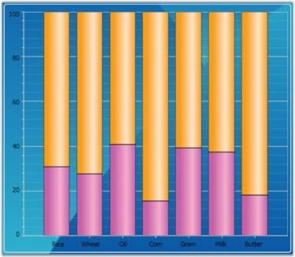 | markdownify }
{:.image }

Data Requirements

_Data Requirement_

<table>
<tr>
<td colspan = "2">
Details</td></tr>
<tr>
<td>
Number of y values per point</td><td>
one</td></tr>
<tr>
<td>
Number of points    </td><td>
one or more</td></tr>
<tr>
<td>
Number of series</td><td>
one or more</td></tr>
</table>
Spline Settings

_Spline Setting_

<table>
<tr>
<td>
Name</td><td>
Type</td><td>
Container</td><td>
Description</td></tr>
<tr>
<td>
ChartStackingColumn100.ShowValueAsProbability</td><td>
bool</td><td>
ChartArea</td><td>
y-axis range is set from 0 - 100If true, y-axis range is set from 0 - 1. Default value is {{ '_false_' | markdownify }}.</td></tr>
</table>
Template

While setting template, the following parameters can be used.

_Template parameters_

<table>
<tr>
<td>
Name</td><td>
Type</td><td>
Description</td></tr>
<tr>
<td>
X</td><td>
double</td><td>
x column coordinate</td></tr>
<tr>
<td>
Y</td><td>
double</td><td>
y column coordinate</td></tr>
<tr>
<td>
Width</td><td>
double</td><td>
column width</td></tr>
<tr>
<td>
Height</td><td>
double</td><td>
column height</td></tr>
<tr>
<td>
Interior</td><td>
Brush</td><td>
column color</td></tr>
<tr>
<td>
IsUpper</td><td>
bool</td><td>
{{ '_true_' | markdownify }} – if this is upper column</td></tr>
<tr>
<td>
IsLower</td><td>
bool</td><td>
{{ '_true_' | markdownify }} – if this is lower column</td></tr>
<tr>
<td>
Percentage</td><td>
double</td><td>
indicates the percentage this point takes up</td></tr>
<tr>
<td>
Series</td><td>
ChartSeries</td><td>
reference to series-owner</td></tr>
</table>
A sample which demonstrates Column Chart Types is available in the following sample installation path.

_..My Documents\Syncfusion\EssentialStudio\&lt;Version Number&gt;\WPF\Chart.WPF\Samples\3.5\WindowsSamples\Chart Gallery\Column Chart Demo_

See Also

Chart Types

Histogram Chart

Histogram is a bar (column) chart of a frequency distribution in which the widths of the bars are proportional to the classes into which the variable has been divided and the heights of the bars are proportional to the class frequencies. The categories are usually specified as non overlapping intervals of some variable. The categories (bars) must be adjacent. In addition, the chart has the capability to draw a normal distribution curve.

Histograms are useful data summaries that convey the following information:

* The general shape of the frequency distribution. (normal, exponential, etc.)
* Symmetry of the distribution and whether it is skewed.
* Modality - unimodal, bimodal or multimodal. 

The shape of the distribution conveys important information such as the probability distribution of the data.

{  | markdownify }
{:.image }

Data Requirements

_Data Requirement_

<table>
<tr>
<td colspan = "2">
Details</td></tr>
<tr>
<td>
Number of y values per point</td><td>
one</td></tr>
<tr>
<td>
Number of points</td><td>
one or more</td></tr>
<tr>
<td>
Number of series</td><td>
one or more</td></tr>
</table>
Histogram Settings

_Histogram Setting_

<table>
<tr>
<td>
Name</td><td>
Type</td><td>
Container</td><td>
Description</td></tr>
<tr>
<td>
ChartHistogramType.IntervalOfHistogram</td><td>
double</td><td>
ChartArea</td><td>
attached property that specifies the Interval which leads for one column</td></tr>
<tr>
<td>
ChartHistogramType.DrawNormalDistribution</td><td>
bool</td><td>
ChartSeries</td><td>
specifies whether to draw Normal Distribution Line</td></tr>
</table>
Template

While setting template the following parameters can be used:

_Template Parameter_

<table>
<tr>
<td>
Name</td><td>
Type</td><td>
Description</td></tr>
<tr>
<td>
X</td><td>
double</td><td>
x column coordinate</td></tr>
<tr>
<td>
Y</td><td>
double</td><td>
y column coordinate</td></tr>
<tr>
<td>
Width</td><td>
double</td><td>
column width</td></tr>
<tr>
<td>
Height</td><td>
double</td><td>
column height</td></tr>
<tr>
<td>
Interior</td><td>
Brush</td><td>
column color</td></tr>
<tr>
<td>
Series</td><td>
ChartSeries</td><td>
reference to series-owner</td></tr>
</table>
See Also

Chart Types

Fast Column Chart

Fast Column Chart is similar to Column chart as it uses vertical bars (called columns) to display different values of one or more items. Points from adjacent series are drawn as bars next to each other.  

It is used for comparing the frequency, count, total or average of data in different categories. It is ideal for showing the variations in the value of an item over time.

The following points mark the advantages of Fast Column over Column charts:

* The Fast Column charts are rendered using drawing visuals. 
* They load faster than the Column charts. 
* They ensure high performance for displaying data. 
* They can be used as real time charts to render huge number of data points.

The Chart type Fast Column is added in the Enum of type ChartTypes.

{  | markdownify }
{:.image }

_Fast Column Chart_

Data Requirements

_Data Requirement_

<table>
<tr>
<td colspan = "2">
Details</td></tr>
<tr>
<td>
Number of y values per point</td><td>
one</td></tr>
<tr>
<td>
Number of points      </td><td>
one or more</td></tr>
<tr>
<td>
Number of series   </td><td>
one or more</td></tr>
</table>
Custom Properties

_Custom Property_

<table>
<tr>
<td>
Name</td><td>
Type</td><td>
Container</td><td>
Description</td></tr>
<tr>
<td>
ChartType.Spacing</td><td>
double</td><td>
ChartArea</td><td>
sets the interval between columnsPossible values lie between 0 and 1.</td></tr>
</table>
Template

While setting template the following parameters can be used: 

_Template Parameter_

<table>
<tr>
<td>
Name</td><td>
Type</td><td>
Description</td></tr>
<tr>
<td>
X</td><td>
double</td><td>
x column coordinate</td></tr>
<tr>
<td>
Y</td><td>
double</td><td>
y column coordinate</td></tr>
<tr>
<td>
Width</td><td>
double</td><td>
column width</td></tr>
<tr>
<td>
Height</td><td>
double</td><td>
column height</td></tr>
<tr>
<td>
Interior</td><td>
Brush</td><td>
column color</td></tr>
<tr>
<td>
Series</td><td>
ChartSeries</td><td>
reference to series-owner</td></tr>
</table>
A sample which demonstrates Fast Column Chart Type is available in the following sample installation path.

_..My Documents\Syncfusion\Essential Studio\&lt;Version Number&gt;\WPF\Chart.WPF\Samples\3.5\WindowsSamples\Chart Performance-> Fast chart types_

The following code example illustrate the usage of Fast Column charts.

[XAML]

&lt;syncfusion:ChartSeries Type="FastColumn" Name="series1" Stroke="Black" DataSource="{Binding}"/&gt;

[C#]

ChartSeries series = new ChartSeries();

series.Type = ChartTypes.FastColumn;

Run the sample. 

A Fast Column chart is displayed pertaining to the data source it is bound to.

{  | markdownify }
{:.image }

See Also

Chart Types

###### Area Charts

Area Chart

The Area Chart connects the Y-points using straight lines and forms an area covered by the above lines and X-axis. This area is then shaded with a specified color or gradient. 

Multiple series can be plotted on the same chart and alpha-blended interior color can be used on the exterior chart to make the interior chart show through.

The following image shows a multi series Area Chart.

{  | markdownify }
{:.image }

Data Requirements

_Data Requirements_

<table>
<tr>
<td colspan = "2">
Details</td></tr>
<tr>
<td>
Number of y values per point</td><td>
one</td></tr>
<tr>
<td>
Number of points     </td><td>
two or more</td></tr>
<tr>
<td>
Number of series   </td><td>
one or more</td></tr>
</table>
Template

The following parameters can be used while specifying template.

_Template Parameter_

<table>
<tr>
<td>
Name</td><td>
Type</td><td>
Description</td></tr>
<tr>
<td>
X1</td><td>
double</td><td>
x-coordinate of first point</td></tr>
<tr>
<td>
Y1</td><td>
double</td><td>
y-coordinate of first point</td></tr>
<tr>
<td>
X2</td><td>
double</td><td>
x-coordinate of second point</td></tr>
<tr>
<td>
Y2</td><td>
double</td><td>
y-coordinate of second point</td></tr>
<tr>
<td>
IsStartSegment</td><td>
bool</td><td>
{{ '_true_' | markdownify }} - if this is start segment</td></tr>
<tr>
<td>
IsEndSegment</td><td>
bool</td><td>
{{ '_true_' | markdownify }} - if this is end segment</td></tr>
<tr>
<td>
Geometry</td><td>
Geometry</td><td>
segment geometry</td></tr>
<tr>
<td>
Interior</td><td>
Brush</td><td>
column color</td></tr>
<tr>
<td>
Series</td><td>
ChartSeries</td><td>
reference to series-owner</td></tr>
</table>
A sample which demonstrates Area Chart Types is available in the following sample installation path.

_..My Documents\Syncfusion\EssentialStudio\&lt;Version Number&gt;\WPF\Chart.WPF\Samples\3.5\WindowsSamples\Chart Gallery\Area Chart Demo_

See Also

Chart Types

Spline Area Chart

Spline Area Chart is similar to an Area Chart with the only difference being the way in which the points of a series are connected. It connects each series of points by a smooth spline curve. 

Multiple series can be plotted on the same chart and alpha-blended interior color can be used on the exterior chart to make the interior chart(s) show through.

The following image shows a multi series Spline Area Chart. 

{  | markdownify }
{:.image }

Data Requirements

_Data Requirement_

<table>
<tr>
<td colspan = "2">
Details</td></tr>
<tr>
<td>
Number of y values per point</td><td>
one</td></tr>
<tr>
<td>
Number of points      </td><td>
one or more</td></tr>
<tr>
<td>
Number of series   </td><td>
one or more</td></tr>
</table>
SplineArea Properties

_Spline Area Property_

<table>
<tr>
<td>
Name</td><td>
Type</td><td>
Container</td><td>
Description</td></tr>
<tr>
<td>
ChartSplineType.SplineCoefficient</td><td>
double</td><td>
ChartSeries</td><td>
responsible for spline curvature</td></tr>
</table>
Template

While setting template the following parameters can be used:

_Template Parameter_

<table>
<tr>
<td>
Name</td><td>
Type</td><td>
Description</td></tr>
<tr>
<td>
X1</td><td>
double</td><td>
x-coordinate of first point</td></tr>
<tr>
<td>
Y1</td><td>
double</td><td>
y-coordinate of first point</td></tr>
<tr>
<td>
X2</td><td>
double</td><td>
x-coordinate of second point</td></tr>
<tr>
<td>
Y2</td><td>
double</td><td>
y-coordinate of second point</td></tr>
<tr>
<td>
IsStartSegment</td><td>
bool</td><td>
{{ '_true_' | markdownify }} - if this is start segment</td></tr>
<tr>
<td>
IsEndSegment</td><td>
bool</td><td>
{{ '_true_' | markdownify }} - if this is end segment</td></tr>
<tr>
<td>
Geometry</td><td>
Geometry</td><td>
segment geometry</td></tr>
<tr>
<td>
Interior</td><td>
Brush</td><td>
column color</td></tr>
<tr>
<td>
Series</td><td>
ChartSeries</td><td>
reference to series-owner</td></tr>
</table>
A sample which demonstrates Area Chart Types is available in the following sample installation path.

_..My Documents\Syncfusion\EssentialStudio\&lt;Version Number&gt;\WPF\Chart.WPF\Samples\3.5\WindowsSamples\Chart Gallery\Area Chart Demo_

See Also

Chart Types

Stacking Area Chart

Stacking Area Charts are similar to regular area charts except that the Y values stack on top of each other in the specified series order. This helps visualize the relationship of parts to the whole.

The following image shows a sample Stacking Area Chart.

{  | markdownify }
{:.image }

Data Requirements

_Data Requirement_

<table>
<tr>
<td colspan = "2">
Details</td></tr>
<tr>
<td>
Number of Y values per point:</td><td>
one</td></tr>
<tr>
<td>
Number of points:      </td><td>
one or more</td></tr>
<tr>
<td>
Number of series:   </td><td>
one or more</td></tr>
</table>
Template

While setting template the following parameters can be used.

_Template Parameters_

<table>
<tr>
<td>
Name</td><td>
Type</td><td>
Description</td></tr>
<tr>
<td>
X1</td><td>
double</td><td>
x-coordinate of first point</td></tr>
<tr>
<td>
Y1</td><td>
double</td><td>
y-coordinate of first point</td></tr>
<tr>
<td>
X2</td><td>
double</td><td>
x-coordinate of second point</td></tr>
<tr>
<td>
Y2</td><td>
double</td><td>
y-coordinate of second point</td></tr>
<tr>
<td>
IsStartSegment</td><td>
bool</td><td>
{{ '_true_' | markdownify }} - if this is start segment</td></tr>
<tr>
<td>
IsEndSegment</td><td>
bool</td><td>
{{ '_true_' | markdownify }} - if this is end segment</td></tr>
<tr>
<td>
Geometry</td><td>
Geometry</td><td>
segment geometry</td></tr>
<tr>
<td>
IsUpper</td><td>
bool</td><td>
{{ '_true_' | markdownify }} – if this is upper segment</td></tr>
<tr>
<td>
IsLower</td><td>
bool</td><td>
{{ '_true_' | markdownify }} – if this is lower segment</td></tr>
<tr>
<td>
Interior</td><td>
Brush</td><td>
column color</td></tr>
<tr>
<td>
Series</td><td>
ChartSeries</td><td>
reference to series-owner</td></tr>
</table>
Stacking Negative Series

When negative values are added, Stacking Area chart can be made to be stacked separately in the chart area, above and below the x- axis 0.

[C#]

ChartStackingAreaType.SetRequiresNegativeSeriesStack(this.chartArea1, true);

A sample which demonstrates Area Chart Types is available in the following sample installation path.

_..My Documents\Syncfusion\EssentialStudio\&lt;Version Number&gt;\WPF\Chart.WPF\Samples\3.5\WindowsSamples\Chart Gallery\Area Chart Demo_

See Also

Chart Types

StackingArea100 Chart

100% stacked area charts are similar to regular area charts except that the y values stack to 100% on top of each other in the specified series order. In the 100% stacked area charts, the cumulative proportion of each stacked element always totals 100%. This type of chart is great to visualize the relative contribution of each series’ values to the whole.

{  | markdownify }
{:.image }

Sample Link

A sample that demonstrates the StackingArea100 chart type is available in the following sample installation path:

..MyDocuments\Syncfusion\EssentialStudio\&lt;Version Number&gt;\WPF\Chart.WPF\Samples\3.5\WindowsSamples\Basic Charts\StackingArea100 Chart Demo

Adding StackingArea100 Chart to Chart Area

The StackingArea100 chart type can be added into a chart area through the following code example:

[XAML]

  &lt;syncfusion:Chart&gt;

            &lt;syncfusion:ChartArea&gt;

                &lt;syncfusion:ChartSeries Data="10,10,20,20,30,30" Type="StackingArea100"/&gt;

                &lt;syncfusion:ChartSeries Data="20,20,30,30,40,40" Type="StackingArea100"/&gt;

            &lt;/syncfusion:ChartArea&gt;

  &lt;/syncfusion:Chart&gt;

_Table_ _83__: Data Requirement Table_

<table>
<tr>
<td colspan = "2">
Data Requirement Details</td></tr>
<tr>
<td>
Number of Y values per point</td><td>
One</td></tr>
<tr>
<td>
Number of points</td><td>
One or more</td></tr>
<tr>
<td>
Number of Series</td><td>
One or more</td></tr>
</table>
Overriding Data Template for Chart Series

The data template for a 100% stacked area chart can be overridden by changing the default template as shown in the following code example.

[XAML: Default Template]

  &lt;DataTemplate x:Key="{x:Type local:ChartStackingArea100Segment}"&gt;

    &lt;Path Stroke="{Binding Stroke}" StrokeThickness="{Binding StrokeThickness}" Fill="{Binding Interior}"  Data="{Binding Geometry}" ToolTip="{Binding ToolTip}"/&gt;

  &lt;/DataTemplate&gt;

[Custom Template]

&lt;DataTemplate x:Key="customTemplate"&gt;

    &lt;Path Stroke="{Binding Stroke}" StrokeThickness="4" Fill="Red"  Data="{Binding Geometry}"/&gt;

  &lt;/DataTemplate&gt;

[Apply Template]

&lt;syncfusion:Chart&gt;

 &lt;syncfusion:ChartArea&gt;

      &lt;syncfusion:ChartSeries Template="{StaticResource customTemplate}" Data="10,10,20,20,30,30" Type="StackingArea100"/&gt;

      &lt;syncfusion:ChartSeries Data="20,20,30,30,40,40" Type="StackingArea100"/&gt;

 &lt;/syncfusion:ChartArea&gt;

&lt;/syncfusion:Chart&gt;

When setting template, the following parameters can be used:

_Parameters for setting the Template_

<table>
<tr>
<td>
Name</td><td>
Type</td><td>
Description</td></tr>
<tr>
<td>
Geometry</td><td>
Geometry</td><td>
Segment geometry</td></tr>
<tr>
<td>
Stroke</td><td>
Brush</td><td>
Segment stroke</td></tr>
<tr>
<td>
StrokeThickness</td><td>
Thickness</td><td>
Segment stroke thickness</td></tr>
<tr>
<td>
Interior</td><td>
Brush</td><td>
Segment color</td></tr>
<tr>
<td>
Series</td><td>
ChartSeries</td><td>
Reference to series owner</td></tr>
</table>
StepArea Chart

Step Area Charts are similar to regular area charts except that instead of a straight line tracing the shortest path between points, the values are connected by continuous vertical and horizontal lines forming a step-like progression. Also, step area charts contain only one segment for each series.

{  | markdownify }
{:.image }

Data Requirements

_Data Requitement_

<table>
<tr>
<td colspan = "2">
Details</td></tr>
<tr>
<td>
Number of y values per point</td><td>
one</td></tr>
<tr>
<td>
Number of points      </td><td>
one or more</td></tr>
<tr>
<td>
Number of series   </td><td>
one or more</td></tr>
</table>
Template

While setting template the following parameters can be used.

_Template Parameter_

<table>
<tr>
<td>
Name</td><td>
Type</td><td>
Description</td></tr>
<tr>
<td>
X1</td><td>
double</td><td>
x-coordinate of first point</td></tr>
<tr>
<td>
Y1</td><td>
double</td><td>
y-coordinate of first point</td></tr>
<tr>
<td>
X2</td><td>
double</td><td>
x-coordinate of second point</td></tr>
<tr>
<td>
Y2</td><td>
double</td><td>
y-coordinate of second point</td></tr>
<tr>
<td>
StepX</td><td>
double</td><td>
x-coordinate of transient point</td></tr>
<tr>
<td>
StepY</td><td>
double</td><td>
y-coordinate of transient point</td></tr>
<tr>
<td>
Geometry</td><td>
Geometry</td><td>
segment geometry</td></tr>
<tr>
<td>
IsStartSegment</td><td>
bool</td><td>
{{ '_true_' | markdownify }} - if this is start segment</td></tr>
<tr>
<td>
IsEndSegment</td><td>
bool</td><td>
{{ '_true_' | markdownify }} - if this is end segment</td></tr>
<tr>
<td>
Interior</td><td>
Brush</td><td>
column color</td></tr>
<tr>
<td>
Series</td><td>
ChartSeries</td><td>
reference to series-owner</td></tr>
</table>
A sample which demonstrates Area Chart Types is available in the following sample installation path.

_..My Documents\Syncfusion\EssentialStudio\&lt;Version Number&gt;\WPF\Chart.WPF\Samples\3.5\WindowsSamples\Chart Gallery\Area Chart Demo_

See Also

Chart Types

Range Area Chart

Range Area Chart is a variation of Area Chart type that lets you plot bands of data in a chart, like Bollinger bands, weather patterns, etc. Each point in the chart is specified by 2 Y values – the lower and higher end of the band. 

{  | markdownify }
{:.image }

Data Requirements

_Data Requirement_

<table>
<tr>
<td colspan = "2">
Details</td></tr>
<tr>
<td>
Number of y values per point</td><td>
two</td></tr>
<tr>
<td>
Number of points      </td><td>
one or more</td></tr>
<tr>
<td>
Number of series</td><td>
one or more</td></tr>
</table>
Custom Properties

 _Custom Property_

<table>
<tr>
<td>
Name</td><td>
Type</td><td>
Container</td><td>
Description</td></tr>
<tr>
<td>
ChartRangeAreaType.HighValueInterior</td><td>
Brush</td><td>
ChartSeries</td><td>
specifies the brush that should be used for the segment where the 2nd y value is greater than the 1st y value</td></tr>
<tr>
<td>
ChartRangeAreaType.LowValueInterior</td><td>
Brush</td><td>
ChartSeries</td><td>
specifies the brush that should be used for the segment where the 1st  y value is greater than the 2nd y value</td></tr>
</table>
Template

The following parameters can be used while specifying template.

_Template Parameter_

<table>
<tr>
<td>
Name</td><td>
Type</td><td>
Description</td></tr>
<tr>
<td>
IsHighLow</td><td>
bool</td><td>
{{ '_true_' | markdownify }} - if this segment is for a "high" area</td></tr>
<tr>
<td>
Geometry</td><td>
Geometry</td><td>
segment geometry</td></tr>
<tr>
<td>
FillBrush</td><td>
Brush</td><td>
interior for this segment</td></tr>
<tr>
<td>
Series</td><td>
ChartSeries</td><td>
reference to series-owner</td></tr>
</table>
A sample which demonstrates Range Area Chart Type is available in the following sample installation path.

_..My Documents\Syncfusion\EssentialStudio\&lt;Version Number&gt;\WPF\Chart.WPF\Samples\3.5\WindowsSamples\Chart Gallery\Range-Area Chart Demo_

See Also

Chart Types

###### Accumulation Charts

Funnel Chart

The Funnel chart is a single series chart representing the data as portions of 100%, and this chart does not use any axes. Funnel chart can be viewed as 2D or 3D.

Funnel charts are often used to represent stages in a sales process and show the amount of potential revenue for each stage. This type of chart can be useful also in identifying potential problem areas in an organization's sales processes, for example. A funnel chart is similar to a stacked percent bar chart.

{ 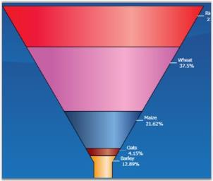 | markdownify }
{:.image }

Data Requirements

_Data Requirement_

<table>
<tr>
<td colspan = "2">
Details</td></tr>
<tr>
<td>
Number of y values per point</td><td>
one</td></tr>
<tr>
<td>
Number of points     </td><td>
one or more</td></tr>
<tr>
<td>
Number of series   </td><td>
one or more</td></tr>
</table>
FunnelType Properties

_FunnelType Property_

<table>
<tr>
<td>
Name</td><td>
Type</td><td>
Container</td><td>
Description</td></tr>
<tr>
<td>
ChartFunnelType.ExplodedIndex</td><td>
int</td><td>
ChartSeries</td><td>
index of segment which should be leant out</td></tr>
<tr>
<td>
ChartFunnelType.GapRatio</td><td>
double</td><td>
ChartSeries</td><td>
indicates relation of  inner interval to their width</td></tr>
<tr>
<td>
ChartFunnelType.FunnelMode</td><td>
ChartFunnelMode</td><td>
ChartSeries</td><td>
method of data displaying</td></tr>
</table>
Template

While setting template the following parameters can be used:

_Parameters_

<table>
<tr>
<td>
Name</td><td>
Type</td><td>
Description</td></tr>
<tr>
<td>
GapRatio</td><td>
double</td><td>
indicates relation of  inner  interval to their width</td></tr>
<tr>
<td>
IsExploded</td><td>
bool</td><td>
true - if segment is leant out</td></tr>
<tr>
<td>
ExplodedOffset</td><td>
double</td><td>
displacement on which segment should be leant out</td></tr>
<tr>
<td>
MinWidth</td><td>
double</td><td>
minimal segment width</td></tr>
<tr>
<td>
Geometry</td><td>
Geometry</td><td>
segment geometry</td></tr>
<tr>
<td>
Interior</td><td>
Brush</td><td>
column color</td></tr>
<tr>
<td>
Series</td><td>
ChartSeries</td><td>
reference to series-owner</td></tr>
</table>
A sample which demonstrates Accumulation Chart Types is available in the following sample installation path.

_..My Documents\Syncfusion\EssentialStudio\&lt;Version Number&gt;\WPF\Chart.WPF\Samples\3.5\WindowsSamples\Chart Gallery\Accumulation Chart Demo_

See Also

Chart Types

Pyramid Chart

Pyramid chart is similar to the funnel chart. It is often used for geographical purposes. The Pyramid Chart type displays the data which when totalled will be 100%. This type of chart is a single series chart representing the data as portions of 100%, and this chart does not use any axes. Pyramid chart can be viewed as 2D or 3D.

The following images are some sample Pyramid Charts.

{  | markdownify }
{:.image }

Data Requirements

_Data Requirement_

<table>
<tr>
<td colspan = "2">
Details</td></tr>
<tr>
<td>
Number of y values per point</td><td>
one</td></tr>
<tr>
<td>
Number of points      </td><td>
one or more</td></tr>
<tr>
<td>
Number of series   </td><td>
one or more</td></tr>
</table>
PyramidType Properties

_Property Table_

<table>
<tr>
<td>
Name</td><td>
Type</td><td>
Container</td><td>
Description</td></tr>
<tr>
<td>
ChartPyramidType.ExplodedIndex</td><td>
int</td><td>
ChartSeries</td><td>
index of segment which should be leant out</td></tr>
<tr>
<td>
ChartPyramidType.GapRatio</td><td>
double</td><td>
ChartSeries</td><td>
indicates relation of inner  interval to their width</td></tr>
<tr>
<td>
ChartPyramidType.PyramidMode</td><td>
ChartPyramidMode</td><td>
ChartSeries</td><td>
method of data displaying</td></tr>
</table>
Template

While setting template the following parameters can be used.

_Template Parameters_

<table>
<tr>
<td>
Name</td><td>
Type</td><td>
Description</td></tr>
<tr>
<td>
GapRatio</td><td>
double</td><td>
indicates relation of inner interval to their  width</td></tr>
<tr>
<td>
IsExploded</td><td>
bool</td><td>
true - if segment is leant out</td></tr>
<tr>
<td>
ExplodedOffset</td><td>
double</td><td>
displacement on which segment should be leant out</td></tr>
<tr>
<td>
Geometry</td><td>
Geometry</td><td>
segment geometry</td></tr>
<tr>
<td>
Interior</td><td>
Brush</td><td>
column color</td></tr>
<tr>
<td>
Series</td><td>
ChartSeries</td><td>
reference to series-owner</td></tr>
</table>
A sample which demonstrates Accumulation Chart Types is available in the following sample installation path.

_..My Documents\Syncfusion\EssentialStudio\&lt;Version Number&gt;\WPF\Chart.WPF\Samples\3.5\WindowsSamples\Chart Gallery\Accumulation Chart Demo_

See Also

Chart Types

###### XY Charts (Bubble and Scatter)

Scatter Chart

Scatter Charts, also known as XY Charts, are a plot of Y values and X values along two axes. The points are not joined together and can be customized using shapes or images to make them easily identifiable, usually independent of time.

The scatter graph lets you plot data points based on two independent variables. The variable that we seek to predict is called the dependent variable or Y-variable. The variable on which it depends is called the independent variable or the X-variable. Scatter graphs can chart multiple data sets, each represented by a different symbol and each having any number of data points.

It is used to display numerical data, either discrete or continuous. Scatter charts are commonly used for visualizing scientific data. 

The following image shows a multi series Scatter Chart.

{  | markdownify }
{:.image }

Data Requirements

_Data Requirement_

<table>
<tr>
<td colspan = "2">
Details</td></tr>
<tr>
<td>
Number of y values per point</td><td>
one</td></tr>
<tr>
<td>
Number of points     </td><td>
one or more</td></tr>
<tr>
<td>
Number of series</td><td>
one or more</td></tr>
</table>
Template

While setting template the following parameters can be used:

_Template Parameters_

<table>
<tr>
<td>
Name</td><td>
Type</td><td>
Description</td></tr>
<tr>
<td>
X</td><td>
double</td><td>
x point coordinate</td></tr>
<tr>
<td>
Y</td><td>
double</td><td>
y point coordinate</td></tr>
<tr>
<td>
Interior</td><td>
Brush</td><td>
column color</td></tr>
<tr>
<td>
Series</td><td>
ChartSeries</td><td>
reference to series-owner</td></tr>
</table>

Customizing the Height and Width of the Scatter Chart

You can modify the size of the Scatter chart by using the Height and Width properties of Scatter-Type, as shown in the following code sample:

[XAML]

<syncfusion:ChartSeries Name="Series1" Type="Scatter" 

DataSource="{Binding ExpensiveCarDetails}" BindingPathX="Position" BindingPathsY="Price" syncfusion:ChartScatterType.ScatterHeight="30" syncfusion:ChartScatterType.ScatterWidth="30">

&lt;/syncfusion:ChartSeries&gt;

[C#]

ChartScatterType.SetScatterWidth(seriesname, 30);
ChartScatterType.SetScatterHeight(seriesname, 30);

A sample which demonstrates Scatter and Bubble Chart Types is available in the following sample installation path.

_..My Documents\Syncfusion\EssentialStudio\&lt;Version Number&gt;\WPF\Chart.WPF\Samples\3.5\WindowsSamples\Chart Gallery\Scatter And Bubble Chart Demo_

Fast Scatter chart Type

Fast Scatter charts are similar to Scatter Charts as they are a plot of Y values and X values along two axes. The points are not joined together and can be customized using shapes or images to make them easily identifiable, usually independent of time.

Fast Scatter charts can present multiple data sets, each represented by a different symbol and each having any number of data points. It is used to display numerical data, either discrete or continuous. 

The following points mark the advantages of Fast Scatter Charts over Scatter Charts:

* The Fast Scatter Charts are rendered using drawing visuals. 
* They load faster than the scattered charts. 
* They ensure high performance for displaying data. 
* They can be used as real time charts to render huge number of data points.

The Chart type Fast Scatter is added in the Enum of type ChartTypes.

{  | markdownify }
{:.image }

Data Requirements

_Data Requirement_

<table>
<tr>
<td colspan = "2">
Details</td></tr>
<tr>
<td>
Number of y values per point</td><td>
one</td></tr>
<tr>
<td>
Number of points     </td><td>
one or more</td></tr>
<tr>
<td>
Number of series</td><td>
one or more</td></tr>
</table>
Template

While setting template the following parameters can be used:

_Template Parameter_

<table>
<tr>
<td>
Name</td><td>
Type</td><td>
Description</td></tr>
<tr>
<td>
X</td><td>
double</td><td>
x point coordinate</td></tr>
<tr>
<td>
Y</td><td>
double</td><td>
y point coordinate</td></tr>
<tr>
<td>
Interior</td><td>
Brush</td><td>
column color</td></tr>
<tr>
<td>
Series</td><td>
ChartSeries</td><td>
reference to series-owner</td></tr>
</table>
The following code example illustrates the usage of Fast Scatter charts.

[XAML]

&lt;syncfusion:ChartSeries Type="FastScatter" Name="series1" Stroke="Black" DataSource="{Binding}"/&gt;

[C#]

ChartSeries series = new ChartSeries();

series.Type = ChartTypes.FastScatter;

Run the sample. 

A Fast Scatter chart is displayed.

{ 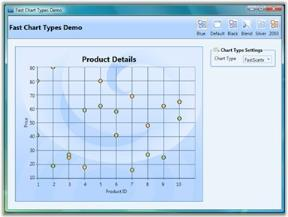 | markdownify }
{:.image }

Customizing the Height and Width of the Fast Scatter Chart

You can modify the size of the Fast Scatter chart by using the Height and Width properties of FastScatter-Type, as shown in the following code sample:

[XAML]

<syncfusion:ChartSeries Name="Series1" Type="FastScatter" 

DataSource="{Binding ExpensiveCarDetails}" BindingPathX="Position" BindingPathsY="Price" syncfusion:ChartFastScatterType.FastScatterHeight="30" syncfusion:ChartFastScatterType.FastScatterWidth="30">

&lt;/syncfusion:ChartSeries&gt;

[C#]

ChartFastScatterType.SetFastScatterWidth(seriesname, 30);
ChartFastScatterType.SetFastScatterHeight(seriesname, 30);

A sample which demonstrates Fast Scatter Chart Types is available in the following sample installation path.

_..My Documents\Syncfusion\Essential Studio\&lt;Version Number&gt;\WPF\Chart.WPF\Samples\3.5\WindowsSamples\Chart Performance-> Fast chart types_

See Also

Chart Types

Bubble Chart

Bubble Chart is an extension of the Scatter Chart (or XY-chart) where each data marker is represented by a circle whose dimension forms a third variable. Consequently, bubble charts allow three-variable comparisons allowing for easy visualization of complex interdependencies that are not apparent in two-variable charts. Bubble charts are frequently used in market and product comparison studies.

Though it's called a bubble chart, the data marker can be rendered as either a circle, image or square using the BubbleType property.

The following image shows a multi series Bubble Chart.

{  | markdownify }
{:.image }

Data Requirements

_Data Requirement_

<table>
<tr>
<td colspan = "2">
Details</td></tr>
<tr>
<td>
Number of y values per point</td><td>
two</td></tr>
<tr>
<td>
Number of points     </td><td>
one or more</td></tr>
<tr>
<td>
Number of series</td><td>
one or more</td></tr>
</table>
BubbleType Properties

_Property Table_

<table>
<tr>
<td>
Name</td><td>
Type</td><td>
Container</td><td>
Description</td></tr>
<tr>
<td>
ChartBubbleType.MinRadius</td><td>
double</td><td>
ChartSeries</td><td>
minimal figure radius</td></tr>
<tr>
<td>
ChartBubbleType.MaxRadius</td><td>
double</td><td>
ChartSeries</td><td>
maximal figure radius</td></tr>
</table>
Template

While setting template the following parameters can be used:

_Template Parameter_

<table>
<tr>
<td>
Name</td><td>
Type</td><td>
Description</td></tr>
<tr>
<td>
X</td><td>
double</td><td>
x column coordinate</td></tr>
<tr>
<td>
Y</td><td>
double</td><td>
y column coordinate</td></tr>
<tr>
<td>
Width</td><td>
double</td><td>
column width</td></tr>
<tr>
<td>
Height</td><td>
double</td><td>
column height</td></tr>
<tr>
<td>
Radius</td><td>
double</td><td>
figure radius</td></tr>
<tr>
<td>
Interior</td><td>
Brush</td><td>
column color</td></tr>
<tr>
<td>
Series</td><td>
ChartSeries</td><td>
reference to series-owner</td></tr>
</table>
A sample which demonstrates Scatter and Bubble Chart Types is available in the following sample installation path.

_..My Documents\Syncfusion\EssentialStudio\&lt;Version Number&gt;\WPF\Chart.WPF\Samples\3.5\WindowsSamples\Chart Gallery\Scatter And Bubble Chart Demo_

See Also

Chart Types

###### Financial Charts

Candle Chart

A Candle Chart displays stock information using the High, Low, Open and Close values. The Hi and Lo values are represented by the wick of a candle. The candle represents open and close values.

The following image shows a CandleChart displaying a single series. 

{  | markdownify }
{:.image }

Data Requirements

_Property Table_

<table>
<tr>
<td colspan = "2">
Details</td></tr>
<tr>
<td>
Number of y values per point</td><td>
four (High, Low , Open and Close respectively)</td></tr>
<tr>
<td>
Number of points  </td><td>
one or more</td></tr>
<tr>
<td>
Number of series</td><td>
one or more</td></tr>
</table>
CandleType Properties

_Property Table_

<table>
<tr>
<td>
Name</td><td>
Type</td><td>
Container</td><td>
Description</td></tr>
<tr>
<td>
ChartType.Spacing</td><td>
double</td><td>
ChartArea</td><td>
interval between line groupsPossible value lies between 0 and 1.</td></tr>
</table>
Template

While setting template the following parameters can be used:

_Template Parameter_

<table>
<tr>
<td>
Name</td><td>
Type</td><td>
Description</td></tr>
<tr>
<td>
HiX</td><td>
double</td><td>
x-coordinate of upper border</td></tr>
<tr>
<td>
HiY</td><td>
double</td><td>
y-coordinate of upper border</td></tr>
<tr>
<td>
LoX</td><td>
double</td><td>
x-coordinate of lower border</td></tr>
<tr>
<td>
LoY</td><td>
double</td><td>
y-coordinate of lower border</td></tr>
<tr>
<td>
X</td><td>
double</td><td>
x-column coordinate</td></tr>
<tr>
<td>
Y</td><td>
double</td><td>
y-column coordinate</td></tr>
<tr>
<td>
Width</td><td>
double</td><td>
column width</td></tr>
<tr>
<td>
Height</td><td>
double</td><td>
column height</td></tr>
<tr>
<td>
Interior</td><td>
Brush</td><td>
column color</td></tr>
<tr>
<td>
Series</td><td>
ChartSeries</td><td>
reference to series-owner</td></tr>
</table>
A sample which demonstrates Financial Chart Types is available in the following sample installation path.

_..My Documents\Syncfusion\EssentialStudio\&lt;Version Number&gt;\WPF\Chart.WPF\Samples\3.5\WindowsSamples\Chart Gallery\Financial Chart Demo_

See Also

Chart Types

HiLo Chart

Hi Lo Chart is a special kind of chart that is normally used in stock analysis. They are typically used to display error bars or the trading range of a stock for each period. 

The Hi Lo Chart expect 2 Y values to be specified in the series. One value should represent the high and the other value should represent the low stock price for the period. This can be specified in any order.

{  | markdownify }
{:.image }

Data Requirements

_Template Parameter_

<table>
<tr>
<td colspan = "2">
Details</td></tr>
<tr>
<td>
Number of y values per point</td><td>
two</td></tr>
<tr>
<td>
Number of points      </td><td>
one or more</td></tr>
<tr>
<td>
Number of series  </td><td>
one or more</td></tr>
</table>
Template

While setting template the following parameters can be used:

_Template Parameter_

<table>
<tr>
<td>
Name</td><td>
Type</td><td>
Description</td></tr>
<tr>
<td>
HiX</td><td>
double</td><td>
x-coordinate of upper border</td></tr>
<tr>
<td>
HiY</td><td>
double</td><td>
y-coordinate of upper border</td></tr>
<tr>
<td>
LoX</td><td>
double</td><td>
x-coordinate of lower border</td></tr>
<tr>
<td>
LoY</td><td>
double</td><td>
y-coordinate of lower border</td></tr>
<tr>
<td>
Interior</td><td>
Brush</td><td>
column color</td></tr>
<tr>
<td>
Series</td><td>
ChartSeries</td><td>
reference to series-owner</td></tr>
</table>
A sample which demonstrates Financial Chart Types is available in the following sample installation path.

_..My Documents\Syncfusion\EssentialStudio\&lt;Version Number&gt;\WPF\Chart.WPF\Samples\3.5\WindowsSamples\Chart Gallery\Financial Chart Demo_

See Also

Chart Types

HiLoOpenClose Chart

Hi Lo Open Close Chart is a special kind of chart that is normally used in stock analysis. This chart type expects 4 Y values for every point in the series. Those values should represent the High, Low, Open and Close values of the stock, in that order, for that period.

{ 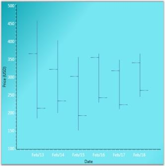 | markdownify }
{:.image }

Data Requirements

_Data Parameter_

<table>
<tr>
<td colspan = "2">
Details</td></tr>
<tr>
<td>
Number of y values per point</td><td>
four (Open, Close, High and Low, in that order)</td></tr>
<tr>
<td>
Number of points     </td><td>
one or more</td></tr>
<tr>
<td>
Number of series</td><td>
one or more</td></tr>
</table>
Template

While setting template the following parameters can be used:

_Template Parameters_

<table>
<tr>
<td>
Name</td><td>
Type</td><td>
Description</td></tr>
<tr>
<td>
HiX</td><td>
double</td><td>
x-coordinate of upper border</td></tr>
<tr>
<td>
HiY</td><td>
double</td><td>
y-coordinate of upper border</td></tr>
<tr>
<td>
LoX</td><td>
double</td><td>
x-coordinate of lower border</td></tr>
<tr>
<td>
LoY</td><td>
double</td><td>
y-coordinate of lower border</td></tr>
<tr>
<td>
StartOpenX</td><td>
double</td><td>
x start coordinate of opening price</td></tr>
<tr>
<td>
StartOpenY</td><td>
double</td><td>
y start coordinate of opening price</td></tr>
<tr>
<td>
EndOpenX</td><td>
double</td><td>
x end coordinate of opening price</td></tr>
<tr>
<td>
EndOpenY</td><td>
double</td><td>
y end coordinate of opening price</td></tr>
<tr>
<td>
StartCloseX</td><td>
double</td><td>
x start coordinate of closing price</td></tr>
<tr>
<td>
StartCloseY</td><td>
double</td><td>
y start coordinate of closing price</td></tr>
<tr>
<td>
EndCloseX</td><td>
double</td><td>
x end coordinate of closing price</td></tr>
<tr>
<td>
EndCloseY</td><td>
double</td><td>
y end coordinate of closing price</td></tr>
<tr>
<td>
Interior</td><td>
Brush</td><td>
column color</td></tr>
<tr>
<td>
Series</td><td>
ChartSeries</td><td>
reference to series-owner</td></tr>
</table>
A sample which demonstrates Financial Chart Types is available in the following sample installation path.

_..My Documents\Syncfusion\EssentialStudio\&lt;Version Number&gt;\WPF\Chart.WPF\Samples\3.5\WindowsSamples\Chart Gallery\Financial Chart Demo_

See Also

Chart Types

Kagi Chart

Kagi Charts are a Japanese invention and date since the late 1870's, but were popularized in the western world by Steven Nison. They contain a series of connecting vertical lines where the thickness and direction of those lines depend on price. If closing prices continue to move in the direction of the prior vertical Kagi line, then that line is extended. However, if the closing price reverses by a pre-determined "reversal" amount, a new Kagi line is drawn in the next column in the opposite direction.

The penetration of a prior column's high or low, by the latest closing price, alters the colors of the lines. These colors depict either a bullish or bearish pattern. Use the PriceUpColor and PriceDownColor properties to specify the colors for these two patterns. The wider the columns, the stronger the pattern.

{  | markdownify }
{:.image }

Data Requirements

_Data Requirement_

<table>
<tr>
<td colspan = "2">
Details</td></tr>
<tr>
<td>
Number of y values per point</td><td>
one</td></tr>
<tr>
<td>
Number of points      </td><td>
one or more</td></tr>
<tr>
<td>
Number of series   </td><td>
one or more</td></tr>
</table>
KagiType Properties

_Template Parameter_

<table>
<tr>
<td>
Name</td><td>
Type</td><td>
Container</td><td>
Description</td></tr>
<tr>
<td>
ChartKagiType.ReversalAmount</td><td>
double</td><td>
ChartSeries</td><td>
price difference which should overcome in order to change diagram direction</td></tr>
</table>
Template

While setting template the following parameters can be used:

_Template Parameter_

<table>
<tr>
<td>
Name</td><td>
Type</td><td>
Description</td></tr>
<tr>
<td>
IsPriceUp</td><td>
bool</td><td>
{{ '_true_' | markdownify }} – if segment shows price rising</td></tr>
<tr>
<td>
IsPriceDown</td><td>
bool</td><td>
{{ '_true_' | markdownify }} – if segment shows price recession</td></tr>
<tr>
<td>
Points</td><td>
PointCollection</td><td>
collection of segment points</td></tr>
<tr>
<td>
Interior</td><td>
Brush</td><td>
column color</td></tr>
<tr>
<td>
Series</td><td>
ChartSeries</td><td>
reference to series-owner</td></tr>
</table>
A sample which demonstrates Financial Chart Types is available in the following sample installation path.

_..My Documents\Syncfusion\EssentialStudio\&lt;Version Number&gt;\WPF\Chart.WPF\Samples\3.5\WindowsSamples\Chart Gallery\Financial Chart Demo_

See Also

Chart Types

Point and Figure Chart

Point and Figure Chart is used to identify support levels, resistance levels and chart patterns. The chart ignores the time factor and concentrates solely on movements in price - a column of Xs or Os may take one day or several weeks to complete. By convention, the first X in a column is plotted one box above the last O in the previous column (and the first O in a column is plotted one box below the highest X).  

This is a chart that plots the day-to-day increment and decrement in price. It uses a series of X's and O's to determine price trends where the X's represent an upward trend and the O's represent a downward trend. The default value of ReversalAmount is 1. Use the PriceUpColor to specify the color for the Xs and PriceDownColor to specify the color for the Os. 

This chart requires 2 Y values, the high value and the low value for the specified period.

{  | markdownify }
{:.image }

Data Requirements

_Data Requirement_

<table>
<tr>
<td colspan = "2">
Details</td></tr>
<tr>
<td>
Number of y values per point</td><td>
two</td></tr>
<tr>
<td>
Number of points</td><td>
one or more</td></tr>
<tr>
<td>
Number of series</td><td>
one or more</td></tr>
</table>
PointAndFigure Customization

_PointAndFigure Customization_

<table>
<tr>
<td>
Name</td><td>
Type</td><td>
Container</td><td>
Description</td></tr>
<tr>
<td>
ChartPointAndFigureType.FigureCost</td><td>
double</td><td>
ChartSeries</td><td>
price of one segment</td></tr>
<tr>
<td>
ChartPointAndFigureType.ReversalAmount</td><td>
double</td><td>
ChartSeries</td><td>
price difference which should be overcome in order to change diagram direction</td></tr>
</table>
Template

While setting template the following parameters can be used.

_Template Parameter_

<table>
<tr>
<td>
Name</td><td>
Type</td><td>
Description</td></tr>
<tr>
<td>
X</td><td>
double</td><td>
x-column coordinate</td></tr>
<tr>
<td>
Y</td><td>
double</td><td>
y-column coordinate</td></tr>
<tr>
<td>
Width</td><td>
double</td><td>
column width</td></tr>
<tr>
<td>
IsPoint</td><td>
bool</td><td>
{{ '_true_' | markdownify }} – if segment is point</td></tr>
<tr>
<td>
IsFigure</td><td>
bool</td><td>
{{ '_true_' | markdownify }} – if segment is figure</td></tr>
<tr>
<td>
Height</td><td>
double</td><td>
column height</td></tr>
<tr>
<td>
Interior</td><td>
Brush</td><td>
column Color</td></tr>
<tr>
<td>
Series</td><td>
ChartSeries</td><td>
reference to series-owner</td></tr>
</table>
A sample which demonstrates Financial Chart Types is available in the following sample installation path.

_..My Documents\Syncfusion\EssentialStudio\&lt;Version Number&gt;\WPF\Chart.WPF\Samples\3.5\WindowsSamples\Chart Gallery\Financial Chart Demo_

See Also

Chart Types

Renko Chart

Renko charting method is thought to have acquired its name from "renga" which is the Japanese word for bricks. Renko Charts were introduced by Steve Nison. Renko (Bricks) are drawn equal in size for a determined amount. A brick is drawn in the direction of the prior move only if prices move by a minimum amount. If prices change by the determined amount or more, a new brick is drawn. If prices change by less than the determined amount (specified by ReversalAmount), the new price is ignored. The default value of ReversalAmount is 1.

If the new closing price penetrates the previous bricks closing price in the opposite direction a trend reversal highlighted by the change in color of the bricks happens. Use the PriceUpColor to indicate bullish trend and PriceDownColor to indicate bearish trend.

Since a Renko chart isolates the underlying trends by filtering out the minor ups and downs, Renko charts are excellent in determining support and resistance levels.  

{  | markdownify }
{:.image }

Data Requirements

_Data Requirements_

<table>
<tr>
<td colspan = "2">
Details</td></tr>
<tr>
<td>
Number of y values per point</td><td>
one</td></tr>
<tr>
<td>
Number of points      </td><td>
one or more</td></tr>
<tr>
<td>
Number of series   </td><td>
one or more</td></tr>
</table>
Renko Customization

_Renko Customization_

<table>
<tr>
<td>
Name</td><td>
Type</td><td>
Container</td><td>
Description</td></tr>
<tr>
<td>
ChartRenkoType.RenkoCost</td><td>
double</td><td>
ChartSeries</td><td>
price of one Renko segment</td></tr>
</table>
Template

While setting template the following parameters can be used:

_Template Parameters_

<table>
<tr>
<td>
Name</td><td>
Type</td><td>
Description</td></tr>
<tr>
<td>
X</td><td>
double</td><td>
x column coordinate</td></tr>
<tr>
<td>
Y</td><td>
double</td><td>
y column coordinate</td></tr>
<tr>
<td>
Width</td><td>
double</td><td>
column width</td></tr>
<tr>
<td>
IsPriceUp</td><td>
bool</td><td>
{{ '_true_' | markdownify }} – if segment shows price rising</td></tr>
<tr>
<td>
IsPriceDown</td><td>
bool</td><td>
{{ '_true_' | markdownify }} – if segment shows price recession</td></tr>
<tr>
<td>
Height</td><td>
double</td><td>
column height</td></tr>
<tr>
<td>
Interior</td><td>
Brush</td><td>
column color</td></tr>
<tr>
<td>
Series</td><td>
ChartSeries</td><td>
reference to series-owner</td></tr>
</table>
A sample which demonstrates Financial Chart Types is available in the following sample installation path.

_..My Documents\Syncfusion\EssentialStudio\&lt;Version Number&gt;\WPF\Chart.WPF\Samples\3.5\WindowsSamples\Chart Gallery\Financial Chart Demo_

See Also

Chart Types

ThreeLineBreak Chart

Three Line Break Chart is similar in concept to point and figure charts. The Three Line Break charting method is so-named because of the number of lines typically used. It displays a series of vertical boxes ("lines") that are based on changes in prices. It ignores the passage of time.

The three-line break chart looks like a series of rising and falling lines of varying heights. Each new line, like the Xs and Os of a point and figure chart, occupies a new column. Based on closing prices (or highs and lows), a new rising line is drawn if the previous high is exceeded and a new falling line is drawn if the price hits a new low. Change in price trends are highlighted by changing colors. Use the PriceUpColor to indicate bullish trend and PriceDownColor to indicate bearish trend.

The ReversalAmount specifies the threshold amount by which the price should change to begin rendering a new vertical box in the appropriate direction.

{  | markdownify }
{:.image }

Data Requirements

_Data Requirement_

<table>
<tr>
<td colspan = "2">
Details</td></tr>
<tr>
<td>
Number of y values per point</td><td>
one</td></tr>
<tr>
<td>
Number of points</td><td>
one or more</td></tr>
<tr>
<td>
Number of series</td><td>
one or more</td></tr>
</table>
Renko Customization

_Renko Customization_

<table>
<tr>
<td>
Name</td><td>
Type</td><td>
Container</td><td>
Description</td></tr>
<tr>
<td>
ChartThreeLineBreakType.BreakLineCount</td><td>
double</td><td>
ChartSeries</td><td>
sets the break line count Default value is 3.</td></tr>
</table>
Template

While setting template the following parameters can be used.

_Template Parameter_

<table>
<tr>
<th>
Name</th><th>
Type</th><th>
Description</th></tr>
<tr>
<td>
X</td><td>
double</td><td>
x-column coordinate</td></tr>
<tr>
<td>
Y</td><td>
double</td><td>
y-column coordinate</td></tr>
<tr>
<td>
Width</td><td>
double</td><td>
column width</td></tr>
<tr>
<td>
IsPriceUp</td><td>
bool</td><td>
{{ '_true_' | markdownify }} – if segment shows price rising</td></tr>
<tr>
<td>
IsPriceDown</td><td>
bool</td><td>
{{ '_true_' | markdownify }} – if segment shows price recession</td></tr>
<tr>
<td>
Height</td><td>
double</td><td>
column height</td></tr>
<tr>
<td>
Interior</td><td>
Brush</td><td>
column color</td></tr>
<tr>
<td>
Series</td><td>
ChartSeries</td><td>
reference to series-owner</td></tr>
</table>
A sample which demonstrates Financial Chart Types is available in the following sample installation path.

_..My Documents\Syncfusion\EssentialStudio\&lt;Version Number&gt;\WPF\Chart.WPF\Samples\3.5\WindowsSamples\Chart Gallery\Financial Chart Demo_

See Also

Chart Types

Box and Whisker Chart

In 1977, John Tukey published an efficient method for displaying a five-number data summary. The graph is called a Box and Whisker plot (also known as BoxPlot) and summarizes the following statistical measures.

* median
* upper and lower quartiles (75 percentile to 25 percentile)
* minimum and maximum data values

The following is an example of a Box and Whisker plot.

{  | markdownify }
{:.image }

Custom Properties

_Property Table_

<table>
<tr>
<td>
Name</td><td>
Type</td><td>
Container</td><td>
Description</td></tr>
<tr>
<td>
ChartType.Spacing</td><td>
double</td><td>
ChartArea</td><td>
interval between columnsPossible value lies between 0 and 1.</td></tr>
</table>
Template

While setting template the following parameters can be used.

_Template Parameter_

<table>
<tr>
<td>
Name</td><td>
Type</td><td>
Description</td></tr>
<tr>
<td>
X</td><td>
double</td><td>
x-column coordinate</td></tr>
<tr>
<td>
Y</td><td>
double</td><td>
y-column coordinate</td></tr>
<tr>
<td>
Width</td><td>
double</td><td>
column width</td></tr>
<tr>
<td>
TopWhiskerX1</td><td>
double</td><td>
x1 of upper border</td></tr>
<tr>
<td>
TopWhiskerY1</td><td>
double</td><td>
y1 of upper border</td></tr>
<tr>
<td>
TopWhiskerX2</td><td>
double</td><td>
x2 of upper border</td></tr>
<tr>
<td>
TopWhiskerY2</td><td>
double</td><td>
y2 of upper border</td></tr>
<tr>
<td>
BottomWhiskerX1</td><td>
double</td><td>
x1 of lower border</td></tr>
<tr>
<td>
BottomWhiskerY1</td><td>
double</td><td>
y1 of lower border</td></tr>
<tr>
<td>
BottomWhiskerX2</td><td>
double</td><td>
x2 of lower border</td></tr>
<tr>
<td>
BottomWhiskerY2</td><td>
double</td><td>
y2 of lower border</td></tr>
<tr>
<td>
MedianWhiskerX1</td><td>
double</td><td>
x1 of lengthwise line</td></tr>
<tr>
<td>
MedianWhiskerY1</td><td>
double</td><td>
y1 of lengthwise line</td></tr>
<tr>
<td>
MedianWhiskerX2</td><td>
double</td><td>
x2 of lengthwise line</td></tr>
<tr>
<td>
MedianWhiskerY2</td><td>
double</td><td>
y2 of lengthwise line</td></tr>
<tr>
<td>
Height</td><td>
double</td><td>
column height</td></tr>
<tr>
<td>
Interior</td><td>
Brush</td><td>
column color</td></tr>
<tr>
<td>
Series</td><td>
ChartSeries</td><td>
reference to series-owner</td></tr>
</table>
Data Requirements

_Data Requirement_

<table>
<tr>
<td colspan = "2">
Details</td></tr>
<tr>
<td>
Number of y values per point</td><td>
five (minimum, lower quartile, median, upper quartile, maximum)</td></tr>
<tr>
<td>
Number of points      </td><td>
one or more</td></tr>
<tr>
<td>
Number of series   </td><td>
one or more</td></tr>
</table>
Outlier Calculation

Outliers that are greater than the segment height can be rendered in the chart. Essential chart also provides option to set a difference in such outlier rendering. This difference can be set using the SetDefaultOutlierVisible property.

[C#]

ChartBoxAndWhiskerType.SetDefaultOutlierVisible(ser, false);

A sample which demonstrates Box And Whisker Chart Type is available in the following sample installation path.

..My Documents\Syncfusion\EssentialStudio\&lt;Version Number&gt;\WPF\Chart.WPF\Samples\3.5\WindowsSamples\Chart Gallery\Box-and-Whisker Chart Demo

See Also

Chart Types

Fast HiLo Open Close

Fast High Low (HiLo) Open Close charts are similar to HiLo Open Close Charts and are used in stock analysis. This chart type expects 4 Y values for every point in the series. Those values should represent the High, Low, Open and Close values of the stock, in that order, for a particular period. 

The Fast High Low (HiLo) Open Close charts have the following advantages:

* The Fast HiLo Open Close charts are rendered using drawing visuals. 
* They load faster than the HiLo Open Close charts. 
* They ensure high performance for displaying data. 
* They can be used as real time charts to render huge number of data points.

The Chart type HiLo Open Close is added in the Enum of type ChartTypes.

{  | markdownify }
{:.image }

Data Requirements

_Data Requirement_

<table>
<tr>
<td colspan = "2">
Details</td></tr>
<tr>
<td>
Number of y values per point</td><td>
Four (open, close, high and low, in that order)</td></tr>
<tr>
<td>
Number of points      </td><td>
one or more</td></tr>
<tr>
<td>
Number of series   </td><td>
one or more</td></tr>
</table>
Template

While setting template the following parameters can be used:

_Template Parameter_

<table>
<tr>
<td>
Name</td><td>
Type</td><td>
Description</td></tr>
<tr>
<td>
HiX</td><td>
double</td><td>
x-coordinate of upper border</td></tr>
<tr>
<td>
HiY</td><td>
double</td><td>
y-coordinate of upper border</td></tr>
<tr>
<td>
LoX</td><td>
double</td><td>
x-coordinate of lower border</td></tr>
<tr>
<td>
LoY</td><td>
double</td><td>
y-coordinate of lower border</td></tr>
<tr>
<td>
StartOpenX</td><td>
double</td><td>
x start coordinate of opening price</td></tr>
<tr>
<td>
StartOpenY</td><td>
double</td><td>
y start coordinate of opening price</td></tr>
<tr>
<td>
EndOpenX</td><td>
double</td><td>
x end coordinate of opening price</td></tr>
<tr>
<td>
EndOpenY</td><td>
double</td><td>
y end coordinate of opening price</td></tr>
<tr>
<td>
StartCloseX</td><td>
double</td><td>
x start coordinate of closing price</td></tr>
<tr>
<td>
StartCloseY</td><td>
double</td><td>
y start coordinate of closing price</td></tr>
<tr>
<td>
EndCloseX</td><td>
double</td><td>
x end coordinate of closing price</td></tr>
<tr>
<td>
EndCloseY</td><td>
double</td><td>
y end coordinate of closing price</td></tr>
<tr>
<td>
Interior</td><td>
Brush</td><td>
column color</td></tr>
<tr>
<td>
Series</td><td>
ChartSeries</td><td>
reference to series-owner</td></tr>
</table>
A sample which demonstrates Financial Chart Types is available in the following sample installation path.

_..My Documents\Syncfusion\EssentialStudio\&lt;Version Number&gt;\WPF\Chart.WPF\Samples\3.5\WindowsSamples\Chart Performance\Fast chart types_

The following code illustrates the creation of Fast High Low (HiLo) Open Close charts.

[XAML]

&lt;syncfusion:ChartSeries Type="HiLoOpenClose" Name="series1" Stroke="Black" DataSource="{Binding}"/&gt;

[C#]

ChartSeries series = new ChartSeries();

series.Type = ChartTypes.HiLoOpenClose;

Run the sample. The following output is provided.

{ 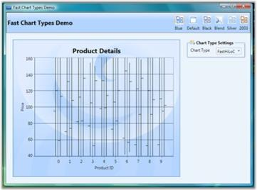 | markdownify }
{:.image }

###### Pie Charts

Pie Chart

A Pie Chart renders Y values as slices in a pie. These slices are rendered in proportion to the whole which is simply the sum of all the Y values in the series. Consequently, Pie Charts are used to visualize the proportional contribution (in terms of percentage or fraction) of categories of data to the whole data set. The X values in the data series will only be treated as nominal (categorical, qualitative) data. The Pie Chart can display only one DataSeries at a time.

{  | markdownify }
{:.image }

Data Requirements

_Data Requirement_

<table>
<tr>
<td colspan = "2">
Details</td></tr>
<tr>
<td>
Number of y values per point</td><td>
one</td></tr>
<tr>
<td>
Number of points      </td><td>
one or more</td></tr>
<tr>
<td>
Number of series</td><td>
one or more</td></tr>
</table>
Pie Type Properties

_Pie Type Properties_

<table>
<tr>
<td>
Name</td><td>
Type</td><td>
Container</td><td>
Description</td></tr>
<tr>
<td>
ChartPieType.ExplodedIndex</td><td>
double</td><td>
ChartArea</td><td>
index of segment which should be leant out</td></tr>
</table>
Template

While setting template, the following parameters can be used.

_Template Parameter_

<table>
<tr>
<td>
Name</td><td>
Type</td><td>
Description</td></tr>
<tr>
<td>
TickX</td><td>
double</td><td>
x-coordinate of sector center</td></tr>
<tr>
<td>
TickY</td><td>
double</td><td>
y-coordinate of sector center</td></tr>
<tr>
<td>
IsExploded</td><td>
double</td><td>
{{ '_true_' | markdownify }} if segment is leant out</td></tr>
<tr>
<td>
ExplodRadius</td><td>
double</td><td>
radius to which the segment should be leant out</td></tr>
<tr>
<td>
Geometry</td><td>
Geometry</td><td>
segment geometry</td></tr>
<tr>
<td>
Interior</td><td>
Brush</td><td>
column color</td></tr>
<tr>
<td>
Series</td><td>
ChartSeries</td><td>
reference to series-owner</td></tr>
<tr>
<td>
AngleOfSliceRotation</td><td>
double</td><td>
specifies the angle (in radians) at which the segment is renderedIt is useful for creating animated templates.</td></tr>
<tr>
<td>
StartAngle</td><td>
double</td><td>
specifies the angle (in radians) of one side of the pie</td></tr>
<tr>
<td>
EndAngle</td><td>
double</td><td>
specifies the angle (in radians) of the other side of the pie</td></tr>
</table>
A sample which demonstrates Pie Chart Types is available in the following sample installation path.

_..My Documents\Syncfusion\EssentialStudio\&lt;Version Number&gt;\WPF\Chart.WPF\Samples\3.5\WindowsSamples\Chart Gallery\Pie Chart Demo_

See Also

Chart Types, ChartSegment Labels

Doughnut Chart

Doughnut charts are pie charts with a hole, whose value is specified as the doughnut coefficient. The Doughnut Chart is best suited for presenting data in proportions.

{  | markdownify }
{:.image }

Data Requirements

_Data Requirement_

<table>
<tr>
<td colspan = "2">
Details</td></tr>
<tr>
<td>
Number of y values per point</td><td>
one</td></tr>
<tr>
<td>
Number of points   </td><td>
one or more</td></tr>
<tr>
<td>
Number of series</td><td>
one or more</td></tr>
</table>
Doughnut Type Properties

_Doughnut Type Properties_

<table>
<tr>
<td>
Name</td><td>
Type</td><td>
Container</td><td>
Description</td></tr>
<tr>
<td>
ChartDoughnutType.ExplodedIndex</td><td>
int</td><td>
ChartSeries</td><td>
index of segment which should be leant out</td></tr>
<tr>
<td>
ChartDoughnutType.DoughnutCoefficient</td><td>
double</td><td>
ChartSeries</td><td>
number which shows relation of inner radius to outer radius</td></tr>
</table>
Template

While setting template the following parameters can be used:

_Template Parameters_

<table>
<tr>
<td>
Name</td><td>
Type</td><td>
Description</td></tr>
<tr>
<td>
TickX</td><td>
double</td><td>
x-coordinate of sector center</td></tr>
<tr>
<td>
TickY</td><td>
double</td><td>
y-coordinate of sector center</td></tr>
<tr>
<td>
IsExploded</td><td>
double</td><td>
{{ '_true_' | markdownify }} if segment is leant out</td></tr>
<tr>
<td>
DoughnutCoefficient</td><td>
double</td><td>
number which shows relation of inner radius to outer</td></tr>
<tr>
<td>
ExplodRadius</td><td>
double</td><td>
radius to which the segment should be leant out</td></tr>
<tr>
<td>
Geometry</td><td>
Geometry</td><td>
segment geometry</td></tr>
<tr>
<td>
Interior</td><td>
Brush</td><td>
column color</td></tr>
<tr>
<td>
Series</td><td>
ChartSeries</td><td>
reference to series-owner</td></tr>
</table>
A sample which demonstrates Pie Chart Types is available in the following sample installation path.

_..My Documents\Syncfusion\EssentialStudio\&lt;Version Number&gt;\WPF\Chart.WPF\Samples\3.5\WindowsSamples\Chart Gallery\Pie Chart Demo_

See Also

Chart Types, ChartSegment Labels

###### Polar Chart

Essential Chart supports the implementation of Polar chart in the chart control. This chart is used to display different values and angles in the form of a graph.

APolar Chart is a circular graph on which data is displayed in terms of values and angles. The X values define the angles at which the data points will be plotted. The Y value defines the distance of the data points from the center of the graph, with the center of the graph usually starting at 0.

It is a form of graph that allows a visual comparison between several quantitative or qualitative aspects of a situation and also allows a visual comparison between several situations that are drawn using the same axes (poles).

{  | markdownify }
{:.image }

Data Requirements

_Data Requirement_

<table>
<tr>
<td colspan = "2">
Details</td></tr>
<tr>
<td>
Number of y values per point</td><td>
one</td></tr>
<tr>
<td>
Number of points     </td><td>
one or more</td></tr>
<tr>
<td>
Number of series</td><td>
one or more</td></tr>
</table>
Template

While setting template the following parameters can be used.

_Template Parameter_

<table>
<tr>
<td>
Name</td><td>
Type</td><td>
Description</td></tr>
<tr>
<td>
X1</td><td>
double</td><td>
x-coordinate of first point</td></tr>
<tr>
<td>
Y1</td><td>
double</td><td>
y-coordinate of first point</td></tr>
<tr>
<td>
X2</td><td>
double</td><td>
x-coordinate of second point</td></tr>
<tr>
<td>
Y2</td><td>
double</td><td>
y-coordinate of second point</td></tr>
<tr>
<td>
Interior</td><td>
Brush</td><td>
column color</td></tr>
<tr>
<td>
Series</td><td>
ChartSeries</td><td>
reference to series-owner</td></tr>
</table>
A sample that illustrates Circular Chart Type is available in the following sample installation path.

_..My Documents\Syncfusion\EssentialStudio\&lt;Version Number&gt;\WPF\Chart.WPF\Samples\3.5\WindowsSamples\Chart Gallery\Circular Chart Demo_

See Also

Chart Types

Special Support in Radar and Polar Charts

This feature provides IsClosed and DrawType support for Radar and Polar chart types. The IsClosed feature specifies whether the series drawn should be in closed form. This can be applied to line-type series in polar and radar charts. The DrawType feature specifies in which form or shape the series should be drawn. 

Following are the different DrawType categories for radar and polar charts

Line

When the DrawType is Line, the series is drawn as a line segment connecting each point in the chart. The following image illustrates this.

{  | markdownify }
{:.image }

Area

When the DrawType is Area, the series is drawn as a single area segment connecting each point in the chart. The following image illustrates this.

{  | markdownify }
{:.image }

Symbol

When the DrawType is Symbol, the series is drawn as separate points as a symbol without connecting each point in the chart. The following image illustrates this.

{  | markdownify }
{:.image }

Following are the screenshots of the chart when IsClosed is set to True and False:

{  | markdownify }
{:.image }

{ 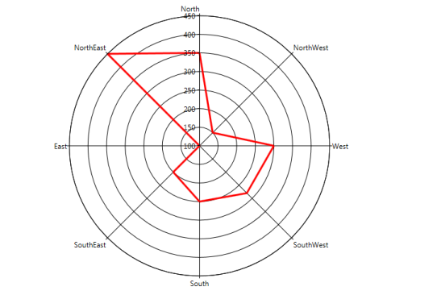 | markdownify }
{:.image }

Properties

_Properties_

<table>
<tr>
<td>
Property</td><td>
Description</td><td>
Type</td><td>
Data Type</td></tr>
<tr>
<td>
IsClosed</td><td>
Used to specify how to draw the segment (closed or not closed).</td><td>
Attached</td><td>
Bool</td></tr>
<tr>
<td>
DrawType</td><td>
Used to specify what template is to be applied to series.</td><td>
Attached</td><td>
Enum (Line, Area, Symbol)</td></tr>
<tr>
<td>
PolarSymbol</td><td>
Used to assign symbol for polar charts and will be displayed when draw type is Symbol.</td><td>
Attached</td><td>
DataTemplate</td></tr>
<tr>
<td>
RadarSymbol</td><td>
Used to assign symbol for radar charts and will be displayed when the draw type is Symbol.</td><td>
Attached</td><td>
DataTemplate</td></tr>
</table>
Adding Support for IsClosed and DrawType in Radar and Polar Charts to an Application 

[XAML]

Polar Chart

&lt;syncf:ChartArea syncf:ChartPolarType.IsClosed="True" syncf:ChartPolarType.PolarSymbol="{StaticResource sym}" syncf:ChartPolarType.DrawType="Line" Name="Area1"&gt;     

 &lt;syncf:ChartSeries StrokeThickness="3" Interior="Red" Type="Polar" x:Name="Series1" Data="0,100,1,150,2,300,3,50,4,214,5,166" &gt;                   

&lt;/syncf:ChartSeries&gt;

&lt;/syncf:ChartArea&gt;

Radar Chart

&lt;syncf:ChartArea syncf:ChartRadarType.IsClosed="True" syncf:ChartRadarType.PolarSymbol="{StaticResource sym}" syncf:ChartRadarType.DrawType="Line" Name="Area1"&gt;     

 &lt;syncf:ChartSeries StrokeThickness="3" Interior="Red" Type="Radar" x:Name="Series1" Data="0,100,1,150,2,300,3,50,4,214,5,166" &gt;                   

&lt;/syncf:ChartSeries&gt;

&lt;/syncf:ChartArea&gt;

[C#]

Polar Chart

ChartPolarType.SetPolarSymbol(Series1, this.Resources["sym"] as DataTemplate);

ChartPolarType.SetDrawType(Area1, ChartPolarDrawType.Line);    ChartPolarType.SetIsClosed(Area1, true);

Radar Chart

ChartRadarType.SetRadarSymbol(Series1, this.Resources["sym"] as DataTemplate);

ChartRadarType.SetDrawType(Area1, ChartRadarDrawType.Line);    ChartRadarType.SetIsClosed(Area1, true);

###### Stacking Charts

Stacking Charts are similar to regular charts except that the Y values stack on top of each other in the specified series order. Stacking charts help visualize data that is a sum of parts, each of which is in a series. 

There are different types of stacking charts.

Fast Stacking Column Charts

Fast Stacking Column charts are similar to Stacked-column charts with y-coordinate values stacked over one another, in series order allowing the chart data to be visualized as sum of series parts. The following points mark the advantages of Fast Stacking Column over Stacked-column charts:

* The Fast Stacking Column charts are rendered using drawing visuals. 
* They load faster than the Stacked-column charts. 
* They ensure high performance for displaying data. 
* They can be used as real time charts to render huge number of data points.

The Fast Stacking Column chart is added in the Enum of type ChartTypes.

Data Requirements

_Data Requirement_

<table>
<tr>
<td colspan = "2">
Details</td></tr>
<tr>
<td>
Number of y values per point</td><td>
one</td></tr>
<tr>
<td>
Number of points</td><td>
one or more</td></tr>
<tr>
<td>
Number of series</td><td>
one or more</td></tr>
</table>
Custom StackingColumn100 Properties

_Properties_

<table>
<tr>
<td>
Name</td><td>
Type</td><td>
Container</td><td>
Description</td></tr>
<tr>
<td>
ChartStackingColumn100Type.ShowValueAsProbability</td><td>
bool</td><td>
Chart Area</td><td>
The y-axis range is set between 0 and 100If true, the y-axis range is set between 0 and 1. Default value is false.</td></tr>
</table>
Template

While setting template the following parameters can be used:

_Template Parameter_

<table>
<tr>
<td>
Name</td><td>
Type</td><td>
Description</td></tr>
<tr>
<td>
X</td><td>
double</td><td>
x column coordinate</td></tr>
<tr>
<td>
Y</td><td>
double</td><td>
y column coordinate</td></tr>
<tr>
<td>
Width</td><td>
double</td><td>
column width</td></tr>
<tr>
<td>
Height</td><td>
double</td><td>
column height</td></tr>
<tr>
<td>
Interior</td><td>
Brush</td><td>
column color</td></tr>
<tr>
<td>
IsUpper</td><td>
boolean</td><td>
true–if this is upper column</td></tr>
<tr>
<td>
IsLower</td><td>
boolean</td><td>
true–if this is lower column</td></tr>
<tr>
<td>
Series</td><td>
ChartSeries</td><td>
reference to series-owner</td></tr>
</table>
The following code example illustrates the usage of Fast Stacking Column charts.

[XAML]

&lt;syncfusion:ChartSeries Type="FastStackingColumn" Name="series1" Stroke="Black" DataSource="{Binding}"/&gt;

[C#]

ChartSeries series = new ChartSeries();

series.Type = ChartTypes.FastStackingColumn;

Run the sample. 

A Fast Stacking Column chart is displayed pertaining to the data source it is bound to.

{ 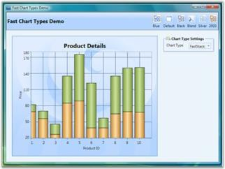 | markdownify }
{:.image }

A sample which demonstrates Fast Stacking Column Chart Types is available in the following sample installation path.

..My Documents\Syncfusion\Essential Studio\&lt;Version Number&gt;\WPF\Chart.WPF\Samples\3.5\WindowsSamples\Chart Performance\Fast chart types

Stacking Positive and Negative Values for Stacking Chart Types

Support ahs been provided for stacking positive and negative values in stacking chart types. Calculation logic must be the same and it has to adhere to the general standards of stacking chart type.

Chart types are:

* Stacking Column 
* Stacking Bar 
* Stacking Area

{  | markdownify }
{:.image }

{  | markdownify }
{:.image }

{  | markdownify }
{:.image }

Properties

_Properties_

<table>
<tr>
<td>
Property </td><td>
Description </td><td>
Type </td><td>
Value it accepts</td><td>
Any other dependencies/sub properties associated</td></tr>
<tr>
<td>
RequiresNegativeSeriesStack</td><td>
Specifies whether the positive and negative series should be stacked seperately.</td><td>
Bool</td><td>
True/False</td><td>
NA</td></tr>
</table>
###### Step Charts

Step Charts are similar to regular charts except that the values are drawn continuously, step by step without any gaps in-between. 

There are two types of step charts.

###### Break Lines

Line charts with missing data points can be drawn with gaps for the missing points. When there is a huge gap between consecutive points, we could make the lines break for more clarity.

SetBreakLineForNonIndexedData is used to specify whether the line segments could be drawn with break lines. SetBreakLineForDoublePointsDistanceMoreThan is used to set the distance for lines that should be broken.

[C#]

ChartLineType.SetBreakLineForNonIndexedData(Chart1.Areas[0].Series[0], true);

ChartLineType.SetBreakLineForDoublePointsDistanceMoreThan(Chart1.Areas[0].Series[0], 1);

If the data given are 1, 2, 4, 5, 8, 10, 12, 13, 14, 15, 16, 17 and the SetBreakLineForDoublePointsDistanceMoreThan is passed with a value 1, all points that don't have a point after 1 will not be drawn. Following screenshot shows the output for this data.

{ 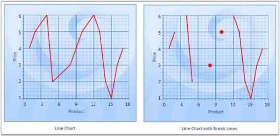 | markdownify }
{:.image }

> _Note: This feature can be applied for both Line and Spline type charts. This can be applied for both Double and DateTime type axis values._

Break Lines for Spline Type

[C#]

ChartSplineType.SetBreakLineForNonIndexedData(Chart1.Areas[0].Series[0], true);

ChartSplineType.SetBreakLineForDoublePointsDistanceMoreThan(Chart1.Areas[0].Series[0], 1);

The following code could be used to specify the break distance for axis with DateTime ValueTypes.

[C#]

ChartLineType.SetBreakLineForTimeSpanPointsDistanceMoreThan(Chart2.Areas[0].Series[0], new TimeSpan(1, 0, 0, 0));

ChartSplineType.SetBreakLineForTimeSpanPointsDistanceMoreThan(Chart2.Areas[0].Series[0], new TimeSpan(1, 0, 0, 0));

> 

> _Note: This feature can be applied for non-indexed data alone. It cannot be applied for 3D charts._

###### Heat Map Control

HeatMapControl is a control that lays out bound child items in rectangles, whose area is based on their "weight", and whose color is based on their "color weight". It can also be bound to hierarchical data.

_Property Table_

<table>
<tr>
<td>
Property</td><td>
Description</td></tr>
<tr>
<td>
ColorCalculationLevel</td><td>
specifies the items at a level (when bound to hierarchical data) for which the ColorWeight should be processedDefault value is -1, indicating this will be processed for all leaf nodes in the hierarchy. 0 indicates the top level of items in the bound hierarchy and so on. If you are adding HeatMapItems manually, make sure to set their Level property appropriately. This is a dependency property.</td></tr>
<tr>
<td>
ColorValuePath</td><td>
gets or sets a path to a value on the source object to serve as the "color weight" of the objectThis is a dependency property. This is used for items at all levels. It can be overridden for items at specific levels through the corresponding HeatMapItem's setting.</td></tr>
<tr>
<td>
ColorWeightsInfo</td><td>
contains computed information about the low and high colors in the bound items</td></tr>
<tr>
<td>
HighestWeightColor</td><td>
specifies the color that will be used on the item with the highest color weightThis is a dependency property. Default value is Green.</td></tr>
<tr>
<td>
ItemsLayoutMode</td><td>
specifies the mode in which items should be laid outThis setting will be applied at all levels. To customize this for specific levels, check the corresponding HeatMapItem setting. Default value is HeatMapLayoutMode.Squarified. This is a dependency property.</td></tr>
<tr>
<td>
LowestWeightColor</td><td>
specifies the color that will be used on the item with the lowest color weightThis is a dependency property. Default value is Cornsilk. </td></tr>
<tr>
<td>
MedianWeight</td><td>
specifies the "median color weight" on which the MedianWeightColor will be appliedThe valid values for this property are between 0 to 100. Default value is 50. This is a dependency property.</td></tr>
<tr>
<td>
MedianWeightColor</td><td>
specifies the color that will be used on the item with the median color weightThis is a dependency property. Default value is Yellow.</td></tr>
<tr>
<td>
PreferredItemsPanelHeight</td><td>
when bound to a grouped CollectionViewSource, this property specifies the preferred height you want to use for groupsDefault value is 300. This is a dependency property.</td></tr>
<tr>
<td>
PreferredItemsPanelWidth</td><td>
when bound to a grouped CollectionViewSource, this property specifies the preferred width you want to use for groupsDefault value is 300. This is a dependency property.</td></tr>
<tr>
<td>
WeightValuePath</td><td>
gets or sets a path to a value on the source object to serve as the "weight" of the objectThis is a dependency property. This is used for items at all levels. It can be overridden for items at specific levels, through the corresponding HeatMapItem's setting.</td></tr>
</table>
Gradient Support for Heat Maps

The heat map control contains the IsGradientBrush property, which supports linear gradient brushes in its interior.

Property Details

_Property Table_

<table>
<tr>
<td>
Name of Property</td><td>
Description </td><td>
Type of Property</td><td>
Value It Accepts</td><td>
Property syntax</td><td>
Sub properties</td></tr>
<tr>
<td>
IsGradientBrush</td><td>
Used to set the gradient brush for a heat map control.</td><td>
Dependency </td><td>
Bool or True/False.</td><td>
IsGradientBrush="True"</td><td>
LowestWeightGradient,  MedianWeightGradient,                          HighestWeightGradient (All properties are type of brushes)</td></tr>
</table>
Setting Gradient Brush for a Heat Map Control

The following code is used to set a gradient brush for a heat map control.

[XAML]

<syncfusion:HeatMapControl Grid.Row="0" x:Name="heatMap" IsGradientBrush="True"  LowestWeightGradient="{StaticResource SeriesBInterior}"  

MedianWeightGradient="{StaticResource SeriesAInterior}"                                     HighestWeightGradient="{StaticResource SeriesCInterior}" />

When the code runs, the following output displays.

{  | markdownify }
{:.image }

Resize the Font to Fit in the HeatMap Item

This feature automatically resizes the content to fit inside the HeatMap item, so that the font size of the content is adjusted according to the width of the Heat Map item and the orientation is changed according to the height and width of the HeatMap item.

Use Case Scenarios

It is used in the field where data are represented in a two dimensional map namely Population Survey. The data of the survey will automatically fit into the HeatMap item by resizing its font size.

{  | markdownify }
{:.image }

Sample Link

The path to access the sample is: 

_&lt;sample installation location&gt;\Syncfusion\EssentialStudio\Version Number\WPF\Chart.WPF\WindowSamples\3.5\Controllers \Heat Map\FlatListDemo"_

Text Wrapping Behavior in HeatMapItem

The HeatMap control ships with the enhancement of customizing the text within the HeatMap item using the enum property TextIntersectAction which includes Shrink and Wrap to shrink the size of the overlapped text on resizing and to support multiline text respectively.

Use Case Scenarios

1. Avoid overlapping of text on resizing.
2. Make the text inside the HeatMapItem readable.

Properties

_Properties_

<table>
<tr>
<td>
Property</td><td>
Description</td><td>
Type</td><td>
Data Type</td></tr>
<tr>
<td>
TextIntersectAction </td><td>
Sets the intersect action for the text in the HeatMapItem.</td><td>
Dependency</td><td>
Enum</td></tr>
</table>
Sample Links

1. Open the Sample Browser and select the WPF platform.
2. Select the Chart product.
3. SB > Chart > Heat Map > Flat List Demo.

Adding Text Wrapping Behavior in HeatMapItem to an Application

To add the text wrapping support to the HeatMapItem:

[XAML]

&lt;syncfusion:HeatMapControl x:Name="heatMap" TextIntersectAction="Wrap"/&gt;

[C#]

 heatMap.TextIntersectAction = TextIntersectActions.Wrap;

{ 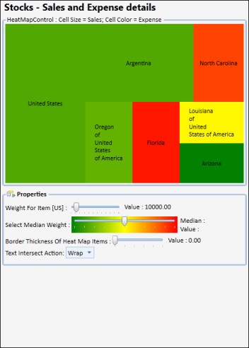 | markdownify }
{:.image }

To shrink the text for the HeatMapItem.

[XAML]

&lt;syncfusion:HeatMapControl x:Name="heatMap" TextIntersectAction="Shrink"/&gt;

[C#]

 heatMap.TextIntersectAction = TextIntersectActions.Shrink;

{  | markdownify }
{:.image }

###### FastChart

Performance Improvements and New fast chart types 

Fast Column and Fast Scatter Charts are similar to Column and Scatter charts respectively. It uses vertical bars (called columns) and scattered circles (called ellipse) to display different values of one or more items.

The advantages of Fast Charts:

* Loads faster than other charts
* Ensures high performance for displaying data. 
* They can be used as real time charts to render huge number of data points.

Use Case Scenarios

It can be used for rendering large number of points like Stock Market Analysis.

Adding FastScatter to an Application 

FastScatter and FastColumn Chart types can be added using the property Type in ChartSeries.

[XAML]

//Add FastScatter chart type to the series.

  &lt;sync:ChartSeries  Type="FastScatter" /&gt;

[C#]

//Add FastScatter chart type to the series.

Chart1.Areas[0].Series[0].Type = ChartTypes.FastScatter;

{  | markdownify }
{:.image }

[XAML]

//Add FastColumn chart type to the series.

  &lt;sync:ChartSeries  Type="FastColumn" /&gt;

[C#]

//Add FastColumn chart type to the series.

Chart1.Areas[0].Series[0].Type = ChartTypes.FastColumn;

{  | markdownify }
{:.image }

Customizing the Height and Width of the Fast Scatter Chart

You can modify the size of the Fast Scatter chart by using the Height and Width properties of FastScatter-Type, as shown in the following code example:

[XAML]

<syncfusion:ChartSeries Name="Series1" Type="FastScatter" 

DataSource="{Binding ExpensiveCarDetails}" BindingPathX="Position" BindingPathsY="Price" syncfusion:ChartFastScatterType.FastScatterHeight="30" syncfusion:ChartFastScatterType.FastScatterWidth="30">

&lt;/syncfusion:ChartSeries&gt;

[C#]

ChartFastScatterType.SetFastScatterWidth(seriesname, 30);
ChartFastScatterType.SetFastScatterHeight(seriesname, 30);

###### Custom Charts

Essential Chart WPF now comes with the Custom Chart Type that allows users to customize the appearance of the graph thereby improving the look and feel of the chart. This is achieved by initializing the “Custom” enum value to the Type property of ChartSeries control and by adding the customized chart to the ChartType property of ChartSeries.

Use Case Scenarios

Users can draw a new chart type that is not available in Essential Chart WPF. Users can create a new HybirdAreaLine chart type, which is a combination of Area and Line chart types.

Adding Custom Chart Type to an Application 

To set the Custom type feature in chart application: 

1. Initialize the Custom Enum value to the Type property of ChartSeries control.

[XAML]

           &lt;syncfusion:ChartSeries Type="Custom" /&gt;

[C#]

            //Initialize Chart type as Custom

            chart.Areas[0].Series[0].Type = ChartTypes.Custom;

4. Create a new custom class, which should inherit the Segment abstract class. 
5. Create another new custom class, which should be inherited by ChartType class and override the CalculateSegments method to customize the new chart type based on requirements. 
6. In these CalculateSegments methods, add create new Segment object and add it to the Segments property of ChartSeries control.

[C#]

    public class HybridChartSegment : ChartSegment

    {

        public override void Update(IChartTransformer transformer)

        {

//transformer.TransformToVisible method has used to convert actual Chart points into the pixel coordinates

            ………

        }       

    }

    public class HybridChartType : ChartType

    {

        protected override void CalculateSegments(ChartSeries series, ChartIndexedDataPoint[] points)

        {

                …..

                //Add the HybirdArea segment to the Chart Series

                series.Segments.Add(new HybridChartSegment(segmentPoints.ToArray(), points, series, hybirdIntersectLine));

                …..

         }

     }

7. Create a new object for your own custom class and initialize it to the ChartType property of ChartSeries control.

[C#]

            //Inititalize the customized Hybrid Area line type to ther Series.

            chart.Areas[0].Series[0].ChartType = new HybridChartType();

8. Finally, define a Template design for your new custom chart type by initializing the Template property of ChartSeries control.

[XAML]

        &lt;!--Hybird Area Line Type Template--&gt;

        &lt;DataTemplate x:Key="HybirdAreaLineType"&gt;

            &lt;Grid&gt;

                &lt;Grid Clip="{Binding Geometry}"&gt;

                    &lt;Rectangle Fill="{Binding HighValueColor}"/&gt;

                    &lt;Rectangle Fill="{Binding LowValueColor}"  Margin="{Binding HybirdMargin}"  /&gt;

                &lt;/Grid&gt;

                &lt;Line X1="0" Y1="0" X2="{Binding Series.Area.ActualWidth}" Y2="0"  Margin="{Binding HybirdMargin}" HorizontalAlignment="Stretch" VerticalAlignment="Stretch" Stroke="{Binding LineColor}" StrokeThickness="5"/&gt;

            &lt;/Grid&gt;

        &lt;/DataTemplate&gt;

[C#]

//Initialize the Template for HybirdArea Line type.            chart.Areas[0].Series[0].Template = App.Current.Resources["HybirdAreaLineType"] as DataTemplate;

{  | markdownify }
{:.image }

Sample Link

To run the UI Chart WPF samples:

1. On the dashboard, click the WPF Combo box and then select Run Locally Installed Samples. The WPF sample browser opens.
2. Select Chart.
3. Navigate to Chart Gallery -> CustomChart Type demo.
4. Click the Run Sample button.

Or

5. Go to

_&lt;&lt;EssentialStudioInstalledLocation&gt;>\Syncfusion\EssentialStudio\&lt;Version&gt;\WPF\Chart.WPF\Samples\3.5\WindowsSamples\Chart Gallery\ Custom Chart Type Demo_

There are two folders namely C Sharp and Visual Basic. The user can choose the required folder.

6. Run the sample by opening the project file.
##### Chart Axis

###### Indexed X Values

By default points in a series are plotted against their X and Y values. However in some cases the X values are meaningless, they simply represent categories, and you do not want to plot the points against such X values. Such an X axis that ignores the X-values and simply uses the positional value of a point in a series is said to be indexed.

The following code example could be used to make a series as Indexed.

[XAML]

&lt;sfchart:ChartSeries IsIndexed="True" /&gt;

[C#]

//Sets the series as indexed

series.IsIndexed = true;            

In the following figure, the first chart shows a column chart that is not-indexed while the second chart shows a column chart whose x-axis is indexed.

{  | markdownify }
{:.image }

{  | markdownify }
{:.image }

###### ChartAxis Range

Essential Chart for WPF lets you customize the range and intervals that are displayed in the axes. This section discusses the following topics.

* Axis Range Customization
* AutoRange Customization
* Custom Range Support
* RangeCalculationMode
* VisibleRange

Axis Range Customization

You can customize the range and intervals that are displayed in the axes by using the following ChartAxis properties.

_ChartAxis Properties_

<table>
<tr>
<td>
ChartAxis Properties</td><td>
Description</td></tr>
<tr>
<td>
IsAutoSetRange</td><td>
A bool property specifies whether the range of the axis should be set automatically or a custom specified range will be used. Default is true (auto range).</td></tr>
</table>
Auto Range Customization

With the default auto range calculation setting (IsAutoSetRange=true), the following properties let you customize the automatic range calculation.

_ChartAxis Properties_

<table>
<tr>
<td>
ChartAxis Properties</td><td>
Description</td></tr>
<tr>
<td>
DesiredIntervalCount</td><td>
An integer property used to indicate the preferred total number of intervals to be displayed for auto range calculation.</td></tr>
<tr>
<td>
RangePadding</td><td>
An enum property, used to specify the spacing of the chart axis for auto range calculation. This property can take three values:None – The range of the axis will be calculated from the minimum value in the data source to the maximum value in the data source.Normal – The range of the axis will be calculated from the nearest multiples of the interval from the minimum and maximum values in the data source.Additional – The range of the axis will be calculated from one interval lower that the minimum value to one interval higher than the maximum value in the data source in terms of multiples of the interval.</td></tr>
<tr>
<td>
AdditionalRanges</td><td>
This DoubleRange property is used to customize the Additional Ranges added to the Range when RangePadding is set as Additional. If Additional padding is set to (2,3), it will add 2 intervals at the start of the range and 3 intervals at the end of the range respective to its Axis ValueType.</td></tr>
<tr>
<td>
IsSetDataValueRange</td><td>
A boolean property used to calculate the axis range based on the modified data value range.</td></tr>
</table>

> _Note: The DesiredIntervalsCount will not be taken into account when the interval is set._

[XAML]

&lt;sfchart:Chart&gt;

  &lt;sfchart:ChartArea Background="LightGray" GridBackground="White"&gt;

    &lt;sfchart:ChartArea.SecondaryAxis&gt;

      &lt;sfchart:ChartAxis IsAutoSetRange="True" DesiredIntervalsCount="5"RangePadding="Additional"/&gt;

    &lt;/sfchart:ChartArea.SecondaryAxis&gt;

    &lt;sfchart:ChartSeries Type="Column" DataSource="{StaticResource SeriesData1}" BindingPathX="Year" BindingPathsY="Sales"/&gt;

  &lt;/sfchart:ChartArea&gt;

&lt;/sfchart:Chart&gt;

[C#]

Chart1.Areas[0].SecondaryAxis.IsAutoSetRange = true;

Chart1.Areas[0].SecondaryAxis.RangePadding = ChartRangePaddingType.Additional;

Chart1.Areas[0].SecondaryAxis.DesiredIntervalsCount = 5;

{  | markdownify }
{:.image }

{  | markdownify }
{:.image }

{  | markdownify }
{:.image }

Custom Range Support

With the auto range calculation turned off (IsAutoSetRange=false), use the following properties to format the chart on the custom range and interval length to use. 

_ChartAxis Properties_

<table>
<tr>
<td>
ChartAxis Properties</td><td>
Description</td></tr>
<tr>
<td>
ValueType</td><td>
Specifies the metrics for the axis range. Can be Double, DateTime, or String.</td></tr>
<tr>
<td>
Range</td><td>
This DoubleRange type property specifies the custom range to use when the ValueType=Double.</td></tr>
<tr>
<td>
Interval</td><td>
An integer property that indicates the length of the intervals in the custom range specified above when the ValueType=Double.</td></tr>
<tr>
<td>
DateTimeRange</td><td>
A DateTimeRange type property that lets you specify the start and end of the axis range in DateTime when the ValueType=DateTime.</td></tr>
<tr>
<td>
DateTimeInterval</td><td>
The frequency at which intervals should be rendered. Specified in TimeSpan, when ValueType=DateTime.</td></tr>
<tr>
<td>
MinimumInterval</td><td>
An integer property that indicates the length of the MinimumInterval in the custom range specified above when the ValueType=Double. The interval will not fall below this value.</td></tr>
<tr>
<td>
MinimumDateTimeInterval</td><td>
The frequency at which the MinimumDateTimeInterval should be rendered. Specified in TimeSpan, when the ValueType=DateTime. The DateTime Interval will not fall below this value.</td></tr>
</table>

[XAML]

&lt;sfchart:Chart&gt;

  &lt;sfchart:ChartArea Background="LightGray" GridBackground="White"&gt;

    &lt;sfchart:ChartArea.SecondaryAxis&gt;

      &lt;sfchart:ChartAxis IsAutoSetRange="False" Range="0,100" Interval="25"MinimumInterval="25"/&gt;

    &lt;/sfchart:ChartArea.SecondaryAxis&gt;

    &lt;sfchart:ChartSeries Type="Column" DataSource="{StaticResource SeriesData1}" BindingPathX="Year" BindingPathsY="Sales"/&gt;

  &lt;/sfchart:ChartArea&gt;

&lt;/sfchart:Chart&gt;

[C#]

Chart1.Areas[0].SecondaryAxis.IsAutoSetRange = false;

Chart1.Areas[0].SecondaryAxis.Range = new DoubleRange(0, 100);

Chart1.Areas[0].SecondaryAxis.Interval = 25;

Chart1.Areas[0].SecondaryAxis.MinimumInterval = 25;

{ 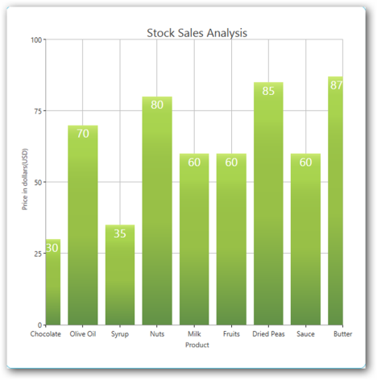 | markdownify }
{:.image }

> _Note:_ 

> _The Range set for an axis with Double ValueType and DateTimeRange set for an axis with the DateTime ValueType will be taken into account only when the IsAutoSetRange property is set as false._

> _The Interval and DateTimeInterval properties could be used to set intervals when the range calculation is done automatically or when a custom range is set._

> _While using custom ranges, make sure that the series.IsIndexed property is set as false. This will ensure that the actual x-axis values and the range will be taken into account._

> _Ensure that the Interval value is proportionate to the Range value. When you set a small value as the Interval to an Axis with a large Range, it results in more gridlines, generating an “Out of Memory” exception._

RangeCalculationMode

Range Calculation mode is used to position the segments between TickLines and on the TickLines. When the SegmentPosition is BetweenTicks, the segment will render between the gridlines. When the SegmentPosition is OnTicks, the segment will render on the gridlines.

Some charts need to render between TickLines so that the series segments will not be hidden. For example, Column, Bar, Stacking Column, and Stacking Bar Charts should render between the TickLine to display the whole segment. On the other hand, Line, Area, and Stacking Area charts can be rendered on the TickLines.

However, in some cases we require either of the types to be consistent. For this we could use the RangeCalculationMode property. 

_ChartAxis Property_

<table>
<tr>
<td>
Chart Axis Property</td><td>
Description</td></tr>
<tr>
<td>
RangeCalculationMode</td><td>
An enum property used to specify the segment position. This property can take two values:AdjustAcrossChartTypes: Segment will render between the ticks. Segment position for this mode will be BetweenTicks.ConsistentAcrossChartTypes: Segment will render from the 1st axis. Segment position for this mode will be OnTicks. In this case, column charts will also be drawn with same range as other charts, making the first and last segments hidden partially. This is the default mode.</td></tr>
</table>
The following code example illustrates how to set the Range Calculation mode for the chart axis.

[XAML]

&lt;syncfusion:ChartArea&gt;

    &lt;syncfusion:ChartArea.PrimaryAxis&gt;

        &lt;syncfusion:ChartAxis IsAutoSetRange="True" RangeCalculationMode="AdjustAcrossChartTypes"/&gt;

    &lt;/syncfusion:ChartArea.PrimaryAxis&gt;

&lt;/syncfusion:ChartArea&gt;

[C#]

 // Create an instance for the Chart and Chart Area.

Chart chart = new Chart();

ChartArea area = new ChartArea();

chart.Areas.Add(area);

// Initialize the Range Calculation Mode values.

chart.Areas[0].PrimaryAxis.RangeCalculationMode = RangeCalculationMode.ConsistentAcrossChartTypes;

{  | markdownify }
{:.image }

{  | markdownify }
{:.image }

Visible Range

It is possible to get the Range that is visible in the ChartAxis by using the ChartAxis.VisibleRange property.

[C#]

DoubleRange range = this.Chart1.Areas[0].PrimaryAxis.VisibleRange;

MessageBox.Show("Start " + range.Start.ToString() +", "+ "End " + range.End.ToString());

> 

> _Note: Visible Range can also be calculated for the changed value of the range by using the Axis.RangeChanged event._

> 

>  _For details, see_ Chart Axis Events_._

See Also

Indexed X Values

Support to Set Axis Range Based on the Data Value

This feature implements support for sharing a data range between axes, and concurrently both axes will have appropriate visible labels rendered on them based on the modified data range at run time.

Use Case Scenarios

In a real-time data charting scenario such as a stock analysis, if the number of years to be visible in the range has been modified at run time, then the alternative y-axis range will also get modified based on the modified data range value in the x-axis.

Properties

_Properties_

<table>
<tr>
<td>
Property</td><td>
Description</td><td>
Type</td><td>
Data Type</td></tr>
<tr>
<td>
IsSetDataValueRange </td><td>
This property  enables when the user wants to calculate the range based on the data point value range</td><td>
Dependency Property</td><td>
Binary, true/false </td></tr>
</table>
Sample Link

Open the Sample Browser and select the following,

1. Click User Interface > WPF and select Run Samples 
2. Select the Chart product
3. Select the Chart Axis > Chart Axis Configuration demo

Adding IsSetDataValueRange to an Application

<table>
<tr>
<td>
[XAML]  &lt;syncfusion:ChartAxis x:Name="YAxis" IsAutoSetRange="True" RangeCalculationMode="Default" RangePadding="Normal" IsSetDataValueRange="True"/&gt;</td></tr>
<tr>
<td>
[C#]            this.YAxis.IsAutoSetRange = true;            this.YAxis.IsSetDataValueRange = true;</td></tr>
</table>

{  | markdownify }
{:.image }

{ 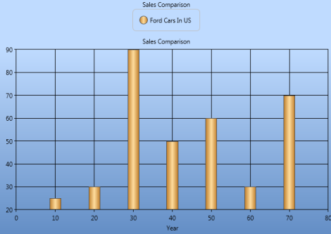 | markdownify }
{:.image }

###### ChartAxis GridLines

Chart for WPF allows you to show/hide the grid lines in the Chart Area using some attached properties in ChartArea. It also allows you to customize the look and feel of the grid lines using some attached properties.

The following lines of code can be used to hide the grid lines of an axis.

[XAML]

&lt;Window.Resources&gt;

  &lt;local:ProductSalesCollection x:Key="SeriesData1"/&gt;

&lt;/Window.Resources&gt;

&lt;sfchart:Chart&gt;

  &lt;sfchart:ChartArea Background="LightGray" GridBackground="White"&gt;

    &lt;sfchart:ChartArea.PrimaryAxis&gt;

      &lt;sfchart:ChartAxis sfchart:ChartArea.ShowGridLines="False"/&gt;

    &lt;/sfchart:ChartArea.PrimaryAxis&gt;

    &lt;sfchart:ChartArea.SecondaryAxis&gt;

      &lt;sfchart:ChartAxis sfchart:ChartArea.ShowGridLines="False"/&gt;

    &lt;/sfchart:ChartArea.SecondaryAxis&gt;

    &lt;sfchart:ChartSeries Type="Column" DataSource="{StaticResource SeriesData1}" BindingPathX="Year" BindingPathsY="Sales"/&gt;

  &lt;/sfchart:ChartArea&gt;

&lt;/sfchart:Chart&gt;

[C#]

ChartArea.SetShowGridLines(Chart1.Areas[0].PrimaryAxis, false);

ChartArea.SetShowGridLines(Chart1.Areas[0].SecondaryAxis, false);

{  | markdownify }
{:.image }

Grid lines style can be changed using the ChartArea.GridLineStroke attached property as follows.

[XAML]

&lt;sfchart:ChartArea Background="LightGray" GridBackground="White"&gt;

  &lt;sfchart:ChartArea.PrimaryAxis&gt;

    &lt;sfchart:ChartAxis&gt;

      &lt;sfchart:ChartArea.GridLineStroke&gt;

        &lt;Pen Brush="#c6c6c6" Thickness="0.75"&gt;

          &lt;Pen.DashStyle&gt;

            &lt;DashStyle Dashes="1,2"/&gt;

          &lt;/Pen.DashStyle&gt;

        &lt;/Pen&gt;

      &lt;/sfchart:ChartArea.GridLineStroke&gt;

    &lt;/sfchart:ChartAxis&gt;

  &lt;/sfchart:ChartArea.PrimaryAxis&gt;

  &lt;sfchart:ChartArea.SecondaryAxis&gt;

    &lt;sfchart:ChartAxis&gt;

      &lt;sfchart:ChartArea.GridLineStroke&gt;

        &lt;Pen Brush="#C6c6c6" Thickness="0.75"/&gt;

      &lt;/sfchart:ChartArea.GridLineStroke&gt;

    &lt;/sfchart:ChartAxis&gt;

  &lt;/sfchart:ChartArea.SecondaryAxis&gt;

  &lt;sfchart:ChartSeries Type="Column" DataSource="{StaticResource SeriesData1}" BindingPathX="Year" BindingPathsY="Sales"/&gt;

&lt;/sfchart:ChartArea&gt;

[C#]

Pen pen = new Pen(Brushes.LightGray, 0.75);

DashStyle style = new DashStyle();

DoubleCollection col = new DoubleCollection(2);

col.Add(1);

col.Add(2);

style.Dashes = col;

pen.DashStyle = style;

ChartArea.SetGridLineStroke(Chart1.Areas[0].PrimaryAxis, pen);

Pen pen1 = new Pen(Brushes.LightGray, 0.75);

ChartArea.SetGridLineStroke(Chart1.Areas[0].SecondaryAxis, pen1);

{  | markdownify }
{:.image }

Small Tick Lines

The number of small ticks to be drawn per interval can be controlled using the SmallTicksPerInterval property. The following lines of code can be used to change the number of small ticks to draw per interval.

[XAML]

&lt;Window.Resources&gt;

  &lt;local:ProductSalesCollection x:Key="SeriesData1"/&gt;

&lt;/Window.Resources&gt;

&lt;sfchart:Chart&gt;

  &lt;sfchart:ChartArea Background="LightGray" GridBackground="White"&gt;

    &lt;sfchart:ChartArea.PrimaryAxis&gt;

      &lt;sfchart:ChartAxis SmallTicksPerInterval="4"/&gt;

    &lt;/sfchart:ChartArea.PrimaryAxis&gt;

    &lt;sfchart:ChartArea.SecondaryAxis&gt;

      &lt;sfchart:ChartAxis SmallTicksPerInterval="6"/&gt;

    &lt;/sfchart:ChartArea.SecondaryAxis&gt;

    &lt;sfchart:ChartSeries Type="Column" DataSource="{StaticResource SeriesData1}" BindingPathX="Year" BindingPathsY="Sales"/&gt;

  &lt;/sfchart:ChartArea&gt;

&lt;/sfchart:Chart&gt;

[C#]

Chart1.Areas[0].PrimaryAxis.SmallTicksPerInterval= 4;

Chart1.Areas[0].SecondaryAxis.SmallTicksPerInterval = 6;

{  | markdownify }
{:.image }

See Also

ChartAxis Lines, ChartAxis OriginLines, Chart StripLines

###### ChartAxis Lines

The ChartAxis line and tick lines can be customized using the LineStroke and TickLineStroke properties as follows.

[XAML]

&lt;sfchart:Chart&gt;

  &lt;sfchart:ChartArea Background="LightGray" GridBackground="White"&gt;

    &lt;sfchart:ChartArea.PrimaryAxis&gt;

      &lt;sfchart:ChartAxis sfchart:ChartArea.ShowGridLines="False"&gt;

        &lt;sfchart:ChartAxis.LineStroke&gt;

          &lt;Pen Brush="Blue" Thickness="2"/&gt;

        &lt;/sfchart:ChartAxis.LineStroke&gt;

        &lt;sfchart:ChartAxis.TickLineStroke&gt;

          &lt;Pen Brush="MidnightBlue" Thickness="2"/&gt;

        &lt;/sfchart:ChartAxis.TickLineStroke&gt;

      &lt;/sfchart:ChartAxis&gt;

    &lt;/sfchart:ChartArea.PrimaryAxis&gt;

    &lt;sfchart:ChartArea.SecondaryAxis&gt;

      &lt;sfchart:ChartAxis sfchart:ChartArea.ShowGridLines="False"&gt;

        &lt;sfchart:ChartAxis.LineStroke&gt;

          &lt;Pen Brush="Green" Thickness="2"/&gt;

        &lt;/sfchart:ChartAxis.LineStroke&gt;

        &lt;sfchart:ChartAxis.TickLineStroke&gt;

          &lt;Pen Brush="Green" Thickness="2"/&gt;

        &lt;/sfchart:ChartAxis.TickLineStroke&gt;

      &lt;/sfchart:ChartAxis&gt;

    &lt;/sfchart:ChartArea.SecondaryAxis&gt;

    &lt;sfchart:ChartSeries Type="Column" DataSource="{StaticResource SeriesData1}" BindingPathX="Year" BindingPathsY="Sales"/&gt;

  &lt;/sfchart:ChartArea&gt;

&lt;/sfchart:Chart&gt;

[C#]

Pen pen = new Pen(Brushes.Blue, 2);

Chart1.Areas[0].PrimaryAxis.LineStroke = pen;

Chart1.Areas[0].PrimaryAxis.TickLineStroke = pen;

Pen pen1 = new Pen(Brushes.Green, 2);

Chart1.Areas[0].SecondaryAxis.LineStroke = pen1;

Chart1.Areas[0].SecondaryAxis.TickLineStroke = pen1;

ChartArea.SetShowGridLines(Chart1.Areas[0].PrimaryAxis, false);

ChartArea.SetShowGridLines(Chart1.Areas[0].SecondaryAxis, false);

{ 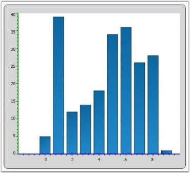 | markdownify }
{:.image }

See Also

ChartAxis GridLines,ChartAxis OriginLines, Chart StripLines

###### Chart Striplines

Chart for WPF enables the user to highlight a specific area of the chart by adding StripLines to a ChartAxis. The strip lines length and width can be customized, a text label can be specified and the look and feel can be customized too.

Start, Frequency and Width of the line

The following properties let you customize the start, frequency and width of the lines.

_ChartStripLine Properties_

<table>
<tr>
<td>
ChartStripLine Properties</td><td>
Description</td></tr>
<tr>
<td>
StartFromAxis</td><td>
A bool property used to specify whether the stripline starts from the beginning of the axis.</td></tr>
<tr>
<td>
Offset</td><td>
If StartFromAxis is true, this property lets you add an Offset to that starting location.</td></tr>
<tr>
<td>
Start</td><td>
If StartFromAxis is false, this property specifies where exactly the stripline should start.</td></tr>
<tr>
<td>
Width</td><td>
This double property lets you specify the width of each (optionally repeating) strip line.</td></tr>
<tr>
<td>
RepeatEvery</td><td>
Specifies how often this stripline should repeat or the frequency.</td></tr>
<tr>
<td>
RepeatUntil</td><td>
A double property that specifies until where the striplines should repeat.</td></tr>
</table>
Appearance

_Properties_

<table>
<tr>
<td>
Properties</td><td>
Description</td></tr>
<tr>
<td>
Interior</td><td>
A brush property used to specify the color to be filled in the stripline area.</td></tr>
<tr>
<td>
Stroke</td><td>
A Pen type used to specify the border style around the strip area.</td></tr>
</table>
Text Label

_Text Label_

<table>
<tr>
<td>
Properties</td><td>
Description</td></tr>
<tr>
<td>
Text</td><td>
A FormattedText property that lets you specify the text and appearance of the label for this strip line.</td></tr>
<tr>
<td>
TextAlignment</td><td>
Lets you specify how this text label should be aligned.</td></tr>
<tr>
<td>
VerticalText</td><td>
Boolean property specifying if the text should be rendered vertically.</td></tr>
<tr>
<td>
TextBackground</td><td>
A Brush for the text background.</td></tr>
</table>
Code Example

[XAML]

&lt;sfchart:Chart&gt;

  &lt;sfchart:ChartArea Background="LightGray" GridBackground="White"&gt;

    &lt;sfchart:ChartArea.PrimaryAxis&gt;

      &lt;sfchart:ChartAxis sfchart:ChartArea.ShowGridLines="False"&gt;

      &lt;/sfchart:ChartAxis&gt;

    &lt;/sfchart:ChartArea.PrimaryAxis&gt;

    &lt;sfchart:ChartArea.SecondaryAxis&gt;

      &lt;sfchart:ChartAxis sfchart:ChartArea.ShowGridLines="False"&gt;

        &lt;sfchart:ChartAxis.StripLines&gt;

          &lt;sfchart:ChartStripLine x:Name="strip1" Interior="MintCream" Offset="0" StartFromAxis="True" Width="15"&gt;

          &lt;/sfchart:ChartStripLine&gt;

          &lt;sfchart:ChartStripLine x:Name="strip2" Interior="MistyRose" Offset="15" StartFromAxis="True" Width="15"&gt;

          &lt;/sfchart:ChartStripLine&gt;

          &lt;sfchart:ChartStripLine x:Name="strip3" Interior="LightCoral" Offset="30" StartFromAxis="True" Width="10"&gt;

          &lt;/sfchart:ChartStripLine&gt;

        &lt;/sfchart:ChartAxis.StripLines&gt;

      &lt;/sfchart:ChartAxis&gt;

    &lt;/sfchart:ChartArea.SecondaryAxis&gt;

&lt;sfchart:ChartSeries Name="Series1" Interior="Red" Type="Scatter" DataSource="{Binding Source = {StatisResource myXmlData}, XPath=Products/Product}" BindingPathX="X" BindingPathsY="Series1Y"/&gt;

 &lt;sfchart:ChartSeries Name="Series2" Interior="Blue" Type="Scatter" DataSource="{Binding Source = {StatisResource myXmlData}, XPath=Products/Product}" BindingPathX="X" BindingPathsY="Series1Y1"/&gt;

  &lt;/sfchart:ChartArea&gt;

&lt;/sfchart:Chart&gt;

To set the labels for the striplines, use the following code example.

[C#]

strip1.Text = new FormattedText("Low", CultureInfo.CurrentCulture, FlowDirection.LeftToRight, new Typeface("Times New Roman"), 20, Brushes.Black);

strip2.Text = new FormattedText("Average", CultureInfo.CurrentCulture, FlowDirection.LeftToRight, new Typeface("Times New Roman"), 20, Brushes.Black);

strip3.Text = new FormattedText("High", CultureInfo.CurrentCulture, FlowDirection.LeftToRight, new Typeface("Times New Roman"), 20, Brushes.Black);

{  | markdownify }
{:.image }

See Also

ChartAxis Lines, ChartAxis GridLines, ChartAxis OriginLines, Chart StripLines

Stripline Customization

Essential Chart for WPF now supports customizing the position of strip line text. Users can set the strip line text using the TextOffsetX and TextOffsetY properties. 

Property Details

_Property_

<table>
<tr>
<td>
Name of Property</td><td>
Description </td><td>
Type of Property</td><td>
Value It Accepts</td><td>
Property Syntax</td></tr>
<tr>
<td>
TextOffsetX</td><td>
Sets the horizontal position of strip line text.</td><td>
Dependency </td><td>
double</td><td>
  csY.TextOffsetX = 10;</td></tr>
<tr>
<td>
TextOffsetY</td><td>
Sets the vertical position of strip line text.</td><td>
Dependency </td><td>
double</td><td>
            csY.TextOffsetY = 20;</td></tr>
</table>
Setting the Position of Strip Line Text

The following code is used to set the position of strip line text.

[C#]

ChartStripLine csY = new ChartStripLine();

            //Set the stripline text 

   csY.Text = new FormattedText("Historical High - 95'F", CultureInfo.CurrentCulture, FlowDirection.LeftToRight, new Typeface("Arial"), 10, Brushes.Black);

            //Set the stripline position 

            csY.TextOffsetX = 10;

            csY.TextOffsetY = 20;

Before setting the offset:

{  | markdownify }
{:.image }

After setting the offset:

{  | markdownify }
{:.image }

###### ChartAxis OriginLines

Custom Origin Lines can be drawn for the X and Y axis by using the ChartArea.ShowOriginLine attached property as follows. The ChartArea.OriginLineStroke can be used to customize the look and feel.

[XAML]

&lt;sfchart:ChartArea GridBackground="White"&gt;

  &lt;sfchart:ChartArea.PrimaryAxis&gt;

    <sfchart:ChartAxis RangePadding="Additional" sfchart:ChartArea.ShowGridLines="False" sfchart:ChartArea.ShowOriginLine="True" Origin="5"

    SmallTicksPerInterval="0">

      &lt;sfchart:ChartArea.OriginLineStroke&gt;

        &lt;Pen Brush="Maroon" Thickness="3"/&gt;

      &lt;/sfchart:ChartArea.OriginLineStroke&gt;

    &lt;/sfchart:ChartAxis&gt;

  &lt;/sfchart:ChartArea.PrimaryAxis&gt;

  &lt;sfchart:ChartArea.SecondaryAxis&gt;

    <sfchart:ChartAxis RangePadding="Additional" sfchart:ChartArea.ShowGridLines="False" sfchart:ChartArea.ShowOriginLine="True" Origin="2"

    SmallTicksPerInterval="0">

      &lt;sfchart:ChartArea.OriginLineStroke&gt;

        &lt;Pen Brush="Green" Thickness="3"/&gt;

      &lt;/sfchart:ChartArea.OriginLineStroke&gt;

    &lt;/sfchart:ChartAxis&gt;

  &lt;/sfchart:ChartArea.SecondaryAxis&gt;

  &lt;sfchart:ChartSeries Type="Scatter" DataSource="{StaticResource SeriesData2}" BindingPathX="X"  BindingPathsY="Y"  Interior="Blue"/&gt;

  <sfchart:ChartSeries Type="Scatter" DataSource="{StaticResource SeriesData1}"

  BindingPathX="X" BindingPathsY="Y"  Interior="Red"/>

&lt;/sfchart:ChartArea&gt;

[C#]

ChartArea.SetShowOriginLine(Chart1.Areas[0].PrimaryAxis, true);

ChartArea.SetShowOriginLine(Chart1.Areas[0].SecondaryAxis, true);

Pen pen = new Pen(Brushes.Maroon, 3);

ChartArea.SetOriginLineStroke(Chart1.Areas[0].PrimaryAxis, pen);

Pen pen1 = new Pen(Brushes.Green, 3);

ChartArea.SetOriginLineStroke(Chart1.Areas[0].SecondaryAxis, pen1);

Chart1.Areas[0].PrimaryAxis.Origin = 5;

Chart1.Areas[0].SecondaryAxis.Origin = 2;

{  | markdownify }
{:.image }

See Also

ChartAxis Lines, ChartAxis GridLines, Chart StripLines

###### Chart Axis Ticks

Chart for WPF allows to customize the length of the Axis Ticks and SmallTicks by using the ChartAxis.TickSize and ChartAxis.SmallTicksize properties.

_ChartAxis Property_

<table>
<tr>
<td>
ChartAxis Property</td><td>
Description</td></tr>
<tr>
<td>
TickSize</td><td>
gets or sets the length of the axis tick</td></tr>
<tr>
<td>
SmallTickSize</td><td>
gets or sets the length of the axis small tick</td></tr>
</table>

[XAML]

&lt;syncfusion:ChartArea.PrimaryAxis&gt;

    &lt;syncfusion:ChartAxis TickSize="7" SmallTickSize="4" /&gt;

&lt;/syncfusion:ChartArea.PrimaryAxis&gt;                       

[C#]

// Sets the Axis tick size.

area.PrimaryAxis.TickSize = 7;

area.PrimaryAxis.SmallTickSize = 3;                                 

The following image illustrates Chart with Axis TickSize and SmallTickSize set.

{ 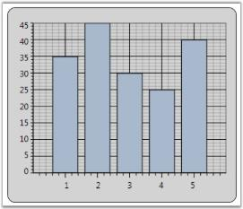 | markdownify }
{:.image }

See Also

ChartAxis GridLines, ChartAxis Lines, ChartAxis OriginLines

Support for customizing the Label position and TickLines along with the OrginAxis

This feature supports customizing the label position and TickLines along with the OrginAxis. Labels can be moved based on the AxisLabels type. Position of label will be changed based on LabelsPosition, and TickLines will be changed based on TickLinesPosition. 

Properties 

_Properties Table_

<table>
<tr>
<td>
Property </td><td>
Description </td><td>
Type </td><td>
Data Type </td><td>
Reference links </td></tr>
<tr>
<td>
ChartAxisLabels </td><td>
Used to set the position of axis label. </td><td>
Dependency Property</td><td>
 AxisLabels</td><td>
NA</td></tr>
<tr>
<td>
ChartTickLinesPosition</td><td>
Used to set the position of tickline.</td><td>
Dependency Property</td><td>
TickLinesPosition</td><td>
NA</td></tr>
<tr>
<td>
ChartLabelsPoition</td><td>
Used to set the position of chart label.</td><td>
Dependency Property</td><td>
LabelsPosition</td><td>
NA</td></tr>
<tr>
<td>
TickLinesRange</td><td>
Used to set the size of TickLine to be placed inside the OriginAxis.</td><td>
Dependency Property</td><td>
Double</td><td>
NA</td></tr>
<tr>
<td>
SmallTickLinesRange</td><td>
Used to set the size of SmallTickLine to be placed inside the OriginAxis.</td><td>
Dependency Property</td><td>
Double</td><td>
NA</td></tr>
</table>
Customizing the Label position and TickLines along with the OrginAxis

You can customize the Label position and TickLines along with the OrginAxis using the properties given in the above table. 

The following code illustrates this:

[XAML]

&lt;syncfusion:ChartArea.SecondaryAxis &gt;

                            &lt;syncfusion:ChartAxis x:Name="axis" ChartAxisLabels="NextToAxis" ChartLabelPosition="Above" ChartTickLinesPosition="Inside" TickLinesRange="0.5" SmallTickLinesRange="0.5"/&gt;

       &lt;/syncfusion:ChartArea.SecondaryAxis&gt;

[C#]

            XAxis.ChartAxisLabels = AxisLabels.NextToAxis;

            XAxis.ChartLabelPosition = LabelsPosition.Above;

            XAxis.ChartTickLinesPosition = TickLinesPosition.Inside;

{  | markdownify }
{:.image }

Sample Link

To view samples:

1. Open the Syncfusion Dashboard.
2. Click the WPF drop-down list and select Run Locally Installed Samples.
3. Navigate to Chart Axis > Chart Axis Configuration > Demo.
###### Chart Axis Orientation

WPF Chart enables to set the orientation of the ChartAxis. The default orientation of the ChartAxis is Horizontal. This property is mostly used in Multiple Axes Scenarios.

_ChartAxis Property_

<table>
<tr>
<td>
ChartAxis Property</td><td>
Description</td></tr>
<tr>
<td>
Orientation</td><td>
gets / sets the orientation of the axis.</td></tr>
</table>

[XAML]

 &lt;syncfusion:ChartArea Name="area"&gt;                    

      &lt;syncfusion:ChartSeries Name="series" Data=" 1 35 2 45 3 30 4 25 5 40" /&gt;

      &lt;syncfusion:ChartSeries Name="series1" Data=" 1 30 2 50 3 40 4 35 5 30" &gt;

            &lt;syncfusion:ChartSeries.YAxis&gt;

                    &lt;syncfusion:ChartAxis  Orientation="Horizontal" /&gt;

            &lt;/syncfusion:ChartSeries.YAxis&gt;

       &lt;/syncfusion:ChartSeries&gt;

 &lt;/syncfusion:ChartArea&gt;

The following image illustrates Chart with Y-axis orientation set as Horizontal.

{ 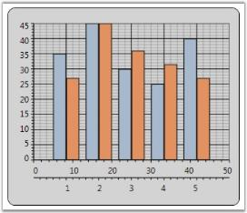 | markdownify }
{:.image }

See Also

Inverted Axis, Opposed Axis, Multiple Axes

###### Inverted Axis

Essential Chart provides support for inverting the values on the axis. Data on an inverted axis is plotted in the opposite direction - Top to Bottom for Y-axis and Right to Left for X-axis. To enable this behavior, set the ChartAxis.IsInversed property to True.

_ChartAxis Property_

<table>
<tr>
<td>
ChartAxis Property</td><td>
Description</td></tr>
<tr>
<td>
IsInversed</td><td>
Indicates whether the axis should be reversed. When reversed, the axis will render points from right to left if horizontal, top to bottom when vertical, and clockwise if radial.</td></tr>
</table>

[XAML]

&lt;syncfusion:ChartArea&gt;

 &lt;syncfusion:ChartArea.PrimaryAxisAxis&gt;

         &lt;syncfusion:ChartAxis IsInversed="True"&gt;

 &lt;/syncfusion:ChartArea.PrimaryAxisAxis&gt;

 &lt;syncfusion:ChartArea.SecondaryAxis&gt;

    &lt;syncfusion:ChartAxis IsInversed="True"&gt;

          &lt;/syncfusion:ChartArea.SecondaryAxis&gt;

&lt;/syncfusion:ChartArea&gt;                        

[C#]

// Sets the Axis as inversed.

chart.Areas[0].PrimaryAxis.IsInversed = true;

chart.Areas[0].SecondaryAxis.IsInversed = true;                       

The following image illustrates Chart with an Inversed Axis.

{  | markdownify }
{:.image }

See Also

Chart Axis Orientation, Opposed Axis, Multiple Axes

###### Opposed Axis

For every Chart Type, there is an implied X-axis and Y-axis position, and by default all the X-axes and Y-axes will be rendered in that corresponding position. You can override this default behavior by setting the OpposedPosition property to True for an axis, which will cause it to be rendered in the opposite side of the implied position. This feature is also used with Multiple Axes, where you can position the Secondary axis opposite to the Primary axis.

_ChartAxis Property_

<table>
<tr>
<td>
ChartAxis Property</td><td>
Description</td></tr>
<tr>
<td>
OpposedPosition</td><td>
Gets / sets a value indicating whether axis should be in opposed position.</td></tr>
</table>

[XAML]

&lt;syncfusion:ChartArea Name="area"&gt;                    

 &lt;syncfusion:ChartSeries Name="series" Data=" 1 35 2 45 3 30 4 25 5 40" /&gt;

 &lt;syncfusion:ChartSeries Name="series1" Data=" 1 30 2 50 3 40 4 35 5 30" &gt;

     &lt;syncfusion:ChartSeries.YAxis&gt;

          &lt;syncfusion:ChartAxis  Orientation="Vertical" OpposedPosition="True"/&gt;

     &lt;/syncfusion:ChartSeries.YAxis&gt;

 &lt;/syncfusion:ChartSeries&gt;

&lt;/syncfusion:ChartArea&gt;

The following image illustrates Chart with Opposed Axis.

{  | markdownify }
{:.image }

See Also

Inverted Axis, Chart Axis Orientation, Opposed Axis

###### Multiple Axes

Chart is capable of rendering multiple axes in the same plot. Different series can be plotted against different axes as follows.

[XAML]

&lt;sfchart:Chart Name="Chart1"&gt;

&lt;sfchart:ChartArea&gt;

   &lt;!--This series is plotted against the default Y axis --&gt;

   &lt;sfchart:ChartSeries Type="Spline" x:Name="Series1" DataSource="{Binding Source={StaticResource dataval}}" BindingPathX="ID" BindingPathsY="Val3" IsIndexed="False" Label="Avg Temperature"&gt;

   &lt;/sfchart:ChartSeries&gt;

   &lt;!--This series is plotted against a custom Y axis --&gt;

   &lt;sfchart:ChartSeries Type="SplineArea" x:Name="Series2" DataSource="{Binding Source={StaticResource dataval}}" BindingPathX="ID" BindingPathsY="Val1" Label="Avg Rainfall"&gt;

   &lt;sfchart:ChartSeries.YAxis&gt;

   &lt;sfchart:ChartAxis OpposedPosition="True" RangePadding="Normal" IsAutoSetRange="False" Range="0,100" SmallTicksPerInterval="0" Interval="10" Orientation="Vertical"&gt;

   <sfchart:ChartArea.ShowGridLines>false</sfchart:ChartArea.ShowGridLines>

   &lt;sfchart:ChartAxis.Header&gt;

   &lt;TextBlock Text="Rainfall (mm)" FontFamily="Tahoma" FontSize="14" Foreground="LightSteelBlue"/&gt;

   &lt;/sfchart:ChartAxis.Header&gt;

   &lt;/sfchart:ChartAxis&gt;

   &lt;/sfchart:ChartSeries.YAxis&gt;

   &lt;/sfchart:ChartSeries&gt;

&lt;/sfchart:ChartArea&gt;

&lt;/sfchart:Chart&gt;

{ 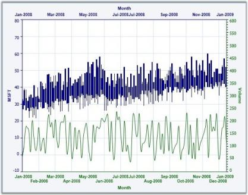 | markdownify }
{:.image }

__For more details, refer to the sample in the following location:

_...\My Documents\Syncfusion\EssentialStudio\&lt;Version Number&gt;\WPF\Chart.WPF\Samples\3.5\WindowsSamples\Chart Axis\Chart Multiple Opposed Axes Demo_

See Also

Chart Axis Orientation, Inverted Axis, Opposed Axis, Logarithmic Axis

###### Axis Range Selection

Essential Chart for WPF now supports axis range selection. This enables the user to select a particular range of a primary axis by using two cursors.  

Adding an Axis Range Selection

To add axis range selction, set the EnableRangeSelection to True. The following code illustrates this.

[XAML]

  &lt;syncfusion:ChartArea Name="area" EnableRangeSelection="True" LineStroke="Maroon" SelectionStroke="LightPink" /&gt;

[C#] 

chart1.Areas[0].EnableRangeSelection = true;

            double start = chart1.Areas[0].StartRange;

            double end = chart1.Areas[0].EndRange;

            chart1.Areas[0].LineStroke = Brushes.Maroon;

            chart1.Areas[0].SelectionStroke = Brushes.LightPink;

When the code runs, the following output displays.

{  | markdownify }
{:.image }

Property Details

_Property Table_

<table>
<tr>
<td>
Name of Property</td><td>
Description </td><td>
Type of Property</td><td>
Value It Accepts</td><td>
Sub Properties</td></tr>
<tr>
<td>
EnableRangeSelection</td><td>
Used to set the range selection.</td><td>
Dependency</td><td>
Binary or True/False</td><td>
StartValue Type: double EndValueType: double LineStrokeType: Brush SelectionStroke Type: Brush</td></tr>
</table>
###### Logarithmic Axes

Logarithmic values can be applied to the Chart. This is facilitated by the IsLogarithmic and LogarithmicBase properties. On setting the Axis.IsLogarithmic property, the Axis range, interval and padding will be plotted as per the log values provided. The LogarithmicBase value allows to set the base values for Logarithmic Axis.

[C#]

// Add Data points to Chart

ChartListData points = new ChartListData();

for (int i = 1; i < 11; i++)

points.Add(new ChartPoint(i, Math.Exp(i)));

series.Data = points;

// Set the IsLogarithmic property of the Axis as true

area.SecondaryAxis.IsLogarithmic = true;

// Set the Logarithmic Base value as 10

area.SecondaryAxis.LogarithmicBase = 10;

// Set the Logarithmic Base value as 2

area.SecondaryAxis.LogarithmicBase = 2;

// Set the Logarithmic Base value as e

area.SecondaryAxis.LogarithmicBase = Math.E;

The following image illustrates Log chart with various LogarithmicBase values.

{  | markdownify }
{:.image }

Show Minor Grid Lines When the Axis Is Logarithmic

Essential Chart WPF is enhanced with minor grid lines and ticks when the axis is set as logarithmic.

Adding Show Minor Grid Lines 

Add Show Minor Grid Lines, by using the following code. 

[XAML] 

&lt;syncfusion:Chart Name="Chart1" Grid.Row="1" Margin="10"&gt;

      &lt;syncfusion:ChartArea Name="area" &gt;

   &lt;syncfusion:ChartArea.PrimaryAxis&gt;

                    &lt;!--X axis declaration with required property settings--&gt;

                    <syncfusion:ChartAxis Header="Year"  IsLogarithmic="True" 

EnableLogLabels="True" >

                    &lt;/syncfusion:ChartAxis&gt;

                &lt;/syncfusion:ChartArea.PrimaryAxis&gt;

              &lt;syncfusion:ChartArea.SecondaryAxis&gt;

                    &lt;!--Y axis declaration with required property settings--&gt;

                    <syncfusion:ChartAxis IsLogarithmic="True" 

EnableLogLabels="True">

                    &lt;/syncfusion:ChartAxis&gt;

                &lt;/syncfusion:ChartArea.SecondaryAxis&gt;							

&lt;/syncfusion:ChartArea&gt;

&lt;/ syncfusion:Chart&gt;

[C#] 

Chart1.Areas[0].PrimaryAxis.IsLogarithmic = true;

            Chart1.Areas[0].PrimaryAxis.EnableLogLabels = true;

            Chart1.Areas[0].SecondaryAxis.IsLogarithmic = true;

            Chart1.Areas[0].SecondaryAxis.EnableLogLabels = true;

When the code runs, the following output displays.

{ 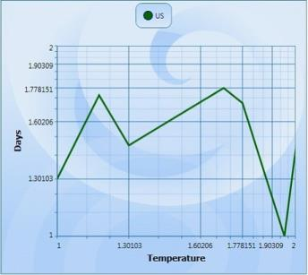 | markdownify }
{:.image }

The following table contains the property Details.

_Property_

<table>
<tr>
<td>
Name of the Property</td><td>
Description </td><td>
Type of the Property</td><td>
Value It Accepts</td></tr>
<tr>
<td>
EnabelLogLabels</td><td>
 Set /unset  the log labels</td><td>
Dependency Property</td><td>
Bool (true or false)</td></tr>
</table>
See Also

Multiple Axes

Small tick for Logarithmic axis

Essential chart allows user to set the minor grid lines for log axis.

_Property Table_

<table>
<tr>
<td>
Name of the Property</td><td>
Type of the property</td><td>
Value it accepts</td><td>
Property syntax</td><td>
Any other dependencies/ sub properties associated</td></tr>
<tr>
<td>
SmallTicksPerInterval</td><td>
Dependency property</td><td>
Integer and any whole number</td><td>
SmallTicksPerInterval = 5</td><td>
NA</td></tr>
</table>

[XAML]

  &lt;syncfusion:ChartAxis SmallTicksPerInterval="20" IsLogarithmic="True" &gt;

{  | markdownify }
{:.image }

###### Chart Axis Header

Chart for WPF provides support for Chart Axis Titles with the help of the attached property ChartAxis.Header. Its position can be adjusted by using the HeaderAlignment property of the ChartAxis class.

_ChartAxis Property_

<table>
<tr>
<td>
ChartAxis Property</td><td>
Description</td></tr>
<tr>
<td>
Header</td><td>
Gets/sets the title of the axis.</td></tr>
<tr>
<td>
HeaderAlignment</td><td>
Gets/sets the header alignment. The options included are as follows.FarCenterNear</td></tr>
</table>

[XAML]

&lt;syncfusion:ChartArea Name="area"&gt;

          &lt;syncfusion:ChartArea.PrimaryAxis&gt;

              &lt;syncfusion:ChartAxis Header="X-Axis" HeaderAlignment="Near" /&gt;

           &lt;/syncfusion:ChartArea.PrimaryAxis&gt;

           &lt;syncfusion:ChartArea.SecondaryAxis&gt;

               &lt;syncfusion:ChartAxis Header="Y-Axis" HeaderAlignment="Far" /&gt;                      

           &lt;/syncfusion:ChartArea.SecondaryAxis&gt;

           &lt;syncfusion:ChartSeries Name="series" Data=" 1 35 2 45 3 30 4 25 5 40" /&gt;                                       

&lt;/syncfusion:ChartArea&gt; 

[C#]

area.PrimaryAxis.Header = "X-Axis";

area.PrimaryAxis.HeaderAlignment = ChartAlignment.Near;

area.SecondaryAxis.Header = "Y-Axis";

area.SecondaryAxis.HeaderAlignment = ChartAlignment.Far;

The following image illustrates Chart with Axis HeaderAlignment set.

{  | markdownify }
{:.image }

See Also

Chart Axis Label

###### Chart Striplines

Strip lines are horizontal or vertical bands marked in the background of a chart at regular or custom intervals. These strip lines help you to distinguish data points on a chart, highlight specific ranges of data, define threshold points etc. 

Segmented strip lines are created when the vertical and horizontal strip lines intersect each other. The segment created by this intersection for each strip line is a called a Segmented Strip Line.

The following code examples illustrate the creation of Segmented Strip Line at required locations.

[XAML]

&lt;syncfusion:ChartAxis.StripLines&gt;

&lt;syncfusion:ChartStripLine IsSegmented="True" Start="1" Width="1" SegmentStartValue="10" Interior="Pink" Repeat="3" SegmentEndValue="60"&gt;

&lt;/syncfusion:ChartStripLine&gt;

&lt;/syncfusion:ChartAxis.StripLines&gt;

[C#]

ChartStripLine sp = new ChartStripLine();

sp = new ChartStripLine();

sp.IsSegmented = true;

sp.Start = 1;

sp.Width = 1;

sp.Repeat=3;

sp.Interior = Brushes.Pink;

sp.StartFromAxis = false;

sp.SegmentStartValue = 10;

sp.SegmentEndValue = 60;

sp.Text = new FormattedText(item.Production.ToString(), CultureInfo.CurrentCulture, FlowDirection.LeftToRight, new Typeface("Arial"), 10, Brushes.Black);

Run the code. The following output is displayed.

{ 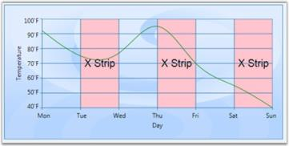 | markdownify }
{:.image }

###### Scale Break Support

Breaks are very useful if you add points with too large difference in values. To enable breaks, you need to set the EnableBreaks property to true and set the break mode (BreaksMode property). A scale break is a line drawn across the plotting area of a chart to denote a break in continuity between the highest and lowest values on a value axis. A Scale Break displays two distinct ranges in the same chart area.

There are three possible modes. They are,

* ChartBreaksModes.Manual (default): If this value is set, you can manually set the breaks ranges.
* ChartAxis.BreakRanges.Union: to add a new break range
* ChartAxis.BreakRanges.Exclude: to remove the break range
* ChartAxis.BreakRanges.Clear: to remove all break ranges

* ChartBreaksMode.Auto: If this mode is enabled, chart will compute the breaks ranges automatically.
* This mode has several exclusions
* Breaks are computed only for actual y-axis of series
* Breaks don't work with zooming
* Breaks don't work with stacking
* All breaks work only with decart axes
* ChartBreaksModes.None: If this value is set, breaks are not used.

{  | markdownify }
{:.image }

{  | markdownify }
{:.image }

{  | markdownify }
{:.image }

Properties and Methods Tables

Properties 

_Properties_

<table>
<tr>
<td>
Property</td><td>
Description </td><td>
Type </td><td>
Reference links</td></tr>
<tr>
<td>
EnableBreaks</td><td>
To enable break ranges</td><td>
bool</td><td>
NA</td></tr>
<tr>
<td>
BreaksMode</td><td>
3 types: Manual, Auto and None</td><td>
ChartBreaksModes</td><td>
NA</td></tr>
<tr>
<td>
LineType</td><td>
Straight line, wave and randomize</td><td>
ChartBreakLineTypes</td><td>
NA</td></tr>
<tr>
<td>
LineColor</td><td>
Different types of colors for the line</td><td>
Brush</td><td>
NA</td></tr>
<tr>
<td>
LineWidth</td><td>
Values from 1 to 10</td><td>
Double</td><td>
NA</td></tr>
<tr>
<td>
Linestyle</td><td>
Dash Line, DashDodDot Line ,DashDot Line, Dot Line, Solid Line</td><td>
DashStyle</td><td>
NA</td></tr>
<tr>
<td>
SpacingColor</td><td>
Different types of colors for the line</td><td>
Brush</td><td>
NA</td></tr>
<tr>
<td>
SpacingWidth</td><td>
Values from 1 to 10</td><td>
Double</td><td>
NA</td></tr>
</table>
Methods

_Methods_

<table>
<tr>
<td>
Method </td><td>
Description </td><td>
Parameters </td><td>
Return Type </td><td>
Reference links </td></tr>
<tr>
<td>
Union</td><td>
To add a particular break range</td><td>
DoubleRangeChartBreakRangeInfo</td><td>
void</td><td>
NA</td></tr>
<tr>
<td>
Exclude</td><td>
To delete the specified break range</td><td>
DoubleRange</td><td>
void</td><td>
NA</td></tr>
<tr>
<td>
Clear</td><td>
Clear all existing break ranges</td><td>
NA</td><td>
void</td><td>
NA</td></tr>
</table>
###### Retaining Axis Position

Essential Chart for WPF enables users to retain the axis position of the primary and secondary axis when multiple axes are added in a chart area.

Adding Support for Retaining Axis Position 

Set the IsRetainAxisPosition propertyto True to add axesin the order they are added to the chart area. The following code illustrates this.  

[XAML]

&lt;syncfusion:ChartArea IsRetainAxisPosition="True"&gt;

When the code runs, the following output displays. 

{  | markdownify }
{:.image }

Set IsRetainAxisPosition is False to add axes in reverse order.

{ 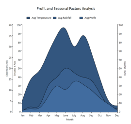 | markdownify }
{:.image }

_Property Details_

<table>
<tr>
<td>
Name of Property</td><td>
Description </td><td>
Type of Property</td><td>
Value It Accepts</td><td>
Property Syntax</td></tr>
<tr>
<td>
IsRetainAxisPosition</td><td>
Determines the order of arranging the multiple axes. </td><td>
Dependency </td><td>
Bool or True/False.</td><td>
IsRetainAxisPosition="True"</td></tr>
</table>
###### Chart Axis Improvements

Essential Chart provides support for some improvements in the existing chart axis by implementing the following features.

* Axis headers can be positioned inside, outside, or across the chart axes.
* Edge labels can be adjusted by setting EdgeLabelsDrawingMode to Fit to avoid the partial appearance of edge axis labels.
* Prefixes and suffixes can be added to chart axes labels to mention the units along with the labels.
* Labels can be aligned horizontally and vertically with respect to the specified width and height of chart axis labels.

Properties

_Properties_

<table>
<tr>
<td>
Property</td><td>
Description</td><td>
Type</td><td>
Data Type</td></tr>
<tr>
<td>
HeaderPosition</td><td>
Specifies the position of the header with respect to the chart axis.Inside—Header is positioned inside the chart axis.Outside—Header is positioned outside the chart axis.Cross—Header is positioned across the chart axis.</td><td>
Dependency</td><td>
AxisPositions</td></tr>
<tr>
<td>
LabelHeight</td><td>
Specifies the height of axis labels</td><td>
Dependency</td><td>
double</td></tr>
<tr>
<td>
LabelWidth</td><td>
Specifies the width of axis labels</td><td>
Dependency</td><td>
double</td></tr>
<tr>
<td>
LabelHorizontalAlignment</td><td>
Aligns the labels horizontally within the specified width of the labels.</td><td>
Dependency</td><td>
HorizontalAlignment</td></tr>
<tr>
<td>
LabelVerticalAlignment</td><td>
Aligns the labels horizontally within the specified width of the labels.</td><td>
Dependency</td><td>
VerticalAlignment</td></tr>
<tr>
<td>
LabelsPrefix</td><td>
Specifies the prefix for chart axis labels.</td><td>
Dependency</td><td>
DataTemplate</td></tr>
<tr>
<td>
LabelsPostfix</td><td>
Specifies the suffix for chart axis labels.</td><td>
Dependency</td><td>
DataTemplate</td></tr>
<tr>
<td>
EdgeLabelsDrawingMode</td><td>
Fit—Draws the edge labels to fit within the chart area</td><td>
Dependency</td><td>
EdgeLabelsDrawingMode</td></tr>
</table>
Sample Link

To access the chart axis improvement demo:

1. Open the Syncfusion Dashboard.
2. Select User Interface.
3. Click the WPF drop-down list and select Explore Samples.
4. Browse to the path Chart.WPF\Samples\3.5\ WindowsSamples\Chart Axis\Chart Axis Improvement Demo.

Adding Axis Improvement properties to an Application 

<table>
<tr>
<td>
[XAML]            <syncfusion:ChartAxis HeaderPosition="Cross"                      LabelHeight="40" LabelWidth="120"                                            LabelsPrefix="{StaticResource yPrefix}"                       LabelsPostfix="{StaticResource yPostfix}"                      LabelHorizontalAlignment="Left" LabelVerticalAlignment="Top"                      EdgeLabelsDrawingMode="Fit">            &lt;/syncfusion:ChartAxis&gt;</td></tr>
<tr>
<td>
[C#]            this.primaryAxis.HeaderPosition = AxisPositions.Cross;            this.primaryAxis.LabelHeight = 40;            this.primaryAxis.LabelWidth = 120;            this.primaryAxis.LabelHorizontalAlignment = HorizontalAlignment.Left;            this.primaryAxis.LabelVerticalAlignment = VerticalAlignment.Top;            this.primaryAxis.LabelsPrefix = xPrefix;            this.primaryAxis.LabelsPostfix = xPostfix;            this.primaryAxis.EdgeLabelsDrawingMode = EdgeLabelsDrawingMode.Fit;</td></tr>
</table>

{  | markdownify }
{:.image }

_Primary Axis Labels with Postfix (GHZ) and Secondary Axis Labels withPrefix ($)_

{  | markdownify }
{:.image }

_Secondary Axis EdgeLabelsDrawingMode [Shift]_

{  | markdownify }
{:.image }

_Secondary Axis LabelHeight [30], LabelVerticalAlignment [Top]_

###### Smart Axis Labels

Essential Chart for WPF supports smart axis labels which help to display labels in a smart and effective manner. This support is available for the following axis types:

* Double
* DateTime
* TimeSpan
Use Case Scenarios

Smart axis labels are useful in the following scenarios:

Axis Type Double: In cases where axis ranges have values that are so large (e.g., millions or trillions) that the labels use too much room on the axis. Smart axis labels are rendered with suffixes based on the data range value. For example, “M” will be appended to all labels with million values—1,000,000 will be displayed as 1M.

Axis Type DateTime: In cases where LabelDateTimeFormat is set to Default, the labels will appear too large displaying “MM/dd/yyyy hh:mm tt”. Smart labels calculate the data range and reduce the labels. For example, only “MM/dd” would be displayed depending upon the interval between two labels. 

{  | markdownify }
{:.image }

Axis Type TimeSpan: In cases where the time span is set with intervals of hours, smart labels can convert and display when there is a change with the hours. For example, 12:00  to 15:00 will be displayed as 12:00:00. … 1 … 2 … … … 12 … 13 … 14 … 15:00:00 

{  | markdownify }
{:.image }

Properties

_Properties_

<table>
<tr>
<td>
Property</td><td>
Description</td><td>
Type</td><td>
Data Type</td></tr>
<tr>
<td>
EnableSmartAxisLabels</td><td>
Used to enable or disable SmartAxisLabels</td><td>
Dependency property</td><td>
Bool </td></tr>
<tr>
<td>
DoubleDisplayUnit</td><td>
Used to set double display units such as millions, trillions, etc.</td><td>
Dependency property</td><td>
Enum DisplayUnit</td></tr>
<tr>
<td>
DoubleDisplayUnitAlignment</td><td>
Used to set the alignment for double display units.</td><td>
Dependency property</td><td>
Enum ChartAlignment</td></tr>
</table>
Sample Link

C:\Documents and Settings\&lt;user name&gt;\My documents\Syncfusion\Essential Studio\Samples\WPF\Chart.WPF\Samples\3.5\WindowsSamples\ChartAxis\Smart Axis Label

Enabling Smart Axis Labels in Chart Axis

The following code example shows how to enable smart axis labels:

[C#]

  ChartAxis axis=new ChartAxis();

  axis.EnableSmartAxisLabel= True;

  Chart1.PrimaryAxis=axis;	

[XAML]

&lt;syncfusion:ChartArea.PrimaryAxis&gt;

     &lt;syncfusion:ChartAxis EnableSmartAxisLabel="True"/&gt;

&lt;/syncfusion:ChartArea.PrimaryAxis&gt;

###### Placing axis labels and series segment in between Ticklines

Provide the option to position the segments between axis lines and on the axis line. For ‘AdjustAcrossChartType’, the segments is visible between the axis lines and for ConsistentAcrossChartType, the segment is visible on the axis lines.

The following screenshot depicts the segments between TickLine

{  | markdownify }
{:.image }

The following screenshot depicts the segments on TickLine

{  | markdownify }
{:.image }

Properties

_Property_

<table>
<tr>
<td>
Property</td><td>
Description</td></tr>
<tr>
<td>
RangeCalculationMode</td><td>
AdjustAcrossChartType - The segment starts from 1st axis and the constant behavior is BetweenTicks.ConsistentAcrossChartType - Similar to AdjustAcrossChartType and the constant behavior is OnTicks.</td></tr>
</table>
Sample Link

A sample for placing axis label and series segment in between Ticklines  is placed in the following location

[http://svn.syncfusion.com/svn/studio/Source/trunk/WPF/Chart.WPF/Samples/3.5/WindowsSamples/ChartAxis ValueTypes/Logarithmic](http://svn.syncfusion.com/svn/studio/Source/trunk/WPF/Chart.WPF/Samples/3.5/WindowsSamples/ChartAxis) ValueType Demo

Adding Segment Position to an Application 

For placing axis label and series segment in between Ticklines do the following:

1. Create a new WPF Application in VS2012.
2. Create a chart sample with ChartArea and ChartAxis.
3. Change the RangeCalculationMode property in primary axis to _AdjustAcrossChartType_ or ConsistentAcrossChartType for changing the segment position.

Code Example

The following code example illustrates the usage of placing axis label and series segment between the Ticklines

[XAML]

&lt;sfchart:Chart&gt;

&lt;sfchart:ChartArea Background="LightGray" GridBackground="White"&gt;

&lt;sfchart:ChartArea.PrimaryAxis&gt;

      &lt;sfchart:ChartAxis IsAutoSetRange="False" Range="0,100" Interval="25" MinimumInterval="25" RangeCalculationMode="AdjustAcrossChartType" RangePadding="Addditional"/&gt;

    &lt;/sfchart:ChartArea.PrimaryAxis&gt;

     &lt;sfchart:ChartSeries Template="{StaticResource Template1}"        DataSource="{Binding Source={StaticResource myXmlData},XPath=Products/Product}" BindingPathX="Month" BindingPathsY="Sales" Interior="Red"  Type="FastSpline"/&gt;

   &lt;/sfchart:ChartArea&gt;          

&lt;/sfchart:Chart&gt;

##### Chart Labels

###### Chart Font Settings

Font settings of each and every part of Chart such as Chart, ChartArea, ChartLegend and ChartAreaLegend can be customized with the following given properties.

* FontFamily
* FontSize
* FontStretch
* FontStyle
* FontWeight
* Foreground

> _Note: Font settings set to the Chart will be applied to all the units of chart. However, properties set separately for those units such as ChartArea, ChartAxis, ChartLegend will override, these settings._ 

{  | markdownify }
{:.image }

See Also

Chart Axis Label, Chart Axis Label Rotate, Intersecting Labels

###### Chart Axis Label

ChartAxis Labels can be customized by using the following given properties.

_ChartAxis Property_

<table>
<tr>
<td>
ChartAxis Property</td><td>
Description</td></tr>
<tr>
<td>
LabelBackground</td><td>
gets or sets the Background of the ChartAxis Label</td></tr>
<tr>
<td>
LabelForeground</td><td>
gets or sets the Foreground of the ChartAxis Label</td></tr>
<tr>
<td>
LabelBorderBrush</td><td>
gets or sets the Border brush of the ChartAxis Label</td></tr>
<tr>
<td>
LabelBorderThickness</td><td>
gets or sets the Border thickness of the ChartAxis Label</td></tr>
<tr>
<td>
LabelCornerRadius</td><td>
gets or sets the Corner Radius of the ChartAxis Label</td></tr>
<tr>
<td>
LabelFontFamily</td><td>
gets or sets the FontFamily of the ChartAxis Label</td></tr>
<tr>
<td>
LabelFontSize</td><td>
gets or sets the FontSize of the ChartAxis Label</td></tr>
<tr>
<td>
LabelFontWeight</td><td>
gets or sets the FontWeight of the ChartAxis Label</td></tr>
<tr>
<td>
LabelFormat</td><td>
gets or sets the Format of the ChartAxis Label such as 0.00 or 0 precent</td></tr>
<tr>
<td>
LabelDateTimeFormat</td><td>
gets or sets the DateTime Format of the ChartAxis LabelApplicable when Axis.ValueType is DateTime</td></tr>
</table>
The following code example could be used to customize the Chart Axis Labels.

[XAML]

&lt;sfchart:ChartArea.PrimaryAxis&gt;

&lt;sfchart:ChartAxis  LabelForeground="Blue" LabelBackground="Orange" LabelBorderBrush="Black" LabelBorderThickness="1" LabelCornerRadius="2" LabelFontFamily="Calibri" LabelFontSize="10" LabelFontWeight="Bold" LabelFormat="0%"/&gt;

&lt;/sfchart:ChartArea.PrimaryAxis&gt;

[C#]

//Sets the Label settings of PrimaryAxis

 Area.PrimaryAxis.LabelForeground = Brushes.Blue;

 Area.PrimaryAxis.LabelBackground = Brushes.Orange;

 Area.PrimaryAxis.LabelBorderBrush = Brushes.Black;

 Area.PrimaryAxis.LabelBorderThickness = new Thickness(1);

 Area.PrimaryAxis.LabelCornerRadius = new CornerRadius(2);

 Area.PrimaryAxis.LabelFontFamily = new FontFamily("Calibri");

 Area.PrimaryAxis.LabelFontSize = 10;            

 Area.PrimaryAxis.LabelFontWeight = FontWeights.Bold;

 Area.PrimaryAxis.LabelFormat = "0%";           

Following given figure illustrates Chart with customized Primary Axis labels.

{  | markdownify }
{:.image }

See Also

Chart Font Settings, Axis Label Rotate, Intersecting Labels

###### Customizing Label Text

Apart from the default Labels displayed, you can also add Custom Labels to be displayed in the Chart. This section discusses the following topics.

Properties Used to Customize Label Text

The following properties are used to determine the data source for the text of the Labels.

_ChartAxis Property_

<table>
<tr>
<td>
ChartAxis Property</td><td>
Description</td></tr>
<tr>
<td>
LabelsMode</td><td>
{{ '_Auto_' | markdownify }}: content is determined automatically{{ '_Custom_' | markdownify }}: custom values are used for labels content representation{{ '_DataSource_' | markdownify }}: external datasource is used for labels content{{ '_Default_' | markdownify }}: content for labels is either determined automatically, taken from external dataSource or being set with custom values{{ '_None_' | markdownify }}: labels values are taken from point's X-coordinate</td></tr>
<tr>
<td>
LabelsSource</td><td>
gets or sets the Labels Source</td></tr>
<tr>
<td>
PositionPath</td><td>
gets or sets the position path</td></tr>
<tr>
<td>
ContentPath</td><td>
gets or sets the content path</td></tr>
</table>
By assigning the LabelsMode property to ChartAxis.CustomLabels, you can add Custom Labels to the ChartAxis.

[XAML]

&lt;syncfusion:Chart Name="Chart1" &gt;

          &lt;syncfusion:ChartArea Name="area" &gt;

                    &lt;syncfusion:ChartArea.PrimaryAxis&gt;

                        &lt;syncfusion:ChartAxis LabelsMode="Custom" RangeCalculationMode="AdjustAcrossChartTypes"&gt;

                            &lt;syncfusion:ChartAxis.CustomLabels&gt;

                                &lt;syncfusion:ChartAxisLabel Content="III place" Position="0" /&gt;

                                &lt;syncfusion:ChartAxisLabel Content="I place" Position="1" /&gt;

                                &lt;syncfusion:ChartAxisLabel Content="II place" Position="4" /&gt;

                            &lt;/syncfusion:ChartAxis.CustomLabels&gt;

                        &lt;/syncfusion:ChartAxis&gt;

                    &lt;/syncfusion:ChartArea.PrimaryAxis&gt;                  

          &lt;/syncfusion:ChartArea&gt;

&lt;/syncfusion:Chart&gt;         

[C#]

// Indicates that the axis labels need to be taken from a custom source.

area.PrimaryAxis.LabelsMode = ChartAxisLabelsMode.Custom;

ChartAxisLabel customLabel1 = new ChartAxisLabel();

customLabel1.Content = "III place";

customLabel1.Position = 0;

ChartAxisLabel customLabel2 = new ChartAxisLabel();

customLabel2.Content = "I place";

customLabel2.Position = 1;

ChartAxisLabel customLabel3 = new ChartAxisLabel();

customLabel3.Content = "II place";

customLabel3.Position = 4;

// Adding custom label to labels collection.

area.PrimaryAxis.CustomLabels.Add(customLabel1);

area.PrimaryAxis.CustomLabels.Add(customLabel2);

area.PrimaryAxis.CustomLabels.Add(customLabel3);           

The following screenshot illustrates Chart PrimaryAxis with Custom Labels.

{  | markdownify }
{:.image }

Labels from Data Source

The following code example illustrates how Custom Labels can be used in the ChartAxis.

[C#]

// Indicates that the axis labels need to be taken from a data source.

area.PrimaryAxis.LabelsMode = ChartAxisLabelsMode.DataSource;   

// Creates DataSource with desired labels.

List<object> labels = new List<object>();

for (double i = 1; i < 6; i++)

{

labels.Add(new { Position = i, Content = "Label " + i.ToString() });

}

// Associates DataSource with the Chart Labels.

area.PrimaryAxis.LabelsSource = labels;       

// Set the position path where the labels should be placed.

area.PrimaryAxis.PositionPath = "Position";

// Set the content path from which labels are to be taken.

area.PrimaryAxis.ContentPath = "Content";

The following screenshot illustrates Chart PrimaryAxis with Labels from Data Source.

{  | markdownify }
{:.image }

###### Chart Axis Label Rotate

ChartAxis labels could be rotated with custom angles. Axis.LabelRotateAngle property is used to define the angle in which the Axis Labels need to be rotated.

The following code example could be used to customize the labels to be rotated with 90'.

[XAML]

&lt;sfchart:ChartArea.PrimaryAxis&gt;

&lt;sfchart:ChartAxis LabelRotateAngle="90" LabelFormat="0.000000" /&gt;

&lt;/sfchart:ChartArea.PrimaryAxis&gt;

[C#]

//Sets the Label to be rotated with 90' angle

 Area.PrimaryAxis.LabelRotateAngle = 90;           

The following figure illustrates Chart with Primary Axis labels rotated with 90' angle

{  | markdownify }
{:.image }

> _Note: LabelRotateAngle property will not have effect when the Axis.IntersectAction property is set as Rotate._

See Also

Chart Font Settings, Chart Axis Label, Intersecting Labels

###### Intersecting Labels

Sometimes the chart dimensions could cause the labels to intersect. The chart will, by default, render those texts one over the other. But, it also has some built-in capabilities to work around this overlap and lets you dictate the technique to follow. Refer to the properties as follows.

_ChartAxis Property_

<table>
<tr>
<td>
ChartAxis Property</td><td>
Description</td></tr>
<tr>
<td>
IntersectAction</td><td>
{{ '_Hide_' | markdownify }} – labels are hidden to avoid intersection{{ '_MultipleRows_' | markdownify }} – labels are wrapped into multiple rows to avoid intersection{{ '_None_' | markdownify }} – no special actionLabels may intersect{{ '_Rotate_' | markdownify }} – labels are rotated to avoid intersection{{ '_Wrap_' | markdownify }} – labels are wrapped to avoid intersection</td></tr>
<tr>
<td>
HidePartialLabel</td><td>
{{ '_True_' | markdownify }} – hides the labels that appear partiallyUsually the labels in the edges will be affected.{{ '_False_' | markdownify }} - labels are drawn as suchNo action will be taken.</td></tr>
<tr>
<td>
EdgeLabelsDrawingMode</td><td>
{{ '_Center_' | markdownify }} – draws the edge labels at the center of the GridLines{{ '_Shift_' | markdownify }} – value indicating that edge label should be shifted to either left or right so that it comes within the Chart Area</td></tr>
</table>

[C#]

Chart1.Areas[0].PrimaryAxis.IntersectAction = ChartLabelIntersectAction.MultipleRows;

Chart1.Areas[0].PrimaryAxis.HidePartialLabel = true;

Chart1.Areas[0].PrimaryAxis.EdgeLabelsDrawingMode = EdgeLabelsDrawingMode.Shift;

[XAML]

&lt;syncfusion:ChartArea.PrimaryAxis&gt;

&lt;syncfusion:ChartAxis Header="Product Name"  IntersectAction="MultipleRows" HidePartialLabel="True" EdgeLabelsDrawingMode="Shift"  /&gt;

&lt;/syncfusion:ChartArea.PrimaryAxis&gt;

The following screenshot illustrates various techniques for avoiding the Label intersection.

{  | markdownify }
{:.image }

{  | markdownify }
{:.image }

{  | markdownify }
{:.image }

See Also

Axis Label Rotate, Chart Font Settings, Chart Axis Label, 

###### Legend Panel Customization 

Essential Chart enables you to arrange the legend items in any panel. You can arrange them in common panels like Grid, StackPanel, Canvas and WrapPanel. You can also create custom panel and arrange them. 

Property

_Property Table_

<table>
<tr>
<td>
Property</td><td>
Description</td><td>
Type </td><td>
Data Type</td><td>
Reference links</td></tr>
<tr>
<td>
LegendItemsPanel</td><td>
Sets a template panel for arranging legend items.  </td><td>
Dependency Property</td><td>
ItemsPanelTemplate </td><td>
{ [ItemsPanelTemplate Class](http://msdn.microsoft.com/en-us/library/system.windows.controls.itemspaneltemplate.aspx) | markdownify }</td></tr>
</table>
Customizing legend Panel

You can customize the legend panel using the _LegendItemsPanel_ property of ChartLegend. Following code illustrates this:

[XAML]

&lt;syncfusion:ChartLegend IconVisibility="Visible" BorderThickness="0" LegendPanel="Custom"&gt;                                    &lt;syncfusion:ChartLegend.LegendItemsPanel&gt;                                        &lt;ItemsPanelTemplate&gt;                                            &lt;StackPanel Orientation="Vertical"/&gt;                                        &lt;/ItemsPanelTemplate&gt;                                    &lt;/syncfusion:ChartLegend.LegendItemsPanel&gt;                                &lt;/syncfusion:ChartLegend&gt;

{  | markdownify }
{:.image }

Sample Link

To view sample:

1. Open the Syncfusion Dashboard.
2. Select User Interface.
3. Click the WPF drop-down list and select Explore Samples.
4. Navigate to WPF\Chart.WPF\Samples\3.5\WindowsSamples\Chart Customization\Custom Legend Items Panel Demo\
##### Chart Appearance

###### Chart Styles

Essential Chart for WPF supports styles. Users can customize the styles for a chart area, series, legend and axis using the ChartVisualStyle property.

_Property_

<table>
<tr>
<td>
Name of Property</td><td>
Description</td><td>
Type of Property</td><td>
Value It Accepts</td><td>
Property Syntax</td><td>
Sub properties</td></tr>
<tr>
<td>
ChartVisualStyle</td><td>
Used to set the style for the Chart.</td><td>
Dependency property</td><td>
ChartStyles or any value of the chart style enum.</td><td>
ChartVisualStyle="Style48"</td><td>
ChartAreaStyleLegendStyleSeriesStylePrimaryAxisStyleNote: Type - Style</td></tr>
</table>
Customizing Chart Style

The styles for a chart area, series, legend, and axis can be customized by using the following code.

[XAML]

&lt;sync:Chart x:Name="Chart1" ChartVisualStyle="ChocolateBlend"&gt;

//Insert the ChartLegend

&lt;sync:Chart.Legends&gt;

                &lt;sync:ChartLegend/&gt;

            &lt;/sync:Chart.Legends&gt;

//Insert the ChartArea

            &lt;sync:ChartArea IsContextMenuEnabled="True"&gt;

//Inserts the ChartSeries

                &lt;sync:ChartSeries Data="1,5" Label="Series1"/&gt;

            &lt;/sync:ChartArea&gt;

 &lt;/sync:Chart&gt;

[C# ]

Chart1.ChartVisualStyle = ChartStyles.ChocolateBlend;

When the code runs, the following output displays. 

{  | markdownify }
{:.image }

###### Chart Skins

Essential Chart for WPF provides a number of built-in skins that delivers the chart with appealing look and feel with just one property, the VisualStyle property of the class SkinStorage from the Shared.WPF assembly. In addition for the skins getting applied to the window and Window title Bar, the skins will also be applied to all parts of the chart such as Chart Area and Chart Legend.

[XAML]

&lt;syncfusion:Chart Grid.Column="0"  syncfusion:SkinStorage.VisualStyle="Office2007Blue" &gt;

&lt;/syncfusion:Chart&gt;

Required namespace

[C#]

using Syncfusion.Windows.Shared;

SkinStorage.SetVisualStyle(Chart1, "Office2007Blue");

> 

> _Note: Shared.WPF assembly should be referenced in the project to make use of this settings._

Various Built-In skins supported are:

* Default 
* Blend 
* Office2003 
* Office2007Blue 
* Office2007Silver 
* Office2007Black 
* CoolBlue 
* BlueWave 
* BrightGray 
* ChocolateYellow 
* ForestGreen 
* LawnGreen 
* MixedGreen 
* SpringGreen 
* OrangeRed 
* VS2010

The following images illustrate the various skins applied to the Chart.

{ 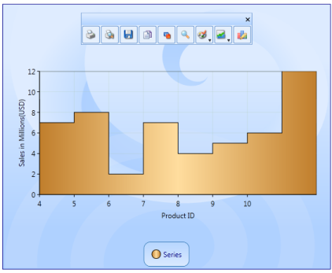 | markdownify }
{:.image }

{  | markdownify }
{:.image }

{  | markdownify }
{:.image }

{  | markdownify }
{:.image }

{  | markdownify }
{:.image }

{  | markdownify }
{:.image }

{  | markdownify }
{:.image }

{  | markdownify }
{:.image }

{ 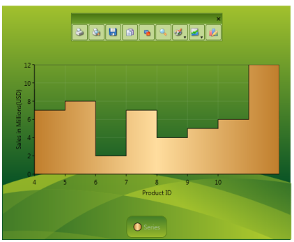 | markdownify }
{:.image }

###### Chart Animation

Essential Chart WPF now comes with animation support. Charts can be animated by using animation options available. The state-of-the-art animation lets you to create lively charts that can be used for marketing, attractive data presentation, and so on.

It allows you to:

* Set the animation option for a chart.
* Set the type of animation.
* Set the animation by each series.
* Set the duration for the animation.

Properties

The following table lists the properties and their usage in chart animation.

_Property_

<table>
<tr>
<td>
Property</td><td>
Description</td><td>
Type</td><td>
Value Returned</td></tr>
<tr>
<td>
EnableAnimation</td><td>
Sets the Animation option for the Chart.</td><td>
Dependency Property</td><td>
Boolean</td></tr>
<tr>
<td>
AnimateOption</td><td>
Sets the Type of Animation.</td><td>
Dependency Property</td><td>
Enum(AnimationOptions)</td></tr>
<tr>
<td>
AnimateOneByOne</td><td>
Sets the Animation by each series.</td><td>
Dependency Property</td><td>
Boolean</td></tr>
<tr>
<td>
AnimationDuration</td><td>
Sets the duration for the Animation.</td><td>
Dependency Property</td><td>
Enum(TimeSpan)</td></tr>
</table>
Events

The following table lists the events and their usage in chart animation.

_Events_

<table>
<tr>
<td>
Event</td><td>
Event Trigger</td><td>
Event Args</td><td>
Purpose</td></tr>
<tr>
<td>
OnEaseAnimationChanged</td><td>
Whenever the properties AnimationDuration, AnimateOneByOne, AnimateOption and EnableAnimation change.</td><td>
-</td><td>
To set the Animation option selected by the user.</td></tr>
<tr>
<td>
OnEnableAnimationChanged</td><td>
Whenever the properties AnimationDuration, AnimateOneByOne, AnimateOption and EnableAnimation change.</td><td>
-</td><td>
To select or unselect the Animation of chart.</td></tr>
</table>
Methods

The following table lists the methods and their usage in chart animation.

_Methods_

<table>
<tr>
<td>
Method</td><td>
Return Type</td><td>
Purpose</td></tr>
<tr>
<td>
StartAnimation</td><td>
Void</td><td>
This method is called when the user starts animation by using the options specified.</td></tr>
</table>
Enabling and Customizing Chart Animation

The chart animation can be enabled by setting EnableAnimation property to _true_.

[XAML]

<syncfusion:ChartSeries Type="Column" EnableEffects="True" Label="Mark" EnableAnimation="{Binding ElementName=enableanimation,

Path=IsChecked}" Interior="Blue" StrokeThickness="2" DataSource="{StaticResource data}" BindingPathX="Name" BindingPathsY="Mark, MinMark,MaxMark, Low, High" AnimateOneByOne="{Binding ElementName=animateind, Path=IsChecked}">

&lt;/syncfusion:ChartSeries&gt;

[C#]

chart.Areas[0].Series[0].StartAnimation();

chart.Areas[0].Series[0].AnimationDuration = ts;

chart.Areas[0].Series[0].AnimateOption = AnimationOptions.Rotate;

Run the code. The following output is displayed.

{ 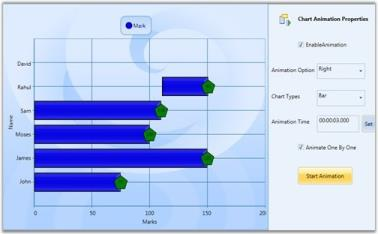 | markdownify }
{:.image }

###### Chart Series Effects

Essential Chart lets you customize the series effects for all chart types. The look and feel can be enhanced by using the effects available. This can be achieved by setting the EnableEffects property to _true_.

Properties

The following table provides more information on the property used.

_Property_

<table>
<tr>
<td>
Property</td><td>
Description</td><td>
Type</td><td>
Value Returned</td></tr>
<tr>
<td>
EnableEffects</td><td>
Dependency</td><td>
Boolean</td><td>
Sets the effects on chart.</td></tr>
</table>
Events

The following table provides more information on the event used.

_Event_

<table>
<tr>
<td>
Event</td><td>
Event Trigger</td><td>
Event Args</td><td>
Purpose</td></tr>
<tr>
<td>
EnableEffectsChanged</td><td>
This event is triggered whenever the value of the EnableEffects property changes.</td><td>
OnEnableEffectsChanged</td><td>
Sets the effects to the chart.</td></tr>
</table>
Customization of Chart Effects

The chart series effects can be applied to the chart by using the following code examples.

1. Using XAML

[XAML]

&lt;syncfusion:ChartSeries Type="Column" EnableEffects="True" Label="Mark" DataSource="{StaticResource data}" BindingPathX="Name" BindingPathsY="Mark, MinMark,MaxMark, Low, High"&gt;

&lt;/syncfusion:ChartSeries&gt;

2. Using C#

[C#]

chart.Areas[0].Series[0].EnableEffects = True;

Run the code. The following output is displayed.

{ 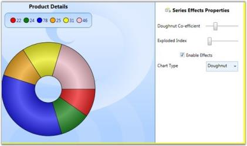 | markdownify }
{:.image }

##### Design-Time Support

Chart Control Smart Tag Support

Smart Tag appears for the Chart, Chart Area and Chart Legend. By using the Smart Tag, you can add Chart Areas, Chart Legends and Chart Series. In addition, you can customize the Chart appearance by using the Smart Tag in the designer.

The following screenshot illustrates Smart Tag support in Chart.

{  | markdownify }
{:.image }

The following screenshot illustrates Smart Tag support in Chart Area.

{  | markdownify }
{:.image }

The following screenshot illustrates Smart Tag support in Chart Legend.

{  | markdownify }
{:.image }

##### Chart and ChartArea Legends

###### Legend Label

Essential Chart allows you to customize the legend icon of a chart. You can change the legend Icon of a chart legend by using the options provided. The legend icons can be represented in two ways:

* It can be set as a symbol.
* It can be set as the chart icon (in case of chart series).

The LegendIcon property is used to set the required icon.

* If LegendIcon property is set to a symbol, it will be displayed as the selected legend icon.
* If LegendIcon property is set to the SeriesType, the corresponding chart icon will be displayed as legend icon.

Properties

The following table provides more information on the property used.

_Property_

<table>
<tr>
<td>
Property</td><td>
Description</td><td>
Type</td><td>
Value Returned</td></tr>
<tr>
<td>
LegendIcon</td><td>
The legend icon is displayed according to the option selected. </td><td>
Dependency</td><td>
Enum(ChartLegenIcon)</td></tr>
</table>
Events

The following table provides more information on the event used.

_Events_

<table>
<tr>
<td>
Event</td><td>
Event Trigger</td><td>
Event Args</td><td>
Purpose</td></tr>
<tr>
<td>
LegendIconChanged</td><td>
The event is triggered by calling a method when the value of LegendIcon is changed.</td><td>
OnLegendIconChanged</td><td>
The Icon is changed whenever the value for LegendIcon property changes.</td></tr>
</table>
Methods

The following table provides more information on the method used.

_Methods_

<table>
<tr>
<td>
Method</td><td>
Parameters</td><td>
Return Type</td><td>
Description</td></tr>
<tr>
<td>
UpdateLegendIcon</td><td>
ChartSeries</td><td>
Void</td><td>
Updation of the legend icon with a new icon.</td></tr>
</table>
Customizing Legend Icon

The legend icon can be customized by using the following code exaples.

1. Using XAML

[XAML]

&lt;syncfusion:ChartLegend Name="chrtlgnd" BorderThickness="0.5" &gt;&lt;/syncfusion:ChartLegend&gt;

<syncfusion:ChartSeries Name="SeriesA" LegendIcon="Circle" Type="Bar" BindingPathX="FruitName"

BindingPathsY="Price,NumberOfFruits,FruitID,Year" Label="Series A" Stroke="#FF000000" StrokeThickness="0.5" >&lt;/syncfusion:ChartSeries&gt;

2. Using C#

[C#]

Chart1.Areas[0].Series[0].LegendIcon = ChartLegendIcon.Circle;

Run the code. The following output is displayed.

{  | markdownify }
{:.image }

##### User Interaction

###### Zooming

Chart for WPF lets you zoom into a narrower range within the chart area. This section discusses the following topics.

Zooming Using Mouse

You can switch to the zooming mode in the Chart by using the built-in context menu. Users can choose to zoom a specific series, if they do so, the rest of the series will be rendered semi-transparently, based on the InactiveSeriesOpacityOnZoom property (discussed later in this section).

{  | markdownify }
{:.image }

Zoom Using Zooming Toolkit

In the Zooming mode, a Zooming toolkit is displayed at the top-left corner of the ChartArea. Using the buttons in the Zooming toolkit, ChartSeries can be zoomed in, out, reset or closed (to exit zoom mode).

{  | markdownify }
{:.image }

Display/Hide Buttons in Zooming Toolkit

The visibility of the Zooming Toolkit or the individual buttons in the toolkit can be controlled by using the following properties.

_Property Table_

<table>
<tr>
<td>
Property</td><td>
Description</td></tr>
<tr>
<td>
ZoomInButtonVisibility</td><td>
gets or sets zoom in button visibility</td></tr>
<tr>
<td>
ZoomOutButtonVisibility</td><td>
gets or sets zoom out button visibility</td></tr>
<tr>
<td>
ZoomCloseButtonVisibility</td><td>
gets or sets zoom close button visibility</td></tr>
<tr>
<td>
ZoomResetButtonVisibility</td><td>
gets or sets zoom reset button visibility</td></tr>
<tr>
<td>
ZoomingToolkitVisibility</td><td>
gets or sets zooming toolkit visibility</td></tr>
</table>

[XAML]

<sfchart:ChartArea  sfchart:ChartZoomingToolkit.ZoomInButtonVisibility="Collapsed"

sch:ChartZoomingToolkit.ZoomOutButtonVisibility="Hidden" sch:ChartZoomingToolkit.ZoomResetButtonVisibility="Collapsed" sch:ChartZoomingToolkit.ZoomingToolkitVisibility="Visible">

&lt;!—-your code here--!&gt;

&lt;/sfchart:ChartArea&gt;

[C#]

ChartZoomingToolkit.SetZoomInButtonVisibility(chartArea, Visibility.Collapsed);

ChartZoomingToolkit.SetZoomOutButtonVisibility(chartArea, Visibility.Hidden);

ChartZoomingToolkit.SetZoomResetButtonVisibility(chartArea, Visibility.Collapsed);

ChartZoomingToolkit.SetZoomingToolkitVisibility(chartArea, Visibility.Visible);

Zooming by Manual Drag

You can also manually drag-select an area to perform the zoom operation.

{ 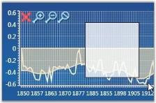 | markdownify }
{:.image }

Zooming Through Code

Chart can be zoomed programmatically by using Chart Commands, Keyboard Keys and Pre-defined Properties.

Zooming Using Chart Commands

Zooming mode can be enabled by calling the appropriate Chart Commands.

[C#]

// To enter Zooming mode.

ChartAreaCommands.SwitchZooming.Execute(null, chart1.Areas[0]);

// To perform Zoom In.

ChartAreaCommands.ZoomIn.Execute(null, Chart1.Areas[0]);

// To perform Zoom Out.

ChartAreaCommands.ZoomOut.Execute(null, Chart1.Areas[0]);

// To Perform Zoom Reset.

ChartAreaCommands.ZoomReset.Execute(null, Chart1.Areas[0]);

// To Close the Zooming Toolkit again, use CancelZooming (exit zooming mode).

ChartAreaCommands.CancelZooming.Execute(null, Chart1.Areas[0]);

Enabling Zooming Without Using Zooming Toolkit

Drag-select an area in the Chart to enable zooming when the zooming toolkit is invisible. The following code example illustrates this.

[C#]

// Enable zoom mode.

ChartAreaCommands.SwitchZooming.Execute(null, Chart1.Areas[0]);

// Hide the zooming toolkit.

ChartZoomingToolkit.SetZoomingToolkitVisibility(Chart1.Areas[0], Visibility.Collapsed);

Zoom Using Keyboard Keys

You can enable zooming by using the keyboard keys. The following code example shows how the ChartArea can be Zoomed by using the

ALT+I key combination.

[C#]

// Adding Key Gesture Alt + I keys to Zoom In the Chart Area.

KeyGesture gesture = new KeyGesture(Key.I, ModifierKeys.Alt);

KeyBinding zoomInGesture = new KeyBinding(ChartAreaCommands.ZoomIn, gesture) { CommandTarget = this.Chart1.Areas[0] };

this.InputBindings.Add(zoomInGesture);

Zooming using Pre-defined Properties

ZoomFactor

The Chart can be zoomed by using the Axis.ZoomFactor property. The ZoomFactor is usually between 0 and 1. When set to 1, the chart will not be zoomed. When set to 0.5, the size of the chart will be doubled. Scrollbars will be automatically displayed to allow any section of the hidden range to be viewed. The default value is 1.

[C#]

// Zoom the Chart with Zoom factor 0.5.

this.Chart1.Areas[0].PrimaryAxis.ZoomFactor = 0.5;

ZoomPosition

You can also programmatically specify the scrollbar position of the zoomed-in axes by using the Axis.ZoomPosition property.

The following code example shows how the chart with values 0 to 5 will have the scrollbar positioned near point 5, when the ChartAxis is zoomed, with the ZoomFactor set to 0.5.

[C#]

// Zoom the Chart with Zoom factor 0.5.

this.Chart1.Areas[0].PrimaryAxis.ZoomFactor = 0.5;

// Position the ScrollBar to point 5.

this.Chart1.Areas[0].PrimaryAxis.ZoomPosition = 5;  

{  | markdownify }
{:.image }

Disable Zooming

Zooming using mouse can be disabled for a particular axis by using the EnableZooming property. The following code example illustrates how zooming is disabled only for the Primary axis of the ChartArea while it is enabled for the other axes.

[XAML]

&lt;syncfusion:ChartArea.PrimaryAxis&gt;

&lt;syncfusion:ChartAxis EnableZooming="False"/&gt;

&lt;/syncfusion:ChartArea.PrimaryAxis&gt;

[C#]

this.Chart1.Areas[0].PrimaryAxis.EnableZooming = false;

> 

> _Note: EnableZooming property is useful to disable zooming using mouse and keyboard keys. But it will not take effect when the ZoomFactor property is set. When ZoomFactor property is set between 0 to 1, and EnableZooming property is set to False, the axis will still be zoomed._

> 

Zooming Specific ChartAxis Associated with a ChartSeries Through Code

The Axis associated with a particular ChartSeries can be enabled/disabled through the Zooming functionality. This is achieved by using the series.IsZoomable property. 

The following code illustrates how zooming can be disabled for all the axis in Chart and enabled only for the axis associated with Chart Series2.

[C#]

&lt;syncfusion:Chart&gt;

    &lt;syncfusion:ChartArea IsContextMenuEnabled="True" ZoomAllAxes="False"&gt;

        &lt;syncfusion:ChartSeries Label="Series1" Data="1 1 2 2 3 3 4 4 5 5 6 6" Interior="Red" /&gt;

        &lt;syncfusion:ChartSeries Label="Series2" Data="1 60 2 50 3 40 4 30 5 20 6 10" IsZoomable="True" Interior="Blue"&gt;

            &lt;syncfusion:ChartSeries.YAxis&gt;

                &lt;syncfusion:ChartAxis Orientation="Vertical"/&gt;

            &lt;/syncfusion:ChartSeries.YAxis&gt;

        &lt;/syncfusion:ChartSeries&gt;

        &lt;syncfusion:ChartSeries Label="Series3" Data="1 10 2 20 3 30 4 40 5 30 6 20" Interior="Green"&gt;

            &lt;syncfusion:ChartSeries.YAxis&gt;

                &lt;syncfusion:ChartAxis Orientation="Vertical"/&gt;

            &lt;/syncfusion:ChartSeries.YAxis&gt;

        &lt;/syncfusion:ChartSeries&gt;

    &lt;/syncfusion:ChartArea&gt;

&lt;/syncfusion:Chart&gt;

[C#]

void Window1_Loaded(object sender, RoutedEventArgs e)

{

Chart1.Areas[0].ZoomAllAxes = false;           

Chart1.Areas[0].Series[1].IsZoomable = true;

}    

The following screenshot illustrates this.

{  | markdownify }
{:.image }

> _Note: Series.IsZoomable is used to enable/disable the zooming of the Axis associated with it. Hence this property is used only in Multiple Axes Charts. This property takes effect only when zooming is performed through code. (Refer to Zooming using Keyboard Keys in this page for zooming through keyboard keys). When zooming is enabled / disabled through the context menu, this property will not take effect._

Inactive Series Opacity 

When an individual series in the chart is zoomed, the opacity of the series which have not been zoomed can be controlled, so that the series which is zoomed is clearly visible. This can be done by using the InactiveSeriesOpacityOnZoom property of the ChartSeries.

The following lines of code can be used to change the opacity of an inactive series while zooming.

[XAML]

&lt;syncfusion:ChartSeries Name="Series1" Label="Series1" Interior="Red" InactiveSeriesOpacityOnZoom="0.65" Data="1 1 2 2 3 3 4 4 5 5 6 6"/&gt;

{  | markdownify }
{:.image }

Fractional Values in Axis while Zooming

On zooming the chart, the ChartAxis Labels appear with fractional values. This can be restricted by using the Axis.IsFractionEnabledOnZoom property.

[XAML]

&lt;syncfusion:Chart Name="Chart1" Height="300" Width="400"&gt;

    &lt;syncfusion:ChartArea IsContextMenuEnabled="True" &gt;

        &lt;syncfusion:ChartArea.SecondaryAxis&gt;

            &lt;syncfusion:ChartAxis IsFractionEnabledOnZoom="False" /&gt;

        &lt;/syncfusion:ChartArea.SecondaryAxis&gt;

        &lt;syncfusion:ChartSeries Name="Series1" Label="Series1" Interior="Red" Data="1 1 2 2 3 3" /&gt;

    &lt;/syncfusion:ChartArea&gt;

&lt;/syncfusion:Chart&gt;

[C#]

// Hides fractional values in Secondary Axis labels.

Chart1.Areas[0].SecondaryAxis.IsFractionEnabledOnZoom = false;

__For more details, refer to the sample in the following location:

_...\My Documents\Syncfusion\EssentialStudio\&lt;Version Number&gt;\WPF\Chart.WPF\Samples\3.5\WindowsSamples\User Interaction\Zoom And Scrolling Demo_

Zooming and Panning support for Chart WPF

Essential Chart WPF is now enhanced with Zooming and Panning. This feature is used to drag the Zoomed chart area from one point to the other.

Adding Zooming and Panning

Add Zooming and Panning to the chart, by using the following code.

[XAML] 

 &lt;syncfusion:Chart Name="Chart1" Grid.Row="1" Margin="10"&gt;

         &lt;syncfusion:ChartArea Name="area" IsContextMenuEnabled="True"/&gt;

&lt; syncfusion:Chart/&gt;

[C#] 

ChartArea area = this.Chart1.Areas[0];

            area.IsContextMenuEnabled = true;

{  | markdownify }
{:.image }

See Also

Highlighting and Selection, Chart Area ContextMenu

###### Highlighting And Selection

The following topics discuss highlight data points and selecting data points:

###### ToolTip

ToolTip can be shown on various sections of a chart control such as chart, chart area, chart legend and chart series. Refer to the following code example for creating and assigning the tooltip to the chart.

[XAML]

&lt;!-- Sets Tooltips for a chart--&gt;

&lt;sf:Chart ToolTip="Chart ToolTip"&gt;

      &lt;syncfusion:ChartArea Margin="10" ToolTip="ChartArea ToolTip"&gt;

        &lt;syncfusion:ChartArea.Legend&gt;

          &lt;syncfusion:ChartLegend ToolTip="ChartLegend ToolTip" /&gt;

        &lt;/syncfusion:ChartArea.Legend&gt;

                &lt;syncfusion:ChartSeries Label="Series 1" Data="1 10 2 45 3 13 4 25 5 39" ToolTip="ChartSeries ToolTip" IsIndexed="False"/&gt;                

      &lt;/syncfusion:ChartArea&gt;

    &lt;/syncfusion:Chart&gt;

The following image illustrates the tooltip feature in various sections of the chart.

{  | markdownify }
{:.image }

Default ToolTips for a Chart

Essential Chart for WPF is now enhanced with the ShowTooltip property, which allows ToolTips to be displayed.  

_Property Table_

<table>
<tr>
<td>
Name of property</td><td>
Description </td><td>
Type of property</td><td>
Value it accepts</td><td>
Property syntax</td></tr>
<tr>
<td>
ShowTooltip</td><td>
Controls the visibility of ToolTips</td><td>
Dependency Property</td><td>
Bool or True/False.</td><td>
ShowToolTip="True"</td></tr>
</table>
Setting a ToolTip for a Chart

To enable ToolTips for a chart, set the ShowTooltip property to True. The following code illustrates setting the ShowTooltip property.

[XAML]

&lt;syncfusion:ChartSeries ShowToolTip="True"&gt;

[C#] 

Series.ShowToolTip = true;

{ 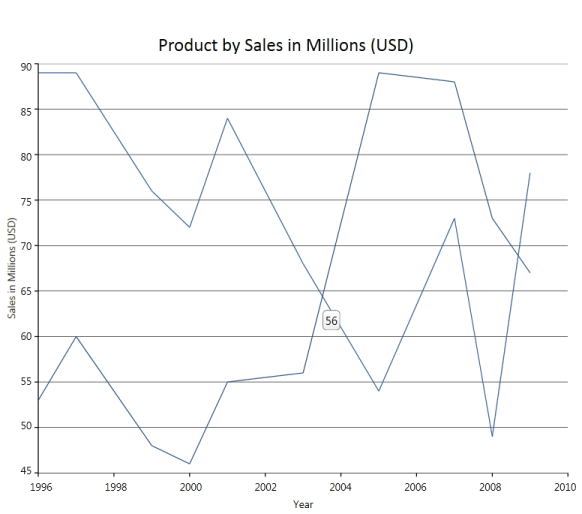 | markdownify }
{:.image }

Custom ToolTip for a Series

You can set custom tooltips for the chart series. Associate a custom tooltip text with appealing appearance to the chart series using the following code example.

[XAML]

&lt;Window.Resources&gt;

 &lt;!--Defining custom Tooltip in Resources--&gt;

        &lt;ToolTip x:Key="CustomToolTip"&gt;

            &lt;ToolTip.Template&gt;

                &lt;ControlTemplate&gt;

                    <Border CornerRadius="5" Background="Bisque" TextBlock.Foreground="Blue"  Padding="3"

                    BorderBrush="Black" BorderThickness="2">

                        &lt;Grid&gt;

                            &lt;Grid.RowDefinitions&gt;

                                &lt;RowDefinition/&gt;

                                &lt;RowDefinition/&gt;

                            &lt;/Grid.RowDefinitions&gt;

                            &lt;Grid.ColumnDefinitions&gt;

                                &lt;ColumnDefinition/&gt;

                                &lt;ColumnDefinition/&gt;

                            &lt;/Grid.ColumnDefinitions&gt;

                            &lt;TextBlock Text="X value: "/&gt;

                &lt;TextBlock Text="{Binding CorrespondingPoints[0].DataPoint.X}" Grid.Column="1"/&gt;

                &lt;TextBlock Text="Y value: " Grid.Row="1"/&gt;

                &lt;TextBlock Text="{Binding CorrespondingPoints[0].DataPoint.Y}" Grid.Column="1" Grid.Row="1"/&gt;

              &lt;/Grid&gt;

                    &lt;/Border&gt;

                &lt;/ControlTemplate&gt;

            &lt;/ToolTip.Template&gt;

        &lt;/ToolTip&gt;

  <!--Note: To have custom text alone a simple tooltip as below could be used

        &lt;ToolTip x:Key="SimpleToolTip" Content="{Binding CorrespondingPoints[0].DataPoint.X}"/&gt;-->

 &lt;/Window.Resources&gt;

&lt;!--Associate Custom ToolTip with ChartSeries--&gt;

 &lt;syncfusion:ChartSeries Label="Series 1" Data="1 10 2 45 3 13 4 25 5 39" ToolTip="{StaticResource CustomToolTip}" IsIndexed="False"/&gt;

{  | markdownify }
{:.image }

###### Toolbar

A built-in toolbar is available for the Chart control, which can be made visible to enable the user to do the following functionalities: 

* Print the chart  
* Print preview the chart 
* Save Chart as an image 
* Copy chart image to clipboard 
* Toggle Legend Appearance 
* Toggle Zoom mode
* Change the color palette of the chart 
* Change Chart Type 

The code as follows illustrates how a ToolBar could be added to the Chart control.

[XAML]

&lt;syncfusion:Chart.ToolBar &gt;

        <syncfusion:ChartToolBar Name="chartToolbar"  SelectedItemChanged="ChartToolBar_SelectedItemChanged" 

                                         CloseButtonVisibility="Visible"  TitleBarVisibility="Visible"       >

        &lt;/syncfusion:ChartToolBar&gt;

&lt;/syncfusion:Chart.ToolBar&gt;

{  | markdownify }
{:.image }

Excluding or including the Toolbar While Printing and Saving a Chart

You can exclude or include the toolbar while printing and saving a chart using the _ShowToolBarOnPrintAndSave_ property. To include the toolbar, set this to true. To exclude it set this to false. By default this is set to true. 

The following code illustrates how to exclude the toolbar while printing and saving:

[XAML]

&lt;syncfusion:Chart ShowToolBarOnPrintAndSave="False"&gt;

&lt;syncfusion:Chart.ToolBar&gt;

&lt;syncfusion:ChartToolBar/&gt;

&lt;/syncfusion:Chart.ToolBar&gt;

&lt;syncfusion:ChartArea&gt;

&lt;/syncfusion:ChartArea&gt;

&lt;/syncfusion:Chart&gt;

[C#]

Chart1.ShowToolBarOnPrintAndSave = false;

The following code illustrates how to include the toolbar while printing and saving:

[XAML]

&lt;syncfusion:Chart ShowToolBarOnPrintAndSave="True"&gt;

&lt;syncfusion:Chart.ToolBar&gt;

&lt;syncfusion:ChartToolBar/&gt;

&lt;/syncfusion:Chart.ToolBar&gt;

&lt;syncfusion:ChartArea&gt;

&lt;/syncfusion:ChartArea&gt;

&lt;/syncfusion:Chart&gt;

[C#]

Chart1.ShowToolBarOnPrintAndSave = true;

###### Property Settings Dialog

This topic provides an introduction to Property Settings Dialog. Property Settings Dialog lets you to change the properties of the chart during runtime.

This topic encapsulates the following details:

* Property Settings Dialog
* What are all the properties that can be set?
* Advantages Of Property Settings Dialog
* Special Features of Property Settings Dialog

Property Settings Dialog

Essential Chart for WPF provides the Property Settings Dialog, to change the properties of the chart during runtime. This is to provide the developer, the ability to change the chart properties without the using the code.

There are two ways to invoke this dialog. They are, Using Tool Bar and ShowPropertyDialog. The following section briefs these two options.

Using ToolBar

By clicking the Properties Tool Item in the Toolbar, the property settings dialog can be invoked.

{  | markdownify }
{:.image }

Using ShowPropertyDialog

The API, Show Propert dialog, helps you to invoke the property settings dialog.

[C#]

// Invokes the property dialog box.

private void PropertyDialogbtn_Click(object sender, RoutedEventArgs e)

{

     if (Chart1 != null)

     {                

         Chart1.ShowPropertyDialog();

     }                      

}

[VB]

' Invokes the property dialog box.

Private Sub PropertyDialogbtn_Click(ByVal sender As Object, ByVal e As RoutedEventArgs)

    If Chart1 IsNot Nothing Then

        Chart1.ShowPropertyDialog()

    End If

End Sub

Setting Properties

The property settings dialog allows you to set various properties of the chart. The chart properties are grouped together according to their functionality. The Property Settings Dialog contains the following Tab items. 

* Chart
* Chart Area
* Chart Series
* Legend
* x-axis
* y-axis  

_Properties_

<table>
<tr>
<td>
Tab Item</td><td>
Description</td></tr>
<tr>
<td>
Chart</td><td>
contains the properties specifically related to ChartFor example, Chart Background property, Chart Border property, and so on.</td></tr>
<tr>
<td>
Chart Area</td><td>
contains the properties specifically related to Chart AreaFor example, Chart Area Background property.</td></tr>
<tr>
<td>
Chart Series</td><td>
contains the properties specifically related to Chart SeriesFor example, SeriesNumber, AdornmentInfo, and so on</td></tr>
<tr>
<td>
Legend</td><td>
contains the properties specifically related to LegendFor example, RowCount, ColumnCount, and so on.</td></tr>
<tr>
<td>
X-Axis</td><td>
contains the properties specific to Primary axis of the ChartFor example, AxisLineWidth, AxisTitle, and so on.</td></tr>
<tr>
<td>
Y-Axis</td><td>
contains the properties specific to Secondary axis of the Chart, which is similar to x-axis tab</td></tr>
</table>

{ 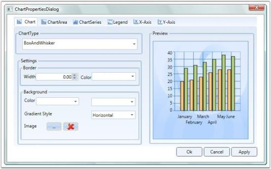 | markdownify }
{:.image }

The modified settings can be applied to the Main Chart when you click Apply or Ok.

Methods

Custom Tab

The WPF Chart property settings dialog allows you to add your own custom tabs in the dialog. The added custom tab also has features through other tabs, like initializing the properties, changing the settings of the properties, Applying settings to the main chart. The following segment illustrates this special feature.

This option is to allow the developer to add his/her own tab into the property settings dialog. To add custom tab, AddCustomTabs API is used.

[C#]

  //  Adding the Custom Tab 

private void AddTab_Click(object sender, RoutedEventArgs e)

{

    tbi.Header = "Custom Tab";           

    Chart1.AddCustomTabs(tbi);  

}

[VB]

'Adding the Custom Tab

Private Sub AddTab_Click(ByVal sender As Object, ByVal e As RoutedEventArgs)

   tbi.Header = "Custom Tab"

   Chart1.AddCustomTabs(tbi)

End Sub

{  | markdownify }
{:.image }

[C#]

//Adding the custom tab in the propertdialog

Chart1.AddCustomTabs(tabItem);   

Hiding the Tab

You can hide the tab that is not required using the Chart.HideTabItem(tabIndex) method. 

{  | markdownify }
{:.image }

[C#]

//To hide the ChartSeries Tab.

Chart1.HideTabItem(3);

Events

Various events that can be used while invoking a property Dialog are listed as follows:

Initialize CustomTab Page

The InitializeCustomTabPages event is used to intialize the Custom tab that is created using the above code.

[C#]

//event raised

Chart1.InitializeCustomTabPages += new RoutedEventHandler(Chart1_ItemAdded);

//Initialize the custom tab:

private void AddTab_Click(object sender, RoutedEventArgs e)

{

   //Tab item Initialization 

}

Apply Custom Tab Page

The Custom Tab page properties can be applied to the Main chart, similar to applying property settings available in the other tabs. This can be achieved by raising the ApplyCustomTabPages event.

[C#]

// Event raising

Chart1.ApplyCustomTabPages += new RoutedEventHandler(Chart1_ItemApplied);

//Applying the Custom tab item

 void Chart1_ItemApplied(object sender, RoutedEventArgs e)

{

     //Code for applying the custom tab item.

}

__For more details, refer to the sample in the following location:

_...\My Documents\Syncfusion\EssentialStudio\&lt;Version Number&gt;\WPF\Chart.WPF\Samples\3.5\WindowsSamples\User Interaction\Property Dialog Demo_

###### Zoomed Area Selection

Essential Chart WPF lets the user to select the zoomed area in a chart. This can be achieved using the ZoomedXRange and ZoomedYRange properties. Under a zoomed state, you can select:

* The range of zoomed area in horizontal axis.
* The range of zoomed area in vertical axis.

Properties

The following table provides more information on the property used.

_Property_

<table>
<tr>
<td>
Property</td><td>
Description</td><td>
Type</td><td>
Value Returned</td></tr>
<tr>
<td>
ZoomedXRange</td><td>
Dependency</td><td>
DoubleRange</td><td>
Selects the zoomed area for horizontal axis.</td></tr>
<tr>
<td>
ZoomedYRange</td><td>
Dependency</td><td>
DoubleRange</td><td>
Selects the zoomed area for vertical axis.</td></tr>
</table>
Methods

The following table provides more information on the method used.

_Methods_

<table>
<tr>
<td>
Method</td><td>
Parameters</td><td>
Return Type</td><td>
Description</td></tr>
<tr>
<td>
VisibileRangeForZoomAllAxis</td><td>
ChartArea,ChartAxis</td><td>
Void</td><td>
Enables zoom in all axes.</td></tr>
<tr>
<td>
VisibleRangeForZoomHorizontalAxis</td><td>
ChartArea,ChartAxis</td><td>
Void</td><td>
Enables zoom in x-axis.</td></tr>
<tr>
<td>
VisibleRangeForZoomVerticalAxis</td><td>
ChartArea,ChartAxis</td><td>
Void</td><td>
Enables zoom in y-axis.</td></tr>
</table>
Selecting a Zoomed Area

The following code example illustrates selection of zoomed area in a chart.

1. Using XAML

[XAML]

<TextBox Margin="0,6,12,2" Name="textBox1" Grid.Column="2" Grid.Row="1" Text="{Binding ElementName=area,Path=ZoomedXRange,

Converter={StaticResource rangeConverter}}" />

<TextBox Margin="0,6,11.999,2" Name="textBox2" Grid.Column="4" Grid.Row="1" Text="{Binding ElementName=area,Path=ZoomedYRange,

Converter={StaticResource rangeConverter}}"/>

{  | markdownify }
{:.image }

###### Customizing Context Menu

Essential Chart for WPF enables users to add custom menu items to the default context menu.

Adding a Menu Item to the Context Menu

Menu items can be added by using two methods: adding with the default menu, or adding as a new list.

Adding with the Default Menu

By setting ContextMenuType to DefaultWithCustom, the menu item is added along with the default list.

The following code illustrates this.

[XAML]

&lt;syncfusion:ChartArea IsContextMenuEnabled="True" ContextMenuType="DefaultWithCustom"&gt;                &lt;syncfusion:ChartArea.CustomContextMenuItems&gt;

                    &lt;MenuItem Header="MyMenuItem"/&gt;

                &lt;/syncfusion:ChartArea.CustomContextMenuItems&gt;

    &lt;/syncfusion:ChartArea&gt;

{  | markdownify }
{:.image }

Adding Menu Items as a New List

By setting ContextMenuType to Custom, menu items are added as a new list.

[XAML]  

&lt;syncfusion:ChartArea IsContextMenuEnabled="True" ContextMenuType="Custom"&gt;

                &lt;syncfusion:ChartArea.CustomContextMenuItems&gt;

                  &lt;MenuItemHeader="MyMenuItem"Command="ApplicationCommands.Save"/&gt;

                &lt;/syncfusion:ChartArea.CustomContextMenuItems&gt;

{  | markdownify }
{:.image }

_Property Table_

<table>
<tr>
<td>
Name of Property</td><td>
Description </td><td>
Type of Property</td><td>
Value It Accepts</td><td>
Property Syntax</td><td>
Sub Properties</td></tr>
<tr>
<td>
CustomContextMenuItems</td><td>
Used to customize the context menu.</td><td>
Normal</td><td>
ObservableCollection<MenuItem></td><td>
&lt;syncfusion:ChartArea.CustomContextMenuItems&gt;                    &lt;MenuItem Header="MyMenuItem"/&gt;                &lt;/syncfusion:ChartArea.CustomContextMenuItems&gt;</td><td>
Property Name : ContextMenuType Type:DependacyProperty /ContextMenuTypes /Ex: ContextMenuTypes.Custom </td></tr>
</table>
_Events_

<table>
<tr>
<td>
Name of the Event</td><td>
Description </td><td>
Method</td><td>
Event Args</td></tr>
<tr>
<td>
ChartContextMenuEventHadler</td><td>
Used to handle adding items to the context menu and removing items from the context menu.</td><td>
ChartContextMenuEventHadler</td><td>
ChartContextMenuEventArgs</td></tr>
</table>
###### Built-in Drag-and-Drop Support for Chart Series 

Features

This feature helps the user to drag the Chart point from one location to another location within the Chart area and improves the user interaction by editing the under bound model’s object at run time. This feature also maps the mouse coordinates to the coordinates of the ChartAxis and positions the data point. Hence, all the relevant properties like tooltip and series annotation are changed according to the new position.

Use Case Scenarios

* Inbuilt Drag and Drop support for the Chart Series can be used in rescheduling the number of working days for any task assigned to employee. 
* Reschedule the task start and end time using typical Gantt Chart type.
* It allows the user to modify the under bound data of segment dynamically by clicking and dragging the segment to the new position inside the Chart Area.

{  | markdownify }
{:.image }

> _Note: The AllowSegmentDragDrop property does not work when you apply a custom data template for the Chart Series, because the Chart Series’ default template is overridden by the custom template that affects the existing behavior._

Tables for Properties, Methods, and Events

Properties

_Propert Table_

<table>
<tr>
<td>
Property </td><td>
Description </td><td>
Type </td><td>
Data Type </td><td>
Reference links </td></tr>
<tr>
<td>
AllowSegmentDragDrop</td><td>
To set the Drag and Drop Support for the Chart Series</td><td>
Dependency Property</td><td>
Boolean</td><td>
NA</td></tr>
</table>
Events

_ChartSegmentDragging Table_

<table>
<tr>
<th>
Event </th><th>
Description </th><th>
Arguments </th><th>
Type </th><th>
Reference links </th></tr>
<tr>
<th>
ChartSegmentDragging</th><th>
Triggered before dragging is started</th><th>
ChartSegment </th><th>
Routed Event </th><th>
NA</th></tr>
</table>
_ChartSegmentDragged Table_

<table>
<tr>
<th>
Event </th><th>
Description </th><th>
Arguments </th><th>
Type </th><th>
Reference links </th></tr>
<tr>
<th>
ChartSegmentDragged</th><th>
Event is triggered immediately after dragging is started </th><th>
ChartSegment </th><th>
Routed Event </th><th>
NA</th></tr>
</table>
_ChartSegmentDropping Table_

<table>
<tr>
<th>
Event </th><th>
Description </th><th>
Arguments </th><th>
Type </th><th>
Reference links </th></tr>
<tr>
<th>
ChartSegmentDropping</th><th>
Triggered before dropping the segment  </th><th>
ChartSegment </th><th>
Routed Event </th><th>
NA</th></tr>
</table>
_ChartSegmentDropped Table_

<table>
<tr>
<th>
Event </th><th>
Description </th><th>
Arguments </th><th>
Type </th><th>
Reference links </th></tr>
<tr>
<th>
ChartSegmentDropped</th><th>
Event is triggered immediately after the segment is dropped. </th><th>
ChartSegment </th><th>
Routed Event </th><th>
NA</th></tr>
</table>
Sample Link

To view sample:

1. Open the WPF sample browser from the dashboard. 
2. Navigate to WPF Chart -> User Interaction->Drag and Drop support demo

Adding Inbuilt Drag and Drop Support for Chart Series to an Application 

Inbuilt Drag and Drop Support can be added to an Application using the following code example:

[C#]

Chart1.Areas[0].AllowSegmentDragDrop = true;

[XAML]

        &lt;sync:Chart x:Name="Chart1"&gt;

            &lt;sync:ChartArea AllowSegmentDragDrop="True"&gt;                

                &lt;sync:ChartSeries x:Name="series1" Type="Bubble"/&gt;                              

            &lt;/sync:ChartArea&gt;

        &lt;/sync:Chart&gt;                              

###### ChartAreaBounds

Essential Chart is now enhanced to obtain the list of points and the DataSource present in the user-given rectangle bounds region, using BoundsToPoints and BoundsToDataSource methods of ChartArea control.  The rectangle region given by the user can also convert to the corresponding axes range values using the ConvertBoundsToAxesRangeValues method of ChartArea control.

> _Note: The given points of the rectangle region can internally convert to the relative position of the ChartArea control._

Use Case Scenario

ChartAreaBounds is used in obtaining the list of points bound to a user-given rectangle .i.e. viewing the survey details in the area selected by the user.

{  | markdownify }
{:.image }

Adding ChartAreaBounds to an Application 

BoundsToDataSource: You can use the BoundsToDataSource method of ChartArea control to get the list of the data that exist in the given rectangle region. The following code example illustrates the invoke of this method:

[C#]

//Get the List of underlying objects avilable in the given "rect" region

chartdatasource.ItemsSource = chart.Areas[0].BoundsToDataSource(rect, chart.Areas[0].Series[0]);

BoundsToPoints: You can use the BoundsToPoints method of ChartArea control to get the list of the chart points that exist in the given rectangle region. The following code example illustrates how to invoke this method.

[C#]

//Get the list of chart points existing in the given "rect" region

chartpoints.ItemsSource = chart.Areas[0].BoundsToPoints(rect, chart.Areas[0].Series[0]);

{  | markdownify }
{:.image }

_Methods_

<table>
<tr>
<th>
Return Type</th><th>
Method Name</th><th>
Description</th></tr>
<tr>
<td>
ObservableCollection<object></td><td>
BoundsToDataSource(Rect rect, ChartSeries series)</td><td>
Returns the collection of underlying data objects (existing in the user-given rectangle region) from the user bound data on the DataSource property of ChartSeries. rect:  The given rectangle points can internally convert relative to the ChartArea control. series: Initializes the series, which contains the actual DataSource in Chart Area. </td></tr>
<tr>
<td>
ObservableCollection<IChartDataPoint></td><td>
BoundsToPoints(Rect rect, ChartSeries series)</td><td>
Returns the Chart points objects (existing in the given Rect region) from the specific ChartSeries.rect: The given rectangle points can internally convert relative to the ChartArea control.series: Initializes the series, which contains the actual DataSource in the Chart area.</td></tr>
<tr>
<td>
Rect</td><td>
ConvertBoundsToAxesRangeValues(ChartAxis xAxis, ChartAxis yAxis, Rect actualRect)</td><td>
Converts the given actual rectangle region coordinates to the corresponding chart axes range values.xAxis: Initializes the X-Axis of the particular Chart series.yAxis: Initializes the Y-Axis of the particular Chart Series.actualRect:  The given rectangle points can internally convert relative to the ChartArea control.</td></tr>
</table>
Sample Link

To run the sample:

1. Open Essential Studio Dashboard by selecting Start -> Program -> Syncfusion-> Essential Studio &lt;&lt;Version Number&gt;> -> Dashboard.
2. To run the UI Chart WPF samples, select Run locally installed samples from the WPF drop-down list in the User Interface pane.
3. Select Chart in the sample browser.
4. Select User Interaction from the Essential Chart menu and choose Bounds To Rectangle Demo. 
5. Click the Run Sample button.

To open the sample project:

1. Go to the following location in your system:  
2. “&lt;sample installation location&gt;\Syncfusion\EssentialStudio\Version Number \WPF\Chart.WPF\Samples\3.5\WindowsSamples\User Interaction\Bounds To Rectangle Demo”.
3. This location contains two sub folders CS and VB.  You can open the sample projects from the respective folders based on your application developing language.
###### Serialization 

Serialization is the process of converting the state of an object into a form that can be persisted or transported. The complement of serialization is deserialization, which converts a stream into an object. Together, these processes allow data to be easily stored and transferred.

Serialization in Essential Chart WPF

Essential Chart WPF has built-in support to serialize itself into stream of XAML string. Essential Chart works on the basis of XamlWriter.Save. The API Chart.Serialize serializes the Chart control into XAML string. API Chart.Deserialize does complement for Chart.Serialize, it converts the XAML string passed as parameter to this method into Chart object. 

Following are some useful behaviors of Essential Chart Serialization feature. 

* Essential Chart WPF serialization is able to save Bindings to the Chart control that is being serialized.
* Essential Chart WPF serialization can serialize Templates and Styles. For instance, ChartAxis.LabelTemplate can be serialized. Hence you can save and restore the template that is defined for ChartAxis Labels.
* Essential Chart WPF can serialize almost all types of data bound to it except XML data.
* The Chart control accessess the data set to the ChartSeries and saves them. If Binding is set on the ChartSeries.DataSource, then the serialized string contain Binding code in the XAML string. If ChartSeries.DataSource is initialized in XAML or C#, then the serialized string contain the run time value of the collection. 
* Essential Chart Serialization feature enables to save and restore almost all interactive features available in Chart WPF. Interactive features namely, the current value of Zooming position, the interactive cursor position and so on can be saved and restored.

Use Case Scenarios

* Serialization feature can be used to clone Chart object.
* Chart can be saved into a XML / text file and restored.
* Chart can be stored into database and retrieved from application.
* Chart can be shipped across network. Chart can be serialized to XML and transfer it across network through web requests and responses.
* Apply Styles to the Chart and try to serialize the Chart, and reload the chart from saved XAML. 
* Save and load Chart with templates applied using StaticResources and Key References.
* Save and Load the DataBound Chart Series.

Methods

_MethodsTable_

<table>
<tr>
<th>
Method </th><th>
Description </th><th>
Parameters </th><th>
Type </th><th>
Return Type </th><th>
Reference links </th></tr>
<tr>
<th>
Serialize </th><th>
Serializes the Chart control into XAML string.</th><th>
Public void Serialize()</th><th>
N/A</th><th>
string </th><th>
{ [Serialize](http://sharepoint.syncfusion.com/workspace/Lists/FR%20Related%20Documentation%20Work/Attachments/4137/UG_WPF_Chart_5735_Final.docx) | markdownify }</th></tr>
<tr>
<th>
Deserialize</th><th>
Deserializes the string that is being passed as parameter into Chart object. Returns null if the string parameter does not represent Chart object.</th><th>
Public object Deserialize(string)</th><th>
N/A</th><th>
object</th><th>
{ [Deserialize](http://sharepoint.syncfusion.com/workspace/Lists/FR%20Related%20Documentation%20Work/Attachments/4137/UG_WPF_Chart_5735_Final.docx) | markdownify }</th></tr>
</table>
Sample Link

To run the UI WPF sample:

1. Open Essential Studio Dashboard by selecting Start -> Program -> Syncfusion-> Essential Studio &lt;&lt;Version Number&gt;> -> Dashboard.
2. Select Run locally installed samples, from the WPF drop-down list on the User Interface pane.
3. Select Chart in the sample browser.
4. Select User Interaction -> Serialization Demo on the Essential Chart pane and click the Run Sample button.

To open the sample project:

Go to the following sample location in your system:  

_“&lt;sample installation location&gt;\Syncfusion\EssentialStudio\Version Number \WPF\Chart.WPF\Samples\3.5\WindowsSamples\User Interaction\Serialization Demo”_

This location contains two sub folders CS and VB.  You can open the sample projects from the respective folders based on your application developing language.

Adding Serialization to an Application 

Serialize Chart control

The following code example explains the serialization of the Chart control.

[C#]

       string Serializedstring =  Chart1.Serialize();

The Chart1 in above code example represents the Chart object, and Serializedstring in above code example has the serialized string (XAML string) while execution. 

{  | markdownify }
{:.image }

_Serialized XAML string representing Essential Chart WPF_

Deserialize Chart control

The following code example explains the deserialization of the Chart control.

[C#]

Chart DeserializedChartControl = new Chart();

DeserializedChartControl = DeserializedChartControl.Deserialize(Serializedstring) as Chart;

The Chart1 in above code example represents the Chart object, and Serialized string in the above code example needs to be XAML representation of a Chart object. If the string passed as a parameter to this method does not represent the Chart object, then the method returns Null value. 

###### Property Dialog for Chart

The property dialog or property window lets you to modify the values of properties of the Chart control at run time. The property dialog helps you to accurately modify the look and feel of the control. 

The property dialog has tabbed structure. There are five tabs available by default, namely Chart, ChartArea, ChartSeries, ChartAxis and ChartLegend. You can also add custom tabs to property window, which would help you to access the properties that are not available in these default tabs (For example, you can add custom tab which would modify the Chart Annotation points).

The property window has [localization support](http://help.syncfusion.com/ug_84/User%20Interface/WPF/Chart/default.htm?turl=localizationsupport.htm). The properties and their options can be viewed in local languages just by adding .resx file with local string for corresponding key values in the application.

> _Note: Any changes done in the property window directly affects the Chart control from Essential studio version 9.1 onwards whereas earlier versions have a preview chart in the property window to view the modifications._

Use Case Scenarios

* When the Chart control is used in an application and deployed, the end user or client can customize the look and feel of the Chart at run time. End user can set their own brushes, headers for Chart, Annotation Labels of Chart and etc. using the Chart property window. 
* If you need to change the Annotation labels of the Chart Control at run time, then you can add a custom tab, in which you can define controls to change the Chart Annotation label’s properties. The property window has this addition tab added to it and hence you can modify the Annotation labels of Chart at run time.

Tables for Properties, Methods, and Events

Properties

_Property Table_

<table>
<tr>
<td>
Property </td><td>
Description </td><td>
Type </td><td>
Data Type </td><td>
Reference links </td></tr>
<tr>
<td>
PropertyWindowTabs</td><td>
Represents the collection of tabs that are displayed in the property window.</td><td>
Dependency property </td><td>
TabItemCollection</td><td>
NA</td></tr>
</table>
Methods

_Method Table_

<table>
<tr>
<th>
Method </th><th>
Description </th><th>
Parameters </th><th>
Type </th><th>
Return Type </th><th>
Reference links </th></tr>
<tr>
<th>
ShowPropertyWindow </th><th>
Displays the Chart Property window</th><th>
public void ShowPropertyDialog() </th><th>
N/A</th><th>
Void</th><th>
NA</th></tr>
<tr>
<th>
ClosePropertyWindow</th><th>
Hides the Chart Property window</th><th>
public void ClosePropertyDialog()</th><th>
N/A</th><th>
Void</th><th>
NA</th></tr>
</table>
Events

_Events Table_

<table>
<tr>
<th>
Event </th><th>
Description </th><th>
Arguments </th><th>
Type </th><th>
Reference links </th></tr>
<tr>
<th>
ChartPropertyWindowOpening</th><th>
The property is triggered before the property window is displayed.This event is cancellable.</th><th>
ChartPropertyWindowCancelEventArgs e.e.PropertyWindow gives the entire property window</th><th>
Routed Event </th><th>
-</th></tr>
<tr>
<th>
ChartPropertyWindowOpened</th><th>
The property is triggered after the property window is displayed.</th><th>
ChartPropertyWindowCancelEventArgs e.e.PropertyWindow gives the entire property window</th><th>
Routed Event</th><th>
-</th></tr>
<tr>
<th>
ChartPropertyWindowClosing</th><th>
The property is triggered before the property window is displayed.This event is cancellable.</th><th>
ChartPropertyWindowCancelEventArgs e.e.PropertyWindow gives the entire property window</th><th>
Routed Event</th><th>
-</th></tr>
<tr>
<th>
ChartPropertyWindowClosed</th><th>
The property is triggered before the property window is displayed.</th><th>
ChartPropertyWindowCancelEventArgs e.e.PropertyWindow gives the entire property window</th><th>
Routed Event</th><th>
-</th></tr>
</table>
Sample Link

To run the UI WPF sample:

1. Open Essential Studio Dashboard by selecting Start -> Program -> Syncfusion-> Essential Studio &lt;&lt;Version Number&gt;> -> Dashboard.
2. Select Run locally installed samples, from the WPF drop-down list on the User Interface pane.
3. Select Chart in the sample browser.
4. Select User Interaction -> Property Dialog Demo on the Essential Chart pane and click the Run Sample button.

To open the sample project:

Go to the following sample location in your system:  

_“&lt;sample installation location&gt;\Syncfusion\EssentialStudio\Version Number \WPF\Chart.WPF\Samples\3.5\WindowsSamples\User Interaction\Property Dialog Demo”_

This location contains two sub folders CS and VB.  You can open the sample projects from the respective folders based on your application developing language.

Adding Property Dialog to an Application 

There are two ways to invoke the Property dialog. They are, using Toolbar and ShowPropertyDialog. The following section briefs these two options.

Opening Property Dialog through code

[C#]

Chart1.ShowPropertyDialog();

{  | markdownify }
{:.image }

Using Toolbar

By clicking the Properties Tool Item in the Toolbar, the property settings dialog can be invoked.

{  | markdownify }
{:.image }

Adding custom tabs to property window of Chart

You can include a custom tab to the property window in your application easily by adding a tab to the PropertyWindowTabs property. The following code example explains adding custom tab to the property window through XAML and in C#.

[XAML]

&lt;syncfusion:Chart Margin="20" Grid.Row="1" Grid.Column="0" Name="Chart1"&gt;

            &lt;syncfusion:Chart.PropertyWindowTabs&gt;

                &lt;TabItem Header="AnnotationLabels"&gt;

                    &lt;TabItem.Content&gt;

                    &lt;/TabItem.Content&gt;

                &lt;/TabItem&gt;

            &lt;/syncfusion:Chart.PropertyWindowTabs&gt;

&lt;/syncfusion:Chart&gt;

[C#]

TabItem CustomTab = new TabItem();

Chart1.PropertyWindowTabs.Add(CustomTab);

Listen to opening and closing of the property window

You can listen to opening of the property window by adding a delegate method to the event ChartPropertyWindowOpening. Similarly, you can listen to opening of the property window by adding a delegate method to the event ChartPropertyWindowClosing.

[C#]

Chart1.ChartPropertyWindowOpening += new ChartPropertyWindowCancelEventHandler(Chart1_ChartPropertyWindowOpening);

Chart1.ChartPropertyWindowClosing += new ChartPropertyWindowCancelEventHandler(Chart1_ChartPropertyWindowClosing);

[XAML]

&lt;syncfusion:Chart Margin="20" Grid.Row="1" Grid.Column="0" Name="Chart1" ChartPropertyWindowOpening="Chart1_ChartPropertyWindowOpening" ChartPropertyWindowClosing="Chart1_ChartPropertyWindowClosing" /&gt;

###### Adding Scroll Bar to a Chart

Automatic scrolling ensures that the specified data always remains visible in the chart window. If autoscrolling is enabled on an axis, then a scroll bar appears along the particular axis and the scroll bar displays a particular set of data for which the “AutoScrollingDelta” value is specified. 

Use Case Scenario

While adding huge amount of data to the chart in real time, the autoscrolling functionality helps us to view a particular set of data in the chart at a given time. This makes the scroll bar to display the recently added data and the set of newly added data to be viewed clearly, according to the AutoScrollingDelta specified for the axis in the chart.

{ 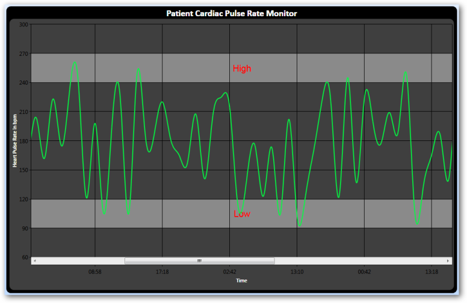 | markdownify }
{:.image }

Property

_Properties_

<table>
<tr>
<td>
Property</td><td>
Description </td><td>
Type of the property</td><td>
Value it accepts</td><td>
Reference links </td></tr>
<tr>
<td>
EnableAutoScrolling</td><td>
It enables auto scrolling</td><td>
bool</td><td>
True/False</td><td>
NA</td></tr>
<tr>
<td>
AutoScrollingDelta</td><td>
Data is displayed based on the value specified</td><td>
double</td><td>
NA</td><td>
NA</td></tr>
</table>
Adding Scroll Bar to a Chart

To enable AutoScrolling 

[XAML]

       &lt;syncfusion:ChartArea.PrimaryAxis&gt;

            &lt;!--Y axis declaration with required property settings--&gt;

            &lt;syncfusion:ChartAxis x:Name="XAxis" EnableAutoScrolling="True" AutoScrollingDelta="50" &gt;

            &lt;/syncfusion:ChartAxis&gt;

       &lt;/syncfusion:ChartArea.PrimaryAxis&gt;

[C#]

       this.XAxis.EnableAutoScrolling = true;

       this.XAxis.AutoScrollingDelta = 50;

[VB] 

      Me.XAxis.EnableAutoScrolling = True

      Me.XAxis.AutoScrollingDelta = 50

##### Chart Events

###### Chart Axis Events

ChartAxis events that could be used to track the Axis changes are as follows.

Axis.Changed

This event is triggered whenever any properties of the axis are changed.

[C#]

Area.PrimaryAxis.Changed += new EventHandler(PrimaryAxis_Changed);   

// PrimaryAxis.Changed Event

void PrimaryAxis_Changed(object sender, EventArgs e)

{

   MessageBox.Show(Area.PrimaryAxis.ToString());

}

Axis.RangeChanged

Both Primary and Secondary Axis comes with Rangechanged event. This event occurs when the Range of the axis is changed. We could get the old and new range from this event.

[C#]

///&lt;summary&gt;

///Event triggered when Axis range is changed.

///&lt;/summary&gt;

///<param name="sender">Sender Axis of event.&lt;/param&gt;

///<param name="e">ChartAxisRangeArgument that returns old and new range values.&lt;/param&gt;

void PrimaryAxis_RangeChanged(object sender, ChartAxisRangeArgs e)

{

    Console.WriteLine (e.OldValue.Start.ToString();

    Console.WriteLine (e.OldValue.End.ToString();

    Console.WriteLine (e.NewValue.Start.ToString();

    Console.WriteLine (e.NewValue.End.ToString();

}

See Also

ChartSeries MouseEvents, Chart MouseEventArgs

###### Chart Series Mouse Events

The following are the mouse events and their corresponding descriptions:

_Events_

<table>
<tr>
<td>
Event</td><td>
Description</td></tr>
<tr>
<td>
MouseClick</td><td>
This event is handled when any mouse button is clicked, while mouse pointer is over the series.</td></tr>
<tr>
<td>
MouseDown</td><td>
This event is handled when any mouse button is pressed, while mouse pointer is over the series.</td></tr>
<tr>
<td>
MouseEnter</td><td>
This event is handled when mouse pointer enters the bounds of the series.</td></tr>
<tr>
<td>
MouseLeave</td><td>
This event is handled when mouse pointer leaves the bounds of the series.</td></tr>
<tr>
<td>
MouseUp</td><td>
This event is handled when any mouse button is released over the series.</td></tr>
<tr>
<td>
MouseLeftButtonUp</td><td>
This event is handled when left mouse button is released over the series.</td></tr>
<tr>
<td>
MouseLeftButtonDown</td><td>
This event is handled when left mouse button is pressed over the series.</td></tr>
<tr>
<td>
MouseRightButtonUp</td><td>
This event is handled when right mouse button is released over the series.</td></tr>
<tr>
<td>
MouseRightButtonDown</td><td>
This event is handled when right mouse button is pressed over the series.</td></tr>
</table>
These events can be initialized using the following lines of code.

[XAML]

<sfchart:ChartSeries Data="0 3 1 4 2 5 3 9 6 4 7 3 8 5 9 11" Type="Pie" MouseClick="ChartSeries_MouseClick"

MouseHover="ChartSeries_MouseHover"/>

[C#]

ChartSeries chartSeries = new ChartSeries();

this.MouseClick += new EventHandler(ChartSeries_MouseClick);

private void ChartSeries_MouseClick(object sender, EventArgs e)

{

// Your code here

}

See Also

Chart Axis Events, Chart MouseEventArgs

###### Chart MouseEventArgs

ChartMouseEventArgs are the arguments returned when the mouse events are triggered by ChartSeries. ChartMouseEventArgs returns the segment on which the mouse events are triggered along with default mouse event args. This event args can be used to perform customization of a segment when a mouse event is encountered. The segment returns different values that can be used to perform calculations or operations. The following lines of code demonstrates how ChartMouseEventArgs can be used to retrieve information about the ChartSeries segment.

[C#]

series.MouseClick += new ChartMouseEventHandler(series_MouseClick);

static void series_MouseClick(object sender, ChartMouseEventArgs e)

{

ChartPoint point = (ChartPoint)e.Segment.CorrespondingPoints[0].DataPoint;

MessageBox.Show("X = " + point.X.ToString() + "\n" + "Y = " + point.Y.ToString());

}

{  | markdownify }
{:.image }

See Also

Chart Axis Events, Chart MouseEventArgs

##### 3D Charts

###### Enabling 3D Mode

3D mode can be easily enabled on a ChartArea using the View3DMode property as follows.

[XAML]

&lt;sfchart:Chart Name="chart1"&gt;

    &lt;sfchart:ChartArea View3DMode="True"&gt;

        <sfchart:ChartSeries Label="Sales" DataSource="{Binding Source={StaticResource myXmlData}, XPath=Products/Product}"

        BindingPathX="Month" BindingPathsY="Sales" Type="Column" >

        &lt;/sfchart:ChartSeries&gt;

        &lt;sfchart:ChartSeries Label="Projected Sales" DataSource="{Binding Source={StaticResource myXmlData}, XPath=Products/Product}"             BindingPathX="Month" BindingPathsY="Projected" Type="Column" &gt;&lt;/sfchart:ChartSeries&gt;

    &lt;/sfchart:ChartArea&gt;

&lt;/sfchart:Chart&gt;

[C#]

Chart chart = new Chart();

chart.Areas.Add(new ChartArea());

chart.Areas[0].View3DMode= true;

chart.Areas[0].Series.Add(new ChartSeries(ChartTypes.Column));   

{  | markdownify }
{:.image }

3D Mode is supported in the following chart types.

_3D Supported Charts_

<table>
<tr>
<td>
Area</td><td>
Pyramid, Funnel</td></tr>
<tr>
<td>
SplineArea</td><td>
Column</td></tr>
<tr>
<td>
StepArea</td><td>
RangeColumn</td></tr>
<tr>
<td>
StackingArea</td><td>
StackingColumn</td></tr>
<tr>
<td>
Bar</td><td>
StackingColumn100</td></tr>
<tr>
<td>
Stacking Bar</td><td>
Tornado</td></tr>
<tr>
<td>
Line</td><td>
Gantt</td></tr>
<tr>
<td>
FastLine</td><td>
Scatter</td></tr>
<tr>
<td>
Spline</td><td>
Bubble</td></tr>
<tr>
<td>
RotatedSpline</td><td>
Pie</td></tr>
<tr>
<td>
StepLine</td><td>
Doughnut</td></tr>
</table>
See Also

Chart Types, Customizing Side Walls, Camera Projection Views

###### Customizing Side Walls

3D chart allows the user to customize the look and feel of the side walls in the 3D chart. Exclusive properties has been implemented to customize the look and feel of the side walls. The following are properties that can be used to add look and feel to 3D chart.

* ShowLeftWall-This property is used to display or hide the left side wall
* ShowBackWall-This property is used to display or hide the back wall of the 3D chart
* ShowBottomWall-This property is used to display or hide the bottom wall of the 3D chart
* BackWallBackground-This property is used to customize the look and feel of the back wall
* LeftWallBackground-This property is used to customize the look and feel of the left wall
* BottomWallBackground-This property is used to customize the look and feel of the bottom wall

The following lines of code can be used to customize the side wall's look and feel.

[XAML]

&lt;sfchart:ChartArea View3DMode="True"&gt;

    &lt;sfchart:ChartArea.Chart3DSettings&gt;

        &lt;sfchart:Chart3D ShowBackWall="True" ShowLeftWall="True" ShowBottomWall="True" LeftWallBackground="AliceBlue"                             BottomWallBackground="AliceBlue" BackWallBackground="AliceBlue"/&gt;

    &lt;/sfchart:ChartArea.Chart3DSettings&gt;

    <sfchart:ChartSeries Label="Sales" DataSource="{Binding Source={StaticResource myXmlData}, XPath=Products/Product}"

    BindingPathX="Month" BindingPathsY="Sales" Type="Column">

    &lt;/sfchart:ChartSeries&gt;

    &lt;sfchart:ChartSeries Label="Projected Sales" DataSource="{Binding Source={StaticResource myXmlData}, XPath=Products/Product}"             BindingPathX="Month" BindingPathsY="Projected" Type="Column"&gt;

    &lt;/sfchart:ChartSeries&gt;

&lt;/sfchart:ChartArea&gt;

[C#]

chart1.Areas[0].Chart3DSettings.ShowBackWall = true;

chart1.Areas[0].Chart3DSettings.ShowBottomWall = true;

chart1.Areas[0].Chart3DSettings.ShowLeftWall = true;

chart1.Areas[0].Chart3DSettings.BackWallBackground = Brushes.AliceBlue;

chart1.Areas[0].Chart3DSettings.LeftWallBackground = Brushes.AliceBlue;

chart1.Areas[0].Chart3DSettings.BottomWallBackground = Brushes.AliceBlue;

{  | markdownify }
{:.image }

See Also

Enabling 3D Mode, Camera Projection Views

###### Camera Projection Views

Chart 3D supports two types of camera projection views namely perspective and orthographic. Camera projection for the chart can be changed using the CameraProjection property of the Chart3D type, as follows.

[XAML]

&lt;sfchart:ChartArea View3DMode="True"&gt;

    &lt;sfchart:ChartArea.Chart3DSettings&gt;

        &lt;sfchart:Chart3D CameraProjection="Orthographic"/&gt;

    &lt;/sfchart:ChartArea.Chart3DSettings&gt;

&lt;/sfchart:ChartArea&gt;

[C#]

chart1.Areas[0].Chart3DSettings.CameraProjection = CameraProjection.Perspective;

{  | markdownify }
{:.image }

{  | markdownify }
{:.image }

See Also

Enabling 3D Mode, Customizing Side Walls

###### 3-D Manhattan Bar Chart 

Features

3D Manhattan Chart is a three dimensional charting feature that enables the chart control to visualize data in a three dimensional space (i.e. along the X, Y a, and Z axes). The feature supports basic Chart Types like Column, Bar, Line and Area, and helps the user to plot graphs in the third axis (Z axis), apart from X and Y axes, which already are supported in Chart.

Use Case Scenarios

* You can avail of 3D Manhattan bar support by using the IsClustered property, when IsClustered is set to false. Each series is plotted in value of Z Axis, whereas Clustered view has series added to only X Axis
* You can plot various fields in a chart, using the 3D Manhattan Chart, in a more comprehensive manner, as shown in the following example:

{  | markdownify }
{:.image }

Here, the number of working days and wages of the employee in X, Y and Z axes are plotted correspondingly.

Properties

_Properties Table_

<table>
<tr>
<th>
Property </th><th>
Description </th><th>
Type </th><th>
Data Type </th><th>
Reference links </th></tr>
<tr>
<td>
IsClustered </td><td>
To cluster the series along X axis when isClustered is set to true. </td><td>
Dependency Property. </td><td>
Boolean</td><td>
NA</td></tr>
<tr>
<td>
IsRotated</td><td>
To allow the 3D Chart to rotate</td><td>
Dependency Property</td><td>
Boolean</td><td>
NA</td></tr>
</table>
Sample Link

To view samples:

1. Open the WPF Sample Browser from the dashboard. 
2. Navigate to WPF Chart -> Chart Area -> 3D Manhattan Chart. 

Adding 3D Manhattan Bar Chart to an Application 

[XAML]

        &lt;sync:Chart x:Name="Chart1" &gt;

            &lt;sync:ChartArea  IsClustered="True"&gt;

                &lt;sync:ChartSeries x:Name="series1"/&gt;

            &lt;/sync:ChartArea&gt;

        &lt;/sync:Chart&gt;

[C#]

Chart1.Areas[0].IsClustered = true;

###### 3-D Chart with Data Points in Z-Axis

This feature helps the user to plot the chart series in 3-D area, with data points mapping to three coordinate axes namely X, Y, and Z. This feature is supported in line, spline, rotated spline, column, range column, stacked column, 100% stacked column, bar, Gantt, stacked bar, 100% stacked bar, scatter, bubble, 3-D surface, and candle chart types.

These 3-D types can be bound to all basic types of data sources such as IList, ObservableCollection, Linq, and DataTable as like 2-D types. User can specify the mapping value for z-axis of a 3-D data point using BindingPathsY that is basically an array of string (paths), in which the last value maps to z-axis.

For example, in the column chart type, BindingPathsY[0] corresponds to a mapping value for y-axis, and BindingPathsY[1] corresponds to a mapping value for z-axis. For the range column chart type, BindingPathsY[0] corresponds to a starting value for y-axis, BindingPathsY[1] corresponds to an end value for y-axis, and BindingPathsY[2] corresponds to a mapping value for z-axis.

{ 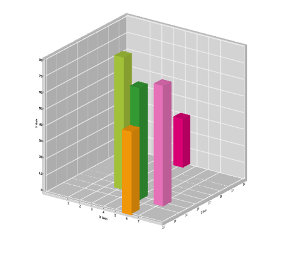 | markdownify }
{:.image }

{  | markdownify }
{:.image }

Properties Table

Following are the properties of the ChartArea class pertain to the z-axis feature.

_Properties of ChartArea class_

<table>
<tr>
<td>
Property </td><td>
Description </td><td>
Type </td><td>
Data Type </td><td>
Reference links </td></tr>
<tr>
<td>
EnableDepthAxis</td><td>
Allows the user to view z-axis. </td><td>
Dependency Property</td><td>
Bool </td><td>
NA</td></tr>
<tr>
<td>
DepthAxis</td><td>
Gets or sets the axis for z-axis and also used to specify the range, interval, tick lines and appearance of the z-axis.</td><td>
Dependency Property</td><td>
ChartAxis</td><td>
NA</td></tr>
</table>
Sample Link

To view the Surface Chart demo from the dashboard:

* Open Syncfusion Dashboard. 
* Select UI > WPF.
* Click Run Samples.
* Select Chart.  
* Navigate to 3D Charts > Surface Chart Demo.

Adding Z-Axis to the Chart

The z-axis (or depth axis) for 3-D charts can be enabled using EnableDepthAxis. The following code example illustrates this.

[XAML]

<syncfusion:ChartArea Name="Area1" EnableDepthAxis="True" View3DMode="True"

 Allow3DRotate="False"/>

[C#]

this.Area1.EnableDepthAxis = true;

The attributes of the z-axis (or depth axis) can be set using the DepthAxis property. The following code example illustrates this.

[XAML]

&lt;syncfusion:ChartArea.DepthAxis&gt;

  <syncfusion:ChartAxis Header="Z Axis" RangePadding="Normal" LabelForeground="Black"      

LabelFontWeight="Bold"/>

&lt;/syncfusion:ChartArea.DepthAxis&gt;

[C#]

this.Area1.DepthAxis.Header = "Z Axis";

this.Area1.DepthAxis.RangePadding = ChartRangePaddingType.Normal;

this.Area1.DepthAxis.LabelForeground = new SolidColorBrush(Colors.Black);

this.Area1.DepthAxis.IsAutoSetRange = true;

##### Annotations

###### Annotations at X-Y Coordinates

Annotations at specific X-Y coordinates can be added to the chart programmatically. The ChartSeriesAnnotation type used to define an annotation provides these properties:

_Property_

<table>
<tr>
<td>
ChartSeriesAnnotation Property</td><td>
Description</td></tr>
<tr>
<td>
Description</td><td>
String description of the annotation.</td></tr>
<tr>
<td>
X</td><td>
Specifies the x coordinate in the plot.</td></tr>
<tr>
<td>
Y</td><td>
Specifies the y coordinate in the plot.</td></tr>
<tr>
<td>
OffsetX</td><td>
X offset for locating the annotation.</td></tr>
<tr>
<td>
OffsetY</td><td>
Y offset for locating the annotation.</td></tr>
<tr>
<td>
Template</td><td>
Apecifies the look and feel of a specific annotation instance.</td></tr>
</table>
The AnnotationsCollection type, which is the container for the above ChartSeriesAnnotation instances, provides some properties that are applied on all the annotations:

_Property_

<table>
<tr>
<td>
AnnotationsCollection Property</td><td>
Description</td></tr>
<tr>
<td>
AnnotationsTemplate</td><td>
Specifies the look and feel for all the annotations in the ChartSeries.</td></tr>
<tr>
<td>
LineColor</td><td>
Specifies the color of the line drawn from the location to the annotation, in case OffsetX and OffsetY are specified.</td></tr>
<tr>
<td>
IsRelative</td><td>
Z and y values above are x-y coordinates of the plotIf {{ '_true_' | markdownify }}, they are in Chart Area coordinates. Default value is {{ '_false_' | markdownify }}.</td></tr>
</table>

Here is a code example that adds a few annotations to a chart.

[XAML]

&lt;sfchart:ChartSeries Name="series1"  Label="Series1" Type="Area" Interior="LightSkyBlue"&gt;

    &lt;sfchart:ChartSeries.Annotations&gt;

        &lt;sfchart:AnnotationsCollection LineColor="White" x:Uid="Annot"&gt;

            &lt;!--Define the look and feel of the annotation.--&gt;

            &lt;sfchart:AnnotationsCollection.AnnotationsTemplate&gt;

                &lt;DataTemplate&gt;

                    <Button Content="{Binding Y}" ToolTip="{Binding Description}"  Background="LightGray" Name="Button1"

                    Click="Button_Click" />

                &lt;/DataTemplate&gt;

            &lt;/sfchart:AnnotationsCollection.AnnotationsTemplate&gt;

        &lt;/sfchart:AnnotationsCollection&gt;

        &lt;!--The annotations are added to this collection in code-behind.--&gt;

    &lt;/sfchart:ChartSeries.Annotations&gt;

&lt;/sfchart:ChartSeries&gt;

[C#]

// Series1 Annotations

ChartSeriesAnnotation ser1LowPoint = new ChartSeriesAnnotation() { X = 1, Y = 20, Description = "Series 1 Low Point" };

ChartSeriesAnnotation ser1HighPoint = new ChartSeriesAnnotation() { X = 7, Y = 56, Description = "Series 1 High Point" };

this.Chart1.Areas[0].Series[0].Annotations.Items.Add(ser1LowPoint);

this.Chart1.Areas[0].Series[0].Annotations.Items.Add(ser1HighPoint);

The resultant annotations look like this.

{  | markdownify }
{:.image }

See Also

Annotations at Control Coordinates

###### Annotations At Control Coordinates

Chart for WPF also lets you add some annotations to the chart at specific control coordinates. By default, these annotations appear as simple text labels. But, their look and feel can be fully customized using custom templates.

Here are some Chart control properties that let you add annotations at Chart control coordinates:

_Property_

<table>
<tr>
<td>
Property</td><td>
Description</td></tr>
<tr>
<td>
AnnotationLabels</td><td>
Collection into which you add the ChartAnnotationLabel instances representing the annotations.</td></tr>
<tr>
<td>
AnnotationLabelTemplate</td><td>
Defines a custom look and feel for the annotation.</td></tr>
</table>
The ChartAnnotationLabel type used to define an annotation exposes these properties.

_Property_

<table>
<tr>
<td>
ChartAnnotationLabel Property</td><td>
Description</td></tr>
<tr>
<td>
Content</td><td>
Content that needs to be displayed in the annotation (usually a string).</td></tr>
<tr>
<td>
OffsetX</td><td>
X offset from the top-left of the control used to determine the x-location of the annotation.</td></tr>
<tr>
<td>
OffsetY</td><td>
Y offset from the top-left of the control used to determine the y-location of the annotation.</td></tr>
</table>
Here is some code example that shows how to add annotations at Chart coordinates and how to customize their look and feel.

[XAML]

&lt;syncfusion:Chart Name="chart1"&gt;

   &lt;!--Template defining the custom look and feel of the annotations.--&gt;

    &lt;syncfusion:Chart.AnnotationLabelTemplate&gt;

        &lt;DataTemplate&gt;

            &lt;Border Background="MintCream"  BorderBrush="Black" BorderThickness="1"&gt;

                &lt;TextBlock Text="{Binding}" Foreground="Black" FontFamily="Tahoma" FontSize="12"  Margin="5"/&gt;

            &lt;/Border&gt;

        &lt;/DataTemplate&gt;

    &lt;/syncfusion:Chart.AnnotationLabelTemplate&gt;

    &lt;syncfusion:Chart.AnnotationLabels&gt;

        &lt;syncfusion:ChartAnnotationLabelsCollection&gt;

            &lt;!--ChartAnnotationLabel instance representing the location and content of the annotation.--&gt;

            &lt;syncfusion:ChartAnnotationLabel x:Name="label1"  Content="Top 6 Products" OffsetX="50" OffsetY="60"&gt;

            &lt;/syncfusion:ChartAnnotationLabel&gt;

        &lt;/syncfusion:ChartAnnotationLabelsCollection&gt;

    &lt;/syncfusion:Chart.AnnotationLabels&gt;

&lt;/syncfusion:Chart&gt;

{  | markdownify }
{:.image }

See Also

Annotations at Control Coordinates

###### Annotation Shapes

Predefined shapes for annotation objects are used to point at specific information about a position in the chart. For example: Circle, Arrow etc. 

The following table describes more about the annotation shapes:

_Property Table_

<table>
<tr>
<td>
Name of the Property</td><td>
Type of Property</td><td>
Values It accepts</td></tr>
<tr>
<td>
Content</td><td>
Dependency Property</td><td>
String</td></tr>
<tr>
<td>
AnnotationShape</td><td>
Dependency Property</td><td>
Enum of type AnnotationShapes</td></tr>
<tr>
<td>
Fill</td><td>
Dependency Property</td><td>
Colors from brushes</td></tr>
<tr>
<td>
Offset X</td><td>
Dependency Property</td><td>
Double value</td></tr>
<tr>
<td>
Offset Y</td><td>
Dependency Property</td><td>
Double Value</td></tr>
</table>
> 

> _Note:_ 

> _The Content property helps represent the required content in an annotation shape._

> _The AnnotationShape property helps create the required shape for an annotation object and the Fill property helps fill the selected shape with required color._

> __

The following code example illustrates the creation of predefined annotation shape for a Chart.

[XAML]

&lt;syncfusion:Chart.AnnotationsLabel&gt;

&lt;syncfusion:ChartAnnotationLabelsCollection&gt;

&lt;syncfusion:ChartAnnotationLabel x:Name="Annotlabel" Content="Target Reached" OffsetY="200" OffsetX="200" AnnotationShape="Circle" Fill="Red"/&gt;

&lt;/syncfusion:ChartAnnotationLabelsCollection&gt;

&lt;/syncfusion:Chart.AnnotationsLabel&gt;

&lt;syncfusion:ChartArea &gt;

[C#]

Chart1.AnnotationsLabel[0].OffsetX = 200;

Chart1.AnnotationsLabel[0].OffsetY = 200;

Chart1.AnnotationsLabel[0].Content = "TargetReached";

Chart1.AnnotationsLabel[0].AnnotationShape = AnnotationShapes.Circle;

Chart1.AnnotationsLabel[0].AnnotationShape = Red;

Run the code. The following output is displayed.

{ 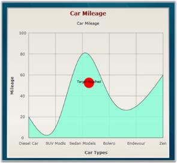 | markdownify }
{:.image }

A sample which demonstrates the various predefined annotation shapes in Essential Chart, is available in the following install location:

_C:\Documents and Settings\&lt;user name&gt;\My Documents\Syncfusion\Essential Studio\ Samples\WPF\Chart.WPF\Samples\3.5\WindowsSamples\Annotations_

##### Localization Support

Localization is the process of making your application multi-lingual, by formatting content according to cultures. This involves configuring the application for a specific language. Culture is the combination of language and location (e.g. En-US is the culture for English spoken in United States; En-GB is the culture for English spoken in Great Britain). Syncfusion Chart allows you to set custom resource through the Resx file. You can simply give the string values in the resource file for a specific culture and set the culture in the application. The given string values are set to the Chart that does not affect the Code Block of the chart.  

Use Case Scenario

The Essential Chart WPF can be localized according to the native language. It thus helps you to use the Chart more effectively.

Adding Localization to an Application 

The following steps explain the implementation of Localization support in applications.

Creating an Application

Create a WPF application and add Chart control to it. 

Creating a Resource File

To create a Resource file:

1. Create a folder named Resources in the application. 
2. Create a resource file (Resx file) and name it Syncfusion.Chart.Wpf<your culture info name>.resx E.g. Syncfusion.Chart.WPF.Ja.resx 

Use the prescribed naming convention as it is mandatory. 

The following screenshot explains the addition of a Resource file to the application. 

{  | markdownify }
{:.image }

Enter the “Name” and “Value” in the Resource file. 

The String Property names used in the  Chart are given in the Properties table. This is explained in the following screenshot.

{  | markdownify }
{:.image }

Setting the Culture Information in the Application

The culture information should be set in the application before the InitializeComponent() method is called. Now, the application is set to Japanese Culture info. The following code example explains the implementation of this.

[C#]

System.Threading.Thread.CurrentThread.CurrentUICulture = new System.Globalization.CultureInfo("ja");

{  | markdownify }
{:.image }

_Localization Property Table_

<table>
<tr>
<th>
Property</th><th>
Description</th><th>
Type</th><th>
Data Type</th></tr>
<tr>
<td>
Analog</td><td>
Sets the string for the Analog property</td><td>
static</td><td>
string</td></tr>
<tr>
<td>
Area</td><td>
Sets the string for the Area property</td><td>
static</td><td>
string</td></tr>
<tr>
<td>
Bar</td><td>
Sets the string for the Bar property</td><td>
static</td><td>
string</td></tr>
<tr>
<td>
BoxAndWhisker</td><td>
Sets the string for the Box and Whisker property</td><td>
static</td><td>
string</td></tr>
<tr>
<td>
Bubble</td><td>
Sets the string for the Bubble property</td><td>
static</td><td>
string</td></tr>
<tr>
<td>
Candle</td><td>
Sets the string for the Candle property</td><td>
static</td><td>
string</td></tr>
<tr>
<td>
ChangeType</td><td>
Sets the string for the ChangeType property</td><td>
static</td><td>
string</td></tr>
<tr>
<td>
Close</td><td>
Sets the string for the Close property</td><td>
static</td><td>
string</td></tr>
<tr>
<td>
Colorful</td><td>
Sets the string for the Colorful property</td><td>
static</td><td>
string</td></tr>
<tr>
<td>
ColorPalette</td><td>
Sets the string for the ColorPalette property</td><td>
static</td><td>
string</td></tr>
<tr>
<td>
Column</td><td>
Sets the string for the Column property</td><td>
static</td><td>
string</td></tr>
<tr>
<td>
contextMenuPalettes</td><td>
Sets the string for the ContextMenuPalette property</td><td>
static</td><td>
string</td></tr>
<tr>
<td>
contextMenuSeries</td><td>
Sets the string for the ContextMenuSeries property</td><td>
static</td><td>
string</td></tr>
<tr>
<td>
contextMenuZoomAll</td><td>
Sets the string for the ContextMenuZoomAll property</td><td>
static</td><td>
string</td></tr>
<tr>
<td>
contextMenuZooming</td><td>
Sets the string for the ContextmenuZooming  property</td><td>
static</td><td>
string</td></tr>
<tr>
<td>
Copy</td><td>
Sets the string for the Copy property</td><td>
static</td><td>
string</td></tr>
<tr>
<td>
Custom</td><td>
Sets the string for the Custom property</td><td>
static</td><td>
string</td></tr>
<tr>
<td>
Default</td><td>
Sets the string for the Default property</td><td>
static</td><td>
string</td></tr>
<tr>
<td>
DefaultAlpha</td><td>
Sets the string for the DefaultAlpha property</td><td>
static</td><td>
string</td></tr>
<tr>
<td>
Doughnut</td><td>
Sets the string for the Dhoughnut property</td><td>
static</td><td>
string</td></tr>
<tr>
<td>
EarthTone</td><td>
Sets the string for the EarthTone property</td><td>
static</td><td>
string</td></tr>
<tr>
<td>
EnableZooming</td><td>
Sets the string for the EnableZooming property</td><td>
static</td><td>
string</td></tr>
<tr>
<td>
FastColumn</td><td>
Sets the string for the FastColumn property</td><td>
static</td><td>
string</td></tr>
<tr>
<td>
FastHiLoOpenClose</td><td>
Sets the string for the FastHiLoOpenClose property</td><td>
static</td><td>
string</td></tr>
<tr>
<td>
FastLine</td><td>
Sets the string for the FastLine property</td><td>
static</td><td>
string</td></tr>
<tr>
<td>
FastScatter</td><td>
Sets the string for the FastScatter property</td><td>
static</td><td>
string</td></tr>
<tr>
<td>
FastStackingColumn</td><td>
Sets the string for the FastStackingColumn property</td><td>
static</td><td>
string</td></tr>
<tr>
<td>
Funnel</td><td>
Sets the string for the Funnel property</td><td>
static</td><td>
string</td></tr>
<tr>
<td>
Gantt</td><td>
Sets the string for the Gantt property</td><td>
static</td><td>
string</td></tr>
<tr>
<td>
Gradient</td><td>
Sets the string for the Gradient property</td><td>
static</td><td>
string</td></tr>
<tr>
<td>
Grayscale</td><td>
Sets the string for the GrayScale property</td><td>
static</td><td>
string</td></tr>
<tr>
<td>
HiLo</td><td>
Sets the string for the HiLo property</td><td>
static</td><td>
string</td></tr>
<tr>
<td>
HiLoArea</td><td>
Sets the string for the HiLoArea property</td><td>
static</td><td>
string</td></tr>
<tr>
<td>
HiLoOpenClose</td><td>
Sets the string for the HiLoOpenClose property</td><td>
static</td><td>
string</td></tr>
<tr>
<td>
Histogram</td><td>
Sets the string for the Histogram property</td><td>
static</td><td>
string</td></tr>
<tr>
<td>
Kagi</td><td>
Sets the string for Kagi property</td><td>
static</td><td>
string</td></tr>
<tr>
<td>
LegendWindowCancel</td><td>
Sets the string for the LegendWindowControl property</td><td>
static</td><td>
string</td></tr>
<tr>
<td>
LegendWindowCheckBox</td><td>
Sets the string for the LegendWindowCheckBox property</td><td>
static</td><td>
string</td></tr>
<tr>
<td>
LegendWindowIcon</td><td>
Sets the string for the LegendWindowIcon property</td><td>
static</td><td>
string</td></tr>
<tr>
<td>
LegendWindowOK</td><td>
Sets the string for the legendWindowOk property</td><td>
static</td><td>
string</td></tr>
<tr>
<td>
LegendWindowTitle</td><td>
Sets the string for the LegendWindowTiltle property</td><td>
static</td><td>
string</td></tr>
<tr>
<td>
Line</td><td>
Sets the string for the Line property</td><td>
static</td><td>
string</td></tr>
<tr>
<td>
Nature</td><td>
Sets the string for the Nature property</td><td>
static</td><td>
string</td></tr>
<tr>
<td>
Office2007Black</td><td>
Sets the string for the Office2007Black property</td><td>
static</td><td>
string</td></tr>
<tr>
<td>
Office2007Blue</td><td>
Sets the string for the Office2007Blue property</td><td>
static</td><td>
string</td></tr>
<tr>
<td>
Office2007Silver</td><td>
Sets the string for the Office2007Silver property</td><td>
static</td><td>
string</td></tr>
<tr>
<td>
Palette1</td><td>
Sets the string for the Palette1 property</td><td>
static</td><td>
string</td></tr>
<tr>
<td>
Palette2</td><td>
Sets the string for the Palette2 property</td><td>
static</td><td>
string</td></tr>
<tr>
<td>
Palette3</td><td>
Sets the string for the Palette3 property</td><td>
static</td><td>
string</td></tr>
<tr>
<td>
Palette4</td><td>
Sets the string for the Palette4 property</td><td>
static</td><td>
string</td></tr>
<tr>
<td>
Palette5</td><td>
Sets the string for the Palette5 property</td><td>
static</td><td>
string</td></tr>
<tr>
<td>
Palette6</td><td>
Sets the string for the Palette6 property</td><td>
static</td><td>
string</td></tr>
<tr>
<td>
Palette7</td><td>
Sets the string for the Palette7 property</td><td>
static</td><td>
string</td></tr>
<tr>
<td>
Palette8</td><td>
Sets the string for the Palette8 property</td><td>
static</td><td>
string</td></tr>
<tr>
<td>
Panning</td><td>
Sets the string for the Panning property</td><td>
static</td><td>
string</td></tr>
<tr>
<td>
Pastel</td><td>
Sets the string for the Pastel property</td><td>
static</td><td>
string</td></tr>
<tr>
<td>
Pie</td><td>
Sets the string for the Pie property</td><td>
static</td><td>
string</td></tr>
<tr>
<td>
PointAndFigure</td><td>
Sets the string for the PointAndFigure property</td><td>
static</td><td>
string</td></tr>
<tr>
<td>
Polar</td><td>
Sets the string for the Polar property</td><td>
static</td><td>
string</td></tr>
<tr>
<td>
printDialogAdvanced</td><td>
Sets the string for the PrintDialogAdvanced property</td><td>
static</td><td>
string</td></tr>
</table>
Sample Link

To run the UI WPF Chart samples:

1. Open Essential Studio Dashboard by selecting Start -> Program -> Syncfusion-> Essential Studio &lt;&lt;Version Number&gt;> -> Dashboard.
2. Click Run locally installed samples from the WPF drop-down list on the User Interface pane.
3. Select Chart on the sample browser.
4. Select User Interaction -> Localization Demo on the Essential Chart pane and click the Run Sample button.

To open the sample projects:

1. Go to the following sample location in your system:  
2. “&lt;sample installation location&gt;\Syncfusion\EssentialStudio\Version Number \WPF\Chart.WPF\Samples\3.5\WindowsSamples\User Interaction\Localization Demo”
3. This location contains two sub folders CS and VB.  You can open the sample projects from the respective folders based on your application developing language.
##### Export Chart to PDF

Essential Chart for WPF now comes with the support to export the chart to a PDF file; this conversion can be done using the Syncfusion.ChartConversion.WPF assembly.

Methods

_Method_

<table>
<tr>
<th>
Method</th><th>
Description</th><th>
Parameters</th><th>
Type</th><th>
Return Type</th></tr>
<tr>
<th>
ChartPdfConverter</th><th>
Converts chart to PDF file.</th><th>
Chart, Filename </th><th>
ChartString</th><th>
Void</th></tr>
</table>
Sample Link

1. Open the WPF sample browser
2. Select the Chart product
3. Select Chart > Export and Import > Chart to PDF

Adding Support to Convert a Chart to PDF to an Application 

The following steps explain how to convert a chart to PDF.

1. Create a new Visual Studio 2010 or 2008 project.
2. Add the following assemblies to the project:
1. Syncfusion.Chart.WPF.dll
2. Syncfusion.ChartConverter.WPF.dll

{  | markdownify }
{:.image }

3. Create a chart to be exported to PDF. Use the following code to convert the chart to a PDF file.

[C#]

ChartPdfConverterControl control = new ChartPdfConverterControl();

control.ChartPdfConverter(Chart1, "chartpdf.pdf");

4. The PDF file is generated as follows.

{ 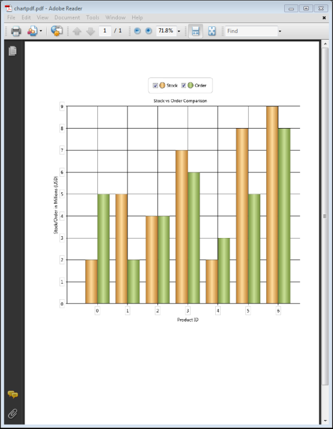 | markdownify }
{:.image }

##### Print

Essential Chart for WPF now comes with support to print the chart and printing options such as page orientation, print preview, color mode, and more.

{  | markdownify }
{:.image }

Use Case Scenarios

Printing the chart is useful for visual representation in organizational meetings.

{  | markdownify }
{:.image }

Methods

_Methods_

<table>
<tr>
<th>
Method</th><th>
Description</th><th>
Parameters</th><th>
Type</th><th>
Return Type</th></tr>
<tr>
<th>
Print()</th><th>
Used to print the Chart control. This opens the printing dialog box. This method returns a bool value after printing.</th><th>
Overloads: (Rect  printArea) </th><th>
N/A</th><th>
Bool</th></tr>
<tr>
<th>
PrintSwitchMode()</th><th>
To select a particular area for printing.</th><th>
N/A</th><th>
N/A</th><th>
Void</th></tr>
</table>
###### Sample Link

..My Documents\Syncfusion\EssentialStudio\&lt;Version Number&gt;\WPF\Chart.WPF\Samples\3.5\WindowsSamples\Export and Print\Printing Chart Demo

###### Printing a Chart

Charts can be printed by using the following code example.

[XAML]

&lt;!--Button when clicked executes the Print command--&gt;

&lt;Button Grid.Row="0" Content="Print"						Command="{x:Static ApplicationCommands.Print}"						CommandTarget="{Binding ElementName=Chart1}" x:Name="button"/&gt;            &lt;!--Button when clicked executes the SwitchPrinting command--&gt;            &lt;Button Grid.Row="0" Grid.Column="1" Content="Printing Mode" 						Command="{x:Static syncfusion:ChartCommands.SwitchPrinting}"						CommandTarget="{Binding ElementName=Chart1}" x:Name="button1" /&gt;

[C#]

Chart1.Print();

Chart1.PrintSwitchMode();

##### Statistical Formula and Utility Functions

This feature allows the user to calculate basic statistical functions that include mean, median, standard deviation, variance, variance based estimator, variance unbased estimator, correlation coefficient and covariance, ANOVA, T-test, Z-test, and F-test performed based on sample series, and utility functions like normal distribution, T-cumulative distribution and F-cumulative distribution.

Use Case Scenarios

1. This feature supports built-in statistical formulas.
2. The curve in the graph can be drawn based on normal distribution, T-cumulative distribution, and F-cumulative distribution.
3. Basic functions like mean, median, and standard deviation can be obtained from the series drawn.

Methods

_Statistical and Utility Functions Methods Table_

<table>
<tr>
<th>
Method</th><th>
Description</th><th>
Parameters</th><th>
Return Type</th></tr>
<tr>
<td>
Mean</td><td>
Returns the mean value of the x values of the series.</td><td>
Series</td><td>
Double</td></tr>
<tr>
<td>
Mean</td><td>
Returns the mean of y values.</td><td>
Series, Yindex(int)</td><td>
Double</td></tr>
<tr>
<td>
VarianceUnbiasedEstimator</td><td>
Estimates the variance for the x values of the series.</td><td>
Series</td><td>
Double</td></tr>
<tr>
<td>
VarianceUnbiasedEstimator</td><td>
Estimates the variance for the y values of the series.</td><td>
Series,Yindex(int)</td><td>
Double</td></tr>
<tr>
<td>
VarianceBiasedEstimator</td><td>
Estimates the variance of the sample.</td><td>
Series</td><td>
Double</td></tr>
<tr>
<td>
VarianceBiasedEstimator</td><td>
Estimates the variance for the y value of the series.</td><td>
Series, Yindex(int)</td><td>
Double</td></tr>
<tr>
<td>
Variance</td><td>
The following code samples demonstrate how to get the variance of the data points in a series.</td><td>
Series,sampleVariance(bool)</td><td>
Double</td></tr>
<tr>
<td>
Variance</td><td>
The following code samples demonstrate how to get the variance of the y-value data points in a series.</td><td>
Series,Yindex(int),sampleVariance(bool)</td><td>
Double</td></tr>
<tr>
<td>
StandardDeviation</td><td>
This method determines the standard Deviation for x values of the series.</td><td>
Series,sampleVariance(bool)</td><td>
Double</td></tr>
<tr>
<td>
StandardDeviation</td><td>
This method determines the standard deviation for y values of the series.</td><td>
SeriesYindex(double)sampleVariance(bool)</td><td>
Double</td></tr>
<tr>
<td>
Covariance</td><td>
Returns the average of the product of deviations of the data points from their respective means.</td><td>
Series1,Series 2</td><td>
Double</td></tr>
<tr>
<td>
Covariance</td><td>
Returns the average of the product of deviations of the data points from their respective means based on y values.</td><td>
Series1,Series 2,Yindex(int)</td><td>
Double</td></tr>
<tr>
<td>
Correlation</td><td>
Measures the relationship between two data sets that are scaled to be independent of the unit of measurement. This correlation method returns the covariance of two data sets divided by the product of their standard deviations, and always ranges from -1 to 1.</td><td>
Series1,Series2</td><td>
Double</td></tr>
<tr>
<td>
Correlation</td><td>
Measures the relationship between two data sets that are scaled to be independent of the unit of measurement. This correlation method returns the covariance of two data sets divided by the product of their standard deviations, and always ranges from -1 to 1.</td><td>
Series1,Series2, yIndex(double)</td><td>
Double</td></tr>
<tr>
<td>
Median</td><td>
Calculates the median of the points stored in a series.</td><td>
Series</td><td>
Double</td></tr>
<tr>
<td>
Median</td><td>
Calculates the median of the points stored in a series.</td><td>
Series,yIndex(int)</td><td>
Double</td></tr>
<tr>
<td>
ZTest</td><td>
This method performs a Z-test for two groups of data and returns the results using a ZTestResult object.</td><td>
(double) hypothesizedMeanDifference, (double) varianceFirstGroup, (double) varianceSecondGroup, (double) probability, (ChartSeries) firstInputSeries, (ChartSeries) secondInputSeries</td><td>
ZTestResult</td></tr>
<tr>
<td>
ZTest</td><td>
This method performs a Z-test for two groups of data and returns the results using a ZTestResult object, for Y values.</td><td>
(double )hypothesizedMeanDifference, (double) varianceFirstGroup, (double) varianceSecondGroup, (double) probability, (ChartSeries )firstInputSeries, (ChartSeries )secondInputSeries,(Int) yIndex</td><td>
ZTestResult</td></tr>
<tr>
<td>
TTestEqualVariances</td><td>
This method performs a T-test for two groups of data and assumes equal variances between the two groups (i.e. series) for the x values.</td><td>
(Double) hypothesizedMeanDifference, (double) probability, (ChartSeries)firstInputSeries, (ChartSeries) secondInputSeries</td><td>
TTestResult</td></tr>
<tr>
<td>
TTestEqualVariances</td><td>
This method performs a T-test for two groups of data and assumes equal variances between the two groups (i.e. series) for the y values.</td><td>
(Double) hypothesizedMeanDifference, (double) probability, (ChartSeries)firstInputSeries, (ChartSeries) secondInputSeries,(int)yIndex</td><td>
TTestResult</td></tr>
<tr>
<td>
TTestUnEqualVariances</td><td>
This method performs a T-test for two groups of data and assumes unequal variances between the two groups (i.e. series).</td><td>
(Double) hypothesizedMeanDifference, (double) probability, (ChartSeries) firstInputSeries, (ChartSeries) secondInputSeries</td><td>
TTestResult</td></tr>
<tr>
<td>
FTest</td><td>
This method returns the results of the F-test using an FTestResult object.</td><td>
(Double) probability, (ChartSeries) firstInputSeries, (ChartSeries) secondInputSeries</td><td>
FTestResult</td></tr>
<tr>
<td>
FTest</td><td>
This method returns the results of the F-test for the y values using an FTestResult object.</td><td>
(Double) probability, (ChartSeries) firstInputSeries, (ChartSeries) secondInputSeries,(Int) yIndex</td><td>
FTestResult</td></tr>
<tr>
<td>
Anova</td><td>
An ANOVA test is used to test the difference between the means of two or more groups of data.</td><td>
double probability, ChartSeries[] inputSeries</td><td>
AnovaResult</td></tr>
<tr>
<td>
Anova</td><td>
An ANOVA test is used to test the difference between the means of two or more groups of data for y values.</td><td>
double probability, ChartSeries[] inputSeries,int Yindex</td><td>
AnovaResult</td></tr>
<tr>
<td>
GammaLn</td><td>
Natural logarithm of gamma function (for y>0).</td><td>
Double</td><td>
Double</td></tr>
<tr>
<td>
Factorial</td><td>
Factorial n! (for n >= 0).</td><td>
Double</td><td>
Double</td></tr>
<tr>
<td>
FactorialLn</td><td>
Logarithm of factorial n! (for n >= 0).</td><td>
Int</td><td>
Double</td></tr>
<tr>
<td>
BetaLn</td><td>
Logarithm of beta function.</td><td>
Double a, double b</td><td>
Double</td></tr>
<tr>
<td>
Beta</td><td>
Beta function.</td><td>
double a, double b</td><td>
Double</td></tr>
</table>
Sample Link

1. Open the Sample Browser samples
2. Select the Chart control 
3. Statistical Analysis > Statistical Formula
4. Statistical Analysis > Utility Functions

Adding Statistical Formula and Utility Functions to an Application

Statistical Formulas

[C#]

string val = "";

            val += "Mean = " + BasicStatisticalFormulas.Mean(series).ToString() + "\r\n";

            val += "Median = " + BasicStatisticalFormulas.Median(series).ToString() + "\r\n";

            val += "Standard Deviation = " + BasicStatisticalFormulas.StandardDeviation(series, true).ToString() + "\r\n";

            val += "Variance = " + BasicStatisticalFormulas.Variance(series, true).ToString() + "\r\n";

            val += "Variance Based Estimator = " + BasicStatisticalFormulas.VarianceBiasedEstimator(series).ToString() + "\r\n";

            val += "Variance UnBased Estimator = " + BasicStatisticalFormulas.VarianceUnbiasedEstimator(series).ToString() + "\r\n";

            val += "Correlation Co-efficient = " + BasicStatisticalFormulas.Correlation(this.chartControl1.Series[0], this.chartControl1.Series[1]).ToString() + "\r\n";

            val += "Covariance = " + BasicStatisticalFormulas.Covariance(this.chartControl1.Series[0], this.chartControl1.Series[1]).ToString() + "\r\n";

            this.richTextBox1.Text = val;

{  | markdownify }
{:.image }

Perform ANOVA Test

[C#]

AnovaResult anova = BasicStatisticalFormulas.Anova(0.05, new ChartSeries[] { series1, series2 });

            result.Text = "F Ratio = " + anova.FRatio + "\n" +

                           "F Critical Value =" + anova.FCriticalValue + "\n" +

                           "Degree of Freedom Between Groups = " + anova.DegreeOfFreedomBetweenGroups + "\n" +

                           "Degree of Freedom within Groups = " + anova.DegreeOfFreedomWithinGroups + "\n" +

                           "Degree of Freedom total = " + anova.DegreeOfFreedomTotal + "\n" +

                           "Mean square variance beteeen groups = " + anova.MeanSquareVarianceBetweenGroups + "\n" +

                           "Mean square variance within groups = " + anova.MeanSquareVarianceWithinGroups + "\n" +

                           "Sum of square between groups = " + anova.SumOfSquaresBetweenGroups + "\n";

{  | markdownify }
{:.image }

Perfrom F-Test

[C#]

FTestResult ftest = BasicStatisticalFormulas.FTest(0.05, series1, series2);

            result.Text = "FValue = " + ftest.FValue.ToString() + "\n" +

                            "F Critical Value on Tail = " + ftest.FCriticalValueOneTail.ToString() + "\n" +

                            "ProbabilityFOneTail = " + ftest.ProbabilityFOneTail.ToString() + "\n" +

                            "First Series Mean = " + ftest.FirstSeriesMean.ToString() + "\n" +

                            "Second Series Mean = " + ftest.SecondSeriesMean.ToString() + "\n" +

                            "First Series Variance = " + ftest.FirstSeriesVariance.ToString() + "\n" +

                            "Second Series Variance = " + ftest.SecondSeriesVariance.ToString() + "\n";

{  | markdownify }
{:.image }

Perform T-Test

[C#]

TTestResult ttest = BasicStatisticalFormulas.TTestEqualVariances(meandiff.Value, 0.1, series1, series2);

            result.Text = "T Value = " + ttest.TValue.ToString() + "\n" +

                            "T Critical Value one Tail = " + ttest.TCriticalValueOneTail.ToString() + "\n" +

                            "T Critical value two Tail = " + ttest.TCriticalValueTwoTail.ToString() + "\n" +

                            "Probability T One Tail = " + ttest.ProbabilityTOneTail.ToString() + "\n" +

                            "Probability T Two Tail = " + ttest.ProbabilityTTwoTail.ToString() + "\n" +

                            "First Series Mean = " + ttest.FirstSeriesMean.ToString() + "\n" +

                            "First Series Variance = " + ttest.FirstSeriesVariance.ToString() + "\n" +

                            "Second Series Mean = " + ttest.SecondSeriesMean.ToString() + "\n" +

                            "Second Series Variance =" + ttest.SecondSeriesVariance.ToString() + "\n";

{  | markdownify }
{:.image }

Perform Z-Test

[C#]

ZTestResult ztest = BasicStatisticalFormulas.ZTest(meandiff.Value, 10, 5, 0.5, series1, series2);

            result.Text = "Z Value = " + ztest.ZValue.ToString() + "\n" +

                            "Z Critical Value One Tail = " + ztest.ZCriticalValueOneTail.ToString() + "\n" +

                            "Z Critical Value Two Tail = " + ztest.ZCriticalValueTwoTail.ToString() + "\n" +

                            "Probability Z One Tail = " + ztest.ProbabilityZOneTail.ToString() + "\n" +

                            "Probability Z Two Tail = " + ztest.ProbabilityZTwoTail.ToString() + "\n" +

                            "First Series Mean = " + ztest.FirstSeriesMean.ToString() + "\n" +

                            "Second Series Mean = " + ztest.SecondSeriesMean.ToString() + "\n" +

                            "First Series Variance = " + ztest.FirstSeriesVariance.ToString() + "\n" +

                            "Second Series Variance = " + ztest.SecondSeriesMean.ToString() + "\n";

{  | markdownify }
{:.image }

Normal Distribution

[C#]

value.Text = UtilityFunctions.NormalDistribution((double)probability.SelectedItem).ToString();

{  | markdownify }
{:.image }

F-Cumulative Distribution

[C#]

value.Text = UtilityFunctions.FCumulativeDistribution((double)probability.SelectedItem, (double)n.SelectedItem, (double)m.SelectedItem).ToString();

{ 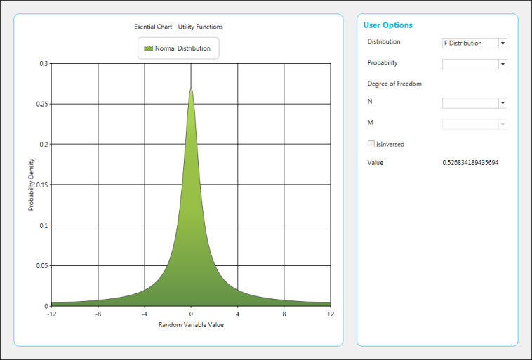 | markdownify }
{:.image }

T-Cumulative Distribution

[C#]

value.Text = UtilityFunctions.TCumulativeDistribution((double)probability.SelectedItem, (double)n.SelectedItem, true).ToString();

{  | markdownify }
{:.image }

### Sparkline

A Sparklinecontrolis a type of information graphic characterized by its small size, high data density and lightweight. It presents trends and variations in a very condensed fashion. The Sparkline does not contain an axis scale and is intended to give a high level overview of what happened to the data over time.

Use Case Scenarios

A sparkline can display a trend based on adjacent data in a clear and compact graphical representation. The purpose of sparkline is to quickly see the data range difference with high density data and it is represented in lightweight graphical representation. You can use it as per your requirement.

The following screenshot shows three  types of sparklines, which are  drawn inside the grid control cell, based on row values.

{  | markdownify }
{:.image }

#### Concepts and Features

##### Properties

_Properties of Sparkline Control_

<table>
<tr>
<th>
Property</th><th>
Description</th><th>
Type</th><th>
Data Type</th><th>
Reference links</th></tr>
<tr>
<td>
SparkLineType</td><td>
Get or set the type of spark lines.By default, it is set to Line type.</td><td>
 Dependency property</td><td>
SparkLineTypes – Enum {Line, Column, WinLoss}</td><td>
NA</td></tr>
<tr>
<td>
ItemSource</td><td>
Gets or sets the data source for sparkline data points</td><td>
 Dependency Property</td><td>
IEnumerable</td><td>
 NA</td></tr>
<tr>
<td>
DisplayMemberPath</td><td>
Gets or sets the property name that has to be taken as data for displaying points</td><td>
Dependency Property</td><td>
String</td><td>
NA</td></tr>
<tr>
<td>
FirstPointHighlightBrush</td><td>
Gets or sets the brush used to highlight first data point in spark line</td><td>
 Dependency Property</td><td>
Brush</td><td>
 NA</td></tr>
<tr>
<td>
IsFirstPointHighlighted</td><td>
Helps to enable or disable highlighting of first data point in spark line</td><td>
Dependency Property</td><td>
Bool</td><td>
NA</td></tr>
<tr>
<td>
LastPointHighlightBrush</td><td>
Gets or sets the brush used to highlight last data point in spark line</td><td>
 Dependency Property</td><td>
Brush</td><td>
 NA</td></tr>
<tr>
<td>
IsLastPointHighlighted</td><td>
Helps to enable or disable highlighting of last data point in spark line</td><td>
Dependency Property</td><td>
Bool</td><td>
NA</td></tr>
<tr>
<td>
HighPointHighlightBrush</td><td>
Gets or sets the brush used to highlight highest data point in spark line</td><td>
 Dependency Property</td><td>
Brush</td><td>
 NA</td></tr>
<tr>
<td>
IsHighPointHighlighted</td><td>
Helps to enable or disable highlighting of highest data point in spark line</td><td>
Dependency Property</td><td>
Bool</td><td>
NA</td></tr>
<tr>
<td>
LowPointHighlightBrush</td><td>
Gets or sets the brush used to highlight lowest data point in spark line</td><td>
 Dependency Property</td><td>
Brush</td><td>
 NA</td></tr>
<tr>
<td>
IsLowPointHighlighted</td><td>
Helps to enable or disable highlighting of lowest data point in spark line</td><td>
Dependency Property</td><td>
Bool</td><td>
NA</td></tr>
<tr>
<td>
NegativePointHighlightBrush</td><td>
Gets or sets the brush used to highlight negative data points in spark line</td><td>
 Dependency Property</td><td>
Brush</td><td>
 NA</td></tr>
<tr>
<td>
IsNegativePointHighlighted</td><td>
Helps to enable or disable highlighting of negative data point in spark line</td><td>
Dependency Property</td><td>
Bool</td><td>
NA</td></tr>
<tr>
<td>
MarkerColor</td><td>
Gets or sets the brush of the markers in spark line. This property has effect over Line type spark line only</td><td>
Dependency Property</td><td>
Brush</td><td>
NA</td></tr>
<tr>
<td>
IsMarkerEnabled</td><td>
Helps to enble or disable markers in line type spark line </td><td>
Dependency Property</td><td>
Bool</td><td>
NA</td></tr>
</table>
##### Types of Sparklines

Presently, Syncfusion SparkLine control supports three types of Sparklines and the sparkline control must be bound to a data source. It supports a variety of datasource such as DataTable and any component that implements the interface IEumerable, ICollection, IList. 

* Line
* Column
* WinLoss 

###### Drawing Sparkline in an Application

Drawing Line Sparkline in an Application

The line type of spark line represents a set of data points, connected by a line. 

Refer to the following code examples to draw  the line sparkline.

[C#.NET]

//Set Sparkline points to source property

this.sparkLine1.ItemSource =new double[] { 30, -20, 80, 20, 40, -50, -30, 70,    -40, 50 };

//Set line type sparkline

this.sparkLine1.SparkLineType = SparkLine.SparkLineType.Line;

[VB.NET]

'Set Sparkline points to source property

Me.sparkLine1.ItemSource = New Double() {30, -20, 80, 20, 40, -50,-30, 70, -40, 50}

'Set line type sparkline

Me.sparkLine1.SparkLineType = SparkLine.SparkLineType.Line

{  | markdownify }
{:.image }

Drawing Column Sparkline in an Application

The column type of spark line represents each data point by a column. The vertical column direction represents the negative or positive value.

Refer to the following code examples to draw the column sparkline:

[C#.NET]

//Set Sparkline points to source property

this.sparkLine1.ItemSource =new double[] { 30, -20, 80, 20, 40, -50, -30, 70,    -40, 50 };

//Set line type sparkline

this.sparkLine1.SparkLineType = SparkLine.SparkLineType.Column;

[VB.NET]

'Set Sparkline points to source property

Me.sparkLine1.ItemSource = New Double() {30, -20, 80, 20, 40, -50,-30, 70, -40, 50}

'Set line type sparkline

Me.sparkLine1.SparkLineType = SparkLine.SparkLineType. Column

{ 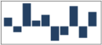 | markdownify }
{:.image }

Drawing WinLoss Sparkline in an Application

The Winloss type of spark line is similar to column type but all columns have equal length for data points.   The vertical column direction represents the negative or positive value.

Refer to the following code examples to draw the WinLoss sparkline:

[C#.NET]

//Set Sparkline points to source property

this.sparkLine1.ItemSource =new double[] { 30, -20, 80, 20, 40, -50, -30, 70,    -40, 50 };

//Set line type sparkline

this.sparkLine1.SparkLineType = SparkLine.SparkLineType.WinLoss;

[VB.NET]

'Set Sparkline points to source property

Me.sparkLine1.ItemSource = New Double() {30, -20, 80, 20, 40, -50,-30, 70, -40, 50}

'Set line type sparkline

Me.sparkLine1.SparkLineType = SparkLine.SparkLineType. WinLoss

{  | markdownify }
{:.image }

###### Marker Support

Markers Support for Line

This marker feature supports data points of line sparkline. You can choose the marker color for data points.  

Refer to the following code examples to enable the marker in line sparkline.

[C#.NET]

//To enable marker to sparkline for all data points

this.sparkLine1.Markers.ShowMarker  =true;

[VB.NET]

'To enable marker to sparkline for all data points

Me.sparkLine1.Markers.ShowMarker  =True

{  | markdownify }
{:.image }

You can choose the highlight color for data points.

Refer to the following code examples to enable the marker in column sparkline.

[C#.NET]

//To enable marker to sparkline high,low,start,end,negative data points

this.sparkLine1.IsHighPointHighlighted = true;

this.sparkLine1.IsLowPointHighlighted = true;

this.sparkLine1.IsFirstPointHighlighted = true;

this.sparkLine1.IsLastPointHighlighted = true;

this.sparkLine1.IsNegativePointHighlighted = true;

[VB.NET]

//To enable marker to sparkline high,low,start,end,negative data points

Me.sparkLine1.IsHighPointHighlighted = true;

Me.sparkLine1.IsLowPointHighlighted = true;

Me.sparkLine1.IsFirstPointHighlighted = true;

Me.sparkLine1.IsLastPointHighlighted = true;

Me.sparkLine1.IsNegativePointHighlighted = true;

Markers Support for Column

This marker feature supports high point, low point, start point, end point and negative points of column sparkline.  You can choose the highlight color for data points.

Refer to the following code examples to enable the marker in column sparkline.

[C#.NET]

//To enable marker to sparkline high,low,start,end,negative data points

this.sparkLine1.IsHighPointHighlighted = true;

this.sparkLine1.IsLowPointHighlighted = true;

this.sparkLine1.IsFirstPointHighlighted = true;

this.sparkLine1.IsLastPointHighlighted = true;

this.sparkLine1.IsNegativePointHighlighted = true;

[VB.NET]

//To enable marker to sparkline high,low,start,end,negative data points

Me.sparkLine1.IsHighPointHighlighted = true;

Me.sparkLine1.IsLowPointHighlighted = true;

Me.sparkLine1.IsFirstPointHighlighted = true;

Me.sparkLine1.IsLastPointHighlighted = true;

Me.sparkLine1.IsNegativePointHighlighted = true;

{  | markdownify }
{:.image }

Markers Support for WinLoss

This marker feature supports High Points, Low Points, Start Point, End point and Negative Point of WinLoss Sparkline. You can choose the highlight color for data points. The markers feature of WinLoss is the same as Column markers.  

Refer to the following code examples to enable the marker in column sparkline.

[C#.NET]

//To enable marker to sparkline high,low,start,end,negative data points

this.sparkLine1.IsHighPointHighlighted = true;

this.sparkLine1.IsLowPointHighlighted = true;

this.sparkLine1.IsFirstPointHighlighted = true;

this.sparkLine1.IsLastPointHighlighted = true;

this.sparkLine1.IsNegativePointHighlighted = true;

[VB.NET]

//To enable marker to sparkline high,low,start,end,negative data points

Me.sparkLine1.IsHighPointHighlighted = true;

Me.sparkLine1.IsLowPointHighlighted = true;

Me.sparkLine1.IsFirstPointHighlighted = true;

Me.sparkLine1.IsLastPointHighlighted = true;

Me.sparkLine1.IsNegativePointHighlighted = true;

{ 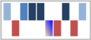 | markdownify }
{:.image }

##### Range Band for Sparkline Chart

Range Band is useful for displaying the normal range of a variable in a Sparkline Chart. By default, the band is defined as a grey rectangle.

You can customize a particular range by using the BandRange, EnableRangeBand and RangeBandInterior properties.

_Properties_

<table>
<tr>
<td>
Property</td><td>
Description</td><td>
Type</td><td>
Data Type</td><td>
Reference Links</td></tr>
<tr>
<td>
BandRange</td><td>
Gets or sets the start and end point of the Range Band.</td><td>
Dependency Property</td><td>
Double Range</td><td>
NA</td></tr>
<tr>
<td>
IsEnableRangeBand</td><td>
Specifies whether the Range Band is visible.</td><td>
Dependency Property</td><td>
Bool</td><td>
NA</td></tr>
<tr>
<td>
RangeBandInterior</td><td>
Sets the interior color of the Range Band.</td><td>
Dependency Property</td><td>
Brush</td><td>
NA</td></tr>
</table>
The following code example shows how to configure the range band.

[XAML]

&lt;syncfusion:SparkLine Grid.Row="0" Grid.Column="10" ItemsSource="{Binding Collections}" DataMemberPath="Y" SparkLineType="Line" BandRange="-5,8" IsEnableRangeBand="True" RangeBandInterior="Red"/&gt;

{ 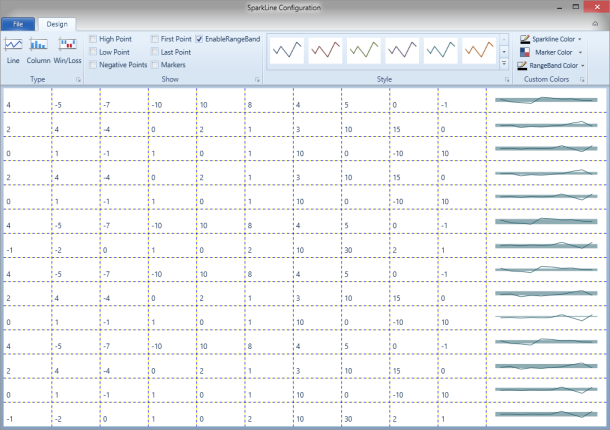 | markdownify }
{:.image }

Sample Link

To access a Sparkline sample Demo:

1. Open the Syncfusion Dashboard.
2. Select User Interface.
3. Click the WPF drop-down list and select Explore Samples.
4. Browse to the path Chart.WPF\Samples\3.5\WindowsSamples\SparkLine\ 
### TimeLine

TimeLine control can be added to other controls like Chart, Grid, etc. It is mainly used to set the ViewPort for a limited time to view the selected data. Following are the list of characteristics of TimeLine Control:

* It gets the DataSource from the user and produces a limited set of data using the SelectedData property
* It includes the ViewPort to select the limited data
* The ViewPort can be dragged and dropped at any position inside the TimeLineControl
* It also includes the TimeLine indicator to change the size of the TimeLine Control
* The ViewPort and TimeLine Control can be customized

Use Case Scenario

TimeLine Control has been designed to visualize large number of data and to handle the selected data for instance, in StockMarket analysis; the stock price and volume of the selected data can be handled.

#### Appearance and Structure

{  | markdownify }
{:.image }

#### Feature Summary

The features of TimeLine Control are:

* Panning of selected data can be done by using drag and drop in view port
* View port can also be resized to modify the selected data
* Double-clicking the view port displays the minimum time line interval
* When there is an unselected area in TimeLine control, the view port is automatically dragged to the selected area
* When mouse over is done on the view port it displays the minimum TimeLine interval

#### Adding TimeLine Control

The following code illustrates how to add TimeLine control:

[XAML]

<sync:TimeLineControl Height="100" x:Name="rangeIndicator" Grid.Row="1" DataSource="{Binding}" BindingPathX="X" BindingPathsY="Y"

TimeLineInterior ="{Binding ElementName=timelineInterior, Path=SelectedItem, Mode=TwoWay}"

ViewPortInterior="{Binding ElementName=viewport, Path=SelectedItem, Mode=TwoWay}"

ViewLineInterior="{Binding ElementName=viewline, Path=SelectedItem, Mode=TwoWay}"/>

Samples Link

To view sample,

1. Open the WPF sample browser from the dashboard. 
2. Navigate to WPF Chart-> TimeLine Control>TimeLine Control Demo.
#### Concepts and Features

##### Properties

_Properties_

<table>
<tr>
<td>
Property </td><td>
Description </td><td>
Type </td><td>
Data Type </td><td>
Reference links </td></tr>
<tr>
<td>
SelectedData</td><td>
It returns the selected data in the ViewPort.</td><td>
Dependency Property</td><td>
Object</td><td>
NA</td></tr>
<tr>
<td>
DataSource</td><td>
To give the input data for the TimeLineControl.</td><td>
Dependency Property</td><td>
IEnumerable</td><td>
NA</td></tr>
<tr>
<td>
BindingPathX</td><td>
To set the X binding to the data. </td><td>
Dependency Property</td><td>
String</td><td>
NA</td></tr>
<tr>
<td>
BindingPathsY</td><td>
To set the Y value binding to the Data.</td><td>
Dependency Property</td><td>
IEnumerable<string></td><td>
NA</td></tr>
<tr>
<td>
StartDate</td><td>
Specifies the starting date of the TimeLine.</td><td>
Attached Property</td><td>
Double</td><td>
NA</td></tr>
<tr>
<td>
EndDate</td><td>
Specifies the ending date of the TimeLine.</td><td>
Attached Property</td><td>
Double</td><td>
NA</td></tr>
<tr>
<td>
StartValue</td><td>
Specifies the starting value of the TimeLine.</td><td>
DependencyProperty</td><td>
Double</td><td>
NA</td></tr>
<tr>
<td>
EndValue</td><td>
Specifies the ending value of the TimeLine.</td><td>
DependencyProperty</td><td>
Double</td><td>
NA</td></tr>
<tr>
<td>
ViewPortInterior</td><td>
Sets the interior for the View Port.</td><td>
Dependency Property</td><td>
Brush</td><td>
NA</td></tr>
<tr>
<td>
ViewLineInterior</td><td>
Sets the interior for the TimeLine.</td><td>
Dependency Property</td><td>
Brush</td><td>
NA</td></tr>
<tr>
<td>
TimeLineInterior</td><td>
Sets the interior for the Timeline. series</td><td>
Dependency property</td><td>
Brush</td><td>
NA</td></tr>
<tr>
<td>
MinimumTimeLineInterval</td><td>
To set the minimum interval for the view port.</td><td>
Dependency property</td><td>
Double </td><td>
NA</td></tr>
</table>
##### Setting the Starting and Ending Date

You can specify the starting date and ending date for the TimeLine control by using the StartDate and EndDate attached properties. This is applicable when the ValueType property of PrimayAxis is set to _DateTime_. The following code example illustrates this.

[XAML]

&lt;sync:TimeLineControl x:Name='timelineControl' sync:TimeLineControl.StartDate='9/27/2006' sync:TimeLineControl.EndDate='12/7/2007'&gt;

&lt;sync:TimeLineControl.PrimaryAxis&gt;

&lt;sync:ChartAxis ValueType='DateTime'/&gt;

&lt;/sync:TimeLineControl.PrimaryAxis&gt;

</sync:TimeLineControl

[C#]

TimeLineControl.SetStartDate(timelineControl, datalist[20].TimeStamp);

TimeLineControl.SetEndDate(timelineControl, datalist[40].TimeStamp);

{  | markdownify }
{:.image }

##### Setting the Starting and Ending Value

You can specify the starting value and ending value for the TimeLine control by using the StartValue and EndValue attached properties. This is applicable when the ValueType property of the PrimayAxis is set to Double. The following code example illustrates this.

[XAML]

&lt;sync:TimeLineControl x:Name='timelineControl' sync:TimeLineControl.StartValue='0' sync:TimeLineControl.EndValue='20'&gt;

&lt;sync:TimeLineControl.PrimaryAxis&gt;

&lt;sync:ChartAxis ValueType='Double'/&gt;

&lt;/sync:TimeLineControl.PrimaryAxis&gt;

</sync:TimeLineControl

[C#]

TimeLineControl.SetStartValue(timelineControl, 0);

TimeLineControl.SetEndValue(timelineControl, 20);

{  | markdownify }
{:.image }

