# Adornments in WPF Charts (SfChart)

Chart adornments are used to display values related to a chart segment element. Values from data point(x, y) or other custom properties from a data source can be displayed. 

You can initialize the adornment as in the below code snippet:





<syncfusion:ColumnSeries  Interior="#777777"

ItemsSource="{Binding Demands}"  

XBindingPath="Demand" 

YBindingPath="Year2011">

<syncfusion:ColumnSeries.AdornmentsInfo>

<syncfusion:ChartAdornmentInfo></syncfusion:ChartAdornmentInfo>

</syncfusion:ColumnSeries.AdornmentsInfo>

</syncfusion:ColumnSeries>





ColumnSeries series = new ColumnSeries()
{

    ItemsSource = new ViewModel().Demands,

    XBindingPath = "Demand",

    YBindingPath = "Year2011",

    Interior = new SolidColorBrush(Color.FromRgb(0x77, 0x77, 0x77))

};

ChartAdornmentInfo adornmentInfo = new ChartAdornmentInfo();

series.AdornmentsInfo = adornmentInfo;

chart.Series.Add(series);





Each adornment can be represented by the following:

* Label - Displays the segment label content at the (X, Y) point.
* Marker- Displays the desired symbol at the (X, Y) point.
* ConnectorLine - Line used to connect the (X, Y) point and the label element.

The following topics discuss briefly about various adornment customization.

## Label

Labels are enabled by default but you can also change the visibility of the labels using ['ShowLabel'](https://help.syncfusion.com/cr/cref_files/wpf/Syncfusion.SfChart.WPF~Syncfusion.UI.Xaml.Charts.ChartAdornmentInfoBase~ShowLabel.html) property of ['ChartAdornmentInfo'](https://help.syncfusion.com/cr/cref_files/wpf/Syncfusion.SfChart.WPF~Syncfusion.UI.Xaml.Charts.ChartAdornmentInfo.html). 





        <chart:ColumnSeries ItemsSource="{Binding CategoricalData}" XBindingPath="Year"
            YBindingPath="Plastic">
                <chart:ColumnSeries.AdornmentsInfo>
                    <chart:ChartAdornmentInfo ShowLabel="True" SegmentLabelContent="LabelContentPath" AdornmentsPosition="Top"></chart:ChartAdornmentInfo>
                </chart:ColumnSeries.AdornmentsInfo>
        </chart:ColumnSeries>  





        ColumnSeries series = new ColumnSeries()
            {
                ItemsSource = new CategoryDataViewModel().CategoricalData,
                XBindingPath = "Year",
                YBindingPath = "Plastic"
            };
        ChartAdornmentInfo adornmentInfo = new ChartAdornmentInfo()
            {
                ShowLabel = true,
                SegmentLabelContent=LabelContent.LabelContentPath,
                AdornmentsPosition=AdornmentsPosition.Top
            };

        series.AdornmentsInfo = adornmentInfo;
        chart.Series.Add(series);




**SegmentLabelContent**

SfChart provides the support to customize the label content using [`SegmentLabelContent`](https://help.syncfusion.com/cr/cref_files/wpf/Syncfusion.SfChart.WPF~Syncfusion.UI.Xaml.Charts.ChartAdornmentInfoBase~SegmentLabelContent.html#) property. This property allows you to define the value to be displayed as adornment label.

| SegmentLabelContent values | Description | Output |
|---|--|---|
| DateTime | Displays LabelContent.DateTime value |  |
|LabelContentPath | Displays the y value||
| Percentage | Displays the percentage value of series' point among other points | |
| XValue | Displays the X value of series' point| |
| YofTot | Displays the value of Y of total values' point| |
| YValue | Displays the Y value of series' point|  |

**Label Rotation**

[`LabelRotationAngle`](https://help.syncfusion.com/cr/cref_files/wpf/Syncfusion.SfChart.WPF~Syncfusion.UI.Xaml.Charts.ChartAdornmentInfoBase~LabelRotationAngle.html#) property is used to define the angle to which the label has to rotate. The following code demonstrates the label rotating angle.





            <chart:ColumnSeries.AdornmentsInfo>
                <chart:ChartAdornmentInfo ShowLabel="True" LabelPosition="Outer" LabelRotationAngle="45"></chart:ChartAdornmentInfo>
            </chart:ColumnSeries.AdornmentsInfo>




            ChartAdornmentInfo adornmentInfo = new ChartAdornmentInfo()
            {
                ShowLabel = true,
                LabelRotationAngle = 45,
                LabelPosition=AdornmentsLabelPosition.Outer          
            };




### Customization Labels

The following properties are used to customize the adornment label.

* [`BorderBrush`](https://help.syncfusion.com/cr/cref_files/wpf/Syncfusion.SfChart.WPF~Syncfusion.UI.Xaml.Charts.ChartAdornmentInfoBase~BorderBrush.html#)
* [`BorderThickness`](https://help.syncfusion.com/cr/cref_files/wpf/Syncfusion.SfChart.WPF~Syncfusion.UI.Xaml.Charts.ChartAdornmentInfoBase~BorderThickness.html#)
* [`Margin`](https://help.syncfusion.com/cr/cref_files/wpf/Syncfusion.SfChart.WPF~Syncfusion.UI.Xaml.Charts.ChartAdornmentInfoBase~Margin.html#)
* [`FontStyle`](https://help.syncfusion.com/cr/cref_files/wpf/Syncfusion.SfChart.WPF~Syncfusion.UI.Xaml.Charts.ChartAdornmentInfoBase~FontStyle.html#)
* [`FontSize`](https://help.syncfusion.com/cr/cref_files/wpf/Syncfusion.SfChart.WPF~Syncfusion.UI.Xaml.Charts.ChartAdornmentInfoBase~FontSize.html#)
* [`Foreground`](https://help.syncfusion.com/cr/cref_files/wpf/Syncfusion.SfChart.WPF~Syncfusion.UI.Xaml.Charts.ChartAdornmentInfoBase~Foreground.html#)
* [`FontFamily`](https://help.syncfusion.com/cr/cref_files/wpf/Syncfusion.SfChart.WPF~Syncfusion.UI.Xaml.Charts.ChartAdornmentInfoBase~FontFamily.html#)
* [`Background`](https://help.syncfusion.com/cr/cref_files/wpf/Syncfusion.SfChart.WPF~Syncfusion.UI.Xaml.Charts.ChartAdornmentInfoBase~Background.html)

The following code example demonstrates the customization of label using the above properties:





            <chart:ColumnSeries ItemsSource="{Binding Performance}" XBindingPath="ServerLoad"
            YBindingPath="Server2">
                <chart:ColumnSeries.AdornmentsInfo>
                    <chart:ChartAdornmentInfo Foreground="Black" FontSize="11" Background="Orange" ShowLabel="True"
                    FontFamily="Calibri" BorderBrush="Black" BorderThickness="1" Margin="1" FontStyle="Italic"   />
                </chart:ColumnSeries.AdornmentsInfo>
            </chart:ColumnSeries>





            ColumnSeries series = new ColumnSeries();
            ChartAdornmentInfo adornmentInfo = new ChartAdornmentInfo()
            {
                ShowLabel = true,
                Foreground = new SolidColorBrush(Colors.Black),
                BorderBrush = new SolidColorBrush(Colors.Black),
                Background = new SolidColorBrush(Colors.Orange),
                BorderThickness = new Thickness(1),
                Margin = new Thickness(1),
                FontStyle = FontStyles.Italic,
                FontFamily = new FontFamily("Calibri"),
                FontSize = 11
            };
            series.AdornmentsInfo = adornmentInfo;





## Marker

To enable the marker in adornments you have to set the [`ShowMarker`](https://help.syncfusion.com/cr/cref_files/wpf/Syncfusion.SfChart.WPF~Syncfusion.UI.Xaml.Charts.ChartAdornmentInfoBase~ShowMarker.html#) property as True. By default, there is no symbol displayed, you have to add the desired symbol using Symbol property.

The following code example demonstrates the column series with [`Diamond`](https://help.syncfusion.com/cr/cref_files/wpf/Syncfusion.SfChart.WPF~Syncfusion.UI.Xaml.Charts.ChartSymbol.html) symbol:





            <chart:ColumnSeries.AdornmentsInfo>
                    <chart:ChartAdornmentInfo ShowMarker="True" Symbol="Diamond" SymbolInterior="Brown"></chart:ChartAdornmentInfo>
            </chart:ColumnSeries.AdornmentsInfo>  





            ChartAdornmentInfo adornmentInfo = new ChartAdornmentInfo()
            {
                ShowMarker = true,
                Symbol = ChartSymbol.Diamond,
                SymbolInterior=new SolidColorBrush(Colors.Brown)          
            };





### Customization

SfChart provides support more customization for markers in adornments. 

* [`SymbolHeight`](https://help.syncfusion.com/cr/cref_files/wpf/Syncfusion.SfChart.WPF~Syncfusion.UI.Xaml.Charts.ChartAdornmentInfoBase~SymbolHeight.html#)
* [`SymbolWidth`](https://help.syncfusion.com/cr/cref_files/wpf/Syncfusion.SfChart.WPF~Syncfusion.UI.Xaml.Charts.ChartAdornmentInfoBase~SymbolWidth.html#)
* [`SymbolInterior`](https://help.syncfusion.com/cr/cref_files/wpf/Syncfusion.SfChart.WPF~Syncfusion.UI.Xaml.Charts.ChartAdornmentInfoBase~SymbolInterior.html#)
* [`SymbolStroke`](https://help.syncfusion.com/cr/cref_files/wpf/Syncfusion.SfChart.WPF~Syncfusion.UI.Xaml.Charts.ChartAdornmentInfoBase~SymbolStroke.html#)
* [`SymbolTemplate`](https://help.syncfusion.com/cr/cref_files/wpf/Syncfusion.SfChart.WPF~Syncfusion.UI.Xaml.Charts.ChartAdornmentInfoBase~SymbolTemplate.html)





            <chart:ColumnSeries.AdornmentsInfo>
                    <chart:ChartAdornmentInfo ShowMarker="True" SymbolHeight="15" SymbolWidth="15" SymbolStroke="DarkGray"  Symbol="Triangle" 
                        SymbolInterior="Brown"></chart:ChartAdornmentInfo>
            </chart:ColumnSeries.AdornmentsInfo>





ChartAdornmentInfo adornmentInfo = new ChartAdornmentInfo()
{
    ShowMarker = true,
    SymbolStroke = new SolidColorBrush(Colors.DarkGray),
    SymbolInterior = new SolidColorBrush(Colors.Brown),
    SymbolHeight = 15,
    SymbolWidth = 15,
    Symbol = ChartSymbol.Triangle
};





**SymbolTemplate**

The following code example demonstrates how to use SymbolTemplate.





    <Window.Resources>
        <DataTemplate x:Key="symbolTemplate">
            <Grid>
                <Grid Name="backgroundGrid" Width="24" Height="24" Visibility="Visible">
                    <Ellipse Fill="#FFE2DBDB" Name="Fill" Visibility="Visible" />
                </Grid>
                <Path Stretch="Uniform" Fill="#FF0F0E0E" Width="24" Height="24" Margin="0,0,0,0" RenderTransformOrigin="0.5,0.5">
                    <Path.Data>
                        <PathGeometry FillRule="Nonzero" Figures="M23.9296875,10.6165618896484L20.759765625,11.2200794219971 18.09375,
                            13.0306243896484 16.283203125,15.6966400146484 15.6796875,18.8665618896484 16.283203125,
                            22.0423431396484 18.09375,24.7259368896484 20.759765625,26.5540618896484 23.9296875,27.1634368896484 27.1025371551514,
                            26.5540618896484 29.77734375,24.7259368896484 31.5966796875,22.0423431396484 32.203125,18.8665618896484 31.5966796875,
                            15.6966400146484 29.77734375,13.0306243896484 27.1025371551514,11.2200794219971 23.9296875,10.6165618896484z M25.265625,
                            7.35874938964844L26.6953125,9.86656188964844 29.3671875,8.64781188964844 29.765625,11.4837493896484 32.7421875,
                            11.2728118896484 32.015625,14.1790618896484 34.921875,14.9759368896484 33.1875,17.4134368896484 35.578125,
                            19.1478118896484 33.140625,20.7884368896484 34.640625,23.3665618896484 31.8046875,23.9759368896484 32.3203125,
                            26.9759368896484 29.4375,26.5540618896484 28.921875,29.4837493896484 26.25,27.9603118896484 24.75,
                            30.4681243896484 22.8046875,28.2181243896484 20.5078125,30.0228118896484 19.5703125,27.1634368896484 16.640625,
                            28.0306243896484 16.875,25.1009368896484 13.875,24.7728118896484 15.140625,22.1478118896484 12.421875,
                            20.7415618896484 14.5546875,18.6790618896484 12.4921875,16.5228118896484 15.2578125,15.3040618896484 14.203125,
                            12.5384368896484 17.1328125,12.3978118896484 17.1328125,9.42124938964844 19.921875,10.4056243896484 21.046875,
                            7.61656188964844 23.296875,9.49156188964844 25.265625,7.35874938964844z" />
                    </Path.Data>
                    <Path.RenderTransform>
                        <TransformGroup>
                            <TransformGroup.Children>
                                <RotateTransform Angle="0" />
                                <ScaleTransform ScaleX="1" ScaleY="1" />
                            </TransformGroup.Children>
                        </TransformGroup>
                    </Path.RenderTransform>
                </Path>
            </Grid>
        </DataTemplate>
    </Window.Resources>

<Grid>
        <chart:SfChart3D  Width="500" Height="500" >
    ...
            
        <chart:ColumnSeries ItemsSource="{Binding Performance}" XBindingPath="ServerLoad"
            YBindingPath="Server1">
            <chart:ColumnSeries.AdornmentsInfo>
                    <chart:ChartAdornmentInfo ShowMarker="True" SymbolTemplate="{StaticResource symbolTemplate}"></chart:ChartAdornmentInfo>
            </chart:ColumnSeries.AdornmentsInfo>
        </chart:ColumnSeries>

    ...
        </chart:SfChart3D>
</Grid>
        




ChartAdornmentInfo adornmentInfo = new ChartAdornmentInfo()
{

    AdornmentsPosition = AdornmentsPosition.Top,
    SymbolTemplate = chart.Resources["symbolTemplate"] as DataTemplate

};





## Applying Series Brush

[`UseSeriesPalette`](https://help.syncfusion.com/cr/cref_files/wpf/Syncfusion.SfChart.WPF~Syncfusion.UI.Xaml.Charts.ChartAdornmentInfoBase~UseSeriesPalette.html#) property is used to set the interior of the series to the adornment background. 

For Accumulation like Pie, Doughnut, Funnel and Pyramid the segment interior color will be reflected in adornment background.





<syncfusion:PieSeries.AdornmentsInfo>

<syncfusion:ChartAdornmentInfo ShowLabel="True" Foreground="White" UseSeriesPalette="True" ShowConnectorLine="True" ConnectorHeight="20">

</syncfusion:ChartAdornmentInfo>

</syncfusion:PieSeries.AdornmentsInfo>





ChartAdornmentInfo adornmentInfo = new ChartAdornmentInfo()
{

    ShowLabel = true,

    Foreground = new SolidColorBrush(Colors.White),

    UseSeriesPalette = true,

    ShowConnectorLine = true,

    ConnectorHeight = 20

};

series.AdornmentsInfo = adornmentInfo;





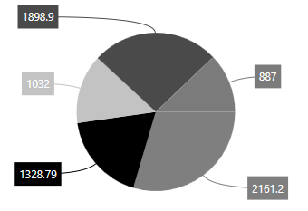

The default appearance of the label can be customized using [`LabelTemplate`](https://help.syncfusion.com/cr/cref_files/wpf/Syncfusion.SfChart.WPF~Syncfusion.UI.Xaml.Charts.ChartAdornmentInfoBase~LabelTemplate.html) property as in the below code example:





<syncfusion:SfChart x:Name="chart">

    <syncfusion:SfChart.Resources>

        <DataTemplate>

            <Grid>

                 <Grid.RowDefinitions>

                    <RowDefinition Height="15" ></RowDefinition>

                    <RowDefinition Height="15"></RowDefinition>

                 </Grid.RowDefinitions>

                 <Grid Name="backgroundGrid" Width="24" Height="24"
                      Visibility="Collapsed" />

                     <Path Grid.Row="0"  Stretch="Uniform" Fill="#FF0F0E0E"
                              
                           Width="24" Height="24" Margin="0,0,0,0"
                              
                           RenderTransformOrigin="0.5,0.5">

                            <Path.Data>

                                <PathGeometry FillRule="Nonzero" Figures="M22.5,15.8899993896484L37.5,
                                
                                              30.8899993896484 7.5,30.8899993896484 22.5,15.8899993896484z" />

                            </Path.Data>

                            <Path.RenderTransform>

                                <TransformGroup>

                                    <TransformGroup.Children>

                                        <RotateTransform Angle="0" />

                                        <ScaleTransform ScaleX="1" ScaleY="1" />

                                    </TransformGroup.Children>

                                </TransformGroup>

                            </Path.RenderTransform>

                        </Path>

                        <TextBlock Grid.Row="1" Text="{Binding}" FontSize="11" Foreground="Black"></TextBlock>

                    </Grid>

                </DataTemplate>

   </syncfusion:SfChart.Resources>

   <syncfusion:ColumnSeries  Label="2011"
                                      
                             Interior="#777777"
                                      
                             ItemsSource="{Binding Demands}" 
                                  
                             XBindingPath="Demand" 
                                      
                             YBindingPath="Year2011">

         <syncfusion:ColumnSeries.AdornmentsInfo>

                    <syncfusion:ChartAdornmentInfo ShowLabel="True"
                                                   
                                                   LabelPosition="Outer"
                                                   
                                                   LabelTemplate="{StaticResource labelTemplate}"/>

        </syncfusion:ColumnSeries.AdornmentsInfo>

</syncfusion:ColumnSeries>

</syncfusion:SfChart>





ColumnSeries series = new ColumnSeries()
{

    ItemsSource = new ViewModel().Demands,

    XBindingPath = "Demand",

    YBindingPath = "Year2011",

    Label = "2011",

    Interior = new SolidColorBrush(Color.FromRgb(0x77, 0x77, 0x77))

};

ChartAdornmentInfo adornmentInfo = new ChartAdornmentInfo()
{

    ShowLabel = true,

    LabelPosition = AdornmentsLabelPosition.Outer,

    LabelTemplate = chart.Resources["labelTemplate"] as DataTemplate

};

series.AdornmentsInfo = adornmentInfo;

chart.Series.Add(series);





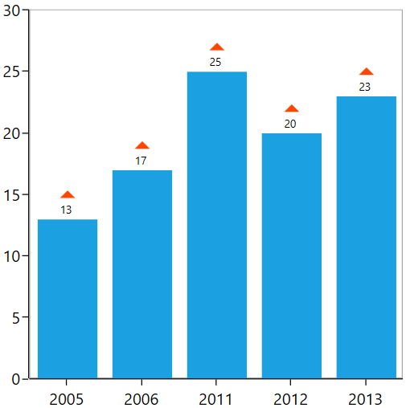

## Label Format

[`SegmentLabelFormat`](https://help.syncfusion.com/cr/cref_files/wpf/Syncfusion.SfChart.WPF~Syncfusion.UI.Xaml.Charts.ChartAdornmentInfoBase~SegmentLabelFormat.html#) property allows you to provide formatting for the labels.

In the following image, you can see the decimal position will be rounded off to two digits by default.

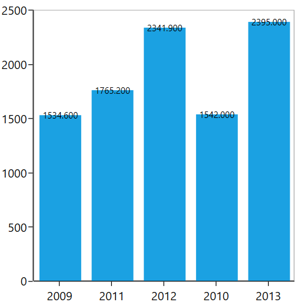

The following code example demonstrates the y value having three decimal digits:





<syncfusion:ColumnSeries  Label="2011"

Interior="#777777"

ItemsSource="{Binding Demands}" 

XBindingPath="Demand"  

YBindingPath="Year2011">

<syncfusion:ColumnSeries.AdornmentsInfo>

<syncfusion:ChartAdornmentInfo ShowLabel="True" SegmentLabelFormat="#.000" AdornmentsPosition="Top">

</syncfusion:ChartAdornmentInfo>

</syncfusion:ColumnSeries.AdornmentsInfo>

</syncfusion:ColumnSeries>





ChartAdornmentInfo adornmentInfo = new ChartAdornmentInfo()
{

    ShowLabel = true,

    AdornmentsPosition = AdornmentsPosition.Top,

    SegmentLabelFormat = "0.000"

};





## Adding Connector Line to Adornments

You can add connector line for the adornments using [`ShowConnectorLine`](https://help.syncfusion.com/cr/cref_files/wpf/Syncfusion.SfChart.WPF~Syncfusion.UI.Xaml.Charts.ChartAdornmentInfoBase~ShowConnectorLine.html#) property. Also this connector line can be customized using [`ConnectorHeight`](https://help.syncfusion.com/cr/cref_files/wpf/Syncfusion.SfChart.WPF~Syncfusion.UI.Xaml.Charts.ChartAdornmentInfoBase~ConnectorHeight.html#), [`ConnectorLineStyle`](https://help.syncfusion.com/cr/cref_files/wpf/Syncfusion.SfChart.WPF~Syncfusion.UI.Xaml.Charts.ChartAdornmentInfoBase~ConnectorLineStyle.html#) and [`ConnectorRotationAngle`](https://help.syncfusion.com/cr/cref_files/wpf/Syncfusion.SfChart.WPF~Syncfusion.UI.Xaml.Charts.ChartAdornmentInfoBase~ConnectorRotationAngle.html#) properties.

The following code example shows the customization option for connector line:





<syncfusion:ColumnSeries.AdornmentsInfo>

<syncfusion:ChartAdornmentInfo  ShowLabel="True" LabelPosition="Outer"
                                ShowConnectorLine="True" ConnectorHeight="10" 
                                ConnectorRotationAngle="90">
</syncfusion:ChartAdornmentInfo>

</syncfusion:ColumnSeries.AdornmentsInfo>





ChartAdornmentInfo adornmentInfo = new ChartAdornmentInfo()
{

    ShowLabel = true,

    LabelPosition = AdornmentsLabelPosition.Outer,

    ShowConnectorLine = true,

    ConnectorHeight = 10,

    ConnectorRotationAngle = 90

};

series.AdornmentsInfo = adornmentInfo;





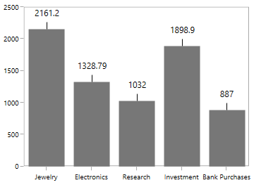

### Connector Line Style

You can define the style for the connector line using [`ConnectorLineStyle`](https://help.syncfusion.com/cr/cref_files/wpf/Syncfusion.SfChart.WPF~Syncfusion.UI.Xaml.Charts.ChartAdornmentInfoBase~ConnectorLineStyle.html#) properties.





 <syncfusion:SfChart x:Name="chart">

     <syncfusion:SfChart.Resources>

            

      </syncfusion:SfChart.Resources>

      <syncfusion:PieSeries ItemsSource="{Binding Demands}" 
                                      
                            XBindingPath="Demand" 
                                      
                            YBindingPath="Year2011"
                                   
                            LabelPosition="OutsideExtended" >

          <syncfusion:PieSeries.AdornmentsInfo>

                  <syncfusion:ChartAdornmentInfo ShowLabel="True" 
                                                   
                                                 ShowConnectorLine="True" 
                                                   
                                                 ConnectorLineStyle="{StaticResource lineStyle}"/>

          </syncfusion:PieSeries.AdornmentsInfo>

      </syncfusion:PieSeries>

</syncfusion:SfChart>





PieSeries series = new PieSeries()
{

    ItemsSource = new ViewModel().Demands,

    XBindingPath = "Demand",

    YBindingPath = "Year2011",

    LabelPosition = CircularSeriesLabelPosition.OutsideExtended

};

ChartAdornmentInfo adornmentInfo = new ChartAdornmentInfo()
{

    ShowLabel = true,

    ShowConnectorLine = true,

    ConnectorLineStyle = chart.Resources["lineStyle"] as Style

};

series.AdornmentsInfo = adornmentInfo;

chart.Series.Add(series);





### Connector Type

[`ConnectorType`](https://help.syncfusion.com/cr/cref_files/wpf/Syncfusion.SfChart.WPF~Syncfusion.UI.Xaml.Charts.CircularSeriesBase~ConnectorType.html#) property in AccumulationSeries is used to specify the connector line type such as [`Line`](https://help.syncfusion.com/cr/cref_files/wpf/Syncfusion.SfChart.WPF~Syncfusion.UI.Xaml.Charts.ConnectorMode.html) or [`Bezier`](https://help.syncfusion.com/cr/cref_files/wpf/Syncfusion.SfChart.WPF~Syncfusion.UI.Xaml.Charts.ConnectorMode.html). This property is only for AccumulationSeries like PieSeries, DoughnutSeries, PyramidSeries and FunnelSeries.

**Line**

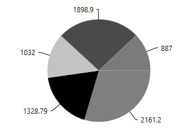

**StraightLine**

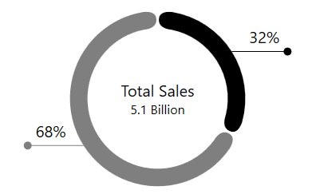

**Bezier**





<syncfusion:PieSeries ConnectorType="Bezier" LabelPosition="Outside"

ItemsSource="{Binding Demands}"   

XBindingPath="Demand"  EnableSmartLabels="True"

YBindingPath="Year2011">

<syncfusion:PieSeries.AdornmentsInfo>

<syncfusion:ChartAdornmentInfo ShowLabel="True" ConnectorHeight="17" ShowConnectorLine="True" >

</syncfusion:ChartAdornmentInfo>

</syncfusion:PieSeries.AdornmentsInfo>

</syncfusion:PieSeries>





PieSeries series = new PieSeries()
{

    ItemsSource = new ViewModel().Data,

    XBindingPath = "XValue",

    YBindingPath = "YValue",

    Label = "2011",

    EnableSmartLabels = true,

    ConnectorType = ConnectorMode.Bezier,

    LabelPosition = CircularSeriesLabelPosition.Outside

};

ChartAdornmentInfo adornmentInfo = new ChartAdornmentInfo()
{

    ShowLabel = true,

    ShowConnectorLine = true,

    ConnectorHeight = 17

};

series.AdornmentsInfo = adornmentInfo;

chart.Series.Add(series);





## Positioning the Adornments

The positioning of adornments inside the series is defined using [`AdornmentPosition`](https://help.syncfusion.com/cr/cref_files/wpf/Syncfusion.SfChart.WPF~Syncfusion.UI.Xaml.Charts.ChartAdornmentInfoBase~AdornmentsPosition.html#) property. 

* [`Top`](https://help.syncfusion.com/cr/cref_files/wpf/Syncfusion.SfChart.WPF~Syncfusion.UI.Xaml.Charts.AdornmentsPosition.html) - Positions the Adornment at the top edge point of a chart segment.
* [`Bottom`](https://help.syncfusion.com/cr/cref_files/wpf/Syncfusion.SfChart.WPF~Syncfusion.UI.Xaml.Charts.AdornmentsPosition.html) - Positions the Adornment at the bottom edge point of a chart segment.
* [`TopAndBottom`](https://help.syncfusion.com/cr/cref_files/wpf/Syncfusion.SfChart.WPF~Syncfusion.UI.Xaml.Charts.AdornmentsPosition.html) - Positions the Adornment at the center point of a chart segment.

N> This behavior varies based on the chart series type.

The following code example explains the positioning of adornments in the middle of the segment.





<syncfusion:ColumnSeries.AdornmentsInfo>

<syncfusion:ChartAdornmentInfo AdornmentsPosition="TopAndBottom" 

ShowMarker="True" Symbol="Ellipse">

</syncfusion:ChartAdornmentInfo>

</syncfusion:ColumnSeries.AdornmentsInfo>





ChartAdornmentInfo adornmentInfo = new ChartAdornmentInfo()
{

    AdornmentsPosition = AdornmentsPosition.TopAndBottom,

    ShowMarker = true,

    Symbol = ChartSymbol.Ellipse

};

series.AdornmentsInfo = adornmentInfo;





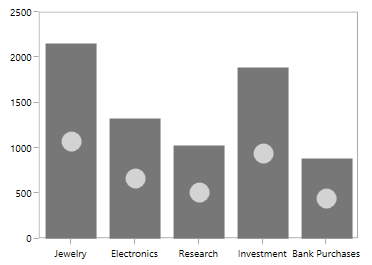

Also you can define the label alignment using  [`HorizontalAlignment`](https://help.syncfusion.com/cr/cref_files/wpf/Syncfusion.SfChart.WPF~Syncfusion.UI.Xaml.Charts.ChartAdornmentInfoBase~HorizontalAlignment.html#) and [`VerticalAlignment`](https://help.syncfusion.com/cr/cref_files/wpf/Syncfusion.SfChart.WPF~Syncfusion.UI.Xaml.Charts.ChartAdornmentInfoBase~VerticalAlignment.html#) properties and the following code example demonstrates the labels positioned using horizontal and vertical alignment.





<syncfusion:ColumnSeries.AdornmentsInfo>

<syncfusion:ChartAdornmentInfo  ShowLabel="True" LabelPosition="Default" HorizontalAlignment="Right" VerticalAlignment="Top">

</syncfusion:ChartAdornmentInfo>

</syncfusion:ColumnSeries.AdornmentsInfo>





ChartAdornmentInfo adornmentInfo = new ChartAdornmentInfo()
{

    LabelPosition = AdornmentsLabelPosition.Default,

    ShowLabel = true,

    HorizontalAlignment = HorizontalAlignment.Right,

    VerticalAlignment = VerticalAlignment.Top

};

series.AdornmentsInfo = adornmentInfo;





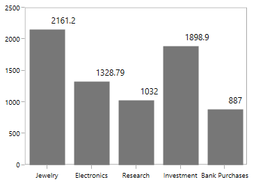

### Advanced Positioning

Other than the above positioning options, SfChart providing additional customization option to position the adornments smartly based on series types using [`LabelPosition`](https://help.syncfusion.com/cr/cref_files/wpf/Syncfusion.SfChart.WPF~Syncfusion.UI.Xaml.Charts.ChartAdornmentInfoBase~LabelPosition.html#) property.

The following are the values for this property: 

* [`Default`](https://help.syncfusion.com/cr/cref_files/wpf/Syncfusion.SfChart.WPF~Syncfusion.UI.Xaml.Charts.AdornmentsLabelPosition.html)
* [`Auto`](https://help.syncfusion.com/cr/cref_files/wpf/Syncfusion.SfChart.WPF~Syncfusion.UI.Xaml.Charts.AdornmentsLabelPosition.html)
* [`Inner`](https://help.syncfusion.com/cr/cref_files/wpf/Syncfusion.SfChart.WPF~Syncfusion.UI.Xaml.Charts.AdornmentsLabelPosition.html)
* [`Outer`](https://help.syncfusion.com/cr/cref_files/wpf/Syncfusion.SfChart.WPF~Syncfusion.UI.Xaml.Charts.AdornmentsLabelPosition.html)
* [`Center`](https://help.syncfusion.com/cr/cref_files/wpf/Syncfusion.SfChart.WPF~Syncfusion.UI.Xaml.Charts.AdornmentsLabelPosition.html)

The following section shows few examples for this LabelPosition behavior with respect to the series.

**Column Series**

LabelPosition as Center





<syncfusion:ColumnSeries.AdornmentsInfo>

<syncfusion:ChartAdornmentInfo  ShowLabel="True" LabelPosition="Center">

</syncfusion:ChartAdornmentInfo>

</syncfusion:ColumnSeries.AdornmentsInfo>





ColumnSeries series = new ColumnSeries();

ChartAdornmentInfo adornmentInfo = new ChartAdornmentInfo()
{

    ShowLabel = true,

    LabelPosition = AdornmentsLabelPosition.Center

};

series.AdornmentsInfo = adornmentInfo;





LabelPosition as Inner





<syncfusion:ColumnSeries.AdornmentsInfo>

<syncfusion:ChartAdornmentInfo  ShowLabel="True" LabelPosition="Inner">

</syncfusion:ChartAdornmentInfo>

</syncfusion:ColumnSeries.AdornmentsInfo>





ColumnSeries series = new ColumnSeries();

ChartAdornmentInfo adornmentInfo = new ChartAdornmentInfo()
{

    ShowLabel = true,

    LabelPosition = AdornmentsLabelPosition.Inner

};

series.AdornmentsInfo = adornmentInfo;





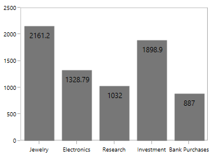

LabelPosition as Outer





<syncfusion:ColumnSeries.AdornmentsInfo>

<syncfusion:ChartAdornmentInfo  ShowLabel="True" LabelPosition="Outer">

</syncfusion:ChartAdornmentInfo>

</syncfusion:ColumnSeries.AdornmentsInfo>





ColumnSeries series = new ColumnSeries();

ChartAdornmentInfo adornmentInfo = new ChartAdornmentInfo()
{

    ShowLabel = true,

    LabelPosition = AdornmentsLabelPosition.Outer

};

series.AdornmentsInfo = adornmentInfo;





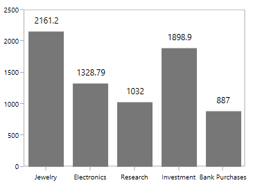

**Spline Series**

LabelPosition as Auto





<syncfusion:SplineSeries.AdornmentsInfo>

<syncfusion:ChartAdornmentInfo  ShowLabel="True" LabelPosition="Auto">

</syncfusion:ChartAdornmentInfo>

</syncfusion:SplineSeries.AdornmentsInfo>





SplineSeries series = new SplineSeries();

ChartAdornmentInfo adornmentInfo = new ChartAdornmentInfo()
{

    ShowLabel = true,

    LabelPosition = AdornmentsLabelPosition.Auto

};

series.AdornmentsInfo = adornmentInfo;

chart.Series.Add(series);





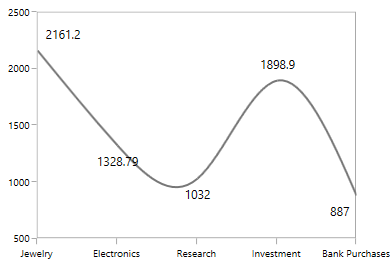

LabelPosition as Inner





<syncfusion:SplineSeries.AdornmentsInfo>

<syncfusion:ChartAdornmentInfo  ShowLabel="True" LabelPosition="Inner">

</syncfusion:ChartAdornmentInfo>

</syncfusion:SplineSeries.AdornmentsInfo>





SplineSeries series = new SplineSeries();

ChartAdornmentInfo adornmentInfo = new ChartAdornmentInfo()
{

    ShowLabel = true,

    LabelPosition = AdornmentsLabelPosition.Inner

};

series.AdornmentsInfo = adornmentInfo;

chart.Series.Add(series);





LabelPosition as Outer





<syncfusion:SplineSeries.AdornmentsInfo>

<syncfusion:ChartAdornmentInfo  ShowLabel="True" LabelPosition="Outer">

</syncfusion:ChartAdornmentInfo>

</syncfusion:SplineSeries.AdornmentsInfo>





SplineSeries series = new SplineSeries();

ChartAdornmentInfo adornmentInfo = new ChartAdornmentInfo()
{

    ShowLabel = true,

    LabelPosition = AdornmentsLabelPosition.Outer

};

series.AdornmentsInfo = adornmentInfo;

chart.Series.Add(series);





LabelPosition as Center





<syncfusion:SplineSeries.AdornmentsInfo>

<syncfusion:ChartAdornmentInfo  ShowLabel="True" LabelPosition="Center">

</syncfusion:ChartAdornmentInfo>

</syncfusion:SplineSeries.AdornmentsInfo>





SplineSeries series = new SplineSeries();

ChartAdornmentInfo adornmentInfo = new ChartAdornmentInfo()
{

    ShowLabel = true,

    LabelPosition = AdornmentsLabelPosition.Center

};

series.AdornmentsInfo = adornmentInfo;

chart.Series.Add(series);





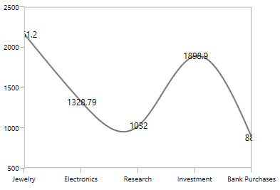

## Smart Labels for Accumulation Series

When you have more datapoints in Pie or Doughnut series, the adornment labels might get overlap with each other. SfChart provides built-in support to avoid these overlapping by using [`EnableSmartLabels`](https://help.syncfusion.com/cr/cref_files/wpf/Syncfusion.SfChart.WPF~Syncfusion.UI.Xaml.Charts.CircularSeriesBase~EnableSmartLabels.html#) property.

The following code example demonstrates the EnableSmartLabels property:





<chart:PieSeries EnableAnimation="False" x:Name="DouughnutSeries" 

ExplodeAll="True" ExplodeRadius="3" Palette="Custom"

EnableSmartLabels="True"

XBindingPath="Category" ItemsSource="{Binding Tax}" 

Label="Tax" YBindingPath="Percentage">

<chart:PieSeries.AdornmentsInfo>

<chart:ChartAdornmentInfo HorizontalAlignment="Center"

VerticalAlignment="Center" ShowLabel="True" ShowConnectorLine="True" UseSeriesPalette="True"

>

</chart:ChartAdornmentInfo>

</chart:PieSeries.AdornmentsInfo>





PieSeries series = new PieSeries()
{

    ItemsSource = new ViewModel().Tax,

    XBindingPath = "Category",

    YBindingPath = "Percentage",

    Label = "Tax",

    EnableSmartLabels = true,

    ExplodeAll = true ,

    ExplodeRadius = 3,

    Palette = ChartColorPalette.Custom,

};

ChartAdornmentInfo adornmentInfo = new ChartAdornmentInfo()
{

    ShowLabel = true,

    ShowConnectorLine = true,

    UseSeriesPalette = true,

    HorizontalAlignment = HorizontalAlignment.Center,

    VerticalAlignment = VerticalAlignment.Center

};

series.AdornmentsInfo = adornmentInfo;

chart.Series.Add(series);





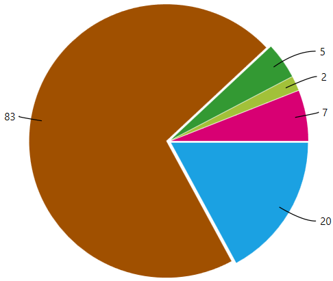

N> For circular series, the adornment position can be changed to [`Inside`](https://help.syncfusion.com/cr/cref_files/wpf/Syncfusion.SfChart.WPF~Syncfusion.UI.Xaml.Charts.CircularSeriesLabelPosition.html), [`Outside`](https://help.syncfusion.com/cr/cref_files/wpf/Syncfusion.SfChart.WPF~Syncfusion.UI.Xaml.Charts.CircularSeriesLabelPosition.html) or [`OutsideExtended`](https://help.syncfusion.com/cr/cref_files/wpf/Syncfusion.SfChart.WPF~Syncfusion.UI.Xaml.Charts.CircularSeriesLabelPosition.html) using the [`LabelPosition`](https://help.syncfusion.com/cr/cref_files/wpf/Syncfusion.SfChart.WPF~Syncfusion.UI.Xaml.Charts.CircularSeriesBase~LabelPosition.html) property.
