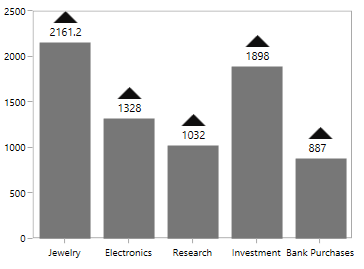
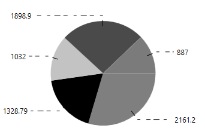

# Data Label in WPF Charts (SfChart)

Data points can be easily annotated with labels to help improve the readability of data. Labels are enabled by default but you can also change the visibility of the labels using [`ShowLabel`](https://help.syncfusion.com/cr/cref_files/wpf/Syncfusion.SfChart.WPF~Syncfusion.UI.Xaml.Charts.ChartAdornmentInfoBase~ShowLabel.html) property of [`ChartAdornmentInfo`](https://help.syncfusion.com/cr/cref_files/wpf/Syncfusion.SfChart.WPF~Syncfusion.UI.Xaml.Charts.ChartAdornmentInfo.html). 

## Define Data Label 

SfChart provides the support to customize the label content using [`SegmentLabelContent`](https://help.syncfusion.com/cr/cref_files/wpf/Syncfusion.SfChart.WPF~Syncfusion.UI.Xaml.Charts.ChartAdornmentInfoBase~SegmentLabelContent.html#) property. This property allows you to define the value to be displayed as adornment label.

| SegmentLabelContent values | Description | Output |
|---|--|---|
| DateTime | Displays LabelContent.DateTime value |  |
|LabelContentPath | Displays the y value||
| Percentage | Displays the percentage value of series' point among other points | |
| XValue | Displays the X value of series' point| |
| YofTot | Displays the value of Y of total values' point| |
| YValue | Displays the Y value of series' point|  |

## Customizing Labels

The following properties are used to customize the adornment label.

* [`BorderBrush`](https://help.syncfusion.com/cr/cref_files/wpf/Syncfusion.SfChart.WPF~Syncfusion.UI.Xaml.Charts.ChartAdornmentInfoBase~BorderBrush.html#)- used to change the border color.
* [`BorderThickness`](https://help.syncfusion.com/cr/cref_files/wpf/Syncfusion.SfChart.WPF~Syncfusion.UI.Xaml.Charts.ChartAdornmentInfoBase~BorderThickness.html#)- used to change the thickness of the border.
* [`Margin`](https://help.syncfusion.com/cr/cref_files/wpf/Syncfusion.SfChart.WPF~Syncfusion.UI.Xaml.Charts.ChartAdornmentInfoBase~Margin.html#)- used to change the margin size for label.
* [`FontStyle`](https://help.syncfusion.com/cr/cref_files/wpf/Syncfusion.SfChart.WPF~Syncfusion.UI.Xaml.Charts.ChartAdornmentInfoBase~FontStyle.html#)-  used to change font family of the label.
* [`FontSize`](https://help.syncfusion.com/cr/cref_files/wpf/Syncfusion.SfChart.WPF~Syncfusion.UI.Xaml.Charts.ChartAdornmentInfoBase~FontSize.html#) -  used to change font size of the label.
* [`Foreground`](https://help.syncfusion.com/cr/cref_files/wpf/Syncfusion.SfChart.WPF~Syncfusion.UI.Xaml.Charts.ChartAdornmentInfoBase~Foreground.html#)- used to change the color of the label.
* [`FontFamily`](https://help.syncfusion.com/cr/cref_files/wpf/Syncfusion.SfChart.WPF~Syncfusion.UI.Xaml.Charts.ChartAdornmentInfoBase~FontFamily.html#)-  used to change the font family of the label.
* [`Background`](https://help.syncfusion.com/cr/cref_files/wpf/Syncfusion.SfChart.WPF~Syncfusion.UI.Xaml.Charts.ChartAdornmentInfoBase~Background.html)- used to change the label background color.

The following code example demonstrates the customization of label using the above properties:





        <syncfusion:ColumnSeries.AdornmentsInfo>
            <syncfusion:ChartAdornmentInfo LabelPosition="Outer" Foreground="Black" FontSize="11" FontFamily="Calibri" BorderBrush="Black" BorderThickness="1" Margin="1" FontStyle="Italic"  Background="DarkGray" ShowLabel="True">                        
            </syncfusion:ChartAdornmentInfo>
        </syncfusion:ColumnSeries.AdornmentsInfo>





        ChartAdornmentInfo adornmentInfo = new ChartAdornmentInfo()
            {

                ShowLabel = true,
                LabelPosition = AdornmentsLabelPosition.Outer,
                Foreground = new SolidColorBrush(Colors.Black),
                BorderBrush = new SolidColorBrush(Colors.Black),
                Background = new SolidColorBrush(Colors.DarkGray),
                BorderThickness = new Thickness(1),
                Margin = new Thickness(1),
                FontStyle = FontStyles.Italic,
                FontFamily = new FontFamily("Calibri"),
                FontSize = 11
            };





## Label Template

The default appearance of the label can be customized using [`LabelTemplate`](https://help.syncfusion.com/cr/cref_files/wpf/Syncfusion.SfChart.WPF~Syncfusion.UI.Xaml.Charts.ChartAdornmentInfoBase~LabelTemplate.html) property as in the below code example:





    <Window.Resources>
        <DataTemplate x:Key="adornmentTemplate">
            <StackPanel Orientation="Vertical">               
                <Path Grid.Row="0"  Stretch="Uniform" Fill="#FF0F0E0E"                              
                           Width="15" Height="15" Margin="0,0,0,0"                              
                           RenderTransformOrigin="0.5,0.5">
                    <Path.Data>
                        <PathGeometry FillRule="Nonzero" Figures="M22.5,15.8899993896484L37.5,                                
                                              30.8899993896484 7.5,30.8899993896484 22.5,15.8899993896484z" />
                    </Path.Data>
                    <Path.RenderTransform>
                        <TransformGroup>
                            <TransformGroup.Children>
                                <RotateTransform Angle="0" />
                                <ScaleTransform ScaleX="1" ScaleY="1" />
                            </TransformGroup.Children>
                        </TransformGroup>
                    </Path.RenderTransform>
                </Path>
                <TextBlock Grid.Row="1" Text="{Binding}" FontSize="11" Foreground="Black"></TextBlock>
            </StackPanel>
        </DataTemplate>
    </Window.Resources>

     <Grid>
        <chart:SfChart Width="400" Height="300">
         ...
            <syncfusion:ColumnSeries Interior="#777777" ItemsSource="{Binding Demands}" XBindingPath="Category" YBindingPath="Value">
                <syncfusion:ColumnSeries.AdornmentsInfo>
                    <syncfusion:ChartAdornmentInfo ShowLabel="True" LabelTemplate="{StaticResource adornmentTemplate}"
                        LabelPosition="Outer"></syncfusion:ChartAdornmentInfo>
                </syncfusion:ColumnSeries.AdornmentsInfo>
            </syncfusion:ColumnSeries>
        ...
        </chart:SfChart>
    </Grid>





        ColumnSeries series = new ColumnSeries()
            {
                ItemsSource = new ViewModel().Demands,
                XBindingPath = "Category",
                YBindingPath = "Value",
                 Interior = new SolidColorBrush(Color.FromRgb(0x77, 0x77, 0x77))
            };

            ChartAdornmentInfo adornmentInfo = new ChartAdornmentInfo()
            {
                ShowLabel = true,
                LabelPosition = AdornmentsLabelPosition.Outer,
                LabelTemplate = this.Resources["adornmentTemplate"] as DataTemplate
            };
        series.AdornmentsInfo = adornmentInfo;





## Label Format

[`SegmentLabelFormat`](https://help.syncfusion.com/cr/cref_files/wpf/Syncfusion.SfChart.WPF~Syncfusion.UI.Xaml.Charts.ChartAdornmentInfoBase~SegmentLabelFormat.html#) property allows you to provide formatting for the labels.

The following code example demonstrates the y value having three decimal digits.





        <syncfusion:ChartAdornmentInfo ShowLabel="True" SegmentLabelFormat="#.000" AdornmentsPosition="Top">
        </syncfusion:ChartAdornmentInfo>





        ChartAdornmentInfo adornmentInfo = new ChartAdornmentInfo()
        {
             ShowLabel = true,
            SegmentLabelFormat = "0.000"
        };





In the following image, you can see the decimal position will be rounded off to two digits by default.

## Label Rotation

[`LabelRotationAngle`](https://help.syncfusion.com/cr/cref_files/wpf/Syncfusion.SfChart.WPF~Syncfusion.UI.Xaml.Charts.ChartAdornmentInfoBase~LabelRotationAngle.html#) property is used to define the angle to which the label has to rotate. The following code demonstrates the label rotating angle.





        <syncfusion:ColumnSeries.AdornmentsInfo>
             <syncfusion:ChartAdornmentInfo LabelPosition="Outer" LabelRotationAngle="45" ShowLabel="True"></syncfusion:ChartAdornmentInfo>
        </syncfusion:ColumnSeries.AdornmentsInfo>




            ChartAdornmentInfo adornmentInfo = new ChartAdornmentInfo()
            {
                ShowLabel = true,
                LabelRotationAngle = 45,
                LabelPosition=AdornmentsLabelPosition.Outer          
            };




## Connector Line

This feature is used to connect label and data point using a line. It can be enabled for any chart types but this is often used with Pie and Doughnut chart types. You can add connector line for the adornments using [`ShowConnectorLine`](https://help.syncfusion.com/cr/cref_files/wpf/Syncfusion.SfChart.WPF~Syncfusion.UI.Xaml.Charts.ChartAdornmentInfoBase~ShowConnectorLine.html#) property. 

The connector line can be customized using the below properies.

* [`ConnectorHeight`](https://help.syncfusion.com/cr/cref_files/wpf/Syncfusion.SfChart.WPF~Syncfusion.UI.Xaml.Charts.ChartAdornmentInfoBase~ConnectorHeight.html#)
* [`ConnectorLineStyle`](https://help.syncfusion.com/cr/cref_files/wpf/Syncfusion.SfChart.WPF~Syncfusion.UI.Xaml.Charts.ChartAdornmentInfoBase~ConnectorLineStyle.html#) 
* [`ConnectorRotationAngle`](https://help.syncfusion.com/cr/cref_files/wpf/Syncfusion.SfChart.WPF~Syncfusion.UI.Xaml.Charts.ChartAdornmentInfoBase~ConnectorRotationAngle.html#)
* [`ConnectorLineStyle`](https://help.syncfusion.com/cr/cref_files/wpf/Syncfusion.SfChart.WPF~Syncfusion.UI.Xaml.Charts.ChartAdornmentInfoBase~ConnectorLineStyle.html#)

The following code example shows the customization options for connector line:





    <Window.Resources>

        

    </Window.Resources>

    <Grid>
        <chart:SfChart Width="400" Height="400">
         ...

        <syncfusion:PieSeries Interior="#777777" ItemsSource="{Binding Demands}" XBindingPath="Category" YBindingPath="FloatValue" LabelPosition="OutsideExtended">
                <syncfusion:PieSeries.AdornmentsInfo>
                    <syncfusion:ChartAdornmentInfo ShowLabel="True" ConnectorLineStyle="{StaticResource lineStyle}"ShowConnectorLine="True" LabelPosition="Outer"></syncfusion:ChartAdornmentInfo>
                </syncfusion:PieSeries.AdornmentsInfo>
        </syncfusion:PieSeries>

        ...
        </chart:SfChart>
    </Grid>





        PieSeries series = new PieSeries()
            {
                ItemsSource = new ServerViewModel().Performance,
                XBindingPath = "Year",
                YBindingPath = "Plastic",
                LabelPosition = CircularSeriesLabelPosition.OutsideExtended,
                Interior = new SolidColorBrush(Color.FromRgb(0x77, 0x77, 0x77))
            };

        ChartAdornmentInfo adornmentInfo = new ChartAdornmentInfo()
            {
                ShowLabel = true,
                ShowConnectorLine = true,
                UseSeriesPalette = true,
                ConnectorLineStyle=this.Resources["lineStyle"] as Style
                LabelPosition =AdornmentsLabelPosition.Outer,
            };
        series.AdornmentsInfo = adornmentInfo;





**Connector Type**

[`ConnectorType`](https://help.syncfusion.com/cr/cref_files/wpf/Syncfusion.SfChart.WPF~Syncfusion.UI.Xaml.Charts.CircularSeriesBase~ConnectorType.html#) property in AccumulationSeries is used to specify the connector line type such as [`Line`](https://help.syncfusion.com/cr/cref_files/wpf/Syncfusion.SfChart.WPF~Syncfusion.UI.Xaml.Charts.ConnectorMode.html) or [`Bezier`](https://help.syncfusion.com/cr/cref_files/wpf/Syncfusion.SfChart.WPF~Syncfusion.UI.Xaml.Charts.ConnectorMode.html). This property is only for AccumulationSeries like PieSeries, DoughnutSeries, PyramidSeries and FunnelSeries.





        <chart:PieSeries Interior="#777777" ItemsSource="{Binding Performance}" XBindingPath="ServerLoad"
            YBindingPath="Server1" EnableSmartLabels="True" ConnectorType="Bezier" LabelPosition="OutsideExtended">
                <chart:PieSeries.AdornmentsInfo>
                    <chart:ChartAdornmentInfo HorizontalAlignment="Center"
                                              VerticalAlignment="Center"    ShowConnectorLine="True" 
                                              ConnectorHeight="80" ShowLabel="True" />
                </chart:PieSeries.AdornmentsInfo>
        </chart:PieSeries>





        PieSeries series = new PieSeries()
            {
                ItemsSource = new ServerViewModel().Performance,
                XBindingPath = "Year",
                YBindingPath = "Plastic",
                EnableSmartLabels = true,
                ExplodeAll = true,
                ExplodeRadius = 3,
                ConnectorType=ConnectorMode.Bezier,
                LabelPosition = CircularSeriesLabelPosition.OutsideExtended,
                Interior = new SolidColorBrush(Color.FromRgb(0x77, 0x77, 0x77))
            };

        ChartAdornmentInfo adornmentInfo = new ChartAdornmentInfo()
            {
                ShowLabel = true,
                ShowConnectorLine = true,
                HorizontalAlignment = HorizontalAlignment.Center,
                VerticalAlignment = VerticalAlignment.Center,
                ConnectorHeight= 80
            };

    



 **Line** 
 
  

 **Straight Line**

 **Bezier**
 
  

## Applying Series Brush

[`UseSeriesPalette`](https://help.syncfusion.com/cr/cref_files/wpf/Syncfusion.SfChart.WPF~Syncfusion.UI.Xaml.Charts.ChartAdornmentInfoBase~UseSeriesPalette.html#) property is used to set the interior of the series to the adornment background. 

>N For Accumulation like Pie, Doughnut, Funnel and Pyramid the segment interior color will be reflected in adornment background.





        <syncfusion:ChartAdornmentInfo ShowLabel="True" UseSeriesPalette="True">

        </syncfusion:ChartAdornmentInfo>





        ChartAdornmentInfo adornmentInfo = new ChartAdornmentInfo()
        {
            ShowLabel = true,
            UseSeriesPalette = true
        };





## Smart Labels

When you have more datapoints in Pie or Doughnut series, the adornment labels might get overlap with each other. SfChart provides built-in support to avoid these overlapping by using [`EnableSmartLabels`](https://help.syncfusion.com/cr/cref_files/wpf/Syncfusion.SfChart.WPF~Syncfusion.UI.Xaml.Charts.CircularSeriesBase~EnableSmartLabels.html#) property.

The following code example demonstrates the EnableSmartLabels property:





            <chart:PieSeries Interior="#777777" ItemsSource="{Binding CategoricalData}" ConnectorType="Bezier" XBindingPath="Year"
            YBindingPath="Plastic" EnableSmartLabels="True" LabelPosition="OutsideExtended" ExplodeAll="True" ExplodeRadius="3">
                <chart:PieSeries.AdornmentsInfo>
                    <chart:ChartAdornmentInfo ShowLabel="True" HorizontalAlignment="Center" VerticalAlignment="Center" ShowConnectorLine="True"></chart:ChartAdornmentInfo>
                </chart:PieSeries.AdornmentsInfo>
            </chart:PieSeries>





            PieSeries series = new PieSeries()
            {
                ItemsSource = new ViewModel().Tax,
                XBindingPath = "Year",
                YBindingPath = "Plastic",
                EnableSmartLabels = true,
                ExplodeAll = true,
                ExplodeRadius = 3,
                Palette = ChartColorPalette.Custom,
                LabelPosition=CircularSeriesLabelPosition.OutsideExtended,
                Interior = new SolidColorBrush(Color.FromRgb(0x77, 0x77, 0x77))
            };

            ChartAdornmentInfo adornmentInfo = new ChartAdornmentInfo()
            {
                ShowLabel = true,
                ShowConnectorLine = true,
                UseSeriesPalette = true,
                HorizontalAlignment = HorizontalAlignment.Center,
                VerticalAlignment = VerticalAlignment.Center
            };
            series.AdornmentsInfo = adornmentInfo;





N> For circular series, the adornment position can be changed to [`Inside`](https://help.syncfusion.com/cr/cref_files/wpf/Syncfusion.SfChart.WPF~Syncfusion.UI.Xaml.Charts.CircularSeriesLabelPosition.html), [`Outside`](https://help.syncfusion.com/cr/cref_files/wpf/Syncfusion.SfChart.WPF~Syncfusion.UI.Xaml.Charts.CircularSeriesLabelPosition.html) or [`OutsideExtended`](https://help.syncfusion.com/cr/cref_files/wpf/Syncfusion.SfChart.WPF~Syncfusion.UI.Xaml.Charts.CircularSeriesLabelPosition.html) using the [`LabelPosition`](https://help.syncfusion.com/cr/cref_files/wpf/Syncfusion.SfChart.WPF~Syncfusion.UI.Xaml.Charts.CircularSeriesBase~LabelPosition.html) property.
