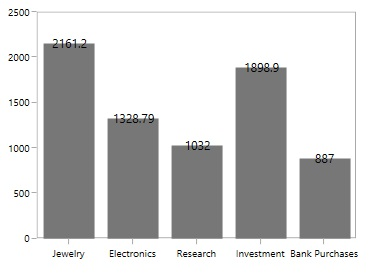
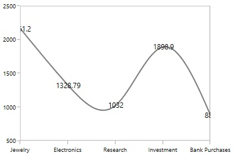
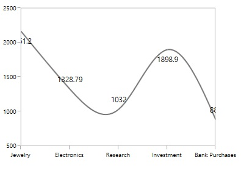
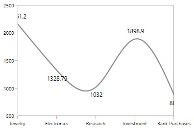

# Positioning Data Markers in WPF Charts (SfChart)

The positioning of adornments inside the series is defined using the [`AdornmentsPosition`](https://help.syncfusion.com/cr/wpf/Syncfusion.UI.Xaml.Charts.ChartAdornmentInfoBase.html#Syncfusion_UI_Xaml_Charts_ChartAdornmentInfoBase_AdornmentsPosition) property. 

* [`Top`](https://help.syncfusion.com/cr/wpf/Syncfusion.UI.Xaml.Charts.AdornmentsPosition.html) - Positions the adornment at the top edge point of a chart segment.
* [`Bottom`](https://help.syncfusion.com/cr/wpf/Syncfusion.UI.Xaml.Charts.AdornmentsPosition.html) - Positions the adornment at the bottom edge point of a chart segment.
* [`TopAndBottom`](https://help.syncfusion.com/cr/wpf/Syncfusion.UI.Xaml.Charts.AdornmentsPosition.html) - Positions the adornment at the center point of a chart segment.

N> This behavior varies based on the chart series type.

The following code example demonstrates positioning adornments in the middle of the segment:




<syncfusion:ChartAdornmentInfo ShowMarker="True" 
                              AdornmentsPosition="TopAndBottom" 
                              SymbolInterior="DarkGray"  
                              Symbol="Ellipse">
</syncfusion:ChartAdornmentInfo>



ColumnSeries series = new ColumnSeries();
ChartAdornmentInfo adornmentInfo = new ChartAdornmentInfo()
{
    ShowMarker = true,
    Symbol = ChartSymbol.Ellipse,
    SymbolInterior = new SolidColorBrush(Colors.DarkGray),
    AdornmentsPosition = AdornmentsPosition.TopAndBottom
};
series.AdornmentsInfo = adornmentInfo;




You can also define the label alignment using the [`HorizontalAlignment`](https://help.syncfusion.com/cr/wpf/Syncfusion.UI.Xaml.Charts.ChartAdornmentInfoBase.html#Syncfusion_UI_Xaml_Charts_ChartAdornmentInfoBase_HorizontalAlignment) and [`VerticalAlignment`](https://help.syncfusion.com/cr/wpf/Syncfusion.UI.Xaml.Charts.ChartAdornmentInfoBase.html#Syncfusion_UI_Xaml_Charts_ChartAdornmentInfoBase_VerticalAlignment) properties.

## Label Position

In addition to the positioning options mentioned above, SfChart provides additional customization options to position adornments intelligently based on series types using the [`LabelPosition`](https://help.syncfusion.com/cr/wpf/Syncfusion.UI.Xaml.Charts.ChartAdornmentInfoBase.html#Syncfusion_UI_Xaml_Charts_ChartAdornmentInfoBase_LabelPosition) property.

The following values are available for this property:

* [`Default`](https://help.syncfusion.com/cr/wpf/Syncfusion.UI.Xaml.Charts.AdornmentsLabelPosition.html)
* [`Auto`](https://help.syncfusion.com/cr/wpf/Syncfusion.UI.Xaml.Charts.AdornmentsLabelPosition.html)
* [`Inner`](https://help.syncfusion.com/cr/wpf/Syncfusion.UI.Xaml.Charts.AdornmentsLabelPosition.html)
* [`Outer`](https://help.syncfusion.com/cr/wpf/Syncfusion.UI.Xaml.Charts.AdornmentsLabelPosition.html)
* [`Center`](https://help.syncfusion.com/cr/wpf/Syncfusion.UI.Xaml.Charts.AdornmentsLabelPosition.html)

The following code sample illustrates the center position of data marker labels:




<chart:ChartAdornmentInfo ShowLabel="True" LabelPosition="Center"/>



ChartAdornmentInfo adornmentInfo = new ChartAdornmentInfo()
{
    ShowLabel = true,
    LabelPosition = AdornmentsLabelPosition.Center
};      




| Column | Spline |
|--|--|
|||

The following code sample illustrates the inner position of data marker labels:




<chart:ChartAdornmentInfo ShowLabel="True" LabelPosition="Inner"/>



ChartAdornmentInfo adornmentInfo = new ChartAdornmentInfo()
{
    ShowLabel = true,
    LabelPosition = AdornmentsLabelPosition.Inner
};      




| Column | Spline |
|--|--|
|||

The following code sample illustrates the outer position of data marker labels:




<chart:ChartAdornmentInfo ShowLabel="True" LabelPosition="Outer"/>



ChartAdornmentInfo adornmentInfo = new ChartAdornmentInfo()
{
    ShowLabel = true,
    LabelPosition = AdornmentsLabelPosition.Outer
};      




| Column | Spline |
|--|--|
|||