# Annotations in Syncfusion Sfchart

SfChart supports Annotations, which allows you to mark the specific area of interest in the chart area. You can draw custom shapes, also text and images can be added using Annotations. 

The following annotations are supported in SfChart

* [Text Annotation](#Text_Annotation)
* [Shape Annotation](#Shape_Annotation)
* [Image Annotation](#Image_Annotation)

## Adding Annotation

You can create an instance for any type of Annotation and add it to [`Annotations`](https://help.syncfusion.com/cr/cref_files/wpf/Syncfusion.SfChart.WPF~Syncfusion.UI.Xaml.Charts.AnnotationCollection.html#) collection. Here for instance, the EllipseAnnotation is added.





<syncfusion:SfChart.Annotations>

<syncfusion:EllipseAnnotation  X1="2.5" Y1="1500" 

Text="Ellipse Annotation"                                            

X2="3.6" Y2="1680" >

</syncfusion:EllipseAnnotation>            

</syncfusion:SfChart.Annotations>





EllipseAnnotation annotation = new EllipseAnnotation()
{

    X1= 2.5, Y1 = 1500,

    X2 = 3.6, Y2 = 1680,

    Text = "Ellipse Annotation"

};

chart.Annotations.Add(annotation);





## Positioning the Annotation

Annotations can be positioned in plot area based on [`X1`](https://help.syncfusion.com/cr/cref_files/wpf/Syncfusion.SfChart.WPF~Syncfusion.UI.Xaml.Charts.Annotation~X1.html#) and [`Y1`](https://help.syncfusion.com/cr/cref_files/wpf/Syncfusion.SfChart.WPF~Syncfusion.UI.Xaml.Charts.Annotation~Y1.html#)  properties and for image and shape annotations you need to specify [`X2`](https://help.syncfusion.com/cr/cref_files/wpf/Syncfusion.SfChart.WPF~Syncfusion.UI.Xaml.Charts.ShapeAnnotation~X2.html#) and [`Y2`](https://help.syncfusion.com/cr/cref_files/wpf/Syncfusion.SfChart.WPF~Syncfusion.UI.Xaml.Charts.ShapeAnnotation~X2.html#) properties. These X and Y values can be specified with axis units or pixel units and this can be identified using [`CoordinateUnit`](https://help.syncfusion.com/cr/cref_files/wpf/Syncfusion.SfChart.WPF~Syncfusion.UI.Xaml.Charts.Annotation~CoordinateUnit.html#) property.

**Positioning** **based** **on** **CoordinateUnit** **as** **Axis**

To position based on axis you need to set the X1 and Y1, X2 and Y2 (if needed) properties based on the primary and secondary axis range values and CoordinateUnit as Axis. 

**Positioning** **based** **on** **CoordinateUnit** **as** **Pixels**

To position based on the pixel values you have to set the CoordinateUnit as Pixels and the pixel values in X1 and Y1, X2 and Y2 properties in Annotation.

**Adding** **Annotation** **for** **MultipleAxes**

You can also add annotation for a particular axis when there is multiple axes using [`XAxisName`](https://help.syncfusion.com/cr/cref_files/wpf/Syncfusion.SfChart.WPF~Syncfusion.UI.Xaml.Charts.Annotation~XAxisName.html#) and [`YAxisName`](https://help.syncfusion.com/cr/cref_files/wpf/Syncfusion.SfChart.WPF~Syncfusion.UI.Xaml.Charts.Annotation~YAxisName.html#) properties as in the below code snippet.





<syncfusion:SfChart>

<syncfusion:SfChart.RowDefinitions>

<syncfusion:ChartRowDefinition></syncfusion:ChartRowDefinition>

<syncfusion:ChartRowDefinition></syncfusion:ChartRowDefinition>

</syncfusion:SfChart.RowDefinitions>

<syncfusion:SfChart.PrimaryAxis>

<syncfusion:CategoryAxis/>

</syncfusion:SfChart.PrimaryAxis>

<syncfusion:SfChart.SecondaryAxis>

<syncfusion:NumericalAxis  

x:Name="FirstYAxis"                                         

syncfusion:ChartBase.Row="0"/>

</syncfusion:SfChart.SecondaryAxis>      

<syncfusion:SfChart.Annotations>

<syncfusion:HorizontalLineAnnotation X1="-0.5" X2="3.5"

Stroke="DarkGray"

StrokeThickness="2" 

LineCap="Arrow"

CanDrag="True" CanResize="True"

YAxisName="FirstYAxis"

Y1="500">                    

</syncfusion:HorizontalLineAnnotation>               

<syncfusion:RectangleAnnotation  X1="0.6" CanDrag="True" CanResize="True"                                

X2="2.2" Y2="1500" Y1="1800" 

Stroke="DarkGray"

Fill="LightGray"

Opacity="0.5"

YAxisName="SecondYAxis">            

</syncfusion:RectangleAnnotation>

</syncfusion:SfChart.Annotations>

<syncfusion:ColumnSeries  Label="2011" Interior="#777777"

ItemsSource="{Binding Demands}" 

XBindingPath="Demand"      

YBindingPath="Year2011"/>

<syncfusion:ScatterSeries  Interior="#777777" ItemsSource="{Binding Demands}" 

XBindingPath="Demand"  YBindingPath="Year2010">

<syncfusion:ScatterSeries.YAxis>

<syncfusion:NumericalAxis x:Name="SecondYAxis"    

LabelTemplate="{StaticResource label}" TickLineSize="5" 

MajorTickLineStyle="{StaticResource tick}" Minimum="0" Maximum="2000" Interval="500"                                              

AxisLineStyle="{StaticResource axis}" ShowGridLines="False"

syncfusion:ChartBase.Row="1"></syncfusion:NumericalAxis>

</syncfusion:ScatterSeries.YAxis>

</syncfusion:ScatterSeries>





SfChart chart = new SfChart();

chart.RowDefinitions.Add(new ChartRowDefinition());

chart.RowDefinitions.Add(new ChartRowDefinition());

chart.PrimaryAxis = new CategoryAxis();

chart.SecondaryAxis = new NumericalAxis();

ChartBase.SetRow(chart.SecondaryAxis, 0);

HorizontalLineAnnotation annotation = new HorizontalLineAnnotation()
{

    X1 = -0.5, Y1 = 500,

    X2 = 3.5,

    Stroke = new SolidColorBrush(Colors.DarkGray),

    StrokeThickness = 2,

    LineCap = LineCap.Arrow,

    CanDrag = true,

    CanResize = true,

    YAxisName = "FirstYAxis"

};

RectangleAnnotation annotation1 = new RectangleAnnotation()
{

    X1 = 0.6,Y1 = 1500,

    X2 = 2.2,Y2=1800,

    Stroke = new SolidColorBrush(Colors.DarkGray),

    Fill = new SolidColorBrush(Colors.LightGray),

    StrokeThickness = 2,

    Opacity = 0.5,

    CanDrag = true,

    CanResize = true,

    YAxisName = "SecondYAxis"

};

chart.Annotations.Add(annotation);

chart.Annotations.Add(annotation1);

ColumnSeries columnSeries = new ColumnSeries()
{

    ItemsSource = new ViewModel().Demands,

    XBindingPath = "Demand",

    YBindingPath = "Year2011",

    Interior = new SolidColorBrush(Color.FromRgb(0x77, 0x77, 0x77))

};

ScatterSeries scatterSeries = new ScatterSeries()
{

    ItemsSource = new ViewModel().Demands,

    XBindingPath = "Demand",

    YBindingPath = "Year2010",

    Interior = new SolidColorBrush(Color.FromRgb(0x77, 0x77, 0x77))

};

NumericalAxis axis = new NumericalAxis()
{

    Minimum = 0,

    Maximum = 2000,

    Interval = 500,

    ShowGridLines = false,

    TickLineSize = 5,

    LabelTemplate = chart.Resources["labelTemplate"] as DataTemplate,

    MajorTickLineStyle = chart.Resources["lineStyle1"] as Style,

    AxisLineStyle = chart.Resources["lineStyle2"] as Style

};

ChartBase.SetRow(axis, 1);

scatterSeries.YAxis = axis;

chart.Series.Add(columnSeries);

chart.Series.Add(scatterSeries);





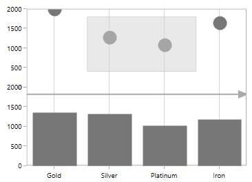

## Aligning the Annotation

You can align the annotation horizontally and vertically using `HorizontalAlignment` and `VerticalAlignment` properties as in the below code snippet.





<syncfusion:SfChart.Annotations>                    

<syncfusion:RectangleAnnotation  X1="0.6" 

HorizontalAlignment="Left"

VerticalAlignment="Top"

X2="2.2"                                                

Y2="1500"                                                

Y1="1800"                                                 

Stroke="DarkGray"

Fill="LightGray"

Opacity="0.5">            

</syncfusion:RectangleAnnotation>

</syncfusion:SfChart.Annotations>





SfChart chart = new SfChart();

RectangleAnnotation annotation = new RectangleAnnotation()
{

    X1 = 0.6, Y1 = 1500,

    X2 = 2.2, Y2 = 1800,

    HorizontalAlignment = HorizontalAlignment.Left,

    VerticalAlignment = VerticalAlignment.Top,

    Stroke = new SolidColorBrush(Colors.DarkGray),

    Fill = new SolidColorBrush(Colors.LightGray),

    Opacity = 0.5

};

chart.Annotations.Add(annotation);





In the following image you can see the rectangle annotation aligned to the top left of the chart area.

## Text Annotation

[`TextAnnotations`](https://help.syncfusion.com/cr/cref_files/wpf/Syncfusion.SfChart.WPF~Syncfusion.UI.Xaml.Charts.TextAnnotation.html#) are used to add simple text in specific points over the chart area.

### Rotate the Text Annotation

The [`Angle`](https://help.syncfusion.com/cr/cref_files/wpf/Syncfusion.SfChart.WPF~Syncfusion.UI.Xaml.Charts.TextAnnotation~Angle.html#) property is used to get or set the angle for rotating the Annotation. The following code example demonstrate the rotation feature for [`TextAnnotation`](https://help.syncfusion.com/cr/cref_files/wpf/Syncfusion.SfChart.WPF~Syncfusion.UI.Xaml.Charts.TextAnnotation.html#).





<syncfusion:SfChart.Annotations>

<syncfusion:TextAnnotation  CoordinateUnit="Axis"                                           

Text="Annotation"

HorizontalAlignment="Stretch"

VerticalAlignment="Stretch"

FontWeight="Bold"

Foreground="Black"

Angle="90"

X1="3.5" Y1="500" >

</syncfusion:TextAnnotation>

</syncfusion:SfChart.Annotations>





SfChart chart = new SfChart();

TextAnnotation annotation = new TextAnnotation()
{

    Text = "Annotation",

    CoordinateUnit = CoordinateUnit.Axis,

    HorizontalAlignment = HorizontalAlignment.Stretch,

    VerticalAlignment = VerticalAlignment.Stretch,

    FontWeight = FontWeights.Bold,

    Foreground = new SolidColorBrush(Colors.Black),

    Angle = 90,

    X1 = 3.5,Y1 = 500

};

chart.Annotations.Add(annotation);





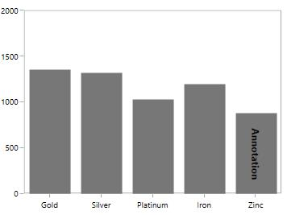

### Editing Text Annotation

SfChart provides you with an editing option for the text in any annotations. When text annotation is enabled editing, if we click the text annotation it switches to edit mode which provide easy way of customizing the text at run time.You can enable the editing mode in TextAnnotation using [`EnableEditing`](https://help.syncfusion.com/cr/cref_files/wpf/Syncfusion.SfChart.WPF~Syncfusion.UI.Xaml.Charts.Annotation~EnableEditing.html#) property.

The following code example and screenshot demonstrate [`TextAnnotation`](https://help.syncfusion.com/cr/cref_files/wpf/Syncfusion.SfChart.WPF~Syncfusion.UI.Xaml.Charts.TextAnnotation.html#) while editing the text.





<syncfusion:SfChart.Annotations>

<syncfusion:TextAnnotation  CoordinateUnit="Axis"                                           

Text="Annotation"

EnableEditing="True"

HorizontalAlignment="Stretch"

VerticalAlignment="Stretch"

FontWeight="Bold"

Foreground="Black"

Angle="90"

X1="3.5" Y1="500" >

</syncfusion:TextAnnotation>

</syncfusion:SfChart.Annotations>





SfChart chart = new SfChart();

TextAnnotation annotation = new TextAnnotation()
{

    EnableEditing = true,
    
    Text = "Annotation",

    CoordinateUnit = CoordinateUnit.Axis,

    HorizontalAlignment = HorizontalAlignment.Stretch,

    VerticalAlignment = VerticalAlignment.Stretch,

    FontWeight = FontWeights.Bold,

    Foreground = new SolidColorBrush(Colors.Black),

    Angle = 90,

    X1 = 3.5,Y1 = 500

};

chart.Annotations.Add(annotation);





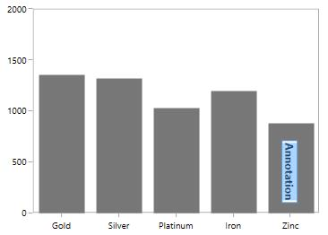

## Shape Annotation

[`ShapeAnnotation`](https://help.syncfusion.com/cr/cref_files/wpf/Syncfusion.SfChart.WPF~Syncfusion.UI.Xaml.Charts.ShapeAnnotation.html#) allows you to add annotations in the form of shapes such as rectangle, ellipse,horizontal line and vertical line  at the specific area of interest, in the chart area.

* [`EllipseAnnotation`](https://help.syncfusion.com/cr/cref_files/wpf/Syncfusion.SfChart.WPF~Syncfusion.UI.Xaml.Charts.EllipseAnnotation.html#)- Used to draw a circle or an ellipse over the chart area.
* [`RectangleAnnotation`](https://help.syncfusion.com/cr/cref_files/wpf/Syncfusion.SfChart.WPF~Syncfusion.UI.Xaml.Charts.RectangleAnnotation.html#)- Used to draw a rectangle over the chart area.
* [`VerticalLineAnnotation`](https://help.syncfusion.com/cr/cref_files/wpf/Syncfusion.SfChart.WPF~Syncfusion.UI.Xaml.Charts.VerticalLineAnnotation.html#)- Used to draw a vertical line across the chart area.
* [`HorizontalLineAnnotation`](https://help.syncfusion.com/cr/cref_files/wpf/Syncfusion.SfChart.WPF~Syncfusion.UI.Xaml.Charts.HorizontalLineAnnotation.html#) - Used to add a horizontal line across the chart area.

The following API’s are commonly used in all ShapeAnnotation:

* [`Fill`](https://help.syncfusion.com/cr/cref_files/wpf/Syncfusion.SfChart.WPF~Syncfusion.UI.Xaml.Charts.ShapeAnnotation~Fill.html#) - Represents the brush inside the Shape Annotation.

* [`X2`](https://help.syncfusion.com/cr/cref_files/wpf/Syncfusion.SfChart.WPF~Syncfusion.UI.Xaml.Charts.ShapeAnnotation~X2.html#)  - Represents the X2 Coordinate of the Shape Annotation.

* [`Y2`](https://help.syncfusion.com/cr/cref_files/wpf/Syncfusion.SfChart.WPF~Syncfusion.UI.Xaml.Charts.ShapeAnnotation~Y2.html#) - Represents the Y2 Coordinate of the Shape Annotation.

* [`CanDrag`](https://help.syncfusion.com/cr/cref_files/wpf/Syncfusion.SfChart.WPF~Syncfusion.UI.Xaml.Charts.ShapeAnnotation~CanDrag.html#) - A Boolean value that represent to drag the Annotation.

* [`CanResize`](https://help.syncfusion.com/cr/cref_files/wpf/Syncfusion.SfChart.WPF~Syncfusion.UI.Xaml.Charts.ShapeAnnotation~CanResize.html#)  - A Boolean value that represent to resize the Annotation.

### Customization options for LineAnnotation

**GrabExtent** 

`GrabExtent` property of [`LineAnnotation`](https://help.syncfusion.com/cr/cref_files/wpf/Syncfusion.SfChart.WPF~Syncfusion.UI.Xaml.Charts.LineAnnotation.html#) allows user to extent the hit visible area, while performing dragging and resizing. We need to set the desired pixel value for GrabExtent property and it can be set as shown in the below code example:





<syncfusion:SfChart.Annotations>
 
<syncfusion:LineAnnotation X1="0" X2="3" Y1="1500" Y2="1500"     
                               GrabExtent="10" 
                               Stroke="DarkGray" CanDrag="True"   
                               CanResize="True"/>
     
</syncfusion:SfChart.Annotations>





LineAnnotation annotation = new LineAnnotation()
            {
                X1 = 0,
                X2 = 3,
                Y1 = 1500,
                Y2 = 1500,
                CanDrag = true,
                Stroke = new SolidColorBrush(Colors.DarkGray),
                CanResize = true,
                GrabExtent = 10
            };
            
chart.Annotations.Add(annotation);





**Toggling** **LineAnnotation** **Visibility**

[`LineAnnotation`](https://help.syncfusion.com/cr/cref_files/wpf/Syncfusion.SfChart.WPF~Syncfusion.UI.Xaml.Charts.LineAnnotation.html#) by default will be visible. You can also collapse the visibility of the line annotation using [`ShowLine`](https://help.syncfusion.com/cr/cref_files/wpf/Syncfusion.SfChart.WPF~Syncfusion.UI.Xaml.Charts.LineAnnotation~ShowLine.html#) property.





<syncfusion:SfChart.Annotations>

<syncfusion:HorizontalLineAnnotation X1="-0.5" X2="3.5"

Stroke="DarkGray"

StrokeThickness="1"

ShowLine="False"

Fill="LightGray"                                                      

Y1="1500" >                    

</syncfusion:HorizontalLineAnnotation>

<syncfusion:VerticalLineAnnotation  Stroke="DarkGray" StrokeThickness="1"                                                   

X1="1.5" >

</syncfusion:VerticalLineAnnotation>

</syncfusion:SfChart.Annotations>





SfChart chart = new SfChart();

HorizontalLineAnnotation annotation = new HorizontalLineAnnotation()
{

    ShowLine = false ,

    StrokeThickness = 1,

    FontWeight = FontWeights.Bold,

    Stroke = new SolidColorBrush(Colors.DarkGray),

    Fill = new SolidColorBrush(Colors.LightGray),

    X1 = -0.5,Y1 = 1500,

    X2= 3.5

};

VerticalLineAnnotation annotation1 = new VerticalLineAnnotation()
{

    Stroke = new SolidColorBrush(Colors.DarkGray),

    StrokeThickness = 1,

    X1 = 1.5

};

chart.Annotations.Add(annotation);

chart.Annotations.Add(annotation1);





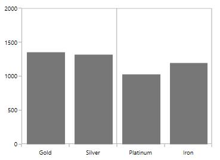

**Displaying** **Axis** **Labels** **for** **LineAnnotation**

[`VerticalLineAnnotation`](https://help.syncfusion.com/cr/cref_files/wpf/Syncfusion.SfChart.WPF~Syncfusion.UI.Xaml.Charts.VerticalLineAnnotation.html#) and [`HorizontalLineAnnotation`](https://help.syncfusion.com/cr/cref_files/wpf/Syncfusion.SfChart.WPF~Syncfusion.UI.Xaml.Charts.HorizontalLineAnnotation.html#) also displays the axis labels in which the line is placed. This feature can be enabled by setting [`ShowAxisLabel`](https://help.syncfusion.com/cr/cref_files/wpf/Syncfusion.SfChart.WPF~Syncfusion.UI.Xaml.Charts.StraightLineAnnotation~ShowAxisLabel.html#) property to true as in the below code snippet.





<syncfusion:SfChart.Annotations>

<syncfusion:HorizontalLineAnnotation X1="-0.5" X2="3.5"

Stroke="DarkGray"

StrokeThickness="1"

ShowAxisLabel="True"

Fill="LightGray"                                                      

Y1="1500" >                    

</syncfusion:HorizontalLineAnnotation>

<syncfusion:VerticalLineAnnotation  Stroke="DarkGray" 

StrokeThickness="1"                                                    

ShowAxisLabel="True"

X1="1.5" >

</syncfusion:VerticalLineAnnotation>

</syncfusion:SfChart.Annotations>





SfChart chart = new SfChart();

HorizontalLineAnnotation annotation = new HorizontalLineAnnotation()
{
    
    ShowLine = false ,

    StrokeThickness = 1,

    FontWeight = FontWeights.Bold,

    Stroke = new SolidColorBrush(Colors.DarkGray),

    Fill = new SolidColorBrush(Colors.LightGray),

    X1 = -0.5,Y1 = 1500,

    X2= 3.5,

    ShowAxisLabel = true 

};

VerticalLineAnnotation annotation1 = new VerticalLineAnnotation()
{

    Stroke = new SolidColorBrush(Colors.DarkGray),

    StrokeThickness = 1,

    X1 = 1.5,

    ShowAxisLabel = true 

};

chart.Annotations.Add(annotation);

chart.Annotations.Add(annotation1);





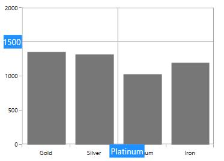

**AxisLabelTemplate**

You can also customize the default appearance of the axis label using [`AxisLabelTemplate`](https://help.syncfusion.com/cr/cref_files/wpf/Syncfusion.SfChart.WPF~Syncfusion.UI.Xaml.Charts.StraightLineAnnotation~AxisLabelTemplate.html#) property as in the below code snippet.





<syncfusion:SfChart x:Name="chart">

    <syncfusion:SfChart.Resources>

          <DataTemplate x:Key="labelTemplate">

                    <Border BorderBrush="DarkGray" 
                                    
                            BorderThickness="1" CornerRadius="5" 
                                    
                            Background="LightGray">

                        <TextBlock Foreground="Black" 
                                           
                                   FontSize="11"
                                           
                                   Text="{Binding}"/>

                    </Border>

         </DataTemplate>

    </syncfusion:SfChart.Resources>

  <syncfusion:SfChart.Annotations>

         <syncfusion:HorizontalLineAnnotation X1="-0.5" X2="3.5"
                                                     
                                              Y1="1500" 
                                                     
                                              Stroke="DarkGray"
                                                     
                                              StrokeThickness="1"  
                                                     
                                              ShowAxisLabel="True"                                                                                                     
                                                    
                                              AxisLabelTemplate="{StaticResource labelTemplate}">

        </syncfusion:HorizontalLineAnnotation>

  </syncfusion:SfChart.Annotations>

</syncfusion:SfChart>





SfChart chart = new SfChart();

HorizontalLineAnnotation annotation = new HorizontalLineAnnotation()
{

    StrokeThickness = 1,

    Stroke = new SolidColorBrush(Colors.DarkGray),

    X1 = -0.5,Y1 = 1500,

    X2= 3.5,

    ShowAxisLabel = true,

    AxisLabelTemplate = chart.Resources["labelTemplate"] as DataTemplate

};

chart.Annotations.Add(annotation);





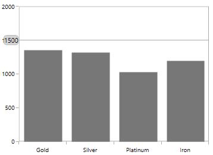

**Adding** **Arrow** **to** **LineAnnotation**

To display single headed arrow you can modify the line annotation by setting [`LineCap`](https://help.syncfusion.com/cr/cref_files/wpf/Syncfusion.SfChart.WPF~Syncfusion.UI.Xaml.Charts.LineAnnotation~LineCap.html#) property to Arrow. By default the [`LineCap`](https://help.syncfusion.com/cr/cref_files/wpf/Syncfusion.SfChart.WPF~Syncfusion.UI.Xaml.Charts.LineAnnotation~LineCap.html#) property value in none.

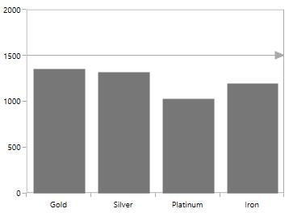

### Adding Text in ShapeAnnotation

For all the annotations like Text, Shape, Image and Line, you can display the text for the annotation using Text property as in the below code snippet.





<syncfusion:SfChart.Annotations>

<syncfusion:EllipseAnnotation  X1="2.5" Y1="1500" 

Fill="LightBlue" Text="Annotation"                                               

X2="3.6" Y2="1680" >

</syncfusion:EllipseAnnotation>

</syncfusion:SfChart.Annotations>





SfChart chart = new SfChart();

EllipseAnnotation annotation = new EllipseAnnotation()
{

    StrokeThickness = 1,

    Stroke = new SolidColorBrush(Colors.DarkGray),

    X1 = 2.5,Y1 = 1500,

    X2= 3.6, Y2 = 1680,

    Text = "Annotation",

    Fill =new SolidColorBrush(Colors.LightBlue)

};

chart.Annotations.Add(annotation);





### Aligning Text in ShapeAnnotation

The text alignment can be changed using [`HorizontalTextAlignment`](https://help.syncfusion.com/cr/cref_files/wpf/Syncfusion.SfChart.WPF~Syncfusion.UI.Xaml.Charts.ShapeAnnotation~HorizontalTextAlignment.html#) and [`VerticalTextAlignment`](https://help.syncfusion.com/cr/cref_files/wpf/Syncfusion.SfChart.WPF~Syncfusion.UI.Xaml.Charts.ShapeAnnotation~VerticalTextAlignment.html#) properties. 

**EllipseAnnotation**





<syncfusion:SfChart.Annotations>

<syncfusion:EllipseAnnotation  X1="2.5" Y1="1500" 

HorizontalTextAlignment="Center"

VerticalTextAlignment="Center"

Fill="LightBlue" Text="Annotation"                                               

X2="3.6" Y2="1680" >

</syncfusion:EllipseAnnotation>

</syncfusion:SfChart.Annotations>





SfChart chart = new SfChart();

EllipseAnnotation annotation = new EllipseAnnotation()
{

    StrokeThickness = 1,

    Stroke = new SolidColorBrush(Colors.DarkGray),

    X1 = 2.5,Y1 = 1500,

    X2= 3.6, Y2 = 1680,

    Text = "Annotation",

    Fill = new SolidColorBrush(Colors.LightBlue),

    HorizontalTextAlignment = HorizontalAlignment.Center,

    VerticalTextAlignment = VerticalAlignment.Center

};

chart.Annotations.Add(annotation);





**Line** **Annotation**





<syncfusion:SfChart.Annotations>

<syncfusion:HorizontalLineAnnotation Text="Line Annotation" 

X1="2" X2="3.5"

Stroke="Black"

StrokeThickness="1"

HorizontalTextAlignment="Center" 

VerticalTextAlignment="Bottom"

Y1="1500" >                    

</syncfusion:HorizontalLineAnnotation>

</syncfusion:SfChart.Annotations>





SfChart chart = new SfChart();

HorizontalLineAnnotation annotation = new HorizontalLineAnnotation()
{

    StrokeThickness = 1,

    Stroke = new SolidColorBrush(Colors.Black),

    X1 = 2,Y1 = 1500,

    X2= 3.5,

    Text = "Line Annotation",

    HorizontalTextAlignment = HorizontalAlignment.Center,

    VerticalTextAlignment = VerticalAlignment.Bottom

};

chart.Annotations.Add(annotation);





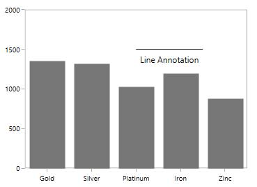

**Image** **Annotation**





<syncfusion:SfChart.Annotations>

<syncfusion:ImageAnnotation  Text="Annotation" 

HorizontalTextAlignment="Center"

VerticalTextAlignment="Top"

ImageSource="Images\Graduate.png"

X1="2.5" Y1="1200" X2="3.6" Y2="1700" >                    

</syncfusion:ImageAnnotation>            

</syncfusion:SfChart.Annotations>





SfChart chart = new SfChart();

ImageAnnotation annotation = new ImageAnnotation()
{

    Text = "Annotation",

    HorizontalTextAlignment = HorizontalAlignment.Center,

    VerticalTextAlignment = VerticalAlignment.Top,

    X1 = 2.5, Y1 = 1200, X2 = 3.6, Y2 = "1700",

    ImageSource = new BitmapImage(new Uri(@"demands.png", UriKind.RelativeOrAbsolute))

};

chart.Annotations.Add(annotation);





N> [`HorizontalTextAlignment`](https://help.syncfusion.com/cr/cref_files/wpf/Syncfusion.SfChart.WPF~Syncfusion.UI.Xaml.Charts.ShapeAnnotation~HorizontalTextAlignment.html#) and [`VerticalTextAlignment`](https://help.syncfusion.com/cr/cref_files/wpf/Syncfusion.SfChart.WPF~Syncfusion.UI.Xaml.Charts.ShapeAnnotation~VerticalTextAlignment.html#) properties are not applicable for [`TextAnnotation`](https://help.syncfusion.com/cr/cref_files/wpf/Syncfusion.SfChart.WPF~Syncfusion.UI.Xaml.Charts.TextAnnotation.html#).

### Customization of ShapeAnnotation

SfChart allows customization of shape annotation using the following properties.

* [`Stroke`](https://help.syncfusion.com/cr/cref_files/wpf/Syncfusion.SfChart.WPF~Syncfusion.UI.Xaml.Charts.ShapeAnnotation~Stroke.html#) - Represents the brush for the annotation outline.
* [`StrokeThickness`](https://help.syncfusion.com/cr/cref_files/wpf/Syncfusion.SfChart.WPF~Syncfusion.UI.Xaml.Charts.ShapeAnnotation~StrokeThickness.html#)- Represents the thickness of the annotation outline.
* [`StrokeDashArray`](https://help.syncfusion.com/cr/cref_files/wpf/Syncfusion.SfChart.WPF~Syncfusion.UI.Xaml.Charts.ShapeAnnotation~StrokeDashArray.html# )- Represents the DashArray of the annotation stroke.
* [`StrokeDashCap`](https://help.syncfusion.com/cr/cref_files/wpf/Syncfusion.SfChart.WPF~Syncfusion.UI.Xaml.Charts.ShapeAnnotation~StrokeDashCap.html#)- Represents the DashCap of the annotation stroke.
* [`StrokeDashOffset`](https://help.syncfusion.com/cr/cref_files/wpf/Syncfusion.SfChart.WPF~Syncfusion.UI.Xaml.Charts.ShapeAnnotation~StrokeDashOffset.html#)- Represents the DashOffset of the annotation stroke.
* [`StrokeEndLineCap`](https://help.syncfusion.com/cr/cref_files/wpf/Syncfusion.SfChart.WPF~Syncfusion.UI.Xaml.Charts.ShapeAnnotation~StrokeEndLineCap.html#)- Represents the end line cap of the annotation stroke.
* [`StrokeLineJoin`](https://help.syncfusion.com/cr/cref_files/wpf/Syncfusion.SfChart.WPF~Syncfusion.UI.Xaml.Charts.ShapeAnnotation~StrokeLineJoin.html#) - Represents the line join of the annotation outline.
* [`StrokeMiterLimit`](https://help.syncfusion.com/cr/cref_files/wpf/Syncfusion.SfChart.WPF~Syncfusion.UI.Xaml.Charts.ShapeAnnotation~StrokeMiterLimit.html#) - Represents the limit on the ratio of the miter length to half of the annotation shape.





<syncfusion:SfChart.Annotations>

<syncfusion:HorizontalLineAnnotation X1="-0.5" X2="3.5"

Stroke="DarkGray"

StrokeThickness="3"

HorizontalTextAlignment="Center" 

VerticalTextAlignment="Bottom"

Fill="LightGray" 

StrokeDashArray="1,1"                                                                                       

StrokeStartLineCap="Square"

StrokeEndLineCap="Square"

StrokeDashCap="Round"

StrokeDashOffset="1.5"

Y1="1500" >                    

</syncfusion:HorizontalLineAnnotation>

</syncfusion:SfChart.Annotations>





SfChart chart = new SfChart();

HorizontalLineAnnotation annotation = new HorizontalLineAnnotation()
{

    X1 = -0.5, X2 = 3.5,Y1 = 150,

    StrokeThickness = 3,

    Stroke = new SolidColorBrush(Colors.DarkGray),

    Text = "Annotation",

    Fill =new SolidColorBrush(Colors.LightGray),

    HorizontalTextAlignment = HorizontalAlignment.Center,

    VerticalTextAlignment = VerticalAlignment.Bottom,

    StrokeDashArray = new DoubleCollection() { 1,1},

    StrokeStartLineCap = PenLineCap.Square,

    StrokeEndLineCap = PenLineCap.Square,

    StrokeDashOffset = 1.5,

    StrokeDashCap = PenLineCap.Round

};

chart.Annotations.Add(annotation);





## Image Annotation

SfChart provides support to add images as Annotation over the chart area, using the class [ImageAnnotation](https://help.syncfusion.com/cr/cref_files/wpf/Syncfusion.SfChart.WPF~Syncfusion.UI.Xaml.Charts.ImageAnnotation.html#). 

The following API’s are used in ImageAnnotation

* [`Angle`](https://help.syncfusion.com/cr/cref_files/wpf/Syncfusion.SfChart.WPF~Syncfusion.UI.Xaml.Charts.SolidShapeAnnotation~Angle.html#)  – An integer value that represents the rotation angle for the text in Annotation.
* [`ImageSource`](https://help.syncfusion.com/cr/cref_files/wpf/Syncfusion.SfChart.WPF~Syncfusion.UI.Xaml.Charts.ImageAnnotation~ImageSource.html#)  - Represents the source from where the image must be added.
* [`X2`](https://help.syncfusion.com/cr/cref_files/wpf/Syncfusion.SfChart.WPF~Syncfusion.UI.Xaml.Charts.ImageAnnotation~X2.html#)- Represents the X2 Coordinate of the Annotation.****
* [`Y2`](https://help.syncfusion.com/cr/cref_files/wpf/Syncfusion.SfChart.WPF~Syncfusion.UI.Xaml.Charts.ImageAnnotation~Y2.html#)- Represents the Y2 Coordinate of the Annotation.****





<syncfusion:SfChart.Annotations>

<syncfusion:ImageAnnotation  CoordinateUnit="Axis"     

ImageSource="apple.png"

X1="3" Y1="1200" X2="4" Y2="1450" />

<syncfusion:ImageAnnotation  CoordinateUnit="Axis" ImageSource="Fruit-Banana-01.png"                                            

X1="2" Y1="1000" X2="3" Y2="1400"/>

<syncfusion:ImageAnnotation  CoordinateUnit="Axis" ImageSource="Fruit-Grapes.png"

HorizontalAlignment="Center"

VerticalAlignment="Center"

X1="1" Y1="1350" X2="2" Y2="1750" />

<syncfusion:ImageAnnotation  CoordinateUnit="Axis" ImageSource="Fruit-Strawberry.png"

HorizontalAlignment="Center"

VerticalAlignment="Center"

X1="0" Y1="1350" X2="1" Y2="1600" >

</syncfusion:ImageAnnotation>

</syncfusion:SfChart.Annotations>





SfChart chart = new SfChart();

ImageAnnotation annotation1 = new ImageAnnotation()
{

    CoordinateUnit = CoordinateUnit.Axis,

    ImageSource = new BitmapImage(new Uri("@apple.png",UriKind.RelativeOrAbsolute)),

    X1 = 3, Y1 = 1200, X2 = 4, Y2 = 1450

};

ImageAnnotation annotation2 = new ImageAnnotation()
{

    CoordinateUnit = CoordinateUnit.Axis,

    ImageSource = new BitmapImage(new Uri("@Fruit-Banana-01.png", UriKind.RelativeOrAbsolute)),

    X1 = 2, Y1 = 1000, X2 = 3, Y2 = 1400

};

ImageAnnotation annotation3 = new ImageAnnotation()
{

    CoordinateUnit = CoordinateUnit.Axis,

    ImageSource = new BitmapImage(new Uri("@Fruit-Grapes.png", UriKind.RelativeOrAbsolute)),

    X1 = 1, Y1 = 1350, X2 = 2, Y2 = 1750,

    HorizontalAlignment = HorizontalAlignment.Center,

    VerticalAlignment = VerticalAlignment.Center

};

ImageAnnotation annotation4 = new ImageAnnotation()
{

    CoordinateUnit = CoordinateUnit.Axis,

    ImageSource = new BitmapImage(new Uri("@Fruit-Strawberry.png")),

    X1 = 0, Y1 = 1350, X2 = 1, Y2 = 1600,

    HorizontalAlignment = HorizontalAlignment.Center,

    VerticalAlignment = VerticalAlignment.Center

};

chart.Annotations.Add(annotation1);

chart.Annotations.Add(annotation2);

chart.Annotations.Add(annotation3);

chart.Annotations.Add(annotation4);





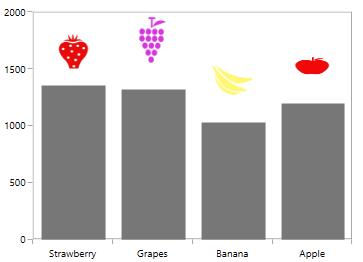

**Rotating** **the** **image** **in** **ImageAnnotation**





<syncfusion:SfChart.Annotations>

<syncfusion:ImageAnnotation  Angle="-90" CoordinateUnit="Axis" ImageSource="apple.png"

HorizontalAlignment="Center"

VerticalAlignment="Top"

X1="3" Y1="1300" X2="3.5" Y2="1450" />

<syncfusion:ImageAnnotation  Angle="-90" CoordinateUnit="Axis" ImageSource="Fruit-Banana-01.png"                                            

HorizontalAlignment="Center"

VerticalAlignment="Center"

X1="2" Y1="1000" X2="2.5" Y2="1400"/>

<syncfusion:ImageAnnotation   Angle="-90" CoordinateUnit="Axis" ImageSource="Fruit-Grapes.png"

HorizontalAlignment="Center"

VerticalAlignment="Center"

X1="1" Y1="1350" X2="1.5" Y2="1750" />

<syncfusion:ImageAnnotation   Angle="-90" CoordinateUnit="Axis" ImageSource="Fruit-Strawberry.png"

HorizontalAlignment="Center"

VerticalAlignment="Center"

X1="0" Y1="1350" X2="0.5" Y2="1650" >

</syncfusion:ImageAnnotation>

</syncfusion:SfChart.Annotations>





SfChart chart = new SfChart();

ImageAnnotation annotation1 = new ImageAnnotation()
{

    CoordinateUnit = CoordinateUnit.Axis,

    ImageSource = new BitmapImage(new Uri("@apple.png",UriKind.RelativeOrAbsolute)),

    X1 = 3, Y1 = 1200, X2 = 4, Y2 = 1450,

    Angle = -90
    
};

ImageAnnotation annotation2 = new ImageAnnotation()
{

    CoordinateUnit = CoordinateUnit.Axis,

    ImageSource = new BitmapImage(new Uri("@Fruit-Banana-01.png", UriKind.RelativeOrAbsolute)),

    X1 = 2, Y1 = 1000, X2 = 3, Y2 = 1400,

    Angle = -90

};

ImageAnnotation annotation3 = new ImageAnnotation()
{

    CoordinateUnit = CoordinateUnit.Axis,

    ImageSource = new BitmapImage(new Uri("@Fruit-Grapes.png", UriKind.RelativeOrAbsolute)),

    X1 = 1, Y1 = 1350, X2 = 2, Y2 = 1750,

    HorizontalAlignment = HorizontalAlignment.Center,

    VerticalAlignment = VerticalAlignment.Center,

    Angle = -90

};

ImageAnnotation annotation4 = new ImageAnnotation()
{

    CoordinateUnit = CoordinateUnit.Axis,

    ImageSource = new BitmapImage(new Uri("@Fruit-Strawberry.png")),

    X1 = 0, Y1 = 1350, X2 = 1, Y2 = 1600,

    HorizontalAlignment = HorizontalAlignment.Center,

    VerticalAlignment = VerticalAlignment.Center,

    Angle = -90

};

chart.Annotations.Add(annotation1);

chart.Annotations.Add(annotation2);

chart.Annotations.Add(annotation3);

chart.Annotations.Add(annotation4);





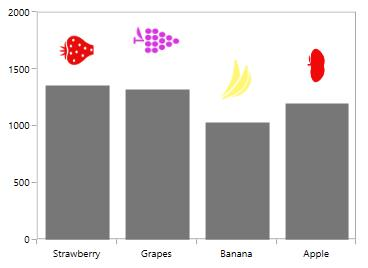

## Interactivity

### ToolTip

SfChart provides support to view the tooltip when mouse hovered on the annotation. To view to tooltip you have to enable the [`ShowToolTip`](https://help.syncfusion.com/cr/cref_files/wpf/Syncfusion.SfChart.WPF~Syncfusion.UI.Xaml.Charts.Annotation~ShowToolTip.html#) property. By default for tooltip there is no content, you have to set the content for the tooltip in [`ToolTipContent`](https://help.syncfusion.com/cr/cref_files/wpf/Syncfusion.SfChart.WPF~Syncfusion.UI.Xaml.Charts.Annotation~ToolTipContent.html#) property.

The following code example demonstrates the default tooltip.





<chart:SfChart.Annotations>

<syncfusion:EllipseAnnotation  X1="2.5" Y1="1500" 

Stroke="DarkGray" ToolTipContent="Annotation"                                                

Fill="LightGray" ShowToolTip="True"                                               

X2="3.6" Y2="1680">

</syncfusion:EllipseAnnotation>

</syncfusion:SfChart.Annotations>





SfChart chart = new SfChart();

EllipseAnnotation annotation=new EllipseAnnotation ()
{

    X1 = 2.5, Y1 = 1500, X2 = 3.6, Y2 = 1680,

    Stroke = new SolidColorBrush(Colors.DarkGray),

    Fill = new SolidColorBrush (Colors.LightGray),

    ShowToolTip = true ,

    ToolTipContent = "Annotation"

};

chart.Annotations.Add(annotation);





**Position** **the** **Tooltip**

Tooltip can be placed top, bottom, left or right side of the cursor using [`ToolTipPlacement`](https://help.syncfusion.com/cr/cref_files/wpf/Syncfusion.SfChart.WPF~Syncfusion.UI.Xaml.Charts.Annotation~ToolTipPlacement.html#) property. The tooltip by default will be placed in Right. The following code example demonstrates the tooltip placed at the bottom.





<syncfusion:SfChart.Annotations>

<syncfusion:EllipseAnnotation  X1="2.5" Y1="1500" 

Stroke="DarkGray" ToolTipContent="Annotation"  

ToolTipPlacement="Bottom"

Fill="LightGray" ShowToolTip="True"                                               

X2="3.6" Y2="1680" >

</syncfusion:EllipseAnnotation>

</syncfusion:SfChart.Annotations>





SfChart chart = new SfChart();

EllipseAnnotation annotation=new EllipseAnnotation ()
{

    X1 = 2.5, Y1 = 1500, X2 = 3.6, Y2 = 1680,

    Stroke = new SolidColorBrush(Colors.DarkGray),

    Fill = new SolidColorBrush (Colors.LightGray),

    ShowToolTip = true ,

    ToolTipContent = "Annotation",

    ToolTipPlacement = ToolTipLabelPlacement.Bottom

};

chart.Annotations.Add(annotation);





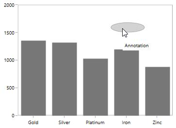

**ToolTipTemplate**

The default appearance of the Tooltip can be changed using [`TooltipTemplate`](https://help.syncfusion.com/cr/cref_files/wpf/Syncfusion.SfChart.WPF~Syncfusion.UI.Xaml.Charts.Annotation~ToolTipTemplate.html#) property as in the below code snippet.





 <syncfusion:SfChart x:Name="chart">

     <syncfusion:SfChart.Resources>

                <DataTemplate x:Key="tooltipTemplate">

                    <Border CornerRadius="5" BorderBrush="DarkGray" 
                            
                            BorderThickness="1">

                        <TextBlock FontSize="11" Text="Annotation" 
                                   
                                   Foreground="Black"/>

                    </Border>

                </DataTemplate>

     </syncfusion:SfChart.Resources>

     <syncfusion:SfChart.Annotations>

          <syncfusion:EllipseAnnotation  X1="2.5" Y1="1500" 
                                               
                                         Stroke="DarkGray"                                                
                                               
                                         Fill="LightGray" ShowToolTip="True"                                                                                            
                                               
                                         X2="3.6" Y2="1680"
                                         
                                         ToolTipTemplate="{StaticResource tooltipTemplate}">

          </syncfusion:EllipseAnnotation>

    </syncfusion:SfChart.Annotations>

</syncfusion:SfChart>





SfChart chart = new SfChart();

EllipseAnnotation annotation=new EllipseAnnotation ()
{

    X1 = 2.5, Y1 = 1500, X2 = 3.6, Y2 = 1680,

    Stroke = new SolidColorBrush(Colors.DarkGray),

    Fill = new SolidColorBrush (Colors.LightGray),

    ShowToolTip = true ,

    ToolTipTemplate = chart.Resources["tooltipTemplate"] as DataTemplate

};

chart.Annotations.Add(annotation);





### Drag and Resize the Annotation

SfChart provides dragging and resizing support for [`ShapeAnnotations`](https://help.syncfusion.com/cr/cref_files/wpf/Syncfusion.SfChart.WPF~Syncfusion.UI.Xaml.Charts.ShapeAnnotation.html#).

The following API’s are used for dragging and resizing the annotation

* [`CanDrag`](https://help.syncfusion.com/cr/cref_files/wpf/Syncfusion.SfChart.WPF~Syncfusion.UI.Xaml.Charts.ShapeAnnotation~CanDrag.html#)- A Boolean value that allows the annotation to drag. 
* [`CanResize`](https://help.syncfusion.com/cr/cref_files/wpf/Syncfusion.SfChart.WPF~Syncfusion.UI.Xaml.Charts.ShapeAnnotation~CanResize.html#)- A Boolean value that allows the annotation to resize. 
* [`DraggingMode`](https://help.syncfusion.com/cr/cref_files/wpf/Syncfusion.SfChart.WPF~Syncfusion.UI.Xaml.Charts.ShapeAnnotation~DraggingMode.html#)- Represents the dragging direction such as [`Horizontal`](https://help.syncfusion.com/cr/cref_files/wpf/Syncfusion.SfChart.WPF~Syncfusion.UI.Xaml.Charts.AxisMode.html), [`Vertical`](https://help.syncfusion.com/cr/cref_files/wpf/Syncfusion.SfChart.WPF~Syncfusion.UI.Xaml.Charts.AxisMode.html), or [`All`](https://help.syncfusion.com/cr/cref_files/wpf/Syncfusion.SfChart.WPF~Syncfusion.UI.Xaml.Charts.AxisMode.html) for annotations. 
* [`ResizingMode`](https://help.syncfusion.com/cr/cref_files/wpf/Syncfusion.SfChart.WPF~Syncfusion.UI.Xaml.Charts.SolidShapeAnnotation~ResizingMode.html#)- Represents the resizing direction for the annotation. 

**Dragging** **the** **Annotation**

The following code example demonstrates the dragging the rectangle annotation.





<syncfusion:SfChart.Annotations>                    

<syncfusion:RectangleAnnotation  X1="0.6" CanDrag="True"                                                  

X2="2.2" Y2="1500" 

Y1="1800" 

Stroke="DarkGray"

Fill="LightGray"

Opacity="0.5">            

</syncfusion:RectangleAnnotation>

</syncfusion:SfChart.Annotations>





SfChart chart = new SfChart();

RectangleAnnotation annotation=new RectangleAnnotation()
{

    X1 = 0.6, Y1 = 1500, X2 = 2.2, Y2 = 1800,

    Stroke = new SolidColorBrush(Colors.DarkGray),

    Fill = new SolidColorBrush (Colors.LightGray),

    CanDrag = true,

    Opacity = 0.5

};

chart.Annotations.Add(annotation);





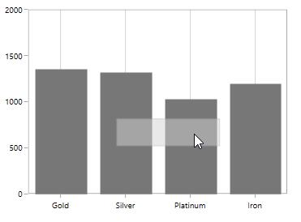

You can set the [`DraggingMode`](https://help.syncfusion.com/cr/cref_files/wpf/Syncfusion.SfChart.WPF~Syncfusion.UI.Xaml.Charts.ShapeAnnotation~DraggingMode.html#) as Horizontal which will limit the annotation to be dragged only by horizontally as in the below code snippet.





<syncfusion:SfChart.Annotations>                    

<syncfusion:RectangleAnnotation  X1="0.6" CanDrag="True"                                                  

X2="2.2" Y2="1500" 

Y1="1800" 

DraggingMode="Horizontal"

Stroke="DarkGray"

Fill="LightGray"

Opacity="0.5">            

</syncfusion:RectangleAnnotation>

</syncfusion:SfChart.Annotations>





SfChart chart = new SfChart();

RectangleAnnotation annotation=new RectangleAnnotation()
{

    X1 = 0.6, Y1 = 1500, X2 = 2.2, Y2 = 1800,

    Stroke = new SolidColorBrush(Colors.DarkGray),

    Fill = new SolidColorBrush (Colors.LightGray),

    CanDrag = true,

    Opacity = 0.5,

    DraggingMode = AxisMode.Horizontal

};

chart.Annotations.Add(annotation);





**Resizing** **the** **Annotation**

You can resize the annotation by enabling [`CanResize`](https://help.syncfusion.com/cr/cref_files/wpf/Syncfusion.SfChart.WPF~Syncfusion.UI.Xaml.Charts.ShapeAnnotation~CanResize.html#) property to True as in the below code snippet.





<syncfusion:SfChart.Annotations>                    

<syncfusion:RectangleAnnotation  X1="0.6" 

CanResize="True"

X2="2.2" 

Y2="1500" 

Y1="1800"                                                 

Stroke="DarkGray"

Fill="LightGray"

Opacity="0.5">            

</syncfusion:RectangleAnnotation>

</syncfusion:SfChart.Annotations>





SfChart chart = new SfChart();

RectangleAnnotation annotation = new RectangleAnnotation()
{

    X1 = 0.6, Y1 = 1500, X2 = 2.2, Y2 = 1800,

    Stroke = new SolidColorBrush(Colors.DarkGray),

    Fill = new SolidColorBrush (Colors.LightGray),

    CanResize = true,

    Opacity = 0.5,

};

chart.Annotations.Add(annotation);





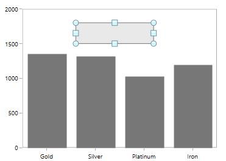

[`ResizingMode`](https://help.syncfusion.com/cr/cref_files/wpf/Syncfusion.SfChart.WPF~Syncfusion.UI.Xaml.Charts.SolidShapeAnnotation~ResizingMode.html#) allows you to limit the resizing to a particular direction may be horizontal, vertical or both direction. The following code example demonstrates the resizing of annotation along vertical direction.





<syncfusion:SfChart.Annotations>                    

<syncfusion:RectangleAnnotation  X1="0.6" 

CanResize="True"

X2="2.2" 

Y2="1500" 

ResizingMode="Vertical"

Y1="1800"                                                 

Stroke="DarkGray"

Fill="LightGray"

Opacity="0.5">            

</syncfusion:RectangleAnnotation>

</syncfusion:SfChart.Annotations>





SfChart chart = new SfChart();

RectangleAnnotation annotation = new RectangleAnnotation()
{

    X1 = 0.6, Y1 = 1500, X2 = 2.2, Y2 = 1800,

    Stroke = new SolidColorBrush(Colors.DarkGray),

    Fill = new SolidColorBrush (Colors.LightGray),

    CanResize = true,

    Opacity = 0.5,

    ResizingMode = AxisMode.Vertical

};

chart.Annotations.Add(annotation);





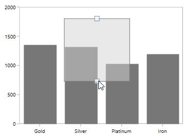

## Annotation Clipping

SfChart allows you to clip the annotation if the annotation crosses the boundary by setting [`EnableClipping`](https://help.syncfusion.com/cr/cref_files/wpf/Syncfusion.SfChart.WPF~Syncfusion.UI.Xaml.Charts.Annotation~EnableClipping.html#) property to True as in the below code snippet.





<syncfusion:SfChart.Annotations>

<syncfusion:ImageAnnotation  HorizontalTextAlignment="Center"

VerticalTextAlignment="Top"

EnableClipping="True"

ImageSource="Images\Graduate.png"

X1="4" Y1="1200" X2="7" Y2="1700" >                    

</syncfusion:ImageAnnotation>            

</syncfusion:SfChart.Annotations>





SfChart chart = new SfChart();

ImageAnnotation annotation=new ImageAnnotation()
{
        
    X1 = 4, Y1 = 1200, X2 = 7, Y2 = 1700,

    HorizontalAlignment = HorizontalAlignment.Center,

    VerticalAlignment = VerticalAlignment.Top,

    EnableClipping = true,

    ImageSource = new BitmapImage(new Uri("@Image/Graduate.png",UriKind.RelativeOrAbsolute))

};

chart.Annotations.Add(annotation);





The following screenshot explains that even when x value is provided out of bounds the image annotation is placed inside the chart area.

## Customizing Text in Annotation

The text in annotation can be customized using the following API’s

* [`FontSize`](https://help.syncfusion.com/cr/cref_files/wpf/Syncfusion.SfChart.WPF~Syncfusion.UI.Xaml.Charts.Annotation~FontSize.html#)– An int value that represents the font size of the annotation text.
* [`FontFamily`](https://help.syncfusion.com/cr/cref_files/wpf/Syncfusion.SfChart.WPF~Syncfusion.UI.Xaml.Charts.Annotation~FontFamily.html#)– Represents the font family of the annotation text.
* [`FontStyle`](https://help.syncfusion.com/cr/cref_files/wpf/Syncfusion.SfChart.WPF~Syncfusion.UI.Xaml.Charts.Annotation~FontStyle.html#)– Represents the font style of the annotation text.
* [`FontWeight`](https://help.syncfusion.com/cr/cref_files/wpf/Syncfusion.SfChart.WPF~Syncfusion.UI.Xaml.Charts.Annotation~FontWeight.html#)- Represents the font weight of the annotation text.
* [`Foreground`](https://help.syncfusion.com/cr/cref_files/wpf/Syncfusion.SfChart.WPF~Syncfusion.UI.Xaml.Charts.Annotation~Foreground.html#)– Represents the brush value of the annotation text color. 

The following code example demonstrates the customization of annotation text.





<syncfusion:SfChart.Annotations>

<syncfusion:EllipseAnnotation  X1="2.5" Y1="1500" 

Stroke="DarkGray"   

Text="Annotation"

FontSize="12" Foreground="DarkGray"

FontStyle="Italic" FontWeight="Bold"

Fill="LightGray" ShowToolTip="True"                                                                                            

X2="3.6" Y2="1680">                    

</syncfusion:EllipseAnnotation>

</syncfusion:SfChart.Annotations>





SfChart chart = new SfChart();

EllipseAnnotation annotation = new EllipseAnnotation()
{

    X1 = 2.5, Y1 = 1500, X2 = 3.6, Y2 = 1680,

    Stroke = new SolidColorBrush(Colors.DarkGray),

    Fill = new SolidColorBrush (Colors.LightGray),

    Foreground = new SolidColorBrush(Colors.LightGray),

    ShowToolTip = true,

    Text ="Annotation",

    FontSize = 12,

    FontWeight = FontWeights.Bold,

    FontStyle = FontStyles.Italic

};

chart.Annotations.Add(annotation);





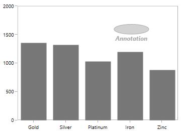

Text can also be customized by setting [`ContentTemplate`](https://help.syncfusion.com/cr/cref_files/wpf/Syncfusion.SfChart.WPF~Syncfusion.UI.Xaml.Charts.Annotation~ContentTemplate.html#) property as in the below code snippet.





<syncfusion:SfChart x:Name="chart">

    <syncfusion:SfChart.Resources>

         <DataTemplate x:Key="contentTemplate">

                    <Border Height="20" Width="80" BorderBrush="Black"
                            
                            CornerRadius="2" Background="LightGray" >

                        <TextBlock HorizontalAlignment="Center" VerticalAlignment="Center" 
                                   
                                   FontFamily="Calibri (Body)" FontSize="12" 
                                   
                                   FontWeight="SemiBold" Foreground="Black" 
                                   
                                   Text="Gold Demand" FontStyle="Italic"/>

                    </Border>

          </DataTemplate>

    </syncfusion:SfChart.Resources>

    <syncfusion:SfChart.Annotations>

                <syncfusion:TextAnnotation  CoordinateUnit="Pixel"                                           
                                            
                                            X1="266" Y1="4"
                                            
                                            ContentTemplate="{StaticResource contentTemplate}"/>

    </syncfusion:SfChart.Annotations>

</syncfusion:SfChart>





SfChart chart = new SfChart();

TextAnnotation annotation = new TextAnnotation()
{

    X1 = 266, Y1 = 4,

    CoordinateUnit = CoordinateUnit.Axis,

    ContentTemplate = chart.Resources["contentTemplate"] as DataTemplate

};

chart.Annotations.Add(annotation);





## Annotation based on axis

The value of X1, X2, Y1, and Y2 properties of annotation will differ based on the axis type. The following table illustrates how to set the values for X1 and X2 properties of annotation based on the corresponding primary axis.

<table>

<tr>
<th>
SI.No
</th>
<th>
Axis Type
</th>
<th>
X1 and X2 values
</th>
<th>
Example
</th>
</tr>
<tr>
<td>
1
</td>
<td>
CategoryAxis
</td>
<td>
Index based
</td>
<td>
X1 = 2, X2 = 3 (start point = 2nd index’s value and end point 3rd index value) 
</td>
</tr>

</tr>
<tr>
<td>
2
</td>
<td>
DateTimeCategoryAxis 
</td>
<td>
Index based 
</td>
<td>
X1 = 2, X2 = 3 (start point = 2nd index’s value and end point 3rd index value) 
</td>
</tr>

</tr>
<tr>
<td>
3
</td>
<td>
DateTimeAxis 
</td>
<td>
Value based 
</td>
<td>
X1 = “2015/01/31”, X2 = “2015/02/01” 
</td>
</tr>

</tr>
<tr>
<td>
4
</td>
<td>
TimeSpanAxis
</td>
<td>
Value based 
</td>
<td>
X1= 00:00:40 X2=00:00:50  
</td>
</tr>

</tr>
<tr>
<td>
5
</td>
<td>
Logarithmic Axis 
</td>
<td>
Value based 
</td>
<td>
X1= 50(XValue) X2=50(XValue) 
</td>
</tr>

</tr>
<tr>
<td>
6
</td>
<td>
Numerical Axis 
</td>
<td>
Value based 
</td>
<td>
X1= 10(XValue) X2=15(XValue)
</td>
</tr>

</table>

**CategoryAxis**

The index of the data point will be given as values for X1 and X2 properties.





   <chart:SfChart.Annotations>
       <chart:RectangleAnnotation X1="1" X2="3" Y1="20" Y2="30" 
                                                          Stroke="Purple" StrokeThickness="2"/>
   </chart:SfChart.Annotations>

   <chart:SfChart.PrimaryAxis>
       <chart:CategoryAxis  />
   </chart:SfChart.PrimaryAxis>

    <chart:SfChart.SecondaryAxis>
        <chart:NumericalAxis />
    </chart:SfChart.SecondaryAxis>





            SfChart chart = new SfChart();

            chart.PrimaryAxis = new CategoryAxis();

            chart.SecondaryAxis = new NumericalAxis();

            RectangleAnnotation annotation = new RectangleAnnotation()
            {
                X1 = 1, Y1 = 3, X2 = 20, Y2 = 30,

                Stroke = new SolidColorBrush(Colors.Purple),

                StrokeThickness = 2
            };

            chart.Annotations.Add(annotation);





**DateTimeAxis**

The corresponding DateTime value will be given as values for X1 and X2 properties.





   <chart:SfChart.PrimaryAxis>
      <chart:DateTimeAxis  />
   </chart:SfChart.PrimaryAxis>

   <chart:SfChart.SecondaryAxis>
      <chart:NumericalAxis />
   </chart:SfChart.SecondaryAxis>

   <chart:SfChart.Annotations>
      <chart:RectangleAnnotation X1="2015/2/1" X2="2015/4/1" Y1="20" Y2="30" 
                                  						 Stroke="Purple" StrokeThickness="2"/>
   </chart:SfChart.Annotations>





 			SfChart chart = new SfChart();

            chart.PrimaryAxis = new DateTimeAxis();

            chart.SecondaryAxis = new NumericalAxis();

            RectangleAnnotation annotation = new RectangleAnnotation()
            {
                X1 = new DateTime(2015,2,1), X2 = new DateTime(2015,4,1), Y1 = 20, Y2 = 30,           

                Stroke = new SolidColorBrush(Colors.Purple),

                StrokeThickness = 2
            };

             chart.Annotations.Add(annotation);





**DateTimeCategoryAxis**

The index values of data points will be given as values for X1 and X2 properties.





   <chart:SfChart.PrimaryAxis>
      <chart:DateTimeCategoryAxis />
   </chart:SfChart.PrimaryAxis>

   <chart:SfChart.SecondaryAxis>
      <chart:NumericalAxis />
   </chart:SfChart.SecondaryAxis>

   <chart:SfChart.Annotations>
        <chart:RectangleAnnotation X1="1" X2="3" Y1="20" Y2="30" 
                                  						   Stroke="Purple" StrokeThickness="2"/>
   </chart:SfChart.Annotations>





            SfChart chart = new SfChart();

            chart.PrimaryAxis = new DateTimeCategoryAxis();

            chart.SecondaryAxis = new NumericalAxis();

            RectangleAnnotation annotation = new RectangleAnnotation()
            {
                X1 = 1, X2 = 3, Y1 = 20, Y2 = 30,

                Stroke = new SolidColorBrush(Colors.Purple),

                StrokeThickness = 2
            };

             chart.Annotations.Add(annotation);





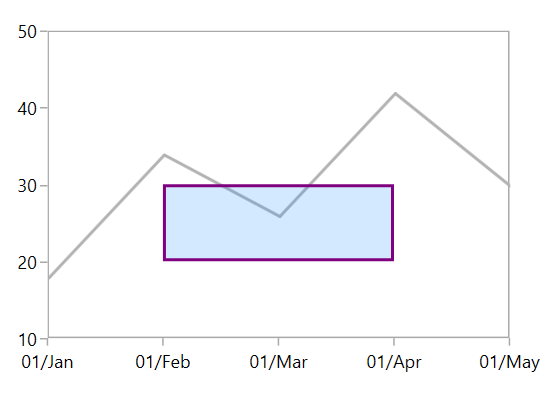

**LogarithmicAxis**

The corresponding log value will be given as values for X1 and X2 properties.





   <chart:SfChart.PrimaryAxis>
      <chart:CategoryAxis  />
   </chart:SfChart.PrimaryAxis>

   <chart:SfChart.SecondaryAxis>
       <chart:LogarithmicAxis  />
   </chart:SfChart.SecondaryAxis>

   <chart:SfChart.Annotations>
       <chart:RectangleAnnotation X1="1" X2="3" Y1="70" Y2="270" 
                                                          Stroke="Purple" StrokeThickness="2"/>
   </chart:SfChart.Annotations>





            SfChart chart = new SfChart();

            chart.PrimaryAxis = new LogarithmicAxis();

            chart.SecondaryAxis = new NumericalAxis();

            RectangleAnnotation annotation = new RectangleAnnotation()
            {
                X1 = 1, X2 = 3, Y1 = 70, Y2 = 270,

                Stroke = new SolidColorBrush(Colors.Purple),

                StrokeThickness = 2
            };

             chart.Annotations.Add(annotation);
			 




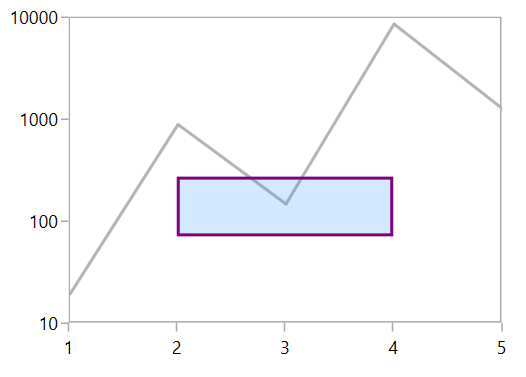

## Events

SfChart provides the following events in [`Annotation`](https://help.syncfusion.com/cr/cref_files/wpf/Syncfusion.SfChart.WPF~Syncfusion.UI.Xaml.Charts.Annotation_members.html#).

* [`Selected`](https://help.syncfusion.com/cr/cref_files/wpf/Syncfusion.SfChart.WPF~Syncfusion.UI.Xaml.Charts.Annotation~Selected_EV.html#)- Occurs when the annotation is selected.
* [`UnSelected`](https://help.syncfusion.com/cr/cref_files/wpf/Syncfusion.SfChart.WPF~Syncfusion.UI.Xaml.Charts.Annotation~UnSelected_EV.html#)- Occurs when annotation is deselected.
* [`DragStarted`](https://help.syncfusion.com/cr/cref_files/wpf/Syncfusion.SfChart.WPF~Syncfusion.UI.Xaml.Charts.StraightLineAnnotation~DragStarted_EV.html#)- Occurs at the start of the dragging.
* [`DragDelta`](https://help.syncfusion.com/cr/cref_files/wpf/Syncfusion.SfChart.WPF~Syncfusion.UI.Xaml.Charts.StraightLineAnnotation~DragDelta_EV.html#)- Occurs when the drag takes place.
* [`DragCompleted`](https://help.syncfusion.com/cr/cref_files/wpf/Syncfusion.SfChart.WPF~Syncfusion.UI.Xaml.Charts.StraightLineAnnotation~DragCompleted_EV.html#)- Occurs when the dragging is completed. You can cancel the dragging by using Cancel argument.
* [`DragEnter`](https://help.syncfusion.com/cr/cref_files/wpf/Syncfusion.SfChart.WPF~Syncfusion.UI.Xaml.Charts.StraightLineAnnotation_members.html#) - Occurs when the cursor is moved over the annotation for dragging.
* [`DragLeave`](https://help.syncfusion.com/cr/cref_files/wpf/Syncfusion.SfChart.WPF~Syncfusion.UI.Xaml.Charts.StraightLineAnnotation_members.html#)- Occurs when the cursor leaves the annotation after dragging.
* [`MouseDown`](https://help.syncfusion.com/cr/cref_files/wpf/Syncfusion.SfChart.WPF~Syncfusion.UI.Xaml.Charts.Annotation~MouseDown_EV.html#) - Occurs when any mouse button is pressed while the pointer is over the annotation.
* [`MouseUp`](https://help.syncfusion.com/cr/cref_files/wpf/Syncfusion.SfChart.WPF~Syncfusion.UI.Xaml.Charts.Annotation~MouseUp_EV.html#)- Occurs when any mouse button is released while the pointer is over the annotation.
* [`MouseLeftButtonDown`](https://help.syncfusion.com/cr/cref_files/wpf/Syncfusion.SfChart.WPF~Syncfusion.UI.Xaml.Charts.Annotation~MouseLeftButtonDown_EV.html#)- Occurs when the left mouse button is pressed while the mouse pointer is over the annotation.
* [`MouseRightButtonDown`](https://help.syncfusion.com/cr/cref_files/wpf/Syncfusion.SfChart.WPF~Syncfusion.UI.Xaml.Charts.Annotation~MouseRightButtonDown_EV.html#)- Occurs when the right mouse button is pressed while the mouse pointer is over the annotation.
* [`MouseRightButtonUp`](https://help.syncfusion.com/cr/cref_files/wpf/Syncfusion.SfChart.WPF~Syncfusion.UI.Xaml.Charts.Annotation~MouseRightButtonUp_EV.html#) - Occurs when the right mouse button is released while the mouse pointer is over the annotation.
* [`MouseMove`](https://help.syncfusion.com/cr/cref_files/wpf/Syncfusion.SfChart.WPF~Syncfusion.UI.Xaml.Charts.Annotation~MouseMove_EV.html#) - Occurs when the mouse pointer moves while over the annotation.
* [`MouseLeave`](https://help.syncfusion.com/cr/cref_files/wpf/Syncfusion.SfChart.WPF~Syncfusion.UI.Xaml.Charts.Annotation~MouseLeave_EV.html#) - Occurs when the mouse pointer leaves the bounds of the annotation.
