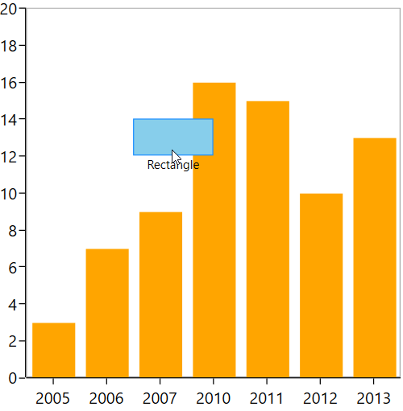
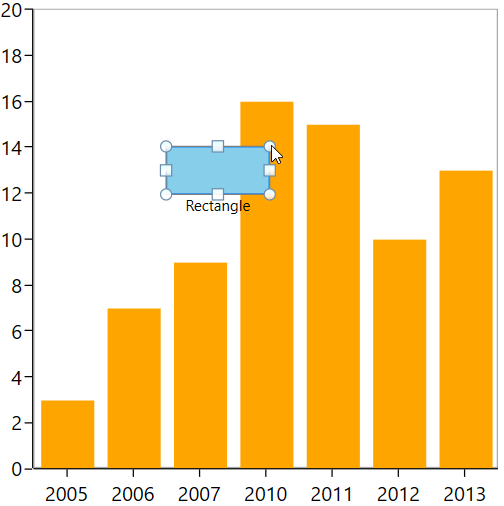
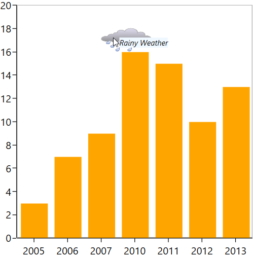

# Annotations in WPF Chart (SfChart)

SfChart supports Annotations, which allows you to mark the specific area of interest in the chart area. You can draw custom shapes, also text and images can be added using Annotations. 

The following annotations are supported in SfChart

* [Text Annotation](https://help.syncfusion.com/wpf/sfchart/annotations#text-annotation)
* [Shape Annotation](https://help.syncfusion.com/wpf/sfchart/annotations#shape-annotation)
* [Image Annotation](https://help.syncfusion.com/wpf/sfchart/annotations#image-annotation)

## Adding Annotation

You can create an instance for any type of Annotation and add it to [`Annotations`](https://help.syncfusion.com/cr/cref_files/wpf/Syncfusion.SfChart.WPF~Syncfusion.UI.Xaml.Charts.AnnotationCollection.html#) collection. Here for instance, the EllipseAnnotation is added.





            <chart:SfChart.Annotations>            
                    <chart:EllipseAnnotation  X1="1.5" Y1="20" Text="Ellipse" X2="3" Y2="23" >
                    </chart:EllipseAnnotation>                           
            </chart:SfChart.Annotations>





        EllipseAnnotation annotation=new EllipseAnnotation()
        {
            X1 = 1.5, Y1 = 20,
            X2 = 3, Y2 = 23,
            Text = "Ellipse"
        };

chart.Annotations.Add(annotation);





## Positioning the Annotation

Annotations can be positioned in plot area based on [`X1`](https://help.syncfusion.com/cr/cref_files/wpf/Syncfusion.SfChart.WPF~Syncfusion.UI.Xaml.Charts.Annotation~X1.html#) and [`Y1`](https://help.syncfusion.com/cr/cref_files/wpf/Syncfusion.SfChart.WPF~Syncfusion.UI.Xaml.Charts.Annotation~Y1.html#)  properties and for image and shape annotations you need to specify [`X2`](https://help.syncfusion.com/cr/cref_files/wpf/Syncfusion.SfChart.WPF~Syncfusion.UI.Xaml.Charts.ShapeAnnotation~X2.html#) and [`Y2`](https://help.syncfusion.com/cr/cref_files/wpf/Syncfusion.SfChart.WPF~Syncfusion.UI.Xaml.Charts.ShapeAnnotation~X2.html#) properties. These X and Y values can be specified with axis units or pixel units and this can be identified using [`CoordinateUnit`](https://help.syncfusion.com/cr/cref_files/wpf/Syncfusion.SfChart.WPF~Syncfusion.UI.Xaml.Charts.Annotation~CoordinateUnit.html#) property.

**Positioning** **based** **on** **CoordinateUnit** **as** **Axis**

To position the annotation based on axis, set the X1 and Y1, X2 and Y2 properties based on axis range values, if needed, set the CoordinateUnit value as [`Axis`](https://help.syncfusion.com/cr/cref_files/wpf/Syncfusion.SfChart.WPF~Syncfusion.UI.Xaml.Charts.CoordinateUnit.html)..





            <chart:SfChart.Annotations>            
                    <chart:RectangleAnnotation  X1="1" Y1="20" Text="Axis Value" X2="2" Y2="23" CoordinateUnit="Axis">
                    </chart:RectangleAnnotation>                           
            </chart:SfChart.Annotations>




        RectangleAnnotation annotation=new RectangleAnnotation()
        {
            X1 = 1, Y1 = 20,
            X2 = 2, Y2 = 23,
            Text = "Axis Value",
            CoordinateUnit=CoordinateUnit.Axis,
            Text="Axis Value"
        };

chart.Annotations.Add(annotation);





**Positioning** **based** **on** **CoordinateUnit** **as** **Pixels**

To position based on the pixel values you have to set the CoordinateUnit as Pixels and the pixel values in X1 and Y1, X2 and Y2 properties in Annotation.





            <chart:SfChart.Annotations>
                <chart:RectangleAnnotation  X1="30" Y1="30" Text="Pixel Value" X2="150" Y2="150" CoordinateUnit="Pixel">
                    </chart:RectangleAnnotation>                           
            </chart:SfChart.Annotations>
            




        RectangleAnnotation annotation=new RectangleAnnotation()
        {
            X1 = 30, Y1 = 30,
            X2 = 150, Y2 = 150,
            Text = "Axis Value",
            CoordinateUnit=CoordinateUnit.Pixel,
            Text="Pixel Value"
        };

chart.Annotations.Add(annotation);





**Adding** **Annotation** **for** **MultipleAxes**

You can also add annotation for a particular axis when there is multiple axes using [`XAxisName`](https://help.syncfusion.com/cr/cref_files/wpf/Syncfusion.SfChart.WPF~Syncfusion.UI.Xaml.Charts.Annotation~XAxisName.html#) and [`YAxisName`](https://help.syncfusion.com/cr/cref_files/wpf/Syncfusion.SfChart.WPF~Syncfusion.UI.Xaml.Charts.Annotation~YAxisName.html#) properties as in the below code snippet.





        <chart:SfChart Width="400" Height="400" BorderBrush="Transparent">
            ...

            <!--SplineSeries-->
            <chart:SplineSeries Interior="Orange" ItemsSource="{Binding Performance}" XBindingPath="ServerLoad" YBindingPath="Server1">
            </chart:SplineSeries>

            <!--ScatterSeries-->
            <chart:ScatterSeries Interior="Green" ItemsSource="{Binding Performance}" XBindingPath="ServerLoad" YBindingPath="Server2">               
            </chart:ScatterSeries>

            <!--HorizontalLineAnnotation-->
            <chart:SfChart.Annotations>
                <chart:HorizontalLineAnnotation  X1="0" Y1="15" Text="Pixel Value" X2="4" >
                </chart:HorizontalLineAnnotation>                           
            </chart:SfChart.Annotations>
            ...
        </chart:SfChart>





        HorizontalLineAnnotation annotation = new HorizontalLineAnnotation()
            {
                X1 = 0,
                Y1 = 15,
                X2 = 4
            };

        chart.Annotations.Add(annotation);

        SplineSeries splineSeries = new SplineSeries()
            {
                ItemsSource = new ServerViewModel().Performance,
                XBindingPath = "ServerLoad",
                YBindingPath = "Server1"
            };

        ScatterSeries scatterSeries = new ScatterSeries()
            {
                ItemsSource = new ServerViewModel().Performance,
                XBindingPath = "ServerLoad",
                YBindingPath = "Server2"
            };

        chart.Series.Add(splineSeries);

        chart.Series.Add(scatterSeries);





## Text Annotation

[`TextAnnotations`](https://help.syncfusion.com/cr/cref_files/wpf/Syncfusion.SfChart.WPF~Syncfusion.UI.Xaml.Charts.TextAnnotation.html#) are used to add simple with help of ['Text'](https://help.syncfusion.com/cr/cref_files/wpf/Syncfusion.SfChart.WPF~Syncfusion.UI.Xaml.Charts.Annotation~Text.html) property in specific points over the chart area.





        <chart:SfChart.Annotations>
            <chart:TextAnnotation X1="1.5" Y1="15" Text="Text Annotation"></chart:TextAnnotation>
        </chart:SfChart.Annotations>
            




        TextAnnotation annotation=new TextAnnotation()
        {
            X1 = 1.5, 
            Y1 = 15,
            Text="Text Annotation"
        };

chart.Annotations.Add(annotation);





### Customizing Text Annotation

SfChart provides you with an editing option for the text in any annotations. When text annotation is enabled editing, if we click the text annotation it switches to edit mode which provide easy way of customizing the text at run time.

The following properties are used to customize the text:

* [`EnableEditing`](https://help.syncfusion.com/cr/cref_files/wpf/Syncfusion.SfChart.WPF~Syncfusion.UI.Xaml.Charts.Annotation~EnableEditing.html#) - Used to define whether the text in TextAnnotation can be edited or not.

* ['Angle'](https://help.syncfusion.com/cr/cref_files/wpf/Syncfusion.SfChart.WPF~Syncfusion.UI.Xaml.Charts.TextAnnotation~Angle.html#) - Used to get or set the angle for rotating the Annotation.

* ['EnableClipping'] (https://help.syncfusion.com/cr/cref_files/wpf/Syncfusion.SfChart.WPF~Syncfusion.UI.Xaml.Charts.Annotation~EnableClipping.html#) - Used to define whether annotation should clip while crossing with boundary.

* ['Foreground'](https://help.syncfusion.com/cr/cref_files/wpf/Syncfusion.SfChart.WPF~Syncfusion.UI.Xaml.Charts.Annotation~Foreground.html) - Used to change the text color.

* [`FontSize`](https://help.syncfusion.com/cr/cref_files/wpf/Syncfusion.SfChart.WPF~Syncfusion.UI.Xaml.Charts.Annotation~FontSize.html#)– An int value that represents the font size of the annotation text.

* [`FontFamily`](https://help.syncfusion.com/cr/cref_files/wpf/Syncfusion.SfChart.WPF~Syncfusion.UI.Xaml.Charts.Annotation~FontFamily.html#)– Represents the font family of the annotation text.

* [`FontStyle`](https://help.syncfusion.com/cr/cref_files/wpf/Syncfusion.SfChart.WPF~Syncfusion.UI.Xaml.Charts.Annotation~FontStyle.html#)– Represents the font style of the annotation text.

* [`FontWeight`](https://help.syncfusion.com/cr/cref_files/wpf/Syncfusion.SfChart.WPF~Syncfusion.UI.Xaml.Charts.Annotation~FontWeight.html#)- Represents the font weight of the annotation text.

* [`FontStretch`](https://help.syncfusion.com/cr/cref_files/wpf/Syncfusion.SfChart.WPF~Syncfusion.UI.Xaml.Charts.Annotation~FontStretch.html) - Represents the font stretch for the annotation description.





            <chart:TextAnnotation X1="1.5" Y1="15" Foreground="Green"  HorizontalAlignment="Stretch" VerticalAlignment="Stretch"
                FontStyle="Italic" FontSize="14" EnableEditing="True" FontFamily="Segoe UI" Text="Text Annotation">
            </chart:TextAnnotation>





       TextAnnotation annotation = new TextAnnotation()
            {
                X1 = 1.5,
                Y1 = 15,
                Text = "Text Annotation",
                EnableEditing=true,
                Foreground=new SolidColorBrush(Colors.Green),
                FontSize=14,
                FontFamily=new FontFamily("Segoe UI"),
                FontStyle=FontStyles.Italic,
                HorizontalAlignment=HorizontalAlignment.Stretch,
                VerticalAlignment=VerticalAlignment.Stretch
            };

    chart.Annotations.Add(annotation);





## Shape Annotation

[`ShapeAnnotation`](https://help.syncfusion.com/cr/cref_files/wpf/Syncfusion.SfChart.WPF~Syncfusion.UI.Xaml.Charts.ShapeAnnotation.html#) allows you to add annotations in the form of shapes such as rectangle, ellipse,horizontal line and vertical line  at the specific area of interest, in the chart area.

* [`EllipseAnnotation`](https://help.syncfusion.com/cr/cref_files/wpf/Syncfusion.SfChart.WPF~Syncfusion.UI.Xaml.Charts.EllipseAnnotation.html#)- Used to draw a circle or an ellipse over the chart area.

* [`RectangleAnnotation`](https://help.syncfusion.com/cr/cref_files/wpf/Syncfusion.SfChart.WPF~Syncfusion.UI.Xaml.Charts.RectangleAnnotation.html#)- Used to draw a rectangle over the chart area.

*['LineAnnotation'](https://help.syncfusion.com/cr/cref_files/wpf/Syncfusion.SfChart.WPF~Syncfusion.UI.Xaml.Charts.LineAnnotation.html#) - Used to draw a line over the chart area.

* [`VerticalLineAnnotation`](https://help.syncfusion.com/cr/cref_files/wpf/Syncfusion.SfChart.WPF~Syncfusion.UI.Xaml.Charts.VerticalLineAnnotation.html#)- Used to draw a vertical line across the chart area.

* [`HorizontalLineAnnotation`](https://help.syncfusion.com/cr/cref_files/wpf/Syncfusion.SfChart.WPF~Syncfusion.UI.Xaml.Charts.HorizontalLineAnnotation.html#) - Used to add a horizontal line across the chart area.

The following API’s are commonly used in all ShapeAnnotation:

* [`Fill`](https://help.syncfusion.com/cr/cref_files/wpf/Syncfusion.SfChart.WPF~Syncfusion.UI.Xaml.Charts.ShapeAnnotation~Fill.html#) - Represents the brush inside the Shape Annotation.

* [`X2`](https://help.syncfusion.com/cr/cref_files/wpf/Syncfusion.SfChart.WPF~Syncfusion.UI.Xaml.Charts.ShapeAnnotation~X2.html#)  - Represents the X2 Coordinate of the Shape Annotation.

* [`Y2`](https://help.syncfusion.com/cr/cref_files/wpf/Syncfusion.SfChart.WPF~Syncfusion.UI.Xaml.Charts.ShapeAnnotation~Y2.html#) - Represents the Y2 Coordinate of the Shape Annotation.

* [`CanDrag`](https://help.syncfusion.com/cr/cref_files/wpf/Syncfusion.SfChart.WPF~Syncfusion.UI.Xaml.Charts.ShapeAnnotation~CanDrag.html#) - A Boolean value that represent to drag the Annotation.

* [`CanResize`](https://help.syncfusion.com/cr/cref_files/wpf/Syncfusion.SfChart.WPF~Syncfusion.UI.Xaml.Charts.ShapeAnnotation~CanResize.html#)  - A Boolean value that represent to resize the Annotation.

### Ellipse Annotation

The ['EllipseAnnotation'](https://help.syncfusion.com/cr/cref_files/wpf/Syncfusion.SfChart.WPF~Syncfusion.UI.Xaml.Charts.EllipseAnnotation.html#) is used to draw an oval or a circle in specific points over the chart area.





        <chart:EllipseAnnotation X1="2" Y1="15" X2="3" Y2="18" Text="Ellipse"></chart:EllipseAnnotation>





        EllipseAnnotation ellipse = new EllipseAnnotation()
            {
                X1 = 2,
                Y1 = 15,
                X2 = 3,
                Y2 = 18,
                Text = "Ellipse"
            };





### Rectangle Annotation

The ['RectangleAnnotation'](https://help.syncfusion.com/cr/cref_files/wpf/Syncfusion.SfChart.WPF~Syncfusion.UI.Xaml.Charts.RectangleAnnotation.html#) is used to draw a rectangle or a square in specific points over the chart area.





        <chart:RectangleAnnotation X1="2" Y1="15" X2="3" Y2="18" Text="Rectangle"></chart:RectangleAnnotation>





        RectangleAnnotation ellipse = new RectangleAnnotation()
            {
                X1 = 2,
                Y1 = 15,
                X2 = 3,
                Y2 = 18,
                Text = "Rectangle"
            };





### Line Annotation

The ['LineAnnotation'](https://help.syncfusion.com/cr/cref_files/wpf/Syncfusion.SfChart.WPF~Syncfusion.UI.Xaml.Charts.LineAnnotation.html#) is used to draw a line in specific points over the chart area.





        <chart:LineAnnotation X1="2" Y1="14" X2="3.5" Y2="18" Text="Line"></chart:LineAnnotation>





        LineAnnotation line = new LineAnnotation()
            {
                X1 = 2,
                Y1 = 14,
                X2 = 3.5,
                Y2 = 18,
                Text = "Line"
            };





### Vertical and Horizontal line annotation

The ['VerticalLineAnnotation'](https://help.syncfusion.com/cr/cref_files/wpf/Syncfusion.SfChart.WPF~Syncfusion.UI.Xaml.Charts.VerticalLineAnnotation.html#) and [`HorizontalLineAnnotation`](https://help.syncfusion.com/cr/cref_files/wpf/Syncfusion.SfChart.WPF~Syncfusion.UI.Xaml.Charts.HorizontalLineAnnotation.html#) are used to draw vertical and horizontal lines in specific points over the chart area.





        <chart:VerticalLineAnnotation X1="3"></chart:VerticalLineAnnotation>
        <chart:HorizontalLineAnnotation X1="0" Y1="11" X2="6" Y2="11"></chart:HorizontalLineAnnotation>





        HorizontalLineAnnotation hor = new HorizontalLineAnnotation()
            {
                X1 = 0,
                Y1 = 10,
                X2 = 6,
                Y2 = 10
            };

        VerticalLineAnnotation ver = new VerticalLineAnnotation()
            {
                X1 = 3
            };





### Customizing Line Annotation
The appearance of the LineAnnotation, VerticalLineAnnotation and HorizontalLineAnnotation can be customized with use of following properties.

* ['GrabExtent'](https://help.syncfusion.com/cr/cref_files/wpf/Syncfusion.SfChart.WPF~Syncfusion.UI.Xaml.Charts.LineAnnotation~GrabExtent.html) - Used to extent the hit visible area while performing dragging and resizing.

* [`ShowLine`](https://help.syncfusion.com/cr/cref_files/wpf/Syncfusion.SfChart.WPF~Syncfusion.UI.Xaml.Charts.LineAnnotation~ShowLine.html#) - Used to collapse the visibility of the line annotation.

* ['LineCap'](https://help.syncfusion.com/cr/cref_files/wpf/Syncfusion.SfChart.WPF~Syncfusion.UI.Xaml.Charts.LineAnnotation~LineCap.html)

* [`ShowAxisLabel`](https://help.syncfusion.com/cr/cref_files/wpf/Syncfusion.SfChart.WPF~Syncfusion.UI.Xaml.Charts.StraightLineAnnotation~ShowAxisLabel.html#) - Used to display the axis labels in which the line is placed

**Adding arrow to line annotation**

To display single headed arrow, set the ['LineCap'](https://help.syncfusion.com/cr/cref_files/wpf/Syncfusion.SfChart.WPF~Syncfusion.UI.Xaml.Charts.LineAnnotation~LineCap.html) property to ['Arrow'](https://help.syncfusion.com/cr/cref_files/wpf/Syncfusion.SfChart.WPF~Syncfusion.UI.Xaml.Charts.LineCap.html). The default value of the ['LineCap'](https://help.syncfusion.com/cr/cref_files/wpf/Syncfusion.SfChart.WPF~Syncfusion.UI.Xaml.Charts.LineAnnotation~LineCap.html) property is ['None'](https://help.syncfusion.com/cr/cref_files/wpf/Syncfusion.SfChart.WPF~Syncfusion.UI.Xaml.Charts.LineCap.html).





       <chart:LineAnnotation X1="1" Y1="10" X2="5" Y2="10" Text="Line" LineCap="Arrow"></chart:LineAnnotation>





        LineAnnotation ellipse = new LineAnnotation()
            {
                X1 = 1,
                Y1 = 10,
                X2 = 5,
                Y2 = 10,
                Text = "Line",
                LineCap=LineCap.Arrow
            };





**Displaying** **Axis** **Labels** **for** **LineAnnotation**

[`VerticalLineAnnotation`](https://help.syncfusion.com/cr/cref_files/wpf/Syncfusion.SfChart.WPF~Syncfusion.UI.Xaml.Charts.VerticalLineAnnotation.html#) and [`HorizontalLineAnnotation`](https://help.syncfusion.com/cr/cref_files/wpf/Syncfusion.SfChart.WPF~Syncfusion.UI.Xaml.Charts.HorizontalLineAnnotation.html#) also displays the axis labels in which the line is placed. This feature can be enabled by setting [`ShowAxisLabel`](https://help.syncfusion.com/cr/cref_files/wpf/Syncfusion.SfChart.WPF~Syncfusion.UI.Xaml.Charts.StraightLineAnnotation~ShowAxisLabel.html#) property to true as in the below code snippet.





        <chart:VerticalLineAnnotation X1="3"  ShowAxisLabel="True"></chart:VerticalLineAnnotation>
        <chart:HorizontalLineAnnotation X1="0" Y1="11" X2="6" Y2="11"  ShowAxisLabel="True"></chart:HorizontalLineAnnotation>





        HorizontalLineAnnotation hor = new HorizontalLineAnnotation()
            {
                X1 = 0,
                Y1 = 10,
                X2 = 6,
                Y2 = 10,
                ShowAxisLabel=true
               
            };

        VerticalLineAnnotation ver = new VerticalLineAnnotation()
            {
                X1 = 3,
                ShowAxisLabel=true
            };





Also, axis label can be customized the default appearance using [`AxisLabelTemplate`](https://help.syncfusion.com/cr/cref_files/wpf/Syncfusion.SfChart.WPF~Syncfusion.UI.Xaml.Charts.StraightLineAnnotation~AxisLabelTemplate.html#) property.

### Adding text in shape annotation

For all the shape annotations, the text can be displayed by using the [`Text`](https://help.syncfusion.com/cr/cref_files/wpf/Syncfusion.SfChart.WPF~Syncfusion.UI.Xaml.Charts.Annotation~Text.html) property.

**Customizing text in shape annotation**

The text alignment can be changed using [`HorizontalTextAlignment`](https://help.syncfusion.com/cr/cref_files/wpf/Syncfusion.SfChart.WPF~Syncfusion.UI.Xaml.Charts.ShapeAnnotation~HorizontalTextAlignment.html#) and [`VerticalTextAlignment`](https://help.syncfusion.com/cr/cref_files/wpf/Syncfusion.SfChart.WPF~Syncfusion.UI.Xaml.Charts.ShapeAnnotation~VerticalTextAlignment.html#) properties. 




  <chart:EllipseAnnotation  X1="1.5" Y1="12" Fill="SkyBlue" HorizontalTextAlignment="Center" 
    VerticalTextAlignment="Center" Foreground="Brown" Text="Ellipse" X2="3" Y2="15" >
                    </chart:EllipseAnnotation>   





        EllipseAnnotation ellipse = new EllipseAnnotation()
            {
                X1 = 1.5,
                Y1 = 12,
                X2 = 3,
                Y2 = 15,
                Fill = new SolidColorBrush(Colors.SkyBlue),
                HorizontalTextAlignment =HorizontalAlignment.Center,
                VerticalTextAlignment = VerticalAlignment.Center,
                Foreground = new SolidColorBrush(Colors.Brown),
                Text = "Ellipse"               
            };





N> [`HorizontalTextAlignment`](https://help.syncfusion.com/cr/cref_files/wpf/Syncfusion.SfChart.WPF~Syncfusion.UI.Xaml.Charts.ShapeAnnotation~HorizontalTextAlignment.html#) and [`VerticalTextAlignment`](https://help.syncfusion.com/cr/cref_files/wpf/Syncfusion.SfChart.WPF~Syncfusion.UI.Xaml.Charts.ShapeAnnotation~VerticalTextAlignment.html#) properties are not applicable for [`TextAnnotation`](https://help.syncfusion.com/cr/cref_files/wpf/Syncfusion.SfChart.WPF~Syncfusion.UI.Xaml.Charts.TextAnnotation.html#).

### Customizing the Shape Annotation

SfChart allows customization of shape annotation using the following properties.

* [`Stroke`](https://help.syncfusion.com/cr/cref_files/wpf/Syncfusion.SfChart.WPF~Syncfusion.UI.Xaml.Charts.ShapeAnnotation~Stroke.html#) - Represents the brush for the annotation outline.
* [`StrokeThickness`](https://help.syncfusion.com/cr/cref_files/wpf/Syncfusion.SfChart.WPF~Syncfusion.UI.Xaml.Charts.ShapeAnnotation~StrokeThickness.html#)- Represents the thickness of the annotation outline.
* [`StrokeDashArray`](https://help.syncfusion.com/cr/cref_files/wpf/Syncfusion.SfChart.WPF~Syncfusion.UI.Xaml.Charts.ShapeAnnotation~StrokeDashArray.html# )- Represents the DashArray of the annotation stroke.
* [`StrokeDashCap`](https://help.syncfusion.com/cr/cref_files/wpf/Syncfusion.SfChart.WPF~Syncfusion.UI.Xaml.Charts.ShapeAnnotation~StrokeDashCap.html#)- Represents the DashCap of the annotation stroke.
* [`StrokeDashOffset`](https://help.syncfusion.com/cr/cref_files/wpf/Syncfusion.SfChart.WPF~Syncfusion.UI.Xaml.Charts.ShapeAnnotation~StrokeDashOffset.html#)- Represents the DashOffset of the annotation stroke.
* [`StrokeEndLineCap`](https://help.syncfusion.com/cr/cref_files/wpf/Syncfusion.SfChart.WPF~Syncfusion.UI.Xaml.Charts.ShapeAnnotation~StrokeEndLineCap.html#)- Represents the end line cap of the annotation stroke.
* [`StrokeLineJoin`](https://help.syncfusion.com/cr/cref_files/wpf/Syncfusion.SfChart.WPF~Syncfusion.UI.Xaml.Charts.ShapeAnnotation~StrokeLineJoin.html#) - Represents the line join of the annotation outline.
* [`StrokeMiterLimit`](https://help.syncfusion.com/cr/cref_files/wpf/Syncfusion.SfChart.WPF~Syncfusion.UI.Xaml.Charts.ShapeAnnotation~StrokeMiterLimit.html#) - Represents the limit on the ratio of the miter length to half of the annotation shape.





        <chart:RectangleAnnotation  X1="1.5" Y1="12" Fill="LightGray" Stroke="Brown" StrokeDashArray="5,2"                     HorizontalTextAlignment="Center" VerticalTextAlignment="Center" 
        Text="Rectangle" X2="3" Y2="14" >
        </chart:RectangleAnnotation>                           





        RectangleAnnotation rectangle = new RectangleAnnotation()
            {
                X1 = 1.5,
                Y1 = 12,
                X2 = 3,
                Y2 = 14,
                Fill = new SolidColorBrush(Colors.LightGray),
                HorizontalTextAlignment =HorizontalAlignment.Center,
                VerticalTextAlignment = VerticalAlignment.Center,
                Stroke=new SolidColorBrush(Colors.Brown),
                StrokeDashArray= new DoubleCollection() { 5,2 },
                Text = "Rectangle"
            };





## Image Annotation

SfChart provides support to add images as Annotation over the chart area, using the class [ImageAnnotation](https://help.syncfusion.com/cr/cref_files/wpf/Syncfusion.SfChart.WPF~Syncfusion.UI.Xaml.Charts.ImageAnnotation.html#). 

The following API’s are used in ImageAnnotation.

* [`Angle`](https://help.syncfusion.com/cr/cref_files/wpf/Syncfusion.SfChart.WPF~Syncfusion.UI.Xaml.Charts.SolidShapeAnnotation~Angle.html#)  – An integer value that represents the rotation angle for the text in Annotation.
* [`ImageSource`](https://help.syncfusion.com/cr/cref_files/wpf/Syncfusion.SfChart.WPF~Syncfusion.UI.Xaml.Charts.ImageAnnotation~ImageSource.html#)  - Represents the source from where the image must be added.
* [`X2`](https://help.syncfusion.com/cr/cref_files/wpf/Syncfusion.SfChart.WPF~Syncfusion.UI.Xaml.Charts.ImageAnnotation~X2.html#)- Represents the X2 Coordinate of the Annotation.****
* [`Y2`](https://help.syncfusion.com/cr/cref_files/wpf/Syncfusion.SfChart.WPF~Syncfusion.UI.Xaml.Charts.ImageAnnotation~Y2.html#)- Represents the Y2 Coordinate of the Annotation.****





        <chart:ImageAnnotation ImageSource="rain.jpg"  X1="2.5" Y1="16" X2="3.5" Y2="18"></chart:ImageAnnotation>                       





## Interaction

SfChart provides dragging and resizing support for [`ShapeAnnotations`](https://help.syncfusion.com/cr/cref_files/wpf/Syncfusion.SfChart.WPF~Syncfusion.UI.Xaml.Charts.ShapeAnnotation.html#).

The following API’s are used for dragging and resizing the annotation

* [`CanDrag`](https://help.syncfusion.com/cr/cref_files/wpf/Syncfusion.SfChart.WPF~Syncfusion.UI.Xaml.Charts.ShapeAnnotation~CanDrag.html#)- A Boolean value that allows the annotation to drag. 

* [`CanResize`](https://help.syncfusion.com/cr/cref_files/wpf/Syncfusion.SfChart.WPF~Syncfusion.UI.Xaml.Charts.ShapeAnnotation~CanResize.html#)- A Boolean value that allows the annotation to resize. 

* [`DraggingMode`](https://help.syncfusion.com/cr/cref_files/wpf/Syncfusion.SfChart.WPF~Syncfusion.UI.Xaml.Charts.ShapeAnnotation~DraggingMode.html#)- Represents the dragging direction for the annotation. 

* [`ResizingMode`](https://help.syncfusion.com/cr/cref_files/wpf/Syncfusion.SfChart.WPF~Syncfusion.UI.Xaml.Charts.SolidShapeAnnotation~ResizingMode.html#)- Represents the resizing direction for the annotation. 

**Dragging** **the** **Annotation**

The following code example demonstrates the dragging the rectangle annotation.





 <chart:RectangleAnnotation  X1="1.5" Y1="12" CanDrag="True" Fill="SkyBlue" Text="Rectangle" X2="3" Y2="14" >
                    </chart:RectangleAnnotation>





        RectangleAnnotation an = new RectangleAnnotation()
            {
                X1 = 1.5,
                Y1 = 12,
                X2 = 3,
                Y2 = 14,
                Fill = new SolidColorBrush(Colors.SkyBlue),
                CanDrag = true
            };





Also, the direction of dragging can be customizied by using [`DraggingMode`](https://help.syncfusion.com/cr/cref_files/wpf/Syncfusion.SfChart.WPF~Syncfusion.UI.Xaml.Charts.ShapeAnnotation~DraggingMode.html#) property.

**Resizing** **the** **Annotation**

You can resize the annotation by enabling [`CanResize`](https://help.syncfusion.com/cr/cref_files/wpf/Syncfusion.SfChart.WPF~Syncfusion.UI.Xaml.Charts.ShapeAnnotation~CanResize.html#) property to True as in the below code snippet.





            <chart:RectangleAnnotation  X1="1.5" Y1="12" CanResize="True" Fill="SkyBlue" Text="Rectangle" X2="3" Y2="14" >
                    </chart:RectangleAnnotation>





        RectangleAnnotation an = new RectangleAnnotation()
            {
                X1 = 1.5,
                Y1 = 12,
                X2 = 3,
                Y2 = 14,
                Fill = new SolidColorBrush(Colors.SkyBlue),
                CanResize = true
            };

    

    

Also, the direction of resizing can be customizied by using [`ResizingMode`](https://help.syncfusion.com/cr/cref_files/wpf/Syncfusion.SfChart.WPF~Syncfusion.UI.Xaml.Charts.SolidShapeAnnotation~ResizingMode.html#) property.

## ToolTip

SfChart provides support to view the tooltip when mouse hovered on the annotation. To view to tooltip you have to enable the [`ShowToolTip`](https://help.syncfusion.com/cr/cref_files/wpf/Syncfusion.SfChart.WPF~Syncfusion.UI.Xaml.Charts.Annotation~ShowToolTip.html#) property. By default for tooltip there is no content, you have to set the content for the tooltip in [`ToolTipContent`](https://help.syncfusion.com/cr/cref_files/wpf/Syncfusion.SfChart.WPF~Syncfusion.UI.Xaml.Charts.Annotation~ToolTipContent.html#) property.

* [`ToolTipPlacement`](https://help.syncfusion.com/cr/cref_files/wpf/Syncfusion.SfChart.WPF~Syncfusion.UI.Xaml.Charts.Annotation~ToolTipPlacement.html#) - Used to position the Tooltip with top, bottom, left or right side of the cursor.

* [`TooltipTemplate`](https://help.syncfusion.com/cr/cref_files/wpf/Syncfusion.SfChart.WPF~Syncfusion.UI.Xaml.Charts.Annotation~ToolTipTemplate.html#) - Used to customize the default appearance of the Tooltip.

The following code example demonstrates the default tooltip.





            <chart:ImageAnnotation ImageSource="rain.png"  X1="2" Y1="16" X2="3.5" Y2="18" ShowToolTip="True" ToolTipContent="Rainy Weather">
                </chart:ImageAnnotation>
            




**ToolTipTemplate**

The default appearance of the Tooltip can be changed using [`TooltipTemplate`](https://help.syncfusion.com/cr/cref_files/wpf/Syncfusion.SfChart.WPF~Syncfusion.UI.Xaml.Charts.Annotation~ToolTipTemplate.html#) property as in the below code snippet.



    <chart:ImageAnnotation ImageSource="rain.png"  X1="2" Y1="16" X2="3.5" Y2="18" ShowToolTip="True" ToolTipContent="Rainy Weather">
                    <chart:ImageAnnotation.ToolTipTemplate>
                        <DataTemplate>
                            <Border BorderBrush="Brown" Background="AliceBlue">
                                <TextBlock Text="Rainy Weather" FontStyle="Italic"></TextBlock>
                            </Border>
                        </DataTemplate>
                    </chart:ImageAnnotation.ToolTipTemplate>
                </chart:ImageAnnotation>
            </chart:SfChart.Annotations>



## Annotation Clipping

SfChart allows you to clip the annotation if the annotation crosses the boundary by setting [`EnableClipping`](https://help.syncfusion.com/cr/cref_files/wpf/Syncfusion.SfChart.WPF~Syncfusion.UI.Xaml.Charts.Annotation~EnableClipping.html#) property to True as in the below code snippet.





            <chart:SfChart.Annotations>            
                  
                <chart:ImageAnnotation ImageSource="rain.png"  X1="6" Y1="16" X2="9" Y2="18" EnableClipping="True"></chart:ImageAnnotation>

            </chart:SfChart.Annotations>





SfChart chart = new SfChart();

        ImageAnnotation image = new ImageAnnotation()
            {
                X1 = 6,
                Y1 = 16,
                X2 = 9,
                Y2 = 18,
                ImageSource = new BitmapImage(new Uri("rain.png", UriKind.RelativeOrAbsolute)),
                 EnableClipping=true
            };

        chart.Annotations.Add(image);





The following screenshot explains that even when x value is provided out of bounds the image annotation is placed inside the chart area.

## Events

SfChart provides the following events in [`Annotation`](https://help.syncfusion.com/cr/cref_files/wpf/Syncfusion.SfChart.WPF~Syncfusion.UI.Xaml.Charts.Annotation_members.html#).

* [`Selected`](https://help.syncfusion.com/cr/cref_files/wpf/Syncfusion.SfChart.WPF~Syncfusion.UI.Xaml.Charts.Annotation~Selected_EV.html#)- Occurs when the annotation is selected.
* [`UnSelected`](https://help.syncfusion.com/cr/cref_files/wpf/Syncfusion.SfChart.WPF~Syncfusion.UI.Xaml.Charts.Annotation~UnSelected_EV.html#)- Occurs when annotation is deselected.
* [`DragStarted`](https://help.syncfusion.com/cr/cref_files/wpf/Syncfusion.SfChart.WPF~Syncfusion.UI.Xaml.Charts.StraightLineAnnotation~DragStarted_EV.html#)- Occurs at the start of the dragging.
* [`DragDelta`](https://help.syncfusion.com/cr/cref_files/wpf/Syncfusion.SfChart.WPF~Syncfusion.UI.Xaml.Charts.StraightLineAnnotation~DragDelta_EV.html#)- Occurs when the drag takes place.
* [`DragCompleted`](https://help.syncfusion.com/cr/cref_files/wpf/Syncfusion.SfChart.WPF~Syncfusion.UI.Xaml.Charts.StraightLineAnnotation~DragCompleted_EV.html#)- Occurs when the dragging is completed. You can cancel the dragging by using Cancel argument.
* [`DragEnter`](https://help.syncfusion.com/cr/cref_files/wpf/Syncfusion.SfChart.WPF~Syncfusion.UI.Xaml.Charts.StraightLineAnnotation_members.html#) - Occurs when the cursor is moved over the annotation for dragging.
* [`DragLeave`](https://help.syncfusion.com/cr/cref_files/wpf/Syncfusion.SfChart.WPF~Syncfusion.UI.Xaml.Charts.StraightLineAnnotation_members.html#)- Occurs when the cursor leaves the annotation after dragging.
* [`MouseDown`](https://help.syncfusion.com/cr/cref_files/wpf/Syncfusion.SfChart.WPF~Syncfusion.UI.Xaml.Charts.Annotation~MouseDown_EV.html#) - Occurs when any mouse button is pressed while the pointer is over the annotation.
* [`MouseUp`](https://help.syncfusion.com/cr/cref_files/wpf/Syncfusion.SfChart.WPF~Syncfusion.UI.Xaml.Charts.Annotation~MouseUp_EV.html#)- Occurs when any mouse button is released while the pointer is over the annotation.
* [`MouseLeftButtonDown`](https://help.syncfusion.com/cr/cref_files/wpf/Syncfusion.SfChart.WPF~Syncfusion.UI.Xaml.Charts.Annotation~MouseLeftButtonDown_EV.html#)- Occurs when the left mouse button is pressed while the mouse pointer is over the annotation.
* [`MouseRightButtonDown`](https://help.syncfusion.com/cr/cref_files/wpf/Syncfusion.SfChart.WPF~Syncfusion.UI.Xaml.Charts.Annotation~MouseRightButtonDown_EV.html#)- Occurs when the right mouse button is pressed while the mouse pointer is over the annotation.
* [`MouseRightButtonUp`](https://help.syncfusion.com/cr/cref_files/wpf/Syncfusion.SfChart.WPF~Syncfusion.UI.Xaml.Charts.Annotation~MouseRightButtonUp_EV.html#) - Occurs when the right mouse button is released while the mouse pointer is over the annotation.
* [`MouseMove`](https://help.syncfusion.com/cr/cref_files/wpf/Syncfusion.SfChart.WPF~Syncfusion.UI.Xaml.Charts.Annotation~MouseMove_EV.html#) - Occurs when the mouse pointer moves while over the annotation.
* [`MouseLeave`](https://help.syncfusion.com/cr/cref_files/wpf/Syncfusion.SfChart.WPF~Syncfusion.UI.Xaml.Charts.Annotation~MouseLeave_EV.html#) - Occurs when the mouse pointer leaves the bounds of the annotation.
