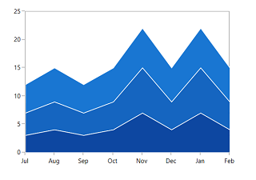
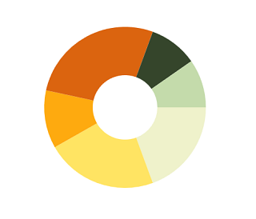
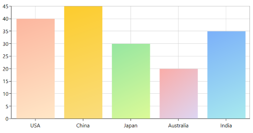
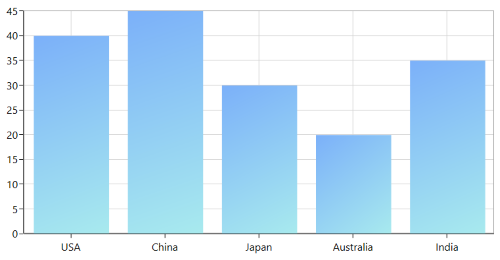

# Appearance in WPF Charts (SfChart)

SfChart supports various customizing and styling options that allows you to enrich the application.

## Palettes

SfChart provides options to apply different kinds of themes or palettes to your chart. You can define [`Palette`](https://help.syncfusion.com/cr/wpf/Syncfusion.UI.Xaml.Charts.ChartBase.html#Syncfusion_UI_Xaml_Charts_ChartBase_Palette) either for the entire chart or for an individual series.

We have some predefined palette such as

* Metro
* AutumnBrights
* FloraHues
* Pineapple
* TomotoSpectrum
* RedChrome
* PurpleChrome
* BlueChrome
* GreenChrome
* Elite
* LightCandy
* SandyBeach

N> Elite, SandyBeach and LightCandy palettes are not supported in the bitmap series types.

### Applying Palette to Series

Each palette applies a set of predefined brushes to the series in a predefined order. The following code example shows you how to set the Metro Palette for the chart series.





<chart:SfChart Height="250" Width="350" Palette="Metro"  >





chart.Palette = ChartColorPalette.Metro;





The following code example defined Palette as [`BlueChrome`](https://help.syncfusion.com/cr/wpf/Syncfusion.UI.Xaml.Charts.ChartColorPalette.html).





<chart:SfChart Height="250" Width="350" Palette="BlueChrome">





chart.Palette = ChartColorPalette.BlueChrome;





### Applying Palette to Segment

Each palette applies a set of predefined brushes to the segment in a predefined order. The following code example shows you how to set the Metro Palette for the chart series.





<chart:DoughnutSeries YBindingPath="Percentage" Palette="Metro"

XBindingPath="Category" ItemsSource="{Binding Tax}" />





DoughnutSeries series = new DoughnutSeries()

{

    ItemsSource = new ViewModel().Tax,

    XBindingPath = "Category",

    YBindingPath = "Percentage",

    Palette = ChartColorPalette.Metro

};

chart.Series.Add(series);





The following code example defined Palette as **AutumnBrights**.





<chart:DoughnutSeries   YBindingPath="Percentage" Palette="AutumnBrights"

XBindingPath="Category" ItemsSource="{Binding Tax}" />





DoughnutSeries series = new DoughnutSeries()

{

    ItemsSource = new ViewModel().Tax,

    XBindingPath = "Category",

    YBindingPath = "Percentage",

    Palette = ChartColorPalette.AutumnBrights

};

chart.Series.Add(series);





N> Metro palette is the default palette for both Series and Segment.

## Custom Palette

SfChart provides option which enables you to define your own color brushes with your preferred order for the Palette, using [`ColorModel`](https://help.syncfusion.com/cr/wpf/Syncfusion.UI.Xaml.Charts.ChartSeriesBase.html#Syncfusion_UI_Xaml_Charts_ChartSeriesBase_ColorModel) as shown in the following code example.





<chart:DoughnutSeries  YBindingPath="Percentage" Palette="Custom"

XBindingPath="Category" ItemsSource="{Binding Tax}" >   

<chart:DoughnutSeries.ColorModel>

<chart:ChartColorModel>

<chart:ChartColorModel.CustomBrushes>

<SolidColorBrush Color="Cyan"/>

<SolidColorBrush Color="DarkCyan"/>                                                

</chart:ChartColorModel.CustomBrushes>

</chart:ChartColorModel>

</chart:DoughnutSeries.ColorModel>

</chart:DoughnutSeries>





ChartColorModel colorModel = new ChartColorModel();

colorModel.CustomBrushes.Add(new SolidColorBrush(Colors.Cyan));

colorModel.CustomBrushes.Add(new SolidColorBrush(Colors.DarkCyan));

DoughnutSeries series = new DoughnutSeries()
{

    ItemsSource = new ViewModel().Tax,

    XBindingPath = "Category",

    YBindingPath = "Percentage",

    Palette = ChartColorPalette.Custom,

    ColorModel = colorModel

};

chart.Series.Add(series);





You can define the custom palette for series as in the below code example:





<chart:SfChart Height="250" Width="350" Palette="Custom">

<chart:SfChart.ColorModel>

<chart:ChartColorModel>

<chart:ChartColorModel.CustomBrushes>

<SolidColorBrush Color="BlueViolet"/>

<SolidColorBrush Color="PeachPuff"/>

<SolidColorBrush Color="Purple"/>

</chart:ChartColorModel.CustomBrushes>

</chart:ChartColorModel>

</chart:SfChart.ColorModel>

</chart:SfChart>





chart.Palette = ChartColorPalette.Custom;

ChartColorModel colorModel = new ChartColorModel();

colorModel.CustomBrushes.Add(new SolidColorBrush(Colors.BlueViolet));

colorModel.CustomBrushes.Add(new SolidColorBrush(Colors.PeachPuff));

colorModel.CustomBrushes.Add(new SolidColorBrush(Colors.Purple));

chart.ColorModel = colorModel;





## Gradient Colors

Gradient colors for the chart series can be set by using the [`Interior`](https://help.syncfusion.com/cr/wpf/Syncfusion.UI.Xaml.Charts.ChartSeriesBase.html#Syncfusion_UI_Xaml_Charts_ChartSeriesBase_Interior) or [`ColorModel`](https://help.syncfusion.com/cr/wpf/Syncfusion.UI.Xaml.Charts.ChartSeriesBase.html#Syncfusion_UI_Xaml_Charts_ChartSeriesBase_ColorModel) property of the chart series with the help of `LinearGradientBrush` or `RadialGradientBrush`.

The following code sample and screenshot illustrates how to apply the custom gradient colors for chart series using the [`ColorModel`](https://help.syncfusion.com/cr/wpf/Syncfusion.UI.Xaml.Charts.ChartSeriesBase.html#Syncfusion_UI_Xaml_Charts_ChartSeriesBase_ColorModel) property.





<chart:ColumnSeries XBindingPath="XValue" 
                    YBindingPath="YValue"
                    ItemsSource="{Binding Data}"
                    Palette="Custom">

    <chart:ColumnSeries.ColorModel>
        <chart:ChartColorModel>
            <chart:ChartColorModel.CustomBrushes>
                <LinearGradientBrush>
                    <GradientStop Offset="1" Color="#FFE7C7" />
                    <GradientStop Offset="0" Color="#FCB69F" />
                </LinearGradientBrush>
                <LinearGradientBrush>
                    <GradientStop Offset="1" Color="#fadd7d" />
                    <GradientStop Offset="0" Color="#fccc2d" />
                </LinearGradientBrush>
                <LinearGradientBrush>
                    <GradientStop Offset="1" Color="#DCFA97" />
                    <GradientStop Offset="0" Color="#96E6A1" />
                </LinearGradientBrush>
                <LinearGradientBrush>
                    <GradientStop Offset="1" Color="#DDD6F3" />
                    <GradientStop Offset="0" Color="#FAACA8" />
                </LinearGradientBrush>
                <LinearGradientBrush>
                    <GradientStop Offset="1" Color="#A8EAEE" />
                    <GradientStop Offset="0" Color="#7BB0F9" />
                </LinearGradientBrush>
            </chart:ChartColorModel.CustomBrushes>
        </chart:ChartColorModel>
    </chart:ColumnSeries.ColorModel>
</chart:ColumnSeries>





SfChart chart = new SfChart();

...

ChartColorModel colorModel = new ChartColorModel();

LinearGradientBrush gradientColor1 = new LinearGradientBrush();

GradientStop stop1 = new GradientStop() { Offset = 1, Color = Color.FromRgb(255, 231, 199) };

GradientStop stop2 = new GradientStop() { Offset = 0, Color = Color.FromRgb(252, 182, 159) };

gradientColor1.GradientStops.Add(stop1);

gradientColor1.GradientStops.Add(stop2);

LinearGradientBrush gradientColor2 = new LinearGradientBrush();

stop1 = new GradientStop() { Offset = 1, Color = Color.FromRgb(250, 221, 125) };

stop2 = new GradientStop() { Offset = 0, Color = Color.FromRgb(252, 204, 45) };

gradientColor2.GradientStops.Add(stop1);

gradientColor2.GradientStops.Add(stop2);

...

colorModel.CustomBrushes.Add(gradientColor1);

colorModel.CustomBrushes.Add(gradientColor2);

...

ColumnSeries series = new ColumnSeries()

{

    ItemsSource = new ViewModel().Data,

    XBindingPath = "Element",

    YBindingPath = "YValue",

    Palette = ChartColorPalette.Custom,

    ColorModel = colorModel

};

chart.Series.Add(series);





The following code sample and screenshot illustrates how to apply the gradient color using the [`Interior`](https://help.syncfusion.com/cr/wpf/Syncfusion.UI.Xaml.Charts.ChartSeriesBase.html#Syncfusion_UI_Xaml_Charts_ChartSeriesBase_Interior) property of series with `LinearGradientBrush`.





<chart:ColumnSeries XBindingPath="XValue" 
                    YBindingPath="YValue"
                    ItemsSource="{Binding Data}">
                
    <chart:ColumnSeries.Interior>
        <LinearGradientBrush>
            <GradientStop Offset="1" Color="#A8EAEE" />
            <GradientStop Offset="0" Color="#7BB0F9" />
        </LinearGradientBrush>
    </chart:ColumnSeries.Interior>

</chart:ColumnSeries>





SfChart chart = new SfChart();

...

LinearGradientBrush gradientColor = new LinearGradientBrush();

GradientStop stop1 = new GradientStop() { Offset = 1, Color = Color.FromRgb(168, 234, 238) };

GradientStop stop2 = new GradientStop() { Offset = 0, Color = Color.FromRgb(123, 176, 249) };

gradientColor.GradientStops.Add(stop1);

gradientColor.GradientStops.Add(stop2);

...

ColumnSeries series = new ColumnSeries()

{

    ItemsSource = new ViewModel().Data,

    XBindingPath = "Element",

    YBindingPath = "YValue",

    Interior = gradientColor,

};

chart.Series.Add(series);





## SegmentColorPath

The color for the chart segments can be bound from its items source collection by using the [`SegmentColorPath`](https://help.syncfusion.com/cr/wpf/Syncfusion.UI.Xaml.Charts.ChartSeriesBase.html#Syncfusion_UI_Xaml_Charts_ChartSeriesBase_SegmentColorPathProperty) property of series. The following code illustrates how to bind the color to the series with [`SegmentColorPath`](https://help.syncfusion.com/cr/wpf/Syncfusion.UI.Xaml.Charts.ChartSeriesBase.html#Syncfusion_UI_Xaml_Charts_ChartSeriesBase_SegmentColorPathProperty) property.





<chart:ColumnSeries  SegmentColorPath="ColorPath">

</chart:ColumnSeries>





ColumnSeries series = new ColumnSeries()
 
{
        
   SegmentColorPath = "SegmentColor"
            
};





N> SegmentColorPath property is not applicable for Area, SplineArea, StepArea, RangeArea, FastLine, Candle, HiLoOpenClose, and CircularSeries (when the Polar and Radar DrawType is Area).

## Customize Legends

SfChart provides many options to customize the chart legends. Basically it is an ItemsControl. So, you can customize the ItemTemplate, ItemsPanel, etc.

The following code example demonstrates applying the palette color to the legend icon interior.





<chart:SfChart.Legend>

<chart:ChartLegend DockPosition="Left" >

<chart:ChartLegend.ItemTemplate>

<DataTemplate>

<StackPanel Orientation="Horizontal">

<Grid Margin="20,0,0,0">

<Grid.ColumnDefinitions>

<ColumnDefinition/>

<ColumnDefinition/>

</Grid.ColumnDefinitions>

<Ellipse Width="10" Height="10" 

Fill="{Binding Interior}">

<Ellipse.Effect>

<DropShadowEffect Direction="315" 

BlurRadius="0.8"   

ShadowDepth="3" 

Color="Black"/>

</Ellipse.Effect>

</Ellipse>

<TextBlock Margin="5,0,0,0" 

FontSize="10"  

Grid.Column="1" 

Foreground="Black" 

Text="{Binding Label}"></TextBlock>

</Grid>

</StackPanel>

</DataTemplate>

</chart:ChartLegend.ItemTemplate>

</chart:ChartLegend>

</chart:SfChart.Legend>





chart.Legend = new ChartLegend()
{

   DockPosition = ChartDock.Left,

   ItemTemplate = chart.Resources["itemTemplate"] as DataTemplate

};





If you are having more number of items in the legend, you can override the ItemsPanel and add ScrollViewer. So that you can able to scroll the legend items. Please refer [this](https://www.syncfusion.com/kb/4846/how-to-add-multiple-legend-items-in-scroll-viewer-of-wpf-chart-sfchart) kb for more details
## Customize ToolTip

SfChart provides the option to define your own template for Tooltip. The following code example demonstrates the custom tooltip using the [`TooltipTemplate`](https://help.syncfusion.com/cr/wpf/Syncfusion.UI.Xaml.Charts.ChartSeriesBase.html#Syncfusion_UI_Xaml_Charts_ChartSeriesBase_TooltipTemplate) property.





<chart:BarSeries ItemsSource="{Binding CategoricalDatas}"  

chart:ChartTooltip.ShowDuration="5000"

XBindingPath="Category" YBindingPath="Value" 

ShowTooltip="True"  Palette="FloraHues" >

<chart:BarSeries.TooltipTemplate>

<DataTemplate >

<Border BorderBrush="Black" BorderThickness="1">

<Grid  Height="40">

<Grid.RowDefinitions>

<RowDefinition Height="0.5*"/>

<RowDefinition Height="0.5*"/>

</Grid.RowDefinitions>

<Grid.ColumnDefinitions>

<ColumnDefinition/>

<ColumnDefinition/>

<ColumnDefinition/>

</Grid.ColumnDefinitions>

<Rectangle Fill="White" Grid.RowSpan="2" 

Grid.ColumnSpan="3" ></Rectangle>

<Image Grid.RowSpan="2" Grid.Column="0" 

HorizontalAlignment="Left" Margin="3" 

Source="{Binding Item.ImagePath}" ></Image>

<TextBlock Margin="3,3,6,3" Text="{Binding Item.Category }" 

FontSize="10" Grid.Column="1" 

Grid.ColumnSpan="2" 

HorizontalAlignment="Left"

VerticalAlignment="Center" TextAlignment="Center" 

Foreground="Black" />

<TextBlock VerticalAlignment="Center" Margin="3,3,6,3" 

Grid.Column="2" Grid.Row="1" 

TextAlignment="Left" Text="{Binding Item.Value}" 

HorizontalAlignment="Left" 

Foreground="Black" FontSize="10"/>

<TextBlock VerticalAlignment="Center" 

Grid.Column="1" Grid.Row="1" 

TextAlignment="Left" Text="Value:"

HorizontalAlignment="Left" 

Foreground="Black" FontSize="10"/>

</Grid>

</Border>

</DataTemplate>

</chart:BarSeries.TooltipTemplate>

</chart:BarSeries>





BarSeries series = new BarSeries()
{

    ItemsSource = new ViewModel().CategoricalDatas,

    XBindingPath = "Category",

    YBindingPath = "Value",

    Palette = ChartColorPalette.FloraHues,

    ShowTooltip = true,

    TooltipTemplate = chart.Resources["tooltipTemplate"] as DataTemplate

};

ChartTooltip.SetShowDuration(series, 5000);

chart.Series.Add(series);





N> You can refer to our [WPF Charts](https://www.syncfusion.com/wpf-controls/charts) feature tour page for its groundbreaking feature representations. You can also explore our [WPF Charts example](https://github.com/syncfusion/wpf-demos) to knows various chart types and how to easily configured with built-in support for creating stunning visual effects.

## See also

[`How to apply gradient colors for each series in WPF Chart`](https://www.syncfusion.com/kb/11849/how-to-apply-gradient-colors-for-each-series-in-wpf-chart)

[`How to change colors of specific data points in the chart`](https://www.syncfusion.com/kb/10928/how-to-change-colors-of-specific-data-points-in-the-chart)

[`How to set color for the series ColorModel property`](https://www.syncfusion.com/kb/5496/how-to-set-color-for-the-series-colormodel-property)

[`How to add custom color model to series`](https://www.syncfusion.com/kb/5480/how-to-add-custom-color-model-to-series)

[`How to define the fill color for each datapoint from ItemsSource`](https://www.syncfusion.com/kb/5124/how-to-define-the-fill-color-for-each-datapoint-from-itemssource)

