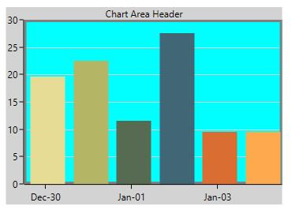

# Area in WPF Charts (SfChart)

Chart area represents the entire chart and all its elements. It’s a virtual rectangular area that includes all the chart elements like axis, legends, series, etc. 

The following are the major properties of chart(SfChart):

* [`PrimaryAxis`](https://help.syncfusion.com/wpf/sfchart/axis#) –  Gets or sets the horizontal x axis for the chart.
* [`SecondaryAxis`](https://help.syncfusion.com/wpf/sfchart/axis#) –  Gets or sets the vertical y axis for the chart.
* [`Legend`](https://help.syncfusion.com/wpf/sfchart/legend#) –  Gets or sets the legend for the chart.
* [`Series`](https://help.syncfusion.com/wpf/sfchart/series#) –  Gets or sets the list of series in the chart.
* [`TechnicalIndicators`](https://help.syncfusion.com/wpf/sfchart/technical-indicators#) –  Gets or sets the various financial indicators for the chart.
* [`Behaviors`](https://help.syncfusion.com/wpf/sfchart/interactive-features#)–  Used to add one more interactive features to the chart.

## Customization

SfChart provides the properties like [`AreaBorderBrush`](https://help.syncfusion.com/cr/wpf/Syncfusion.UI.Xaml.Charts.SfChart.html#Syncfusion_UI_Xaml_Charts_SfChart_AreaBorderBrush), [`AreaBorderThickness`](https://help.syncfusion.com/cr/wpf/Syncfusion.UI.Xaml.Charts.SfChart.html#Syncfusion_UI_Xaml_Charts_SfChart_AreaBorderThickness), [`AreaBackground`](https://help.syncfusion.com/cr/wpf/Syncfusion.UI.Xaml.Charts.SfChart.html#Syncfusion_UI_Xaml_Charts_SfChart_AreaBackground) and `Background` for customizing the plot area.

The following code examples illustrates the usage of these properties:





<chart:SfChart Height="250" Width="350" 

Header="Chart Area Header" 

AreaBackground="Cyan" 

Background="LightGray" 

AreaBorderBrush="Gray" 

AreaBorderThickness="3" >





SfChart chart = new SfChart();

chart.Header = "Chart Area Header";

chart.AreaBackground = new SolidColorBrush(Colors.Cyan);

chart.Background = new SolidColorBrush(Colors.LightGray);

chart.AreaBorderBrush = new SolidColorBrush(Colors.Gray);

chart.AreaBorderThickness = new Thickness(3);





## Multiple Area 

You can split plot area into multiple rows and columns using [`ChartRowDefinition`](https://help.syncfusion.com/cr/wpf/Syncfusion.UI.Xaml.Charts.ChartBase.html#Syncfusion_UI_Xaml_Charts_ChartBase_RowDefinitions) and [`ChartColumnDefinition`](https://help.syncfusion.com/cr/wpf/Syncfusion.UI.Xaml.Charts.ChartBase.html#Syncfusion_UI_Xaml_Charts_ChartBase_ColumnDefinitions) like Grid panel’s row and column definition. 

The following code example demonstrates, how you can create multiple panes in the chart area:





<chart:SfChart >

<!--Adding row definition to the chart-->

<chart:SfChart.RowDefinitions>

<chart:ChartRowDefinition/>

<chart:ChartRowDefinition/>

</chart:SfChart.RowDefinitions>

<!--Adding column definition to the chart-->

<chart:SfChart.ColumnDefinitions>

<chart:ChartColumnDefinition/>

<chart:ChartColumnDefinition/>

</chart:SfChart.ColumnDefinitions>

<chart:SfChart.PrimaryAxis>

<chart:CategoryAxis chart:ChartBase.ColumnSpan="2"/>

</chart:SfChart.PrimaryAxis>

<chart:SfChart.SecondaryAxis>

<chart:NumericalAxis  PlotOffset="13" chart:ChartBase.ColumnSpan="2" />

</chart:SfChart.SecondaryAxis>

<chart:ColumnSeries Palette="LightCandy"

ItemsSource="{Binding SneakersDetail}"         

XBindingPath="Brand" 

YBindingPath="ItemsCount1" />

<chart:ColumnSeries Palette="Metro"

ItemsSource="{Binding SneakersDetail}"  

XBindingPath="Brand" 

YBindingPath="ItemsCount" >

<chart:ColumnSeries.YAxis>

<chart:NumericalAxis  PlotOffset="10"

chart:SfChart.Row="1" >

</chart:NumericalAxis>

</chart:ColumnSeries.YAxis>

</chart:ColumnSeries>

</chart:SfChart>





SfChart chart = new SfChart();

chart.RowDefinitions.Add(new ChartRowDefinition());

chart.RowDefinitions.Add(new ChartRowDefinition());

chart.ColumnDefinitions.Add(new ChartColumnDefinition());

chart.ColumnDefinitions.Add(new ChartColumnDefinition());

CategoryAxis xAxis = new CategoryAxis();

ChartBase.SetColumnSpan(xAxis, 2);

chart.PrimaryAxis = xAxis;

NumericalAxis yAxis = new NumericalAxis();

yAxis.PlotOffset = 13;

ChartBase.SetColumnSpan(yAxis, 2);

chart.SecondaryAxis = yAxis;

ColumnSeries columnSeries1 = new ColumnSeries()
{

    ItemsSource = new ViewModel().SneakersDetail,

    XBindingPath = "Brand",

    YBindingPath = "ItemsCount",

    Palette = ChartColorPalette.LightCandy,

};

NumericalAxis axis = new NumericalAxis();

axis.PlotOffset = 10;

SfChart.SetRow(axis, 1);

ColumnSeries columnSeries2 = new ColumnSeries()
{
    
    ItemsSource = new ViewModel().SneakersDetail,

    XBindingPath = "Brand",

    YBindingPath = "ItemsCount1",

    Palette = ChartColorPalette.Metro,

    YAxis = axis

};

chart.Series.Add(columnSeries1);

chart.Series.Add(columnSeries2);





## Column Span and Row Span

These can be used to specify the number of column or rows up to which the axis can extend. Same like Grid’s RowSpan or ColumnSpan property, it is also an attached property.

You can set the row span in chart like the following code example.





<chart:SfChart>

<!--Adding row definition to the chart-->

<chart:SfChart.RowDefinitions>

<chart:ChartRowDefinition/>

<chart:ChartRowDefinition/>

</chart:SfChart.RowDefinitions>

<chart:SfChart.PrimaryAxis>

<chart:CategoryAxis   chart:ChartBase.RowSpan="2" 

chart:SfChart.Row="0"

TickLinesPosition="Outside">                                                              

</chart:CategoryAxis>

</chart:SfChart.PrimaryAxis>

<chart:SfChart.SecondaryAxis>

<chart:NumericalAxis />

</chart:SfChart.SecondaryAxis>

<chart:ColumnSeries XBindingPath="Brand"

ItemsSource="{Binding SneakersDetail}"  

YBindingPath="ItemsCount1" 

/>

<chart:LineSeries Interior="CadetBlue" XBindingPath="Brand"

ItemsSource="{Binding SneakersDetail}"   

YBindingPath="ItemsCount">

<chart:LineSeries.YAxis>

<chart:NumericalAxis chart:ChartBase.RowSpan="2">

</chart:NumericalAxis>

</chart:LineSeries.YAxis>              

</chart:LineSeries>

</chart:SfChart>





SfChart chart = new SfChart();

chart.RowDefinitions.Add(new ChartRowDefinition());

chart.RowDefinitions.Add(new ChartRowDefinition());

chart.ColumnDefinitions.Add(new ChartColumnDefinition());

chart.ColumnDefinitions.Add(new ChartColumnDefinition());

CategoryAxis xAxis = new CategoryAxis();

xAxis.TickLinesPosition = AxisElementPosition.Outside;

ChartBase.SetColumnSpan(xAxis, 2);

SfChart.SetRow(xAxis, 0);

chart.PrimaryAxis = xAxis;

NumericalAxis yAxis = new NumericalAxis();

ChartBase.SetColumnSpan(yAxis, 2);

chart.SecondaryAxis = yAxis;

ColumnSeries columnSeries1 = new ColumnSeries()
{

    ItemsSource = new ViewModel().SneakersDetail,

    XBindingPath = "Brand",

    YBindingPath = "ItemsCount1",

};

NumericalAxis axis = new NumericalAxis();

axis.PlotOffset = 10;

ChartBase.SetColumnSpan(axis, 2);

LineSeries lineSeries = new LineSeries()
{

    ItemsSource = new ViewModel().SneakersDetail,

    XBindingPath = "Brand",

    YBindingPath = "ItemsCount",

    Interior = new SolidColorBrush(Colors.CadetBlue),

    YAxis = axis

};

chart.Series.Add(columnSeries1);

chart.Series.Add(lineSeries);





## Clone or copy the chart

More like serialization, you can use [`Clone`](https://help.syncfusion.com/cr/wpf/Syncfusion.UI.Xaml.Charts.ChartBase.html#Syncfusion_UI_Xaml_Charts_ChartBase_Clone) method for SfChart control state persistence. This method creates a copy of the chart instance.



var chartCopy = chart.Clone() as SfChart;

grid.Children.Add(chartCopy as SfChart);

//Here, 'grid' is an empty container in the application to hold the chart. 



T> You can use this method for copy and paste like requirement, by cloning chart upon copy and reload while pasting.

**See also**

[`PointToValue`](https://help.syncfusion.com/cr/wpf/Syncfusion.UI.Xaml.Charts.ChartBase.html#Syncfusion_UI_Xaml_Charts_ChartBase_PointToValue_Syncfusion_UI_Xaml_Charts_ChartAxis_System_Windows_Point_)

[`ValueToPoint`](https://help.syncfusion.com/cr/wpf/Syncfusion.UI.Xaml.Charts.SfChart.html#Syncfusion_UI_Xaml_Charts_SfChart_ValueToPoint_Syncfusion_UI_Xaml_Charts_ChartAxis_System_Double_)

[`Save`](https://help.syncfusion.com/wpf/sfchart/exporting#)

[`Print`](https://help.syncfusion.com/wpf/sfchart/printing#)

