# Axis in WPF Charts (SfChart)

[`ChartAxis`](https://help.syncfusion.com/cr/wpf/Syncfusion.UI.Xaml.Charts.ChartAxis.html#) is used to locate a data point inside the chart area. Charts typically have two axes that are used to measure and categorize data: a vertical (Y) axis, and a horizontal (X) axis.

Vertical(Y) axis always uses numerical scale. Horizontal(X) axis supports the following types of scale:

* Category
* Numeric
* Date time
* Logarithmic Axis

The following are the API’s in ChartAxis

* [`ArrangeRect`](https://help.syncfusion.com/cr/wpf/Syncfusion.UI.Xaml.Charts.ChartAxis.html#Syncfusion_UI_Xaml_Charts_ChartAxis_ArrangeRect) – Represents the bounds of chart axis size. 

* [`VisibleRange`](https://help.syncfusion.com/cr/wpf/Syncfusion.UI.Xaml.Charts.ChartAxis.html#Syncfusion_UI_Xaml_Charts_ChartAxis_VisibleRange) – Represents the axis start and end visible values as follows.

<table>
<tr>
<td>
[`Start`](https://help.syncfusion.com/cr/wpf/Syncfusion.UI.Xaml.Charts.DoubleRange.html#Syncfusion_UI_Xaml_Charts_DoubleRange_Start)
</td>
<td>
Gets the start value of the visible range.
</td>
</tr>
<tr>
<td>
[`End`](https://help.syncfusion.com/cr/wpf/Syncfusion.UI.Xaml.Charts.DoubleRange.html#Syncfusion_UI_Xaml_Charts_DoubleRange_End)
</td>
<td>
Gets the end value of the visible range.
</td>
</tr>
<tr>
<td>
[`Delta`](https://help.syncfusion.com/cr/wpf/Syncfusion.UI.Xaml.Charts.DoubleRange.html#Syncfusion_UI_Xaml_Charts_DoubleRange_Delta)
</td>
<td>
Gets the delta value of the visible range.
</td>
</tr>
<tr>
<td>
[`Empty`](https://help.syncfusion.com/cr/wpf/Syncfusion.UI.Xaml.Charts.DoubleRange.html#Syncfusion_UI_Xaml_Charts_DoubleRange_Empty)
</td>
<td>
Gets the empty value of the visible range.
</td>
</tr>
<tr>
<td>
[`IsEmpty`](https://help.syncfusion.com/cr/wpf/Syncfusion.UI.Xaml.Charts.DoubleRange.html#Syncfusion_UI_Xaml_Charts_DoubleRange_IsEmpty)
</td>
<td>
Gets a value indicating whether the visible range is empty or not.
</td>
</tr>
<tr>
<td>
[`Median`](https://help.syncfusion.com/cr/wpf/Syncfusion.UI.Xaml.Charts.DoubleRange.html#Syncfusion_UI_Xaml_Charts_DoubleRange_Median)
</td>
<td>
Gets the median value of the visible range.
</td>
</tr>
</table>

* [`VisibleLabels`](https://help.syncfusion.com/cr/wpf/Syncfusion.UI.Xaml.Charts.ChartAxis.html#Syncfusion_UI_Xaml_Charts_ChartAxis_VisibleLabels) – Represents the axis label collection which are visible in axis.

The following topics explains in detail about the axis and its parts

## Header

In [`ChartAxis`](https://help.syncfusion.com/cr/wpf/Syncfusion.UI.Xaml.Charts.ChartAxis.html#) you can define any object as header using [`Header`](https://help.syncfusion.com/cr/wpf/Syncfusion.UI.Xaml.Charts.ChartAxis.html#Syncfusion_UI_Xaml_Charts_ChartAxis_Header) property. The following code example demonstrates the defining header in primary and secondary axis. 





<syncfusion:SfChart.PrimaryAxis>

<syncfusion:CategoryAxis Header="Metals"/>

</syncfusion:SfChart.PrimaryAxis>

<syncfusion:SfChart.SecondaryAxis>

<syncfusion:NumericalAxis Header="Values(In Tonnes)"/>

</syncfusion:NumericalAxis>

</syncfusion:SfChart.SecondaryAxis>





chart.PrimaryAxis = new CategoryAxis() { Header = "Medals" };

chart.SecondaryAxis = new NumericalAxis() { Header = "Values(In Tonnes)" };





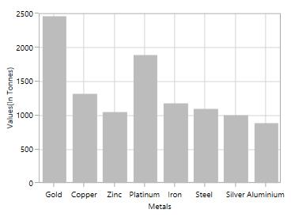

**Header** **Customization**

Default appearance of the header can be customized using [`HeaderTemplate`](https://help.syncfusion.com/cr/wpf/Syncfusion.UI.Xaml.Charts.ChartAxis.html#Syncfusion_UI_Xaml_Charts_ChartAxis_HeaderTemplate) property. The following code snippet demonstrates the header customization.





 <syncfusion:SfChart x:Name="chart">

    <syncfusion:SfChart.Resources>

        <DataTemplate x:Key="headerTemplate1">

            <Border BorderBrush="Black" CornerRadius="5" BorderThickness="1">

                    <TextBlock Text="Demands" FontSize="12" 
                                   
                               FontStyle="Italic" 
                                   
                               FontWeight="Bold" Margin="3"/>

            </Border>

        </DataTemplate>

        <DataTemplate x:Key="headerTemplate2">

            <Border BorderBrush="Black" CornerRadius="5" BorderThickness="1">

                    <TextBlock FontSize="12" Margin="3"
                                   
                               FontStyle="Italic" FontWeight="Bold"/>

            </Border>

        </DataTemplate>

    </syncfusion:SfChart.Resources>

    <syncfusion:SfChart.PrimaryAxis>

        <syncfusion:CategoryAxis HeaderTemplate="{StaticResource headerTemplate1}"/>

    </syncfusion:SfChart.PrimaryAxis>

    <syncfusion:SfChart.SecondaryAxis>

        <syncfusion:NumericalAxis Header="Values(In Tonnes)"
                                          
                                  HeaderTemplate="{StaticResource headerTemplate2}"/>

    </syncfusion:SfChart.SecondaryAxis>
        
</syncfusion:SfChart>





chart.PrimaryAxis = new CategoryAxis()
{

    HeaderTemplate = chart.Resources["headerTemplate1"] as DataTemplate

};

chart.SecondaryAxis = new NumericalAxis()
{

    HeaderTemplate = chart.Resources["headerTemplate2"] as DataTemplate

};





**HeaderStyle**

[`HeaderStyle`](https://help.syncfusion.com/cr/wpf/Syncfusion.UI.Xaml.Charts.ChartAxis.html#Syncfusion_UI_Xaml_Charts_ChartAxis_HeaderStyle) property is used to provide style for the axis header. The following code example explains header style customization.





<syncfusion:SfChart.PrimaryAxis>

<syncfusion:CategoryAxis Header="Metals" >

<syncfusion:CategoryAxis.HeaderStyle>

<syncfusion:LabelStyle FontFamily="Algerian" FontSize="13" Foreground="Black"> 

</syncfusion:LabelStyle>

</syncfusion:CategoryAxis.HeaderStyle>

</syncfusion:CategoryAxis>

</syncfusion:SfChart.PrimaryAxis>

<syncfusion:SfChart.SecondaryAxis>

<syncfusion:NumericalAxis Header="Values(In Tonnes)"/>

<syncfusion:NumericalAxis.HeaderStyle>

<syncfusion:LabelStyle FontFamily="Algerian" FontSize="13" Foreground="Black"> 

</syncfusion:LabelStyle>

</syncfusion:NumericalAxis.HeaderStyle>

</syncfusion:NumericalAxis>

</syncfusion:SfChart.SecondaryAxis>





LabelStyle style = new LabelStyle()
{

    FontFamily = new FontFamily("Algerian"),

    FontSize = 13,

    Foreground = new SolidColorBrush(Colors.Black)

};

chart.PrimaryAxis = new CategoryAxis()
{

    Header = "Medals",

    LabelStyle = style

};

chart.SecondaryAxis = new NumericalAxis()
{

    Header = "Values(In Tonnes)",

    LabelStyle = style

};





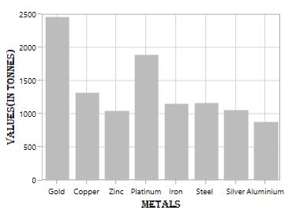

## Axis Labels

Labels will be generated by the range and the values binded to [`XBindingPath`](https://help.syncfusion.com/cr/wpf/Syncfusion.UI.Xaml.Charts.ChartSeriesBase.html#Syncfusion_UI_Xaml_Charts_ChartSeriesBase_XBindingPath) or [`YBindingPath`](https://help.syncfusion.com/cr/wpf/Syncfusion.UI.Xaml.Charts.XyDataSeries.html#Syncfusion_UI_Xaml_Charts_XyDataSeries_YBindingPath) properties.

**Positioning** **the** **Labels**

The [`LabelsPosition`](https://help.syncfusion.com/cr/wpf/Syncfusion.UI.Xaml.Charts.ChartAxis.html#Syncfusion_UI_Xaml_Charts_ChartAxis_LabelsPosition) property is used to position the axis label either inside or outside the chart plotting area. By default, LabelsPosition is [`Outside`](https://help.syncfusion.com/cr/wpf/Syncfusion.UI.Xaml.Charts.AxisElementPosition.html).

**Inside**





<syncfusion:SfChart.PrimaryAxis>

<syncfusion:NumericalAxis  LabelsPosition="Inside">

</syncfusion:NumericalAxis>

</syncfusion:SfChart.PrimaryAxis>





chart.PrimaryAxis = new NumericalAxis()
{

    LabelsPosition = AxisElementPosition.Inside

};





**LabelRotationAngle**

[`LabelRotationAngle`](https://help.syncfusion.com/cr/wpf/Syncfusion.UI.Xaml.Charts.ChartAxis.html#Syncfusion_UI_Xaml_Charts_ChartAxis_LabelRotationAngle) property allows you to define the angle for the label content. The following code example illustrates the [`LabelRotationAngle`](https://help.syncfusion.com/cr/wpf/Syncfusion.UI.Xaml.Charts.ChartAxis.html#Syncfusion_UI_Xaml_Charts_ChartAxis_LabelRotationAngle).





<syncfusion:SfChart.PrimaryAxis>

<syncfusion:DateTimeAxis  LabelRotationAngle="90" >

</syncfusion:DateTimeAxis>

</syncfusion:SfChart.PrimaryAxis>





chart.PrimaryAxis = new DateTimeAxis()
{

     LabelRotationAngle = 90

};





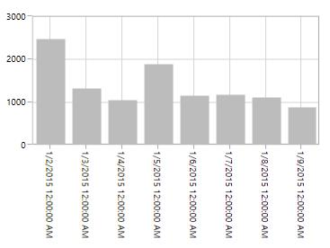

**Custom** **Labels**

SfChart allows user to define the labels for the axis. For defining the axis label you have to set the [`LabelContent`](https://help.syncfusion.com/cr/wpf/Syncfusion.UI.Xaml.Charts.ChartAxisLabel.html#Syncfusion_UI_Xaml_Charts_ChartAxisLabel_LabelContent) and [`Position`](https://help.syncfusion.com/cr/wpf/Syncfusion.UI.Xaml.Charts.ChartAxisLabel.html#Syncfusion_UI_Xaml_Charts_ChartAxisLabel_Position) property .You can define the labels using [`CustomLabels`](https://help.syncfusion.com/cr/wpf/Syncfusion.UI.Xaml.Charts.ChartAxis.html#Syncfusion_UI_Xaml_Charts_ChartAxis_CustomLabels) property as in the below code snippet.





<syncfusion:SfChart.PrimaryAxis>

<syncfusion:CategoryAxis >

<syncfusion:CategoryAxis.CustomLabels>

<syncfusion:ChartAxisLabel Position="0" LabelContent="0-1"/>

<syncfusion:ChartAxisLabel Position="1" LabelContent="1-2"/>

<syncfusion:ChartAxisLabel Position="2" LabelContent="2-3"/>

<syncfusion:ChartAxisLabel Position="3" LabelContent="3-4"/>

<syncfusion:ChartAxisLabel Position="4" LabelContent="4-5"/>

<syncfusion:ChartAxisLabel Position="5" LabelContent="5-5"/>

</syncfusion:CategoryAxis.CustomLabels>

</syncfusion:CategoryAxis>

</syncfusion:SfChart.PrimaryAxis>





CategoryAxis axis = new CategoryAxis();

axis.CustomLabels.Add(new ChartAxisLabel() { Position = 0, LabelContent = "0-1" });

axis.CustomLabels.Add(new ChartAxisLabel() { Position = 1, LabelContent = "1-2" });

axis.CustomLabels.Add(new ChartAxisLabel() { Position = 2, LabelContent = "2-3" });

axis.CustomLabels.Add(new ChartAxisLabel() { Position = 3, LabelContent = "3-4" });

axis.CustomLabels.Add(new ChartAxisLabel() { Position = 4, LabelContent = "4-5" });

axis.CustomLabels.Add(new ChartAxisLabel() { Position = 5, LabelContent = "5-5" });

chart.PrimaryAxis = axis;





You can also directly bind the collection of labels to the [`LabelsSource`](https://help.syncfusion.com/cr/wpf/Syncfusion.UI.Xaml.Charts.ChartAxis.html#Syncfusion_UI_Xaml_Charts_ChartAxis_LabelsSource) property for defining custom labels. The following code example demonstrates the defining the label collection in code behind and binding the property in XAML page.





<syncfusion:SfChart.PrimaryAxis>

<syncfusion:CategoryAxis LabelsSource="{Binding Labels}" ContentPath="Content" PositionPath="Position">

</syncfusion:CategoryAxis>

</syncfusion:SfChart.PrimaryAxis>





chart.PrimaryAxis = new CategoryAxis()
{

    ContentPath ="Content",

    PositionPath = "Position",

    LabelsSource = Labels

};

public List<LabelItem> Labels { get; set; }

Labels = new List<LabelItem>

{

    new LabelItem() {Position=0, Content = "0-1"},

    new LabelItem() {Position=1, Content = "1-2"},

    new LabelItem() {Position=2, Content = "2-3"},

    new LabelItem() {Position=3, Content = "3-4"},

    new LabelItem() {Position=4, Content = "4-5"},

    new LabelItem() {Position=5, Content = "5-6"},

    new LabelItem() {Position=6, Content = "6-7"},

    new LabelItem() {Position=7, Content = "7-8"},

};

public class LabelItem

{

    public string Content { get; set; }

    public int Position { get; set; }

}





**Label** **Formatting**

Axis labels can be formatting by predefined formatting types based on the axis types.

**DateTimeAxis**





<syncfusion:SfChart.PrimaryAxis>

<syncfusion:DateTimeAxis LabelFormat="MMM/dd" FontSize="12" >

</syncfusion:DateTimeAxis>

</syncfusion:SfChart.PrimaryAxis>





chart.PrimaryAxis = new DateTimeAxis()
{

    LabelFormat = "MM/dd",

    FontSize = 12

};





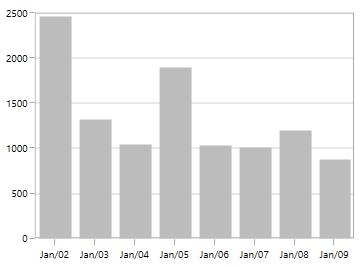

**TimeSpanAxis**





<syncfusion:SfChart.PrimaryAxis>

<syncfusion:TimeSpanAxis LabelFormat="g" ></syncfusion:TimeSpanAxis>

</syncfusion:SfChart.PrimaryAxis>





chart.PrimaryAxis = new TimeSpanAxis()
{

    LabelFormat = "g",

};





**NumericalAxis**





<syncfusion:SfChart.SecondaryAxis>

<syncfusion:NumericalAxis LabelFormat="0.00" />

</syncfusion:SfChart.SecondaryAxis>





chart.PrimaryAxis = new NumericalAxis()
{

    LabelFormat = "0.00",

};





**Adding** **Units** **to** **Labels**

To display the measuring units, it can be added as a prefix or suffix to the axis labels. This can be achieved using the [`PrefixLabelTemplate`](https://help.syncfusion.com/cr/wpf/Syncfusion.UI.Xaml.Charts.ChartAxis.html#Syncfusion_UI_Xaml_Charts_ChartAxis_PrefixLabelTemplate) and [`PostfixLabelTemplate`](https://help.syncfusion.com/cr/wpf/Syncfusion.UI.Xaml.Charts.ChartAxis.html#Syncfusion_UI_Xaml_Charts_ChartAxis_PostfixLabelTemplate) properties.

**PrefixLabelTemplate**





<syncfusion:SfChart x:Name="chart">

    <syncfusion:SfChart.Resources>

        <DataTemplate x:Key="prefixLabelTemplate">

             <TextBlock FontSize="10" VerticalAlignment="Center" 
                               
                               Text="$"/>

        </DataTemplate>
                
    </syncfusion:SfChart.Resources>

    <syncfusion:SfChart.SecondaryAxis>

         <syncfusion:NumericalAxis FontSize="10" 
                                          
                                   PrefixLabelTemplate="{StaticResource prefixLabelTemplate}"/>

    </syncfusion:SfChart.SecondaryAxis>

 </syncfusion:SfChart>





chart.SecondaryAxis = new NumericalAxis()
{

    PrefixLabelTemplate = chart.Resources["prefixLabelTemplate"] as DataTemplate

};





**PostfixLabelTemplate**





  <syncfusion:SfChart x:Name="chart">

    <syncfusion:SfChart.Resources>

        <DataTemplate x:Key="postfixLabelTemplate">

             TextBlock FontSize="10" VerticalAlignment="Center" Text="K"/>

        </DataTemplate>

    </syncfusion:SfChart.Resources>

    <syncfusion:SfChart.SecondaryAxis>

        <syncfusion:NumericalAxis FontSize="10" 
                                          
                                  PostfixLabelTemplate="{StaticResource postfixLabelTemplate}"/>

    </syncfusion:SfChart.SecondaryAxis>

</syncfusion:SfChart>





chart.SecondaryAxis = new NumericalAxis()
{

    PostfixLabelTemplate = chart.Resources["postfixLabelTemplate"] as DataTemplate

};





**LabelTemplate**

[`LabelTemplate`](https://help.syncfusion.com/cr/wpf/Syncfusion.UI.Xaml.Charts.ChartAxis.html#Syncfusion_UI_Xaml_Charts_ChartAxis_LabelTemplate) property allows you to define the appearance for the axis labels .the following code example illustrates the [`LabelTemplate`](https://help.syncfusion.com/cr/wpf/Syncfusion.UI.Xaml.Charts.ChartAxis.html#Syncfusion_UI_Xaml_Charts_ChartAxis_LabelTemplate) property.





<syncfusion:SfChart x:Name="chart">

    <syncfusion:SfChart.Resources>

        <DataTemplate x:Key="labelTemplate">

            <Border Background="Gray" CornerRadius="5" >

                    <TextBlock Text="{Binding LabelContent}" Foreground="White"
                                   
                                FontStyle="Normal" FontSize="10" 
                                   
                                FontWeight="Bold" Margin="3"/>

                    <Border.Effect>

                        <DropShadowEffect ShadowDepth="6" Direction="315"
                                              
                                          Color="LightGray" Opacity="0.25"
                                              
                                          BlurRadius="0.8" />

                    </Border.Effect>

            </Border>

       </DataTemplate>

    </syncfusion:SfChart.Resources>

    <syncfusion:SfChart.PrimaryAxis>

        <syncfusion:CategoryAxis LabelTemplate="{StaticResource labelTemplate}"/>

    </syncfusion:SfChart.PrimaryAxis>

</syncfusion:SfChart>





chart.PrimaryAxis = new CategoryAxis()
{

    LabelTemplate = chart.Resources["labelTemplate"] as DataTemplate

};





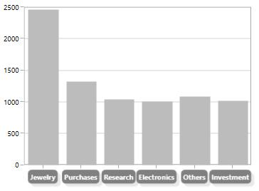

**LabelExtent**

This property allows us to set the distance between the axis header and the axis using [`LabelExtent`](https://help.syncfusion.com/cr/wpf/Syncfusion.UI.Xaml.Charts.ChartAxis.html#Syncfusion_UI_Xaml_Charts_ChartAxis_LabelExtent) property.The following code snippet defines the [`LabelExtent`](https://help.syncfusion.com/cr/wpf/Syncfusion.UI.Xaml.Charts.ChartAxis.html#Syncfusion_UI_Xaml_Charts_ChartAxis_LabelExtent) property.





<syncfusion:SfChart.PrimaryAxis>

<syncfusion:CategoryAxis Header="Demand" LabelExtent="50" >

</syncfusion:CategoryAxis>





chart.PrimaryAxis = new NumericalAxis()
{

    Header = "Demand",

    LabelExtent = 50

};





**Smart** **Axis** **Labels**

When there are more number of axis labels, they may overlap with each other. SfChart provides support to handle the overlapping labels using the [`LabelsIntersectAction`](https://help.syncfusion.com/cr/wpf/Syncfusion.UI.Xaml.Charts.ChartAxis.html#Syncfusion_UI_Xaml_Charts_ChartAxis_LabelsIntersectAction) property. By default the [`LabelsIntersectAction`](https://help.syncfusion.com/cr/wpf/Syncfusion.UI.Xaml.Charts.ChartAxis.html#Syncfusion_UI_Xaml_Charts_ChartAxis_LabelsIntersectAction) value is [`Hide`](https://help.syncfusion.com/cr/wpf/Syncfusion.UI.Xaml.Charts.AxisLabelsIntersectAction.html).

The following are the options for intersecting action.

* None
* Hide
* MultipleRows
* Rotate

**None**

None option is used to display all the label even if it intersects. The following code snippet demonstrates the LabelsIntersectAction as None option.





<syncfusion:SfChart.PrimaryAxis>

<syncfusion:CategoryAxis LabelsIntersectAction="None"/>

</syncfusion:SfChart.PrimaryAxis>





chart.PrimaryAxis = new CategoryAxis()
{

    LabelsIntersectAction = AxisLabelsIntersectAction.None

};





**Hide**

Hide option is used to hide the labels if it intersects .You can define the hide as shown in the below code snippet.





<syncfusion:SfChart.PrimaryAxis>

<syncfusion:DateTimeAxis  LabelsIntersectAction="Hide"/>

</syncfusion:SfChart.PrimaryAxis>





chart.PrimaryAxis = new DateTimeAxis()
{

    LabelsIntersectAction = AxisLabelsIntersectAction.Hide

};





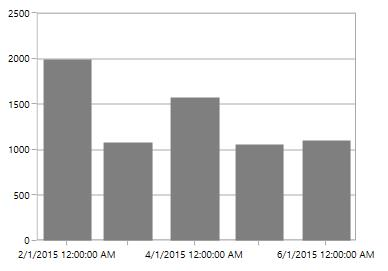

**MultipleRows**

This option is used to move the labels to next row if it intersects .The following code demonstrates the MultipleRows option in [`LabelsIntersectAction`](https://help.syncfusion.com/cr/wpf/Syncfusion.UI.Xaml.Charts.ChartAxis.html#Syncfusion_UI_Xaml_Charts_ChartAxis_LabelsIntersectAction).





<syncfusion:SfChart.PrimaryAxis>

<syncfusion:DateTimeAxis  LabelsIntersectAction="MultipleRows">

</syncfusion:DateTimeAxis>

</syncfusion:SfChart.PrimaryAxis>





chart.PrimaryAxis = new DateTimeAxis()
{

    LabelsIntersectAction = AxisLabelsIntersectAction.MultipleRows

};





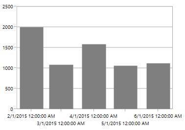

**Auto**

This option in [`LabelsIntersectAction`](https://help.syncfusion.com/cr/wpf/Syncfusion.UI.Xaml.Charts.ChartAxis.html#Syncfusion_UI_Xaml_Charts_ChartAxis_LabelsIntersectAction) property is used to rotate the labels if it intersects .The following code snippet and image demonstrates the rotate option in [`LabelsIntersectAction`](https://help.syncfusion.com/cr/wpf/Syncfusion.UI.Xaml.Charts.ChartAxis.html#Syncfusion_UI_Xaml_Charts_ChartAxis_LabelsIntersectAction) property.





<syncfusion:CategoryAxis LabelsIntersectAction="Auto">

</syncfusion:CategoryAxis>





chart.PrimaryAxis = new CategoryAxis()
{

    LabelsIntersectAction = AxisLabelsIntersectAction.Auto

};





**EdgeLabelsDrawingMode**

SfChart provides support to customize the position of the edge labels in axis using the [`EdgeLabelsDrawingMode`](https://help.syncfusion.com/cr/wpf/Syncfusion.UI.Xaml.Charts.ChartAxis.html#Syncfusion_UI_Xaml_Charts_ChartAxis_EdgeLabelsDrawingMode) property. [`EdgeLabelsDrawingMode`](https://help.syncfusion.com/cr/wpf/Syncfusion.UI.Xaml.Charts.ChartAxis.html#Syncfusion_UI_Xaml_Charts_ChartAxis_EdgeLabelsDrawingMode) property default value is [`Center`](https://help.syncfusion.com/cr/wpf/Syncfusion.UI.Xaml.Charts.EdgeLabelsDrawingMode.html).

The following are the customizing options in [`EdgeLabelsDrawingMode`](https://help.syncfusion.com/cr/wpf/Syncfusion.UI.Xaml.Charts.ChartAxis.html#Syncfusion_UI_Xaml_Charts_ChartAxis_EdgeLabelsDrawingMode).

* Center- Positions the label with tick line as center.
* Fit- Position the gridline inside based on the edge label size.
* Hide- Hides the edge labels.
* Shift- Shifts the edge labels to the left or right so that it comes inside the chart area.

**Center**





<syncfusion:SfChart.PrimaryAxis>

<syncfusion:DateTimeAxis  EdgeLabelsDrawingMode="Center" >

</syncfusion:DateTimeAxis>

</syncfusion:SfChart.PrimaryAxis>





chart.PrimaryAxis = new DateTimeAxis()
{

    EdgeLabelsDrawingMode = EdgeLabelsDrawingMode.Center

};





**Shift**





<syncfusion:SfChart.PrimaryAxis>

<syncfusion:DateTimeAxis  EdgeLabelsDrawingMode="Shift" ></syncfusion:DateTimeAxis>

</syncfusion:SfChart.PrimaryAxis>





chart.PrimaryAxis = new DateTimeAxis()
{

    EdgeLabelsDrawingMode = EdgeLabelsDrawingMode.Shift

};





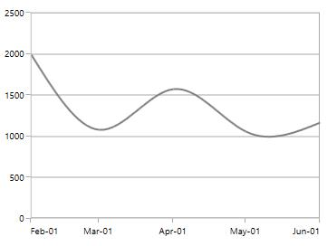

**Hide**





<syncfusion:SfChart.PrimaryAxis>

<syncfusion:DateTimeAxis  EdgeLabelsDrawingMode="Hide">

</syncfusion:DateTimeAxis>

</syncfusion:SfChart.PrimaryAxis>





chart.PrimaryAxis = new DateTimeAxis()
{

    EdgeLabelsDrawingMode = EdgeLabelsDrawingMode.Hide

};





**Fit**





<syncfusion:SfChart.PrimaryAxis>

<syncfusion:DateTimeAxis  EdgeLabelsDrawingMode="Fit">

</syncfusion:DateTimeAxis>

</syncfusion:SfChart.PrimaryAxis>





chart.PrimaryAxis = new DateTimeAxis()
{

    EdgeLabelsDrawingMode = EdgeLabelsDrawingMode.Fit

};





**EdgeLabelsVisibilityMode**

The visibility of the extreme labels of the axis can be controlled using [`EdgeLabelsVisibilityMode`](https://help.syncfusion.com/cr/wpf/Syncfusion.UI.Xaml.Charts.ChartAxis.html#Syncfusion_UI_Xaml_Charts_ChartAxis_EdgeLabelsVisibilityMode) property. By default the [`Default`](https://help.syncfusion.com/cr/wpf/Syncfusion.UI.Xaml.Charts.EdgeLabelsVisibilityMode.html) option in [`EdgeLabelsVisibilityMode`](https://help.syncfusion.com/cr/wpf/Syncfusion.UI.Xaml.Charts.ChartAxis.html#Syncfusion_UI_Xaml_Charts_ChartAxis_EdgeLabelsVisibilityMode) is set, which displays the edge label based on auto interval calculations .The following image depicts the default option in [`EdgeLabelsVisibilityMode`](https://help.syncfusion.com/cr/wpf/Syncfusion.UI.Xaml.Charts.ChartAxis.html#Syncfusion_UI_Xaml_Charts_ChartAxis_EdgeLabelsVisibilityMode) while zooming.

**Always** **Visible**

AlwaysVisible option in [`EdgeLabelsVisibilityMode`](https://help.syncfusion.com/cr/wpf/Syncfusion.UI.Xaml.Charts.ChartAxis.html#Syncfusion_UI_Xaml_Charts_ChartAxis_EdgeLabelsVisibilityMode) is used to view the edge labels even while performing zooming.

The following code example and image demonstrates the AlwaysVisible option while zooming.





<syncfusion:SfChart.PrimaryAxis>

<syncfusion:NumericalAxis EdgeLabelsVisibilityMode="AlwaysVisible" 

EnableScrollBar="True">

</syncfusion:NumericalAxis>

</syncfusion:SfChart.PrimaryAxis>





chart.PrimaryAxis = new NumericalAxis()
{

    EdgeLabelsVisibilityMode = EdgeLabelsVisibilityMode.AlwaysVisible

};





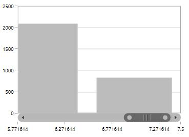

**Visible**

Visible option is used to display the edge labels (first and last label) irrespective of the auto interval calculation until zooming (i.e., in normal state)





<syncfusion:SfChart.PrimaryAxis>

<syncfusion:NumericalAxis EdgeLabelsVisibilityMode="Visible" EnableScrollBar="True" >

</syncfusion:NumericalAxis>

</syncfusion:SfChart.PrimaryAxis>





chart.PrimaryAxis = new NumericalAxis()
{

    EdgeLabelsVisibilityMode = EdgeLabelsVisibilityMode.Visible

};





**Axis Label Border**

[`ChartAxis`](https://help.syncfusion.com/wpf/sfchart/axis) provides support to place the border around its label. To place the border around axis, enable  [`ShowLabelBorder`](https://help.syncfusion.com/cr/wpf/Syncfusion.UI.Xaml.Charts.ChartAxisBase2D.html#Syncfusion_UI_Xaml_Charts_ChartAxisBase2D_ShowLabelBorderProperty) property of axis; it can be set as shown in the following code example.





<syncfusion:SfChart.PrimaryAxis>

<syncfusion:CategoryAxis ShowLabelBorder="True"/>

</syncfusion:SfChart.PrimaryAxis>

<syncfusion:SfChart.SecondaryAxis>

</syncfusion:NumericalAxis ShowLabelBorder="True"  />       

</syncfusion:SfChart.SecondaryAxis>





chart.PrimaryAxis = new CategoryAxis()
            
{
     ShowLabelBorder = true,                
};

chart.SecondaryAxis = new NumericalAxis()

{
    ShowLabelBorder = true
};





The border color and width can be customized with [`LabelBorderBrush`](https://help.syncfusion.com/cr/wpf/Syncfusion.UI.Xaml.Charts.ChartAxisBase2D.html#Syncfusion_UI_Xaml_Charts_ChartAxisBase2D_LabelBorderBrushProperty) and [`LabelBorderWidth`](https://help.syncfusion.com/cr/wpf/Syncfusion.UI.Xaml.Charts.ChartAxisBase2D.html#Syncfusion_UI_Xaml_Charts_ChartAxisBase2D_LabelBorderWidthProperty) properties of chart axis; it can be set as shown in the following code example.





<syncfusion:SfChart.PrimaryAxis>

<syncfusion:CategoryAxis LabelBorderWidth="3" ShowLabelBorder="True" LabelBorderBrush="Red"/>

</syncfusion:SfChart.PrimaryAxis>

<syncfusion:SfChart.SecondaryAxis>

</syncfusion:NumericalAxis ShowLabelBorder="True"  LabelBorderWidth="3" LabelBorderBrush="Red"/>       

</syncfusion:SfChart.SecondaryAxis>





chart.PrimaryAxis = new CategoryAxis()
            
{
    ShowLabelBorder = true,  

    LabelBorderWidth = 3,

    LabelBorderBrush = new SolidColorBrush(Colors.Red)
           
};

chart.SecondaryAxis = new NumericalAxis()

{
       ShowLabelBorder = true,

       LabelBorderWidth = 3,

       LabelBorderBrush = new SolidColorBrush(Colors.Red),
               
};





## Grid lines

By default, gridlines are automatically added to the [`ChartAxis`](https://help.syncfusion.com/cr/wpf/Syncfusion.UI.Xaml.Charts.ChartAxis.html#) in its defined intervals. SfChart supports customization of gridline. The visibility of the gridlines can be controlled using the [`ShowGridLines`](https://help.syncfusion.com/cr/wpf/Syncfusion.UI.Xaml.Charts.ChartAxis.html#Syncfusion_UI_Xaml_Charts_ChartAxis_ShowGridLines) property.

The following code example illustrates the [`ShowGridLines`](https://help.syncfusion.com/cr/wpf/Syncfusion.UI.Xaml.Charts.ChartAxis.html#Syncfusion_UI_Xaml_Charts_ChartAxis_ShowGridLines) property as false in the primary axis.





<syncfusion:SfChart.PrimaryAxis>

<syncfusion:NumericalAxis  ShowGridLines="False"  >

</syncfusion:NumericalAxis>

</syncfusion:SfChart.PrimaryAxis>





chart.PrimaryAxis = new NumericalAxis()
{

    ShowGridLines = false
    
};





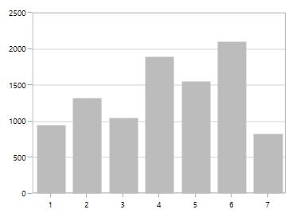

Style can also be applied to Major and Minor Gridlines using [`MajorGridLineStyle`](https://help.syncfusion.com/cr/wpf/Syncfusion.UI.Xaml.Charts.ChartAxis.html#Syncfusion_UI_Xaml_Charts_ChartAxis_MajorGridLineStyle) and [`MinorGridLineStyle`](https://help.syncfusion.com/cr/wpf/Syncfusion.UI.Xaml.Charts.ChartAxis.html#Syncfusion_UI_Xaml_Charts_ChartAxis_MinorGridLineStyle) properties.

**MajorGridLineStyle**





 <syncfusion:SfChart x:Name="chart">

     <syncfusion:SfChart.Resources>

         

    </syncfusion:SfChart.Resources>

    <syncfusion:SfChart.PrimaryAxis>

            <syncfusion:NumericalAxis MajorGridLineStyle="{StaticResource lineStyle}"/>

    </syncfusion:SfChart.PrimaryAxis>

</syncfusion:SfChart>





chart.PrimaryAxis = new NumericalAxis()
{

    MajorGridLineStyle = chart.Resources["lineStyle"] as Style 
    
};





**MinorGridLineStyle**

Minor gridlines will be added automatically when the small tick lines is defined inside the chart area.





  <syncfusion:SfChart x:Name="chart">

      <syncfusion:SfChart.Resources>

            

        </syncfusion:SfChart.Resources>

        <syncfusion:SfChart.SecondaryAxis>

                <syncfusion:NumericalAxis SmallTicksPerInterval="3" 
                                          
                                          MinorGridLineStyle="{StaticResource lineStyle}"/>

       </syncfusion:SfChart.SecondaryAxis>

</syncfusion:SfChart>





chart.PrimaryAxis = new NumericalAxis()
{

    SmallTicksPerInterval = 3,

    MinorGridLineStyle = chart.Resources["lineStyle"] as Style 
    
};





## Tick lines

Tick line are the small lines which is drawn on the axis line representing the axis labels .Tick lines will be drawn outside of the axis by default. 

**TickLineSize**

Tick lines thickness can be customized using [`TickLineSize`](https://help.syncfusion.com/cr/wpf/Syncfusion.UI.Xaml.Charts.ChartAxis.html#Syncfusion_UI_Xaml_Charts_ChartAxis_TickLineSize) property as shown in the below code snippet.





<syncfusion:SfChart.PrimaryAxis>

<syncfusion:NumericalAxis  TickLineSize="10" ></syncfusion:NumericalAxis>

</syncfusion:SfChart.PrimaryAxis>





chart.PrimaryAxis = new NumericalAxis()
{

   TickLineSize = 10 
    
};





**Positioning** **the** **Major** **Tick** **Lines**

Tick lines can be positioned inside or outside of the chart area using [`TickLinesPosition`](https://help.syncfusion.com/cr/wpf/Syncfusion.UI.Xaml.Charts.ChartAxis.html#Syncfusion_UI_Xaml_Charts_ChartAxis_TickLinesPosition) property. By default the tick lines will positioned outside of the chart area. The following code example demonstrates the positioning tick lines inside chart area.





<syncfusion:SfChart.PrimaryAxis>

<syncfusion:NumericalAxis TickLinesPosition="Inside">

</syncfusion:NumericalAxis>

</syncfusion:SfChart.PrimaryAxis>





chart.PrimaryAxis = new NumericalAxis()
{

   TickLinesPosition = AxisElementPosition.Inside
    
};





**Customization**

Style can be applied to major tick lines using [`MajorTickLineStyle`](https://help.syncfusion.com/cr/wpf/Syncfusion.UI.Xaml.Charts.ChartAxis.html#Syncfusion_UI_Xaml_Charts_ChartAxis_MajorTickLineStyle) property .The following code snippet demonstrates the styling of major tick lines.





 <syncfusion:SfChart x:Name="chart">

    <syncfusion:SfChart.Resources>

        

    </syncfusion:SfChart.Resources>

    <syncfusion:SfChart.SecondaryAxis>

                <syncfusion:NumericalAxis TickLineSize="10"
                                          
                                          MajorTickLineStyle="{StaticResource lineStyle}"/>

    </syncfusion:SfChart.SecondaryAxis>

 </syncfusion:SfChart>





chart.PrimaryAxis = new NumericalAxis()
{

    TickLineSize = 10,

    MajorTickLineStyle = chart.Resources["lineStyle"] as Style 
    
};





**MinorTickLines**

Minor tick lines can be added by defining [`SmallTicksPerInterval`](https://help.syncfusion.com/cr/wpf/Syncfusion.UI.Xaml.Charts.RangeAxisBase.html#Syncfusion_UI_Xaml_Charts_RangeAxisBase_SmallTicksPerInterval) property. This property will add the tick lines  to every interval.

The following code example demonstrates the small ticks set for every interval.





<syncfusion:SfChart.PrimaryAxis>

<syncfusion:NumericalAxis Interval="1" SmallTicksPerInterval="4" >

</syncfusion:NumericalAxis>

</syncfusion:SfChart.PrimaryAxis>





chart.PrimaryAxis = new NumericalAxis()
{

    Interval = 1,

    SmallTicksPerInterval = 4
    
};





**Positioning** **the** **minor** **tick** **lines**

Minor tick lines can be positioned inside or outside using [`SmallTickLinesPosition`](https://help.syncfusion.com/cr/wpf/Syncfusion.UI.Xaml.Charts.RangeAxisBase.html#Syncfusion_UI_Xaml_Charts_RangeAxisBase_SmallTickLinesPosition) property. By default the minor tick lines will be positioned outside.

The following code example demonstrates the positioning of minor tick lines inside the chart area.





<syncfusion:SfChart.PrimaryAxis>

<syncfusion:NumericalAxis SmallTicksPerInterval="2" SmallTickLinesPosition="Inside">

</syncfusion:NumericalAxis>

</syncfusion:SfChart.PrimaryAxis>





chart.PrimaryAxis = new NumericalAxis()
{

    SmallTicksPerInterval = 2,

    SmallTickLinesPosition = AxisElementPosition.Inside
    
};





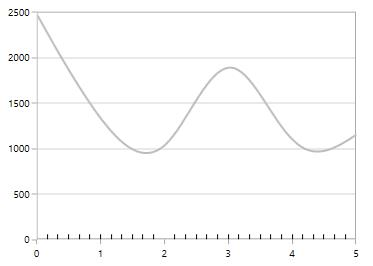

**Customization** **of** **Minor** **Ticklines**

The thickness of the minor tick lines can be customized using [`SmallTickLineSize`](https://help.syncfusion.com/cr/wpf/Syncfusion.UI.Xaml.Charts.RangeAxisBase.html#Syncfusion_UI_Xaml_Charts_RangeAxisBase_SmallTickLineSize) property as shown in the below code snippet.





<syncfusion:SfChart.PrimaryAxis>

<syncfusion:NumericalAxis Interval="1" SmallTicksPerInterval="3" SmallTickLineSize="10">

</syncfusion:NumericalAxis>

</syncfusion:SfChart.PrimaryAxis>





chart.PrimaryAxis = new NumericalAxis()
{

    Interval = 1,

    SmallTicksPerInterval = 3,

    SmallTickLineSize = 10
    
};





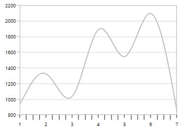

Styling customization of minor tick lines can be defined using [`MinorTickLineStyle`](https://help.syncfusion.com/cr/wpf/Syncfusion.UI.Xaml.Charts.ChartAxis.html#Syncfusion_UI_Xaml_Charts_ChartAxis_MinorTickLineStyle) property. The following code example and image demonstrates the style for minor tick lines.





 <syncfusion:SfChart x:Name="chart">

     <syncfusion:SfChart.Resources>

                

     </syncfusion:SfChart.Resources>

     <syncfusion:SfChart.SecondaryAxis>

            <syncfusion:NumericalAxis FontSize="12"  Interval="1"
                                          
                                      SmallTicksPerInterval="3" 
                                          
                                      TickLineSize="10" SmallTickLineSize="5"
                                          
                                      MinorTickLineStyle="{StaticResource lineStyle}"/>

    </syncfusion:SfChart.SecondaryAxis>

</syncfusion:SfChart>





chart.PrimaryAxis = new NumericalAxis()
{

    Interval = 1,

    SmallTicksPerInterval = 3,

    TickLineSize = 10,

    SmallTickLineSize = 5

    MinorTickLineStyle = chart.Resources["lineStyle"] as Style 
    
};





N> For category axis, small tick lines is not applicable since it is rendered based on index positions.

## Customize individual axis elements

The [`RangeStyles`](https://help.syncfusion.com/cr/wpf/Syncfusion.UI.Xaml.Charts.ChartAxis.html#Syncfusion_UI_Xaml_Charts_ChartAxis_RangeStyles) can be used to customize the gridlines, ticks and axis labels for a specific region of ChartAxis. The following properties are used to customize the specific range in an axis:

* [`Start`](https://help.syncfusion.com/cr/wpf/Syncfusion.UI.Xaml.Charts.ChartAxisRangeStyle.html#Syncfusion_UI_Xaml_Charts_ChartAxisRangeStyle_Start) - Sets the start range of an axis.
* [`End`](https://help.syncfusion.com/cr/wpf/Syncfusion.UI.Xaml.Charts.ChartAxisRangeStyle.html#Syncfusion_UI_Xaml_Charts_ChartAxisRangeStyle_End) - Sets the end range of an axis.
* [`MajorGridLineStyle`](https://help.syncfusion.com/cr/wpf/Syncfusion.UI.Xaml.Charts.ChartAxisRangeStyle.html#Syncfusion_UI_Xaml_Charts_ChartAxisRangeStyle_MajorGridLineStyle) - Customizes the major grid lines of an axis.
* [`MinorGridLineStyle`](https://help.syncfusion.com/cr/wpf/Syncfusion.UI.Xaml.Charts.ChartAxisRangeStyle.html#Syncfusion_UI_Xaml_Charts_ChartAxisRangeStyle_MinorGridLineStyle) -  Customizes the minor grid lines of an axis.
* [`MajorTickStyle`](https://help.syncfusion.com/cr/wpf/Syncfusion.UI.Xaml.Charts.ChartAxisRangeStyle.html#Syncfusion_UI_Xaml_Charts_ChartAxisRangeStyle_MajorTickLineStyle)  - Customizes the major tick lines of an axis.
* [`MinorTickStyle`](https://help.syncfusion.com/cr/wpf/Syncfusion.UI.Xaml.Charts.ChartAxisRangeStyle.html#Syncfusion_UI_Xaml_Charts_ChartAxisRangeStyle_MinorTickLineStyle) - Customizes the minor tick lines of an axis.
* [`LabelStyle`](https://help.syncfusion.com/cr/wpf/Syncfusion.UI.Xaml.Charts.ChartAxisRangeStyle.html#Syncfusion_UI_Xaml_Charts_ChartAxisRangeStyle_LabelStyle) -  Customizes the axis labels for a specific range.





  <syncfusion:SfChart.Resources>

         

         

</syncfusion:SfChart.Resources>

<syncfusion:SfChart.SecondaryAxis>  

    <syncfusion:NumericalAxis MajorGridLineStyle= "{StaticResource lineStyle}" MajorTickLineStyle="{StaticResource lineStyle}">
        <syncfusion:NumericalAxis.LabelStyle>
            <syncfusion:LabelStyle Foreground="Green"/>
        </syncfusion:NumericalAxis.LabelStyle>    
        <syncfusion:NumericalAxis.RangeStyles>
                <syncfusion:ChartAxisRangeStyleCollection>
                      <syncfusion:ChartAxisRangeStyle Start="18" End="22" MajorGridLineStyle= "{StaticResource RangeLineStyle}" MajorTickLineStyle = "{StaticResource RangeLineStyle}">                    <syncfusion:ChartAxisRangeStyle.LabelStyle>
            <syncfusion:LabelStyle Foreground="RoyalBlue" />
          </syncfusion:ChartAxisRangeStyle.LabelStyle>
                     </syncfusion:ChartAxisRangeStyle>
                </syncfusion:ChartAxisRangeStyleCollection>
            </syncfusion:NumericalAxis.RangeStyles>
    </syncfusion:NumericalAxis>

</syncfusion:SfChart.SecondaryAxis>





            NumericalAxis secondaryAxis = new NumericalAxis();

            secondaryAxis.MajorGridLineStyle = chart.Resources["lineStyle"] as Style ;

            secondaryAxis.MajorTickLineStyle = chart.Resources["lineStyle"] as Style;

            secondaryAxis.LabelStyle.Foreground = new SolidColorBrush(Colors.Green);
     
            ChartAxisRangeStyleCollection axisRangeStyles = new ChartAxisRangeStyleCollection();

            ChartAxisRangeStyle rangeStyle = new ChartAxisRangeStyle() { Start = 18, End = 22 };

            rangeStyle.MajorGridLineStyle = chart.Resources["RangeLineStyle"] as Style ;

            rangeStyle.LabelStyle = new LabelStyle();

            rangeStyle.LabelStyle.Foreground = new SolidColorBrush(Colors.RoyalBlue);

            rangeStyle.MajorTickLineStyle = chart.Resources["RangeLineStyle"] as Style;
            
            axisRangeStyles.Add(rangeStyle);

            secondaryAxis.RangeStyles = axisRangeStyles;

       chart.SecondaryAxis = secondaryAxis;
            





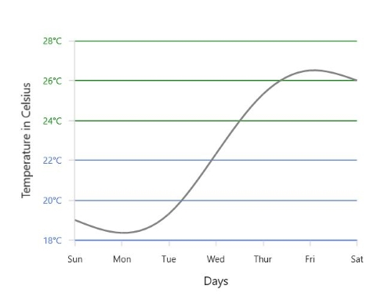

## AxisLine

SfChart provides support to customize the style of the axis line by defining the [`AxisLineStyle`](https://help.syncfusion.com/cr/wpf/Syncfusion.UI.Xaml.Charts.ChartAxis.html#Syncfusion_UI_Xaml_Charts_ChartAxis_AxisLineStyle) property as shown in the below code snippet.





<syncfusion:SfChart.PrimaryAxis>

<syncfusion:NumericalAxis  Interval="1" >

<syncfusion:NumericalAxis.AxisLineStyle>

</syncfusion:NumericalAxis.AxisLineStyle>

</syncfusion:NumericalAxis>

</syncfusion:SfChart.PrimaryAxis>





chart.PrimaryAxis = new NumericalAxis()
{

    Interval = 1,

    AxisLineStyle = chart.Resources["lineStyle"] as Style 
    
};





**Applying** **Padding** **to** **the** **Axis** **line**

The padding to the axis line is defined using [`AxisLineOffset`](https://help.syncfusion.com/cr/wpf/Syncfusion.UI.Xaml.Charts.ChartAxis.html#Syncfusion_UI_Xaml_Charts_ChartAxis_AxisLineOffset) property. The following code example demonstrates the setting [`AxisLineOffset`](https://help.syncfusion.com/cr/wpf/Syncfusion.UI.Xaml.Charts.ChartAxis.html#Syncfusion_UI_Xaml_Charts_ChartAxis_AxisLineOffset) for x axis.





<syncfusion:SfChart.PrimaryAxis>

<syncfusion:NumericalAxis AxisLineOffset="20" >

</syncfusion:NumericalAxis>

</syncfusion:SfChart.PrimaryAxis>





chart.PrimaryAxis = new NumericalAxis()
{

    AxisLineOffset = 20
    
};





## Origin Customization

SfChart allows you to customize the origin.By default the axis will be rendered having (0,0) as origin in x and y axes.

**ShowAxisNextToOrigin**

[`ShowAxisNextToOrigin`](https://help.syncfusion.com/cr/wpf/Syncfusion.UI.Xaml.Charts.ChartAxis.html#Syncfusion_UI_Xaml_Charts_ChartAxis_ShowAxisNextToOrigin) property is used to move the axis line to the origin value in [`Origin`](https://help.syncfusion.com/cr/wpf/Syncfusion.UI.Xaml.Charts.ChartAxis.html#Syncfusion_UI_Xaml_Charts_ChartAxis_Origin) property based on the x or y axes. .The following code example demonstrates shifting the axis in the origin value in numerical axis.





<syncfusion:SfChart.SecondaryAxis>

<syncfusion:NumericalAxis Origin="3" ShowAxisNextToOrigin="True">

</syncfusion:NumericalAxis>

</syncfusion:SfChart.SecondaryAxis>





chart.SecondaryAxis = new NumericalAxis()
{

    Origin = 3,

    ShowAxisNextToOrigin = true 
    
};





**Positioning** **the** **Header** 

The following image demonstrates the default positioning of header when the axis is moved inside based on the origin value.

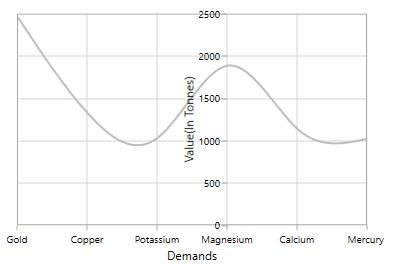

If you want to position the header outside of the chart area then you can set the [`Far`](https://help.syncfusion.com/cr/wpf/Syncfusion.UI.Xaml.Charts.AxisHeaderPosition.html) option in [`HeaderPosition`](https://help.syncfusion.com/cr/wpf/Syncfusion.UI.Xaml.Charts.ChartAxis.html#Syncfusion_UI_Xaml_Charts_ChartAxis_HeaderPosition) property.

The following code example demonstrates the positioning of the header outside even when the axis is moved inside.





<syncfusion:SfChart.SecondaryAxis>

<syncfusion:NumericalAxis HeaderPosition="Far"

Origin="3" ShowAxisNextToOrigin="True" Header="Value(In Tonnes)" >

</syncfusion:NumericalAxis>

</syncfusion:SfChart.SecondaryAxis>





chart.SecondaryAxis = new NumericalAxis()
{

    Origin = 3,

    ShowAxisNextToOrigin = true,

    Header = "Value(In Tonnes)",

    HeaderPosition = AxisHeaderPosition.Far
    
};





**Adding** **Origin** **line**

The origin line can be added to chart area by setting the [`ShowOrigin`](https://help.syncfusion.com/cr/wpf/Syncfusion.UI.Xaml.Charts.ChartAxis.html#Syncfusion_UI_Xaml_Charts_ChartAxis_ShowOrigin) property to true .The following code example demonstrates the displaying origin line at (3,0) position value as set in [`Origin`](https://help.syncfusion.com/cr/wpf/Syncfusion.UI.Xaml.Charts.ChartAxis.html#Syncfusion_UI_Xaml_Charts_ChartAxis_Origin) property.





<syncfusion:SfChart.SecondaryAxis>

<syncfusion:NumericalAxis Origin="3" ShowOrigin="True">

</syncfusion:NumericalAxis>

</syncfusion:SfChart.SecondaryAxis>





chart.SecondaryAxis = new NumericalAxis()
{

    Origin = 3,

    ShowOrigin = true 

};





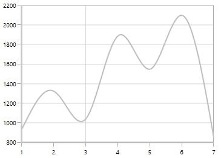

**Customizing the OriginLine**

The origin line of axis can be customized by using the [`OriginLineStyle`](https://help.syncfusion.com/cr/wpf/Syncfusion.UI.Xaml.Charts.ChartAxis.html#Syncfusion_UI_Xaml_Charts_ChartAxis_OriginLineStyleProperty) property of the ChartAxis. The following code demonstrates how to apply style for origin line.





<syncfusion:SfChart.SecondaryAxis>
 
    <syncfusion:NumericalAxis Origin="3" ShowOrigin="True">

          <syncfusion:NumericalAxis.OriginLineStyle>

                        

          </syncfusion:NumericalAxis.OriginLineStyle>

    </syncfusion:NumericalAxis>

</syncfusion:SfChart.SecondaryAxis>





NumericalAxis numericalAxis = new NumericalAxis()

   {
        
        Origin = 3,
                
        ShowOrigin = true
        
    };

Style style = new Style(typeof(Line));

style.Setters.Add(new Setter(Line.StrokeProperty, new SolidColorBrush(Colors.Red)));

style.Setters.Add(new Setter(Line.StrokeDashArrayProperty, new DoubleCollection() { 3 }));

numericalAxis.OriginLineStyle = style;

chart.SecondaryAxis = numericalAxis;





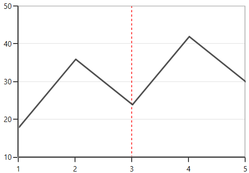

## Types of Axis

[`ChartAxis`](https://help.syncfusion.com/cr/wpf/Syncfusion.UI.Xaml.Charts.ChartAxis.html#) supports the following types.

* NumericalAxis
* CategoryAxis
* DateTimeAxis
* DateTimeCategoryAxis
* TimeSpanAxis
* LogarithmicAxis

You can choose any type of [`ChartAxis`](https://help.syncfusion.com/cr/wpf/Syncfusion.UI.Xaml.Charts.ChartAxis.html#), like [`DateTimeAxis`](https://help.syncfusion.com/cr/wpf/Syncfusion.UI.Xaml.Charts.DateTimeAxis.html#), [`NumericalAxis`](https://help.syncfusion.com/cr/wpf/Syncfusion.UI.Xaml.Charts.NumericalAxis.html#), [`CategoryAxis`](https://help.syncfusion.com/cr/wpf/Syncfusion.UI.Xaml.Charts.CategoryAxis.html#), [`LogarithmicAxis`](https://help.syncfusion.com/cr/wpf/Syncfusion.UI.Xaml.Charts.LogarithmicAxis.html#) or [`TimeSpanAxis`](https://help.syncfusion.com/cr/wpf/Syncfusion.UI.Xaml.Charts.TimeSpanAxis.html#) depending on the value type. [`DateTimeCategoryAxis`](https://help.syncfusion.com/cr/wpf/Syncfusion.UI.Xaml.Charts.DateTimeCategoryAxis.html#) is a special type, used to plot date and time values for the given data points.

### NumericalAxis

[`NumericalAxis`](https://help.syncfusion.com/cr/wpf/Syncfusion.UI.Xaml.Charts.NumericalAxis.html#) is used to plot numerical values to the chart. [`NumericalAxis`](https://help.syncfusion.com/cr/wpf/Syncfusion.UI.Xaml.Charts.NumericalAxis.html#) can be defined for both [`PrimaryAxis`](https://help.syncfusion.com/cr/wpf/Syncfusion.UI.Xaml.Charts.SfChart.html#Syncfusion_UI_Xaml_Charts_SfChart_PrimaryAxis) and [`SecondaryAxis`](https://help.syncfusion.com/cr/wpf/Syncfusion.UI.Xaml.Charts.SfChart.html#Syncfusion_UI_Xaml_Charts_SfChart_SecondaryAxis). The following code snippet shows how to define the [`NumericalAxis`](https://help.syncfusion.com/cr/wpf/Syncfusion.UI.Xaml.Charts.NumericalAxis.html#).





<syncfusion:SfChart.PrimaryAxis>

<syncfusion:NumericalAxis  >

</syncfusion:NumericalAxis>

</syncfusion:SfChart.PrimaryAxis>

<syncfusion:SfChart.SecondaryAxis>

<syncfusion:NumericalAxis >

</syncfusion:NumericalAxis>

</syncfusion:SfChart.SecondaryAxis>





chart.PrimaryAxis = new NumericalAxis();

chart.SecondaryAxis = new NumericalAxis();





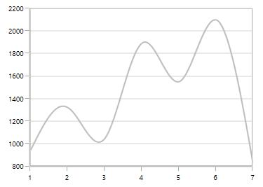

**Customizing** **the** **NumericalAxis** **Range**

[`Maximum`](https://help.syncfusion.com/cr/wpf/Syncfusion.UI.Xaml.Charts.NumericalAxis.html#Syncfusion_UI_Xaml_Charts_NumericalAxis_Maximum) property used for setting the maximum value for the axis range and [`Minimum`](https://help.syncfusion.com/cr/wpf/Syncfusion.UI.Xaml.Charts.NumericalAxis.html#Syncfusion_UI_Xaml_Charts_NumericalAxis_Minimum) property is used for setting the minimum value for the axis range.





<syncfusion:SfChart.SecondaryAxis>

<syncfusion:NumericalAxis Maximum="2750" Minimum="250" Interval="250">

</syncfusion:NumericalAxis>

</syncfusion:SfChart.SecondaryAxis>





chart.SecondaryAxis = new NumericalAxis()
{

    Maximum = 2750,

    Minimum = 250,

    Interval = 250

};





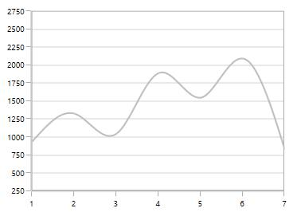

N> If  minimum or maximum value is set, the other value is calculated by default internally.

**StartRangeFromZero**

[`NumericalAxis`](https://help.syncfusion.com/cr/wpf/Syncfusion.UI.Xaml.Charts.NumericalAxis.html#) will calculate the range based on the data points binded to the axis. To start the range from zero have to define the [`StartRangeFromZero`](https://help.syncfusion.com/cr/wpf/Syncfusion.UI.Xaml.Charts.NumericalAxis.html#Syncfusion_UI_Xaml_Charts_NumericalAxis_StartRangeFromZero) property to True. The following code example demonstrates the NumericalAxis range starting from zero.





<syncfusion:SfChart.SecondaryAxis>

<syncfusion:NumericalAxis StartRangeFromZero="True">

</syncfusion:NumericalAxis>

</syncfusion:SfChart.SecondaryAxis>





chart.SecondaryAxis = new NumericalAxis()
{

   StartRangeFromZero = true

};





N> By default, Range is calculated between the minimum and maximum value of the data points.

### CategoryAxis

[`CategoryAxis`](https://help.syncfusion.com/cr/wpf/Syncfusion.UI.Xaml.Charts.CategoryAxis.html#) is an indexed based axis that plots values based on the index of the data point collection. The points are equally spaced here. The following code example initializes the [`CategoryAxis`](https://help.syncfusion.com/cr/wpf/Syncfusion.UI.Xaml.Charts.CategoryAxis.html#).





<syncfusion:SfChart.PrimaryAxis>

<syncfusion:CategoryAxis >

</syncfusion:CategoryAxis>

</syncfusion:SfChart.PrimaryAxis>





chart.PrimaryAxis = new CategoryAxis();





**LabelPlacement**

In [`CategoryAxis`](https://help.syncfusion.com/cr/wpf/Syncfusion.UI.Xaml.Charts.CategoryAxis.html#), labels is placed based on tick lines using [`LabelPlacement`](https://help.syncfusion.com/cr/wpf/Syncfusion.UI.Xaml.Charts.CategoryAxis.html#Syncfusion_UI_Xaml_Charts_CategoryAxis_LabelPlacement) property. By default the labels is placed [`OnTicks`](https://help.syncfusion.com/cr/wpf/Syncfusion.UI.Xaml.Charts.LabelPlacement.html). The following code example demonstrates placing the label between ticks in [`CategoryAxis`](https://help.syncfusion.com/cr/wpf/Syncfusion.UI.Xaml.Charts.CategoryAxis.html#)





<syncfusion:SfChart.PrimaryAxis>

<syncfusion:CategoryAxis LabelPlacement="BetweenTicks">

</syncfusion:CategoryAxis>

</syncfusion:SfChart.PrimaryAxis>





chart.PrimaryAxis = new CategoryAxis()
{

    LabelPlacement = LabelPlacement.BetweenTicks

};





**IsIndexed**

By default, [`CategoryAxis`](https://help.syncfusion.com/cr/wpf/Syncfusion.UI.Xaml.Charts.CategoryAxis.html) plots the values based on the index of the data points. However, the [`CategoryAxis`](https://help.syncfusion.com/cr/wpf/Syncfusion.UI.Xaml.Charts.CategoryAxis.html) can be made to plot the data points based on its data, instead of index value by disabling the [`IsIndexed`](https://help.syncfusion.com/cr/wpf/Syncfusion.UI.Xaml.Charts.CategoryAxis.html#Syncfusion_UI_Xaml_Charts_CategoryAxis_IsIndexed) property of [`CategoryAxis`](https://help.syncfusion.com/cr/wpf/Syncfusion.UI.Xaml.Charts.CategoryAxis.html), and it is shown in the following code example.





<syncfusion:SfChart.PrimaryAxis>

<syncfusion:CategoryAxis IsIndexed="False"/>
                
 </syncfusion:SfChart.PrimaryAxis>





chart.PrimaryAxis = new CategoryAxis()

{
                
    IsIndexed = false,
            
};





The following screenshot illustrates the series with IsIndexed value as False.

By default, the IsIndexed property value is true, and it is shown in following screenshot.

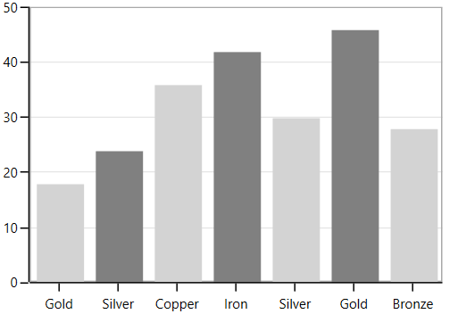

N> This feature is not applicable for Accumulation series, ErrorBarSeries, RadarSeries, and PolarSeries.

**AggregateFunctions**

When the [`IsIndexed`](https://help.syncfusion.com/cr/wpf/Syncfusion.UI.Xaml.Charts.CategoryAxis.html#Syncfusion_UI_Xaml_Charts_CategoryAxis_IsIndexedProperty) property of the [`CategoryAxis`](https://help.syncfusion.com/cr/wpf/Syncfusion.UI.Xaml.Charts.CategoryAxis.html) is disabled, the same index values(XValue) are grouped by [`AggregateFunctions`](https://help.syncfusion.com/cr/wpf/Syncfusion.UI.Xaml.Charts.CategoryAxis.html#Syncfusion_UI_Xaml_Charts_CategoryAxis_AggregateFunctions) property of the axis. The following are the types of [`AggregateFunctions`](https://help.syncfusion.com/cr/wpf/Syncfusion.UI.Xaml.Charts.CategoryAxis.html#Syncfusion_UI_Xaml_Charts_CategoryAxis_AggregateFunctionsProperty),

  * [`Average`](https://help.syncfusion.com/cr/wpf/Syncfusion.UI.Xaml.Charts.AggregateFunctions.html)
  * [`Count`](https://help.syncfusion.com/cr/wpf/Syncfusion.UI.Xaml.Charts.AggregateFunctions.html)
  * [`Max`](https://help.syncfusion.com/cr/wpf/Syncfusion.UI.Xaml.Charts.AggregateFunctions.html)
  * [`Min`](https://help.syncfusion.com/cr/wpf/Syncfusion.UI.Xaml.Charts.AggregateFunctions.html)
  * [`None`](https://help.syncfusion.com/cr/wpf/Syncfusion.UI.Xaml.Charts.AggregateFunctions.html)
  * [`Sum`](https://help.syncfusion.com/cr/wpf/Syncfusion.UI.Xaml.Charts.AggregateFunctions.html)

The default value of [`AggregateFunctions`](https://help.syncfusion.com/cr/wpf/Syncfusion.UI.Xaml.Charts.CategoryAxis.html#Syncfusion_UI_Xaml_Charts_CategoryAxis_AggregateFunctions) is None, and it is shown in the following code example.





<syncfusion:SfChart.PrimaryAxis>

<syncfusion:CategoryAxis IsIndexed="False"/>
                
 </syncfusion:SfChart.PrimaryAxis>





chart.PrimaryAxis = new CategoryAxis()

{
                
    IsIndexed = false,
            
};





**Average**

The following code example illustrates the axis with [`AggregateFunctions`](https://help.syncfusion.com/cr/wpf/Syncfusion.UI.Xaml.Charts.CategoryAxis.html#Syncfusion_UI_Xaml_Charts_CategoryAxis_AggregateFunctionsProperty) is Average,





<syncfusion:SfChart.PrimaryAxis>

<syncfusion:CategoryAxis IsIndexed="False" AggregateFunctions="Average"/>
                
 </syncfusion:SfChart.PrimaryAxis>





chart.PrimaryAxis = new CategoryAxis()

{
                
    IsIndexed = false,
    
    AggregateFunctions = AggregateFunctions.Average
            
};





**Count**

The following code example illustrates the axis with [`AggregateFunctions`](https://help.syncfusion.com/cr/wpf/Syncfusion.UI.Xaml.Charts.CategoryAxis.html#Syncfusion_UI_Xaml_Charts_CategoryAxis_AggregateFunctionsProperty) is Count,





<syncfusion:SfChart.PrimaryAxis>

<syncfusion:CategoryAxis IsIndexed="False" AggregateFunctions="Count"/>
                
 </syncfusion:SfChart.PrimaryAxis>





chart.PrimaryAxis = new CategoryAxis()

{
                
    IsIndexed = false,
    
    AggregateFunctions = AggregateFunctions.Count
            
};





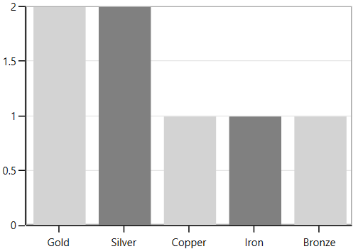

**Max**

The following code example illustrates the axis with [`AggregateFunctions`](https://help.syncfusion.com/cr/wpf/Syncfusion.UI.Xaml.Charts.CategoryAxis.html#Syncfusion_UI_Xaml_Charts_CategoryAxis_AggregateFunctionsProperty) is Max,





<syncfusion:SfChart.PrimaryAxis>

<syncfusion:CategoryAxis IsIndexed="False" AggregateFunctions="Max"/>
                
 </syncfusion:SfChart.PrimaryAxis>





chart.PrimaryAxis = new CategoryAxis()

{
                
    IsIndexed = false,
    
    AggregateFunctions = AggregateFunctions.Max
            
};





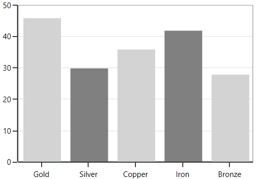

**Min**

The following code example illustrates the axis with [`AggregateFunctions`](https://help.syncfusion.com/cr/wpf/Syncfusion.UI.Xaml.Charts.CategoryAxis.html#Syncfusion_UI_Xaml_Charts_CategoryAxis_AggregateFunctionsProperty) is Min,





<syncfusion:SfChart.PrimaryAxis>

<syncfusion:CategoryAxis IsIndexed="False" AggregateFunctions="Min"/>
                
 </syncfusion:SfChart.PrimaryAxis>





chart.PrimaryAxis = new CategoryAxis()

{
                
    IsIndexed = false,
    
    AggregateFunctions = AggregateFunctions.Min
            
};





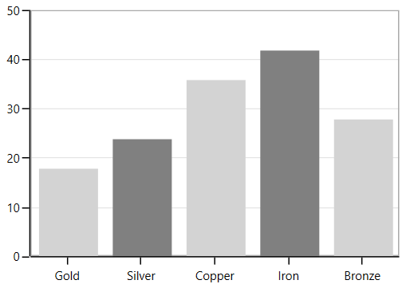

**Sum**

The following code example illustrates the axis with [`AggregateFunctions`](https://help.syncfusion.com/cr/wpf/Syncfusion.UI.Xaml.Charts.CategoryAxis.html#Syncfusion_UI_Xaml_Charts_CategoryAxis_AggregateFunctionsProperty) is Sum,





<syncfusion:SfChart.PrimaryAxis>

<syncfusion:CategoryAxis IsIndexed="False" AggregateFunctions="Sum"/>
                
 </syncfusion:SfChart.PrimaryAxis>





chart.PrimaryAxis = new CategoryAxis()

{
                
    IsIndexed = false,
    
    AggregateFunctions = AggregateFunctions.Sum
            
};





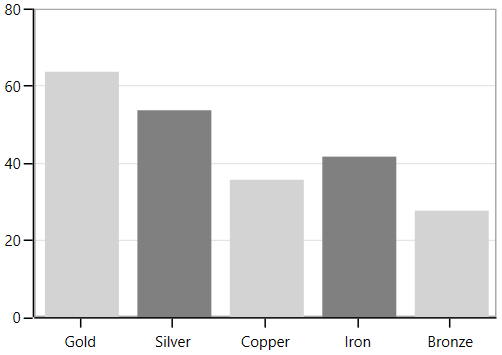

### DateTimeAxis

[`DateTimeAxis`](https://help.syncfusion.com/cr/wpf/Syncfusion.UI.Xaml.Charts.DateTimeAxis.html#) is used to plot DateTime values. The [`DateTimeAxis`](https://help.syncfusion.com/cr/wpf/Syncfusion.UI.Xaml.Charts.DateTimeAxis.html#) is widely used to make financial charts in places like the Stock Market, where index plotting is done every day.





<syncfusion:SfChart.PrimaryAxis>

<syncfusion:DateTimeAxis  LabelFormat="MMM-dd"></syncfusion:DateTimeAxis>

</syncfusion:SfChart.PrimaryAxis>





chart.PrimaryAxis = new DateTimeAxis()
{

    LabelFormat = "MMM-dd"

};





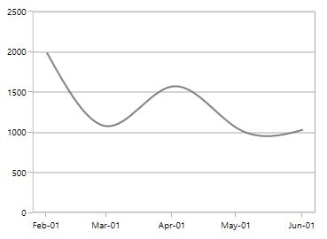

**Customizing** **the** **Range**

[`Minimum`](https://help.syncfusion.com/cr/wpf/Syncfusion.UI.Xaml.Charts.DateTimeAxis.html#Syncfusion_UI_Xaml_Charts_DateTimeAxis_Minimum) and [`Maximum`](https://help.syncfusion.com/cr/wpf/Syncfusion.UI.Xaml.Charts.DateTimeAxis.html#Syncfusion_UI_Xaml_Charts_DateTimeAxis_Maximum) properties behavior is same as in NumericalAxis instead of setting numerical value, you have to set date time values.





<syncfusion:SfChart.PrimaryAxis>

<syncfusion:DateTimeAxis  Minimum="2015/01/10" Maximum="2015/07/01" LabelFormat="MMM-dd" 

IntervalType="Months" Interval="1">

</syncfusion:DateTimeAxis>

</syncfusion:SfChart.PrimaryAxis>





chart.PrimaryAxis = new DateTimeAxis()
{

    Minimum = new DateTime(2015,01,10),

    Maximum = new DateTime(2015,07,01),

    LabelFormat = "MMM-dd",

    IntervalType = DateTimeIntervalType.Months,

    Interval = 1

};





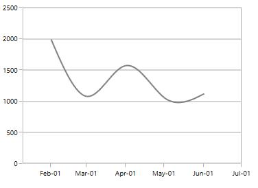

**Business** **Hours** **Range** **Calculation**

SfChart provides support to plot only the business hours in DateTimeAxis.This support is enabled by setting [`EnableBusinessHours`](https://help.syncfusion.com/cr/wpf/Syncfusion.UI.Xaml.Charts.DateTimeAxis.html#Syncfusion_UI_Xaml_Charts_DateTimeAxis_EnableBusinessHours) property to true.

The following properties are used for business hour range calculation

* [`OpenTime`](https://help.syncfusion.com/cr/wpf/Syncfusion.UI.Xaml.Charts.DateTimeAxis.html#Syncfusion_UI_Xaml_Charts_DateTimeAxis_OpenTime)- Represents the open working time of a day.
* [`CloseTime`](https://help.syncfusion.com/cr/wpf/Syncfusion.UI.Xaml.Charts.DateTimeAxis.html#Syncfusion_UI_Xaml_Charts_DateTimeAxis_CloseTime)- Represents the close working time of a day.
* [`WorkingDays`](https://help.syncfusion.com/cr/wpf/Syncfusion.UI.Xaml.Charts.DateTimeAxis.html#Syncfusion_UI_Xaml_Charts_DateTimeAxis_WorkingDays)- Represents the working [`days`](https://help.syncfusion.com/cr/wpf/Syncfusion.UI.Xaml.Charts.Day.html) of a week.

The following code snippet demonstrates the business hours support in DateTimeAxis





<syncfusion:SfChart.PrimaryAxis>

<syncfusion:DateTimeAxis EnableBusinessHours="True" OpenTime="9" 

CloseTime="24" WorkingDays="Friday,Saturday,Sunday,Monday,Tuesday,Wednesday,Sunday">

</syncfusion:DateTimeAxis>

</syncfusion:SfChart.PrimaryAxis>





chart.PrimaryAxis = new DateTimeAxis()
{

    EnableBusinessHours = true,

    OpenTime = 9,

    CloseTime = 24,

    WorkingDays = Day.Friday | Day.Saturday | Day.Sunday |
                Day.Monday | Day.Tuesday| Day.Wednesday| Day.Sunday

};





### DateTimeCategoryAxis

[`DateTimeCategoryAxis`](https://help.syncfusion.com/cr/wpf/Syncfusion.UI.Xaml.Charts.DateTimeCategoryAxis.html#) is a special type of axis used mainly with financial series. All the data points are plotted with equal spaces, similar to [`CategoryAxis`](https://help.syncfusion.com/cr/wpf/Syncfusion.UI.Xaml.Charts.CategoryAxis.html#), thereby removing space for missing dates. [`Interval`](https://help.syncfusion.com/cr/wpf/Syncfusion.UI.Xaml.Charts.DateTimeCategoryAxis.html#Syncfusion_UI_Xaml_Charts_DateTimeCategoryAxis_Interval) and range for the axis are calculated similar to [DateTimeAxis](https://help.syncfusion.com/cr/wpf/Syncfusion.UI.Xaml.Charts.DateTimeAxis.html#). There are no visual gaps between points, even when the difference between two points is more than a year.





<syncfusion:SfChart.PrimaryAxis>

<syncfusion:DateTimeCategoryAxis LabelFormat="MMM-dd" >

</syncfusion:DateTimeCategoryAxis>

</syncfusion:SfChart.PrimaryAxis>





chart.PrimaryAxis = new DateTimeCategoryAxis()
{

    LabelFormat = "MMM-dd"

};





### TimeSpan Axis

[`TimeSpanAxis`](https://help.syncfusion.com/cr/wpf/Syncfusion.UI.Xaml.Charts.TimeSpanAxis.html#) is used to plot the time span values in the [`PrimaryAxis`](https://help.syncfusion.com/cr/wpf/Syncfusion.UI.Xaml.Charts.SfChart.html#Syncfusion_UI_Xaml_Charts_SfChart_PrimaryAxis). [`TimeSpanAxis`](https://help.syncfusion.com/cr/wpf/Syncfusion.UI.Xaml.Charts.TimeSpanAxis.html#) has the advantage of plotting data with milliseconds difference. The limitation of [`TimeSpanAxis`](https://help.syncfusion.com/cr/wpf/Syncfusion.UI.Xaml.Charts.TimeSpanAxis.html#) is that it can only accept timespan values (hh:mm:ss) and date time values are not accepted.





<syncfusion:SfChart.PrimaryAxis>

<syncfusion:TimeSpanAxis >

</syncfusion:TimeSpanAxis>

</syncfusion:SfChart.PrimaryAxis>





chart.PrimaryAxis = new TimeSpanAxis();





**Customizing** **the** **Range**

The following code snippet demonstrates the [`Minimum`](https://help.syncfusion.com/cr/wpf/Syncfusion.UI.Xaml.Charts.TimeSpanAxis.html#Syncfusion_UI_Xaml_Charts_TimeSpanAxis_Minimum) and [`Maximum`](https://help.syncfusion.com/cr/wpf/Syncfusion.UI.Xaml.Charts.TimeSpanAxis.html#Syncfusion_UI_Xaml_Charts_TimeSpanAxis_Maximum) properties for [`TimeSpanAxis`](https://help.syncfusion.com/cr/wpf/Syncfusion.UI.Xaml.Charts.TimeSpanAxis.html#).





<syncfusion:SfChart.PrimaryAxis>

<syncfusion:TimeSpanAxis Minimum="00:00:00" Maximum="00:10:00">

</syncfusion:TimeSpanAxis>

</syncfusion:SfChart.PrimaryAxis>





chart.PrimaryAxis = new TimeSpanAxis()
{

    Minimum = new TimeSpan(00, 00, 00),

    Maximum = new TimeSpan(00, 10, 00)

};





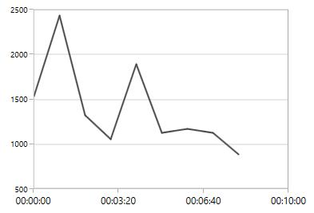

### LogarithmicAxis

[`LogarithmicAxis`](https://help.syncfusion.com/cr/wpf/Syncfusion.UI.Xaml.Charts.LogarithmicAxis.html#) is used to plot the logarithmic scale for the chart. The Logarithmic values will be plotted based on the logarithmic base value as 10.





<syncfusion:SfChart.SecondaryAxis>

<syncfusion:LogarithmicAxis />

</syncfusion:SfChart.SecondaryAxis>





chart.SecondaryAxis = new LogarithmicAxis();





**Logarithmic** **Base**

You can also change the base for logarithmic values. By default the logarithmic values is calculated the base from 10.The following code example demonstrates the logarithmic values in y axis calculated from base 2.





<syncfusion:SfChart.SecondaryAxis>

<syncfusion:LogarithmicAxis LogarithmicBase="2">

</syncfusion:LogarithmicAxis>

</syncfusion:SfChart.SecondaryAxis>





chart.SecondaryAxis = new LogarithmicAxis()
{

    LogarithmicBase = 2

};





**Customizing** **the** **Range**

The following code snippet demonstrates the range customization of [`LogarithmicAxis`](https://help.syncfusion.com/cr/wpf/Syncfusion.UI.Xaml.Charts.LogarithmicAxis.html#) based on [`Minimum`](https://help.syncfusion.com/cr/wpf/Syncfusion.UI.Xaml.Charts.LogarithmicAxis.html#Syncfusion_UI_Xaml_Charts_LogarithmicAxis_Minimum) and [`Maximum`](https://help.syncfusion.com/cr/wpf/Syncfusion.UI.Xaml.Charts.LogarithmicAxis.html#Syncfusion_UI_Xaml_Charts_LogarithmicAxis_Maximum) properties.





<syncfusion:SfChart.SecondaryAxis>

<syncfusion:LogarithmicAxis Minimum="100" Maximum="7000" >

</syncfusion:LogarithmicAxis>

</syncfusion:SfChart.SecondaryAxis>





chart.SecondaryAxis = new LogarithmicAxis()
{

    Minimum = 100,

    Maximum = 7000

};





The following property is common for all types of axes,

  * `IncludeStripLineRange`

**IncludeStripLineRange**

By default, [`striplines`](https://help.syncfusion.com/wpf/sfchart/striplines) are drawn up to the chart axis range, if the provided values (Start and Width) exceed the actual range of chart axis. It can be avoided by using [`IncludeStripLineRange`](https://help.syncfusion.com/cr/wpf/Syncfusion.UI.Xaml.Charts.ChartAxisBase2D.html#Syncfusion_UI_Xaml_Charts_ChartAxisBase2D_IncludeStriplineRangeProperty) property. While enabling [`IncludeStripLineRange`](https://help.syncfusion.com/cr/wpf/Syncfusion.UI.Xaml.Charts.ChartAxisBase2D.html#Syncfusion_UI_Xaml_Charts_ChartAxisBase2D_IncludeStriplineRangeProperty) property, the axis range will be extended up to the provided stripline range. The property can be set as shown in the following code example.





<Chart:SfChart.SecondaryAxis>

  <Chart:NumericalAxis IncludeStripLineRange="True" >
   
        <Chart:NumericalAxis.StripLines>
            
            <Chart:ChartStripLine Start="1000" 
                                  
                                  Width="1500" 
                                  
                                  Background="LightGray" 
                                  
                                  Opacity="0.6"/>
            
        </Chart:NumericalAxis.StripLines>
        
  </Chart:NumericalAxis>

</Chart:SfChart.SecondaryAxis>





NumericalAxis axis = new NumericalAxis();

axis.IncludeStripLineRange = true;

ChartStripLine stripline = new ChartStripLine()

{

    Start = 1000,

    Width = 1500,

    Background = new SolidColorBrush(Colors.LightGray),

    Opacity = 0.6

 };

 axis.StripLines.Add(stripline);





**IncludeAnnotationRange**

By default, [`annotations`](https://help.syncfusion.com/wpf/sfchart/annotations) are drawn up to the chart axis range, if the provided values (X1, X2, Y1, and Y2) exceed the actual range of [`chart axis`](https://help.syncfusion.com/wpf/sfchart/axis). It can be avoided by using [`IncludeAnnotationRange`](https://help.syncfusion.com/cr/wpf/Syncfusion.UI.Xaml.Charts.RangeAxisBase.html#Syncfusion_UI_Xaml_Charts_RangeAxisBase_IncludeAnnotationRangeProperty) property. While enabling [`IncludeAnnotationRange`](https://help.syncfusion.com/cr/wpf/Syncfusion.UI.Xaml.Charts.RangeAxisBase.html#Syncfusion_UI_Xaml_Charts_RangeAxisBase_IncludeAnnotationRangeProperty) property, the axis range will be extended up to the provided annotation range.
The property is applicable only for linear axes, and it can be set as shown in the following code example.





<Chart:SfChart.SecondaryAxis>
      
      <Chart:NumericalAxis IncludeAnnotationRange="True" />

</Chart:SfChart.SecondaryAxis>
         
<Chart:SfChart.Annotations>
      
      <Chart:LineAnnotation X1="0" X2="4" Y1="0" Y2="3000" />

</Chart:SfChart.Annotations>





chart.SecondaryAxis = new NumericalAxis()
            
    {
               
         IncludeAnnotationRange = true
    
    };

LineAnnotation annotation = new LineAnnotation();

annotation.X1 = 0;

annotation.X2 = 4;

annotation.Y1 = 0;

annotation.Y2 = 3000;

chart.Annotations.Add(annotation);





## Inverting axis

Axis can be inverted using the [`IsInversed`](https://help.syncfusion.com/cr/wpf/Syncfusion.UI.Xaml.Charts.ChartAxis.html#Syncfusion_UI_Xaml_Charts_ChartAxis_IsInversedProperty) property. The default value of this property is [`False`].





<chart:SfChart.SecondaryAxis>

<chart:NumericalAxis IsInversed="True"/>

</chart:SfChart.SecondaryAxis>





this.Chart.SecondaryAxis.IsInversed = true;





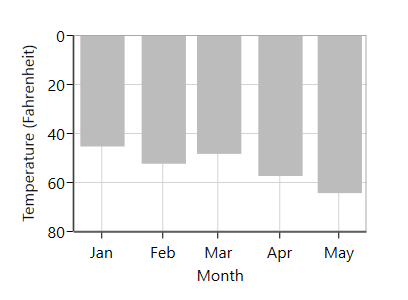

## Customizing the Intervals

[`ChartAxis`](https://help.syncfusion.com/cr/wpf/Syncfusion.UI.Xaml.Charts.ChartAxis.html#) calculates the range and intervals automatically based on the data points. The axis range and interval can be defined using the [`Minimum`](https://help.syncfusion.com/cr/wpf/Syncfusion.UI.Xaml.Charts.NumericalAxis.html#Syncfusion_UI_Xaml_Charts_NumericalAxis_Minimum), [`Maximum`](https://help.syncfusion.com/cr/wpf/Syncfusion.UI.Xaml.Charts.NumericalAxis.html#Syncfusion_UI_Xaml_Charts_NumericalAxis_Maximum) and [`Interval`](https://help.syncfusion.com/cr/wpf/Syncfusion.UI.Xaml.Charts.NumericalAxis.html#Syncfusion_UI_Xaml_Charts_NumericalAxis_Interval) properties.

**NumericalAxis**

The following code snippet demonstrates the [`Interval`](https://help.syncfusion.com/cr/wpf/Syncfusion.UI.Xaml.Charts.NumericalAxis.html#Syncfusion_UI_Xaml_Charts_NumericalAxis_Interval) customization in NumericalAxis.





<syncfusion:SfChart.SecondaryAxis>

<syncfusion:NumericalAxis Interval="250">

</syncfusion:NumericalAxis>

</syncfusion:SfChart.SecondaryAxis>





chart.SecondaryAxis = new NumericalAxis()
{

    Interval = 250

};





**CategoryAxis**

The following code snippet demonstrates the [`Interval`](https://help.syncfusion.com/cr/wpf/Syncfusion.UI.Xaml.Charts.CategoryAxis.html#Syncfusion_UI_Xaml_Charts_CategoryAxis_Interval) customization in CategoryAxis.





<syncfusion:SfChart.PrimaryAxis>

<syncfusion:CategoryAxis Interval="2">

</syncfusion:CategoryAxis>

</syncfusion:SfChart.PrimaryAxis>





chart.PrimaryAxis = new CategoryAxis()
{

    Interval = 2

};





**DateTimeAxis**

The DateTimeAxis [`Interval`](https://help.syncfusion.com/cr/wpf/Syncfusion.UI.Xaml.Charts.DateTimeAxis.html#Syncfusion_UI_Xaml_Charts_DateTimeAxis_Interval) value corresponds to the type specified in the [`IntervalType`](https://help.syncfusion.com/cr/wpf/Syncfusion.UI.Xaml.Charts.DateTimeAxis.html#Syncfusion_UI_Xaml_Charts_DateTimeAxis_IntervalType) property.

For instance, if the [`Interval`](https://help.syncfusion.com/cr/wpf/Syncfusion.UI.Xaml.Charts.DateTimeAxis.html#Syncfusion_UI_Xaml_Charts_DateTimeAxis_Interval) is set as 2 and [`IntervalType`](https://help.syncfusion.com/cr/wpf/Syncfusion.UI.Xaml.Charts.DateTimeAxis.html#Syncfusion_UI_Xaml_Charts_DateTimeAxis_IntervalType) is set as [`Days`](https://help.syncfusion.com/cr/wpf/Syncfusion.UI.Xaml.Charts.DateTimeIntervalType.html), the labels are plotted for every two days. The following are the options for [`IntervalType`](https://help.syncfusion.com/cr/wpf/Syncfusion.UI.Xaml.Charts.DateTimeAxis.html#Syncfusion_UI_Xaml_Charts_DateTimeAxis_IntervalType) property

Auto
* Days
* Hours
* Milliseconds
* Minutes
* Months
* Seconds
* Years

The default [`IntervalType`](https://help.syncfusion.com/cr/wpf/Syncfusion.UI.Xaml.Charts.DateTimeAxis.html#Syncfusion_UI_Xaml_Charts_DateTimeAxis_IntervalType) of a [`DateTimeAxis`](https://help.syncfusion.com/cr/wpf/Syncfusion.UI.Xaml.Charts.DateTimeAxis.html#) is Auto. It calculates the type automatically and the interval, accordingly.

The following code snippet demonstrates the DateTimeAxis having one month interval.





<syncfusion:SfChart.PrimaryAxis>

<syncfusion:DateTimeAxis  Interval="1"  IntervalType="Months" LabelFormat="MMM-dd"></syncfusion:DateTimeAxis>

</syncfusion:SfChart.PrimaryAxis>





chart.PrimaryAxis = new DateTimeAxis()
{

    Interval = 1,

    IntervalType = DateTimeIntervalType.Months,

    LabelFormat = "MMM-dd"

};





**DesiredIntervalsCount**

[`DesiredIntervalsCount`](https://help.syncfusion.com/cr/wpf/Syncfusion.UI.Xaml.Charts.ChartAxis.html#Syncfusion_UI_Xaml_Charts_ChartAxis_DesiredIntervalsCount) property is used to specify the count of the axis labels between the first and last label. The following sample code defines the [`DesiredIntervalsCount`](https://help.syncfusion.com/cr/wpf/Syncfusion.UI.Xaml.Charts.ChartAxis.html#Syncfusion_UI_Xaml_Charts_ChartAxis_DesiredIntervalsCount) property.





<syncfusion:SfChart.SecondaryAxis>

<syncfusion:NumericalAxis DesiredIntervalsCount="7">

</syncfusion:NumericalAxis>

</syncfusion:SfChart.SecondaryAxis>





chart.SecondaryAxis = new NumericalAxis()
{

    DesiredIntervalsCount = 7

};





**Maximum** **Labels**

[`MaximumLabels`](https://help.syncfusion.com/cr/wpf/Syncfusion.UI.Xaml.Charts.ChartAxis.html#Syncfusion_UI_Xaml_Charts_ChartAxis_MaximumLabels) property defines the count of the axis labels in the 100 pixels.





<syncfusion:SfChart.SecondaryAxis>

<syncfusion:NumericalAxis  MaximumLabels="2">

</syncfusion:NumericalAxis>

</syncfusion:SfChart.SecondaryAxis>

<syncfusion:ColumnSeries ItemsSource="{Binding Demands}" XBindingPath="Demand" YBindingPath="Year2010">

<syncfusion:ColumnSeries.YAxis>

<syncfusion:NumericalAxis MaximumLabels="2" >

</syncfusion:NumericalAxis>

</syncfusion:ColumnSeries.YAxis>

</syncfusion:ColumnSeries>





chart.SecondaryAxis = new NumericalAxis()
{

    MaximumLabels = 2

};

NumericalAxis axis = new NumericalAxis() { MaximumLabels = 2 };

ColumnSeries series = new ColumnSeries()
{

    ItemsSource = new ViewModel().Demands,

    XBindingPath = "Demand",

    YBindingPath = "Year2010",

    YAxis = axis

};

chart.Series.Add(series);





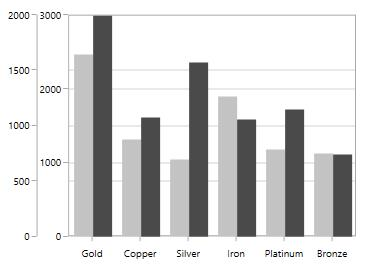

## Apply Padding to the Range

The [`NumericalAxis`](https://help.syncfusion.com/cr/wpf/Syncfusion.UI.Xaml.Charts.NumericalAxis.html#) and [`DateTimeAxis`](https://help.syncfusion.com/cr/wpf/Syncfusion.UI.Xaml.Charts.DateTimeAxis.html#) have a [`RangePadding`](https://help.syncfusion.com/cr/wpf/Syncfusion.UI.Xaml.Charts.NumericalAxis.html#Syncfusion_UI_Xaml_Charts_NumericalAxis_RangePadding) property that can be used to add padding to the range of a chart’s axes.

### DateTimeRangePadding

The [`RangePadding`](https://help.syncfusion.com/cr/wpf/Syncfusion.UI.Xaml.Charts.NumericalAxis.html#Syncfusion_UI_Xaml_Charts_NumericalAxis_RangePadding) types available in the [`DateTimeAxis`](https://help.syncfusion.com/cr/wpf/Syncfusion.UI.Xaml.Charts.DateTimeAxis.html#) are: 

* Auto
* Additional
* None
* Round
* RoundStart
* RoundEnd
* PrependInterval
* AppendInterval

**Auto**

By default the date time range padding is [`Auto`](https://help.syncfusion.com/cr/wpf/Syncfusion.UI.Xaml.Charts.DateTimeRangePadding.html).

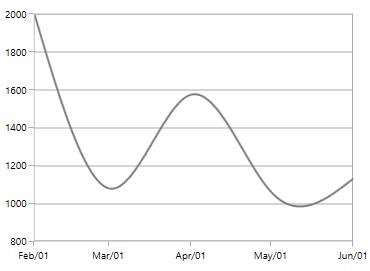

**Additional**

When [`RangePadding`](https://help.syncfusion.com/cr/wpf/Syncfusion.UI.Xaml.Charts.NumericalAxis.html#Syncfusion_UI_Xaml_Charts_NumericalAxis_RangePadding) for [`DateTimeAxis`](https://help.syncfusion.com/cr/wpf/Syncfusion.UI.Xaml.Charts.DateTimeAxis.html#), the DateTime interval of the axis is added as padding, as shown in the following screenshot.





<syncfusion:SfChart.PrimaryAxis>

<syncfusion:DateTimeAxis  RangePadding="Additional">

</syncfusion:DateTimeAxis>

</syncfusion:SfChart.PrimaryAxis>





chart.PrimaryAxis = new DateTimeAxis()
{

    RangePadding = DateTimeRangePadding.Additional

};





**Round**

When [`RangePadding`](https://help.syncfusion.com/cr/wpf/Syncfusion.UI.Xaml.Charts.NumericalAxis.html#Syncfusion_UI_Xaml_Charts_NumericalAxis_RangePadding) for [`DateTimeAxis`](https://help.syncfusion.com/cr/wpf/Syncfusion.UI.Xaml.Charts.DateTimeAxis.html#) is set to [`Round`](https://help.syncfusion.com/cr/wpf/Syncfusion.UI.Xaml.Charts.DateTimeRangePadding.html), the range of the chart axis is rounded off to the nearest possible DateTime value, as shown in the following screenshot.





<syncfusion:SfChart.PrimaryAxis>

<syncfusion:DateTimeAxis  RangePadding="Round">

</syncfusion:DateTimeAxis>

</syncfusion:SfChart.PrimaryAxis>





chart.PrimaryAxis = new DateTimeAxis()
{

    RangePadding = DateTimeRangePadding.Round

};





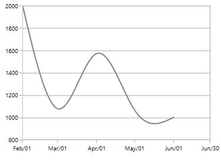

**None**

When the [`RangePadding`](https://help.syncfusion.com/cr/wpf/Syncfusion.UI.Xaml.Charts.NumericalAxis.html#Syncfusion_UI_Xaml_Charts_NumericalAxis_RangePadding) for a [`DateTimeAxis`](https://help.syncfusion.com/cr/wpf/Syncfusion.UI.Xaml.Charts.DateTimeAxis.html#) is [`None`](https://help.syncfusion.com/cr/wpf/Syncfusion.UI.Xaml.Charts.DateTimeRangePadding.html).

The following screenshot demonstrates a chart’s x-axis with `RangePadding` set to `None`. 





<syncfusion:SfChart.PrimaryAxis>

<syncfusion:DateTimeAxis  RangePadding="None">

</syncfusion:DateTimeAxis>

</syncfusion:SfChart.PrimaryAxis>





chart.PrimaryAxis = new DateTimeAxis()
{

    RangePadding = DateTimeRangePadding.None

};





**RoundStart**

When [`RangePadding`](https://help.syncfusion.com/cr/wpf/Syncfusion.UI.Xaml.Charts.NumericalAxis.html#Syncfusion_UI_Xaml_Charts_NumericalAxis_RangePadding) for [`DateTimeAxis`](https://help.syncfusion.com/cr/wpf/Syncfusion.UI.Xaml.Charts.DateTimeAxis.html#) is set to [`RoundStart`](https://help.syncfusion.com/cr/wpf/Syncfusion.UI.Xaml.Charts.DateTimeRangePadding.html), the range of the chart axis is rounded in the start off to the nearest possible DateTime value, as shown in the following screenshot.





<syncfusion:SfChart.PrimaryAxis>

<syncfusion:DateTimeAxis  RangePadding="RoundStart">

</syncfusion:DateTimeAxis>

</syncfusion:SfChart.PrimaryAxis>





chart.PrimaryAxis = new DateTimeAxis()
{

    RangePadding = DateTimeRangePadding.RoundStart

};





**RoundEnd**

When [`RangePadding`](https://help.syncfusion.com/cr/wpf/Syncfusion.UI.Xaml.Charts.NumericalAxis.html#Syncfusion_UI_Xaml_Charts_NumericalAxis_RangePadding) for [`DateTimeAxis`](https://help.syncfusion.com/cr/wpf/Syncfusion.UI.Xaml.Charts.DateTimeAxis.html#) is set to [`RoundEnd`](https://help.syncfusion.com/cr/wpf/Syncfusion.UI.Xaml.Charts.DateTimeRangePadding.html), the range of the chart axis is rounded in the end off to the nearest possible DateTime value, as shown in the following screenshot.





<syncfusion:SfChart.PrimaryAxis>

<syncfusion:DateTimeAxis  RangePadding="RoundEnd">

</syncfusion:DateTimeAxis>

</syncfusion:SfChart.PrimaryAxis>





chart.PrimaryAxis = new DateTimeAxis()
{

    RangePadding = DateTimeRangePadding.RoundEnd

};





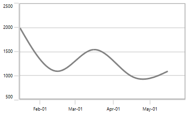

**PrependInterval**

When [`RangePadding`](https://help.syncfusion.com/cr/wpf/Syncfusion.UI.Xaml.Charts.NumericalAxis.html#Syncfusion_UI_Xaml_Charts_NumericalAxis_RangePadding) for [`DateTimeAxis`](https://help.syncfusion.com/cr/wpf/Syncfusion.UI.Xaml.Charts.DateTimeAxis.html#) is set to [`PrependInterval`](https://help.syncfusion.com/cr/wpf/Syncfusion.UI.Xaml.Charts.DateTimeRangePadding.html), the DateTime interval of the axis is added in the start as padding, as shown in the following screenshot.





<syncfusion:SfChart.PrimaryAxis>

<syncfusion:DateTimeAxis  RangePadding="PrependInterval">

</syncfusion:DateTimeAxis>

</syncfusion:SfChart.PrimaryAxis>





chart.PrimaryAxis = new DateTimeAxis()
{

    RangePadding = DateTimeRangePadding.PrependInterval

};





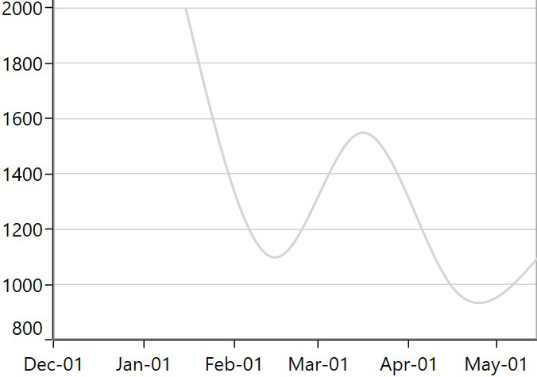

**AppendInterval**

When [`RangePadding`](https://help.syncfusion.com/cr/wpf/Syncfusion.UI.Xaml.Charts.NumericalAxis.html#Syncfusion_UI_Xaml_Charts_NumericalAxis_RangePadding) for [`DateTimeAxis`](https://help.syncfusion.com/cr/wpf/Syncfusion.UI.Xaml.Charts.DateTimeAxis.html#) is set to [`AppendInterval`](https://help.syncfusion.com/cr/wpf/Syncfusion.UI.Xaml.Charts.DateTimeRangePadding.html), the DateTime interval of the axis is added in the end as padding, as shown in the following screenshot.





<syncfusion:SfChart.PrimaryAxis>

<syncfusion:DateTimeAxis  RangePadding="AppendInterval">

</syncfusion:DateTimeAxis>

</syncfusion:SfChart.PrimaryAxis>





chart.PrimaryAxis = new DateTimeAxis()
{

    RangePadding = DateTimeRangePadding.AppendInterval

};





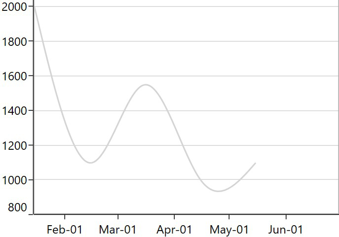

### NumericalRangePadding

The following types are available for [`NumericalAxis`](https://help.syncfusion.com/cr/wpf/Syncfusion.UI.Xaml.Charts.NumericalAxis.html#):

* Additional
* None
* Normal
* Round
* Auto
* RoundStart
* RoundEnd
* PrependInterval
* AppendInterval

**Round**

By default, the default [`RangePadding`](https://help.syncfusion.com/cr/wpf/Syncfusion.UI.Xaml.Charts.NumericalAxis.html#Syncfusion_UI_Xaml_Charts_NumericalAxis_RangePadding) value for [`PrimaryAxis`](https://help.syncfusion.com/cr/wpf/Syncfusion.UI.Xaml.Charts.SfChart.html#Syncfusion_UI_Xaml_Charts_SfChart_PrimaryAxis) is Auto and for [`SecondaryAxis`](https://help.syncfusion.com/cr/wpf/Syncfusion.UI.Xaml.Charts.SfChart.html#Syncfusion_UI_Xaml_Charts_SfChart_SecondaryAxis), the default value is [`Round`](https://help.syncfusion.com/cr/wpf/Syncfusion.UI.Xaml.Charts.NumericalPadding.html).

The following screenshot illustrates a chart’s y-axis with [`RangePadding`](https://help.syncfusion.com/cr/wpf/Syncfusion.UI.Xaml.Charts.NumericalAxis.html#Syncfusion_UI_Xaml_Charts_NumericalAxis_RangePadding) set to [`Round`](https://help.syncfusion.com/cr/wpf/Syncfusion.UI.Xaml.Charts.NumericalPadding.html).

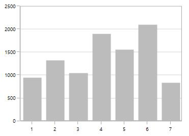

**Normal**

[`Normal`](https://help.syncfusion.com/cr/wpf/Syncfusion.UI.Xaml.Charts.NumericalPadding.html) [`RangePadding`](https://help.syncfusion.com/cr/wpf/Syncfusion.UI.Xaml.Charts.NumericalAxis.html#Syncfusion_UI_Xaml_Charts_NumericalAxis_RangePadding) for a [`NumericalAxis`](https://help.syncfusion.com/cr/wpf/Syncfusion.UI.Xaml.Charts.NumericalAxis.html#) is used mostly for the y-axis to have padding based on the Range calculation.

The following screenshot illustrates a chart’s y-axis with [`RangePadding`](https://help.syncfusion.com/cr/wpf/Syncfusion.UI.Xaml.Charts.NumericalAxis.html#Syncfusion_UI_Xaml_Charts_NumericalAxis_RangePadding) set to [`Normal`](https://help.syncfusion.com/cr/wpf/Syncfusion.UI.Xaml.Charts.NumericalPadding.html).





<syncfusion:SfChart.PrimaryAxis>

<syncfusion:NumericalAxis  RangePadding="Normal">

</syncfusion:NumericalAxis>

</syncfusion:SfChart.PrimaryAxis>





chart.PrimaryAxis = new NumericalAxis()
{

    RangePadding = NumericalPadding.Additional

};





**Additional**

If [`RangePadding`](https://help.syncfusion.com/cr/wpf/Syncfusion.UI.Xaml.Charts.NumericalAxis.html#Syncfusion_UI_Xaml_Charts_NumericalAxis_RangePadding) for [`NumericalAxis`](https://help.syncfusion.com/cr/wpf/Syncfusion.UI.Xaml.Charts.NumericalAxis.html#) is set to [`Additional`](https://help.syncfusion.com/cr/wpf/Syncfusion.UI.Xaml.Charts.NumericalPadding.html), the interval of the axis is added as padding.

The following screenshot demonstrates a chart’s x-axis with [`RangePadding`](https://help.syncfusion.com/cr/wpf/Syncfusion.UI.Xaml.Charts.NumericalAxis.html#Syncfusion_UI_Xaml_Charts_NumericalAxis_RangePadding) set to [`Additional`](https://help.syncfusion.com/cr/wpf/Syncfusion.UI.Xaml.Charts.NumericalPadding.html).





<syncfusion:SfChart.PrimaryAxis>

<syncfusion:NumericalAxis  RangePadding="Additional">

</syncfusion:NumericalAxis>

</syncfusion:SfChart.PrimaryAxis>





chart.PrimaryAxis = new NumericalAxis()
{

    RangePadding = NumericalPadding.Additional

};





**None**

The following screenshot demonstrates [`RangePadding`](https://help.syncfusion.com/cr/wpf/Syncfusion.UI.Xaml.Charts.NumericalAxis.html#Syncfusion_UI_Xaml_Charts_NumericalAxis_RangePadding) as [`None`](https://help.syncfusion.com/cr/wpf/Syncfusion.UI.Xaml.Charts.NumericalPadding.html), where no padding is applied for the axis.





<syncfusion:SfChart.PrimaryAxis>

<syncfusion:NumericalAxis  RangePadding="None">

</syncfusion:NumericalAxis>

</syncfusion:SfChart.PrimaryAxis>





chart.PrimaryAxis = new NumericalAxis()
{

    RangePadding = NumericalPadding.None

};





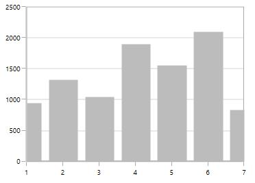

**RoundStart**

If [`RangePadding`](https://help.syncfusion.com/cr/wpf/Syncfusion.UI.Xaml.Charts.NumericalAxis.html#Syncfusion_UI_Xaml_Charts_NumericalAxis_RangePadding) for [`NumericalAxis`](https://help.syncfusion.com/cr/wpf/Syncfusion.UI.Xaml.Charts.NumericalAxis.html#) is set to [`RoundStart`](https://help.syncfusion.com/cr/wpf/Syncfusion.UI.Xaml.Charts.NumericalPadding.html), rounds the range of the chart axis in the start to the nearest possible value.

The following screenshot demonstrates a chart’s x-axis with [`RangePadding`](https://help.syncfusion.com/cr/wpf/Syncfusion.UI.Xaml.Charts.NumericalAxis.html#Syncfusion_UI_Xaml_Charts_NumericalAxis_RangePadding) set to [`RoundStart`](https://help.syncfusion.com/cr/wpf/Syncfusion.UI.Xaml.Charts.NumericalPadding.html).





<syncfusion:SfChart.PrimaryAxis>

<syncfusion:NumericalAxis  RangePadding="RoundStart">

</syncfusion:NumericalAxis>

</syncfusion:SfChart.PrimaryAxis>





chart.PrimaryAxis = new NumericalAxis()
{

    RangePadding = NumericalPadding.RoundStart

};





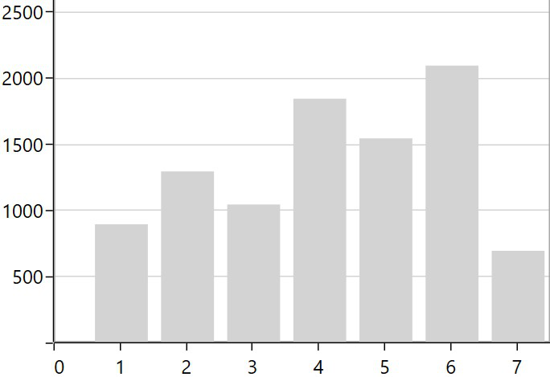

**RoundEnd**

If [`RangePadding`](https://help.syncfusion.com/cr/wpf/Syncfusion.UI.Xaml.Charts.NumericalAxis.html#Syncfusion_UI_Xaml_Charts_NumericalAxis_RangePadding) for [`NumericalAxis`](https://help.syncfusion.com/cr/wpf/Syncfusion.UI.Xaml.Charts.NumericalAxis.html#) is set to [`RoundEnd`](https://help.syncfusion.com/cr/wpf/Syncfusion.UI.Xaml.Charts.NumericalPadding.html), rounds the range of the chart axis in the end to the nearest possible value.

The following screenshot demonstrates a chart’s x-axis with [`RangePadding`](https://help.syncfusion.com/cr/wpf/Syncfusion.UI.Xaml.Charts.NumericalAxis.html#Syncfusion_UI_Xaml_Charts_NumericalAxis_RangePadding) set to [`RoundEnd`](https://help.syncfusion.com/cr/wpf/Syncfusion.UI.Xaml.Charts.NumericalPadding.html).





<syncfusion:SfChart.PrimaryAxis>

<syncfusion:NumericalAxis  RangePadding="RoundEnd">

</syncfusion:NumericalAxis>

</syncfusion:SfChart.PrimaryAxis>





chart.PrimaryAxis = new NumericalAxis()
{

    RangePadding = NumericalPadding.RoundEnd

};





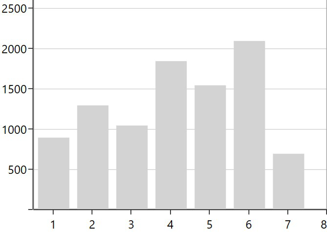

**PrependInterval**

If [`RangePadding`](https://help.syncfusion.com/cr/wpf/Syncfusion.UI.Xaml.Charts.NumericalAxis.html#Syncfusion_UI_Xaml_Charts_NumericalAxis_RangePadding) for [`NumericalAxis`](https://help.syncfusion.com/cr/wpf/Syncfusion.UI.Xaml.Charts.NumericalAxis.html#) is set to [`PrependInterval`](https://help.syncfusion.com/cr/wpf/Syncfusion.UI.Xaml.Charts.NumericalPadding.html), the interval of the axis is added in the start as padding.

The following screenshot demonstrates a chart’s x-axis with [`RangePadding`](https://help.syncfusion.com/cr/wpf/Syncfusion.UI.Xaml.Charts.NumericalAxis.html#Syncfusion_UI_Xaml_Charts_NumericalAxis_RangePadding) set to [`PrependInterval`](https://help.syncfusion.com/cr/wpf/Syncfusion.UI.Xaml.Charts.NumericalPadding.html).





<syncfusion:SfChart.PrimaryAxis>

<syncfusion:NumericalAxis  RangePadding="PrependInterval">

</syncfusion:NumericalAxis>

</syncfusion:SfChart.PrimaryAxis>





chart.PrimaryAxis = new NumericalAxis()
{

    RangePadding = NumericalPadding.PrependInterval

};





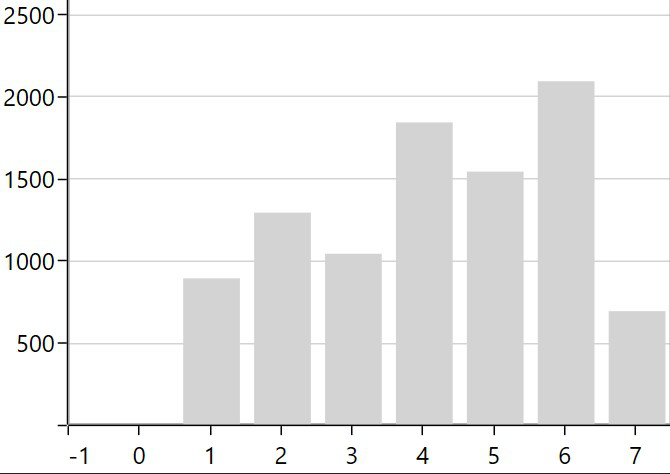

**AppendInterval**

If [`RangePadding`](https://help.syncfusion.com/cr/wpf/Syncfusion.UI.Xaml.Charts.NumericalAxis.html#Syncfusion_UI_Xaml_Charts_NumericalAxis_RangePadding) for [`NumericalAxis`](https://help.syncfusion.com/cr/wpf/Syncfusion.UI.Xaml.Charts.NumericalAxis.html#) is set to [`AppendInterval`](https://help.syncfusion.com/cr/wpf/Syncfusion.UI.Xaml.Charts.NumericalPadding.html), the interval of the axis is added in the end as padding.

The following screenshot demonstrates a chart’s x-axis with [`RangePadding`](https://help.syncfusion.com/cr/wpf/Syncfusion.UI.Xaml.Charts.NumericalAxis.html#Syncfusion_UI_Xaml_Charts_NumericalAxis_RangePadding) set to [`AppendInterval`](https://help.syncfusion.com/cr/wpf/Syncfusion.UI.Xaml.Charts.NumericalPadding.html).





<syncfusion:SfChart.PrimaryAxis>

<syncfusion:NumericalAxis  RangePadding="AppendInterval">

</syncfusion:NumericalAxis>

</syncfusion:SfChart.PrimaryAxis>





chart.PrimaryAxis = new NumericalAxis()
{

    RangePadding = NumericalPadding.AppendInterval

};





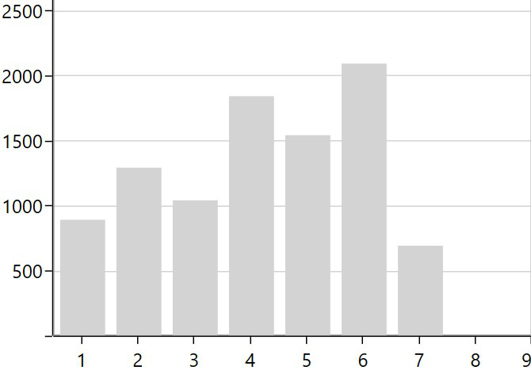

##  Applying Padding to the Axis

[`PlotOffset`](https://help.syncfusion.com/cr/wpf/Syncfusion.UI.Xaml.Charts.ChartAxis.html#Syncfusion_UI_Xaml_Charts_ChartAxis_PlotOffset) property is used to provide padding to the axis. The following code snippet demonstrates the padding applied to both x and y axes.





<syncfusion:SfChart.PrimaryAxis>

<syncfusion:NumericalAxis  PlotOffset="30">

</syncfusion:NumericalAxis>

</syncfusion:SfChart.PrimaryAxis>

<syncfusion:SfChart.SecondaryAxis>

<syncfusion:NumericalAxis PlotOffset="30">

</syncfusion:NumericalAxis>

</syncfusion:SfChart.SecondaryAxis>





chart.PrimaryAxis = new NumericalAxis()
{

    PlotOffset = 30

};

chart.SecondaryAxis = new NumericalAxis()
{

    PlotOffset = 30

};





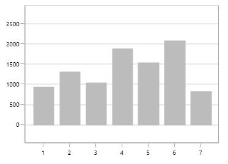

### PlotOffsetStart

[`PlotOffsetStart`](https://help.syncfusion.com/cr/wpf/Syncfusion.UI.Xaml.Charts.ChartAxis.html#Syncfusion_UI_Xaml_Charts_ChartAxis_PlotOffsetStart) property is used to provide padding to the axis at start position. The following code snippet demonstrates the padding applied to start position for both x and y axes.





<syncfusion:SfChart.PrimaryAxis>

<syncfusion:NumericalAxis  PlotOffsetStart="30">

</syncfusion:NumericalAxis>

</syncfusion:SfChart.PrimaryAxis>

<syncfusion:SfChart.SecondaryAxis>

<syncfusion:NumericalAxis PlotOffsetStart="30">

</syncfusion:NumericalAxis>

</syncfusion:SfChart.SecondaryAxis>





chart.PrimaryAxis = new NumericalAxis()
{

    PlotOffsetStart = 30

};

chart.SecondaryAxis = new NumericalAxis()
{

    PlotOffsetStart = 30

};





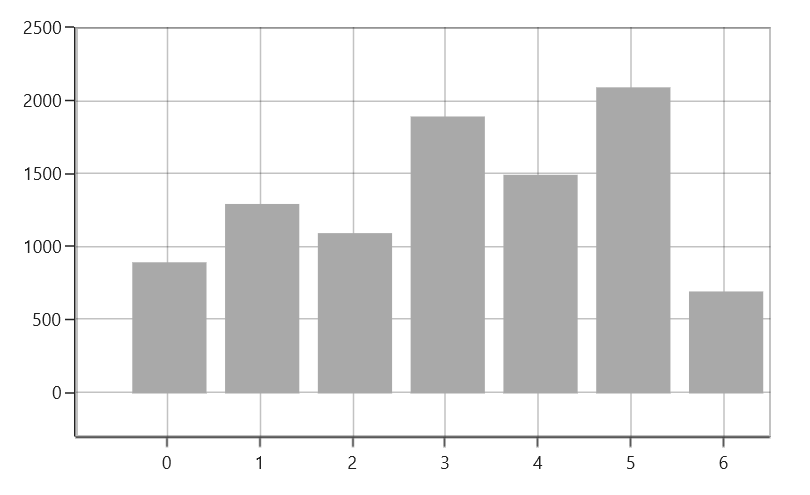

### PlotOffsetEnd

[`PlotOffsetEnd`](https://help.syncfusion.com/cr/wpf/Syncfusion.UI.Xaml.Charts.ChartAxis.html#Syncfusion_UI_Xaml_Charts_ChartAxis_PlotOffsetEnd) property is used to provide padding to the axis at end position. The following code snippet demonstrates the padding applied to end position for both x and y axes.





<syncfusion:SfChart.PrimaryAxis>

<syncfusion:NumericalAxis  PlotOffsetEnd="30">

</syncfusion:NumericalAxis>

</syncfusion:SfChart.PrimaryAxis>

<syncfusion:SfChart.SecondaryAxis>

<syncfusion:NumericalAxis PlotOffsetEnd="30">

</syncfusion:NumericalAxis>

</syncfusion:SfChart.SecondaryAxis>





chart.PrimaryAxis = new NumericalAxis()
{

    PlotOffsetEnd = 30

};

chart.SecondaryAxis = new NumericalAxis()
{

    PlotOffsetEnd = 30

};





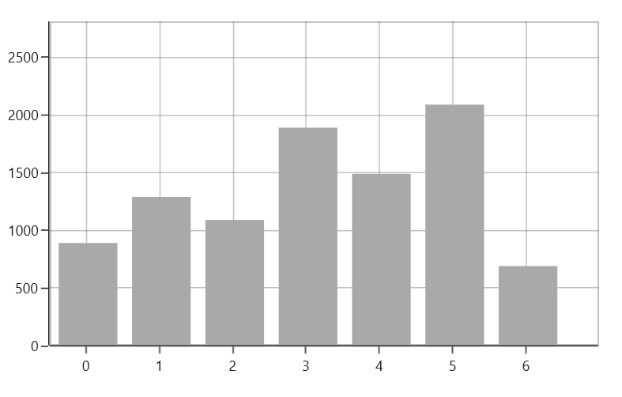

## AutoScrollingDelta

[`AutoScrollingDelta`](https://help.syncfusion.com/cr/wpf/Syncfusion.Windows.Chart.ChartAxis.html#Syncfusion_Windows_Chart_ChartAxis_AutoScrollingDelta) is used to ensure whether the specified range of data is always visible in the chart. It always shows the recently added data points at the end, and the scrolling will be reset to the end of the range whenever a new point is added. 

By activating the [`EnableScrollBar`](https://help.syncfusion.com/cr/wpf/Syncfusion.UI.Xaml.Charts.ChartAxisBase2D.html#Syncfusion_UI_Xaml_Charts_ChartAxisBase2D_EnableScrollBar) property of the axis or by adding [`ChartZoomPanBehavior`](https://help.syncfusion.com/cr/wpf/Syncfusion.UI.Xaml.Charts.ChartZoomPanBehavior.html) to the chart, you can scroll to the previous data points.

### AutoScrollingDeltaType

In [`DateTimeAxis`](https://help.syncfusion.com/cr/wpf/Syncfusion.UI.Xaml.Charts.DateTimeAxis.html), you can apply auto scrolling delta value in [`Years`](https://help.syncfusion.com/cr/wpf/Syncfusion.UI.Xaml.Charts.DateTimeIntervalType.html), [`Months`](https://help.syncfusion.com/cr/wpf/Syncfusion.UI.Xaml.Charts.DateTimeIntervalType.html), [`Days`](https://help.syncfusion.com/cr/wpf/Syncfusion.UI.Xaml.Charts.DateTimeIntervalType.html), [`Hours`](https://help.syncfusion.com/cr/wpf/Syncfusion.UI.Xaml.Charts.DateTimeIntervalType.html), [`Minutes`](https://help.syncfusion.com/cr/wpf/Syncfusion.UI.Xaml.Charts.DateTimeIntervalType.html), [`Seconds`](https://help.syncfusion.com/cr/wpf/Syncfusion.UI.Xaml.Charts.DateTimeIntervalType.html) and [`Milliseconds`](https://help.syncfusion.com/cr/wpf/Syncfusion.UI.Xaml.Charts.DateTimeIntervalType.html) by setting the [`AutoScrollingDeltaType`](https://help.syncfusion.com/cr/wpf/Syncfusion.UI.Xaml.Charts.DateTimeAxis.html#Syncfusion_UI_Xaml_Charts_DateTimeAxis_AutoScrollingDeltaType) property. The default value of this property is [`Auto`](https://help.syncfusion.com/cr/wpf/Syncfusion.UI.Xaml.Charts.DateTimeIntervalType.html), and the delta will be calculated automatically based on range.

 



<chart:SfChart.PrimaryAxis>

    <chart:DateTimeAxis AutoScrollingDelta = "3" AutoScrollingDeltaType = "Days">

</chart:SfChart.PrimaryAxis>





chart.PrimaryAxis = new DateTimeAxis()
{
      AutoScrollingDelta = 3,
	  
      AutoScrollingDeltaType = DateTimeIntervalType.Days
};





### AutoScrollingMode

The [`AutoScrollingMode`](https://help.syncfusion.com/cr/wpf/Syncfusion.UI.Xaml.Charts.ChartAxisBase2D.html#Syncfusion_UI_Xaml_Charts_ChartAxisBase2D_AutoScrollingMode) property is used to determine whether the axis should be scrolled from the start position or end position. The default value of this property is [`End`](https://help.syncfusion.com/cr/wpf/Syncfusion.UI.Xaml.Charts.ChartAutoScrollingMode.html).

 



<chart:SfChart.PrimaryAxis>

    <chart:DateTimeAxis AutoScrollingDelta = "3" AutoScrollingMode = "Start">

</chart:SfChart.PrimaryAxis>





chart.PrimaryAxis = new DateTimeAxis()
{
      AutoScrollingDelta = 3,
	  
      AutoScrollingMode = ChartAutoScrollingMode.Start
};





## Auto Interval Calculation on Zooming

[`EnableAutoIntervalOnZooming`](https://help.syncfusion.com/cr/wpf/Syncfusion.UI.Xaml.Charts.ChartAxis.html#Syncfusion_UI_Xaml_Charts_ChartAxis_EnableAutoIntervalOnZooming) property is used to maintain the interval even it is in zooming state only if we set the interval to the axis. Default value of this property is true. While zooming based on the auto range padding the interval will be calculated.

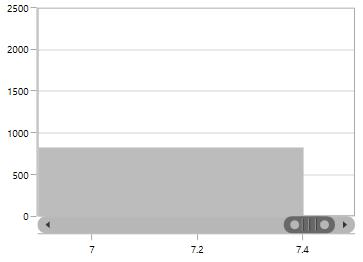

If you set [`EnableAutoIntervalOnZooming`](https://help.syncfusion.com/cr/wpf/Syncfusion.UI.Xaml.Charts.ChartAxis.html#Syncfusion_UI_Xaml_Charts_ChartAxis_EnableAutoIntervalOnZooming) as False, the intervals will be calculated on the interval based on the axis while zooming.





<syncfusion:SfChart.PrimaryAxis>

<syncfusion:NumericalAxis  EnableScrollBar="True" Interval="1"

EnableAutoIntervalOnZooming="False">

</syncfusion:NumericalAxis>

</syncfusion:SfChart.PrimaryAxis>





chart.PrimaryAxis = new NumericalAxis()
{

    EnableScrollBar = true,

    EnableAutoIntervalOnZooming = false,

    Interval = 1

};





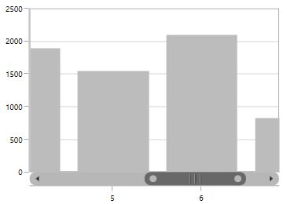

## Multiple Axes

SfChart provides a way to arrange multiple series inside the same chart area, giving the chart more space than x-axis and y-axis. These axes can be arranged in a stacking order or in a side by side pattern.

By default, all the series are plotted based on primary and secondary axis. You can add more axes by adding additional axis to the series. There are two properties [`XAxis`](https://help.syncfusion.com/cr/wpf/Syncfusion.UI.Xaml.Charts.CartesianSeries.html#Syncfusion_UI_Xaml_Charts_CartesianSeries_XAxis) and [`YAxis`](https://help.syncfusion.com/cr/wpf/Syncfusion.UI.Xaml.Charts.CartesianSeries.html#Syncfusion_UI_Xaml_Charts_CartesianSeries_YAxis) in all the series type which is used to provide Multiple axes support, except [`AccumulationSeries`](https://help.syncfusion.com/cr/wpf/Syncfusion.UI.Xaml.Charts.AccumulationSeriesBase.html#).





<syncfusion:ColumnSeries ItemsSource="{Binding Demands}"

XBindingPath="Demand"  YBindingPath="Year2011">

</syncfusion:ColumnSeries>

<syncfusion:LineSeries  ItemsSource="{Binding Demands}"

XBindingPath="Date"  YBindingPath="Year2011">

<syncfusion:LineSeries.XAxis>

<syncfusion:DateTimeAxis />

</syncfusion:LineSeries.XAxis>

<syncfusion:LineSeries.YAxis>

<syncfusion:NumericalAxis/>

</syncfusion:LineSeries.YAxis>

</syncfusion:LineSeries>





ColumnSeries series1 = new ColumnSeries()
{

    ItemsSource = new ViewModel().Demands,

    XBindingPath = "Demand",

    YBindingPath = "Year2011"
    
};

LineSeries series2 = new LineSeries()
{

    ItemsSource = new ViewModel().Demands,

    XBindingPath = "Date",

    YBindingPath = "Year2011",

};

series2.XAxis = new DateTimeAxis()
{

    Header = "Additional X Axis"

};

series2.YAxis = new NumericalAxis()
{

    Header = "Additional Y Axis"

};

chart.Series.Add(series1);

chart.Series.Add(series2);





In the above screenshot, the LineSeries is plotted based on additional X & Y axes, and ColumnSeries (or remaining series) is plotted based on the primary and secondary axes.

## Multi-level Labels

[`Axis`](https://help.syncfusion.com/wpf/sfchart/axis) can be customized with multiple levels of label by using its [`MultiLevelLabels`](https://help.syncfusion.com/cr/wpf/Syncfusion.UI.Xaml.Charts.ChartAxisBase2D.html#Syncfusion_UI_Xaml_Charts_ChartAxisBase2D_MultiLevelLabels) property. These labels are placed based on the provided [`Start`](https://help.syncfusion.com/cr/wpf/Syncfusion.UI.Xaml.Charts.ChartMultiLevelLabel.html#Syncfusion_UI_Xaml_Charts_ChartMultiLevelLabel_Start) and [`End`](https://help.syncfusion.com/cr/wpf/Syncfusion.UI.Xaml.Charts.ChartMultiLevelLabel.html#Syncfusion_UI_Xaml_Charts_ChartMultiLevelLabel_End) range values. You can add any number of labels to an axis. The following code example illustrates how to set a multilevel label.





<chart:SfChart.PrimaryAxis>

<chart:CategoryAxis ShowLabelBorder="True">

<chart:CategoryAxis.MultiLevelLabels>

<chart:ChartMultiLevelLabel Start="-0.5" End="2.5" Text="Quarter 1" />

</chart:CategoryAxis.MultiLevelLabels>

</chart:CategoryAxis>

</chart:SfChart.PrimaryAxis>





chart.PrimaryAxis =  new CategoryAxis()
            
{
     ShowLabelBorder = true,
            
};
            
ChartMultiLevelLabel label = new ChartMultiLevelLabel()
           
{
 
       Start = -0.5,

       End = 2.5,

       Text = "Quarter 1"

};

chart.PrimaryAxis.MultiLevelLabels.Add(label);





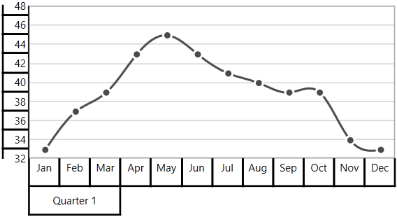

**Regarding** **Start** **and** **End** **Properties**

[`Start`](https://help.syncfusion.com/cr/wpf/Syncfusion.UI.Xaml.Charts.ChartMultiLevelLabel.html#Syncfusion_UI_Xaml_Charts_ChartMultiLevelLabel_Start) and [`End`](https://help.syncfusion.com/cr/wpf/Syncfusion.UI.Xaml.Charts.ChartMultiLevelLabel.html#Syncfusion_UI_Xaml_Charts_ChartMultiLevelLabel_End) properties of [`ChartMultiLevelLabel`](https://help.syncfusion.com/cr/wpf/Syncfusion.UI.Xaml.Charts.ChartMultiLevelLabel.html) are type of objects. You can provide the start and end values for a multi-level label based on its Axis type. It is described  in the following table.

<table>
<tr>
<th>S.No</th>
<th>Axis Type</th>
<th>Start/End value</th>
<th>Example</th>
</tr>
<tr>
<td>1</td>
<td>CategoryAxis</td>
<td>Index-Based</td>
<td>Start=0(zeroth index position) End = 1(first index position)</td>
</tr>
<tr>
<td>2</td>
<td>DateTimeCategoryAxis</td>
<td>Index-Based</td>
<td>Start = 0(zeroth index position) End = 1(first index position)</td>
</tr>
<tr>
<td>3</td>
<td>NumericalAxis</td>
<td>Value-Based</td>
<td>Start= 5( Value) End= 10( Value)</td>
</tr>
<tr>
<td>4</td>
<td>LogarithmicAxis</td>
<td>Value-Based</td>
<td>Start= 10(Value) End= 1000(Value)</td>
</tr>
<tr>
<td>5</td>
<td>DateTimeAxis</td>
<td>Value-Based</td>
<td>Start = "2017/01/01" End="2017/01/02"</td>
</tr>
<tr>
<td>6</td>
<td>TimeSpanAxis</td>
<td>Value-Based</td>
<td>Start = "00:00:01" End="00:00:05"</td>
</tr>
</table>

**Customizing** **multi-level** **labels**

**Border** **Customization**

[`ChartMultiLevelLabel`](https://help.syncfusion.com/cr/wpf/Syncfusion.UI.Xaml.Charts.ChartMultiLevelLabel.html) border width and color can be customized with [`LabelBorderWidth`](https://help.syncfusion.com/cr/wpf/Syncfusion.UI.Xaml.Charts.ChartAxisBase2D.html#Syncfusion_UI_Xaml_Charts_ChartAxisBase2D_LabelBorderWidth) and [`LabelBorderBrush`](https://help.syncfusion.com/cr/wpf/Syncfusion.UI.Xaml.Charts.ChartAxisBase2D.html#Syncfusion_UI_Xaml_Charts_ChartAxisBase2D_LabelBorderBrush) properties of chart axis. It can be set as shown in the following code example.





<chart:SfChart.PrimaryAxis>

<chart:CategoryAxis  LabelBorderBrush="Red" LabelBorderWidth="3"  ShowLabelBorder="True">

<chart:CategoryAxis.MultiLevelLabels>

<chart:ChartMultiLevelLabel Start="-0.5" End="2.5" Text="Quarter 1"  />

</chart:CategoryAxis.MultiLevelLabels>

</chart:CategoryAxis>

</chart:SfChart.PrimaryAxis>





chart.PrimaryAxis =  new CategoryAxis()
            
{
    LabelBorderWidth = 3,

    ShowLabelBorder = true,

    LabelBorderBrush = new SolidColorBrush(Colors.Red),
            
};
            
ChartMultiLevelLabel label = new ChartMultiLevelLabel()
           
{
 
       Start = -0.5,

       End = 2.5,

       Text = "Quarter 1",

       BorderWidth = 4

};

chart.PrimaryAxis.MultiLevelLabels.Add(label);





**Border** **Type**

[`Chart Axis`](https://help.syncfusion.com/wpf/sfchart/axis) provides support to various types of border for [`ChartMultiLevelLabels`](https://help.syncfusion.com/cr/wpf/Syncfusion.UI.Xaml.Charts.ChartMultiLevelLabel.html). It can be applied by using its [`MultiLevelLabelsBorderType`](https://help.syncfusion.com/cr/wpf/Syncfusion.UI.Xaml.Charts.ChartAxisBase2D.html#Syncfusion_UI_Xaml_Charts_ChartAxisBase2D_MultiLevelLabelsBorderType) property. The default [`MultiLevelLabelsBorderType`](https://help.syncfusion.com/cr/wpf/Syncfusion.UI.Xaml.Charts.ChartAxisBase2D.html#Syncfusion_UI_Xaml_Charts_ChartAxisBase2D_MultiLevelLabelsBorderType) is [`Rectangle`](https://help.syncfusion.com/cr/wpf/Syncfusion.UI.Xaml.Charts.BorderType.html). The another supported border types are [`Brace`](https://help.syncfusion.com/cr/wpf/Syncfusion.UI.Xaml.Charts.BorderType.html) ,[`None`](https://help.syncfusion.com/cr/wpf/Syncfusion.UI.Xaml.Charts.BorderType.html) and [`WithoutTopAndBottomBorder`](https://help.syncfusion.com/cr/wpf/Syncfusion.UI.Xaml.Charts.BorderType.html).

**Rectangle**





<chart:SfChart.PrimaryAxis>

<chart:CategoryAxis  ShowLabelBorder="True">

<chart:CategoryAxis.MultiLevelLabels>

<chart:ChartMultiLevelLabel Start="-0.5" End="2.5"  Text="Quarter 1" />

<chart:ChartMultiLevelLabel Start="2.5" End="5.5" Text="Quarter 2"/>

<chart:ChartMultiLevelLabel Start="5.5" End="8.5" Text="Quarter 3"/>

<chart:ChartMultiLevelLabel Start="8.5" End="11.5" Text="Quarter 4"/>

</chart:CategoryAxis.MultiLevelLabels>

</chart:CategoryAxis>

</chart:SfChart.PrimaryAxis>

<chart:SfChart.SecondaryAxis>

<chart:NumericalAxis  ShowLabelBorder="True">
                    
<chart:NumericalAxis.MultiLevelLabels>
                    
<chart:ChartMultiLevelLabel Start="32" End="36"  Text="Low"/>

<chart:ChartMultiLevelLabel Start="36" End="42" Text="Medium"/>

<chart:ChartMultiLevelLabel Start="42" End="48" Text="High"/>
                    
</chart:NumericalAxis.MultiLevelLabels>

</chart:NumericalAxis>

</chart:SfChart.SecondaryAxis>





chart.PrimaryAxis =  new CategoryAxis()
            
{
     ShowLabelBorder = true,          
};

ChartMultiLevelLabel label1 = new ChartMultiLevelLabel()
            
{
                
     Start = -0.5,

     End = 2.5,

     Text = "Quarter 1",
            
};

chart.PrimaryAxis.MultiLevelLabels.Add(label1);

ChartMultiLevelLabel label2 = new ChartMultiLevelLabel()
           
{
    
    Start = 2.5,
                
    End = 5.5,
                
    Text = "Quarter 2"
            
};

chart.PrimaryAxis.MultiLevelLabels.Add(label2);

ChartMultiLevelLabel label3 = new ChartMultiLevelLabel()

{
     
    Start = 5.5,
                
    End = 8.5,
                
    Text = "Quarter 3"
            
};

chart.PrimaryAxis.MultiLevelLabels.Add(label3);

ChartMultiLevelLabel label4 = new ChartMultiLevelLabel()

{
     Start = 8.5,
               
     End = 11.5,
                
     Text = "Quarter 4"
            
};

chart.PrimaryAxis.MultiLevelLabels.Add(label4);

chart.SecondaryAxis = new NumericalAxis()

{
      ShowLabelBorder = true,
};

ChartMultiLevelLabel label5 = new ChartMultiLevelLabel()
            
{
                
     Start = 32,
                
     End = 36,
     
     Text = "Low"
            
};
            
chart.SecondaryAxis.MultiLevelLabels.Add(label5);
            
ChartMultiLevelLabel label6 = new ChartMultiLevelLabel()

{
    Start = 36,
                
    End = 42,
    
    Text = "Medium"
};

chart.SecondaryAxis.MultiLevelLabels.Add(label6);

ChartMultiLevelLabel label7 = new ChartMultiLevelLabel()

{
     Start = 42,
     
     End = 48,
    
     Text = "High"
};

chart.SecondaryAxis.MultiLevelLabels.Add(label7);





**Brace**





<chart:SfChart.PrimaryAxis>

<chart:CategoryAxis MultiLevelLabelsBorderType="Brace" ShowLabelBorder="True">

<chart:CategoryAxis.MultiLevelLabels>

<chart:ChartMultiLevelLabel Start="-0.5" End="2.5"  Text="Quarter 1"  />

<chart:ChartMultiLevelLabel Start="2.5" End="5.5" Text="Quarter 2"  />

<chart:ChartMultiLevelLabel Start="5.5" End="8.5" Text="Quarter 3"  />

<chart:ChartMultiLevelLabel Start="8.5" End="11.5" Text="Quarter 4" />

</chart:CategoryAxis.MultiLevelLabels>

</chart:CategoryAxis>

</chart:SfChart.PrimaryAxis>

<chart:SfChart.SecondaryAxis>

<chart:NumericalAxis MultiLevelLabelsBorderType="Brace" ShowLabelBorder="True">
                    
<chart:NumericalAxis.MultiLevelLabels>
                    
<chart:ChartMultiLevelLabel Start="32" End="36"  Text="Low" />

<chart:ChartMultiLevelLabel Start="36" End="42" Text="Medium"/>

<chart:ChartMultiLevelLabel Start="42" End="48" Text="High" />
                    
</chart:NumericalAxis.MultiLevelLabels>

</chart:NumericalAxis>

</chart:SfChart.SecondaryAxis>





chart.PrimaryAxis =  new CategoryAxis()
            
{
   ShowLabelBorder = true,
  
   MultiLevelLabelsBorderType = BorderType.Brace
            
};

ChartMultiLevelLabel label1 = new ChartMultiLevelLabel()
            
{
                
     Start = -0.5,

     End = 2.5,

     Text = "Quarter 1",
};

chart.PrimaryAxis.MultiLevelLabels.Add(label1);

ChartMultiLevelLabel label2 = new ChartMultiLevelLabel()
           
{
    
    Start = 2.5,
                
    End = 5.5,
                
    Text = "Quarter 2",
};

chart.PrimaryAxis.MultiLevelLabels.Add(label2);

ChartMultiLevelLabel label3 = new ChartMultiLevelLabel()

{
     
    Start = 5.5,
                
    End = 8.5,
                
    Text = "Quarter 3",
            
};

chart.PrimaryAxis.MultiLevelLabels.Add(label3);

ChartMultiLevelLabel label4 = new ChartMultiLevelLabel()

{
     Start = 8.5,
               
     End = 11.5,
                
     Text = "Quarter 4",
            
};

chart.PrimaryAxis.MultiLevelLabels.Add(label4);

chart.SecondaryAxis = new NumericalAxis()

{
   ShowLabelBorder = true,

   MultiLevelLabelsBorderType = BorderType.Brace
};

ChartMultiLevelLabel label5 = new ChartMultiLevelLabel()
            
{
                
     Start = 32,
                
     End = 36,
     
     Text = "Low",
            
};
            
chart.SecondaryAxis.MultiLevelLabels.Add(label5);
            
ChartMultiLevelLabel label6 = new ChartMultiLevelLabel()

{
    Start = 36,
                
    End = 42,
    
    Text = "Medium",
};

chart.SecondaryAxis.MultiLevelLabels.Add(label6);

ChartMultiLevelLabel label7 = new ChartMultiLevelLabel()

{
     Start = 42,
     
     End = 48,
    
     Text = "High",
};

chart.SecondaryAxis.MultiLevelLabels.Add(label7);





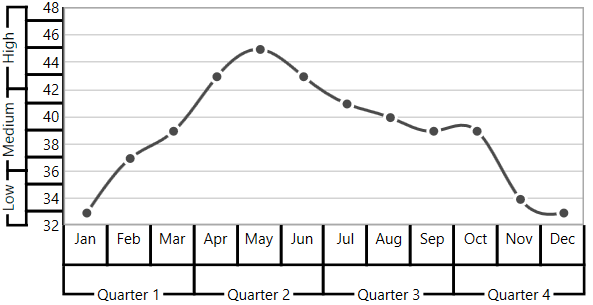

**None**





<chart:SfChart.PrimaryAxis  MultiLevelLabelsBorderType="None" ShowLabelBorder="True">

<chart:CategoryAxis>

<chart:CategoryAxis.MultiLevelLabels>

<chart:ChartMultiLevelLabel Start="-0.5" End="2.5"  Text="Quarter 1" />

<chart:ChartMultiLevelLabel Start="2.5" End="5.5" Text="Quarter 2" />

<chart:ChartMultiLevelLabel Start="5.5" End="8.5" Text="Quarter 3" />

<chart:ChartMultiLevelLabel Start="8.5" End="11.5" Text="Quarter 4" />

</chart:CategoryAxis.MultiLevelLabels>

</chart:CategoryAxis>

</chart:SfChart.PrimaryAxis>

<chart:SfChart.SecondaryAxis>

<chart:NumericalAxis MultiLevelLabelsBorderType="None" ShowLabelBorder="True">
                    
<chart:NumericalAxis.MultiLevelLabels>
                    
<chart:ChartMultiLevelLabel Start="32" End="36"  Text="Low" />

<chart:ChartMultiLevelLabel Start="36" End="42" Text="Medium" />

<chart:ChartMultiLevelLabel Start="42" End="48" Text="High" />
                    
</chart:NumericalAxis.MultiLevelLabels>

</chart:NumericalAxis>

</chart:SfChart.SecondaryAxis>





chart.PrimaryAxis =  new CategoryAxis()
            
{
    ShowLabelBorder = true,          

    MultiLevelLabelsBorderType = BorderType.None
            
};

ChartMultiLevelLabel label1 = new ChartMultiLevelLabel()
            
{
                
     Start = -0.5,

     End = 2.5,

     Text = "Quarter 1"
            
};

chart.PrimaryAxis.MultiLevelLabels.Add(label1);

ChartMultiLevelLabel label2 = new ChartMultiLevelLabel()
           
{
    
    Start = 2.5,
                
    End = 5.5,
                
    Text = "Quarter 2"
            
};

chart.PrimaryAxis.MultiLevelLabels.Add(label2);

ChartMultiLevelLabel label3 = new ChartMultiLevelLabel()

{
     
    Start = 5.5,
                
    End = 8.5,
                
    Text = "Quarter 3"
};

chart.PrimaryAxis.MultiLevelLabels.Add(label3);

ChartMultiLevelLabel label4 = new ChartMultiLevelLabel()

{
     Start = 8.5,
               
     End = 11.5,
                
     Text = "Quarter 4"
            
};

chart.PrimaryAxis.MultiLevelLabels.Add(label4);

chart.SecondaryAxis = new NumericalAxis()

{
    
    ShowLabelBorder = true,          

    MultiLevelLabelsBorderType = BorderType.None

};

ChartMultiLevelLabel label5 = new ChartMultiLevelLabel()
            
{
                
     Start = 32,
                
     End = 36,
     
     Text = "Low"
            
};
            
chart.SecondaryAxis.MultiLevelLabels.Add(label5);
            
ChartMultiLevelLabel label6 = new ChartMultiLevelLabel()

{
    Start = 36,
                
    End = 42,
    
    Text = "Medium"
};

chart.SecondaryAxis.MultiLevelLabels.Add(label6);

ChartMultiLevelLabel label7 = new ChartMultiLevelLabel()

{
     Start = 42,
     
     End = 48,
    
     Text = "High"
};

chart.SecondaryAxis.MultiLevelLabels.Add(label7);





**WithoutTopAndBottomBorder**





<chart:SfChart.PrimaryAxis>

<chart:CategoryAxis   ShowLabelBorder="True" MultiLevelLabelsBorderType="WithoutTopAndBottomBorder">

<chart:CategoryAxis.MultiLevelLabels>

<chart:ChartMultiLevelLabel Start="-0.5" End="2.5"  Text="Quarter 1"/>

<chart:ChartMultiLevelLabel Start="2.5" End="5.5" Text="Quarter 2" />

<chart:ChartMultiLevelLabel Start="5.5" End="8.5" Text="Quarter 3" />

<chart:ChartMultiLevelLabel Start="8.5" End="11.5" Text="Quarter 4" />

</chart:CategoryAxis.MultiLevelLabels>

</chart:CategoryAxis>

</chart:SfChart.PrimaryAxis>

<chart:SfChart.SecondaryAxis>

<chart:NumericalAxis  ShowLabelBorder="True" MultiLevelLabelsBorderType="WithoutTopAndBottomBorder">
                    
<chart:NumericalAxis.MultiLevelLabels>
                    
<chart:ChartMultiLevelLabel Start="32" End="36"  Text="Low" />

<chart:ChartMultiLevelLabel Start="36" End="42" Text="Medium"/>

<chart:ChartMultiLevelLabel Start="42" End="48" Text="High"/>
                    
</chart:NumericalAxis.MultiLevelLabels>

</chart:NumericalAxis>

</chart:SfChart.SecondaryAxis>





chart.PrimaryAxis =  new CategoryAxis()
            
{
   ShowLabelBorder = true,

   MultiLevelLabelsBorderType = BorderType.WithoutTopAndBottomBorder
            
};

ChartMultiLevelLabel label1 = new ChartMultiLevelLabel()
            
{
                
     Start = -0.5,

     End = 2.5,

     Text = "Quarter 1",
            
};

chart.PrimaryAxis.MultiLevelLabels.Add(label1);

ChartMultiLevelLabel label2 = new ChartMultiLevelLabel()
           
{
    
    Start = 2.5,
                
    End = 5.5,
                
    Text = "Quarter 2",
           
};

chart.PrimaryAxis.MultiLevelLabels.Add(label2);

ChartMultiLevelLabel label3 = new ChartMultiLevelLabel()

{
     
    Start = 5.5,
                
    End = 8.5,
                
    Text = "Quarter 3",
            
};

chart.PrimaryAxis.MultiLevelLabels.Add(label3);

ChartMultiLevelLabel label4 = new ChartMultiLevelLabel()

{
     Start = 8.5,
               
     End = 11.5,
                
     Text = "Quarter 4",
};

chart.PrimaryAxis.MultiLevelLabels.Add(label4);

chart.SecondaryAxis = new NumericalAxis()

{
    
    ShowLabelBorder = true,

   MultiLevelLabelsBorderType = BorderType.WithoutTopAndBottomBorder

};

ChartMultiLevelLabel label5 = new ChartMultiLevelLabel()
            
{
                
     Start = 32,
                
     End = 36,
     
     Text = "Low",
            
};
            
chart.SecondaryAxis.MultiLevelLabels.Add(label5);
            
ChartMultiLevelLabel label6 = new ChartMultiLevelLabel()

{
    Start = 36,
                
    End = 42,
    
    Text = "Medium",
};

chart.SecondaryAxis.MultiLevelLabels.Add(label6);

ChartMultiLevelLabel label7 = new ChartMultiLevelLabel()

{
     Start = 42,
     
     End = 48,
    
     Text = "High",
};

chart.SecondaryAxis.MultiLevelLabels.Add(label7);





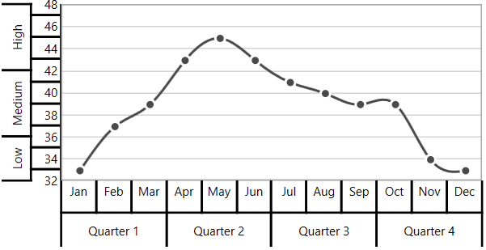

**Text** **Customization**

[`ChartMultiLevelLabel`]((https://help.syncfusion.com/cr/wpf/Syncfusion.UI.Xaml.Charts.ChartMultiLevelLabel.html)) text can be customized with its [`FontSize`](https://help.syncfusion.com/cr/wpf/Syncfusion.UI.Xaml.Charts.ChartMultiLevelLabel.html#Syncfusion_UI_Xaml_Charts_ChartMultiLevelLabel_FontSizeProperty), [`FontFamily`](https://help.syncfusion.com/cr/wpf/Syncfusion.UI.Xaml.Charts.ChartMultiLevelLabel.html#Syncfusion_UI_Xaml_Charts_ChartMultiLevelLabel_FontFamilyProperty) and [`Foreground`](https://help.syncfusion.com/cr/wpf/Syncfusion.UI.Xaml.Charts.ChartMultiLevelLabel.html#Syncfusion_UI_Xaml_Charts_ChartMultiLevelLabel_ForegroundProperty) properties. It is shown in following code example.





<chart:SfChart.PrimaryAxis>

<chart:CategoryAxis  ShowLabelBorder="True">

<chart:CategoryAxis.MultiLevelLabels>

<chart:ChartMultiLevelLabel Start="-0.5" End="11.5" FontFamily="Algerian" Foreground="Blue" FontSize="14" Text="Year - 2016"/>

</chart:CategoryAxis.MultiLevelLabels>

</chart:CategoryAxis>

</chart:SfChart.PrimaryAxis>





chart.PrimaryAxis =  new CategoryAxis()
            
{
      ShowLabelBorder = true,            
};
            
ChartMultiLevelLabel label = new ChartMultiLevelLabel()
           
{
 
    Start = -0.5,
                
    End = 11.5,
                
    Text = "Year - 2016",
                
    Foreground = new SolidColorBrush(Colors.Blue),
                
    FontSize = 14,
                
    FontFamily = new FontFamily("Algerian")

};

chart.PrimaryAxis.MultiLevelLabels.Add(label);





**Label** **Alignment**

The text of [`ChartMultiLevelLabel`](https://help.syncfusion.com/cr/wpf/Syncfusion.UI.Xaml.Charts.ChartMultiLevelLabel.html) can be aligned with its [`LabelAlignment`](https://help.syncfusion.com/cr/wpf/Syncfusion.UI.Xaml.Charts.ChartMultiLevelLabel.html#Syncfusion_UI_Xaml_Charts_ChartMultiLevelLabel_LabelAlignmentProperty) property. The default value of [`LabelAlignment`](https://help.syncfusion.com/cr/wpf/Syncfusion.UI.Xaml.Charts.ChartMultiLevelLabel.html#Syncfusion_UI_Xaml_Charts_ChartMultiLevelLabel_LabelAlignmentProperty) property is Center.

**Center**





<chart:SfChart.PrimaryAxis>

<chart:CategoryAxis  ShowLabelBorder="True">

<chart:CategoryAxis.MultiLevelLabels>

<chart:ChartMultiLevelLabel Start="-0.5" End="2.5"  Text="Quarter 1" />

<chart:ChartMultiLevelLabel Start="2.5" End="5.5" Text="Quarter 2"/>

<chart:ChartMultiLevelLabel Start="5.5" End="8.5" Text="Quarter 3"/>

<chart:ChartMultiLevelLabel Start="8.5" End="11.5" Text="Quarter 4"/>

</chart:CategoryAxis.MultiLevelLabels>

</chart:CategoryAxis>

</chart:SfChart.PrimaryAxis>

<chart:SfChart.SecondaryAxis>

<chart:NumericalAxis ShowLabelBorder="True">
                    
<chart:NumericalAxis.MultiLevelLabels>
                    
<chart:ChartMultiLevelLabel Start="32" End="36"  Text="Low"/>

<chart:ChartMultiLevelLabel Start="36" End="42" Text="Medium"/>

<chart:ChartMultiLevelLabel Start="42" End="48" Text="High"/>
                    
</chart:NumericalAxis.MultiLevelLabels>

</chart:NumericalAxis>

</chart:SfChart.SecondaryAxis>





chart.PrimaryAxis =  new CategoryAxis()
            
{
     ShowLabelBorder = true,                       
};

ChartMultiLevelLabel label1 = new ChartMultiLevelLabel()
            
{
                
     Start = -0.5,

     End = 2.5,

     Text = "Quarter 1",
            
};

chart.PrimaryAxis.MultiLevelLabels.Add(label1);

ChartMultiLevelLabel label2 = new ChartMultiLevelLabel()
           
{
    
    Start = 2.5,
                
    End = 5.5,
                
    Text = "Quarter 2"
            
};

chart.PrimaryAxis.MultiLevelLabels.Add(label2);

ChartMultiLevelLabel label3 = new ChartMultiLevelLabel()

{
     
    Start = 5.5,
                
    End = 8.5,
                
    Text = "Quarter 3"
            
};

chart.PrimaryAxis.MultiLevelLabels.Add(label3);

ChartMultiLevelLabel label4 = new ChartMultiLevelLabel()

{
     Start = 8.5,
               
     End = 11.5,
                
     Text = "Quarter 4"
            
};

chart.PrimaryAxis.MultiLevelLabels.Add(label4);

chart.SecondaryAxis = new NumericalAxis()

{
      ShowLabelBorder = true,            
};

ChartMultiLevelLabel label5 = new ChartMultiLevelLabel()
            
{
                
     Start = 32,
                
     End = 36,
     
     Text = "Low"
            
};
            
chart.SecondaryAxis.MultiLevelLabels.Add(label5);
            
ChartMultiLevelLabel label6 = new ChartMultiLevelLabel()

{
    Start = 36,
                
    End = 42,
    
    Text = "Medium"
};

chart.SecondaryAxis.MultiLevelLabels.Add(label6);

ChartMultiLevelLabel label7 = new ChartMultiLevelLabel()

{
     Start = 42,
     
     End = 48,
    
     Text = "High"
};

chart.SecondaryAxis.MultiLevelLabels.Add(label7);





**Near**





<chart:SfChart.PrimaryAxis>

<chart:CategoryAxis ShowLabelBorder="True">

<chart:CategoryAxis.MultiLevelLabels>

<chart:ChartMultiLevelLabel Start="-0.5" End="2.5"  Text="Quarter 1"   LabelAlignment="Near" />

<chart:ChartMultiLevelLabel Start="2.5" End="5.5" Text="Quarter 2"  LabelAlignment="Near"/>

<chart:ChartMultiLevelLabel Start="5.5" End="8.5" Text="Quarter 3"  LabelAlignment="Near"/>

<chart:ChartMultiLevelLabel Start="8.5" End="11.5" Text="Quarter 4"  LabelAlignment="Near"/>

</chart:CategoryAxis.MultiLevelLabels>

</chart:CategoryAxis>

</chart:SfChart.PrimaryAxis>

<chart:SfChart.SecondaryAxis>

<chart:NumericalAxis ShowLabelBorder="True">
                    
<chart:NumericalAxis.MultiLevelLabels>
                    
<chart:ChartMultiLevelLabel Start="32" End="36"  Text="Low"  LabelAlignment="Near"/>

<chart:ChartMultiLevelLabel Start="36" End="42" Text="Medium"  LabelAlignment="Near"/>

<chart:ChartMultiLevelLabel Start="42" End="48" Text="High"  LabelAlignment="Near"/>
                    
</chart:NumericalAxis.MultiLevelLabels>

</chart:NumericalAxis>

</chart:SfChart.SecondaryAxis>





chart.PrimaryAxis =  new CategoryAxis()
            
{
    ShowLabelBorder = true,                       
};

ChartMultiLevelLabel label1 = new ChartMultiLevelLabel()
            
{
                
     Start = -0.5,

     End = 2.5,

     Text = "Quarter 1",
    
     LabelAlignment = LabelAlignment.Near
            
};

chart.PrimaryAxis.MultiLevelLabels.Add(label1);

ChartMultiLevelLabel label2 = new ChartMultiLevelLabel()
           
{
    
    Start = 2.5,
                
    End = 5.5,
                
    Text = "Quarter 2",

    LabelAlignment = LabelAlignment.Near
            
};

chart.PrimaryAxis.MultiLevelLabels.Add(label2);

ChartMultiLevelLabel label3 = new ChartMultiLevelLabel()

{
     
    Start = 5.5,
                
    End = 8.5,
                
    Text = "Quarter 3",

    LabelAlignment = LabelAlignment.Near
            
};

chart.PrimaryAxis.MultiLevelLabels.Add(label3);

ChartMultiLevelLabel label4 = new ChartMultiLevelLabel()

{
     Start = 8.5,
               
     End = 11.5,
                
     Text = "Quarter 4",

     LabelAlignment = LabelAlignment.Near
            
};

chart.PrimaryAxis.MultiLevelLabels.Add(label4);

chart.SecondaryAxis = new NumericalAxis()

{   
    ShowLabelBorder = true,            
};

ChartMultiLevelLabel label5 = new ChartMultiLevelLabel()
            
{
                
     Start = 32,
                
     End = 36,
     
     Text = "Low",

     LabelAlignment = LabelAlignment.Near
            
};
            
chart.SecondaryAxis.MultiLevelLabels.Add(label5);
            
ChartMultiLevelLabel label6 = new ChartMultiLevelLabel()

{
    Start = 36,
                
    End = 42,
    
    Text = "Medium",

    LabelAlignment = LabelAlignment.Near
};

chart.SecondaryAxis.MultiLevelLabels.Add(label6);

ChartMultiLevelLabel label7 = new ChartMultiLevelLabel()

{
     Start = 42,
     
     End = 48,
    
     Text = "High",

     LabelAlignment = LabelAlignment.Near
};

chart.SecondaryAxis.MultiLevelLabels.Add(label7);





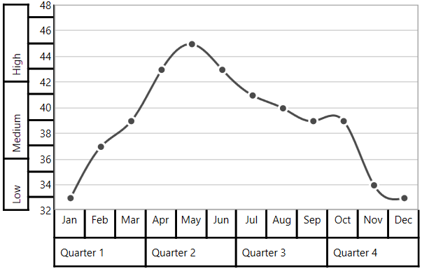

**Far**





<chart:SfChart.PrimaryAxis>

<chart:CategoryAxis  ShowLabelBorder="True">

<chart:CategoryAxis.MultiLevelLabels>

<chart:ChartMultiLevelLabel Start="-0.5" End="2.5"  Text="Quarter 1"   LabelAlignment="Far" />

<chart:ChartMultiLevelLabel Start="2.5" End="5.5" Text="Quarter 2"  LabelAlignment="Far"/>

<chart:ChartMultiLevelLabel Start="5.5" End="8.5" Text="Quarter 3"  LabelAlignment="Far"/>

<chart:ChartMultiLevelLabel Start="8.5" End="11.5" Text="Quarter 4"  LabelAlignment="Far"/>

</chart:CategoryAxis.MultiLevelLabels>

</chart:CategoryAxis>

</chart:SfChart.PrimaryAxis>

<chart:SfChart.SecondaryAxis>

<chart:NumericalAxis  ShowLabelBorder="True">
                    
<chart:NumericalAxis.MultiLevelLabels>
                    
<chart:ChartMultiLevelLabel Start="32" End="36"  Text="Low"  LabelAlignment="Far"/>

<chart:ChartMultiLevelLabel Start="36" End="42" Text="Medium"  LabelAlignment="Far"/>

<chart:ChartMultiLevelLabel Start="42" End="48" Text="High" LabelAlignment="Far"/>
                    
</chart:NumericalAxis.MultiLevelLabels>

</chart:NumericalAxis>

</chart:SfChart.SecondaryAxis>





chart.PrimaryAxis =  new CategoryAxis()
            
{
      ShowLabelBorder = true,          
};

ChartMultiLevelLabel label1 = new ChartMultiLevelLabel()
            
{
                
     Start = -0.5,

     End = 2.5,

     Text = "Quarter 1",
    
     LabelAlignment = LabelAlignment.Near
            
};

chart.PrimaryAxis.MultiLevelLabels.Add(label1);

ChartMultiLevelLabel label2 = new ChartMultiLevelLabel()
           
{
    
    Start = 2.5,
                
    End = 5.5,
                
    Text = "Quarter 2",

    LabelAlignment = LabelAlignment.Near
            
};

chart.PrimaryAxis.MultiLevelLabels.Add(label2);

ChartMultiLevelLabel label3 = new ChartMultiLevelLabel()

{
     
    Start = 5.5,
                
    End = 8.5,
                
    Text = "Quarter 3",

    LabelAlignment = LabelAlignment.Near
            
};

chart.PrimaryAxis.MultiLevelLabels.Add(label3);

ChartMultiLevelLabel label4 = new ChartMultiLevelLabel()

{
     Start = 8.5,
               
     End = 11.5,
                
     Text = "Quarter 4",

     LabelAlignment = LabelAlignment.Near
            
};

chart.PrimaryAxis.MultiLevelLabels.Add(label4);

chart.SecondaryAxis = new NumericalAxis()

{
      ShowLabelBorder = true,          
};

ChartMultiLevelLabel label5 = new ChartMultiLevelLabel()
            
{
                
     Start = 32,
                
     End = 36,
     
     Text = "Low",

     LabelAlignment = LabelAlignment.Near
            
};
            
chart.SecondaryAxis.MultiLevelLabels.Add(label5);
            
ChartMultiLevelLabel label6 = new ChartMultiLevelLabel()

{
    Start = 36,
                
    End = 42,
    
    Text = "Medium",

    LabelAlignment = LabelAlignment.Near
};

chart.SecondaryAxis.MultiLevelLabels.Add(label6);

ChartMultiLevelLabel label7 = new ChartMultiLevelLabel()

{
     Start = 42,
     
     End = 48,
    
     Text = "High",

     LabelAlignment = LabelAlignment.Near
};

chart.SecondaryAxis.MultiLevelLabels.Add(label7);





The text of [`ChartMultiLevelLabel`](https://help.syncfusion.com/cr/wpf/Syncfusion.UI.Xaml.Charts.ChartMultiLevelLabel.html) will be trimmed automatically when the text width exceeds the width of [`ChartMultiLevelLabel`](https://help.syncfusion.com/cr/wpf/Syncfusion.UI.Xaml.Charts.ChartMultiLevelLabel.html), and it is shown below.





<chart:SfChart.SecondaryAxis>

<chart:NumericalAxis ShowLabelBorder="True">

<chart:NumericalAxis.MultiLevelLabels>

<chart:ChartMultiLevelLabel Start="32" End="36" Text="Low Temperature"/>

<chart:ChartMultiLevelLabel Start="36" End="42" Text="Medium Temperature"/>
                        
<chart:ChartMultiLevelLabel Start="42" End="48" Text="High Temperature"/>

</chart:NumericalAxis.MultiLevelLabels>

</chart:NumericalAxis>

</chart:SfChart.SecondaryAxis>





chart.SecondaryAxis = new NumericalAxis()
            
{
     ShowLabelBorder = true,          
};

ChartMultiLevelLabel label5 = new ChartMultiLevelLabel()
            
{
                
        Start = 32,
        
        End = 36,
        
        Text = "Low Temperature"
};

chart.SecondaryAxis.MultiLevelLabels.Add(label5);

ChartMultiLevelLabel label6 = new ChartMultiLevelLabel()

{
        Start = 36,
                
        End = 42,
        
        Text = "Medium Temperature"
            
};
    
chart.SecondaryAxis.MultiLevelLabels.Add(label6);

ChartMultiLevelLabel label7 = new ChartMultiLevelLabel()

{
                
       Start = 42,
               
       End = 48,
       
       Text = "High Temperature"
 
 };

 chart.SecondaryAxis.MultiLevelLabels.Add(label7);





## Events

### ActualRangeChanged

The [`ActualRangeChanged`](https://help.syncfusion.com/cr/wpf/Syncfusion.UI.Xaml.Charts.ChartAxis.html) event occurs when an axis range is changed. This argument contains the following information.

* [`ActualMinimum`](https://help.syncfusion.com/cr/wpf/Syncfusion.UI.Xaml.Charts.ActualRangeChangedEventArgs.html#Syncfusion_UI_Xaml_Charts_ActualRangeChangedEventArgs_ActualMinimum) - Gets or sets the actual minimum value of axis.
* [`ActualMaximum`](https://help.syncfusion.com/cr/wpf/Syncfusion.UI.Xaml.Charts.ActualRangeChangedEventArgs.html#Syncfusion_UI_Xaml_Charts_ActualRangeChangedEventArgs_ActualMaximum) - Gets or sets the actual maximum value of axis.
* [`VisibleMinimum`](https://help.syncfusion.com/cr/wpf/Syncfusion.UI.Xaml.Charts.ActualRangeChangedEventArgs.html#Syncfusion_UI_Xaml_Charts_ActualRangeChangedEventArgs_VisibleMinimum) - Gets or sets the visible minimum value of axis.
* [`VisibleMaximum`](https://help.syncfusion.com/cr/wpf/Syncfusion.UI.Xaml.Charts.ActualRangeChangedEventArgs.html#Syncfusion_UI_Xaml_Charts_ActualRangeChangedEventArgs_VisibleMaximum) - Gets or sets the visible maximum value of axis.
* [`ActualInterval`](https://help.syncfusion.com/cr/wpf/Syncfusion.UI.Xaml.Charts.ActualRangeChangedEventArgs.html#Syncfusion_UI_Xaml_Charts_ActualRangeChangedEventArgs_ActualInterval) - Gets the actual interval of axis.

### LabelCreated

The [`LabelCreated`](https://help.syncfusion.com/cr/wpf/Syncfusion.UI.Xaml.Charts.ChartAxis.html) event occurs when the axis label is created. This argument contains [`AxisLabel`](https://help.syncfusion.com/cr/wpf/Syncfusion.UI.Xaml.Charts.LabelCreatedEventArgs.html#Syncfusion_UI_Xaml_Charts_LabelCreatedEventArgs_AxisLabel) of [`ChartAxisLabel`](https://help.syncfusion.com/cr/wpf/Syncfusion.UI.Xaml.Charts.ChartAxisLabel.html), which contains the following properties.

* [`LabelContent`](https://help.syncfusion.com/cr/wpf/Syncfusion.UI.Xaml.Charts.ChartAxisLabel.html#Syncfusion_UI_Xaml_Charts_ChartAxisLabel_LabelContent) - Gets or sets the content of label.
* [`Position`](https://help.syncfusion.com/cr/wpf/Syncfusion.UI.Xaml.Charts.ChartAxisLabel.html#Syncfusion_UI_Xaml_Charts_ChartAxisLabel_Position) - Gets or sets the position of label.

### AxisBoundsChanged

The [`AxisBoundsChanged`](https://help.syncfusion.com/cr/wpf/Syncfusion.UI.Xaml.Charts.ChartAxis.html) event occurs when the bounds of the axis are changed. This argument contains the following information.

* [`NewBounds`](https://help.syncfusion.com/cr/wpf/Syncfusion.UI.Xaml.Charts.ChartAxisBoundsEventArgs.html#Syncfusion_UI_Xaml_Charts_ChartAxisBoundsEventArgs_NewBounds) - Gets the new axis bounds.
* [`OldBounds`](https://help.syncfusion.com/cr/wpf/Syncfusion.UI.Xaml.Charts.ChartAxisBoundsEventArgs.html#Syncfusion_UI_Xaml_Charts_ChartAxisBoundsEventArgs_OldBounds) - Gets the old axis bounds.

### LabelClicked

The [`LabelClicked`](https://help.syncfusion.com/cr/wpf/Syncfusion.UI.Xaml.Charts.ChartAxisBase2D.html) event is triggered when labels are clicked. Supports for 2D axis. The argument contains [`AxisLabel`](https://help.syncfusion.com/cr/wpf/Syncfusion.UI.Xaml.Charts.AxisLabelClickedEventArgs.html#Syncfusion_UI_Xaml_Charts_AxisLabelClickedEventArgs_AxisLabel) of [`ChartAxisLabel`](https://help.syncfusion.com/cr/wpf/Syncfusion.UI.Xaml.Charts.ChartAxisLabel.html), which contains the following properties.

* [`LabelContent`](https://help.syncfusion.com/cr/wpf/Syncfusion.UI.Xaml.Charts.ChartAxisLabel.html#Syncfusion_UI_Xaml_Charts_ChartAxisLabel_LabelContent) - Gets the content of label.
* [`Position`](https://help.syncfusion.com/cr/wpf/Syncfusion.UI.Xaml.Charts.ChartAxisLabel.html#Syncfusion_UI_Xaml_Charts_ChartAxisLabel_Position) - Gets the position of label.
* [`PrefixLabelTemplate`](https://help.syncfusion.com/cr/wpf/Syncfusion.UI.Xaml.Charts.ChartAxisLabel.html#Syncfusion_UI_Xaml_Charts_ChartAxisLabel_PrefixLabelTemplate) - Gets the prefix template of label.
* [`PostfixLabelTemplate`](https://help.syncfusion.com/cr/wpf/Syncfusion.UI.Xaml.Charts.ChartAxisLabel.html#Syncfusion_UI_Xaml_Charts_ChartAxisLabel_PostfixLabelTemplate) - Gets the postfix template of label.

## See also

[`How to get axis range in chart`](https://www.syncfusion.com/kb/10818/how-to-get-axis-range-in-chart)

[`How to wrap the multi-level axis label's text in WPF Chart`](https://www.syncfusion.com/kb/10167/how-to-wrap-the-multi-level-axis-labels-text-in-wpf-chart)

[`How to use the DateTimeAxis as SecondaryAxis in WPF Chart`](https://www.syncfusion.com/kb/9737/how-to-use-the-datetimeaxis-as-secondaryaxis-in-wpf-sfchart)

[`How to apply the custom labels in WPF Logarithmic Axis`](https://www.syncfusion.com/kb/9504/how-to-apply-the-custom-labels-in-wpf-logarithmicaxis)

[`How to customize label formats of date-time axis during the interval transitions`](https://www.syncfusion.com/kb/6940/how-to-customize-label-formats-of-date-time-axis-during-the-interval-transitions)

[`How to rotate axis label in the Chart`](https://www.syncfusion.com/kb/5239/how-to-rotate-axis-label-in-the-sfchart)

[`How to hide axis in chart`](https://www.syncfusion.com/kb/5236/how-to-hide-axis-in-chart)

[`How to position the primary and secondary axes as the center of chart`](https://www.syncfusion.com/kb/3833/how-to-position-the-primary-and-secondary-axes-as-the-center-of-chart)

[`How to display the axis labels in a particular format`](https://www.syncfusion.com/kb/3318/how-to-display-the-axis-labels-in-a-particular-format)

[`How to display the axis labels for all datapoints`](https://www.syncfusion.com/kb/2989/how-to-display-the-axis-labels-for-all-datapoints)

[`How to define ticker labels of custom axis`](https://www.syncfusion.com/kb/2588/how-to-define-ticker-labels-of-custom-axis)

[`How to display striplines in DateTimeAxis of WPF Chart`](https://www.syncfusion.com/kb/10674/how-to-display-striplines-in-datetimeaxis-of-wpf-chart)

[`How to set the custom labels with auto range for axis`](https://www.syncfusion.com/kb/5907/how-to-set-the-custom-labels-with-auto-range-for-axis)
