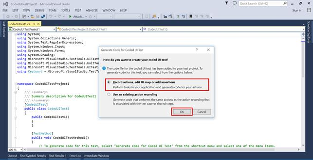
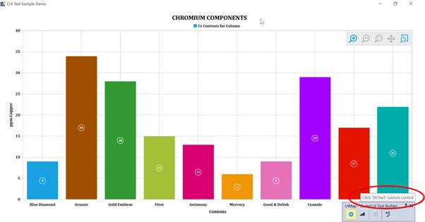
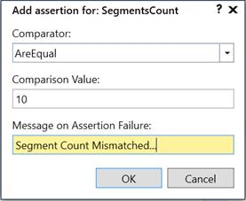
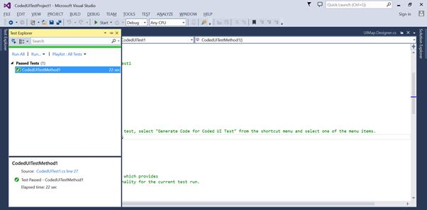

# Coded UI in WPF Charts (SfChart)

Automated tests that drive your application through its user interface (UI) are known as **coded** **UI** **tests** (CUITs). These tests include functional testing of the UI controls. SfChart supports Coded UI automation that helps you create automated tests for inner elements and records the sequence of actions. While dragging the crosshair on UI elements, it shows the properties of the respective UI elements and you can also add assertion for each of the properties.

## Levels

<table>
<tr>
<td>
Levels  </td><td>
Description  </td></tr>
<tr>
<td>
Level 1  </td><td>
Record and Identify UI Elements when you perform mouse and keyboard actions.  </td></tr>
<tr>
<td>
Level 2  </td><td>
Provide Custom properties for UI Elements when you drag the crosshair on the UI Element.  </td></tr>
<tr>
<td>
Level 3  </td><td>
CUIT generates code from recorded session. Create specialized class to access Custom Properties so the generate code is simplified.  </td></tr>
</table>

## Requirements

Coded UI provides support only in,

* Visual Studio Premium
* Visual Studio Enterprise
* Visual Studio Ultimate

For more info about the platforms and configurations refer [here](https://docs.microsoft.com/en-us/previous-versions/visualstudio/visual-studio-2015/test/supported-configurations-and-platforms-for-coded-ui-tests-and-action-recordings?view=vs-2015)

## Configuration

To test SfChart with CUITs, build the Extension Project and place it in the mentioned location. You can get the Extension Project  of SfChart from [`here`](https://www.syncfusion.com/downloads/support/directtrac/general/ze/CodedUI-1453395823.zip).

1. Open the extension project and build it.

2. Get Syncfusion.SfChart.CUITExtension.WPF.dll from bin.

Place this assembly in below mentioned location, and install this assembly in GAC.

The above assembly must be placed into the following directory based on your Visual Studio version.

For Visual Studio 2010: C:\Program Files (x86)\Common Files\Microsoft Shared\VSTT\10.0\UITestExtensionPackages

For Visual Studio 2012: C:\Program Files (x86)\Common Files\Microsoft Shared\VSTT\11.0\UITestExtensionPackages

For Visual Studio 2013: C:\Program Files (x86)\Common Files\Microsoft Shared\VSTT\12.0\UITestExtensionPackages

N> Syncfusion.SfChart.CUITExtension.WPF.dll need to be installed in GAC location. Please refer the MSDN link for_ [GAC](https://docs.microsoft.com/en-us/previous-versions/dotnet/netframework-2.0/ex0ss12c(v=vs.80)) _installation.

## Getting Started

### Coded UI Project Creation

Run Visual Studio in administrator mode

Create a new Coded UI Test Project as shown in the following screenshot.

After you create a new Coded UI project, a CUIT file is added automatically and the Generate Code dialog box appears. In this, choose Record actions, edit UI map or add assertions.

Now Coded UI project Visual Studio gets minimized and CodedUITestBuilder appears in the bottom right corner of your window. You can record the actions by clicking Start Recording in CodedUITestBuilder.

You can also open the CodedUITestBuilder from existing Coded UI project by right clicking on the CodedUITestMethod1 in CUIT file and clicking the Generate Code for Coded UI Test.

### Record  and Generate code

If you create a Coded UI Test project, UIMap – CodedUITestBuilder shown at bottom right corner.

Now you can record and perform actions in your application.

CodedUITestBuilder identify each actions and gives a tooltip message like below,

If you recorded by mistake, you can choose recorded steps to delete.

Once the record is completed, click the GenerateCode icon in CodedUITestBuilder for generate a test method. Then close the CodedUITestBuilder and you can see the generated code action as follows.



			public void RecordedMethod1()

			  {

				 #region Variable Declarations

				 WpfSfChart uISfChartCustom = this.UICUITestSampleDemoWindow.UISfChartCustom;

                 WpfChartSeries uIColumnSeriesCustom = this.UICUITestSampleDemoWindow.UISfChartCustom.UIColumnSeriesCustom;

                 WpfLegend uIChartLegendCustom = this.UICUITestSampleDemoWindow.UISfChartCustom.UIChartLegendCustom;

                 WpfChartAxis uINumericalAxisCustom = this.UICUITestSampleDemoWindow.UISfChartCustom.UINumericalAxisCustom;

                 WpfChartAxis uICategoryAxisCustom = this.UICUITestSampleDemoWindow.UISfChartCustom.UICategoryAxisCustom;

                 WpfZoomingBehavior uIZoomInCustom = this.UICUITestSampleDemoWindow.UISfChartCustom.UIZoomInCustom;

                 WpfZoomingBehavior uIZoomOutCustom = this.UICUITestSampleDemoWindow.UISfChartCustom.UIZoomOutCustom;

                 WpfZoomingBehavior uIZoomResetCustom = this.UICUITestSampleDemoWindow.UISfChartCustom.UIZoomResetCustom;

                 WpfZoomingBehavior uIZoomPanCustom = this.UICUITestSampleDemoWindow.UISfChartCustom.UIZoomPanCustom;

                 WpfZoomingBehavior uISelectionZoomCustom = this.UICUITestSampleDemoWindow.UISfChartCustom.UISelectionZoomCustom;

				 #endregion

			 }



### Add Assertion

You can also create an assertion to check the modified chart/series properties value. Drag the crosshair to the chart series, and the Assertion window appears. 

The series properties for control is now listed in the Assertion dialog box. You can add assertion by clicking the Generate Code button in CodedUITestBuilder.

Validate assertion property by using comparators. Also we can add assertion failure message. 

Another way for adding assertion by clicking the cross hair icon in CodedUITestBuilder, here list out all identified controls and select the control we want to validate.

Click Generate code icon to generate assertion code then close the builder if validation is finish.



public void AssertMethod1()

{

           #region Variable Declarations

           WpfChartSeries uIColumnSeriesCustom = this.UICUITestSampleDemoWindow.UISfChartCustom.UIColumnSeriesCustom;

           #endregion

          // Verify that the 'SegmentsCount' property of 'ColumnSeries' custom control equals '10'

          Assert.AreEqual(this.AssertMethod1ExpectedValues.UIColumnSeriesCustomSegmentsCount, uIColumnSeriesCustom.SegmentsCount, "Segemnts Count Mismatched...");

}



## Run Tests

After all tests and assertion are created, right-click on the Test method and click Run Tests to run the test as follows. 

Open the test explorer and check test was passed or failed.

## Tables of Properties

The following properties are for each of the UI elements in SfChart,

<table>
<tr>
<td>
UI Elements  </td><td>
Properties  </td></tr>
<tr>
<td>
SfChart  </td><td>
Header, PrimaryAxis, SecondaryAxis, Palette, AreaBackground, AreaBorderBrush, AreaBorderThickness, SideBySideSeriesPlacement, SeriesCount, BehaviorsCount, AnnotationsCount, TechnicalIndicatorsCount.  </td></tr>
<tr>
<td>
Axis  </td><td>
VisibleRange, Header, HeaderPosition, OpposedPosition, Orientation, ShowGridLines, IsInversed, ShowTrackBallInfo, LabelFormat, LabelsSource, LabelExtent, LabelsPosition, MaximumLabels, LabelsIntersectAction, LabelRotationAngle, EdgeLabelsDrawingMode, EdgeLabelsVisibilityMode, TickLinesPosition.  </td></tr>
<tr>
<td>
Series  </td><td>
Area, IsSeriesVisible, Interior, Stroke, StrokeThickness, SeriesSelectionBrush, LegendIcon, VisibilityOnLegend, Label, Palette, SegmentsCount, AdornmentsCount.  </td></tr>
<tr>
<td>
ZoomPan ToolBar  </td><td>
IconBackground, ToolBarIconHeight, ToolBarIconWidth, ToolBarIconMargin  </td></tr>
<tr>
<td>
Legend  </td><td>
Header, Orientation, DockPosition, LegendPosition, IconVisibility, CheckBoxVisibility, IconWidth, IconHeight, ItemMargin, Background, OffsetX, OffsetY.  </td></tr>
<tr>
<td>
Legend Item  </td><td>
IconVisibility, CheckBoxVisibility, VisibilityOnLegend, IsSeriesVisible, Label, IconWidth, IconHeight, ItemMargin.  </td></tr>
</table>

N> You can refer to our [WPF Charts](https://www.syncfusion.com/wpf-controls/charts) feature tour page for its groundbreaking feature representations. You can also explore our [WPF Charts example](https://github.com/syncfusion/wpf-demos) to knows various chart types and how to easily configured with built-in support for creating stunning visual effects.