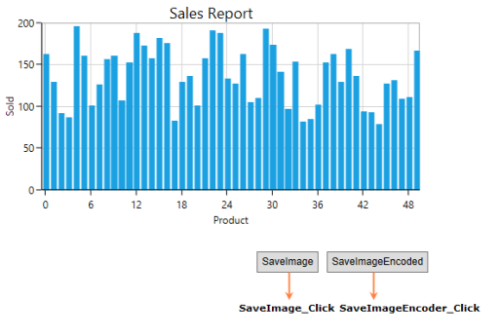
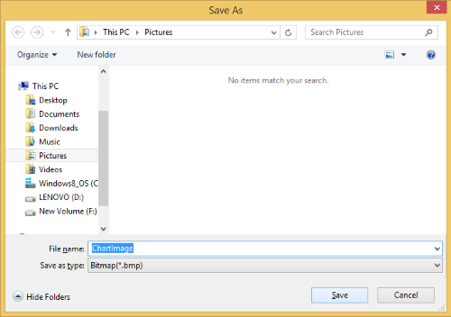
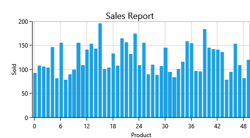

# Exporting in WPF Charts (SfChart)

Chart can be exported into image format. The following are the supported image formats:

* JPEG or JPG
* JPG-XR
* GIF
* PNG
* BMP
* TIFF

The following screenshot illustrates the chart, which has to be exported.

## Methods

Chart contains the following overloading methods for saving a chart as an image.

### Save(string filename)

This method will export chart to the specified location with the given name. By default, i.e., if you didn’t mention any specific location. It will be exported to “../bin/debug” location.

The following code examples illustrates the usage of this method:



private void SaveImage_Click(object sender, RoutedEventArgs e)
{
    this.SampleChart.Save("ExportedChart"); //Save in Debug location

    this.SampleChart.Save("D:\\Pictures\\Test\\ExportedChart"); //Save in ‘D:\Picture\Test’ location.
}



T> We can change the image formats in above code by changing its extension as .jpg, .tiff, etc.

### Save(Stream stream, BitmapEncoder imgEncoderID)

This helps to export the chart to any stream as in below code example.



private void SaveImageEncoder_Click(object sender, RoutedEventArgs e)
{
    SaveFileDialog sfd = new SaveFileDialog();
    
	sfd.Filter = "Bitmap(*.bmp)|*.bmp|JPEG(*.jpg,*.jpeg)|*.jpg;*.jpeg|Gif (*.gif)|*.gif|PNG(*.png)|*.png|TIFF(*.tif,*.tiff)|*.tif|All files (*.*)|*.*";

    if (sfd.ShowDialog() == true)
    {
	
        using (Stream fs = sfd.OpenFile())
        {
		
            SampleChart.Save(fs, new PngBitmapEncoder());
			
        }
		
    }
}



The image will be saved in the specified location in the SaveFileDialog.

### Export SfChart to image without rendering in UI

You can export the chart to image without rendering in UI by setting the chart to **RootVisual** in **HwndSource** and passing **HwndSourceParameters** to the **HwndSource**. The following code snippet demonstrates this.



static IntPtr ApplicationMessageFilter(IntPtr hwnd, int message, IntPtr wParam, IntPtr lParam, ref bool handled)
{
    return IntPtr.Zero;
}

HwndSourceParameters sourceParameters = new HwndSourceParameters();

sourceParameters.HwndSourceHook = ApplicationMessageFilter;

HwndSource source = new HwndSource(sourceParameters);

source.RootVisual = chart;

//Save chart
chart.Save("Chart.png");



## See also

[`How to export chart as Image`](https://help.syncfusion.com/wpf/sfchart/exporting#)

[`How to print the chart`](https://help.syncfusion.com/wpf/sfchart/printing#)

[`How to read image byte while rendering chart`](https://www.syncfusion.com/kb/2584/how-to-read-image-byte-while-rendering-chart)
