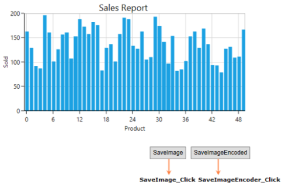
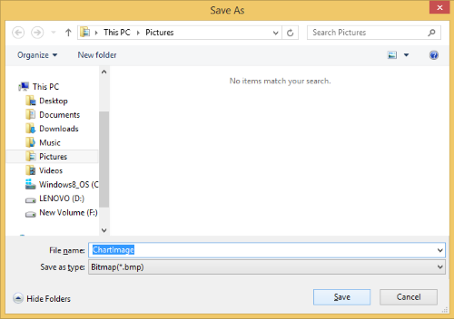
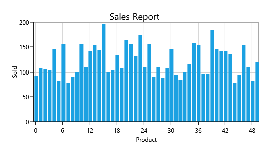
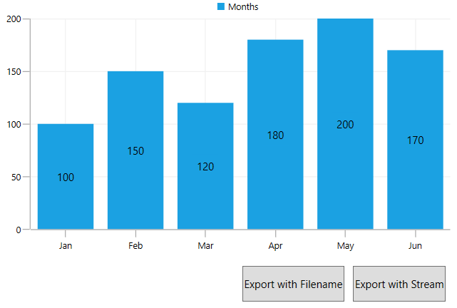

# Exporting in WPF Charts

Chart can be exported into image format. The following are the supported image formats:

* JPEG or JPG
* JPG-XR
* GIF
* PNG
* BMP
* TIFF

The following screenshot illustrates the chart, which has to be exported.

## Export as an image

The chart provides the following overloaded methods for exporting it as an image.

The following APIs are used to export the chart as an image:

* [`Save(string filename)`](https://help.syncfusion.com/cr/wpf/Syncfusion.UI.Xaml.Charts.ChartBase.html#Syncfusion_UI_Xaml_Charts_ChartBase_Save_System_String_) - Export the SfChart into image with the given filename to the mentioned location.
* [`Save(Stream, BitmapEncoder)`](https://help.syncfusion.com/cr/wpf/Syncfusion.UI.Xaml.Charts.ChartBase.html#Syncfusion_UI_Xaml_Charts_ChartBase_Save_System_IO_Stream_System_Windows_Media_Imaging_BitmapEncoder_) - Export the SfChart into image using the stream with provided bitmap encoder value.

### Save(string filename)

This method will export chart to the specified location with the given name. By default, i.e., if you didn’t mention any specific location. It will be exported to “../bin/debug” location.

The following code examples illustrates the usage of this method:



private void SaveImage_Click(object sender, RoutedEventArgs e)
{
    this.SampleChart.Save("ExportedChart.png"); //Save in Debug location
}



T> We can change the image formats in above code by changing its extension as .jpg, .tiff, etc.

### Save(Stream stream, BitmapEncoder imgEncoderID)

This helps to export the chart to any stream as in below code example.



private void SaveImageEncoder_Click(object sender, RoutedEventArgs e)
{
    using (FileStream fileStream = new FileStream("ExportedChart.png", FileMode.Create))
    {
        SampleChart.Save(fileStream, new PngBitmapEncoder());
    }
}



The image will be saved in the specified location in the SaveFileDialog.

### Export WPF Charts to image without rendering in UI

You can export the chart to image without rendering in UI by setting the chart to **RootVisual** in **HwndSource** and passing **HwndSourceParameters** to the **HwndSource**. The following code snippet demonstrates this.



static IntPtr ApplicationMessageFilter(IntPtr hwnd, int message, IntPtr wParam, IntPtr lParam, ref bool handled)
{
    return IntPtr.Zero;
}

HwndSourceParameters sourceParameters = new HwndSourceParameters();

sourceParameters.HwndSourceHook = ApplicationMessageFilter;

HwndSource source = new HwndSource(sourceParameters);
source.RootVisual = chart;

//Save chart
chart.Save("Chart.png");



## Export to XPS

Chart has built-in support for exporting to the XPS file format, providing scalable, print-ready output without any loss of quality when zooming or printing.

The following APIs are used to export the chart as an XPS file:

* `SaveAsXps(string fileName)` - Exports the SfChart as an XPS file withdesired location.
* `SaveAsXps(Stream stream)` - Exports the SfChart as an XPS file using the specified stream.

### SaveAsXps(string fileName)

This method helps to export the chart as a vector-based XPS file. By default, the exported file will be saved in the “../bin/Debug” location.

The following code example illustrates how to use this method:



private void ExportAsXps_Click(object sender, RoutedEventArgs e)
{             
    SampleChart.SaveAsXps(Chart_Export.xps);
}



### SaveAsXps(Stream stream)

This method helps to export the chart as a vector-based XPS file using a stream. By default, the exported file will be saved in the “../bin/Debug” location.

The following code example illustrates how to use this method:



private void ExportAsStream_Click(object sender, RoutedEventArgs e)
{
    using (FileStream fileStream = new FileStream("Chart_Export_Stream.xps", FileMode.Create))
    {
        SampleChart.SaveAsXps(fileStream);
    }
}



The following screenshot illustrates the chart, which has to be exported.

### Export WPF charts to vector image without rendering in UI

You can export the chart to vector image without rendering in UI by setting the chart to **RootVisual** in **HwndSource** and passing **HwndSourceParameters** to the **HwndSource**. The following code snippet demonstrates this.



static IntPtr ApplicationMessageFilter(IntPtr hwnd, int message, IntPtr wParam, IntPtr lParam, ref bool handled)
{
    return IntPtr.Zero;
}

HwndSourceParameters sourceParameters = new HwndSourceParameters();

sourceParameters.HwndSourceHook = ApplicationMessageFilter;

HwndSource source = new HwndSource(sourceParameters);
source.RootVisual = chart;

//Save chart
chart.Save("Chart.xps");



N> You can refer to our [WPF Charts](https://www.syncfusion.com/wpf-controls/charts) feature tour page for its groundbreaking feature representations. You can also explore our [WPF Charts example](https://github.com/syncfusion/wpf-demos/tree/master/chart/Views/Exporting) to know various chart types and how to easily configure them with built-in support for creating stunning visual effects.

## See also

* [`How to export the multiple WPF Charts`](https://support.syncfusion.com/kb/article/10686/how-to-export-the-multiple-wpf-charts)
* [`How to export multiple WPF Charts using MVVM-Compatible`](https://support.syncfusion.com/kb/article/11481/how-to-export-multiple-wpf-charts-using-mvvm-compatible)
* [`How to read image byte while rendering a WPF Chart (SfChart)`](https://support.syncfusion.com/kb/article/2774/how-to-read-image-byte-while-rendering-a-wpf-chart-sfchart)
