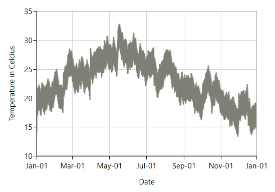

# Fast Bitmap Series in WPF Charts (SfChart)

A fast bitmap chart displays a series of segments rendered using WritableBitmap. 

## Fast Line Bitmap 

[`FastLineBitmapSeries`](https://help.syncfusion.com/cr/cref_files/wpf/Syncfusion.SfChart.WPF~Syncfusion.UI.Xaml.Charts.FastLineBitmapSeries.html#) displays a series of line segments rendered using WritableBitmap. The advantage of FastLineBitmapSeries renders a million data point in a fraction of seconds.

The following code example shows how to use the fast line bitmap series:





<chart:FastLineBitmapSeries x:Name="FastLineSeries" ItemsSource="{Binding Data}"

XBindingPath="Date" Interior="#7F7F7F" 

YBindingPath="Value" />





FastLineBitmapSeries series = new FastLineBitmapSeries()
{

    ItemsSource = new ViewModel().Data,

    XBindingPath = "Date",

    YBindingPath = "Value",

    Interior = new SolidColorBrush(Color.FromRgb(0x7F, 0x7F, 0x7F))

};

chart.Series.Add(series);





Like FastLineSeries, this bitmap series is also having line properties. 

N> As it was rendered using bitmap, there might be some jagged lines at edges. This is can be reduced using [`EnableAntiAliasing`](https://help.syncfusion.com/cr/cref_files/wpf/Syncfusion.SfChart.WPF~Syncfusion.UI.Xaml.Charts.FastLineBitmapSeries~EnableAntiAliasing.html#) property.





<chart:FastLineBitmapSeries x:Name="FastLineSeries" 

XBindingPath="Date" Interior="#7F7F7F" 

StrokeDashArray="5,5"

YBindingPath="Value" EnableAntiAliasing="True"/>





FastLineBitmapSeries series = new FastLineBitmapSeries()
{

    ItemsSource = new ViewModel().Data,

    XBindingPath = "Date",

    YBindingPath = "Value",

    EnableAntiAliasing =true,

    StrokeDashArray =new DoubleCollection() { 5,5},

    Interior = new SolidColorBrush(Color.FromRgb(0x7F, 0x7F, 0x7F))

};

chart.Series.Add(series);





## Fast Column Bitmap

[`FastColumnBitmapSeries`](https://help.syncfusion.com/cr/cref_files/wpf/Syncfusion.SfChart.WPF~Syncfusion.UI.Xaml.Charts.FastColumnBitmapSeries.html#) is used to boost up the performance of the ColumnSeries.





<chart:FastColumnBitmapSeries Interior="#7F7F7F"

ItemsSource="{Binding List}" 

XBindingPath="Date" YBindingPath="Price" />





FastColumnBitmapSeries series = new FastColumnBitmapSeries()
{

    ItemsSource = new ViewModel().List,

    XBindingPath = "Date",

    YBindingPath = "Value",

    Interior = new SolidColorBrush(Color.FromRgb(0x7F, 0x7F, 0x7F))

};

chart.Series.Add(series);





## Fast Bar Bitmap

['FastBarBitmapSeries'](https://help.syncfusion.com/cr/cref_files/wpf/Syncfusion.SfChart.WPF~Syncfusion.UI.Xaml.Charts.FastBarBitmapSeries.html) is used to boost up the performance of the series.





<chart:FastBarBitmapSeries x:Name="FastBarBitmapSeries" ItemsSource="{Binding List}" 

XBindingPath="Date" YBindingPath="Price" 

Interior="#7F7F7F"/>





FastBarBitmapSeries series = new FastBarBitmapSeries()
{

    ItemsSource = new ViewModel().List,

    XBindingPath = "Date",

    YBindingPath = "Value",

    Interior = new SolidColorBrush(Color.FromRgb(0x7F, 0x7F, 0x7F))

};

chart.Series.Add(series);





## Fast Candle Bitmap

['FastCandleBitmapSeries'](https://help.syncfusion.com/cr/cref_files/wpf/Syncfusion.SfChart.WPF~Syncfusion.UI.Xaml.Charts.FastCandleBitmapSeries.html) renders using bitmap and it displays each data point as a combination of a vertical column and a vertical line, like CandleSeries. 





<chart:FastCandleBitmapSeries ItemsSource="{Binding TestingModel}" 

XBindingPath="X" High="Y" 

Low="Y1" Open="Y2" Close="Y3" 

BullFillColor="#BCBCBC" 

BearFillColor="#4A4A4A"  />





FastCandleBitmapSeries series = new FastCandleBitmapSeries()
{

    ItemsSource = new ViewModel().TestingModel,

    XBindingPath = "X",

    High="Y", Low="Y1",

    Open="Y2", Close="Y3",

    BullFillColor = new SolidColorBrush(Color.FromRgb(0xBC, 0xBC, 0xBC)),

    BearFillColor = new SolidColorBrush(Color.FromRgb(0x4A, 0x4A, 0x4A))

};

chart.Series.Add(series);





## Fast HiLo Bitmap

[`FastHiLoBitmapSeries`](https://help.syncfusion.com/cr/cref_files/wpf/Syncfusion.SfChart.WPF~Syncfusion.UI.Xaml.Charts.FastHiLoBitmapSeries.html#) represents a series of line segments with high and low values rendered using WritableBitmap. 





<chart:FastHiLoBitmapSeries StrokeThickness="5" ItemsSource="{Binding List}"          

Interior="#7F7F7F" XBindingPath="Date" High="Stock"     

Low="Price"/>





FastHiLoBitmapSeries series = new FastHiLoBitmapSeries()
{

    ItemsSource = new ViewModel().List,

    XBindingPath = "Date",

    High = "Stock",Low = "Price",

    Interior = new SolidColorBrush(Color.FromRgb(0x7F, 0x7F, 0X7F)),

    StrokeThickness = 5

};

chart.Series.Add(series);





## Fast OHLC Bitmap

[`FastHiLoOpenCloseBitmapSeries`](https://help.syncfusion.com/cr/cref_files/wpf/Syncfusion.SfChart.WPF~Syncfusion.UI.Xaml.Charts.FastHiLoOpenCloseBitmapSeries.html#) are rendered using WritableBitmap like other bitmap series. The following code example illustrates the use of OHLC bitmap series.





<chart:FastHiLoOpenCloseBitmapSeries ItemsSource="{Binding TestingModel}" 

XBindingPath="X" High="Y" Low="Y1" Open="Y2"        

Close="Y3"   BullFillColor="#7F7F7F"      

BearFillColor="#4A4A4A"/>





FastHiLoOpenCloseBitmapSeries series = new FastHiLoOpenCloseBitmapSeries()
{

    ItemsSource = new ViewModel().TestingModel,

    XBindingPath = "X",

    High="Y", Low="Y1",

    Open="Y2", Close="Y3",

    BullFillColor = new SolidColorBrush(Color.FromRgb(0xBC, 0xBC, 0xBC)),

    BearFillColor = new SolidColorBrush(Color.FromRgb(0x4A, 0x4A, 0x4A))

};

chart.Series.Add(series);





## Fast Scatter Bitmap

[`FastScatterBitmapSeries`](https://help.syncfusion.com/cr/cref_files/wpf/Syncfusion.SfChart.WPF~Syncfusion.UI.Xaml.Charts.FastScatterBitmapSeries.html#) used to render high number scatter points. The [`ScatterHeight`](https://help.syncfusion.com/cr/cref_files/wpf/Syncfusion.SfChart.WPF~Syncfusion.UI.Xaml.Charts.FastScatterBitmapSeries~ScatterHeight.html#) and [`ScatterWidth`](https://help.syncfusion.com/cr/cref_files/wpf/Syncfusion.SfChart.WPF~Syncfusion.UI.Xaml.Charts.FastScatterBitmapSeries~ScatterWidth.html#) also available as in ScatterSeries. [`ShapeType`]() is used to change the rendering shape of fast scatter bitmap series. The available shapes are [`Cross`](), [`Diamond`](), [`Ellipse`](), [`Hexagon`](), [`InvertedTriangle`](), [`Pentagon`](), [`Plus`](), [`Rectangle`]() and [`Triangle`]().





<chart:FastScatterBitmapSeries Interior="#7F7F7F"   

ItemsSource="{Binding Data}"                         

x:Name="FastScatterSeries"  XBindingPath="Date" 

YBindingPath="Value" ScatterHeight="4"  

ScatterWidth="4"/>





FastScatterBitmapSeries series = new FastScatterBitmapSeries()
{

    ItemsSource = new ViewModel().Data,

    XBindingPath = "Date",

    YBindingPath = "Value",

    ScatterHeight = 4,

    ScatterWidth = 4,

    Interior = new SolidColorBrush(Color.FromRgb(0x7F, 0x7F, 0X7F))

};

chart.Series.Add(series);





## Fast Step Line Bitmap

[`FastStepLineBitmapSeries`](https://help.syncfusion.com/cr/cref_files/wpf/Syncfusion.SfChart.WPF~Syncfusion.UI.Xaml.Charts.FastStepLineBitmapSeries.html#) is the high performance version of StepLineSeries.





<chart:FastStepLineBitmapSeries ItemsSource="{Binding Data}"

XBindingPath="Date"                                 

YBindingPath="Value" Interior="#4A4A4A" />





FastStepLineBitmapSeries series = new FastStepLineBitmapSeries()
{

    ItemsSource = new ViewModel().Data,

    XBindingPath = "Date",

    YBindingPath = "Value",

    Interior = new SolidColorBrush(Color.FromRgb(0x4A, 0x4A, 0X4A))

};

chart.Series.Add(series);





The anti aliasing mode can be enabled using [`EnableAntiAliasing`](https://help.syncfusion.com/cr/cref_files/wpf/Syncfusion.SfChart.WPF~Syncfusion.UI.Xaml.Charts.FastStepLineBitmapSeries~EnableAntiAliasing.html#) property of FastStepLineBitmapSeries as in below code snippet:





<chart:FastStepLineBitmapSeries EnableAntiAliasing="True" ItemsSource="{Binding Data}"

x:Name="FastStepLineSeries" XBindingPath="Date" 

YBindingPath="Value" Interior="#4A4A4A"/>





FastStepLineBitmapSeries series = new FastStepLineBitmapSeries()
{

    ItemsSource = new ViewModel().Data,

    XBindingPath = "Date",

    YBindingPath = "Value",

    EnableAntiAliasing = true ,

    Interior = new SolidColorBrush(Color.FromRgb(0x4A, 0x4A, 0X4A))

};

chart.Series.Add(series);





## Fast Range Area

[`FastRangeAreaBitmapSeries`](https://help.syncfusion.com/cr/cref_files/wpf/Syncfusion.SfChart.WPF~Syncfusion.UI.Xaml.Charts.FastRangeAreaBitmapSeries.html#) is the high performance version of RangeAreaSeries. 





<chart:FastRangeAreaBitmapSeries ItemsSource = "{Binding Data}"

                             XBindingPath="Date" 
					 
                             High="HighTemperature" 
					 
                             Low="LowTemperature"        
					                                      
                             Interior="#7F7F7F" />





FastRangeAreaBitmapSeries fastRangeAreaBitmapSeries = new FastRangeAreaBitmapSeries();

fastRangeAreaBitmapSeries.ItemsSource = new ViewModel().Data;

fastRangeAreaBitmapSeries.XBindingPath = "Date";

fastRangeAreaBitmapSeries.High = "HighTemperature";

fastRangeAreaBitmapSeries.Low = "LowTemperature";

fastRangeAreaBitmapSeries.Interior = new SolidColorBrush(Color.FromRgb(0x7F, 0x7F, 0x75));

chart.Series.Add(fastRangeAreaBitmapSeries);





The anti-aliasing mode can be enabled using  [`EnableAntiAliasing`](https://help.syncfusion.com/cr/cref_files/wpf/Syncfusion.SfChart.WPF~Syncfusion.UI.Xaml.Charts.FastRangeAreaBitmapSeries~EnableAntiAliasing.html) property of FastRangeAreaBitmapSeries as in below code snippet:





<chart:FastRangeAreaBitmapSeries ItemsSource = "{Binding Data}"

                                 XBindingPath="Date" 

                                 High="HighTemperature" 

                                 Low="LowTemperature" 

                                 EnableAntiAliasing="True" 

                                 Interior="#7F7F7F" />





FastRangeAreaBitmapSeries fastRangeAreaBitmapSeries = new FastRangeAreaBitmapSeries();

fastRangeAreaBitmapSeries.ItemsSource = new ViewModel().Data;

fastRangeAreaBitmapSeries.XBindingPath = "Date";

fastRangeAreaBitmapSeries.High = "HighTemperature";

fastRangeAreaBitmapSeries.Low = "LowTemperature";

fastRangeAreaBitmapSeries.EnableAntiAliasing = true;

fastRangeAreaBitmapSeries.Interior = new SolidColorBrush(Color.FromRgb(0x7F, 0x7F, 0x75));

chart.Series.Add(fastRangeAreaBitmapSeries);





