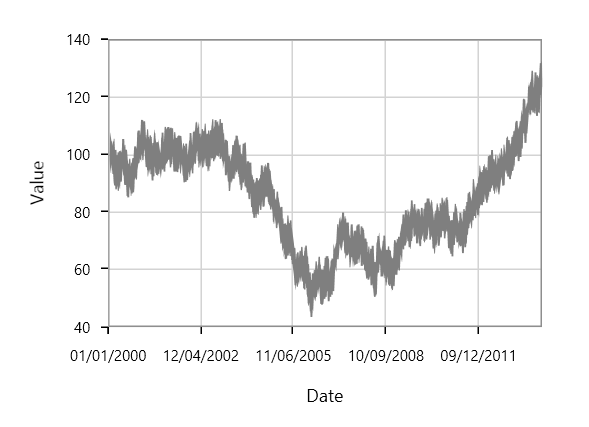

# Fast Series in WPF Charts (SfChart)

A fast series is a special kind of line chart that can render a collection with a huge number of data points. Fast series is rendered using a polyline segment.

## Fast Line

The [`FastLineSeries`](https://help.syncfusion.com/cr/cref_files/wpf/Syncfusion.SfChart.WPF~Syncfusion.UI.Xaml.Charts.FastLineSeries.html#) is a special kind of line series that can render a collection with a huge number of datapoints. FastLine is rendered using polyline segment. 





<chart:FastLineSeries x:Name="FastLineSeries" ItemsSource="{Binding Data}"

XBindingPath="Date" Interior="#7F7F7F"

YBindingPath="Value"/>





FastLineSeries series = new FastLineSeries()
{

    ItemsSource = new ViewModel().Data,

    XBindingPath = "Date",

    YBindingPath = "Value",

    Interior = new SolidColorBrush(Color.FromRgb(0x7F, 0x7F, 0x7F))

};

chart.Series.Add(series);





The following line properties are available for FastLineSeries:

* [`Stroke`](https://help.syncfusion.com/cr/cref_files/wpf/Syncfusion.SfChart.WPF~Syncfusion.UI.Xaml.Charts.ChartSeries~Stroke.html#)
* [`StrokeDashArray`](https://help.syncfusion.com/cr/cref_files/wpf/Syncfusion.SfChart.WPF~Syncfusion.UI.Xaml.Charts.FastLineSeries~StrokeDashArray.html#)
* [`StrokeDashOffset`](https://help.syncfusion.com/cr/cref_files/wpf/Syncfusion.SfChart.WPF~Syncfusion.UI.Xaml.Charts.FastLineSeries~StrokeDashOffset.html# )
* [`StrokeDashCap`](https://help.syncfusion.com/cr/cref_files/wpf/Syncfusion.SfChart.WPF~Syncfusion.UI.Xaml.Charts.FastLineSeries~StrokeDashOffset.html#)
* [`StrokeThickness`](https://help.syncfusion.com/cr/cref_files/wpf/Syncfusion.SfChart.WPF~Syncfusion.UI.Xaml.Charts.ChartSeries~StrokeThickness.html#)

## Fast Stacking Column

[`FastStackingColumnSeries`](https://help.syncfusion.com/cr/cref_files/wpf/Syncfusion.SfChart.WPF~Syncfusion.UI.Xaml.Charts.FastStackingColumnBitmapSeries.html#) similar to StackingColumnSeries except that it loads faster and provides better performance. 





<chart:FastStackingColumnBitmapSeries StrokeThickness="5"

ItemsSource="{Binding MedalDetails}”       

XBindingPath="CountryName" YBindingPath="GoldMedals"  

Interior="#4A4A4A" />





FastStackingColumnBitmapSeries series = new FastStackingColumnBitmapSeries()
{

    ItemsSource = new ViewModel().MedalDetails,

    XBindingPath = "CountryName",

    YBindingPath = "GoldMedals",

    Interior = new SolidColorBrush(Color.FromRgb(0x4A, 0x4A, 0X4A))

};

chart.Series.Add(series);





