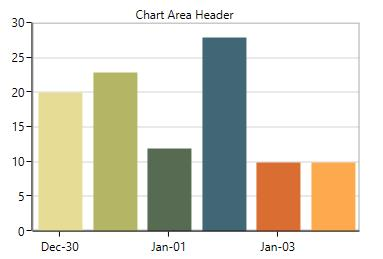
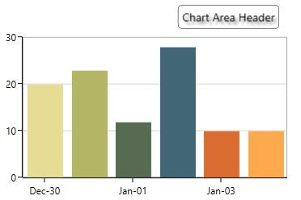

# Header in WPF Charts

[`Header`](https://help.syncfusion.com/cr/wpf/Syncfusion.UI.Xaml.Charts.ChartBase.html#Syncfusion_UI_Xaml_Charts_ChartBase_Header) property is used to define the title for the chart. This allows you to add any object (.Net object) as content for the chart title.





<syncfusion:SfChart Header="Chart Area Header"/>





SfChart chart = new SfChart();
chart.Header = "Usage of Metals";





Header can be positioned on the left or right side of the chart using the [`HorizontalHeaderAlignment`](https://help.syncfusion.com/cr/wpf/Syncfusion.UI.Xaml.Charts.ChartBase.html#Syncfusion_UI_Xaml_Charts_ChartBase_HorizontalHeaderAlignment) property.

You can also add more customization for the header as shown below:





<chart:SfChart.Header>
    <Border BorderThickness="0.5" BorderBrush="Black" Margin="10" CornerRadius="5">
        <TextBlock FontSize="14" Text="Chart Area Header" Margin="5">
            <TextBlock.Effect>
                <DropShadowEffect Color="Black" Opacity="0.5"/>
            </TextBlock.Effect>
        </TextBlock>
    </Border>
</chart:SfChart.Header>





SfChart chart = new SfChart();

Border border = new Border()
{
    BorderThickness = new Thickness(0.5),
    BorderBrush = new SolidColorBrush(Colors.Black),
    Margin = new Thickness(10),
    CornerRadius = new CornerRadius(5)
};

TextBlock textBlock = new TextBlock()
{                
    Text = "Chart Area Header",
    Margin = new Thickness(5),
    FontSize = 14
};

textBlock.Effect = new DropShadowEffect()
{
    Color = Colors.Black,
    Opacity = 0.5
};

border.Child = textBlock;
chart.Header = border;





N> Here, HorizontalHeaderAlignment is set as ‘Right’.

N> You can refer to our [WPF Charts](https://www.syncfusion.com/wpf-controls/charts) feature tour page for its groundbreaking feature representations. You can also explore our [WPF Charts example](https://github.com/syncfusion/wpf-demos/tree/master/chart/Views) to know various chart types and how to easily configure them with built-in support for creating stunning visual effects.