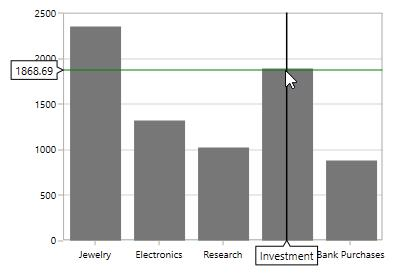
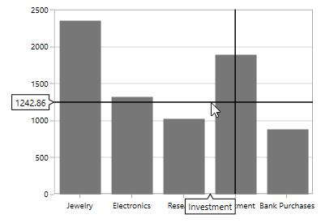
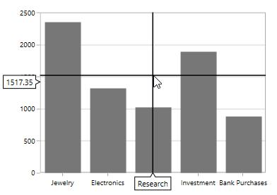

# Crosshair in WPF Charts (SfChart)

ChartCrossHairBehavior is used to view the values at mouse point or touch contact point. By moving these lines horizontally, you can get the X values and by moving these lines vertically, you can get the Y values.

## Adding CrossHairBehavior to SfChart

You can create an instance [`ChartCrossHairBehavior`](https://help.syncfusion.com/cr/wpf/Syncfusion.UI.Xaml.Charts.ChartCrossHairBehavior.html#) and add it to the Behaviors collection.





<syncfusion:SfChart.Behaviors>

<syncfusion:ChartCrossHairBehavior />

</syncfusion:SfChart.Behaviors>





ChartCrossHairBehavior behavior = new ChartCrossHairBehavior();

chart.Behaviors.Add(behavior);





To view the axis labels then set the [`ShowTrackBallInfo`](https://help.syncfusion.com/cr/wpf/Syncfusion.UI.Xaml.Charts.ChartAxis.html#Syncfusion_UI_Xaml_Charts_ChartAxis_ShowTrackBallInfo) property to true as in the below code snippet.





<syncfusion:SfChart.PrimaryAxis>

<syncfusion:CategoryAxis  ShowTrackBallInfo="True"/>

</syncfusion:SfChart.PrimaryAxis>

<syncfusion:SfChart.SecondaryAxis>

<syncfusion:NumericalAxis  ShowTrackBallInfo="True"/>

</syncfusion:SfChart.SecondaryAxis>





ChartCrossHairBehavior behavior = new ChartCrossHairBehavior();

chart.Behaviors.Add(behavior);

chart.PrimaryAxis = new CategoryAxis()
{

    ShowTrackBallInfo = true

};

chart.SecondaryAxis = new NumericalAxis()
{

    ShowTrackBallInfo = true

};





Cross hair is composed of the following parts:

1. Vertical and horizontal line

2. Axis Labels

## Vertical and Horizontal Line

If you add [`ChartCrossHairBehavior`](https://help.syncfusion.com/cr/wpf/Syncfusion.UI.Xaml.Charts.ChartCrossHairBehavior.html#) to chart you can see horizontal and vertical lines.The horizontal and vertical lines can be customized using [`HorizontalLineStyle`](https://help.syncfusion.com/cr/wpf/Syncfusion.UI.Xaml.Charts.ChartCrossHairBehavior.html#Syncfusion_UI_Xaml_Charts_ChartCrossHairBehavior_HorizontalLineStyle) and [`VerticalLineStyle`](https://help.syncfusion.com/cr/wpf/Syncfusion.UI.Xaml.Charts.ChartCrossHairBehavior.html#Syncfusion_UI_Xaml_Charts_ChartCrossHairBehavior_VerticalLineStyle) properties.

**HorizontalLineStyle**

The following code snippet demonstrates the line style for horizontal line in cross hair.





<syncfusion:SfChart x:Name="chart">

    <syncfusion:SfChart.Resources>

        
                
    </syncfusion:SfChart.Resources>

    <syncfusion:SfChart.Behaviors>

        <syncfusion:ChartCrossHairBehavior HorizontalLineStyle="{StaticResource lineStyle}"/>

    </syncfusion:SfChart.Behaviors>

</syncfusion:SfChart>





ChartCrossHairBehavior crosshair = new ChartCrossHairBehavior()
{

    HorizontalLineStyle = chart.Resources["lineStyle"] as Style

};

chart.Behaviors.Add(crosshair);





**VerticalLineStyle**





<syncfusion:SfChart x:Name="chart">

    <syncfusion:SfChart.Resources>

        
                
    </syncfusion:SfChart.Resources>

     <syncfusion:SfChart.Behaviors>

                <syncfusion:ChartCrossHairBehavior VerticalLineStyle="{StaticResource lineStyle}"/>

    </syncfusion:SfChart.Behaviors>

</syncfusion:SfChart>





ChartCrossHairBehavior crosshair = new ChartCrossHairBehavior()
{

    VerticalLineStyle = chart.Resources["lineStyle"] as Style

};

chart.Behaviors.Add(crosshair);





## Horizontal axis label

The vertical line in contact with the x axes shows axis label. The horizontal axis label can be aligned using [`HorizontalAxisLabelAlignment`](https://help.syncfusion.com/cr/wpf/Syncfusion.UI.Xaml.Charts.ChartCrossHairBehavior.html#Syncfusion_UI_Xaml_Charts_ChartCrossHairBehavior_HorizontalAxisLabelAlignment) property.

Axis Label can be aligned by Near, Far, Center, Auto and None Options.

* [`Auto`](https://help.syncfusion.com/cr/wpf/Syncfusion.UI.Xaml.Charts.ChartAlignment.html) – Axis label is aligned in Near/Far positions based on the movement of vertical line.

* [`Far`](https://help.syncfusion.com/cr/wpf/Syncfusion.UI.Xaml.Charts.ChartAlignment.html) - Axis label is positioned far from the position of vertical line in cross hair.

* [`Near`](https://help.syncfusion.com/cr/wpf/Syncfusion.UI.Xaml.Charts.ChartAlignment.html) - Axis label is near to the position of trackball.

* [`Center`](https://help.syncfusion.com/cr/wpf/Syncfusion.UI.Xaml.Charts.ChartAlignment.html) - Axis label is aligned to the center of the vertical line. By default the axis label will positioned in center.

The following image demonstrates the horizontal axis label positioned center to the vertical line.

**Far**





<syncfusion:SfChart.Behaviors>

<syncfusion:ChartCrossHairBehavior HorizontalAxisLabelAlignment="Far ">

</syncfusion:ChartCrossHairBehavior>

</syncfusion:SfChart.Behaviors>





ChartCrossHairBehavior behavior = new ChartCrossHairBehavior()
{

    HorizontalAxisLabelAlignment = ChartAlignment.Far

};

chart.Behaviors.Add(behavior);





**Near**





<syncfusion:SfChart.Behaviors>

<syncfusion:ChartCrossHairBehavior HorizontalAxisLabelAlignment="Near ">

</syncfusion:ChartCrossHairBehavior>

</syncfusion:SfChart.Behaviors>





ChartCrossHairBehavior behavior = new ChartCrossHairBehavior()
{

    HorizontalAxisLabelAlignment = ChartAlignment.Near

};

chart.Behaviors.Add(behavior);





## Vertical axis label

Vertical axis label is displayed when the horizontal line in contact with x axis.The label can be aligned using [`VerticalAxisLabelAlignment`](https://help.syncfusion.com/cr/wpf/Syncfusion.UI.Xaml.Charts.ChartCrossHairBehavior.html#Syncfusion_UI_Xaml_Charts_ChartCrossHairBehavior_VerticalAxisLabelAlignment) property.

Axis Label can be aligned by Near, Far, Center, Auto, and None Options.

The following image demonstrates the horizontal axis label positioned center to the vertical line.

**Near**





<syncfusion:SfChart.Behaviors>

<syncfusion:ChartCrossHairBehavior VerticalAxisLabelAlignment="Near">

</syncfusion:ChartCrossHairBehavior>

</syncfusion:SfChart.Behaviors>





ChartCrossHairBehavior behavior = new ChartCrossHairBehavior()
{

    VerticalAxisLabelAlignment = ChartAlignment.Near

};

chart.Behaviors.Add(behavior);





**Far**





<syncfusion:SfChart.Behaviors>

<syncfusion:ChartCrossHairBehavior VerticalAxisLabelAlignment="Far"  >

</syncfusion:ChartCrossHairBehavior>

</syncfusion:SfChart.Behaviors>





ChartCrossHairBehavior behavior = new ChartCrossHairBehavior()
{

    VerticalAxisLabelAlignment = ChartAlignment.Far

};

chart.Behaviors.Add(behavior);





## Customization of Crosshair axis labels

The default appearance of the crosshair axis labels can be customized by using the [`CrosshairLabelTemplate`](https://help.syncfusion.com/cr/wpf/Syncfusion.UI.Xaml.Charts.ChartAxis.html#Syncfusion_UI_Xaml_Charts_ChartAxis_CrosshairLabelTemplateProperty) property of chart axis. It can be set as shown in the following code example.





<chart:SfChart.PrimaryAxis>
    
    <chart:CategoryAxis ShowTrackBallInfo="True">
        
        <chart:CategoryAxis.CrosshairLabelTemplate>
                
            <DataTemplate>
                            
                 <Border Background="Orange" 
                                   
                         CornerRadius="4" 
                                    
                          BorderThickness="1" BorderBrush="Black">

                 <TextBlock Margin="2" Text="{Binding ValueX}"/>
                            
                </Border>
                
            </DataTemplate>
             
        </chart:CategoryAxis.CrosshairLabelTemplate>
                
    </chart:CategoryAxis>

</chart:SfChart.PrimaryAxis>

<chart:SfChart.SecondaryAxis>
                
       <chart:NumericalAxis ShowTrackBallInfo="True">
                    
            <chart:NumericalAxis.CrosshairLabelTemplate>
                        
                <DataTemplate>
                            
                    <Border Background="Orange" 
                                   
                            CornerRadius="4" 
                            
                             BorderThickness="1" 
                             
                             BorderBrush="Black">

                    <TextBlock  Margin="2" Text="{Binding ValueY}"/>
                   
                    </Border>
                        
                </DataTemplate>
            
            </chart:NumericalAxis.CrosshairLabelTemplate>
       
       </chart:NumericalAxis>

</chart:SfChart.SecondaryAxis>

<chart:SfChart.Behaviors>
       
    <chart:ChartCrossHairBehavior />
    
</chart:SfChart.Behaviors>





