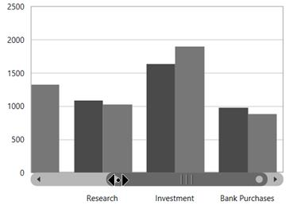
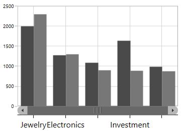
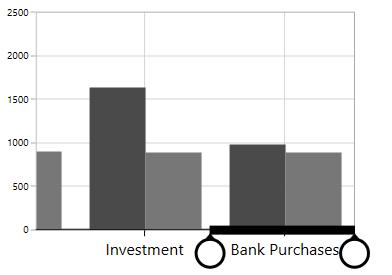

# Resizable Scrollbar in WPF Charts (SfChart)

The resizable scrollbar is a type of scrollbar that can be resized within the track area by adjusting the scrolling thumbs. In the SfChart, a resizable scrollbar is used for zooming and panning across different chart segments.

## Adding ScrollBar to the Axis

[`EnableScrollBar`](https://help.syncfusion.com/cr/wpf/Syncfusion.UI.Xaml.Charts.ChartAxisBase2D.html#Syncfusion_UI_Xaml_Charts_ChartAxisBase2D_EnableScrollBar) property allows you to add the scrollbar for the particular axis. The following code snippet illustrates the scrollbar in the primary axis.





<syncfusion:SfChart.PrimaryAxis>

<syncfusion:CategoryAxis EnableScrollBar="True" />

</syncfusion:SfChart.PrimaryAxis>





chart.PrimaryAxis = new CategoryAxis()
{

    EnableScrollBar = true

};





## Deferred Scrolling

SfChart provides support to suspend the value updates for every thumb values. This can be done using [`DeferredScrolling`](https://help.syncfusion.com/cr/wpf/Syncfusion.UI.Xaml.Charts.ChartAxisBase2D.html#Syncfusion_UI_Xaml_Charts_ChartAxisBase2D_DeferredScrolling) property in chart axis.The following code snippet demonstrates the deferred scrolling.





<syncfusion:SfChart.PrimaryAxis>

<syncfusion:CategoryAxis EnableScrollBar="True" DeferredScrolling="True"/>

</syncfusion:SfChart.PrimaryAxis>





chart.PrimaryAxis = new CategoryAxis()
{

    EnableScrollBar = true,

    DeferredScrolling = true,

};





## Resizing the scrollbar

SfChart allows you to resize the scrollbar using [`EnableScrollBarResizing`](https://help.syncfusion.com/cr/wpf/Syncfusion.UI.Xaml.Charts.ChartAxisBase2D.html#Syncfusion_UI_Xaml_Charts_ChartAxisBase2D_EnableScrollBarResizing) property to true. By default the EnableScrollBarResizing property is true. The following code example and image demonstrates scrollbar without resizing option.





<syncfusion:SfChart.PrimaryAxis>

<syncfusion:CategoryAxis EnableScrollBar="True" EnableScrollBarResizing="False"/>

</syncfusion:SfChart.PrimaryAxis>





chart.PrimaryAxis = new CategoryAxis()
{

    EnableScrollBar = true,

    EnableScrollBarResizing = false,

};





## Scrollbar for Touch Mode

Scrollbar provides a touch mode style by enabling [`EnableTouchMode`](https://help.syncfusion.com/cr/wpf/Syncfusion.UI.Xaml.Charts.ChartAxisBase2D.html#Syncfusion_UI_Xaml_Charts_ChartAxisBase2D_EnableTouchMode) property to true as in the below code snippet.





<syncfusion:SfChart.PrimaryAxis>

<syncfusion:CategoryAxis EnableScrollBar="True" EnableTouchMode="True"/>

</syncfusion:SfChart.PrimaryAxis>





chart.PrimaryAxis = new CategoryAxis()
{

    EnableScrollBar = true,

    EnableTouchMode = true

};





### Thumb Label

In touch mode while resizing or dragging the scrollbar to view thumb labels the [`ThumbLabelVisibility`](https://help.syncfusion.com/cr/wpf/Syncfusion.UI.Xaml.Charts.ChartAxis.html#Syncfusion_UI_Xaml_Charts_ChartAxis_ThumbLabelVisibility) is set to true.

The following code example demonstrates the thumb labels in scrollbar.





<syncfusion:SfChart.PrimaryAxis>

<syncfusion:CategoryAxis EnableScrollBar="True" ThumbLabelVisibility="Visible" EnableTouchMode="True"/>

</syncfusion:SfChart.PrimaryAxis>





chart.PrimaryAxis = new CategoryAxis()
{

    EnableScrollBar = true,

    EnableTouchMode = true,

    ThumbLabelVisibility = Visibility.Visible

};





### Thumb Label Template

[`ThumbLabelTemplate`](https://help.syncfusion.com/cr/wpf/Syncfusion.UI.Xaml.Charts.ChartAxis.html#Syncfusion_UI_Xaml_Charts_ChartAxis_ThumbLabelTemplate) property provides the custom template for the scroll bar thumb.





<syncfusion:SfChart x:Name="chart">

    <syncfusion:SfChart.Resources>

        <DataTemplate x:Key="labelTemplate">

            <Grid>

                <Border BorderBrush="Black" Background="Pink" 
                                
                        BorderThickness="2">

                    <TextBlock Text="{Binding}" FontSize="15"/>

                </Border>

            </Grid>

        </DataTemplate>

    </syncfusion:SfChart.Resources>

    <syncfusion:SfChart.PrimaryAxis>

        <syncfusion:CategoryAxis EnableTouchMode="True" EnableScrollBar="True"
                                         
                                 ThumbLabelVisibility="Visible"
                                         
                                 ThumbLabelTemplate="{StaticResource labelTemplate}"/>

    </syncfusion:SfChart.PrimaryAxis>

</syncfusion:SfChart>





chart.PrimaryAxis = new CategoryAxis()
{

    EnableTouchMode = true,

    EnableScrollBar = true,

    ThumbLabelVisibility = Visibility.Visible,

    ThumbLabelTemplate = chart.Resources["labelTemplate"] as DataTemplate

};





