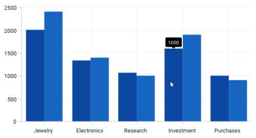
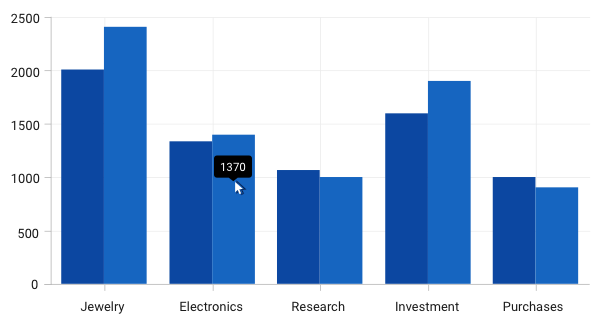
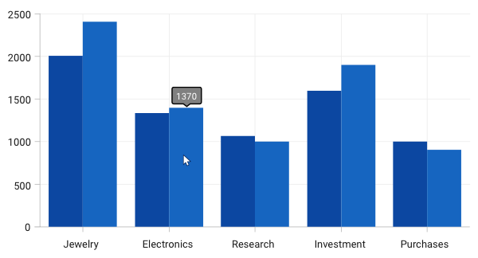
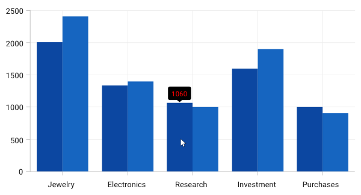
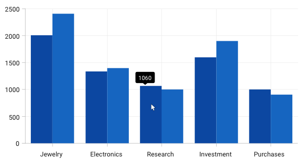
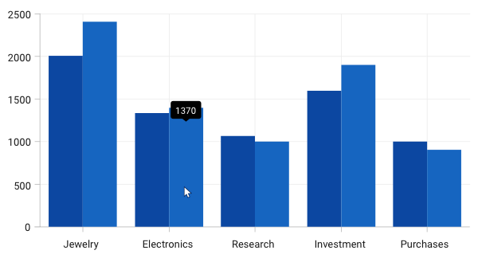
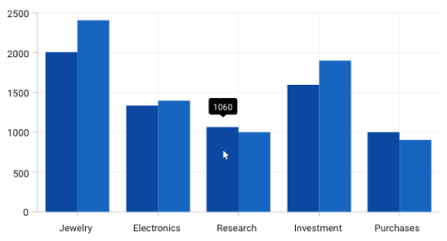
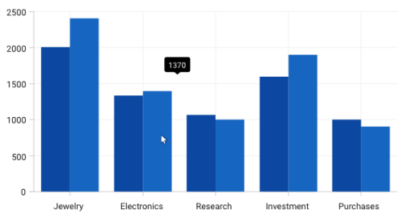
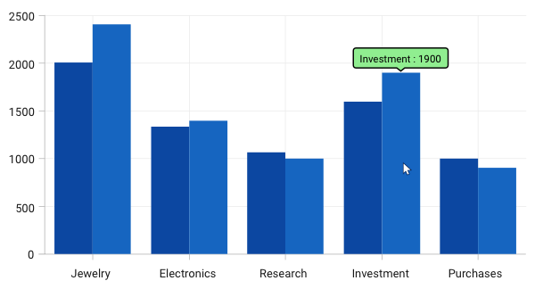

# Tooltip in WPF Charts (SfChart)

The Tooltip feature allows you to display any information over a [`ChartSeries`](https://help.syncfusion.com/cr/wpf/Syncfusion.UI.Xaml.Charts.ChartSeries.html#). It is used in conjunction with the pointer or at the data point position. It appears when the mouse hovers over any chart segment. It is set to display the metadata of the particular segment or data point.

## Define Tooltip

By default, a small box containing the data points y values are displayed as the Tooltip. The y values vary depending on the [`ChartSeries`](https://help.syncfusion.com/cr/wpf/Syncfusion.UI.Xaml.Charts.ChartSeries.html#). For example, a single y value is usually displayed in the Column and [`BarSeries`](https://help.syncfusion.com/cr/wpf/Syncfusion.UI.Xaml.Charts.BarSeries.html#). In the [`FinancialSeries`](https://help.syncfusion.com/cr/wpf/Syncfusion.UI.Xaml.Charts.FinancialSeriesBase.html#), high, low, open, and close values are displayed in Tooltip.

The tooltip will be visible if you enable [`ShowTooltip`](https://help.syncfusion.com/cr/wpf/Syncfusion.UI.Xaml.Charts.ChartSeriesBase.html#Syncfusion_UI_Xaml_Charts_ChartSeriesBase_ShowTooltip) property as in the below code snippet.





<syncfusion:ColumnSeries  ShowTooltip="True"                                                  
ItemsSource="{Binding Demands}" 

XBindingPath="Demand"  YBindingPath="Year2010"/>

<syncfusion:ColumnSeries ItemsSource="{Binding Demands}" 

ShowTooltip="True"                           

XBindingPath="Demand"  YBindingPath="Year2011"/>           





ColumnSeries series1 = new ColumnSeries()
{

    ItemsSource = new ViewModel().Demands,

    XBindingPath = "Demand",

    YBindingPath = "Year2010",

    ShowTooltip = true

};

ColumnSeries series2 = new ColumnSeries()
{

    ItemsSource = new ViewModel().Demands,

    XBindingPath = "Demand",

    YBindingPath = "Year2011",

    ShowTooltip = true

};

chart.Series.Add(series1);

chart.Series.Add(series2);





## Customizing tooltip using ChartTooltipBehavior

The [`ChartTooltipBehavior`](https://help.syncfusion.com/cr/wpf/Syncfusion.UI.Xaml.Charts.ChartTooltipBehavior.html) is commonly used for all series to customize the tooltip. For customizing the tooltip, you can create an instance [`ChartTooltipBehavior`](https://help.syncfusion.com/cr/wpf/Syncfusion.UI.Xaml.Charts.ChartTooltipBehavior.html) and add it to the SfChart [`Behaviors`](https://help.syncfusion.com/cr/wpf/Syncfusion.UI.Xaml.Charts.SfChart.html#Syncfusion_UI_Xaml_Charts_SfChart_Behaviors) collection.

The following properties are used to customize and configure tooltip which is available in the [`ChartTooltipBehavior`](https://help.syncfusion.com/cr/wpf/Syncfusion.UI.Xaml.Charts.ChartTooltipBehavior.html).

* [`EnableAnimation`](https://help.syncfusion.com/cr/wpf/Syncfusion.UI.Xaml.Charts.ChartTooltipBehavior.html?tabs=tabid-1#Syncfusion_UI_Xaml_Charts_ChartTooltipBehavior_EnableAnimation) - Used to enable the animation when showing the tooltip.
* [`Position`](https://help.syncfusion.com/cr/wpf/Syncfusion.UI.Xaml.Charts.ChartTooltipBehavior.html?tabs=tabid-1#Syncfusion_UI_Xaml_Charts_ChartTooltipBehavior_Position) - Used to position the tooltip at the data point position or the cursor position.
* [`Style`](https://help.syncfusion.com/cr/wpf/Syncfusion.UI.Xaml.Charts.ChartTooltipBehavior.html?tabs=tabid-1#Syncfusion_UI_Xaml_Charts_ChartTooltipBehavior_Style) - Used to customize the fill and stroke of the tooltip.
* [`LabelStyle`](https://help.syncfusion.com/cr/wpf/Syncfusion.UI.Xaml.Charts.ChartTooltipBehavior.html?tabs=tabid-1#Syncfusion_UI_Xaml_Charts_ChartTooltipBehavior_LabelStyle) - Used to customize the tooltip label.
* [`HorizontalOffset`](https://help.syncfusion.com/cr/wpf/Syncfusion.UI.Xaml.Charts.ChartTooltipBehavior.html?tabs=tabid-1#Syncfusion_UI_Xaml_Charts_ChartTooltipBehavior_HorizontalOffset) - Used to position the tooltip at a distance from the data point or cursor position horizontally.
* [`VerticalOffset`](https://help.syncfusion.com/cr/wpf/Syncfusion.UI.Xaml.Charts.ChartTooltipBehavior.html?tabs=tabid-1#Syncfusion_UI_Xaml_Charts_ChartTooltipBehavior_VerticalOffset) - Used to position the tooltip at a distance from the data point or cursor position vertically.
* [`HorizontalAlignment`](https://help.syncfusion.com/cr/wpf/Syncfusion.UI.Xaml.Charts.ChartTooltipBehavior.html?tabs=tabid-1#Syncfusion_UI_Xaml_Charts_ChartTooltipBehavior_HorizontalAlignment) - Used to align the tooltip label at left, right, and center of the data point position or cursor position horizontally.
* [`VerticalAlignment`](https://help.syncfusion.com/cr/wpf/Syncfusion.UI.Xaml.Charts.ChartTooltipBehavior.html?tabs=tabid-1#Syncfusion_UI_Xaml_Charts_ChartTooltipBehavior_VerticalAlignment) - Used to align the tooltip label at top, center, and bottom of the data point position or cursor position vertically.
* [`ShowDuration`](https://help.syncfusion.com/cr/wpf/Syncfusion.UI.Xaml.Charts.ChartTooltipBehavior.html?tabs=tabid-1#Syncfusion_UI_Xaml_Charts_ChartTooltipBehavior_ShowDuration) - Used to set the amount of time that the tooltip remains visible in milliseconds.
* [`InitialShowDelay`](https://help.syncfusion.com/cr/wpf/Syncfusion.UI.Xaml.Charts.ChartTooltipBehavior.html?tabs=tabid-1#Syncfusion_UI_Xaml_Charts_ChartTooltipBehavior_InitialShowDelay) - Used to delay in milliseconds to show the tooltip once the user interacts with series.





<chart:SfChart.Behaviors>

<chart:ChartTooltipBehavior/>                                                  

</chart:SfChart.Behaviors>





SfChart chart = new SfChart();

ChartTooltipBehavior behavior = new ChartTooltipBehavior();

chart.Behaviors.Add(behavior);





### Positioning the tooltip

Tooltip can be positioned at the data point position or the cursor position using the [`Position`](https://help.syncfusion.com/cr/wpf/Syncfusion.UI.Xaml.Charts.ChartTooltipBehavior.html?tabs=tabid-1#Syncfusion_UI_Xaml_Charts_ChartTooltipBehavior_Position) property. The `Auto` will position the tooltip at the data point position and the `Pointer` will display the tooltip in conjunction with the mouse pointer itself when hovering the mouse inside any chart segment.

N> By default, the tooltip [`Position`](https://help.syncfusion.com/cr/wpf/Syncfusion.UI.Xaml.Charts.ChartTooltipBehavior.html?tabs=tabid-1#Syncfusion_UI_Xaml_Charts_ChartTooltipBehavior_Position) is set to Auto.

The following code example explains positioning the tooltip at `Pointer` position.





<chart:SfChart.Behaviors>

<chart:ChartTooltipBehavior x:Name="chartTooltipBehavior" Position="Pointer"/>                                               

</chart:SfChart.Behaviors>





SfChart chart = new SfChart();
...
ChartTooltipBehavior chartTooltipBehavior = new ChartTooltipBehavior();
chartTooltipBehavior.Position = TooltipPosition.Pointer;
chart.Behaviors.Add(chartTooltipBehavior);





### Customizing the tooltip background

The tooltip's fill and stroke color can be customized using the [`Style`](https://help.syncfusion.com/cr/wpf/Syncfusion.UI.Xaml.Charts.ChartTooltipBehavior.html?tabs=tabid-1#Syncfusion_UI_Xaml_Charts_ChartTooltipBehavior_Style) property. To define a style for the tooltip background, specify the style of `TargetType` as `Path.`

The following code example explains applying the style for tooltip.





<chart:SfChart.Resources>
    
</chart:SfChart.Resources>
...
<chart:SfChart.Behaviors>
    <chart:ChartTooltipBehavior LabelStyle = {StaticResource style}/>
</chart:SfChart.Behaviors>





SfChart chart = new SfChart();
Style style = new Style(typeof(Path));
style.Setters.Add(new Setter(Path.StrokeProperty, new SolidColorBrush(Colors.Black)));
style.Setters.Add(new Setter(Path.FillProperty, new SolidColorBrush(Colors.Gray)));
...
ChartTooltipBehavior tooltipBehavior = new ChartTooltipBehavior();
tooltipBehavior.Style = style;
chart.Behaviors.Add(tooltipBehavior);
...





### Customizing the tooltip label style

The tooltip label style can be customized using the [`LabelStyle`](https://help.syncfusion.com/cr/wpf/Syncfusion.UI.Xaml.Charts.ChartTooltipBehavior.html?tabs=tabid-1#Syncfusion_UI_Xaml_Charts_ChartTooltipBehavior_LabelStyle) property. To define a style for the tooltip label, specify the style of `TargetType` as `TextBlock.`

The following code example explains applying the style for a tooltip label.





<chart:SfChart.Resources>
    
</chart:SfChart.Resources>
...
<chart:SfChart.Behaviors>
   <chart:ChartTooltipBehavior LabelStyle = {StaticResource labelStyle}/>
</chart:SfChart.Behaviors>





SfChart chart = new SfChart();
Style labelStyle = new Style(typeof(TextBlock));
labelStyle.Setters.Add(new Setter(TextBlock.FontSizeProperty, 14d));
labelStyle.Setters.Add(new Setter(TextBlock.ForegroundProperty, new SolidColorBrush(Colors.Red)));
...
ChartTooltipBehavior tooltipBehavior = new ChartTooltipBehavior();
tooltipBehavior.LabelStyle = labelStyle;
chart.Behaviors.Add(tooltipBehavior);
...





## Customizing tooltip using ChartTooltip attached properties

### Aligning the Tooltip

The tooltip can be aligned with respect to the cursor position using the [`HorizontalAlignment`](https://help.syncfusion.com/cr/wpf/Syncfusion.UI.Xaml.Charts.ChartTooltip.html#) and [`VerticalAlignment`](https://help.syncfusion.com/cr/wpf/Syncfusion.UI.Xaml.Charts.ChartTooltip.html#) properties.

**HorizontalAlignment**

The following code example explains the positioning of tooltip to the left of the cursor.





<Chart:ColumnSeries ShowTooltip="True" ItemsSource="{Binding Demands}"  

Chart:ChartTooltip.HorizontalAlignment="Left"

XBindingPath="Demand"  YBindingPath="Year2010" />

<Chart:ColumnSeries ItemsSource="{Binding Demands}" 

Chart:ChartTooltip.HorizontalAlignment="Left" ShowTooltip="True"

XBindingPath="Demand"  YBindingPath="Year2011"/>





ColumnSeries series1 = new ColumnSeries()
{

    ItemsSource = new ViewModel().Demands,

    XBindingPath = "Demand",

    YBindingPath = "Year2010",

    ShowTooltip = true
    
};

ChartTooltip.SetHorizontalAlignment(series1, HorizontalAlignment.Left);

ColumnSeries series2 = new ColumnSeries()
{

    ItemsSource = new ViewModel().Demands,

    XBindingPath = "Demand",

    YBindingPath = "Year2011",

    ShowTooltip = true

};

ChartTooltip.SetHorizontalAlignment(series2, HorizontalAlignment.Left);

chart.Series.Add(series1);

chart.Series.Add(series2);





N> By default the horizontal alignment is center for the tooltip.

**VerticalAlignment**

The following code example explains the positioning of tooltip to the bottom of the cursor.





<Chart:ColumnSeries ShowTooltip="True" ItemsSource="{Binding Demands}"  

Chart:ChartTooltip.VerticalAlignment="Bottom"

XBindingPath="Demand" YBindingPath="Year2010" />

<Chart:ColumnSeries ItemsSource="{Binding Demands}"

Chart:ChartTooltip.VerticalAlignment="Bottom"

ShowTooltip="True" XBindingPath="Demand"  YBindingPath="Year2011"/>





ColumnSeries series1 = new ColumnSeries()
{

    ItemsSource = new ViewModel().Demands,

    XBindingPath = "Demand",

    YBindingPath = "Year2010",

    ShowTooltip = true
    
};

ChartTooltip.SetVerticalAlignment(series1, VerticalAlignment.Bottom);

ColumnSeries series2 = new ColumnSeries()
{

    ItemsSource = new ViewModel().Demands,

    XBindingPath = "Demand",

    YBindingPath = "Year2011",

    ShowTooltip = true

};

ChartTooltip.SetVerticalAlignment(series2, VerticalAlignment.Bottom);

chart.Series.Add(series1);

chart.Series.Add(series2);





**TooltipMargin**

You can also set the distance for the margin to be positioned from the cursor using the TooltipMargin property as in the following code sample.





<Chart:ColumnSeries Label="2010" ShowTooltip="True"

ItemsSource="{Binding Demands}"   Interior="#777777"

Chart:ChartTooltip.TooltipMargin="25"

XBindingPath="Demand" YBindingPath="Year2010" />

<Chart:ColumnSeries Label="2011"  ItemsSource="{Binding Demands}"

Interior="#4A4A4A"

Chart:ChartTooltip.TooltipMargin="25"

ShowTooltip="True" XBindingPath="Demand"  YBindingPath="Year2011"/>





ColumnSeries series1 = new ColumnSeries()
{

    ItemsSource = new ViewModel().Demands,

    XBindingPath = "Demand",

    YBindingPath = "Year2010",

    ShowTooltip = true,

    Interior = new SolidColorBrush(Color.FromRgb(0x77, 0x77, 0x77)),

    Label = "2010"

};

ChartTooltip.SetTooltipMargin(series1, new Thickness(25));

ColumnSeries series2 = new ColumnSeries()
{

    ItemsSource = new ViewModel().Demands,

    XBindingPath = "Demand",

    YBindingPath = "Year2011",

    ShowTooltip = true,

    Interior = new SolidColorBrush(Color.FromRgb(0x4A, 0x4A, 0x4A)),

    Label = "2011"

};

ChartTooltip.SetTooltipMargin(series2, new Thickness(25));

chart.Series.Add(series1);

chart.Series.Add(series2);





N>By default, the VerticalAlignment of the Tooltip is Top.

**VerticalOffset and HorizontalOffset**

The tooltip can be positioned at a particular distance from the cursor horizontally using the [`HorizontalOffset`](https://help.syncfusion.com/cr/wpf/Syncfusion.UI.Xaml.Charts.ChartTooltip.html#Syncfusion_UI_Xaml_Charts_ChartTooltip_SetHorizontalOffset_System_Windows_DependencyObject_System_Double_) and vertically using [`VerticalOffset`](https://help.syncfusion.com/cr/wpf/Syncfusion.UI.Xaml.Charts.ChartTooltip.html#Syncfusion_UI_Xaml_Charts_ChartTooltip_SetVerticalOffset_System_Windows_DependencyObject_System_Double_) properties.





<Chart:ColumnSeries ShowTooltip="True"

ItemsSource="{Binding Demands}" 

Chart:ChartTooltip.HorizontalOffset="40"

Chart:ChartTooltip.VerticalOffset="40"

XBindingPath="Demand" YBindingPath="Year2010" />

<Chart:ColumnSeries ItemsSource="{Binding Demands}"

Chart:ChartTooltip.HorizontalOffset="40"

Chart:ChartTooltip.VerticalOffset="40" ShowTooltip="True"

XBindingPath="Demand"  YBindingPath="Year2011"/>





ColumnSeries series1 = new ColumnSeries()
{

    ItemsSource = new ViewModel().Demands,

    XBindingPath = "Demand",

    YBindingPath = "Year2010",

    ShowTooltip = true,

    Interior = new SolidColorBrush(Color.FromRgb(0x77, 0x77, 0x77)),

    Label = "2010"

};

ChartTooltip.SetHorizontalOffset(series1, 40);

ChartTooltip.SetVerticalOffset(series1, 40);

ColumnSeries series2 = new ColumnSeries()
{

    ItemsSource = new ViewModel().Demands,

    XBindingPath = "Demand",

    YBindingPath = "Year2011",

    ShowTooltip = true,

    Interior = new SolidColorBrush(Color.FromRgb(0x4A, 0x4A, 0x4A)),

    Label = "2011"

};

ChartTooltip.SetHorizontalOffset(series2, 40);

ChartTooltip.SetVerticalOffset(series2, 40);

chart.Series.Add(series1);

chart.Series.Add(series2);





### Tooltip duration

This property [`ShowDuration`](https://help.syncfusion.com/cr/wpf/Syncfusion.UI.Xaml.Charts.ChartTooltip.html#Syncfusion_UI_Xaml_Charts_ChartTooltip_SetShowDuration_System_Windows_DependencyObject_System_Int32_) in [`ChartToolTip`](https://help.syncfusion.com/cr/wpf/Syncfusion.UI.Xaml.Charts.ChartTooltip.html#) sets the duration time for tooltip to be displayed in milliseconds.

The following code example demonstrates the duration of the tooltip set as 5 seconds.





<Chart:ColumnSeries ShowTooltip="True"  

Chart:ChartTooltip.ShowDuration="5000"                                          

ItemsSource="{Binding Demands}" Interior="#777777"                                     

XBindingPath="Demand"  YBindingPath="Year2010">                                   

</Chart:ColumnSeries>





ColumnSeries series = new ColumnSeries()
{

    ItemsSource = new ViewModel().Demands,

    XBindingPath = "Demand",

    YBindingPath = "Year2010",

    ShowTooltip = true,

    Interior = new SolidColorBrush(Color.FromRgb(0x77, 0x77, 0x77)),

    Label = "2010"

};

ChartTooltip.SetShowDuration(series, 5000);

chart.Series.Add(series);





N> The tooltip by default will be displayed for 1000 milliseconds.

**Show delay**

ToolTip also has support to delay the time to display by setting the [`SetInitialShowDelay`](https://help.syncfusion.com/cr/wpf/Syncfusion.UI.Xaml.Charts.ChartTooltip.html#Syncfusion_UI_Xaml_Charts_ChartTooltip_SetInitialShowDelay_System_Windows_DependencyObject_System_Int32_) property in milliseconds.

The following code example demonstrates the tooltip will be delayed for 1 second at the before display.





<Chart:ColumnSeries Label="2010" ShowTooltip="True"  

Chart:ChartTooltip.InitialShowDelay="1000"                                          

ItemsSource="{Binding Demands}" Interior="#777777"                                     

XBindingPath="Demand"  YBindingPath="Year2010" />                                   





ColumnSeries series = new ColumnSeries()
{

    ItemsSource = new ViewModel().Demands,

    XBindingPath = "Demand",

    YBindingPath = "Year2010",

    ShowTooltip = true,

    Interior = new SolidColorBrush(Color.FromRgb(0x77, 0x77, 0x77)),

    Label = "2010"

};

ChartTooltip.SetInitialShowDelay(series, 1000);

chart.Series.Add(series);





### Animation for Tooltip

You can also provide animation effects for tooltip by setting the [`EnableAnimation`](https://help.syncfusion.com/cr/wpf/Syncfusion.UI.Xaml.Charts.ChartTooltip.html#Syncfusion_UI_Xaml_Charts_ChartTooltip_SetEnableAnimation_System_Windows_UIElement_System_Boolean_) property to true as shown in the following code snippet.





<Chart:ColumnSeries Label="2010" ShowTooltip="True"  

Chart:ChartTooltip.EnableAnimation="True"                                          

ItemsSource="{Binding Demands}" Interior="#777777"                                     

XBindingPath="Demand"  YBindingPath="Year2010">                                   

</Chart:ColumnSeries>





ColumnSeries series = new ColumnSeries()
{

    ItemsSource = new ViewModel().Demands,

    XBindingPath = "Demand",

    YBindingPath = "Year2010",

    ShowTooltip = true,

    Interior = new SolidColorBrush(Color.FromRgb(0x77, 0x77, 0x77)),

    Label = "2010"

};

ChartTooltip.SetEnableAnimation(series, true);

chart.Series.Add(series);





## Customizing the Appearance

The [`TooltipTemplate`](https://help.syncfusion.com/cr/wpf/Syncfusion.UI.Xaml.Charts.ChartSeriesBase.html#Syncfusion_UI_Xaml_Charts_ChartSeriesBase_TooltipTemplate) property allows you to customize the default appearance of the tooltip as explained in the following code sample.





<chart:SfChart.Resources>
    
</chart:SfChart.Resources>
...

<chart:ColumnSeries ShowTooltip="True" ItemsSource="{Binding Demands}"
    XBindingPath="Demand" YBindingPath="Year2010" >
    <chart:ColumnSeries.TooltipTemplate>
        <DataTemplate>
            <StackPanel Orientation="Horizontal">
                <TextBlock Text="{Binding Item.Demand}"
                    Foreground="Black" FontWeight="Medium" FontSize="12" HorizontalAlignment="Center" VerticalAlignment="Center"/>
                <TextBlock Text=" : " Foreground="Black" FontWeight="Medium" FontSize="12" HorizontalAlignment="Center" VerticalAlignment="Center"/>
                <TextBlock Text="{Binding Item.Year2010}"
                    Foreground="Black" FontWeight="Medium" FontSize="12" HorizontalAlignment="Center" VerticalAlignment="Center"/>
            </StackPanel>
        </DataTemplate>
    </chart:ColumnSeries.TooltipTemplate>
</chart:ColumnSeries>

<chart:ColumnSeries  ItemsSource="{Binding Demands}"
    ShowTooltip="True" XBindingPath="Demand"  YBindingPath="Year2011">
    <chart:ColumnSeries.TooltipTemplate>
        <DataTemplate>
            <StackPanel Orientation="Horizontal">
                <TextBlock Text="{Binding Item.Demand}"
                    Foreground="Black" FontWeight="Medium" FontSize="12" HorizontalAlignment="Center" VerticalAlignment="Center"/>
                <TextBlock Text=" : " Foreground="Black" FontWeight="Medium" FontSize="12" HorizontalAlignment="Center" VerticalAlignment="Center"/>
                <TextBlock Text="{Binding Item.Year2011}"
                    Foreground="Black" FontWeight="Medium" FontSize="12" HorizontalAlignment="Center" VerticalAlignment="Center"/>
            </StackPanel>
        </DataTemplate>
    </chart:ColumnSeries.TooltipTemplate>
</chart:ColumnSeries>
...
<chart:SfChart.Behaviors>
        <chart:ChartTooltipBehavior Style="{StaticResource style}" />
</chart:SfChart.Behaviors>
...





...

    DataTemplate tooltip = new DataTemplate();

    FrameworkElementFactory stackpanel = new FrameworkElementFactory(typeof(StackPanel));
    stackpanel.SetValue(StackPanel.OrientationProperty, Orientation.Horizontal);

    FrameworkElementFactory textblock = new FrameworkElementFactory(typeof(TextBlock));
    textblock.SetBinding(TextBlock.TextProperty, new Binding("Item.Demand"));
    textblock.SetValue(TextBlock.FontWeightProperty, FontWeights.Bold);
    textblock.SetValue(TextBlock.HorizontalAlignmentProperty, HorizontalAlignment.Center);
    textblock.SetValue(TextBlock.VerticalAlignmentProperty, VerticalAlignment.Center);
    textblock.SetValue(TextBlock.ForegroundProperty, new SolidColorBrush(Colors.Black));

    stackpanel.AppendChild(textblock);

    FrameworkElementFactory textblock1 = new FrameworkElementFactory(typeof(TextBlock));
    textblock1.SetValue(TextBlock.TextProperty, " : ");
    textblock1.SetValue(TextBlock.FontWeightProperty, FontWeights.Bold);
    textblock1.SetValue(TextBlock.HorizontalAlignmentProperty, HorizontalAlignment.Center);
    textblock1.SetValue(TextBlock.VerticalAlignmentProperty, VerticalAlignment.Center);
    textblock1.SetValue(TextBlock.ForegroundProperty, new SolidColorBrush(Colors.Black));

    stackpanel.AppendChild(textblock1);

    FrameworkElementFactory textblock2 = new FrameworkElementFactory(typeof(TextBlock));
    textblock2.SetBinding(TextBlock.TextProperty, new Binding("Item.Year2010"));
    textblock2.SetValue(TextBlock.FontWeightProperty, FontWeights.Bold);
    textblock2.SetValue(TextBlock.HorizontalAlignmentProperty, HorizontalAlignment.Center);
    textblock2.SetValue(TextBlock.VerticalAlignmentProperty, VerticalAlignment.Center);
    textblock2.SetValue(TextBlock.ForegroundProperty, new SolidColorBrush(Colors.Black));

    stackpanel.AppendChild(textblock2);
    tooltip.VisualTree = stackpanel;

    ColumnSeries series1 = new ColumnSeries()
    {

        ItemsSource = Demands,
        XBindingPath = "Demand",
        YBindingPath = "Year2010",
        Label = "2010",
        ShowTooltip = true,
        TooltipTemplate = tooltip

    };

    chart.Series.Add(series1);
...
        




N> The `ChartTooltipBehavior` is commonly used for all series to customize the tooltip. You can use the attached `ChartTooltip` properties in a series if you need to customize the appearance of the tooltip based on a particular series. Series attached properties are considered as a high precedence.

## See also

[`How to display the tooltip when the mouse is in any region of the FastLineBitmapSeries in WPF Chart `](https://www.syncfusion.com/kb/10921/how-to-display-the-tooltip-when-the-mouse-is-in-any-region-of-the-fastlinebitmapseries-in)

 [`How to customize the tooltip in chart `](https://www.syncfusion.com/kb/10723/how-to-customize-the-tooltip-in-chart)

[`How to set the duration for chart tooltip`](https://www.syncfusion.com/kb/5474/how-to-set-the-duration-for-chart-tooltip)

[`How to make the tooltip to display x and y values together or any other value from the underlying model`](https://www.syncfusion.com/kb/5231/how-to-make-the-tooltip-to-display-x-and-y-values-together-or-any-other-value-from-the)

[`How to view the tooltip when segment is underneath the axis line`](https://www.syncfusion.com/kb/4722/how-to-view-the-tooltip-when-segment-is-underneath-the-axis-line)
