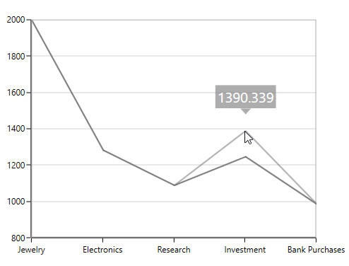
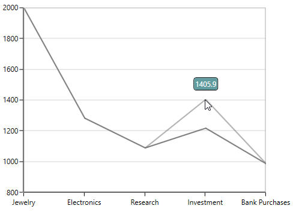
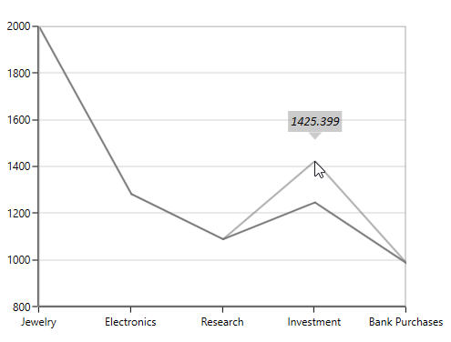

# Visual Data Editing in WPF Charts (SfChart)

SfChart has a feature that allows you to edit an entire series or a single data point at run time by dragging the single point or the series as a whole.

## Segment dragging

Segment Dragging defines the dragging a particular point or segment based on the series type. The segment dragging can be enabled using the [`EnableSegmentDragging`](https://help.syncfusion.com/cr/wpf/Syncfusion.UI.Xaml.Charts.XySegmentDraggingBase.html#Syncfusion_UI_Xaml_Charts_XySegmentDraggingBase_EnableSegmentDragging) property to true.

**Line Series**





<syncfusion:LineSeries Label="2010" EnableSegmentDragging="True"

XBindingPath="Demand"   Interior="#777777"

ItemsSource="{Binding Demands}"                                   

YBindingPath="Year2010">

</syncfusion:LineSeries>





LineSeries series = new LineSeries()
{

    ItemsSource = new ViewModel().Demands,

    XBindingPath = "Demand",

    YBindingPath = "Year2010",

    EnableSegmentDragging = true,

    Interior = new SolidColorBrush(Color.FromRgb(0x77, 0x77, 0x77)),

    Label = "2010"

};

chart.Series.Add(series)





**Column Series**





<syncfusion:ColumnSeries Label="2010" EnableDragTooltip="True" EnableSegmentDragging="True"

XBindingPath="Demand"   Interior="#777777"

ItemsSource="{Binding Demands}"                                   

YBindingPath="Year2010">

</syncfusion:ColumnSeries>





ColumnSeries series = new ColumnSeries()
{

    ItemsSource = new ViewModel().Demands,

    XBindingPath = "Demand",

    YBindingPath = "Year2010",

    EnableSegmentDragging = true,

    EnableDragTooltip = true,

    Interior = new SolidColorBrush(Color.FromRgb(0x77, 0x77, 0x77)),

    Label = "2010"

};

chart.Series.Add(series)





**Scatter Series**

This series supports dragging in both the x and y co-ordinates. The dragging co-ordinates can be set by using the enum property [`DragDirection`](https://help.syncfusion.com/cr/wpf/Syncfusion.UI.Xaml.Charts.ScatterSeries.html#Syncfusion_UI_Xaml_Charts_ScatterSeries_DragDirection).





<syncfusion:ScatterSeries ItemsSource="{Binding Data}" XBindingPath="Index" 

                          YBindingPath="Value"  Interior="#777777"

                          EnableSegmentDragging="True" DragDirection="XY" >

 </syncfusion:ScatterSeries>





ScatterSeries series = new ScatterSeries()
            
{
                
ItemsSource = new ViewModel().Data,
                
XBindingPath = "Index",
                
YBindingPath = "Value",
                
Interior = new SolidColorBrush(Color.FromRgb(0x77, 0x77, 0x77)),
                
EnableSegmentDragging = true,

DragDirection = DragType.XY
            
};

chart.Series.Add(series)





N> By default, the DragDirection of the scatter series is XY.

## Series dragging

SfChart provides support to drag the LineSeries and SplineSeries. This allows the series to move to a new position by dragging. To enable the series dragging, you have to set [`EnableSeriesDragging`](https://help.syncfusion.com/cr/wpf/Syncfusion.UI.Xaml.Charts.XySeriesDraggingBase.html#Syncfusion_UI_Xaml_Charts_XySeriesDraggingBase_EnableSeriesDragging) property to true.

The following code snippet explains the series dragging feature in LineSeries.





<syncfusion:LineSeries Label="2010" EnableDragTooltip="True" EnableSeriesDragging="True"

XBindingPath="Demand"   Interior="#777777" ItemsSource="{Binding Demands}"

YBindingPath="Year2010"/>





LineSeries series = new LineSeries()
{

    ItemsSource = new ViewModel().Demands,

    XBindingPath = "Demand",

    YBindingPath = "Year2010",

    EnableSeriesDragging = true,

    EnableDragTooltip = true ,

    Interior = new SolidColorBrush(Color.FromRgb(0x77, 0x77, 0x77)),

    Label = "2010"

};

chart.Series.Add(series);





N>In line and Spline Series, if segment and series dragging is enabled, the series dragging is having higher priority over segment dragging.

## ToolTip for dragging

While the series or segment is dragged by default you can view the tooltip showing the new y value. To disable the tooltip while dragging you have to set the [`EnableDragToolTip`](https://help.syncfusion.com/cr/wpf/Syncfusion.UI.Xaml.Charts.XySegmentDraggingBase.html#Syncfusion_UI_Xaml_Charts_XySegmentDraggingBase_EnableDragTooltip) as false.





<syncfusion:LineSeries Label="2010"  EnableSegmentDragging="True" EnableDragTooltip="False"

XBindingPath="Demand"   Interior="#777777"

Focusable="False"

ItemsSource="{Binding Demands}"                                   

</syncfusion:LineSeries>





LineSeries series = new LineSeries()
{

    ItemsSource = new ViewModel().Demands,

    XBindingPath = "Demand",

    YBindingPath = "Year2010",

    EnableSeriesDragging = true,

    EnableDragTooltip = true ,

    Focusable = false,

    Interior = new SolidColorBrush(Color.FromRgb(0x77, 0x77, 0x77)),

    Label = "2010"

};

chart.Series.Add(series);





### Drag Tooltip Template

[`DragTooltipTemplate`](https://help.syncfusion.com/cr/wpf/Syncfusion.UI.Xaml.Charts.XySegmentDraggingBase.html#Syncfusion_UI_Xaml_Charts_XySegmentDraggingBase_DragTooltipTemplate)  property allows you to customize the default appearance of the tooltip while dragging.





<syncfusion:SfChart x:Name="chart">

    <syncfusion:SfChart.Resources>

        <DataTemplate x:Key="tooltipTemplate">

            <Border CornerRadius="4" BorderBrush="Black"
                            
                    BorderThickness="1" Background="CadetBlue" 
                    
                    Margin="0,0,0,15">

                <TextBlock  FontSize="12" Text="{Binding NewValue}" 
                                    
                            Width="35" Foreground="White" Margin="2">
                
                </TextBlock>

            </Border>

        </DataTemplate>

    </syncfusion:SfChart.Resources>

    <syncfusion:LineSeries Label="2010" EnableSegmentDragging="True" 
                                   
                           Interior="#777777"
                                   
                           Focusable="False" 

                           XBindingPath="Demand" 
                                   
                           ItemsSource="{Binding Demands}"          
                                   
                           YBindingPath="Year2010"
                                   
                           DragTooltipTemplate="{StaticResource tooltipTemplate }">

    </syncfusion:LineSeries>
            
</syncfusion:SfChart>





ColumnSeries series = new ColumnSeries()
{

    ItemsSource = new ViewModel().Demands,

    XBindingPath = "Demand",

    YBindingPath = "Year2010",

    Focusable = false,

    EnableSegmentDragging = true,

    DragTooltipTemplate = chart.Resources["tooltipTemplate"] as DataTemplate,

    Interior = new SolidColorBrush(Color.FromRgb(0x77, 0x77, 0x77))

};

chart.Series.Add(series);





### Drag Tooltip Style

The dragging tooltip can be customized by using the [`DragTooltipStyle`](https://help.syncfusion.com/cr/wpf/Syncfusion.UI.Xaml.Charts.XySegmentDraggingBase.html#Syncfusion_UI_Xaml_Charts_XySegmentDraggingBase_DragTooltipStyle) property of the series.

The following are the API’s in `ChartDragTooltipStyle`.

[`FontFamily`](https://help.syncfusion.com/cr/wpf/Syncfusion.UI.Xaml.Charts.ChartDragTooltipStyle.html#Syncfusion_UI_Xaml_Charts_ChartDragTooltipStyle_FontFamily) – Gets or sets the font family for dragging tooltip text.

[`FontSize`](https://help.syncfusion.com/cr/wpf/Syncfusion.UI.Xaml.Charts.ChartDragTooltipStyle.html#Syncfusion_UI_Xaml_Charts_ChartDragTooltipStyle_FontSize) – Gets or sets the font size for dragging tooltip text.

[`FontStyle`](https://help.syncfusion.com/cr/wpf/Syncfusion.UI.Xaml.Charts.ChartDragTooltipStyle.html#Syncfusion_UI_Xaml_Charts_ChartDragTooltipStyle_FontStyle) – Gets or sets the font style for dragging tooltip text.

[`Foreground`](https://help.syncfusion.com/cr/wpf/Syncfusion.UI.Xaml.Charts.ChartDragTooltipStyle.html#Syncfusion_UI_Xaml_Charts_ChartDragTooltipStyle_Foreground) – Gets or sets the brush for dragging tooltip text.

[`Background`](https://help.syncfusion.com/cr/wpf/Syncfusion.UI.Xaml.Charts.ChartDragTooltipStyle.html#Syncfusion_UI_Xaml_Charts_ChartDragTooltipStyle_Background) – Gets or sets the background brush for dragging tooltip.





<syncfusion:LineSeries.DragTooltipStyle>
                    
<syncfusion:ChartDragTooltipStyle FontFamily="Calibri" FontSize="14" 
                                                     
                                  FontStyle="Italic" Background="DarkGray" 
                                                      
                                  Foreground="Black" />

</syncfusion:LineSeries.DragTooltipStyle>





series.DragTooltipStyle = new ChartDragTooltipStyle()
            
{
                
    FontFamily = new FontFamily("Calibri"),
                
    FontSize = 14,
                
    FontStyle = FontStyles.Italic,
                
    Background = new SolidColorBrush(Colors.DarkGray),
                
    Foreground = new SolidColorBrush(Colors.Black)
            
};





**Rounding** **Off** **the** **Dragged** **Value**

To round off the dragged values, you have to set the [`SnapToPoint`](https://help.syncfusion.com/cr/wpf/Syncfusion.UI.Xaml.Charts.XySegmentDraggingBase.html#Syncfusion_UI_Xaml_Charts_XySegmentDraggingBase_SnapToPoint) and [`RoundToDecimal`](https://help.syncfusion.com/cr/wpf/Syncfusion.UI.Xaml.Charts.XySegmentDraggingBase.html#Syncfusion_UI_Xaml_Charts_XySegmentDraggingBase_RoundToDecimal) properties. The following code snippet explains rounding the dragged y value to 2 decimal digits.





<syncfusion:SplineSeries   EnableSegmentDragging="True"

SnapToPoint="Round" RoundToDecimal="2" YBindingPath = "Year2010"

UpdateSource="True" XBindingPath="Demand"   Interior="#777777"

ItemsSource="{Binding Demands}"                                   

</syncfusion:SplineSeries>





SplineSeries series = new SplineSeries()
{

    ItemsSource = new ViewModel().Demands,

    XBindingPath = "Demand",

    YBindingPath = "Year2010",

    EnableSegmentDragging = true,

    UpdateSource = true ,

    RoundToDecimal = 2,

    SnapToPoint = SnapToPoint.Round,

    Interior = new SolidColorBrush(Color.FromRgb(0x77, 0x77, 0x77))

};

chart.Series.Add(series);





### Updating the Dragged Values to the Source

When dragging the series or segment at run time, to update the underlying data based on the values you have to set the [`UpdateSource`](https://help.syncfusion.com/cr/wpf/Syncfusion.UI.Xaml.Charts.XySegmentDraggingBase.html#Syncfusion_UI_Xaml_Charts_XySegmentDraggingBase_UpdateSource) property to true as in the following code snippet.





<syncfusion:SplineSeries   EnableSegmentDragging="True" UpdateSource="True"

XBindingPath="Demand"   Interior="#777777"

ItemsSource="{Binding Demands}"                                   

YBindingPath="Year2010">

</syncfusion:SplineSeries>





SplineSeries series = new SplineSeries()
{

    ItemsSource = new ViewModel().Demands,

    XBindingPath = "Demand",

    YBindingPath = "Year2010",

    EnableSegmentDragging = true,

    UpdateSource = true ,

    Interior = new SolidColorBrush(Color.FromRgb(0x77, 0x77, 0x77))

};

chart.Series.Add(series);





### Drag Cancel using KeyModifiers

While you are dragging you can set the KeyModifiers to cancel the drag by setting [`DragCancelKeyModifier`](https://help.syncfusion.com/cr/wpf/Syncfusion.UI.Xaml.Charts.XySegmentDraggingBase.html#Syncfusion_UI_Xaml_Charts_XySegmentDraggingBase_DragCancelKeyModifiers) property as in the below code snippet.





<syncfusion:SplineSeries  

EnableSegmentDragging="True" 

DragCancelKeyModifiers="Alt"  

UpdateSource="True"

XBindingPath="Demand"                                   

ItemsSource="{Binding Demands}"                                   

YBindingPath="Year2010">

</syncfusion:SplineSeries>





SplineSeries series = new SplineSeries()
{

    ItemsSource = new ViewModel().Demands,

    XBindingPath = "Demand",

    YBindingPath = "Year2010",

    EnableSegmentDragging = true,

    DragCancelKeyModifiers = ModifierKeys.Alt,

    UpdateSource = true ,

    Interior = new SolidColorBrush(Color.FromRgb(0x77, 0x77, 0x77))

};

chart.Series.Add(series);





## Events

Series with visual data editing has support for following events:

* [`DragStart`](https://help.syncfusion.com/cr/wpf/Syncfusion.UI.Xaml.Charts.XySegmentDraggingBase.html)- Occurs when segment/series drag started. 
* [`DragDelta`](https://help.syncfusion.com/cr/wpf/Syncfusion.UI.Xaml.Charts.XySegmentDraggingBase.html)- Occurs when segment/series dragging.
* [`DragEnd`](https://help.syncfusion.com/cr/wpf/Syncfusion.UI.Xaml.Charts.XySegmentDraggingBase.html)- Occurs when segment/series drag end. 
* [`PreviewDragEnd`](https://help.syncfusion.com/cr/wpf/Syncfusion.UI.Xaml.Charts.XySegmentDraggingBase.html)- Occurs before drag end triggered. 
* [`SegmentEnter`](https://help.syncfusion.com/cr/wpf/Syncfusion.UI.Xaml.Charts.XySegmentDraggingBase.html)- Occurs when mouse enters in segment. 
