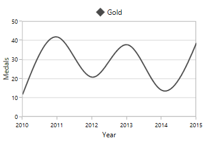
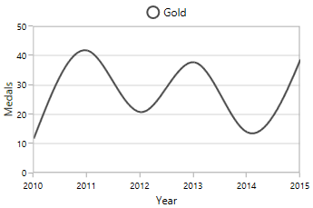
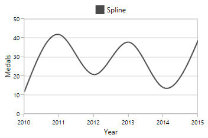
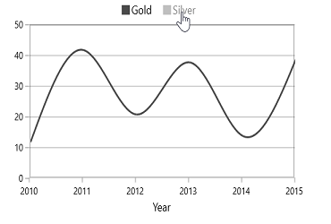
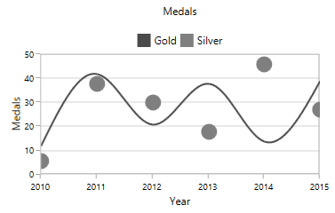
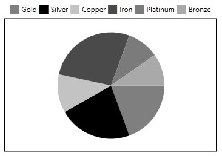
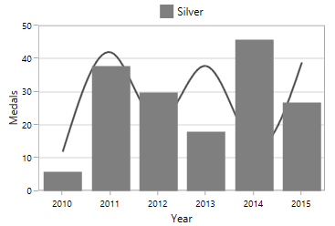
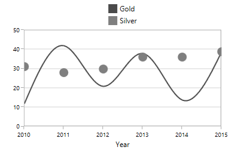

# Legend in WPF Charts (SfChart)

[`Legend`](https://help.syncfusion.com/cr/wpf/Syncfusion.UI.Xaml.Charts.ChartBase.html#Syncfusion_UI_Xaml_Charts_ChartBase_Legend) provides metadata which helps for identifying elements in chart like [chart series](https://help.syncfusion.com/wpf/sfchart/series), 
[technical indicators](https://help.syncfusion.com/wpf/sfchart/technical-indicators), and [trendlines](https://help.syncfusion.com/wpf/sfchart/trendlines). 
You can define the legend using the following code example.





<chart:SfChart.Legend>

       <chart:ChartLegend />                                 

</chart:SfChart.Legend>





SfChart chart = new SfChart();

chart.Legend = new ChartLegend();





Each legend composed of the following parts:

## Legend Icon

Represents the symbol associated with each legend item. By default, the legend icon is [`Rectangle`](https://help.syncfusion.com/cr/wpf/Syncfusion.UI.Xaml.Charts.ChartLegendIcon.html). 

This can be customized using the [`LegendIcon`](https://help.syncfusion.com/cr/wpf/Syncfusion.UI.Xaml.Charts.ChartSeriesBase.html#Syncfusion_UI_Xaml_Charts_ChartSeriesBase_LegendIcon) property in any series as in below code snippet:





<chart:SfChart.Legend>

      <chart:ChartLegend/>

</chart:ChartLegend>

<chart:SplineSeries XBindingPath="Year" Label="Gold"
	                  
                    ItemsSource="{Binding List}" YBindingPath="India"
                     
					LegendIcon="Diamond" />





chart.Legend = new ChartLegend();

SplineSeries splineSeries = new SplineSeries()
{

    Label = "Gold",

    ItemsSource = new ViewModel().List,

    XBindingPath = "Year",

    YBindingPath = "India",

    LegendIcon = ChartLegendIcon.Diamond

};

chart.Series.Add(splineSeries);





The following properties are used to customize the legend icons.

* [`IconWidth`](https://help.syncfusion.com/cr/wpf/Syncfusion.UI.Xaml.Charts.ChartLegend.html#Syncfusion_UI_Xaml_Charts_ChartLegend_IconWidth)-Gets or sets the double value that represents the legend icon(s) width.
* [`IconHeight`](https://help.syncfusion.com/cr/wpf/Syncfusion.UI.Xaml.Charts.ChartLegend.html#Syncfusion_UI_Xaml_Charts_ChartLegend_IconHeight)-Gets or sets the double value that represents that legend icon(s) height.
* [`IconVisibility`](https://help.syncfusion.com/cr/wpf/Syncfusion.UI.Xaml.Charts.ChartLegend.html#Syncfusion_UI_Xaml_Charts_ChartLegend_IconVisibility)-Gets or sets the Visibility of the legend icon.
* [`ItemMargin`](https://help.syncfusion.com/cr/wpf/Syncfusion.UI.Xaml.Charts.ChartLegend.html#Syncfusion_UI_Xaml_Charts_ChartLegend_ItemMargin)-Gets or sets the margin for the legend items.
* [`CornerRadius`](https://help.syncfusion.com/cr/wpf/Syncfusion.UI.Xaml.Charts.ChartLegend.html#Syncfusion_UI_Xaml_Charts_ChartLegend_CornerRadius)-Gets or sets the corner radius of the legend.

The following code example illustrates the customization of legend icon.





<chart:SfChart.Legend>

    <chart:ChartLegend  IconHeight="10" IconWidth="10" 

                        Margin="0,0,0,5"

                        HorizontalAlignment="Center"

                        VerticalAlignment="Center"                                    

                        DockPosition="Top"

                        BorderBrush="Black" BorderThickness="1"

                        IconVisibility="Visible" CornerRadius="5" 

                        ItemMargin="10">                   

    </chart:ChartLegend>

</chart:SfChart.Legend>       





chart.Legend = new ChartLegend()
{

    IconHeight = 10,

    IconWidth = 10,

    Margin = new Thickness(0, 0, 0, 5),

    HorizontalAlignment = HorizontalAlignment.Center,

    VerticalAlignment = VerticalAlignment.Center,

    DockPosition = ChartDock.Top,

    IconVisibility = Visibility.Visible,

    CornerRadius = new CornerRadius(5),

    ItemMargin = new Thickness(10),

    BorderThickness = new Thickness(1),

    BorderBrush = new SolidColorBrush(Colors.Black)

};





The visibility of the legend icon can be changed by setting [`IconVisibility`](https://help.syncfusion.com/cr/wpf/Syncfusion.UI.Xaml.Charts.ChartLegend.html#Syncfusion_UI_Xaml_Charts_ChartLegend_IconVisibility) property in ChartLegend. 





<chart:SfChart.Legend>

   <chart:ChartLegend  IconHeight="8" IconWidth="8"  

                       IconVisibility="Collapsed" />                                 

</chart:SfChart.Legend>





chart.Legend = new ChartLegend()
{

    IconHeight = 8,

    IconWidth = 8,

    IconVisibility = Visibility.Collapsed,

};





**Custom** **Legend** **Icon**

We can add custom icon for the legend using [`LegendIconTemplate`](https://help.syncfusion.com/cr/wpf/Syncfusion.UI.Xaml.Charts.ChartSeriesBase.html#Syncfusion_UI_Xaml_Charts_ChartSeriesBase_LegendIconTemplate) property in ChartSeries as in below example.





<syncfusion:SfChart x:Name="chart">

    <syncfusion:SfChart.Resources>

        <DataTemplate x:Key="iconTemplate">

            <Ellipse Height="15" Width="15" Fill="White" 
			                   
                     Stroke="#4a4a4a" StrokeThickness="2"/>

        </DataTemplate>

    </syncfusion:SfChart.Resources>

    <syncfusion:SfChart.Legend>

        <syncfusion:ChartLegend/>

     </syncfusion:SfChart.Legend>

    <syncfusion:SplineSeries XBindingPath="Year"  Label="Gold" 
  
	                         ItemsSource="{Binding List}" 
                                     
                             YBindingPath="India" 
                                     
                             LegendIconTemplate="{StaticResource iconTemplate}">

    </syncfusion:SplineSeries>
        
</syncfusion:SfChart>





SplineSeries series = new SplineSeries()
{

    ItemsSource = new ViewModel().List,

    XBindingPath = "Year",

    YBindingPath = "India",

    LegendIconTemplate = chart.Resources["iconTemplate"] as DataTemplate

};

chart.Series.Add(series);





## Label

This allows us to specify the label for each series which is to be displayed in legend label.





<chart:SfChart.Legend>

    <chart:ChartLegend>

    </chart:ChartLegend>

</chart:SfChart.Legend>

<chart:SplineSeries XBindingPath="Year" Label="Spline"
   
	                  ItemsSource="{Binding List}" YBindingPath="India"/>





chart.Legend = new ChartLegend();

SplineSeries splineSeries = new SplineSeries()
{

    Label = "Spline",

    ItemsSource = new ViewModel().List,

    XBindingPath = "Year",

    YBindingPath = "India",

};

chart.Series.Add(splineSeries);





## Checkbox 

Used to view or collapse the associated series. By default, the CheckboxVisibility is *Collapsed*. 

We can enable it by using the [`CheckBoxVisibility`](https://help.syncfusion.com/cr/wpf/Syncfusion.UI.Xaml.Charts.ChartLegend.html#Syncfusion_UI_Xaml_Charts_ChartLegend_CheckBoxVisibility) property as in below code example:





<chart:SfChart.Legend>

        <chart:ChartLegend CheckBoxVisibility="Visible" />

</chart:SfChart.Legend>





chart.Legend = new ChartLegend()
{

    CheckBoxVisibility = Visibility.Visible

};





The series can be collapsed by unchecking the CheckBox as below:

## ToggleSeriesVisibility 

[`ToggleSeriesVisibility`](https://help.syncfusion.com/cr/wpf/Syncfusion.UI.Xaml.Charts.ChartLegend.html#Syncfusion_UI_Xaml_Charts_ChartLegend_ToggleSeriesVisibility) is used to view or collapse the associated [`series`](https://help.syncfusion.com/wpf/sfchart/series), by clicking on its legend item. By default, [`ToggleSeriesVisibility`](https://help.syncfusion.com/cr/wpf/Syncfusion.UI.Xaml.Charts.ChartLegend.html#Syncfusion_UI_Xaml_Charts_ChartLegend_ToggleSeriesVisibility) property is *False*.

We can enable the [`ToggleSeriesVisibility`](https://help.syncfusion.com/cr/wpf/Syncfusion.UI.Xaml.Charts.ChartLegend.html#Syncfusion_UI_Xaml_Charts_ChartLegend_ToggleSeriesVisibility) property as in below code example:





<chart:SfChart.Legend>

        <chart:ChartLegend ToggleSeriesVisibility="True" />

</chart:SfChart.Legend>





chart.Legend = new ChartLegend()
{

    ToggleSeriesVisibility = true

};





The [`series`](https://help.syncfusion.com/wpf/sfchart/series) can be collapsed, by clicking on the respective legend item,

We can also view the associated [`series`](https://help.syncfusion.com/wpf/sfchart/series), by clicking on its disabled legend item,

## Positioning the Legend

**Legend** **Position**

This allows us to position the legends [`Inside`](https://help.syncfusion.com/cr/wpf/Syncfusion.UI.Xaml.Charts.LegendPosition.html) or [`Outside`](https://help.syncfusion.com/cr/wpf/Syncfusion.UI.Xaml.Charts.LegendPosition.html) of the chart area (plotting area). 
By default, it will be displayed outside and positioned at top (using [`DockPosition`](https://help.syncfusion.com/cr/wpf/Syncfusion.UI.Xaml.Charts.ChartLegend.html#Syncfusion_UI_Xaml_Charts_ChartLegend_DockPosition)) of the chart area.





<chart:SfChart.Legend>

     <chart:ChartLegend LegendPosition="Inside" />                                 

</chart:SfChart.Legend>





chart.Legend = new ChartLegend()
{

    LegendPosition = LegendPosition.Inside

};





**Docking**

Legends can be docked left, right, and top or bottom around the chart area using [`DockPosition`](https://help.syncfusion.com/cr/wpf/Syncfusion.UI.Xaml.Charts.ChartLegend.html#Syncfusion_UI_Xaml_Charts_ChartLegend_DockPosition) property. 
By default, the ChartLegend is docked at the top of the chart as mentioned earlier.

To display the legend at the bottom, you can set the [`DockPosition`](https://help.syncfusion.com/cr/wpf/Syncfusion.UI.Xaml.Charts.ChartLegend.html#Syncfusion_UI_Xaml_Charts_ChartLegend_DockPosition) as [`Bottom`](https://help.syncfusion.com/cr/wpf/Syncfusion.UI.Xaml.Charts.ChartDock.html) as in below code snippet.





<chart:SfChart.Legend>

    <chart:ChartLegend  DockPosition="Bottom"/>

</chart:SfChart.Legend>





chart.Legend = new ChartLegend()
{

    DockPosition = ChartDock.Bottom

};





**Floating** **Legends**

To position the legend at any arbitrary location inside chart, we need to set [`DockPosition`](https://help.syncfusion.com/cr/wpf/Syncfusion.UI.Xaml.Charts.ChartLegend.html#Syncfusion_UI_Xaml_Charts_ChartLegend_DockPosition) as **Floating** and provide its relative position using [`OffsetX`](https://help.syncfusion.com/cr/wpf/Syncfusion.UI.Xaml.Charts.ChartLegend.html#Syncfusion_UI_Xaml_Charts_ChartLegend_OffsetX) and [`OffsetY`](https://help.syncfusion.com/cr/wpf/Syncfusion.UI.Xaml.Charts.ChartLegend.html#Syncfusion_UI_Xaml_Charts_ChartLegend_OffsetY) properties.
 
Offset specifies x or y distance from origin.





<chart:SfChart.Legend>

      <chart:ChartLegend  DockPosition="Floating" OffsetX="30" OffsetY="10"/>

</chart:SfChart.Legend>





chart.Legend = new ChartLegend()
{

    DockPosition = ChartDock.Floating,

    OffsetX = 30,

    OffsetY = 10

};





## Legend Header

Chart provides support to add any UIElement as a header for legend items. 

You can define the [`Header`](https://help.syncfusion.com/cr/wpf/Syncfusion.UI.Xaml.Charts.ChartLegend.html#Syncfusion_UI_Xaml_Charts_ChartLegend_Header) for legend using the following code example.





<chart:SfChart.Legend>

      <chart:ChartLegend>

          <chart:ChartLegend.Header>

               <TextBlock Text="Medals" VerticalAlignment="Center"  

                           HorizontalAlignment="Center" Margin="15"/>

            </chart:ChartLegend.Header>

     </chart:ChartLegend>

</chart:SfChart.Legend>





ChartLegend legend = new ChartLegend();

TextBlock textBlock = new TextBlock()
{

    Text = "Medals",

    HorizontalAlignment = HorizontalAlignment.Center,

    VerticalAlignment = VerticalAlignment.Center,

    Margin = new Thickness(15)

};

legend.Header = textBlock;

chart.Legend = legend;





## Multiple Legends

Chart control supports showing the legend in multiple panels, to view the legend clearly when multiple areas and greater numbers of chart series are present. 

The following code example shows how to create multiple legends in a single chart.





<chart:SfChart.Legend>

   <chart:ChartLegendCollection>

       <chart:ChartLegend chart:SfChart.Column="0"/>

       <chart:ChartLegend chart:SfChart.Column="1" />

    </chart:ChartLegendCollection>

</chart:SfChart.Legend>

<chart:ColumnSeries Interior="#4a4a4a" Label="Legend1"

                    ItemsSource="{Binding SneakersDetail}" XBindingPath="Brand" 
					
					          YBindingPath="ItemsCount1" />

<chart:SplineSeries Label="Legend2" ItemsSource="{Binding SneakersDetail}"  

                    XBindingPath="Brand" YBindingPath="ItemsCount" >

    <chart:SplineSeries.XAxis>

          <chart:CategoryAxis chart:SfChart.Column="1">

          </chart:CategoryAxis>

     </chart:SplineSeries.XAxis>

</chart:SplineSeries>





ChartLegendCollection legendCollection = new ChartLegendCollection();

ChartLegend legend1 = new ChartLegend();

SfChart.SetColumn(legend1, 0);

ChartLegend legend2 = new ChartLegend();

SfChart.SetColumn(legend2, 1);

legendCollection.Add(legend1);

legendCollection.Add(legend2);

chart.Legend = legendCollection;

ColumnSeries columnSeries = new ColumnSeries()
{
    Label = "Legend1",

    ItemsSource = new ViewModel().SneakersDetail,

    XBindingPath = "Brand",

    YBindingPath = "ItemsCount1",

    Interior = new SolidColorBrush(Color.FromRgb(0x4a, 0x4a, 0x4a)),

};

CategoryAxis axis = new CategoryAxis();

SfChart.SetColumn(axis, 1);

SplineSeries splineSeries = new SplineSeries()
{

    Label = "Legend1",

    ItemsSource = new ViewModel().SneakersDetail,

    XBindingPath = "Brand",

    YBindingPath = "ItemsCount",

    XAxis = axis

};

chart.Series.Add(columnSeries);

chart.Series.Add(splineSeries);





## Legends for Accumulation Series

For the series like Pie, Doughnut, Funnel and Pyramid, legends will be generated for all the data points. But for remaining series, each legend corresponds to each series. By default, the [`Interior`](https://help.syncfusion.com/cr/wpf/Syncfusion.UI.Xaml.Charts.LegendItem.html#Syncfusion_UI_Xaml_Charts_LegendItem_Interior) color of the segment (data point) is applied to the legend icon. 

The following code snippets explains how the legends displaying for accumulation series.





<chart:SfChart.Legend>

   <chart:ChartLegend />                                 

</chart:SfChart.Legend>

<chart:PieSeries  XBindingPath="Category" 
	
	             ItemsSource="{Binding Tax}" YBindingPath="Percentage"/>





chart.Legend = new ChartLegend();

PieSeries pieSeries = new PieSeries()
{

    ItemsSource = new ViewModel().Tax,

    XBindingPath = "Category",

    YBindingPath = "Percentage"

};

chart.Series.Add(pieSeries);





N> Here Legend ‘Label’ will be the x value of the Pie chart.

## Series visibility on legend

We can limit the number of series and trendlines to be displayed in chart using [`VisibilityOnLegend`](https://help.syncfusion.com/cr/wpf/Syncfusion.UI.Xaml.Charts.ChartSeriesBase.html#Syncfusion_UI_Xaml_Charts_ChartSeriesBase_VisibilityOnLegend)
property as shown in below example.





<chart:SfChart.Legend>

    <chart:ChartLegend>                  

    </chart:ChartLegend>

</chart:SfChart.Legend>

<chart:SplineSeries XBindingPath="Year" Label="Gold" 

                    VisibilityOnLegend="Collapsed"

                    ItemsSource="{Binding List}" YBindingPath="India">

</chart:SplineSeries>

<chart:ColumnSeries XBindingPath="Year"

                    VisibilityOnLegend="Visible"

                    Label="Silver" YBindingPath="America"

                    ItemsSource="{Binding List}" />   





chart.Legend = new ChartLegend();

SplineSeries splineSeries = new SplineSeries()
{

    Label = "Gold",

    ItemsSource = new ViewModel().List,

    XBindingPath = "Year",

    YBindingPath = "India",

    VisibilityOnLegend = Visibility.Collapsed

};

ColumnSeries columnSeries = new ColumnSeries()
{

    Label = "Silver",

    ItemsSource = new ViewModel().List,

    XBindingPath = "Year",

    YBindingPath = "America",

    VisibilityOnLegend = Visibility.Visible

};

chart.Series.Add(splineSeries);

chart.Series.Add(columnSeries);





## Legend Orientation

Orientation of the Legend can be vertical or horizontal. By default the [`Orientation`](https://help.syncfusion.com/cr/wpf/Syncfusion.UI.Xaml.Charts.ChartLegend.html#Syncfusion_UI_Xaml_Charts_ChartLegend_Orientation) is [`Horizontal`](https://help.syncfusion.com/cr/wpf/Syncfusion.UI.Xaml.Charts.ChartOrientation.html). 





<chart:SfChart.Legend>

   <chart:ChartLegend  Orientation="Vertical"/>

</chart:SfChart.Legend>





chart.Legend = new ChartLegend()
{

    Orientation = ChartOrientation.Vertical

};





## Customization

**ItemTemplate**

You can customize each legend item using `ItemTemplate` property in ChartLegend as in below code snippet:





 <syncfusion:SfChart x:Name="chart">

     <syncfusion:SfChart.Resources>

            <local:ImageConverter x:Key="imageConverter"/>

            <DataTemplate x:Key="itemTemplate">

                <Grid Margin="10,0,10,0" >

                    <Grid.RowDefinitions>

                        <RowDefinition/>

                        <RowDefinition/>

                    </Grid.RowDefinitions>

                    <Image  Width="30" Height="15"
                                        
                            Source="{Binding Converter={StaticResource imageConverter}}"/>

                    <TextBlock HorizontalAlignment="Center" FontSize="12"
                                           
                               Grid.Row="1" Foreground="Black" 
                                           
                               FontWeight="SemiBold" Text="{Binding Label}">

                    </TextBlock>

                </Grid>

             </DataTemplate>

    </syncfusion:SfChart.Resources>

    <syncfusion:SfChart.Legend>

                <syncfusion:ChartLegend ItemTemplate="{StaticResource itemTemplate}"/>

    </syncfusion:SfChart.Legend>

</syncfusion:SfChart>





SfChart chart = new SfChart();

chart.Legend = new ChartLegend()
{

   ItemTemplate = chart.Resources["itemTemplate"] as DataTemplate

};

public class ImageConverter:IValueConverter

{

 public object Convert(object value, Type targetType, object parameter, System.Globalization.CultureInfo culture)

  {

   LegendItem item = value as LegendItem;

   if (item.Label == "Gold")

     return new BitmapImage(new Uri(("gold_symb.png"),UriKind.RelativeOrAbsolute));

   else

    return new BitmapImage(new Uri(("silver_symb.png"), UriKind.RelativeOrAbsolute));

  }

  public object ConvertBack(object value, Type targetType, object parameter, System.Globalization.CultureInfo culture)

  {

    return value;

  }

}





**Customizing** **Legend** **Items** **Layout**

When there is more number of legends, the legend exceeds the chart will be cropped, as it arranged horizontally. To avoid the cropping we can change the existing arrangement layout (one which arrange each legend items horizontally) using `ItemsPanel` property as in below code snippet:





<syncfusion:SfChart x:Name="chart">

    <syncfusion:SfChart.Resources>

        <ItemsPanelTemplate x:Key="itemPanelTemplate">

             <WrapPanel/>

        </ItemsPanelTemplate>
                
    </syncfusion:SfChart.Resources>

    <syncfusion:SfChart.Legend>

            <syncfusion:ChartLegend ItemsPanel="{StaticResource itemPanelTemplate}"/>

    </syncfusion:SfChart.Legend>

 </syncfusion:SfChart>





SfChart chart = new SfChart();

chart.Legend = new ChartLegend()
{

    ItemsPanel = chart.Resources["itemPanelTemplate"] as ItemsPanelTemplate

};





## Troubleshooting

The legend item is not showing because the chart view is running in the background thread with the timespan problem while updating the chart element dynamically. You can resolve this by using the Dispatcher.BeginInvoke() method. Please refer to the following code sample.



ChartWindow chartWindow = new ChartWindow();

chartWindow.DataContext = measurementChart;

chartWindow.Content = new AutoChart();

chartWindow.Content = new SfChart()
{    
	. . .
}

Action action = chartWindow.Show;

Application.Current.Dispatcher.BeginInvoke(action, Array.Empty<object>()); 



## See also

[`How to customize the legend Icon based on series appearance in WPF Chart`](https://www.syncfusion.com/kb/11672/how-to-customize-the-legend-icon-based-on-series-appearance-in-wpf-chart)

[`How to achieve the draggable legend in WPF Chart`](https://www.syncfusion.com/kb/11484/how-to-achieve-the-draggable-legend-in-wpf-chart-sfchart)

[`How to wrap the text in the WPF Chart legend`](https://www.syncfusion.com/kb/10996/how-to-wrap-the-text-in-the-wpf-chart-legend)

[`How to control the visibility of all series with a single legend item in WPF Chart`](https://www.syncfusion.com/kb/10995/how-to-control-the-visibility-of-all-series-with-a-single-legend-item-in-wpf-chart)

[`How to create custom legend items in WPF Chart`](https://www.syncfusion.com/kb/10675/how-to-create-custom-legend-items-in-wpf-chart)

[`How to get a notification when the legend items are clicked in WPF Chart`](https://www.syncfusion.com/kb/10169/how-to-get-a-notification-when-the-legend-items-are-clicked-in-wpf-chart)

[`How to add multiple legend items in scroll viewer`](https://www.syncfusion.com/kb/4846/how-to-add-multiple-legend-items-in-scroll-viewer)

[`How to format the legend text`](https://www.syncfusion.com/kb/4691/how-to-format-the-legend-text)

[`How to set or modify the label of the each legend`](https://www.syncfusion.com/kb/4687/how-to-set-or-modify-the-label-of-the-each-legend)

[`How to customize the legends position`](https://www.syncfusion.com/kb/4684/how-to-customize-the-legends-position)

[`How to customize the icons of the legends in Chart`](https://www.syncfusion.com/kb/3966/how-to-customize-the-icons-of-the-legends-in-sfchart)
