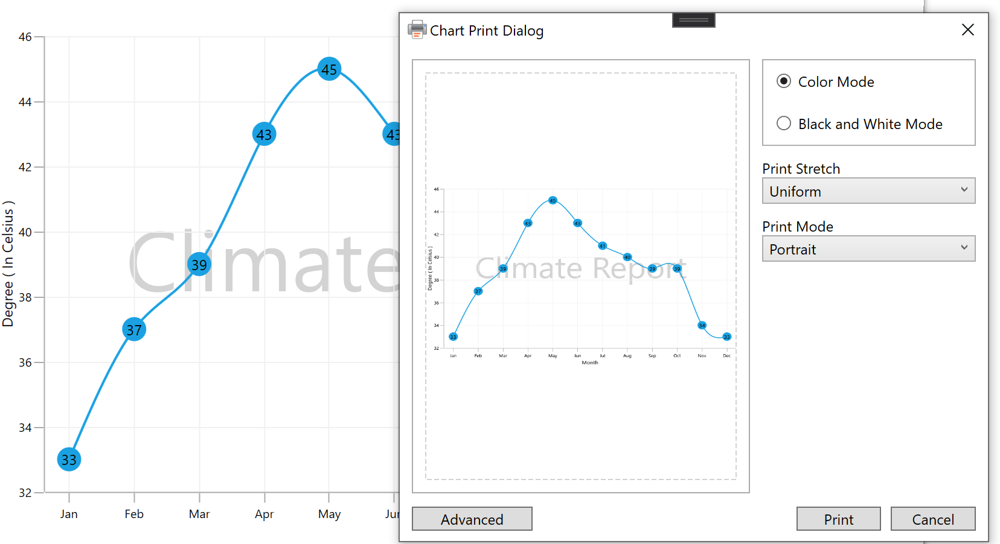

# Printing in WPF Charts (SfChart)

SfChart supports printing that enables you to print the chart. The following method is used to print the chart.

## Print()

This method will invoke a printing dialog window with set of printing options.

The following code example demonstrates the printing of chart in button click event:





<chart:SfChart x:Name="ExportDemoChart" >

<chart:SfChart.Watermark>

<chart:Watermark Canvas.ZIndex="-1"  HorizontalAlignment="Center" VerticalAlignment="Center">

<chart:Watermark.Content>

<TextBlock Text="Climate Report" FontSize="60" Foreground="Gray" Opacity="0.5"></TextBlock>

</chart:Watermark.Content>

</chart:Watermark>

</chart:SfChart.Watermark>

<chart:SfChart.PrimaryAxis>

<chart:CategoryAxis  PlotOffset="20" Header="Month" />

</chart:SfChart.PrimaryAxis>

<chart:SfChart.SecondaryAxis>

<chart:NumericalAxis Header="Degree ( In Celsius )" 

RangePadding="Round"/>

</chart:SfChart.SecondaryAxis>

<!-- Add Series to the Chart-->

<chart:SplineSeries Label="Sports" ItemsSource="{Binding ClimateData}"         

XBindingPath="Month" YBindingPath="Temperature">

<chart:SplineSeries.AdornmentsInfo>

<chart:ChartAdornmentInfo  ShowMarker="True" Symbol="Ellipse" 

ShowLabel="True"/>

</chart:SplineSeries.AdornmentsInfo>

</chart:SplineSeries>

</chart:SfChart>





private void Button_Click_1(object sender, RoutedEventArgs e)

{

    ExportDemoChart.Print();

}





The following image shows the printing dialog window upon invoking print method.

