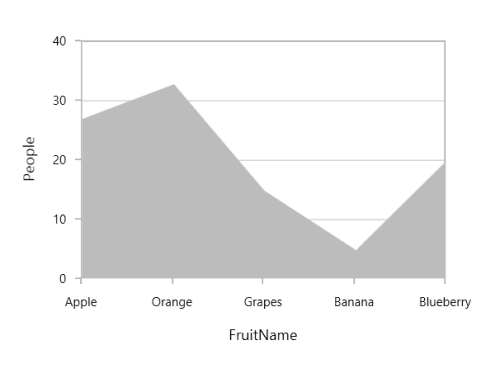
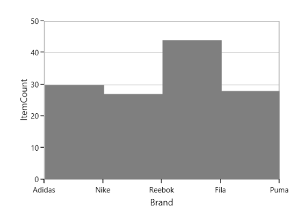

# Area in WPF Charts (SfChart)

## Area Chart
[`AreaSeries`](https://help.syncfusion.com/cr/wpf/Syncfusion.UI.Xaml.Charts.AreaSeries.html#) is rendered using a collection of line segments connected to form a closed loop area, filled with the specified color.

The following code example initializes the AreaSeries:





<chart:AreaSeries XBindingPath="FruitName" Interior="#BCBCBC" 

YBindingPath="People" ItemsSource="{Binding Fruits}" >   





AreaSeries series = new AreaSeries()
{

    ItemsSource = new ViewModel().Fruits,

    XBindingPath = "FruitName",

    YBindingPath = "People",

    Interior = new SolidColorBrush(Color.FromRgb(0xBC, 0xBC, 0xBC))

};

chart.Series.Add(series);





## Step Area Chart

[`StepAreaSeries`](https://help.syncfusion.com/cr/wpf/Syncfusion.UI.Xaml.Charts.StepAreaSeries.html#) is similar to AreaSeries but it does not use the shortest distance to connect two data points using Bezier curves. Instead, this ChartSeries uses vertical and horizontal lines to connect the data points in a series forming a step-like progression.





<chart:StepAreaSeries  Interior="#7F7F7F"  

ItemsSource="{Binding SneakersDetail}" XBindingPath="Brand" 

YBindingPath="ItemsCount"/>





StepAreaSeries series = new StepAreaSeries()
{

    ItemsSource = new ViewModel().SneakersDetail,

    XBindingPath = "Brand",

    YBindingPath = "ItemsCount",

    Interior = new SolidColorBrush(Color.FromRgb(0x7F, 0x7F, 0x7F))

};

chart.Series.Add(series);





## Closed Area Chart

If you wish to draw the open area series (Area with stroke only at top), SfChart provides [`IsClosed`](https://help.syncfusion.com/cr/wpf/Syncfusion.UI.Xaml.Charts.AreaSeries.html#Syncfusion_UI_Xaml_Charts_AreaSeries_IsClosed) property. By default, this property is true.





<chart:AreaSeries  IsClosed="False"

XBindingPath="FruitName" Interior="#BCBCBC" 

YBindingPath="People" ItemsSource="{Binding Fruits}" /> 





AreaSeries series = new AreaSeries()
{

    ItemsSource = new ViewModel().Fruits,

    XBindingPath = "FruitName",

    YBindingPath = "People",

    IsClosed = true,

    Interior = new SolidColorBrush(Color.FromRgb(0xBC, 0xBC, 0xBC))

};

chart.Series.Add(series);





