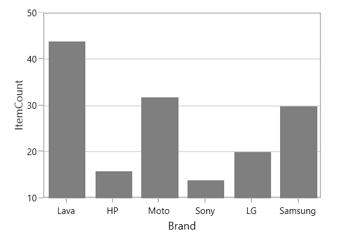
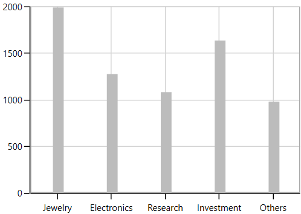

# Column and Bar Charts in WPF Chart (SfChart)

## Column

Column charts plot discrete rectangles for the given values. The following code example demonstrates the usage of [`ColumnSeries`](https://help.syncfusion.com/cr/cref_files/wpf/Syncfusion.SfChart.WPF~Syncfusion.UI.Xaml.Charts.ColumnSeries.html#).





<chart:ColumnSeries Interior="#7F7F7F" ItemsSource="{Binding SneakersDetail}"           

XBindingPath="Brand" YBindingPath="ItemsCount1"   />





ColumnSeries series = new ColumnSeries()
{

    ItemsSource = new ViewModel().SneakersDetail,

    XBindingPath = "Brand",

    YBindingPath = "ItemsCount1",

    Interior = new SolidColorBrush(Color.FromRgb(0x7F, 0x7F, 0x7F))

};

chart.Series.Add(series);





## Bar

Bar series are similar to column series, excepts its orientation. The following code examples shows how to use [`BarSeries`](https://help.syncfusion.com/cr/cref_files/wpf/Syncfusion.SfChart.WPF~Syncfusion.UI.Xaml.Charts.BarSeries.html#).





<chart:BarSeries ItemsSource="{Binding CategoricalDatas}" XBindingPath="Category" 

YBindingPath="Value" Interior="#7F7F7F" />





BarSeries series = new BarSeries()
{

    ItemsSource = new ViewModel().CategoricalDatas,

    XBindingPath = "Category",

    YBindingPath = "Value",

    Interior = new SolidColorBrush(Color.FromRgb(0x7F, 0x7F, 0x7F))

};





### Spacing

[`Spacing`](https://help.syncfusion.com/cr/cref_files/wpf/Syncfusion.SfChart.WPF~Syncfusion.UI.Xaml.Charts.ChartSeriesBase~SpacingProperty.html) property of series is used to decide the width of a segment. [`Spacing`](https://help.syncfusion.com/cr/cref_files/wpf/Syncfusion.SfChart.WPF~Syncfusion.UI.Xaml.Charts.ChartSeriesBase~SpacingProperty.html) value ranges from 0 to 1. The following code illustrates how to set [`Spacing`](https://help.syncfusion.com/cr/cref_files/wpf/Syncfusion.SfChart.WPF~Syncfusion.UI.Xaml.Charts.ChartSeriesBase~SpacingProperty.html) property of the series,





<Chart:ColumnSeries Chart:ChartSeriesBase.Spacing="0.8"/>





ColumnSeries series = new ColumnSeries()

ChartSeriesBase.SetSpacing(series, 0.8);





**Segment Spacing**

[`SegmentSpacing`](https://help.syncfusion.com/cr/cref_files/wpf/Syncfusion.SfChart.WPF~Syncfusion.UI.Xaml.Charts.ColumnSeries~SegmentSpacing.html) property is used to set the spacing among the segments, when multiple series are added in chart. Its value ranges from 0 to 1. The following code illustrates how to use the [`SegmentSpacing`](https://help.syncfusion.com/cr/cref_files/wpf/Syncfusion.SfChart.WPF~Syncfusion.UI.Xaml.Charts.ColumnSeries~SegmentSpacing.html) property in series,





<Chart:SfChart >

<Chart:ColumnSeries SegmentSpacing="0.6"/>

<Chart:ColumnSeries SegmentSpacing="0.6"/>

</Chart:SfChart>





SfChart chart = new SfChart();

ColumnSeries series1 = new ColumnSeries()

{

    SegmentSpacing = 0.6,

};

chart.Series.Add(series1);

ColumnSeries series2 = new ColumnSeries()

{

    SegmentSpacing = 0.6

};

chart.Series.Add(series2);





## Placing Series Side-By-Side

It defines the placement pattern of bar type series like Column, Bar, RangeColumn, etc. 

It is a Boolean property and its default value is true so the segment will be placed adjacent to each other (Clustered).

The following code example and image illustrates the placement of series while setting [`SideBySideSeriesPlacement`](https://help.syncfusion.com/cr/cref_files/wpf/Syncfusion.SfChart.WPF~Syncfusion.UI.Xaml.Charts.ChartBase~SideBySideSeriesPlacement.html#) as false.





<chart:SfChart x:Name="columnChart" AreaBorderBrush="DarkGray" 

Header="Usage of Metals"  

SideBySideSeriesPlacement="False"

AreaBorderThickness="1,1,1,1">

<chart:SfChart.PrimaryAxis>

<chart:CategoryAxis  Header="Metals"/>

</chart:SfChart.PrimaryAxis>

<chart:SfChart.SecondaryAxis>

<chart:NumericalAxis Header="Usage" />                            

</chart:SfChart.SecondaryAxis>

<chart:SfChart.Legend>

<chart:ChartLegend Visibility="Visible" />

</chart:SfChart.Legend>

<chart:ColumnSeries Interior="#bcbcbc"

ItemsSource="{Binding SneakersDetail}" Label="2015"  

XBindingPath="Brand" 

YBindingPath="ItemsCount" />

<chart:ColumnSeries ItemsSource="{Binding SneakersDetail}"  

SegmentSpacing="0.5"

Interior="#4a4a4a"  XBindingPath="Brand" 

Label="2014" YBindingPath="postion"/>            

</chart:SfChart>





SfChart chart = new SfChart();

chart.Header = "Usage of Metals";

chart.AreaBorderBrush = new SolidColorBrush(Colors.DarkGray);

chart.SideBySideSeriesPlacement = false;

chart.AreaBorderThickness = new Thickness(1);

chart.PrimaryAxis = new CategoryAxis()
{

    Header = "Medals"

};

chart.SecondaryAxis = new NumericalAxis()
{

    Header = "Usage"

};

chart.Legend = new ChartLegend()
{

    Visibility = Visibility.Visible

};

ColumnSeries columnSeries1 = new ColumnSeries()
{

    ItemsSource = new ViewModel().SneakersDetail,

    XBindingPath = "Brand",

    YBindingPath = "ItemsCount",

    Label = "2015",

    Interior = new SolidColorBrush(Color.FromRgb(0xbc, 0xbc, 0xbc)),

};

ColumnSeries columnSeries2 = new ColumnSeries()
{

    ItemsSource = new ViewModel().SneakersDetail,

    XBindingPath = "Brand",

    YBindingPath = "Position",

    Label = "2014",

    SegmentSpacing = 0.5,

    Interior = new SolidColorBrush(Color.FromRgb(0x4a, 0x4a, 0x4a)),

};

chart.Series.Add(columnSeries1);

chart.Series.Add(columnSeries2);





N> As the series will be placed one over the other(overlapped), to differentiate between the series the `SegmentSpacing` is used.