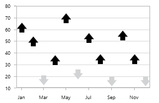

## Custom Charts in WPF (SfChart)

[`CustomTemplate`](https://help.syncfusion.com/cr/wpf/Syncfusion.UI.Xaml.Charts.ColumnSeries.html#Syncfusion_UI_Xaml_Charts_ColumnSeries_CustomTemplate) property is used to customize the chart series. It supports the following series

* BarSeries
* BubbleSeries
* ColumnSeries
* LineSeries
* ScatterSeries
* SplineSeries
* StackingBarSeries
* StackingBar100Series
* StackingColumnSeries
* StackingColumn100Series
* StepLineSeries
* FastLineSeries
* RangeColumnSeries

The respective segment of each series will be your DataTemplate context, which contains the following properties in common. This will be used to plot the custom shapes for the series.

* [`XData`](https://help.syncfusion.com/cr/wpf/Syncfusion.UI.Xaml.Charts.ColumnSegment.html#Syncfusion_UI_Xaml_Charts_ColumnSegment_XData)-Returns the actual X value of the segment.
* [`YData`](https://help.syncfusion.com/cr/wpf/Syncfusion.UI.Xaml.Charts.ColumnSegment.html#Syncfusion_UI_Xaml_Charts_ColumnSegment_YData)-Returns the actual Y value of the segment.
* [`Item`](https://help.syncfusion.com/cr/wpf/Syncfusion.UI.Xaml.Charts.ChartSegment.html#Syncfusion_UI_Xaml_Charts_ChartSegment_Item)-Returns the underlying model object of the segment.
* [`Interior`](https://help.syncfusion.com/cr/wpf/Syncfusion.UI.Xaml.Charts.ChartSegment.html#Syncfusion_UI_Xaml_Charts_ChartSegment_Interior)-Returns the brush color of the segment.

The following code example illustrates the use of [`CustomTemplate`](https://help.syncfusion.com/cr/wpf/Syncfusion.UI.Xaml.Charts.ColumnSeries.html#Syncfusion_UI_Xaml_Charts_ColumnSeries_CustomTemplate) property:





 <syncfusion:SfChart x:Name="chart">

     <syncfusion:SfChart.Resources>

            <local:ScatterInteriorConverter x:Key="scatterInteriorConverter"/>

            <local:ScatterAngleConverter x:Key="scatterAngleConverter"/>

            <DataTemplate x:Key="seriesTemplate">

                <Canvas>

                    <Path Fill="{Binding Converter={StaticResource scatterInteriorConverter}}"
                              
                          Stretch="Fill" Height="{Binding ScatterHeight}"
                              
                          Width="{Binding ScatterWidth}" RenderTransformOrigin="0.5,0.5"
                              
                          Canvas.Left="{Binding RectX}" Canvas.Top="{Binding RectY}"
                              
                          Data="M20.125,32L0.5,12.375L10.3125,12.375L10.3125,
                              
                              0.5L29.9375,0.5L29.9375,12.375L39.75,12.375z">

                          <Path.RenderTransform>

                                <RotateTransform Angle="{Binding Converter={StaticResource scatterAngleConverter}}"/>

                          </Path.RenderTransform>

                        </Path>

                    </Canvas>

                </DataTemplate>

    </syncfusion:SfChart.Resources>

    <syncfusion:ScatterSeries  ScatterHeight="20" ScatterWidth="20" Interior="Gray"
                                       
                                XBindingPath="Year" YBindingPath="Count" 
                                       
                                ItemsSource="{Binding Data}"
                                
                                CustomTemplate="{StaticResource seriesTemplate}"/>

</syncfusion:SfChart>





ScatterSeries series = new ScatterSeries()
{

    ItemsSource = new ViewModel().Data,

    XBindingPath = "Year",

    YBindingPath = "Count",

    ScatterHeight = 20,

    ScatterWidth = 20,

    Interior = new SolidColorBrush(Colors.DarkGray),

    CustomTemplate = chart.Resources["seriesTemplate"] as DataTemplate

};

chart.Series.Add(series);





The BarSeries, BubbleSeries, ColumnSeries, LineSeries, ScatterSeries and StepLineSeries have been customized using the [`CustomTemplate`](https://help.syncfusion.com/cr/wpf/Syncfusion.UI.Xaml.Charts.ColumnSeries.html#Syncfusion_UI_Xaml_Charts_ColumnSeries_CustomTemplate) property. Refer to this [`sample`](https://github.com/SyncfusionExamples/how-to-customize-the-chart-series-in-wpf-sfchart) for complete series CustomTemplate.

## See also

[`How to customize the default shape of any series with the required shapes`](https://www.syncfusion.com/kb/3853/how-to-customize-the-default-shape-of-any-series-with-the-required-shapes)

[`How to create the Tornado Chart in WPF Charts`](https://www.syncfusion.com/kb/11657/how-to-create-the-tornado-chart-in-wpf-charts)