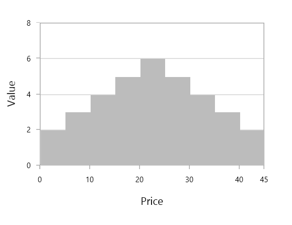

# Distribution charts in WPF Chart (SfChart)

## Histogram 

[`HistogramSeries`](https://help.syncfusion.com/cr/cref_files/wpf/Syncfusion.SfChart.WPF~Syncfusion.UI.Xaml.Charts.HistogramSeries.html#) is one of the seven basic tools of quality control to Visualize the frequency distribution of data over a certain time period. HistogramSeries is often used to plot the density of data.
 
The following code example shows how to add the HistogramSeries:





<chart:HistogramSeries x:Name="histogramSeries" 

HistogramInterval="5" 

Interior="#BCBCBC"

ItemsSource="{Binding Product}"

XBindingPath="Price" 

YBindingPath="Value"/>





HistogramSeries series = new HistogramSeries()
{

    ItemsSource = new ViewModel().Product,

    XBindingPath = "Price",

    YBindingPath = "Value",

    HistogramInterval = 5,

    Interior = new SolidColorBrush(Color.FromRgb(0xBC, 0xBC, 0xBC))

};

chart.Series.Add(series);





You can customize interval using [`HistogramInterval`](https://help.syncfusion.com/cr/cref_files/wpf/Syncfusion.SfChart.WPF~Syncfusion.UI.Xaml.Charts.HistogramSeries~HistogramInterval.html#) property and the normal distribution curve can be collapsed using [`ShowNormalDistributionCurve`](https://help.syncfusion.com/cr/cref_files/wpf/Syncfusion.SfChart.WPF~Syncfusion.UI.Xaml.Charts.HistogramSeries~ShowNormalDistributionCurve.html#).





<chart:HistogramSeries x:Name="histogramSeries" 

HistogramInterval="5"

ShowNormalDistributionCurve="False"

Interior="#BCBCBC"

ItemsSource="{Binding Product}"

XBindingPath="Price" 

YBindingPath="Value"/>





HistogramSeries series = new HistogramSeries()
{

    ItemsSource = new ViewModel().Product,

    XBindingPath = "Price",

    YBindingPath = "Value",

    HistogramInterval = 5,

    ShowNormalDistributionCurve = false,

    Interior = new SolidColorBrush(Color.FromRgb(0xBC, 0xBC, 0xBC))

};

chart.Series.Add(series);





