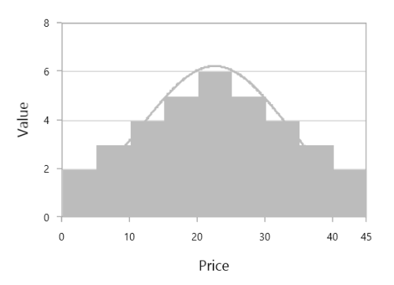
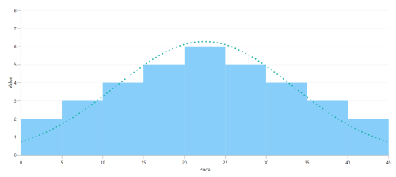

# Histogram in WPF Charts (SfChart)

## Histogram Chart

[`HistogramSeries`](https://help.syncfusion.com/cr/wpf/Syncfusion.UI.Xaml.Charts.HistogramSeries.html#) is one of the seven basic tools of quality control to Visualize the frequency distribution of data over a certain time period. HistogramSeries is often used to plot the density of data.
 
The following code example shows how to add the HistogramSeries:





<chart:HistogramSeries x:Name="histogramSeries" 

HistogramInterval="5" 

Interior="#BCBCBC"

ItemsSource="{Binding Product}"

XBindingPath="Price" 

YBindingPath="Value"/>





HistogramSeries series = new HistogramSeries()
{

    ItemsSource = new ViewModel().Product,

    XBindingPath = "Price",

    YBindingPath = "Value",

    HistogramInterval = 5,

    Interior = new SolidColorBrush(Color.FromRgb(0xBC, 0xBC, 0xBC))

};

chart.Series.Add(series);





You can customize interval using [`HistogramInterval`](https://help.syncfusion.com/cr/wpf/Syncfusion.UI.Xaml.Charts.HistogramSeries.html#Syncfusion_UI_Xaml_Charts_HistogramSeries_HistogramInterval) property and the normal distribution curve can be collapsed using [`ShowNormalDistributionCurve`](https://help.syncfusion.com/cr/wpf/Syncfusion.UI.Xaml.Charts.HistogramSeries.html#Syncfusion_UI_Xaml_Charts_HistogramSeries_ShowNormalDistributionCurve).





<chart:HistogramSeries x:Name="histogramSeries" 

HistogramInterval="5"

ShowNormalDistributionCurve="False"

Interior="#BCBCBC"

ItemsSource="{Binding Product}"

XBindingPath="Price" 

YBindingPath="Value"/>





HistogramSeries series = new HistogramSeries()
{

    ItemsSource = new ViewModel().Product,

    XBindingPath = "Price",

    YBindingPath = "Value",

    HistogramInterval = 5,

    ShowNormalDistributionCurve = false,

    Interior = new SolidColorBrush(Color.FromRgb(0xBC, 0xBC, 0xBC))

};

chart.Series.Add(series);





**CurveLineStyle**

You can customize the normal distribution curve by using the [`CurveLineStyle`](https://help.syncfusion.com/cr/wpf/Syncfusion.UI.Xaml.Charts.HistogramSeries.html#Syncfusion_UI_Xaml_Charts_HistogramSeries_CurveLineStyle) property.




...

...

<chart:HistogramSeries x:Name="histogramSeries" 

HistogramInterval="5"

ShowNormalDistributionCurve="True"

CurveLineStyle="{StaticResource CurveColorStyle}"

Interior="LightSkyBlue"

ItemsSource="{Binding Product}"

XBindingPath="Price" 

YBindingPath="Value"/>





...
HistogramSeries series = new HistogramSeries()
{

    ItemsSource = new ViewModel().Product,

    XBindingPath = "Price",

    YBindingPath = "Value",

    HistogramInterval = 5,

    ShowNormalDistributionCurve = True,

    CurveLineStyle = histogramChart.Resources["CurveColorStyle"] as Style,

    Interior = new SolidColorBrush(new SolidColorBrush(Colors.LightSkyBlue))

};

chart.Series.Add(series);





N> You can explore our [WPF Histogram Chart](https://www.syncfusion.com/wpf-controls/charts/wpf-histogram-chart) feature tour page for its groundbreaking features. You can also explore our [WPF Histogram Chart example](https://github.com/syncfusion/wpf-demos/blob/master/chart/Views/Other%20Charts/Histogram.xaml) to know how to represent time-dependent data, showing trends in data at equal intervals.