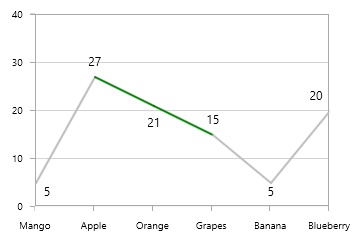
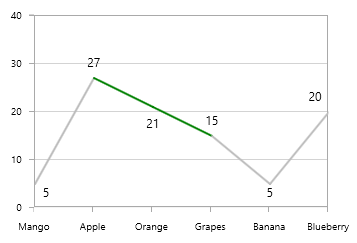

# Empty Points in WPF Chart (SfChart)

The data collection that is passed to the chart can have NaN or Null values that are considered as empty points. The empty point can be defined as in the below code example.



    Fruits.Add(new Model() { FruitName = "Mango", People = 5 });
    Fruits.Add(new Model() { FruitName = "Apple", People = 27 });
    Fruits.Add(new Model() { FruitName = "Orange", People = Double.NaN });
    Fruits.Add(new Model() { FruitName = "Grapes", People = 15 });
    Fruits.Add(new Model() { FruitName = "Banana", People = 5 });
    Fruits.Add(new Model() { FruitName = "Blueberry", People = 20 });



By default, ShowEmptyPoints property is false. So the empty points will not be render as in below screenshots:

## Display Empty Points

You can show these empty points by setting the [`ShowEmptyPoints`](https://help.syncfusion.com/cr/wpf/Syncfusion.UI.Xaml.Charts.ChartSeriesBase.html#Syncfusion_UI_Xaml_Charts_ChartSeriesBase_ShowEmptyPoints) property as True. So we need to define the value for this empty points and that can be defined using [`EmptyPointValue`](https://help.syncfusion.com/cr/wpf/Syncfusion.UI.Xaml.Charts.ChartSeriesBase.html#Syncfusion_UI_Xaml_Charts_ChartSeriesBase_EmptyPointValue) property.

This is an enum property having the following values: 

* [`Zero`](https://help.syncfusion.com/cr/wpf/Syncfusion.UI.Xaml.Charts.EmptyPointValue.html) - Replace all the empty points with zero (0), this is the default value.
* [`Average`](https://help.syncfusion.com/cr/wpf/Syncfusion.UI.Xaml.Charts.EmptyPointValue.html) - Replace all the empty points with average value.

The following code examples shows how to display the empty points:





    <chart:LineSeries XBindingPath="FruitName" Interior="#BCBCBC" YBindingPath="People" 

    ShowEmptyPoints="True" ItemsSource="{Binding Fruits}" >

        <chart:LineSeries.AdornmentsInfo>

            <chart:ChartAdornmentInfo ShowLabel="True" LabelPosition="Auto"/>

        </chart:LineSeries.AdornmentsInfo>

    </chart:LineSeries>





    LineSeries series = new LineSeries()
    {   
        ItemsSource = new ViewModel().Fruits,
        XBindingPath = "FruitName",
        YBindingPath = "People",
        ShowEmptyPoints = true,
        Interior = new SolidColorBrush(Color.FromRgb(0xBC, 0xBC, 0xBC))
    };

    ChartAdornmentInfo adornmentInfo = new ChartAdornmentInfo()
    {
        ShowLabel = true,
        LabelPosition = AdornmentsLabelPosition.Auto
    };

    series.AdornmentsInfo = adornmentInfo;

    chart.Series.Add(series);





Since the [`EmptyPointValue`](https://help.syncfusion.com/cr/wpf/Syncfusion.UI.Xaml.Charts.ChartSeriesBase.html#Syncfusion_UI_Xaml_Charts_ChartSeriesBase_EmptyPointValue) as Zero by default, it will draw a line to 0 when we set [`ShowEmptyPoint`](https://help.syncfusion.com/cr/wpf/Syncfusion.UI.Xaml.Charts.ChartSeriesBase.html#Syncfusion_UI_Xaml_Charts_ChartSeriesBase_ShowEmptyPoints) as True.

The following code example shows the [`EmptyPointValue`](https://help.syncfusion.com/cr/wpf/Syncfusion.UI.Xaml.Charts.ChartSeriesBase.html#Syncfusion_UI_Xaml_Charts_ChartSeriesBase_EmptyPointValue) as Average:





    <chart:LineSeries XBindingPath="FruitName" Interior="#BCBCBC" YBindingPath="People" 

    ShowEmptyPoints="True" EmptyPointValue="Average" ItemsSource="{Binding Fruits}" >

        <chart:LineSeries.AdornmentsInfo>

            <chart:ChartAdornmentInfo ShowLabel="True" LabelPosition="Auto"/>

        </chart:LineSeries.AdornmentsInfo>

    </chart:LineSeries>





    LineSeries series = new LineSeries()
    {
        ItemsSource = new ViewModel().Fruits,
        XBindingPath = "FruitName",
        YBindingPath = "People",
        ShowEmptyPoints = true,
        EmptyPointValue = EmptyPointValue.Average,
        Interior = new SolidColorBrush(Color.FromRgb(0xBC, 0xBC, 0xBC))
    };

    ChartAdornmentInfo adornmentInfo = new ChartAdornmentInfo()
    {
        ShowLabel = true,
        LabelPosition = AdornmentsLabelPosition.Auto
    };

    series.AdornmentsInfo = adornmentInfo;
    chart.Series.Add(series);





## Customizing Empty Points

You can customize the empty points using [`EmptyPointStyle`](https://help.syncfusion.com/cr/wpf/Syncfusion.UI.Xaml.Charts.ChartSeriesBase.html#Syncfusion_UI_Xaml_Charts_ChartSeriesBase_EmptyPointStyle) property. The following are the values of EmptyPointStyle:

* [`Interior`](https://help.syncfusion.com/cr/wpf/Syncfusion.UI.Xaml.Charts.EmptyPointStyle.html) - Used to define the custom brush for the empty points.
* [`Symbol`](https://help.syncfusion.com/cr/wpf/Syncfusion.UI.Xaml.Charts.EmptyPointStyle.html) - Used to add symbols for the empty points.
* [`SymbolAndInterior`](https://help.syncfusion.com/cr/wpf/Syncfusion.UI.Xaml.Charts.EmptyPointStyle.html) - This is similar to Symbol, which includes empty point brush also.

**Interior**

This option fills an interior indicating the empty points and this custom brush can be defined using the [`EmptyPointInterior`](https://help.syncfusion.com/cr/wpf/Syncfusion.UI.Xaml.Charts.ChartSeriesBase.html#Syncfusion_UI_Xaml_Charts_ChartSeriesBase_EmptyPointInterior) property.

The following code example illustrates the use of [`EmptyPointStyle`](https://help.syncfusion.com/cr/wpf/Syncfusion.UI.Xaml.Charts.ChartSeriesBase.html#Syncfusion_UI_Xaml_Charts_ChartSeriesBase_EmptyPointStyle) and [`EmptyPointInterior`](https://help.syncfusion.com/cr/wpf/Syncfusion.UI.Xaml.Charts.ChartSeriesBase.html#Syncfusion_UI_Xaml_Charts_ChartSeriesBase_EmptyPointInterior):





    <chart:ColumnSeries  ItemsSource="{Binding EmptyPointDatas}" Interior="#bcbcbc" XBindingPath="Category" 

     YBindingPath="Value" ShowEmptyPoints="True"/>





    ColumnSeries series = new ColumnSeries()
    {
        ItemsSource = new ViewModel().EmptyPointDatas,
        XBindingPath = "Category",
        YBindingPath = "Value",
        ShowEmptyPoints = true,
        Interior = new SolidColorBrush(Color.FromRgb(0xBC, 0xBC, 0xBC))
    };

    chart.Series.Add(series);





N> This is the default value for [`EmptyPointStyle`](https://help.syncfusion.com/cr/wpf/Syncfusion.UI.Xaml.Charts.ChartSeriesBase.html#Syncfusion_UI_Xaml_Charts_ChartSeriesBase_EmptyPointStyle). So when you enable empty points using [`ShowEmptyPoints`](https://help.syncfusion.com/cr/wpf/Syncfusion.UI.Xaml.Charts.ChartSeriesBase.html#Syncfusion_UI_Xaml_Charts_ChartSeriesBase_ShowEmptyPoints) , empty point segment render with this [`EmptyPointInterior`](https://help.syncfusion.com/cr/wpf/Syncfusion.UI.Xaml.Charts.ChartSeriesBase.html#Syncfusion_UI_Xaml_Charts_ChartSeriesBase_EmptyPointInterior).

**Symbol**

This option is used to add Symbol for the empty points as in the below code example.





    <chart:LineSeries XBindingPath="FruitName" Interior="#BCBCBC" YBindingPath="People" 

    ShowEmptyPoints="True" EmptyPointValue="Average" EmptyPointStyle="Symbol" ItemsSource="{Binding Fruits}" >

        <chart:LineSeries.AdornmentsInfo>

            <chart:ChartAdornmentInfo ShowLabel="True" LabelPosition="Auto"/>

        </chart:LineSeries.AdornmentsInfo>

    </chart:LineSeries>





    LineSeries series = new LineSeries()
    {
        ItemsSource = new ViewModel().Fruits,
        XBindingPath = "FruitName",
        YBindingPath = "People",
        ShowEmptyPoints = true,
        EmptyPointValue = EmptyPointValue.Average,
        EmptyPointStyle = EmptyPointStyle.Symbol,
        Interior = new SolidColorBrush(Color.FromRgb(0xBC, 0xBC, 0xBC))
    };

    ChartAdornmentInfo adornmentInfo = new ChartAdornmentInfo()
    {
        ShowLabel = true,
        LabelPosition = AdornmentsLabelPosition.Auto
    };

    series.AdornmentsInfo = adornmentInfo;

    chart.Series.Add(series);





**Symbol and Interior**

This option combines above two options, which draw a symbol with defined [`EmptyPointInterior`](https://help.syncfusion.com/cr/wpf/Syncfusion.UI.Xaml.Charts.ChartSeriesBase.html#Syncfusion_UI_Xaml_Charts_ChartSeriesBase_EmptyPointInterior). The following code example shows the use of this value.





    <chart:LineSeries XBindingPath="FruitName" Interior="#BCBCBC" YBindingPath="People" 

    ShowEmptyPoints="True" EmptyPointValue="Average" EmptyPointStyle="SymbolAndInterior"

    EmptyPointInterior="Red" ItemsSource="{Binding Fruits}" >

        <chart:LineSeries.AdornmentsInfo>

            <chart:ChartAdornmentInfo ShowLabel="True" LabelPosition="Auto"/>

        </chart:LineSeries.AdornmentsInfo>

    </chart:LineSeries>





    LineSeries series = new LineSeries()
    {
        ItemsSource = new ViewModel().Fruits,
        XBindingPath = "FruitName",
        YBindingPath = "People",
        ShowEmptyPoints = true,
        EmptyPointValue = EmptyPointValue.Average,
        EmptyPointStyle = EmptyPointStyle.SymbolAndInterior,
        EmptyPointInterior = new SolidColorBrush(Colors.Red),
        Interior = new SolidColorBrush(Color.FromRgb(0xBC, 0xBC, 0xBC))
    };

    ChartAdornmentInfo adornmentInfo = new ChartAdornmentInfo()
    {
        ShowLabel = true,
        LabelPosition = AdornmentsLabelPosition.Auto
    };

series.AdornmentsInfo = adornmentInfo;
chart.Series.Add(series);





**Custom Symbol**

You can add any custom shape for the empty point symbol. The following code example shows how to add your custom shapes:





 <syncfusion:SfChart x:Name="chart">
    <syncfusion:SfChart.Resources>
        <DataTemplate x:Key="symbolTemplate">
            <Canvas>
                        <Grid Canvas.Left="{Binding X}" Canvas.Top="{Binding Y}" >
                            <Ellipse StrokeDashArray="1,1" Height="50"                                      
                                     Width="50" Stroke="Gray" StrokeThickness="2"                                      
                                     Margin="-15,-15,0,0" Fill="Transparent"/>

                            <Ellipse  StrokeDashArray="1,3" Height="35" Width="35"                                      
                                      Stroke="Gray" StrokeThickness="2" Margin="-15,-15,0,0"                                      
                                      Fill="LightGray"/>
                        </Grid>
             </Canvas>
        </DataTemplate>
     </syncfusion:SfChart.Resources>

    <syncfusion:LineSeries XBindingPath="XValue" Interior="#BCBCBC"                                    
                           YBindingPath="YValue" ShowEmptyPoints="True"                                       
                           EmptyPointValue="Average" EmptyPointStyle="Symbol"                                   
                           EmptyPointInterior="Red" ItemsSource="{Binding Data}"                                   
                           EmptyPointSymbolTemplate="{StaticResource symbolTemplate}"/>

</syncfusion:SfChart>





    LineSeries series = new LineSeries()
    {

        ItemsSource = new ViewModel().Fruits,
        XBindingPath = "FruitName",
        YBindingPath = "People",
        Interior = new SolidColorBrush(Color.FromRgb(0xBC, 0xBC, 0xBC)),
        ShowEmptyPoints = true,
        EmptyPointValue = EmptyPointValue.Average,
        EmptyPointStyle = EmptyPointStyle.Symbol,
        EmptyPointInterior =new SolidColorBrush(Colors.Red),
        EmptyPointSymbolTemplate = chart.Resources["symbolTemplate"] as DataTemplate

    };

chart.Series.Add(series);





## EmptyPoints and Series

The following section illustrates few chart types and its behavior with EmptyPoints.

**ColumnSeries** **with** **EmptyPoint** **as** **Average**

**SplineSeries** **with** **EmptyPoint** **as** **Average**

**Accumulation** **Series** **with** **EmptyPoint** **as** **Average**

