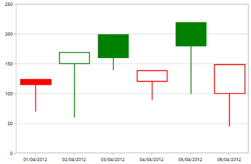
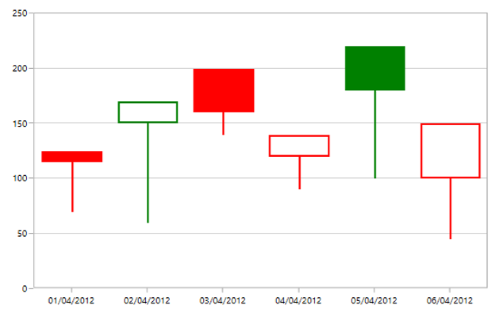

# Financial in WPF Charts (SfChart)

The APIs present in the financial series are,

* [`High`](https://help.syncfusion.com/cr/wpf/Syncfusion.UI.Xaml.Charts.FinancialSeriesBase.html#Syncfusion_UI_Xaml_Charts_FinancialSeriesBase_High)-Gets or sets the string that describes high value in Y-axis.
* [`Low`](https://help.syncfusion.com/cr/wpf/Syncfusion.UI.Xaml.Charts.FinancialSeriesBase.html#Syncfusion_UI_Xaml_Charts_FinancialSeriesBase_Low)- Gets or sets the string that describes low value in Y-axis.
* [`Open`](https://help.syncfusion.com/cr/wpf/Syncfusion.UI.Xaml.Charts.FinancialSeriesBase.html#Syncfusion_UI_Xaml_Charts_FinancialSeriesBase_Open)-Gets or sets the string that describes open value in Y-axis.
* [`Close`](https://help.syncfusion.com/cr/wpf/Syncfusion.UI.Xaml.Charts.FinancialSeriesBase.html#Syncfusion_UI_Xaml_Charts_FinancialSeriesBase_Close)- Gets or sets the string that describes close value in Y-axis.
* [`BearFillColor`](https://help.syncfusion.com/cr/wpf/Syncfusion.UI.Xaml.Charts.FinancialSeriesBase.html#Syncfusion_UI_Xaml_Charts_FinancialSeriesBase_BearFillColor)-Represents the brush color for the segments that show stock price has gone up in measured time interval.
* [`BullFillColor`](https://help.syncfusion.com/cr/wpf/Syncfusion.UI.Xaml.Charts.FinancialSeriesBase.html#Syncfusion_UI_Xaml_Charts_FinancialSeriesBase_BullFillColor)-Represents that brush color for the segments that show stock price has gone down in measured time interval.
* [`ComparisonMode`](https://help.syncfusion.com/cr/wpf/Syncfusion.UI.Xaml.Charts.FinancialSeriesBase.html#Syncfusion_UI_Xaml_Charts_FinancialSeriesBase_ComparisonMode) - Specifies which price need to be considered for the formation from [`High`](https://help.syncfusion.com/cr/wpf/Syncfusion.UI.Xaml.Charts.FinancialPrice.html), [`Low`](https://help.syncfusion.com/cr/wpf/Syncfusion.UI.Xaml.Charts.FinancialPrice.html), [`Open`](https://help.syncfusion.com/cr/wpf/Syncfusion.UI.Xaml.Charts.FinancialPrice.html), [`Close`](https://help.syncfusion.com/cr/wpf/Syncfusion.UI.Xaml.Charts.FinancialPrice.html) or [`None`](https://help.syncfusion.com/cr/wpf/Syncfusion.UI.Xaml.Charts.FinancialPrice.html) financial price.

## OHLC Chart

[`HiLoOpenCloseSeries`](https://help.syncfusion.com/cr/wpf/Syncfusion.UI.Xaml.Charts.HiLoOpenCloseSeries.html#) displays each data point as a group of horizontal and one vertical line. The values for this series can be binded using [`High`](https://help.syncfusion.com/cr/wpf/Syncfusion.UI.Xaml.Charts.FinancialSeriesBase.html#Syncfusion_UI_Xaml_Charts_FinancialSeriesBase_High#), [`Low`](https://help.syncfusion.com/cr/wpf/Syncfusion.UI.Xaml.Charts.FinancialSeriesBase.html#Syncfusion_UI_Xaml_Charts_FinancialSeriesBase_Low#), [`Open`](https://help.syncfusion.com/cr/wpf/Syncfusion.UI.Xaml.Charts.FinancialSeriesBase.html#Syncfusion_UI_Xaml_Charts_FinancialSeriesBase_Open#) and [`Close`](https://help.syncfusion.com/cr/wpf/Syncfusion.UI.Xaml.Charts.FinancialSeriesBase.html#Syncfusion_UI_Xaml_Charts_FinancialSeriesBase_Close#) property.

The following code example shows how to use OHLC series:





<chart:HiLoOpenCloseSeries Name="series" ItemsSource="{Binding StockPriceDetails}" 

XBindingPath="Date"  High="High" Low="Low"                         

Interior="#4A4A4A"

Open="Open" Close="Close" 

Label="HiloOpenClose" />





HiLoOpenCloseSeries series = new HiLoOpenCloseSeries()
{

    ItemsSource = new ViewModel().StockPriceDetails,

    XBindingPath = "Date",

    High = "High", Low = "Low",

    Open = "Open", Close = "Close",

    Interior = new SolidColorBrush(Color.FromRgb(0x4A, 0x4A, 0X4A))

};

chart.Series.Add(series);





## Candle Chart

[`CandleSeries`](https://help.syncfusion.com/cr/wpf/Syncfusion.UI.Xaml.Charts.CandleSeries.html#) displays each data point as a combination of a vertical column and a vertical line. This series is most widely used in decision making places, like the stock market.

The values for this series can be bind using [`High`](https://help.syncfusion.com/cr/wpf/Syncfusion.UI.Xaml.Charts.FinancialSeriesBase.html#Syncfusion_UI_Xaml_Charts_FinancialSeriesBase_High#), [`Low`](https://help.syncfusion.com/cr/wpf/Syncfusion.UI.Xaml.Charts.FinancialSeriesBase.html#Syncfusion_UI_Xaml_Charts_FinancialSeriesBase_Low#), [`Open`](https://help.syncfusion.com/cr/wpf/Syncfusion.UI.Xaml.Charts.FinancialSeriesBase.html#Syncfusion_UI_Xaml_Charts_FinancialSeriesBase_Open#) and [`Close`](https://help.syncfusion.com/cr/wpf/Syncfusion.UI.Xaml.Charts.FinancialSeriesBase.html#Syncfusion_UI_Xaml_Charts_FinancialSeriesBase_Close#) property and the following code example shows the usage of candle series.





<chart:CandleSeries Name="series" ItemsSource="{Binding StockPriceDetails}" 

XBindingPath="Date"  High="High" Open="Open"  

Close="Close" Low="Low"  

Interior="#4A4A4A"/>





CandleSeries series = new CandleSeries()
{

    ItemsSource = new ViewModel().StockPriceDetails,

    XBindingPath = "Date",

    High = "High", Low = "Low",

    Open = "Open", Close = "Close",

    Interior = new SolidColorBrush(Color.FromRgb(0x4A, 0x4A, 0X4A))

};

chart.Series.Add(series);









<chart:CandleSeries Name="series" ItemsSource="{Binding StockPriceDetails}" XBindingPath="Date"   
                    High="High" Open="Open"  Close="Close" Low="Low"  BearFillColor="Black"
                    BullFillColor="#BCBCBC"/>
   



CandleSeries series = new CandleSeries()
{

    ItemsSource = new ViewModel().StockPriceDetails,

    XBindingPath = "Date",

    High = "High", Low = "Low",

    Open = "Open", Close = "Close",

    BearFillColor = new SolidColorBrush(Colors.Black),

    BullFillColor = new SolidColorBrush(Color.FromRgb(0xBC, 0xBC, 0XBC))

};

chart.Series.Add(series);



               

## Comparison Modes

[`ComparisonMode`](https://help.syncfusion.com/cr/wpf/Syncfusion.UI.Xaml.Charts.FinancialSeriesBase.html#Syncfusion_UI_Xaml_Charts_FinancialSeriesBase_ComparisonModeProperty) property of [`FinancialSeries`](https://help.syncfusion.com/cr/wpf/Syncfusion.UI.Xaml.Charts.FinancialSeriesBase.html) is used to compare the current (High, Low, Open, and Close) values with previous (High, Low, Open, and Close) values in the series data points. 
By default, the `ComparisonMode` value is none.

**Comparing the open values**

While setting the [`ComparisonMode`](https://help.syncfusion.com/cr/wpf/Syncfusion.UI.Xaml.Charts.FinancialSeriesBase.html#Syncfusion_UI_Xaml_Charts_FinancialSeriesBase_ComparisonModeProperty) value as `Open`, the open value of current segment will be compared to open value of previous segment.





<syncfusion:CandleSeries ComparisonMode="Open">

</syncfusion:CandleSeries>

   



CandleSeries series = new CandleSeries();

series.ComparisonMode = Syncfusion.UI.Xaml.Charts.FinancialPrice.Open;



     

In the above screenshot, the second segment’s Open value is greater than the first segment’s open value. So, the stroke color is filled with bull fill color.

**Comparing the close values**

While setting the [`ComparisonMode`](https://help.syncfusion.com/cr/wpf/Syncfusion.UI.Xaml.Charts.FinancialSeriesBase.html#Syncfusion_UI_Xaml_Charts_FinancialSeriesBase_ComparisonModeProperty) value as `Close`, the close value of current segment will be compared to the close value of previous segment.





<syncfusion:CandleSeries ComparisonMode="Close">

</syncfusion:CandleSeries>

   



CandleSeries series = new CandleSeries();

series.ComparisonMode = Syncfusion.UI.Xaml.Charts.FinancialPrice.Close;



   

 In the above screenshot, the second segment’s close value is greater than the first segment’s close value. So, the stroke color is filled with bull fill color.

**Comparing the high values**

While setting the [`ComparisonMode`](https://help.syncfusion.com/cr/wpf/Syncfusion.UI.Xaml.Charts.FinancialSeriesBase.html#Syncfusion_UI_Xaml_Charts_FinancialSeriesBase_ComparisonModeProperty) value as `High`, the high value of current segment will be compared to the high value of previous segment.





<syncfusion:CandleSeries ComparisonMode="High">

</syncfusion:CandleSeries>

   



CandleSeries series = new CandleSeries();

series.ComparisonMode = Syncfusion.UI.Xaml.Charts.FinancialPrice.High;



   

 In the above screenshot, the second segment’s high value is less than the first segment’s high value. So, the stroke color is filled with bear fill color.

 **Comparing the low values**

 While setting the [`ComparisonMode`](https://help.syncfusion.com/cr/wpf/Syncfusion.UI.Xaml.Charts.FinancialSeriesBase.html#Syncfusion_UI_Xaml_Charts_FinancialSeriesBase_ComparisonModeProperty) value as `Low`, the low value of current segment will be compared to the low value of previous segment.

 



<syncfusion:CandleSeries ComparisonMode="Low">

</syncfusion:CandleSeries>

   



CandleSeries series = new CandleSeries();

series.ComparisonMode = Syncfusion.UI.Xaml.Charts.FinancialPrice.Low;



   

In the above screenshot, the second segment’s low value is greater than the first segment’s low value. So, the stroke color filled with bull fill color.
