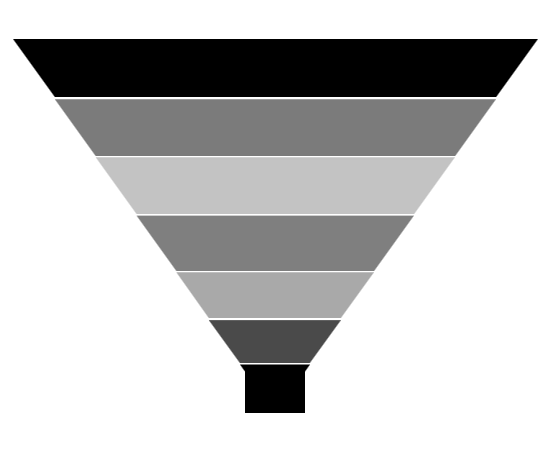
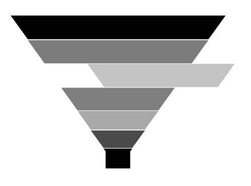

# Funnel and Pyramid in WPF Charts (SfChart)

## Pyramid Chart

PyramidSeries has the form of a triangle with lines dividing it into sections and each section has a different width. Depending on the Y co-ordinates, this width indicates a level of hierarchy among other categories.





<chart:PyramidSeries XBindingPath="Category" 

ItemsSource="{Binding Tax}"       

YBindingPath="Percentage"/>





PyramidSeries series = new PyramidSeries()
{

    ItemsSource = new ViewModel().Tax,

    XBindingPath = "Category",

    YBindingPath = "Percentage"

};

chart.Series.Add(series);





The [`PyramidMode`](https://help.syncfusion.com/cr/wpf/Syncfusion.UI.Xaml.Charts.PyramidSeries.html#Syncfusion_UI_Xaml_Charts_PyramidSeries_PyramidMode) is used to define the rendering mode such as [`Surface`](https://help.syncfusion.com/cr/wpf/Syncfusion.UI.Xaml.Charts.ChartPyramidMode.html) or [`Linear`](https://help.syncfusion.com/cr/wpf/Syncfusion.UI.Xaml.Charts.ChartPyramidMode.html) pyramid segments.

**PyramidMode** **as** **Surface**





<chart:PyramidSeries XBindingPath="Category" 

PyramidMode="Surface"

ItemsSource="{Binding Tax}"        

YBindingPath="Percentage"/>





PyramidSeries series = new PyramidSeries()
{

    ItemsSource = new ViewModel().Tax,

    XBindingPath = "Category",

    YBindingPath = "Percentage",

    PyramidMode = ChartPyramidMode.Surface

};

chart.Series.Add(series);





**PyramidMode** **as** **Linear**





<chart:PyramidSeries XBindingPath="Category" 

PyramidMode="Linear"

ItemsSource="{Binding Tax}"          

YBindingPath="Percentage"/>





PyramidSeries series = new PyramidSeries()
{

    ItemsSource = new ViewModel().Tax,

    XBindingPath = "Category",

    YBindingPath = "Percentage",

    PyramidMode = ChartPyramidMode.Linear

};

chart.Series.Add(series);





N> You can explore our [WPF Pyramid Chart](https://www.syncfusion.com/wpf-controls/charts/wpf-pyramid-chart) feature tour page for its groundbreaking features.You can also explore our [WPF Pyramid Chart example](https://github.com/syncfusion/wpf-demos/blob/master/chart/Views/Funnel%20and%20Pyramid%20Chart/PyramidChart.xaml) to know how to represent time-dependent data, showing trends in data at equal intervals.

## Funnel Chart

FunnelSeries is similar to PyramidSeries, displays data in a funnel shape that equals to 100% when totaled. It is a single series, representing data as portions of 100% and does not use any axes. 

The following code example shows how to use the funnel series:





<chart:FunnelSeries XBindingPath="Category" ItemsSource="{Binding list}"  

YBindingPath="Percentage" />





FunnelSeries series = new FunnelSeries()
{

    ItemsSource = new ViewModel().List,

    XBindingPath = "Category",

    YBindingPath = "Percentage",

};

chart.Series.Add(series);





### Funnel Mode

The [`FunnelMode`](https://help.syncfusion.com/cr/wpf/Syncfusion.UI.Xaml.Charts.FunnelSeries.html#Syncfusion_UI_Xaml_Charts_FunnelSeries_FunnelMode) defines a rendering mode for the funnel series which define, where to bind your values (to height or width). The following example demonstrates [`ValueIsHeight`](https://help.syncfusion.com/cr/wpf/Syncfusion.UI.Xaml.Charts.ChartFunnelMode.html) and [`ValueIsWidth`](https://help.syncfusion.com/cr/wpf/Syncfusion.UI.Xaml.Charts.ChartFunnelMode.html) funnel mode:

**ValueIsHeight**





<chart:FunnelSeries XBindingPath="Category" ItemsSource="{Binding list}"    

FunnelMode="ValueIsHeight" 

YBindingPath="Percentage"/>





FunnelSeries series = new FunnelSeries()
{

    ItemsSource = new ViewModel().List,

    XBindingPath = "Category",

    YBindingPath = "Percentage",

    FunnelMode = ChartFunnelMode.ValueIsHeight

};

chart.Series.Add(series);





**ValueIsWidth**





<chart:FunnelSeries XBindingPath="Category" ItemsSource="{Binding list}"    

FunnelMode="ValueIsWidth" 

YBindingPath="Percentage" />





FunnelSeries series = new FunnelSeries()
{

    ItemsSource = new ViewModel().List,

    XBindingPath = "Category",

    YBindingPath = "Percentage",

    FunnelMode = ChartFunnelMode.ValueIsWidth

};

chart.Series.Add(series);





### Explode Segments

The following properties are used to explode the individual segments in Funnel and Pyramid.

* [`ExplodeAll`](https://help.syncfusion.com/cr/wpf/Syncfusion.UI.Xaml.Charts.AccumulationSeriesBase.html#Syncfusion_UI_Xaml_Charts_AccumulationSeriesBase_ExplodeAll) - Used to explode all the segments of these series.
* [`ExplodeIndex`](https://help.syncfusion.com/cr/wpf/Syncfusion.UI.Xaml.Charts.AccumulationSeriesBase.html#Syncfusion_UI_Xaml_Charts_AccumulationSeriesBase_ExplodeIndex) - Used to explode any specific segment.
* [`ExplodeOffset`](https://help.syncfusion.com/cr/wpf/Syncfusion.UI.Xaml.Charts.TriangularSeriesBase.html#Syncfusion_UI_Xaml_Charts_TriangularSeriesBase_ExplodeOffset)- Used to define the explode distance like ExplodeRadius for Pie.
* [`ExplodeOnMouseClick`](https://help.syncfusion.com/cr/wpf/Syncfusion.UI.Xaml.Charts.AccumulationSeriesBase.html#Syncfusion_UI_Xaml_Charts_AccumulationSeriesBase_ExplodeOnMouseClick)-Used to explode the segment when segment is clicked.

**Explode** **Offset**





<chart:FunnelSeries XBindingPath="Category" ItemsSource="{Binding list}"   

ExplodeIndex="4"  ExplodeOffset="70" YBindingPath="Percentage">

</chart:FunnelSeries>





FunnelSeries series = new FunnelSeries()
{

    ItemsSource = new ViewModel().List,

    XBindingPath = "Category",

    YBindingPath = "Percentage",

    ExplodeIndex = 4,

    ExplodeOffset = 70

};

chart.Series.Add(series);





**Gap** **Ratio**

The gap between each segment using [`GapRatio`](https://help.syncfusion.com/cr/wpf/Syncfusion.UI.Xaml.Charts.TriangularSeriesBase.html#Syncfusion_UI_Xaml_Charts_TriangularSeriesBase_GapRatio) property as in the following code example.





<chart:FunnelSeries XBindingPath="Category" ItemsSource="{Binding list}"     

GapRatio="0.5" YBindingPath="Percentage">

</chart:FunnelSeries>





FunnelSeries series = new FunnelSeries()
{

    ItemsSource = new ViewModel().List,

    XBindingPath = "Category",

    YBindingPath = "Percentage",

    GapRatio = 0.5

};

chart.Series.Add(series);





## See also

[`How to add gaps between segments in a pyramid or funnel series`](https://www.syncfusion.com/kb/2708/how-to-add-gaps-between-segments-in-a-pyramid-or-funnel-series)
