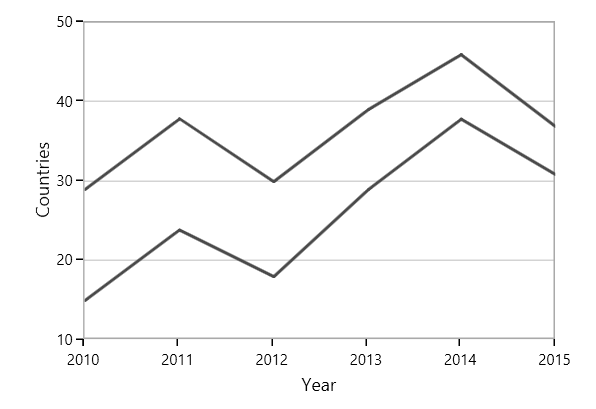

# Line and StepLine Chart in WPF Charts (SfChart)

## Line Chart

Line series join points on a plot by straight lines, showing data trends at equal intervals. The following code example explains how to create a simple [`LineSeries`](https://help.syncfusion.com/cr/wpf/Syncfusion.UI.Xaml.Charts.LineSeries.html#) using given data





<chart:LineSeries  XBindingPath="Year

ItemsSource="{Binding List}" YBindingPath="India"               

Interior="#4A4A4A"/>

<chart:LineSeries  XBindingPath="Year"     

ItemsSource="{Binding List}" YBindingPath="America"               

Interior="#4A4A4A"/>





LineSeries series1 = new LineSeries()
{

    ItemsSource = new ViewModel().List,

    XBindingPath = "Year",

    YBindingPath = "India",

    Interior = new SolidColorBrush(Color.FromRgb(0x4A, 0x4A, 0x4A))

};

LineSeries series2 = new LineSeries()
{

    ItemsSource = new ViewModel().List,

    XBindingPath = "Year",

    YBindingPath = "America",

    Interior = new SolidColorBrush(Color.FromRgb(0x4A, 0x4A, 0x4A))

};

chart.Series.Add(series1);

chart.Series.Add(series2);





## Step Line Chart

[`StepLineSeries`](https://help.syncfusion.com/cr/wpf/Syncfusion.UI.Xaml.Charts.StepLineSeries.html) plots horizontal and vertical lines to connect data points resulting in a step line progression. The following code illustrates how to initialize the [`StepLineSeries`](https://help.syncfusion.com/cr/wpf/Syncfusion.UI.Xaml.Charts.StepLineSeries.html) in chart.





<chart:StepLineSeries ItemsSource="{Binding Data}"  
                      
                      XBindingPath="XValue" 
                      
                      YBindingPath="YValue">
            
 </chart:StepLineSeries>





StepLineSeries stepLine = new StepLineSeries();

stepLine.ItemsSource = new ViewModel().Data;

stepLine.XBindingPath = "XValue";

stepLine.YBindingPath = "YValue";

SteplineChart.Series.Add(stepLine);





## See also

[`How to remove the blended color effect in multiple line series of Chart`](https://www.syncfusion.com/kb/10463/how-to-remove-the-blended-color-effect-in-multiple-line-series-of-sfchart)

[`Comparison between line series and fast line series`](https://www.syncfusion.com/kb/6609/comparison-between-line-series-and-fast-line-series)

[`How to bind the array property in Chart`](https://www.syncfusion.com/kb/4923/how-to-bind-the-array-property-in-sfchart)

[`How to draw dotted line using line series in Chart`](https://www.syncfusion.com/kb/2550/how-to-draw-dotted-line-using-line-series-in-sfchart)
