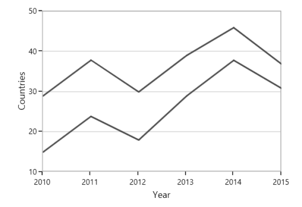
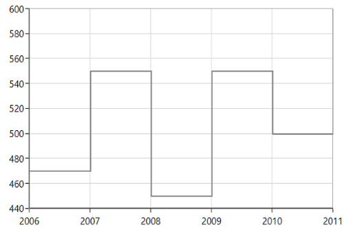

# Line and StepLine in WPF Charts

## Line Chart

Line series join points on a plot by straight lines, showing data trends at equal intervals. The following code example explains how to create a simple [`LineSeries`](https://help.syncfusion.com/cr/wpf/Syncfusion.UI.Xaml.Charts.LineSeries.html#) using given data





<chart:LineSeries  
    XBindingPath="Year"
    ItemsSource="{Binding List}" 
    YBindingPath="India"               
    Interior="#4A4A4A"/>
<chart:LineSeries                     
    XBindingPath="Year"     
    ItemsSource="{Binding List}" 
    YBindingPath="America"               
    Interior="#4A4A4A"/>





LineSeries series1 = new LineSeries()
{
    ItemsSource = new ViewModel().List,
    XBindingPath = "Year",
    YBindingPath = "India",
    Interior = new SolidColorBrush(Color.FromRgb(0x4A, 0x4A, 0x4A))
};

LineSeries series2 = new LineSeries()
{
    ItemsSource = new ViewModel().List,
    XBindingPath = "Year",
    YBindingPath = "America",
    Interior = new SolidColorBrush(Color.FromRgb(0x4A, 0x4A, 0x4A))
};

chart.Series.Add(series1);
chart.Series.Add(series2);





N> You can explore our [WPF Line Chart](https://www.syncfusion.com/wpf-controls/charts/wpf-line-chart) feature tour page for its groundbreaking features. You can also explore our [WPF Line Chart example](https://github.com/syncfusion/wpf-demos/tree/master/chart/Views/Basic%20Charts/Line) to know how to represent time-dependent data, showing trends in data at equal intervals.

## Step Line Chart

[`StepLineSeries`](https://help.syncfusion.com/cr/wpf/Syncfusion.UI.Xaml.Charts.StepLineSeries.html) plots horizontal and vertical lines to connect data points resulting in a step line progression. The following code illustrates how to initialize the [`StepLineSeries`](https://help.syncfusion.com/cr/wpf/Syncfusion.UI.Xaml.Charts.StepLineSeries.html) in chart.





<chart:StepLineSeries
    ItemsSource="{Binding Data}" 
    XBindingPath="XValue"
    YBindingPath="YValue">
</chart:StepLineSeries>





StepLineSeries stepLine = new StepLineSeries();
stepLine.ItemsSource = new ViewModel().Data;
stepLine.XBindingPath = "XValue";
stepLine.YBindingPath = "YValue";

SteplineChart.Series.Add(stepLine);





N> You can explore our [WPF Step Line Chart](https://www.syncfusion.com/wpf-controls/charts/wpf-step-line-chart) feature tour page for its groundbreaking features. You can also explore our [WPF Step Line Chart example](https://github.com/syncfusion/wpf-demos/tree/master/chart/Views/Basic%20Charts/Step%20Line) to know how to represent time-dependent data, showing trends in data at equal intervals.

## See also

* [`Comparison of line series, fast line series, and fast line bitmap series in WPF Chart (SfChart)`](https://support.syncfusion.com/kb/article/6191/comparison-of-line-series-fast-line-series-and-fast-line-bitmap-series-in-wpf-chart-sfchart)
* [`How to render the stacked step line series in WPF Chart`](https://support.syncfusion.com/kb/article/8959/how-to-render-the-stacked-step-line-series-in-wpf-chart)
* [`How to remove the blended color effect in multiple line series of WPF Charts`](https://support.syncfusion.com/kb/article/9298/how-to-remove-the-blended-color-effect-in-multiple-line-series-of-sfchart)
* [`How to draw dotted line in WPF Chart (SfChart)`](https://support.syncfusion.com/kb/article/2806/how-to-draw-dotted-line-in-wpf-chart-sfchart)
