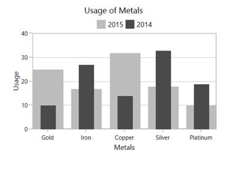

# Side By Side Placement in WPF Charts (SfChart)

It defines the placement pattern of bar type series like Column, Bar, RangeColumn, etc. 

It is a Boolean property and its default value is true so the segment will be placed adjacent to each other (Clustered).

The following code example and image illustrates the placement of series while setting [`SideBySideSeriesPlacement`](https://help.syncfusion.com/cr/wpf/Syncfusion.UI.Xaml.Charts.ChartBase.html#Syncfusion_UI_Xaml_Charts_ChartBase_SideBySideSeriesPlacement) as false.





<chart:SfChart x:Name="columnChart" AreaBorderBrush="DarkGray" 

Header="Usage of Metals"  

SideBySideSeriesPlacement="False"

AreaBorderThickness="1,1,1,1">

<chart:SfChart.PrimaryAxis>

<chart:CategoryAxis  Header="Metals"/>

</chart:SfChart.PrimaryAxis>

<chart:SfChart.SecondaryAxis>

<chart:NumericalAxis Header="Usage" />                            

</chart:SfChart.SecondaryAxis>

<chart:SfChart.Legend>

<chart:ChartLegend Visibility="Visible" />

</chart:SfChart.Legend>

<chart:ColumnSeries Interior="#bcbcbc"

ItemsSource="{Binding SneakersDetail}" Label="2015"  

XBindingPath="Brand" 

YBindingPath="ItemsCount" />

<chart:ColumnSeries ItemsSource="{Binding SneakersDetail}"  

SegmentSpacing="0.5"

Interior="#4a4a4a"  XBindingPath="Brand" 

Label="2014" YBindingPath="postion"/>            

</chart:SfChart>





SfChart chart = new SfChart();

chart.Header = "Usage of Metals";

chart.AreaBorderBrush = new SolidColorBrush(Colors.DarkGray);

chart.SideBySideSeriesPlacement = false;

chart.AreaBorderThickness = new Thickness(1);

chart.PrimaryAxis = new CategoryAxis()
{

    Header = "Medals"

};

chart.SecondaryAxis = new NumericalAxis()
{

    Header = "Usage"

};

chart.Legend = new ChartLegend()
{

    Visibility = Visibility.Visible

};

ColumnSeries columnSeries1 = new ColumnSeries()
{

    ItemsSource = new ViewModel().SneakersDetail,

    XBindingPath = "Brand",

    YBindingPath = "ItemsCount",

    Label = "2015",

    Interior = new SolidColorBrush(Color.FromRgb(0xbc, 0xbc, 0xbc)),

};

ColumnSeries columnSeries2 = new ColumnSeries()
{

    ItemsSource = new ViewModel().SneakersDetail,

    XBindingPath = "Brand",

    YBindingPath = "Position",

    Label = "2014",

    SegmentSpacing = 0.5,

    Interior = new SolidColorBrush(Color.FromRgb(0x4a, 0x4a, 0x4a)),

};

chart.Series.Add(columnSeries1);

chart.Series.Add(columnSeries2);





N> As the series will be placed one over the other(overlapped), to differentiate between the series the `SegmentSpacing` is used.
