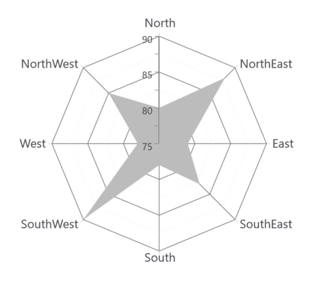
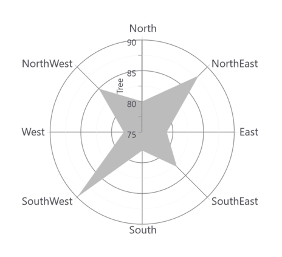
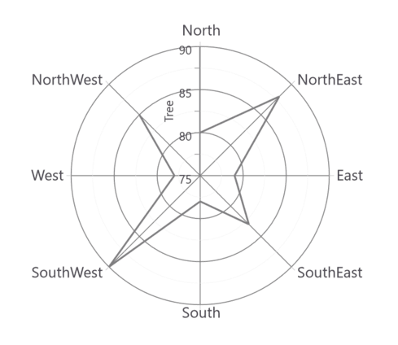

# Radar and Polar in WPF Charts (SfChart)

## Radar Chart

[`RadarSeries`](https://help.syncfusion.com/cr/wpf/Syncfusion.UI.Xaml.Charts.RadarSeries.html#) represents a collection of data, displayed by quantitative variables, represented by axes starting from the same point. The relative position and angle of the axes is not uniform. 

The following code example illustrates the use of radar series:





<chart:RadarSeries ItemsSource="{Binding PlantDetails}" 

Interior="#BCBCBC"

XBindingPath="Direction"

YBindingPath="Tree" >

</chart:RadarSeries>        





RadarSeries series = new RadarSeries()
{

    ItemsSource = new ViewModel().PlantDetails,

    XBindingPath = "Direction",

    YBindingPath = "Tree",

    Interior = new SolidColorBrush(Color.FromRgb(0xBC, 0xBC, 0XBC))

};

chart.Series.Add(series);





N> You can explore our [WPF Radar Chart](https://www.syncfusion.com/wpf-controls/charts/wpf-radar-chart) feature tour page for its groundbreaking features.You can also explore our [WPF Radar Chart example](https://github.com/syncfusion/wpf-demos/blob/master/chart/Views/Polar%20and%20Radar%20Chart/RadarChart.xaml) to know how to represent time-dependent data, showing trends in data at equal intervals.

## Polar Chart

[`PolarSeries`](https://help.syncfusion.com/cr/wpf/Syncfusion.UI.Xaml.Charts.PolarSeries.html#) displays data points that are grouped by category, on a 360 degree circle. The following code example shows how to use polar series.





<chart:PolarSeries Interior="#4A4A4A" 

ItemsSource="{Binding PlantDetails}"  

XBindingPath="Direction"

YBindingPath="Tree" />                 





PolarSeries series = new PolarSeries()
{

    ItemsSource = new ViewModel().PlantDetails,

    XBindingPath = "Direction",

    YBindingPath = "Tree",

    Interior = new SolidColorBrush(Color.FromRgb(0x4A, 0x4A, 0X4A))

};

chart.Series.Add(series);





The Radar and Polar charts having the following properties in common:

* [`IsClosed`](https://help.syncfusion.com/cr/wpf/Syncfusion.UI.Xaml.Charts.PolarRadarSeriesBase.html#Syncfusion_UI_Xaml_Charts_PolarRadarSeriesBase_IsClosed)
* [`DrawType`](https://help.syncfusion.com/cr/wpf/Syncfusion.UI.Xaml.Charts.PolarRadarSeriesBase.html#Syncfusion_UI_Xaml_Charts_PolarRadarSeriesBase_DrawType)
* `PolarAngle`

### IsClosed

This property used to draw the closed path as below.





<chart:PolarSeries x:Name="series1" Interior="#4A4A4A" 

ItemsSource="{Binding PlantDetails}"  

Label="Amount Spent" DrawType="Line" IsClosed="False" 

XBindingPath="Direction" YBindingPath="Tree" 

StrokeThickness="2" />





PolarSeries series = new PolarSeries()
{

    ItemsSource = new ViewModel().PlantDetails,

    XBindingPath = "Direction",

    YBindingPath = "Tree",

    IsClosed = false,

    DrawType = ChartSeriesDrawType.Line,

    Label = "Amount Spent",

    StrokeThickness = 2,

    Interior = new SolidColorBrush(Color.FromRgb(0x4A, 0x4A, 0X4A))

};

chart.Series.Add(series);





### DrawType

This property defines type of curve, whether its [`Line`](https://help.syncfusion.com/cr/wpf/Syncfusion.UI.Xaml.Charts.ChartSeriesDrawType.html) or [`Area`](https://help.syncfusion.com/cr/wpf/Syncfusion.UI.Xaml.Charts.ChartSeriesDrawType.html).

**DrawType** **as** **Area**





<chart:PolarSeries x:Name="series1" Interior="#4A4A4A" 

ItemsSource="{Binding PlantDetails}"  

DrawType="Area" IsClosed="True" 

XBindingPath="Direction" YBindingPath="Tree" />





PolarSeries series = new PolarSeries()
{

    ItemsSource = new ViewModel().PlantDetails,

    XBindingPath = "Direction",

    YBindingPath = "Tree",

    IsClosed = True,

    DrawType = ChartSeriesDrawType.Area,

    Interior = new SolidColorBrush(Color.FromRgb(0x4A, 0x4A, 0X4A))

};

chart.Series.Add(series);





**DrawType** **as** **Line**





<chart:PolarSeries x:Name="series1" Interior="#4A4A4A" 

ItemsSource="{Binding PlantDetails}"  

DrawType="Line" IsClosed="True" 

XBindingPath="Direction" YBindingPath="Tree" 

StrokeThickness="2" />





PolarSeries series = new PolarSeries()
{

    ItemsSource = new ViewModel().PlantDetails,

    XBindingPath = "Direction",

    YBindingPath = "Tree",

    IsClosed = True,

    DrawType = ChartSeriesDrawType.Line,

    StrokeThickness = 2,

    Interior = new SolidColorBrush(Color.FromRgb(0x4A, 0x4A, 0X4A))

};

chart.Series.Add(series);





### Polar Angle

[`Chart axis`](https://help.syncfusion.com/wpf/charts/axis) provides support to render polar and radar series on 0,90,180 and 270 degrees. It can be achieved by its `PolarAngle` property.The `PolarAngle` is type of `ChartPolarAngle` and its default value is `Rotate270`.`Rotate0`, `Rotate90` and `Rotate180` are another supported values of `PolarAngle`. Both the primary and secondary axes can be rotated individually based on its `PolarAngle` value.

**Rotate0**

The below snippet explains how the axes of series has been rotated when `PolarAngle` value is [`Rotate0`](https://help.syncfusion.com/cr/wpf/Syncfusion.UI.Xaml.Charts.ChartPolarAngle.html),





<chart:SfChart.PrimaryAxis>

<chart:CategoryAxis  PolarAngle="Rotate0"/>

</chart:SfChart.PrimaryAxis>

<chart:SfChart.SecondaryAxis>

<chart:NumericalAxis PolarAngle="Rotate0"/>

</chart:SfChart.SecondaryAxis>





 chart.PrimaryAxis = new CategoryAxis()

 {

    PolarAngle = ChartPolarAngle.Rotate0

 };

chart.SecondaryAxis = new NumericalAxis()

{

    PolarAngle = ChartPolarAngle.Rotate0
            
};





**Rotate90**

The below snippet explains how the axes of series has been rotated when `PolarAngle` value is [`Rotate90`](https://help.syncfusion.com/cr/wpf/Syncfusion.UI.Xaml.Charts.ChartPolarAngle.html),





<chart:SfChart.PrimaryAxis>

<chart:CategoryAxis  PolarAngle="Rotate90"/>

</chart:SfChart.PrimaryAxis>

<chart:SfChart.SecondaryAxis>

<chart:NumericalAxis PolarAngle="Rotate90"/>

</chart:SfChart.SecondaryAxis>





 chart.PrimaryAxis = new CategoryAxis()

 {

    PolarAngle = ChartPolarAngle.Rotate90

 };

chart.SecondaryAxis = new NumericalAxis()

{

    PolarAngle = ChartPolarAngle.Rotate90
            
};





**Rotate180**

The below snippet explains how the axes of series has been rotated when `PolarAngle` value is [`Rotate180`](https://help.syncfusion.com/cr/wpf/Syncfusion.UI.Xaml.Charts.ChartPolarAngle.html),





<chart:SfChart.PrimaryAxis>

<chart:CategoryAxis  PolarAngle="Rotate180"/>

</chart:SfChart.PrimaryAxis>

<chart:SfChart.SecondaryAxis>

<chart:NumericalAxis PolarAngle="Rotate180"/>

</chart:SfChart.SecondaryAxis>





 chart.PrimaryAxis = new CategoryAxis()

 {

    PolarAngle = ChartPolarAngle.Rotate180

 };

chart.SecondaryAxis = new NumericalAxis()

{

    PolarAngle = ChartPolarAngle.Rotate180
            
};





**Rotate270**

The below snippet explains how the axes of series has been rotated, when `PolarAngle` value is [`Rotate270`](https://help.syncfusion.com/cr/wpf/Syncfusion.UI.Xaml.Charts.ChartPolarAngle.html),





<chart:SfChart.PrimaryAxis>

<chart:CategoryAxis  PolarAngle="Rotate270"/>

</chart:SfChart.PrimaryAxis>

<chart:SfChart.SecondaryAxis>

<chart:NumericalAxis PolarAngle="Rotate270"/>

</chart:SfChart.SecondaryAxis>





 chart.PrimaryAxis = new CategoryAxis()

 {

    PolarAngle = ChartPolarAngle.Rotate270

 };

chart.SecondaryAxis = new NumericalAxis()

{

    PolarAngle = ChartPolarAngle.Rotate270
            
};





N> You can explore our [WPF Polar Chart](https://www.syncfusion.com/wpf-controls/charts/wpf-polar-chart) feature tour page for its groundbreaking features.You can also explore our [WPF Polar Chart example](https://github.com/syncfusion/wpf-demos/blob/master/chart/Views/Polar%20and%20Radar%20Chart/PolarChart.xaml) to know how to render and configure the polar line type charts.