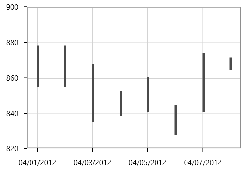
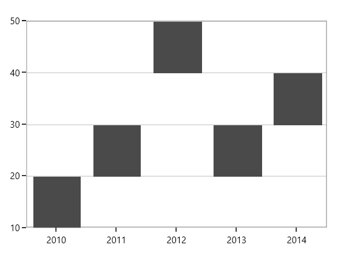
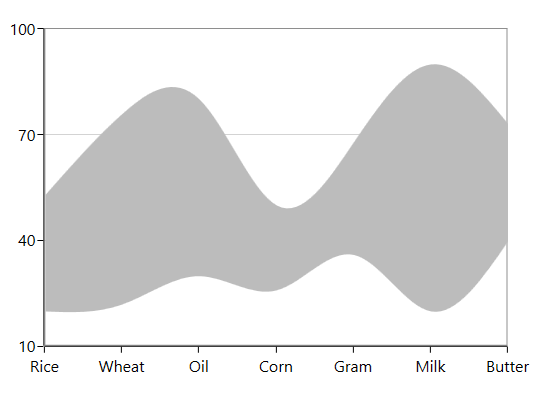

# Range in WPF Charts (SfChart)

## HiLo Chart

In [`HiLoSeries`](https://help.syncfusion.com/cr/wpf/Syncfusion.UI.Xaml.Charts.HiLoSeries.html#), each segment is represented by a line. The height of the line depends on the value of the data point, high or low. The values for this series can be bind using [`High`](https://help.syncfusion.com/cr/wpf/Syncfusion.UI.Xaml.Charts.RangeSeriesBase.html#Syncfusion_UI_Xaml_Charts_RangeSeriesBase_High) and [`Low`](https://help.syncfusion.com/cr/wpf/Syncfusion.UI.Xaml.Charts.RangeSeriesBase.html#Syncfusion_UI_Xaml_Charts_RangeSeriesBase_Low).

The following code example shows the use of HiLo series:





<chart:HiLoSeries Name="series" Interior="#4A4A4A" 

ItemsSource="{Binding StockPriceDetails}" 

XBindingPath="Date" StrokeThickness="3" 

High="High" Low="Low" />





HiLoSeries series = new HiLoSeries()
{

    ItemsSource = new ViewModel().StockPriceDetails,

    XBindingPath = "Date",

    High = "High", Low = "Low",

    StrokeThickness = 3,

    Interior = new SolidColorBrush(Color.FromRgb(0x4A, 0x4A, 0X4A))

};

chart.Series.Add(series);





## Range Column Chart

[`RangeColumnSeries`](https://help.syncfusion.com/cr/wpf/Syncfusion.UI.Xaml.Charts.RangeColumnSeries.html#) is a collection of vertical columns where positioning and height depends on the high and low values of each data point. RangeColumnSeries is used when minimum and maximum need to be specified for the ColumnSeries.





<chart:RangeColumnSeries ItemsSource="{Binding FinancialDatas}" 

XBindingPath="Time" Interior="#4A4A4A"

High="High" Low="Low"  />





RangeColumnSeries series = new RangeColumnSeries()
{

    ItemsSource = new ViewModel().FinancialDatas,

    XBindingPath = "Time",

    High = "High", Low = "Low",

    Interior = new SolidColorBrush(Color.FromRgb(0x4A, 0x4A, 0x4A))

};

chart.Series.Add(series);





## Range Area Chart

[`RangeAreaSeries`](https://help.syncfusion.com/cr/wpf/Syncfusion.UI.Xaml.Charts.RangeAreaSeries.html#) is used to display continuous data points as a set of lines that vary between [`High`](https://help.syncfusion.com/cr/wpf/Syncfusion.UI.Xaml.Charts.RangeSeriesBase.html#Syncfusion_UI_Xaml_Charts_RangeSeriesBase_High) and [`Low`](https://help.syncfusion.com/cr/wpf/Syncfusion.UI.Xaml.Charts.RangeSeriesBase.html#Syncfusion_UI_Xaml_Charts_RangeSeriesBase_Low) values over intervals of time and across different categories. 





<chart:RangeAreaSeries  XBindingPath="ProdName" 

High="Stock" Low="Price"   

Interior="#BCBCBC"        

ItemsSource="{Binding Products}" />





RangeAreaSeries series = new RangeAreaSeries()
{

    ItemsSource = new ViewModel().Products,

    XBindingPath = "ProdName",

    High = "Stock", Low = "Price",

    Interior = new SolidColorBrush(Color.FromRgb(0xBC, 0xBC, 0xBC))

};

chart.Series.Add(series);





The APIs present in the RangeArea series are,

* [`HighValueInterior`](https://help.syncfusion.com/cr/wpf/Syncfusion.UI.Xaml.Charts.RangeAreaSeries.html#Syncfusion_UI_Xaml_Charts_RangeAreaSeries_HighValueInterior) -Gets or sets the brush that represents the interior color for the high value data.
* [`LowValueInterior`](https://help.syncfusion.com/cr/wpf/Syncfusion.UI.Xaml.Charts.RangeAreaSeries.html#Syncfusion_UI_Xaml_Charts_RangeAreaSeries_LowValueInterior)- Gets or sets the brush that represents the interior color for the low value data.





<chart:RangeAreaSeries x:Name="RangeAreaSeries" XBindingPath="ProdName" 

High="Stock" Low="Price"   

LowValueInterior="#4A4A4A"

HighValueInterior="#777777"

ItemsSource="{Binding Products}" />





RangeAreaSeries series = new RangeAreaSeries()
{

    ItemsSource = new ViewModel().Products,

    XBindingPath = "ProdName",

    High = "Stock", Low = "Price",

    HighValueInterior = new SolidColorBrush(Color.FromRgb(0x77, 0x77, 0x77)),

    LowValueInterior = new SolidColorBrush(Color.FromRgb(0x4A, 0x4A, 0x4A))

};

chart.Series.Add(series);





## Spline Range Area Chart

[`SplineRangeAreaSeries`](https://help.syncfusion.com/cr/wpf/Syncfusion.UI.Xaml.Charts.SplineRangeAreaSeries.html#) is used to display continuous data points as smooth Bezier curves that vary between [`High`](https://help.syncfusion.com/cr/wpf/Syncfusion.UI.Xaml.Charts.RangeSeriesBase.html#Syncfusion_UI_Xaml_Charts_RangeSeriesBase_High) and [`Low`](https://help.syncfusion.com/cr/wpf/Syncfusion.UI.Xaml.Charts.RangeSeriesBase.html#Syncfusion_UI_Xaml_Charts_RangeSeriesBase_Low) values over intervals of time and across different categories. 





<chart:SplineRangeAreaSeries ItemsSource = "{Binding Products}"

                             XBindingPath="ProdName" 

                             High="Stock" 

                             Low="Price"

                             Interior="#BCBCBC" />





SplineRangeAreaSeries splineRangeAreaSeries = new SplineRangeAreaSeries();

splineRangeAreaSeries.ItemsSource = new ViewModel().Products;

splineRangeAreaSeries.XBindingPath = "ProdName";

splineRangeAreaSeries.High = "Stock";

splineRangeAreaSeries.Low = "Price";

splineRangeAreaSeries.Interior = new SolidColorBrush(Color.FromRgb(0xBC, 0xBC, 0xBC));

chart.Series.Add(splineRangeAreaSeries);





