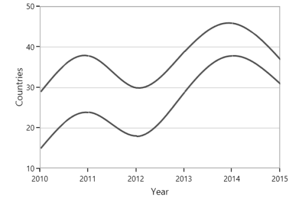
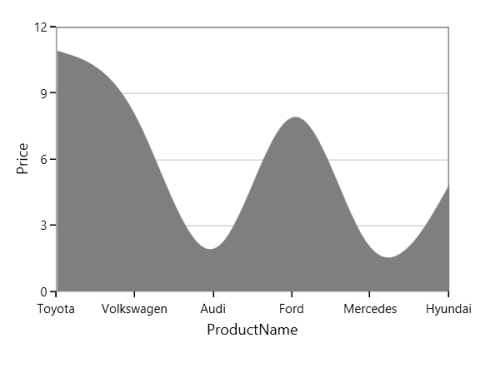

# Spline in WPF Charts (SfChart)

## Spline Chart

[`SplineSeries`](https://help.syncfusion.com/cr/wpf/Syncfusion.UI.Xaml.Charts.SplineSeries.html#) resembles line series, but the difference between them is that instead of connecting the data points with line segments, the data points are connected by smooth Bezier curves.





<chart:SplineSeries  XBindingPath="Year"     

ItemsSource="{Binding List}" YBindingPath="India"               

Interior="#4A4A4A"/>

<chart:SplineSeries  XBindingPath="Year"     

ItemsSource="{Binding List}" YBindingPath="America"               

Interior="#4A4A4A"/>





SplineSeries series1 = new SplineSeries()
{

    ItemsSource = new ViewModel().List,

    XBindingPath = "Year",

    YBindingPath = "India",

    Interior = new SolidColorBrush(Color.FromRgb(0x4A, 0x4A, 0x4A))

};

SplineSeries series2 = new SplineSeries()
{

    ItemsSource = new ViewModel().List,

    XBindingPath = "Year",

    YBindingPath = "America",

    Interior = new SolidColorBrush(Color.FromRgb(0x4A, 0x4A, 0x4A))

};

chart.Series.Add(series1);

chart.Series.Add(series2);





**Dashed Lines**

[`StrokeDashArray`](https://help.syncfusion.com/cr/wpf/Syncfusion.UI.Xaml.Charts.SplineSeries.html#Syncfusion_UI_Xaml_Charts_SplineSeries_StrokeDashArray) property of the [`SplineSeries`](https://help.syncfusion.com/cr/wpf/Syncfusion.UI.Xaml.Charts.SplineSeries.html#) is used to render spline series with dashes.





<chart:SplineSeries ItemsSource="{Binding List}" XBindingPath="Year" YBindingPath="India" StrokeDashArray="5,3" />





SplineSeries series = new SplineSeries()
{
    ItemsSource = new ViewModel().List,
    XBindingPath = "Year",
    YBindingPath = "India"
};

DoubleCollection doubleCollection = new DoubleCollection();
doubleCollection.Add(5);
doubleCollection.Add(3);
series.StrokeDashArray = doubleCollection;
chart.Series.Add(series);





N> You can explore our [WPF Spline Chart](https://www.syncfusion.com/wpf-controls/charts/wpf-spline-chart) feature tour page for its groundbreaking features. You can also explore our [WPF Spline Chart example](https://github.com/syncfusion/wpf-demos/blob/master/chart/Views/Basic%20Charts/Spline%20Area/SplineArea.xaml) to know how to displays multiple series of data as spline.

## Spline Area Chart

[`SplineAreaSeries`](https://help.syncfusion.com/cr/wpf/Syncfusion.UI.Xaml.Charts.SplineAreaSeries.html#) connects a series of data points using smooth Bezier line curves, with the underlying areas filled. 





<chart:SplineAreaSeries Interior="#7F7F7F"              

ItemsSource="{Binding Products}" XBindingPath="ProdName"     

YBindingPath="Price" />





SplineAreaSeries series = new SplineAreaSeries()
{

    ItemsSource = new ViewModel().Products,

    XBindingPath = "ProdName",

    YBindingPath = "Price",

    Interior = new SolidColorBrush(Color.FromRgb(0x7F, 0x7F, 0x7F))

};

chart.Series.Add(series);





N> You can explore our [WPF Spline Area Chart](https://www.syncfusion.com/wpf-controls/charts/wpf-spline-area-chart) feature tour page for its groundbreaking features. You can also explore our [WPF Spline Area Chart example](https://github.com/syncfusion/wpf-demos/blob/master/chart/Views/Basic%20Charts/SplineArea.xaml) to know how to displays multiple series of data as spline area.

## Spline Type

[`Spline`](https://help.syncfusion.com/cr/wpf/Syncfusion.UI.Xaml.Charts.SplineSeries.html) and [`SplineArea`](https://help.syncfusion.com/cr/wpf/Syncfusion.UI.Xaml.Charts.SplineAreaSeries.html) series provide support for various spline type. The spline type of the series can be changed by using its [`SplineType`](https://help.syncfusion.com/cr/wpf/Syncfusion.UI.Xaml.Charts.SplineSeries.html#Syncfusion_UI_Xaml_Charts_SplineSeries_SplineType) property. The following spline types are supported by Spline and SplineArea series:

* [`Natural`](https://help.syncfusion.com/cr/wpf/Syncfusion.UI.Xaml.Charts.SplineType.html#Syncfusion_UI_Xaml_Charts_SplineType_Natural) 
* [`Monotonic`](https://help.syncfusion.com/cr/wpf/Syncfusion.UI.Xaml.Charts.SplineType.html#Syncfusion_UI_Xaml_Charts_SplineType_Monotonic) 
* [`Cardinal`](https://help.syncfusion.com/cr/wpf/Syncfusion.UI.Xaml.Charts.SplineType.html#Syncfusion_UI_Xaml_Charts_SplineType_Cardinal)
* [`Clamped`](https://help.syncfusion.com/cr/wpf/Syncfusion.UI.Xaml.Charts.SplineType.html#Syncfusion_UI_Xaml_Charts_SplineType_Clamped)

**Cardinal**

The cardinal spline algorithm ensures that the resulting curve passes through each data point, while also providing a smooth and visually appealing interpolation with continuous derivatives up to a certain order at each point.

The following code illustrates how to set the [`SplineType`](https://help.syncfusion.com/cr/wpf/Syncfusion.UI.Xaml.Charts.SplineSeries.html#Syncfusion_UI_Xaml_Charts_SplineSeries_SplineType) value as [`Cardinal`](https://help.syncfusion.com/cr/wpf/Syncfusion.UI.Xaml.Charts.SplineType.html#Syncfusion_UI_Xaml_Charts_SplineType_Cardinal).





<chart:SplineSeries SplineType="Cardinal">

</chart:SplineSeries>





SplineSeries series = new SplineSeries();

series.SplineType = SplineType.Cardinal;





**Monotonic**

The monotonic spline algorithm ensures that the resulting curve is non-decreasing (or non-increasing) between each pair of adjacent points. This means that if the data points increase (or decrease) monotonically, the resulting curve will follow the same trend without any oscillations or inflections.

The following code illustrates how to set the [`SplineType`](https://help.syncfusion.com/cr/wpf/Syncfusion.UI.Xaml.Charts.SplineSeries.html#Syncfusion_UI_Xaml_Charts_SplineSeries_SplineType) value as Monotonic.





<chart:SplineSeries SplineType="Monotonic">

</chart:SplineSeries>





SplineSeries series = new SplineSeries();

series.SplineType = SplineType.Monotonic;





**Clamped**

The clamped splines algorithm ensures that the resulting curve passes through the first and last data points and has a specified slope or curvature at these endpoints, thus ensuring that the curve is well-behaved at the boundaries and does not exhibit any unusual behavior.

The following code illustrates how to set the [`SplineType`](https://help.syncfusion.com/cr/wpf/Syncfusion.UI.Xaml.Charts.SplineSeries.html#Syncfusion_UI_Xaml_Charts_SplineSeries_SplineType) value as Clamped.





<chart:SplineSeries SplineType="Clamped">

</chart:SplineSeries>





SplineSeries series = new SplineSeries();

series.SplineType = SplineType.Clamped;





