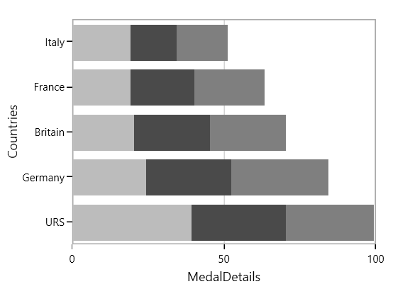

# Stacking Charts in WPF Chart (SfChart)

## Stacking Line

[`StackingLineSeries`](https://help.syncfusion.com/cr/cref_files/wpf/Syncfusion.SfChart.WPF~Syncfusion.UI.Xaml.Charts.StackingLineSeries.html) resembles multiple types of series of the [`LineSeries`](https://help.syncfusion.com/cr/cref_files/wpf/Syncfusion.SfChart.WPF~Syncfusion.UI.Xaml.Charts.LineSeries.html). Each series is vertically stacked one above the other. When there is only one series, then it is [`LineSeries`](https://help.syncfusion.com/cr/cref_files/wpf/Syncfusion.SfChart.WPF~Syncfusion.UI.Xaml.Charts.LineSeries.html). 

The following code example illustrates how to use [`StackingLineSeries`](https://help.syncfusion.com/cr/cref_files/wpf/Syncfusion.SfChart.WPF~Syncfusion.UI.Xaml.Charts.StackingLineSeries.html):





<chart:StackingLineSeries  

XBindingPath="MonthlyExpenses"    

YBindingPath="Father" 

Interior="#4A4A4A"

ItemsSource="{Binding Data}"/>

<chart:StackingLineSeries

XBindingPath="MonthlyExpenses" 

YBindingPath="Mother"

Interior="#BCBCBC"

ItemsSource="{Binding Data}"/> 

<chart:StackingLineSeries 

XBindingPath="MonthlyExpenses" 

YBindingPath="Son"

Interior="#7F7F7F"

ItemsSource="{Binding Data}" />





StackingLineSeries series1 = new StackingLineSeries()
{

    ItemsSource = new ViewModel().Data,

    XBindingPath = "MonthlyExpenses",

    YBindingPath ="Father",

    Interior = new SolidColorBrush(Color.FromRgb(0x4A, 0x4A, 0X4A))

};

StackingLineSeries series2 = new StackingLineSeries()
{

    ItemsSource = new ViewModel().Data,

    XBindingPath = "MonthlyExpenses",

    YBindingPath = "Mother",

    Interior = new SolidColorBrush(Color.FromRgb(0xBC, 0xBC, 0XBC))

};

StackingLineSeries series3 = new StackingLineSeries()
{

    ItemsSource = new ViewModel().Data,

    XBindingPath = "MonthlyExpenses",

    YBindingPath = "Son",

    Interior = new SolidColorBrush(Color.FromRgb(0x7F, 0x7F, 0X7F))

};

chart.Series.Add(series1);

chart.Series.Add(series2);

chart.Series.Add(series3);





## Stacking Line 100

[`StackingLine100Series`](https://help.syncfusion.com/cr/cref_files/wpf/Syncfusion.SfChart.WPF~Syncfusion.UI.Xaml.Charts.StackingLine100Series.html) resembles [`StackingLinenSeries`](https://help.syncfusion.com/cr/cref_files/wpf/Syncfusion.SfChart.WPF~Syncfusion.UI.Xaml.Charts.StackingLineSeries.html) but the cumulative portion of each stacked element always comes to a total of 100%. 





<chart:StackingLine100Series ItemsSource="{Binding Data}" 

XBindingPath="MonthlyExpenses" 

YBindingPath="Father" 

Interior="#4A4A4A"
/>

<chart:StackingLine100Series ItemsSource="{Binding Data}"

XBindingPath="MonthlyExpenses"  

YBindingPath="Mother"

Interior="#BCBCBC"/>

<chart:StackingLine100Series ItemsSource="{Binding Data}"

XBindingPath="MonthlyExpenses" 

YBindingPath="Son"

Interior="#7F7F7F"/>





StackingLine100Series series1 = new StackingLine100Series()
{

    ItemsSource = new ViewModel().Data,

    XBindingPath = "MonthlyExpenses",

    YBindingPath = "Father",

    Interior = new SolidColorBrush(Color.FromRgb(0x4A, 0x4A, 0X4A))

};

StackingLine100Series series2 = new StackingLine100Series()
{

    ItemsSource = new ViewModel().Data,

    XBindingPath = "MonthlyExpenses",

    YBindingPath = "Mother",

    Interior = new SolidColorBrush(Color.FromRgb(0xBC, 0xBC, 0XBC))

};

StackingLine100Series series3 = new StackingLine100Series()
{

    ItemsSource = new ViewModel().Data,

    XBindingPath = "MonthlyExpenses",

    YBindingPath = "Son",

    Interior = new SolidColorBrush(Color.FromRgb(0x7F, 0x7F, 0X7F))

};

chart.Series.Add(series1);

chart.Series.Add(series2);

chart.Series.Add(series3);





## Stacking Column

[`StackingColumnSeries`](https://help.syncfusion.com/cr/cref_files/wpf/Syncfusion.SfChart.WPF~Syncfusion.UI.Xaml.Charts.StackingColumnSeries.html#) resembles multiple types of ColumnSeries. Each series is vertically stacked one above the other. When there is only one series, then it is ColumnSeries. 

The following code example illustrates how to use StackingColumnSeries:





<chart:StackingColumnSeries  

XBindingPath="CountryName"    

YBindingPath="GoldMedals" 

Interior="#4A4A4A"

ItemsSource="{Binding MedalDetails}"/>

<chart:StackingColumnSeries 

Interior="#BCBCBC"

XBindingPath="CountryName" 

YBindingPath="SilverMedals"

ItemsSource="{Binding MedalDetails}"/> 

<chart:StackingColumnSeries 

Interior="#7F7F7F"

XBindingPath="CountryName" 

YBindingPath="BronzeMedals" />





StackingColumnSeries series1 = new StackingColumnSeries()
{

    ItemsSource = new ViewModel().MedalDetails,

    XBindingPath = "CountryName",

    YBindingPath ="GoldMedals",

    Interior = new SolidColorBrush(Color.FromRgb(0x4A, 0x4A, 0X4A))

};

StackingColumnSeries series2 = new StackingColumnSeries()
{

    ItemsSource = new ViewModel().MedalDetails,

    XBindingPath = "CountryName",

    YBindingPath = "SilverMedals",

    Interior = new SolidColorBrush(Color.FromRgb(0xBC, 0xBC, 0XBC))

};

StackingColumnSeries series3 = new StackingColumnSeries()
{

    ItemsSource = new ViewModel().MedalDetails,

    XBindingPath = "CountryName",

    YBindingPath = "BronzeMedals",

    Interior = new SolidColorBrush(Color.FromRgb(0x7F, 0x7F, 0X7F))

};

chart.Series.Add(series1);

chart.Series.Add(series2);

chart.Series.Add(series3);





## Stacking Column 100

[`StackingColumn100Series`](https://help.syncfusion.com/cr/cref_files/wpf/Syncfusion.SfChart.WPF~Syncfusion.UI.Xaml.Charts.StackingColumn100Series.html#) resembles StackingColumnSeries but the cumulative portion of each stacked element always comes to a total of 100%. 





<chart:StackingColumn100Series  XBindingPath="CountryName" 

YBindingPath="GoldMedals" Interior="#4A4A4A"

ItemsSource="{Binding MedalDetails}"/>

<chart:StackingColumn100Series ItemsSource="{Binding MedalDetails}"

XBindingPath="CountryName"  

YBindingPath="SilverMedals"

Interior="#BCBCBC"/>





StackingColumn100Series series1 = new StackingColumn100Series()
{

    ItemsSource = new ViewModel().MedalDetails,

    XBindingPath = "CountryName",

    YBindingPath = "GoldMedals",

    Interior = new SolidColorBrush(Color.FromRgb(0x4A, 0x4A, 0X4A))

};

StackingColumn100Series series2 = new StackingColumn100Series()
{

    ItemsSource = new ViewModel().MedalDetails,

    XBindingPath = "CountryName",

    YBindingPath = "SilverMedals",

    Interior = new SolidColorBrush(Color.FromRgb(0xBC, 0xBC, 0XBC))

};

StackingColumn100Series series3 = new StackingColumn100Series()
{

    ItemsSource = new ViewModel().MedalDetails,

    XBindingPath = "CountryName",

    YBindingPath = "BronzeMedals",

    Interior = new SolidColorBrush(Color.FromRgb(0x7F, 0x7F, 0X7F))

};

chart.Series.Add(series1);

chart.Series.Add(series2);

chart.Series.Add(series3);





## Stacking Bar

[`StackingBarSeries`](https://help.syncfusion.com/cr/cref_files/wpf/Syncfusion.SfChart.WPF~Syncfusion.UI.Xaml.Charts.StackingBarSeries.html#) is a multiple series type of BarSeries. Each BarSeries is then stacked horizontally, side by side to each other. When there exists only one series, it resembles a simple BarSeries. 





<chart:StackingBarSeries XBindingPath="CountryName"        

Interior="#BCBCBC"

YBindingPath="GoldMedals" 

ItemsSource="{Binding MedalDetails}" >

</chart:StackingBarSeries>

<chart:StackingBarSeries Interior="#4A4A4A"

XBindingPath="CountryName" 

YBindingPath="SilverMedals" 

ItemsSource="{Binding MedalDetails}">

</chart:StackingBarSeries>

<chart:StackingBarSeries Interior="#7F7F7F"

XBindingPath="CountryName" 

YBindingPath="BronzeMedals"

ItemsSource="{Binding MedalDetails}" >

</chart:StackingBarSeries>





StackingBarSeries series1 = new StackingBarSeries()
{

    ItemsSource = new ViewModel().MedalDetails,

    XBindingPath = "CountryName",

    YBindingPath = "GoldMedals",

    Interior = new SolidColorBrush(Color.FromRgb(0x4A, 0x4A, 0X4A))

};

StackingBarSeries series2 = new StackingBarSeries()
{

    ItemsSource = new ViewModel().MedalDetails,

    XBindingPath = "CountryName",

    YBindingPath = "SilverMedals",

    Interior = new SolidColorBrush(Color.FromRgb(0xBC, 0xBC, 0XBC))

};

StackingBarSeries series3 = new StackingBarSeries()
{

    ItemsSource = new ViewModel().MedalDetails,

    XBindingPath = "CountryName",

    YBindingPath = "BronzeMedals",

    Interior = new SolidColorBrush(Color.FromRgb(0x7F, 0x7F, 0X7F))

};

chart.Series.Add(series1);

chart.Series.Add(series2);

chart.Series.Add(series3);





## Stacking Bar 100

[`StackingBar100Series`](https://help.syncfusion.com/cr/cref_files/wpf/Syncfusion.SfChart.WPF~Syncfusion.UI.Xaml.Charts.StackingBar100Series.html#) resembles a StackingBarSeries. StackingBar100Series displays multiple series as stacked bars and the cumulative portion of each stacked element is always 100%. 





<chart:StackingBar100Series Interior="#BCBCBC"

XBindingPath="CountryName" 

YBindingPath="GoldMedals" 

ItemsSource="{Binding MedalDetails}" />

<chart:StackingBar100Series Interior="#4A4A4A" 

XBindingPath="CountryName"                          

YBindingPath="SilverMedals" 

ItemsSource="{Binding MedalDetails}" />

<chart:StackingBar100Series Interior="#7F7F7F" 

XBindingPath="CountryName" 

YBindingPath="BronzeMedals" 

ItemsSource="{Binding MedalDetails}" />





StackingBar100Series series1 = new StackingBar100Series()
{

    ItemsSource = new ViewModel().MedalDetails,

    XBindingPath = "CountryName",

    YBindingPath = "GoldMedals",

    Interior = new SolidColorBrush(Color.FromRgb(0x4A, 0x4A, 0X4A))

};

StackingBar100Series series2 = new StackingBar100Series()
{

    ItemsSource = new ViewModel().MedalDetails,

    XBindingPath = "CountryName",

    YBindingPath = "SilverMedals",

    Interior = new SolidColorBrush(Color.FromRgb(0xBC, 0xBC, 0XBC))

};

StackingBar100Series series3 = new StackingBar100Series()
{

    ItemsSource = new ViewModel().MedalDetails,

    XBindingPath = "CountryName",

    YBindingPath = "BronzeMedals",

    Interior = new SolidColorBrush(Color.FromRgb(0x7F, 0x7F, 0X7F))

};

chart.Series.Add(series1);

chart.Series.Add(series2);

chart.Series.Add(series3);





## Stacking Area

[`StackingAreaSeries`](https://help.syncfusion.com/cr/cref_files/wpf/Syncfusion.SfChart.WPF~Syncfusion.UI.Xaml.Charts.StackingAreaSeries.html#) is representing areas stacked vertically one above the other. 





<chart:StackingAreaSeries Interior="#BCBCBC" 

XBindingPath="Month" YBindingPath="Bus" 

ItemsSource="{Binding Accidents}" />

<chart:StackingAreaSeries Interior="#4A4A4A"                  

XBindingPath="Month" YBindingPath="Car" 

ItemsSource="{Binding Accidents}" />

<chart:StackingAreaSeries  Interior="#7F7F7FC"                     

XBindingPath="Month" 

YBindingPath="Truck" 

ItemsSource="{Binding Accidents}" />





StackingAreaSeries series1 = new StackingAreaSeries()
{

    ItemsSource = new ViewModel().Accidents,

    XBindingPath = "Month",

    YBindingPath = "Bus",

    Interior = new SolidColorBrush(Color.FromRgb(0x4A, 0x4A, 0X4A))

};

StackingAreaSeries series2 = new StackingAreaSeries()
{

    ItemsSource = new ViewModel().Accidents,

    XBindingPath = "Month",

    YBindingPath = "Car",

    Interior = new SolidColorBrush(Color.FromRgb(0xBC, 0xBC, 0XBC))

};

StackingAreaSeries series3 = new StackingAreaSeries()
{

    ItemsSource = new ViewModel().Accidents,

    XBindingPath = "Month",

    YBindingPath = "Truck",

    Interior = new SolidColorBrush(Color.FromRgb(0x7F, 0x7F, 0X7F))

};

chart.Series.Add(series1);

chart.Series.Add(series2);

chart.Series.Add(series3);





## Stacking Area 100

StackingArea100Series is similar to StackingAreaSeries, but the cumulative portion of each stacked element always totals 100%. 

The following code example shows the way to add stacking area 100 series:





<chart:StackingArea100Series Interior="#BCBCBC" 

XBindingPath="Month"         

YBindingPath="Bus" 

ItemsSource="{Binding Accidents}" 

/>

<chart:StackingArea100Series Interior="#4A4A4A" 

XBindingPath="Month" YBindingPath="Car" 

ItemsSource="{Binding Accidents}" />

<chart:StackingArea100Series Interior="#7F7F7F" 

XBindingPath="Month" 

YBindingPath="Truck" 

ItemsSource="{Binding Accidents}" />





StackingArea100Series series1 = new StackingArea100Series()
{

    ItemsSource = new ViewModel().Accidents,

    XBindingPath = "Month",

    YBindingPath = "Bus",

    Interior = new SolidColorBrush(Color.FromRgb(0x4A, 0x4A, 0X4A))

};

StackingArea100Series series2 = new StackingArea100Series()
{

    ItemsSource = new ViewModel().Accidents,

    XBindingPath = "Month",

    YBindingPath = "Car",

    Interior = new SolidColorBrush(Color.FromRgb(0xBC, 0xBC, 0XBC))

};

StackingArea100Series series3 = new StackingArea100Series()
{

    ItemsSource = new ViewModel().Accidents,

    XBindingPath = "Month",

    YBindingPath = "Truck",

    Interior = new SolidColorBrush(Color.FromRgb(0x7F, 0x7F, 0X7F))

};

chart.Series.Add(series1);

chart.Series.Add(series2);

chart.Series.Add(series3);





You can draw open curve like Area using this [`IsClosed`](https://help.syncfusion.com/cr/cref_files/wpf/Syncfusion.SfChart.WPF~Syncfusion.UI.Xaml.Charts.StackingAreaSeries~IsClosed.html#) property.





<chart:StackingAreaSeries  Interior="#BCBCBC" Stroke="Black" StrokeThickness="3"

IsClosed="False" XBindingPath="Month" 

YBindingPath="Bus" 

ItemsSource="{Binding Accidents}"/>

<chart:StackingAreaSeries  Interior="#777777" Stroke="White" StrokeThickness="3"

IsClosed="False"  XBindingPath="Month"             

YBindingPath="Car"

ItemsSource="{Binding Accidents}"/>

<chart:StackingAreaSeries  Interior="#7F7F7F" Stroke="Black"   

StrokeThickness="3" IsClosed="False"   

XBindingPath="Month" 

YBindingPath="Truck" 

ItemsSource="{Binding Accidents}" />





StackingAreaSeries series1 = new StackingAreaSeries()
{

    ItemsSource = new ViewModel().Accidents,

    XBindingPath = "Month",

    YBindingPath = "Bus",

    Stroke = new SolidColorBrush(Colors.Black),

    StrokeThickness = 3,

    IsClosed = false,

    Interior = new SolidColorBrush(Color.FromRgb(0xBC, 0xBC, 0XBC))

};

StackingAreaSeries series2 = new StackingAreaSeries()
{

    ItemsSource = new ViewModel().Accidents,

    XBindingPath = "Month",

    YBindingPath = "Car",

    Stroke = new SolidColorBrush(Colors.White),

    StrokeThickness = 3,

    IsClosed = false,

    Interior = new SolidColorBrush(Color.FromRgb(0x77, 0x77, 0X77))

};

StackingAreaSeries series3 = new StackingAreaSeries()
{

    ItemsSource = new ViewModel().Accidents,

    XBindingPath = "Month",

    YBindingPath = "Truck",

    Stroke = new SolidColorBrush(Colors.Black),

    StrokeThickness = 3,

    IsClosed = false,

    Interior = new SolidColorBrush(Color.FromRgb(0x7F, 0x7F, 0X7F))

};

chart.Series.Add(series1);

chart.Series.Add(series2);

chart.Series.Add(series3);





