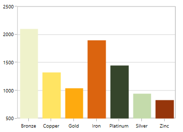
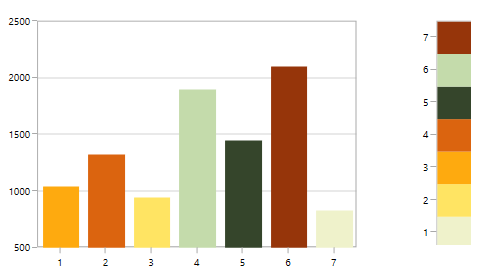

# Sorting in WPF Charts (SfChart)

Chart provides support for sorting data points either in ascending or descending order based on X or Y axis.

### Enable Sorting
The [`IsSortData`](https://help.syncfusion.com/cr/wpf/Syncfusion.UI.Xaml.Charts.ChartSeriesBase.html#Syncfusion_UI_Xaml_Charts_ChartSeriesBase_IsSortData) property is used to enable sorting in series.

### Changing sorting direction

The [`SortDirection`](https://help.syncfusion.com/cr/wpf/Syncfusion.UI.Xaml.Charts.ChartSeriesBase.html#Syncfusion_UI_Xaml_Charts_ChartSeriesBase_SortDirection) property defines the direction of sorting either in [`Ascending`](https://help.syncfusion.com/cr/wpf/Syncfusion.UI.Xaml.Charts.Direction.html) or [`Descending`](https://help.syncfusion.com/cr/wpf/Syncfusion.UI.Xaml.Charts.Direction.html) order based on X or Y value.

### Changing sorting axis

The [`SortBy`](https://help.syncfusion.com/cr/wpf/Syncfusion.UI.Xaml.Charts.ChartSeriesBase.html#Syncfusion_UI_Xaml_Charts_ChartSeriesBase_SortBy) property decides whether sorting should be done based on [`X`](https://help.syncfusion.com/cr/wpf/Syncfusion.UI.Xaml.Charts.SortingAxis.html) or [`Y`](https://help.syncfusion.com/cr/wpf/Syncfusion.UI.Xaml.Charts.SortingAxis.html) values.

The following example illustrates a simple chart (without applying sorting):

## Sorting for category(non-linear) axis

**Sorting x axis in ascending order**:




<syncfusion:ColumnSeries IsSortData="True" SortBy="X"  
                         SortDirection="Ascending"
                         ItemsSource="{Binding Demands}" Interior="#4A4A4A"
                         XBindingPath="Demand"  YBindingPath="Year2011"/>



ColumnSeries columnSeries = new ColumnSeries()
{
    IsSortData = true,
    SortBy = SortingAxis.X,
    SortDirection = Direction.Ascending,
    ItemsSource = new ViewModel().Demands,
    XBindingPath = "Demand",
    YBindingPath = "Year2011",
    Interior = new SolidColorBrush(Color.FromRgb(0x4A, 0x4A, 0x4A))
};

chart.Series.Add(columnSeries);




**Sorting x axis in descending order**:




<syncfusion:ColumnSeries IsSortData="True" SortBy="X"  
                         SortDirection="Descending"
                         ItemsSource="{Binding Demands}" Interior="#4A4A4A"
                         XBindingPath="Demand"  YBindingPath="Year2011"/>



ColumnSeries columnSeries = new ColumnSeries()
{
    IsSortData = true,
    SortBy = SortingAxis.X,
    SortDirection = Direction.Descending,
    ItemsSource = new ViewModel().Demands,
    XBindingPath = "Demand",
    YBindingPath = "Year2011",
    Interior = new SolidColorBrush(Color.FromRgb(0x4A, 0x4A, 0x4A))
};

chart.Series.Add(columnSeries);




**Sorting y axis in ascending order**:




<syncfusion:ColumnSeries IsSortData="True" SortBy="Y" 
                         SortDirection="Ascending"
                         ItemsSource="{Binding Demands}" Interior="#4A4A4A"
                         XBindingPath="Demand"  YBindingPath="Year2011"/>



ColumnSeries columnSeries = new ColumnSeries()
{
    IsSortData = true,
    SortBy = SortingAxis.Y,
    SortDirection = Direction.Ascending,
    ItemsSource = new ViewModel().Demands,
    XBindingPath = "Demand",
    YBindingPath = "Year2011",
    Interior = new SolidColorBrush(Color.FromRgb(0x4A, 0x4A, 0x4A))
};

chart.Series.Add(columnSeries);




**Sorting y axis in descending order**:




<syncfusion:ColumnSeries IsSortData="True" SortBy="Y"  
                         SortDirection="Descending"
                         ItemsSource="{Binding Demands}" Interior="#4A4A4A"
                         XBindingPath="Demand"  YBindingPath="Year2011"/>



ColumnSeries columnSeries = new ColumnSeries()
{
    IsSortData = true,
    SortBy = SortingAxis.Y,
    SortDirection = Direction.Descending,
    ItemsSource = new ViewModel().Demands,
    XBindingPath = "Demand",
    YBindingPath = "Year2011",
    Interior = new SolidColorBrush(Color.FromRgb(0x4A, 0x4A, 0x4A))
};

chart.Series.Add(columnSeries);




N> This feature is primarily applicable for indexed (non-linear) axis like CategoryAxis. For linear axis like NumericalAxis, only the order of rendering will be sorted. i.e., the order in which the data point is being rendered.

## Sorting for linear axis

As mentioned above, the sorting for the linear axis is different from CategoryAxis. Here the rendering order of the data points (x or y) will be sorted.

This is especially useful when you have one or more values added in the same data point. Also, this rendering order will be captured by applying a Palette to each point.

The following example illustrates a simple chart having AutumnBrights palette (without applying sorting):

**Sorting x axis in ascending order**




<syncfusion:ColumnSeries IsSortData="True" SortBy="X" Palette="AutumnBrights"
                         SortDirection="Ascending"
                         ItemsSource="{Binding Demands}" 
                         XBindingPath="Position"  YBindingPath="Year2011"/>



ColumnSeries columnSeries = new ColumnSeries()
{
    IsSortData = true,
    SortBy = SortingAxis.X,
    SortDirection = Direction.Ascending,
    Palette = ChartColorPalette.AutumnBrights,
    ItemsSource = new ViewModel().Demands,
    XBindingPath = "Position",
    YBindingPath = "Year2011",
    Interior = new SolidColorBrush(Color.FromRgb(0x4A, 0x4A, 0x4A))
};

chart.Series.Add(columnSeries);




**Sorting x axis in descending order**




<syncfusion:ColumnSeries IsSortData="True" SortBy="X" 
                         Palette="AutumnBrights"
                         SortDirection="Descending"
                         ItemsSource="{Binding Demands}" 
                         XBindingPath="Position"  YBindingPath="Year2011"/>



ColumnSeries columnSeries = new ColumnSeries()
{
    IsSortData = true,
    SortBy = SortingAxis.X,
    SortDirection = Direction.Descending,
    Palette = ChartColorPalette.AutumnBrights,
    ItemsSource = new ViewModel().Demands,
    XBindingPath = "Position",
    YBindingPath = "Year2011",
    Interior = new SolidColorBrush(Color.FromRgb(0x4A, 0x4A, 0x4A))
};

chart.Series.Add(columnSeries);




**Sorting y axis in ascending order**




<syncfusion:ColumnSeries IsSortData="True" SortBy="Y" 
                         Palette="AutumnBrights"
                         SortDirection="Ascending"
                         ItemsSource="{Binding Demands}" 
                         XBindingPath="Position"  YBindingPath="Year2011"/>



ColumnSeries columnSeries = new ColumnSeries()
{
    IsSortData = true,
    SortBy = SortingAxis.Y,
    SortDirection = Direction.Ascending,
    Palette = ChartColorPalette.AutumnBrights,
    ItemsSource = new ViewModel().Demands,
    XBindingPath = "Position",
    YBindingPath = "Year2011",
    Interior = new SolidColorBrush(Color.FromRgb(0x4A, 0x4A, 0x4A))
};

chart.Series.Add(columnSeries);




**Sorting y axis in descending order**




<syncfusion:ColumnSeries IsSortData="True" SortBy="Y" 
                         Palette="AutumnBrights"
                         SortDirection="Descending"
                         ItemsSource="{Binding Demands}" 
                         XBindingPath="Position"  YBindingPath="Year2011"/>



ColumnSeries columnSeries = new ColumnSeries()
{
    IsSortData = true,
    SortBy = SortingAxis.Y,
    SortDirection = Direction.Descending,
    Palette = ChartColorPalette.AutumnBrights,
    ItemsSource = new ViewModel().Demands,
    XBindingPath = "Position",
    YBindingPath = "Year2011",
    Interior = new SolidColorBrush(Color.FromRgb(0x4A, 0x4A, 0x4A))
};

chart.Series.Add(columnSeries);




N> You can refer to our [WPF Charts](https://www.syncfusion.com/wpf-controls/charts) feature tour page for its groundbreaking feature representations. You can also explore our [WPF Charts example](https://github.com/syncfusion/wpf-demos) to know various chart types and how to easily configure them with built-in support for creating stunning visual effects.