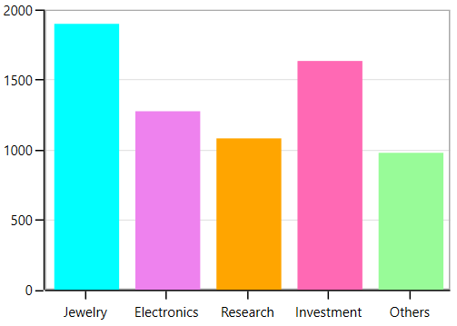

# Styling and Customization

SfChart supports various customizing and styling options that allows you to enrich the application.

## Palettes

SfChart provides options to apply different kinds of themes or palettes to your chart. You can define [`Palette`](https://help.syncfusion.com/cr/cref_files/wpf/Syncfusion.SfChart.WPF~Syncfusion.UI.Xaml.Charts.ChartBase~Palette.html) either for the entire chart or for an individual series.

We have some predefined palette such as

* Metro
* AutumnBrights
* FloraHues
* Pineapple
* TomotoSpectrum
* RedChrome
* PurpleChrome
* BlueChrome
* GreenChrome
* Elite
* LightCandy
* SandyBeach

N> Elite, SandyBeach and LightCandy palettes are not supported in the bitmap series types.

### Applying Palette to Series

Each palette applies a set of predefined brushes to the series in a predefined order. The following code example shows you how to set the Metro Palette for the chart series.





<chart:SfChart Height="250" Width="350" Palette="Metro"  >





chart.Palette = ChartColorPalette.Metro;





The following code example defined Palette as [`BlueChrome`](https://help.syncfusion.com/cr/cref_files/wpf/Syncfusion.SfChart.WPF~Syncfusion.UI.Xaml.Charts.ChartColorPalette.html).





<chart:SfChart Height="250" Width="350" Palette="BlueChrome">





chart.Palette = ChartColorPalette.BlueChrome;





### Applying Palette to Segment

Each palette applies a set of predefined brushes to the segment in a predefined order. The following code example shows you how to set the Metro Palette for the chart series.





<chart:DoughnutSeries YBindingPath="Percentage" Palette="Metro"

XBindingPath="Category" ItemsSource="{Binding Tax}" />





DoughnutSeries series = new DoughnutSeries()

{

    ItemsSource = new ViewModel().Tax,

    XBindingPath = "Category",

    YBindingPath = "Percentage",

    Palette = ChartColorPalette.Metro

};

chart.Series.Add(series);





The following code example defined Palette as **AutumnBrights**.





<chart:DoughnutSeries   YBindingPath="Percentage" Palette="AutumnBrights"

XBindingPath="Category" ItemsSource="{Binding Tax}" />





DoughnutSeries series = new DoughnutSeries()

{

    ItemsSource = new ViewModel().Tax,

    XBindingPath = "Category",

    YBindingPath = "Percentage",

    Palette = ChartColorPalette.AutumnBrights

};

chart.Series.Add(series);





N> Metro palette is the default palette for both Series and Segment.

## Custom Palette

SfChart provides option which enables you to define your own color brushes with your preferred order for the Palette, using [`ColorModel`](https://help.syncfusion.com/cr/cref_files/wpf/Syncfusion.SfChart.WPF~Syncfusion.UI.Xaml.Charts.ChartSeriesBase~ColorModel.html#) as shown in the following code example.





<chart:DoughnutSeries  YBindingPath="Percentage" Palette="Custom"

XBindingPath="Category" ItemsSource="{Binding Tax}" >   

<chart:DoughnutSeries.ColorModel>

<chart:ChartColorModel>

<chart:ChartColorModel.CustomBrushes>

<SolidColorBrush Color="Cyan"/>

<SolidColorBrush Color="DarkCyan"/>                                                

</chart:ChartColorModel.CustomBrushes>

</chart:ChartColorModel>

</chart:DoughnutSeries.ColorModel>

</chart:DoughnutSeries>





ChartColorModel colorModel = new ChartColorModel();

colorModel.CustomBrushes.Add(new SolidColorBrush(Colors.Cyan));

colorModel.CustomBrushes.Add(new SolidColorBrush(Colors.DarkCyan));

DoughnutSeries series = new DoughnutSeries()
{

    ItemsSource = new ViewModel().Tax,

    XBindingPath = "Category",

    YBindingPath = "Percentage",

    Palette = ChartColorPalette.Custom,

    ColorModel = colorModel

};

chart.Series.Add(series);





You can define the custom palette for series as in the below code example:





<chart:SfChart Height="250" Width="350" Palette="Custom">

<chart:SfChart.ColorModel>

<chart:ChartColorModel>

<chart:ChartColorModel.CustomBrushes>

<SolidColorBrush Color="BlueViolet"/>

<SolidColorBrush Color="PeachPuff"/>

<SolidColorBrush Color="Purple"/>

</chart:ChartColorModel.CustomBrushes>

</chart:ChartColorModel>

</chart:SfChart.ColorModel>

</chart:SfChart>





chart.Palette = ChartColorPalette.Custom;

ChartColorModel colorModel = new ChartColorModel();

colorModel.CustomBrushes.Add(new SolidColorBrush(Colors.BlueViolet));

colorModel.CustomBrushes.Add(new SolidColorBrush(Colors.PeachPuff));

colorModel.CustomBrushes.Add(new SolidColorBrush(Colors.Purple));

chart.ColorModel = colorModel;





## SegmentColorPath

The color of the chart segments can be updated by binding their corresponding model property from the `ItemsSource` collection to its [`SegmentColorPath`](https://help.syncfusion.com/cr/cref_files/wpf/Syncfusion.SfChart.WPF~Syncfusion.UI.Xaml.Charts.ChartSeriesBase~SegmentColorPath.html) property of series as follows.





<chart:ColumnSeries ItemsSource="{Binding Data}"
                    XBindingPath="XValue" 
                    YBindingPath="YValue" 
                    SegmentColorPath="SegmentColor">
                    
</chart:ColumnSeries>





public class ViewModel
{
    public ObservableCollection<Model> Data { get; set; }

    public ViewModel()
    {
        Data = new ObservableCollection<Model>();
        Data.Add(new Model() { XValue = "Jewelry", YValue = 10, 
                    SegmentColor = new SolidColorBrush(Color.FromArgb(255, 0, 255, 255)) });
        Data.Add(new Model() { XValue = "Electronics", YValue = 50,
                    SegmentColor = new SolidColorBrush(Color.FromArgb(255, 238, 130, 238))});
        Data.Add(new Model() { XValue = "Research", YValue = 30, 
                    SegmentColor = new SolidColorBrush(Color.FromArgb(255, 255, 165, 0)) });
        Data.Add(new Model() { XValue = "Investment", YValue = 40, 
                    SegmentColor = new SolidColorBrush(Color.FromArgb(255, 255, 105, 180)) });
        Data.Add(new Model() { XValue = "Others", YValue = 20,
                    SegmentColor = new SolidColorBrush(Color.FromArgb(255, 152, 251, 152)) });
    }
}

ColumnSeries series = new ColumnSeries()
{
    ItemsSource = viewModel.Data,
    XBindingPath = "XValue",
    YBindingPath = "YValue",
    SegmentColorPath = "SegmentColor"
};





N> `SegmentColorPath` property is not applicable for Area, SplineArea, StepArea, RangeArea, FastLine, Candle, HiLoOpenClose, and CircularSeries (when the Polar and Radar DrawType are Area).

## Customize Legends

SfChart provides many options to customize the chart legends. Basically it is an ItemsControl. So, you can customize the ItemTemplate, ItemsPanel, etc.

The following code example demonstrates applying the palette color to the legend icon interior.





<chart:SfChart.Legend>

<chart:ChartLegend DockPosition="Left" >

<chart:ChartLegend.ItemTemplate>

<DataTemplate>

<StackPanel Orientation="Horizontal">

<Grid Margin="20,0,0,0">

<Grid.ColumnDefinitions>

<ColumnDefinition/>

<ColumnDefinition/>

</Grid.ColumnDefinitions>

<Ellipse Width="10" Height="10" 

Fill="{Binding Interior}">

<Ellipse.Effect>

<DropShadowEffect Direction="315" 

BlurRadius="0.8"   

ShadowDepth="3" 

Color="Black"/>

</Ellipse.Effect>

</Ellipse>

<TextBlock Margin="5,0,0,0" 

FontSize="10"  

Grid.Column="1" 

Foreground="Black" 

Text="{Binding Label}"></TextBlock>

</Grid>

</StackPanel>

</DataTemplate>

</chart:ChartLegend.ItemTemplate>

</chart:ChartLegend>

</chart:SfChart.Legend>





chart.Legend = new ChartLegend()
{

   DockPosition = ChartDock.Left,

   ItemTemplate = chart.Resources["itemTemplate"] as DataTemplate

};





If you are having more number of items in the legend, you can override the ItemsPanel and add ScrollViewer. So that you can able to scroll the legend items. Please refer [this](https://www.syncfusion.com/kb/6157/how-to-add-multiple-legend-items-in-scrollviewer#) kb for more details.

## Customize ToolTip

SfChart provides the option to define your own template for Tooltip. The following code example demonstrates the custom tooltip using the [`TooltipTemplate`](https://help.syncfusion.com/cr/cref_files/wpf/Syncfusion.SfChart.WPF~Syncfusion.UI.Xaml.Charts.ChartSeriesBase~TooltipTemplate.html#) property.





<chart:BarSeries ItemsSource="{Binding CategoricalDatas}"  

chart:ChartTooltip.ShowDuration="5000"

XBindingPath="Category" YBindingPath="Value" 

ShowTooltip="True"  Palette="FloraHues" >

<chart:BarSeries.TooltipTemplate>

<DataTemplate >

<Border BorderBrush="Black" BorderThickness="1">

<Grid  Height="40">

<Grid.RowDefinitions>

<RowDefinition Height="0.5*"/>

<RowDefinition Height="0.5*"/>

</Grid.RowDefinitions>

<Grid.ColumnDefinitions>

<ColumnDefinition/>

<ColumnDefinition/>

<ColumnDefinition/>

</Grid.ColumnDefinitions>

<Rectangle Fill="White" Grid.RowSpan="2" 

Grid.ColumnSpan="3" ></Rectangle>

<Image Grid.RowSpan="2" Grid.Column="0" 

HorizontalAlignment="Left" Margin="3" 

Source="{Binding Item.ImagePath}" ></Image>

<TextBlock Margin="3,3,6,3" Text="{Binding Item.Category }" 

FontSize="10" Grid.Column="1" 

Grid.ColumnSpan="2" 

HorizontalAlignment="Left"

VerticalAlignment="Center" TextAlignment="Center" 

Foreground="Black" />

<TextBlock VerticalAlignment="Center" Margin="3,3,6,3" 

Grid.Column="2" Grid.Row="1" 

TextAlignment="Left" Text="{Binding Item.Value}" 

HorizontalAlignment="Left" 

Foreground="Black" FontSize="10"/>

<TextBlock VerticalAlignment="Center" 

Grid.Column="1" Grid.Row="1" 

TextAlignment="Left" Text="Value:"

HorizontalAlignment="Left" 

Foreground="Black" FontSize="10"/>

</Grid>

</Border>

</DataTemplate>

</chart:BarSeries.TooltipTemplate>

</chart:BarSeries>





BarSeries series = new BarSeries()
{

    ItemsSource = new ViewModel().CategoricalDatas,

    XBindingPath = "Category",

    YBindingPath = "Value",

    Palette = ChartColorPalette.FloraHues,

    ShowTooltip = true,

    TooltipTemplate = chart.Resources["tooltipTemplate"] as DataTemplate

};

ChartTooltip.SetShowDuration(series, 5000);

chart.Series.Add(series);





## Customize Series

CustomTemplate property is used to customize the chart series. It supports the following series

* BarSeries
* BubbleSeries
* ColumnSeries
* LineSeries
* ScatterSeries
* SplineSeries
* StackingBarSeries
* StackingBar100Series
* StackingColumnSeries
* StackingColumn100Series
* StepLineSeries
* FastLineSeries
* RangeColumnSeries

The respective segment of each series will be your DataTemplate context, which contains the following properties in common. This will be used to plot the custom shapes for the series.

* [`XData`](https://help.syncfusion.com/cr/cref_files/wpf/Syncfusion.SfChart.WPF~Syncfusion.UI.Xaml.Charts.ColumnSegment~XData.html#)-Returns the actual X value of the segment.
* [`YData`](https://help.syncfusion.com/cr/cref_files/wpf/Syncfusion.SfChart.WPF~Syncfusion.UI.Xaml.Charts.ColumnSegment~YData.html#)-Returns the actual Y value of the segment.
* [`Item`](https://help.syncfusion.com/cr/cref_files/wpf/Syncfusion.SfChart.WPF~Syncfusion.UI.Xaml.Charts.ChartSegment~Item.html#)-Returns the underlying model object of the segment.
* [`Interior`](https://help.syncfusion.com/cr/cref_files/wpf/Syncfusion.SfChart.WPF~Syncfusion.UI.Xaml.Charts.ChartSegment~Interior.html#)-Returns the brush color of the segment.

The following code example illustrates the use of [`CustomTemplate`](https://help.syncfusion.com/cr/cref_files/wpf/Syncfusion.SfChart.WPF~Syncfusion.UI.Xaml.Charts.ColumnSeries~CustomTemplate.html#) property:





 <syncfusion:SfChart x:Name="chart">

     <syncfusion:SfChart.Resources>

            <local:ScatterInteriorConverter x:Key="scatterInteriorConverter"/>

            <local:ScatterAngleConverter x:Key="scatterAngleConverter"/>

            <DataTemplate x:Key="seriesTemplate">

                <Canvas>

                    <Path Fill="{Binding Converter={StaticResource scatterInteriorConverter}}"
                              
                          Stretch="Fill" Height="{Binding ScatterHeight}"
                              
                          Width="{Binding ScatterWidth}" RenderTransformOrigin="0.5,0.5"
                              
                          Canvas.Left="{Binding RectX}" Canvas.Top="{Binding RectY}"
                              
                          Data="M20.125,32L0.5,12.375L10.3125,12.375L10.3125,
                              
                              0.5L29.9375,0.5L29.9375,12.375L39.75,12.375z">

                          <Path.RenderTransform>

                                <RotateTransform Angle="{Binding Converter={StaticResource scatterAngleConverter}}"/>

                          </Path.RenderTransform>

                        </Path>

                    </Canvas>

                </DataTemplate>

    </syncfusion:SfChart.Resources>

    <syncfusion:ScatterSeries  ScatterHeight="20" ScatterWidth="20" Interior="Gray"
                                       
                                XBindingPath="Year" YBindingPath="Count" 
                                       
                                ItemsSource="{Binding Data}"
                                
                                CustomTemplate="{StaticResource seriesTemplate}"/>

</syncfusion:SfChart>





ScatterSeries series = new ScatterSeries()
{

    ItemsSource = new ViewModel().Data,

    XBindingPath = "Year",

    YBindingPath = "Count",

    ScatterHeight = 20,

    ScatterWidth = 20,

    Interior = new SolidColorBrush(Colors.DarkGray),

    CustomTemplate = chart.Resources["seriesTemplate"] as DataTemplate

};

chart.Series.Add(series);





The BarSeries, BubbleSeries, ColumnSeries, LineSeries, ScatterSeries and StepLineSeries have been customized using the [`CustomTemplate`](https://help.syncfusion.com/cr/cref_files/wpf/Syncfusion.SfChart.WPF~Syncfusion.UI.Xaml.Charts.ColumnSeries~CustomTemplate.html#) property. Refer to this [`sample`](https://github.com/SyncfusionExamples/how-to-customize-the-chart-series-in-wpf-sfchart) for complete series CustomTemplate.

    