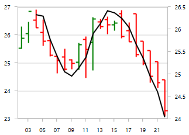
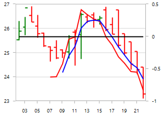

# Technical Indicators in WPF Charts (SfChart)

Technical indicators are the base of technical analysis, which are used to determine the future market trends. 

## Adding Technical Indicators to the Chart

Technical indicator merely an another type meta series. The following steps illustrates how to add the technical indicators to the chart:

### Initializing Indicator

Create the instance for any technical indicator and add it to the [`TechnicalIndicators`](https://help.syncfusion.com/cr/wpf/Syncfusion.UI.Xaml.Charts.SfChart.html#Syncfusion_UI_Xaml_Charts_SfChart_TechnicalIndicators) collection. 

Here for instance, the [Accumulation Distribution](#accumulationdistributionindicator) is added.





<chart:SfChart.TechnicalIndicators>

<chart:AccumulationDistributionIndicator>

</chart:AccumulationDistributionIndicator>

</chart:SfChart.TechnicalIndicators>





AccumulationDistributionIndicator indicator = new AccumulationDistributionIndicator();

chart.TechnicalIndicators.Add(indicator);





### Binding the Data

Next you need to bind the property path for the [`Open`](https://help.syncfusion.com/cr/wpf/Syncfusion.UI.Xaml.Charts.FinancialTechnicalIndicator.html#Syncfusion_UI_Xaml_Charts_FinancialTechnicalIndicator_Open), [`High`](https://help.syncfusion.com/cr/wpf/Syncfusion.UI.Xaml.Charts.FinancialTechnicalIndicator.html#Syncfusion_UI_Xaml_Charts_FinancialTechnicalIndicator_High), [`Low`](https://help.syncfusion.com/cr/wpf/Syncfusion.UI.Xaml.Charts.FinancialTechnicalIndicator.html#Syncfusion_UI_Xaml_Charts_FinancialTechnicalIndicator_Low) and [`Close`](https://help.syncfusion.com/cr/wpf/Syncfusion.UI.Xaml.Charts.FinancialTechnicalIndicator.html#Syncfusion_UI_Xaml_Charts_FinancialTechnicalIndicator_Close) along with x value binding property.





<chart:SfChart.TechnicalIndicators>

<chart:AccumulationDistributionIndicator Open="Open" Close="Close" High="High" Low="Low">                    

</chart:AccumulationDistributionIndicator>

</chart:SfChart.TechnicalIndicators>





AccumulationDistributionIndicator indicator = new AccumulationDistributionIndicator()
{

    Open = "Open", Close = "Close",

    High = "High", Low = "Low"

};

chart.TechnicalIndicators.Add(indicator);





### Specifying the ItemsSource





<chart:SfChart.TechnicalIndicators>

<chart:AccumulationDistributionIndicator Open="Open" Close="Close"      High="High" 

Low="Low"  ItemsSource="{Binding StockPriceDetails}" 

XBindingPath="Date">                    

</chart:AccumulationDistributionIndicator>

</chart:SfChart.TechnicalIndicators>





AccumulationDistributionIndicator indicator = new AccumulationDistributionIndicator()
{

    ItemsSource = new ViewModel().StockPriceDetails,

    XBindingPath = "Date",

    Open = "Open", Close = "Close",

    High = "High", Low = "Low"

};

chart.TechnicalIndicators.Add(indicator);





The following sections covers all the different types of technical indicators available in SfChart.

Most of the indicators are having the [`Period`](https://help.syncfusion.com/cr/wpf/Syncfusion.UI.Xaml.Charts.AverageTrueRangeIndicator.html#Syncfusion_UI_Xaml_Charts_AverageTrueRangeIndicator_Period) and [`SignalLineColor`](https://help.syncfusion.com/cr/wpf/Syncfusion.UI.Xaml.Charts.AverageTrueRangeIndicator.html#Syncfusion_UI_Xaml_Charts_AverageTrueRangeIndicator_SignalLineColor) properties as common, in which Period property indicates the moving average period and the SignalLineColor defines the color for the respective indicator line.

## Average True Range

You can define the [`AverageTrueRangeIndicator`](https://help.syncfusion.com/cr/wpf/Syncfusion.UI.Xaml.Charts.AverageTrueRangeIndicator.html#) using the following code example





<chart:SfChart.TechnicalIndicators>

<chart:AverageTrueRangeIndicator ItemsSource="{Binding  ViewModel1}"    

Period="3" XBindingPath="Date" Volume="Volume"

SignalLineColor="Black" High="High" Low="Low"

Open="Open" Close="Close"/ >

</chart:SfChart.TechnicalIndicators>





AverageTrueRangeIndicator indicator = new AverageTrueRangeIndicator()
{

    ItemsSource = new ViewModel().StockPriceDetails,

    XBindingPath = "Date",

    Open = "Open", Close = "Close",

    High = "High", Low = "Low",

    Volume ="Volume", Period = 3,

    SignalLineColor = new SolidColorBrush(Colors.Black)

};

chart.TechnicalIndicators.Add(indicator);





## Simple Average 

The following code example demonstrates the usage of [`SimpleAverageIndicator`](https://help.syncfusion.com/cr/wpf/Syncfusion.UI.Xaml.Charts.SimpleAverageIndicator.html#).





<chart:SfChart.TechnicalIndicators>

<chart:SimpleAverageIndicator ItemsSource="{Binding  ViewModel1}"  Period="3"     

SignalLineColor="Black" XBindingPath="Date" 

Volume="Volume"  

High="High" Low="Low" Open="Open" Close="Close" >

</chart:SimpleAverageIndicator >

</chart:SfChart.TechnicalIndicators>





SimpleAverageIndicator indicator = new SimpleAverageIndicator()
{

    ItemsSource = new ViewModel().StockPriceDetails,

    XBindingPath = "Date",

    Open = "Open", Close = "Close",

    High = "High", Low = "Low",

    Volume ="Volume", Period = 3,

    SignalLineColor = new SolidColorBrush(Colors.Black)

};

chart.TechnicalIndicators.Add(indicator);





## RSI 

The Relative Strength Index(RSI) indicators are having additional two lines other than signal line, which indicate the overbought and oversold region. 

The [`UpperLineColor`](https://help.syncfusion.com/cr/wpf/Syncfusion.UI.Xaml.Charts.RSITechnicalIndicator.html#Syncfusion_UI_Xaml_Charts_RSITechnicalIndicator_UpperLineColor) property is used to define the color for the line indicating overbought region and the [`LowerLineColor`](https://help.syncfusion.com/cr/wpf/Syncfusion.UI.Xaml.Charts.RSITechnicalIndicator.html#Syncfusion_UI_Xaml_Charts_RSITechnicalIndicator_LowerLineColor) property is used to define the color for the line indicating oversold region.

To define the [`RSITechnicalIndicator`](https://help.syncfusion.com/cr/wpf/Syncfusion.UI.Xaml.Charts.RSITechnicalIndicator.html#), you can use the following code example:





<chart:SfChart.TechnicalIndicators>

<chart:RSITechnicalIndicator 

ItemsSource="{Binding  ViewModel1}"  Period="3"   

SignalLineColor="Black" XBindingPath="Date" Volume="Volume"  

UpperLineColor="Blue" LowerLineColor="Red"                  

High="High" Low="Low" Open="Open" Close="Close"/>

</chart:SfChart.TechnicalIndicators>





RSITechnicalIndicator indicator = new RSITechnicalIndicator()
{

    ItemsSource = new ViewModel().StockPriceDetails,

    XBindingPath = "Date",

    Open = "Open", Close = "Close",

    High = "High", Low = "Low",

    Volume ="Volume", Period = 3,

    SignalLineColor = new SolidColorBrush(Colors.Black),

    UpperLineColor = new SolidColorBrush(Colors.Blue),

    LowerLineColor = new SolidColorBrush(Colors.Red)

};

chart.TechnicalIndicators.Add(indicator);





## Momentum 

This indicator is having two lines momentum line and center line. No signal line is in this indicator. You can define momentum technical indicator using the following code example.

The [`MomentumLineColor`](https://help.syncfusion.com/cr/wpf/Syncfusion.UI.Xaml.Charts.MomentumTechnicalIndicator.html#Syncfusion_UI_Xaml_Charts_MomentumTechnicalIndicator_MomentumLineColor) property and [`CenterLineColor`](https://help.syncfusion.com/cr/wpf/Syncfusion.UI.Xaml.Charts.MomentumTechnicalIndicator.html#Syncfusion_UI_Xaml_Charts_MomentumTechnicalIndicator_CenterLineColor) property are used to define the color for the momentum and center line respectively.





<chart:SfChart.TechnicalIndicators>

<chart:MomentumTechnicalIndicator ItemsSource="{Binding  ViewModel1}"     

Period="3" CenterLineColor="Blue" XBindingPath="Date"        

Volume="Volume" MomentumLineColor="Black"

High="High" Low="Low" Open="Open" Close="Close"/ >

</chart:SfChart.TechnicalIndicators>





MomentumTechnicalIndicator indicator = new MomentumTechnicalIndicator()
{

    ItemsSource = new ViewModel().StockPriceDetails,

    XBindingPath = "Date",

    Open = "Open", Close = "Close",

    High = "High", Low = "Low",

    Volume ="Volume", Period = 3,

    MomentumLineColor = new SolidColorBrush(Colors.Black),

    CenterLineColor = new SolidColorBrush(Colors.Red)

};

chart.TechnicalIndicators.Add(indicator);





## Stochastic 

This indicator is used to measure the range and momentum of price movements. It contains [`KPeriod`](https://help.syncfusion.com/cr/wpf/Syncfusion.UI.Xaml.Charts.StochasticTechnicalIndicator.html#Syncfusion_UI_Xaml_Charts_StochasticTechnicalIndicator_KPeriod) and [`DPeriod`](https://help.syncfusion.com/cr/wpf/Syncfusion.UI.Xaml.Charts.StochasticTechnicalIndicator.html#Syncfusion_UI_Xaml_Charts_StochasticTechnicalIndicator_DPeriod) property defining the ‘K’ percentage and ‘D’ percentage respectively. No signal line in this indicator.

The [`UpperLineColor`](https://help.syncfusion.com/cr/wpf/Syncfusion.UI.Xaml.Charts.StochasticTechnicalIndicator.html#Syncfusion_UI_Xaml_Charts_StochasticTechnicalIndicator_UpperLineColor), [`LowerLineColor`](https://help.syncfusion.com/cr/wpf/Syncfusion.UI.Xaml.Charts.StochasticTechnicalIndicator.html#Syncfusion_UI_Xaml_Charts_StochasticTechnicalIndicator_LowerLineColor) and [`PeriodLineColor`](https://help.syncfusion.com/cr/wpf/Syncfusion.UI.Xaml.Charts.StochasticTechnicalIndicator.html#Syncfusion_UI_Xaml_Charts_StochasticTechnicalIndicator_PeriodLineColor) property are used to define the brushes for the Stochastic indicator lines.

You can define stochastic technical indicator using the following code example:





<chart:SfChart.TechnicalIndicators>

<chart:StochasticTechnicalIndicator ItemsSource="{Binding  ViewModel1}" 

Period="3" SignalLineColor="Black" KPeriod="8" DPeriod="5"

XBindingPath="Date" Volume="Volume" UpperLineColor="Blue"

LowerLineColor="LightBlue" PeriodLineColor="Blue"

High="High" Low="Low" Open="Open" Close="Close"/>

</chart:SfChart.TechnicalIndicators>





StochasticTechnicalIndicator indicator = new StochasticTechnicalIndicator()
{

    ItemsSource = new ViewModel().StockPriceDetails,

    XBindingPath = "Date", Volume = "Volume",

    Open = "Open", Close = "Close",

    High = "High", Low = "Low",

    Period = 3,KPeriod = 8,DPeriod = 5,

    SignalLineColor = new SolidColorBrush(Colors.Black),

    PeriodLineColor = new SolidColorBrush(Colors.Red),

    UpperLineColor = new SolidColorBrush(Colors.Blue),

    LowerLineColor = new SolidColorBrush(Colors.Purple)

};

chart.TechnicalIndicators.Add(indicator);





## Exponential Average

The [`ExponentialAverageIndicator`](https://help.syncfusion.com/cr/wpf/Syncfusion.UI.Xaml.Charts.ExponentialAverageIndicator.html#) is similar to [SimpleAverageIndicator](#_simple-average) and this can be defined using the following code examples.





<chart:SfChart.TechnicalIndicators>

<chart:ExponentialAverageIndicator  ItemsSource="{Binding  ViewModel1}"    

Period="3" XBindingPath="Date" Volume="Volume"

SignalLineColor="Black" High="High" Low="Low"

Open="Open" Close="Close"/ >

</chart:SfChart.TechnicalIndicators>





ExponentialAverageIndicator indicator = new ExponentialAverageIndicator()
{

    ItemsSource = new ViewModel().StockPriceDetails,

    XBindingPath = "Date",

    Open = "Open", Close = "Close",

    High = "High", Low = "Low",

    Volume ="Volume", Period = 3,

    SignalLineColor = new SolidColorBrush(Colors.Black)

};

chart.TechnicalIndicators.Add(indicator);





## Triangular Average 

The [`TriangularAverageIndicator`](https://help.syncfusion.com/cr/wpf/Syncfusion.UI.Xaml.Charts.TriangularAverageIndicator.html#) can be defined as in the following code example.





<chart:SfChart.TechnicalIndicators>

<chart:TriangularAverageIndicator  ItemsSource="{Binding  ViewModel1}"    

Period="3" XBindingPath="Date" Volume="Volume"

SignalLineColor="Black" High="High" Low="Low"

Open="Open" Close="Close"/ >

</chart:SfChart.TechnicalIndicators>





TriangularAverageIndicator indicator = new TriangularAverageIndicator()
{

    ItemsSource = new ViewModel().StockPriceDetails,

    XBindingPath = "Date",

    Open = "Open", Close = "Close",

    High = "High", Low = "Low",

    Volume ="Volume", Period = 3,

    SignalLineColor = new SolidColorBrush(Colors.Black)

};

chart.TechnicalIndicators.Add(indicator);





## Accumulation Distribution 

The following code example help you to add [`AccumulationDistributionIndicator`](https://help.syncfusion.com/cr/wpf/Syncfusion.UI.Xaml.Charts.AccumulationDistributionIndicator.html#).





<chart:SfChart.TechnicalIndicators>

<chart:AccumulationDistributionIndicator 

ItemsSource="{Binding  ViewModel1}" 

XBindingPath="Date" Volume="Volume"    

SignalLineColor="Black" High="High" Low="Low" 

Open="Open" Close="Close" >                 

</chart:AccumulationDistributionIndicator >

</chart:SfChart.TechnicalIndicators>





AccumulationDistributionIndicator indicator = new AccumulationDistributionIndicator()
{

    ItemsSource = new ViewModel().StockPriceDetails,

    XBindingPath = "Date",

    Open = "Open", Close = "Close",

    High = "High", Low = "Low",

    Volume ="Volume", Period = 3,

    SignalLineColor = new SolidColorBrush(Colors.Black)

};

chart.TechnicalIndicators.Add(indicator);





## Bollinger Band

This indicator also having [`UpperLineColor`](https://help.syncfusion.com/cr/wpf/Syncfusion.UI.Xaml.Charts.BollingerBandIndicator.html#Syncfusion_UI_Xaml_Charts_BollingerBandIndicator_UpperLineColor), [`LowerLineColor`](https://help.syncfusion.com/cr/wpf/Syncfusion.UI.Xaml.Charts.BollingerBandIndicator.html#Syncfusion_UI_Xaml_Charts_BollingerBandIndicator_LowerLineColor) and [`SignalLineColor`](https://help.syncfusion.com/cr/wpf/Syncfusion.UI.Xaml.Charts.BollingerBandIndicator.html#Syncfusion_UI_Xaml_Charts_BollingerBandIndicator_SignalLineColor) property for defining the brushes for the indicator lines.

You can define the [`BollingerBandIndicator`](https://help.syncfusion.com/cr/wpf/Syncfusion.UI.Xaml.Charts.BollingerBandIndicator.html#) using the following code example:





<chart:SfChart.TechnicalIndicators>

<chart:BollingerBandIndicator 

ItemsSource="{Binding  ViewModel1}" Period="3"  

UpperLineColor="Blue" LowerLineColor="Red"

XBindingPath="Date" Volume="Volume" SignalLineColor="Black" 

High="High" Low="Low" Open="Open" Close="Close"/>

</chart:SfChart.TechnicalIndicators>





BollingerBandIndicator indicator = new BollingerBandIndicator()
{

    ItemsSource = new ViewModel().StockPriceDetails,

    XBindingPath = "Date",

    Open = "Open", Close = "Close",

    High = "High", Low = "Low",

    Volume ="Volume", Period = 3,

    SignalLineColor = new SolidColorBrush(Colors.Black),

    UpperLineColor = new SolidColorBrush(Colors.Blue),

    LowerLineColor = new SolidColorBrush(Colors.Red)

};

chart.TechnicalIndicators.Add(indicator);





## MACD 

This is mostly using indicator having [`ShortPeriod`](https://help.syncfusion.com/cr/wpf/Syncfusion.UI.Xaml.Charts.MACDTechnicalIndicator.html#Syncfusion_UI_Xaml_Charts_MACDTechnicalIndicator_ShortPeriod) and [`LongPeriod`](https://help.syncfusion.com/cr/wpf/Syncfusion.UI.Xaml.Charts.MACDTechnicalIndicator.html#Syncfusion_UI_Xaml_Charts_MACDTechnicalIndicator_LongPeriod) for defining the motion of the indicator.

Other than signal line, MACD is having convergence and divergence line. The brushes for these lines can be defined using [`ConvergenceLineColor`](https://help.syncfusion.com/cr/wpf/Syncfusion.UI.Xaml.Charts.MACDTechnicalIndicator.html#Syncfusion_UI_Xaml_Charts_MACDTechnicalIndicator_ConvergenceLineColor) and [`DivergenceLineColor`](https://help.syncfusion.com/cr/wpf/Syncfusion.UI.Xaml.Charts.MACDTechnicalIndicator.html#Syncfusion_UI_Xaml_Charts_MACDTechnicalIndicator_DivergenceLineColor).

Also you can draw [`Line`](https://help.syncfusion.com/cr/wpf/Syncfusion.UI.Xaml.Charts.MACDType.html), [`Histogram`](https://help.syncfusion.com/cr/wpf/Syncfusion.UI.Xaml.Charts.MACDType.html) MACD or [`Both`](https://help.syncfusion.com/cr/wpf/Syncfusion.UI.Xaml.Charts.MACDType.html) using the [`Type`](https://help.syncfusion.com/cr/wpf/Syncfusion.UI.Xaml.Charts.MACDTechnicalIndicator.html#Syncfusion_UI_Xaml_Charts_MACDTechnicalIndicator_Type) property, which defines the type of MACD to be drawn.

You can define the [`MACDTechnicalIndicator`](https://help.syncfusion.com/cr/wpf/Syncfusion.UI.Xaml.Charts.MACDTechnicalIndicator.html#) using the following code example:





<chart:SfChart.TechnicalIndicators>

<chart:MACDTechnicalIndicator ItemsSource="{Binding  ViewModel1}" 

Type="Line"  ShortPeriod="2" Period="3" LongPeriod="6"

ConvergenceLineColor="Red" DivergenceLineColor="Blue"

XBindingPath="Date" Volume="Volume" SignalLineColor="Black" 

High="High" Low="Low" Open="Open" Close="Close" >

</chart:MACDTechnicalIndicator >

</chart:SfChart.TechnicalIndicators>





MACDTechnicalIndicator indicator = new MACDTechnicalIndicator()
{

    ItemsSource = new ViewModel().StockPriceDetails,

    XBindingPath = "Date", Volume = "Volume",

    Open = "Open", Close = "Close",

    High = "High", Low = "Low",

    Period = 3, ShortPeriod = 2, LongPeriod = 6,

    Type = MACDType.Line ,

    SignalLineColor = new SolidColorBrush(Colors.Black),

    ConvergenceLineColor = new SolidColorBrush(Colors.Red),

    DivergenceLineColor = new SolidColorBrush(Colors.Blue),

};

chart.TechnicalIndicators.Add(indicator);





